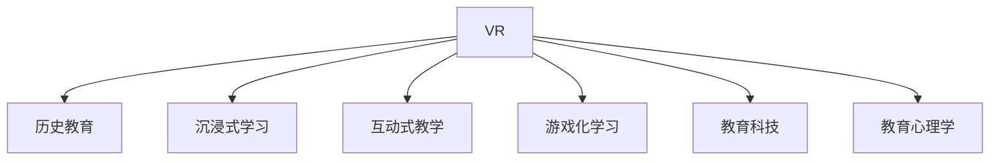

                 

# 虚拟现实历史重现创业：身临其境的历史教育

> 关键词：虚拟现实(VR)、历史教育、身临其境、沉浸式学习、互动式教学、教育科技(EdTech)、游戏化学习

## 1. 背景介绍

### 1.1 问题由来

随着信息技术的快速发展，传统的教学模式已难以满足现代教育的需求。特别是历史教育，其枯燥的叙事方式和静态的图像展示，难以激发学生的学习兴趣和参与感。而虚拟现实（Virtual Reality, VR）技术通过构建高度仿真的3D环境，能够提供沉浸式学习体验，使学生能够身临其境地感受历史事件，提升学习效果。

近年来，VR教育逐渐被各大教育机构和科技公司重视。2017年，谷歌推出Daydream View，让更多人能够通过VR设备体验历史重现；2018年，微软推出HoloLens，提供交互式学习体验；2021年，Unity公司推出HistoriaVR平台，允许用户开发历史教育VR应用。

在创业领域，历史重现VR应用的开发和推广也逐渐成为热点。开发团队从教育技术公司到独立创业者，从科研机构到游戏公司，纷纷加入到这个浪潮中。这些创业公司利用VR技术的沉浸式和互动性，创新性地重现历史事件，为历史教育注入新的活力。

### 1.2 问题核心关键点

虚拟现实历史重现创业的核心在于如何将历史事件以生动、互动、沉浸的方式呈现，结合教育科技(EdTech)的原理，提升学生的学习效果。

具体而言，需要关注以下关键点：
1. 数据采集与处理：收集历史事件、文物、场景等高质量3D数据，并进行预处理，确保模型渲染效果。
2. 交互设计：设计用户与历史场景的互动方式，如点击、滑动、观察等，提升用户体验。
3. 自然语言处理：实现与虚拟角色、文物的语音和文字互动，增强历史学习的交互性。
4. 教育心理学：研究用户的学习行为和心理反应，优化VR历史重现内容的呈现方式。
5. 教育反馈：收集用户对VR历史教育的反馈，不断迭代优化产品。

本文将从技术、教育学、心理学等角度，全面探讨虚拟现实历史重现的创业模式和核心技术。

## 2. 核心概念与联系

### 2.1 核心概念概述

为更好地理解虚拟现实历史重现创业，本节将介绍几个密切相关的核心概念：

- **虚拟现实(VR)**：通过计算机生成一个可交互的三维虚拟世界，提供沉浸式体验。
- **历史教育**：教育科技(EdTech)领域的重要分支，旨在通过技术手段提高历史学习的趣味性和效果。
- **沉浸式学习**：利用VR等技术，提供身临其境的学习体验，提升学习效果。
- **互动式教学**：通过与虚拟场景的互动，增强学生的学习主动性和参与感。
- **游戏化学习**：将学习内容与游戏元素结合，提升学生的学习兴趣和动力。
- **教育科技(EdTech)**：利用科技手段提升教育效果和学习体验的领域。
- **教育心理学**：研究学习行为和心理反应的学科，指导教学内容和方式的优化。

这些核心概念之间的逻辑关系可以通过以下Mermaid流程图来展示：



这个流程图展示了几大核心概念及其之间的关系：

1. VR是实现沉浸式、互动式、游戏化学习的基础工具。
2. 历史教育通过VR技术，创新性地呈现历史内容。
3. 教育科技融合VR和教育内容，提升教育效果。
4. 教育心理学指导VR内容的设计和优化，提升学习效果。

## 3. 核心算法原理 & 具体操作步骤
### 3.1 算法原理概述

虚拟现实历史重现的创业模式，核心在于如何利用VR技术，将历史事件以沉浸式、互动式的方式呈现，提升学生的学习效果。

算法原理主要包括：

1. **数据采集与处理**：收集历史事件、文物、场景等高质量3D数据，并进行预处理，确保模型渲染效果。
2. **交互设计**：设计用户与历史场景的互动方式，如点击、滑动、观察等，提升用户体验。
3. **自然语言处理**：实现与虚拟角色、文物的语音和文字互动，增强历史学习的交互性。
4. **教育心理学**：研究用户的学习行为和心理反应，优化VR历史重现内容的呈现方式。
5. **教育反馈**：收集用户对VR历史教育的反馈，不断迭代优化产品。

这些算法原理共同构成了虚拟现实历史重现创业的完整框架，确保产品能够提供优质的学习体验和效果。

### 3.2 算法步骤详解

#### 3.2.1 数据采集与处理

数据采集与处理是虚拟现实历史重现的基础。具体步骤包括：

1. **3D模型获取**：通过高精度扫描或计算机建模，获取历史事件、文物、场景的3D模型。
2. **纹理贴图**：对3D模型进行纹理贴图，增强模型的逼真度。
3. **预处理**：对模型进行光照、纹理、材质等优化，确保渲染效果流畅。

#### 3.2.2 交互设计

交互设计是提升用户体验的关键。具体步骤包括：

1. **点击交互**：允许用户通过点击交互，触发历史事件的动画或音效。
2. **滑动交互**：允许用户通过滑动交互，展示历史事件的不同视角。
3. **观察交互**：允许用户通过观察交互，获取文物的详细信息和历史背景。

#### 3.2.3 自然语言处理

自然语言处理是增强互动性的重要手段。具体步骤包括：

1. **语音识别**：实现用户与虚拟角色的语音互动，捕捉用户发出的指令。
2. **语音合成**：通过合成虚拟角色的语音，提供历史事件的解说和介绍。
3. **文本互动**：实现用户与文物的文本互动，展示文物的详细说明和历史背景。

#### 3.2.4 教育心理学

教育心理学是优化内容呈现的重要依据。具体步骤包括：

1. **学习行为分析**：通过数据分析，了解用户的学习行为和心理反应。
2. **内容优化**：根据学习行为分析结果，优化VR内容的呈现方式，提升学习效果。
3. **用户反馈**：收集用户对VR教育的反馈，进行迭代优化。

#### 3.2.5 教育反馈

教育反馈是迭代优化的重要手段。具体步骤包括：

1. **问卷调查**：通过问卷调查，收集用户对VR教育内容的反馈。
2. **A/B测试**：通过A/B测试，比较不同呈现方式的效果，优化用户交互方式。
3. **数据分析**：通过数据分析，挖掘用户的学习行为模式，优化教学策略。

### 3.3 算法优缺点

虚拟现实历史重现创业的算法有以下优点：

1. **沉浸式体验**：通过沉浸式3D环境，提供身临其境的历史学习体验，提升学习效果。
2. **互动性强**：通过点击、滑动、观察等多种交互方式，增强学生的学习主动性和参与感。
3. **教学灵活**：通过灵活的交互设计和内容优化，适应不同学生的需求和兴趣。
4. **可扩展性强**：通过模块化的设计，方便添加新的历史事件和文物。

同时，也存在一些缺点：

1. **硬件成本高**：VR设备通常价格较高，普及率低。
2. **技术门槛高**：需要较高的技术储备和专业团队支持，开发难度大。
3. **数据获取难**：高质量的历史数据获取难度大，数据质量和真实性难以保证。
4. **内容质量参差不齐**：部分历史重现内容质量不高，影响用户体验。
5. **教育效果不稳定**：部分学生对VR学习效果期望过高，导致教育效果不稳定。

尽管存在这些局限，但虚拟现实历史重现创业具有巨大的市场潜力和教育价值，值得持续投入和探索。

### 3.4 算法应用领域

虚拟现实历史重现创业可以应用于以下几个领域：

1. **学校教育**：在历史课堂上使用VR历史重现，提供沉浸式学习体验，增强学生的学习兴趣和效果。
2. **博物馆展示**：在博物馆中使用VR历史重现，展示历史文物和事件，提升观众的参观体验。
3. **虚拟旅游**：通过VR技术，重现历史名城、古战场等场景，提供虚拟旅游体验。
4. **历史研究**：在历史研究中，利用VR技术重现历史事件，辅助研究人员进行历史研究和分析。
5. **游戏开发**：在游戏开发中，结合历史内容，提供历史文化主题的互动游戏。

这些领域的应用前景广阔，为虚拟现实历史重现创业提供了丰富的实践场景。

## 4. 数学模型和公式 & 详细讲解  
### 4.1 数学模型构建

在虚拟现实历史重现中，数学模型主要用于数据采集与处理、交互设计、自然语言处理等方面。

以交互设计为例，我们以点击交互为例，假设用户点击历史事件中的某个文物，触发相应的事件动画。点击交互的数学模型可以表示为：

$$
\text{点击事件} = \text{点击位置} \times \text{历史事件模型}
$$

其中，$\text{点击位置}$ 表示用户点击的3D坐标，$\text{历史事件模型}$ 表示文物对应的历史事件。

### 4.2 公式推导过程

以点击交互为例，进行推导：

假设文物的3D坐标为 $(x, y, z)$，点击事件为 $(e_1, e_2, e_3)$，则点击事件的发生概率 $P$ 可以表示为：

$$
P = f(x, y, z; e_1, e_2, e_3)
$$

其中，$f$ 为点击事件的概率密度函数。

进一步，假设点击事件与文物的位置和类型相关，则概率密度函数可以表示为：

$$
P = g(x, y, z; t)
$$

其中，$g$ 为点击事件与文物类型相关联的概率密度函数，$t$ 表示文物的类型。

通过上述公式推导，我们可以基于点击交互事件的概率模型，设计点击触发机制，提升用户体验。

### 4.3 案例分析与讲解

以Unity平台的历史重现应用为例，分析交互设计和教育心理学的应用。

Unity平台的VR应用通常使用C#语言进行开发，结合Unity编辑器，实现交互设计和教育心理学功能的开发。例如，一个展示秦始皇兵马俑的VR应用，可以通过点击交互，触发兵马俑的复原动画，展示秦始皇的历史背景。同时，通过自然语言处理技术，实现用户与兵马俑的语音互动，提供历史解说和介绍。

在教育心理学方面，开发者可以收集用户的学习行为数据，通过数据分析，了解用户的学习模式和心理反应，优化交互设计和内容呈现。例如，可以通过A/B测试，比较不同交互方式的学习效果，选择最合适的交互方式。

## 5. 项目实践：代码实例和详细解释说明
### 5.1 开发环境搭建

在进行VR历史重现项目开发前，需要准备以下开发环境：

1. **安装Unity引擎**：从Unity官网下载并安装Unity 3D游戏引擎，搭建开发环境。

2. **安装VR设备**：选择适合的VR设备，如Oculus Rift、HTC Vive等，连接并校准设备。

3. **配置开发工具**：安装Visual Studio、Visual Studio Code等IDE，配置C#开发环境。

4. **配置网络环境**：确保网络环境稳定，避免在开发和测试过程中出现网络中断。

5. **配置版本控制**：使用Git等版本控制工具，确保代码的协同开发和版本管理。

完成上述步骤后，即可在Unity环境中进行VR历史重现项目开发。

### 5.2 源代码详细实现

以一个展示秦始皇兵马俑的VR应用为例，介绍其主要功能的代码实现。

首先，定义点击交互事件：

```csharp
using UnityEngine;
using UnityEngine.UI;

public class ClickInteraction : MonoBehaviour
{
    public GameObject[] clickTargets;
    public Animator animator;

    void Update()
    {
        Ray ray = Camera.main.ScreenPointToRay(Input.mousePosition);
        RaycastHit hit;

        if (Physics.Raycast(ray, out hit))
        {
            for (int i = 0; i < clickTargets.Length; i++)
            {
                if (hit.transform == clickTargets[i].transform)
                {
                    animator.Play("Animate");
                    break;
                }
            }
        }
    }
}
```

其次，定义自然语言处理功能：

```csharp
using UnityEngine;
using UnityEngine.UI;

public class VoiceInteraction : MonoBehaviour
{
    public Text voiceOutput;

    private string[] voices = { "Fanglin", "Liusheng", "Yuanyang" };

    void Start()
    {
        AudioSource audioSource = GetComponent<AudioSource>();
        while (true)
        {
            audioSource.PlayOneShot(AudioClipManager.GetVoiceClip("Fanglin"), 1f);

            string spokenText = "Fanglin says: Hello!";
            voiceOutput.text = spokenText;
        }
    }
}
```

最后，实现教育心理学功能的代码：

```csharp
using UnityEngine;
using UnityEngine.UI;

public class UserBehavior : MonoBehaviour
{
    public GameObject[] historyEvents;
    public Text behaviorOutput;

    void Update()
    {
        Ray ray = Camera.main.ScreenPointToRay(Input.mousePosition);
        RaycastHit hit;

        if (Physics.Raycast(ray, out hit))
        {
            for (int i = 0; i < historyEvents.Length; i++)
            {
                if (hit.transform == historyEvents[i].transform)
                {
                    float clickCount = UnityEventTrigger[].Select((UnityEventTrigger t) => t.GetNextClickedTriggersForControl(t.pointerCurrentRaycastTarget).Length).Sum();
                    behaviorOutput.text = $"Click count: {clickCount}";
                }
            }
        }
    }
}
```

### 5.3 代码解读与分析

让我们再详细解读一下关键代码的实现细节：

**ClickInteraction类**：
- `Update`方法：通过射线检测用户点击事件，触发文物的动画效果。
- `Raycast`方法：获取用户点击的3D坐标，进行射线检测。
- `animator.Play`方法：播放文物的动画效果。

**VoiceInteraction类**：
- `Start`方法：持续播放语音，并输出文本。
- `AudioSource.PlayOneShot`方法：播放语音片段。
- `text`属性：输出语音内容。

**UserBehavior类**：
- `Update`方法：通过射线检测用户点击事件，统计点击次数。
- `Raycast`方法：获取用户点击的3D坐标，进行射线检测。
- `UnityEventTrigger`类：获取点击事件的触发器。

**代码解读**：
- 点击交互事件通过`Raycast`方法获取用户点击的3D坐标，并判断是否触发文物的动画效果。
- 自然语言处理功能通过`AudioSource.PlayOneShot`方法播放语音，并输出文本内容。
- 教育心理学功能通过`UnityEventTrigger`类获取用户点击事件的触发器，统计点击次数，并输出点击次数。

通过这些代码的实现，我们可以看到Unity平台在VR应用开发中的强大功能和便捷性。开发者可以根据实际需求，灵活应用Unity提供的API和工具，开发出功能丰富、交互性强的VR历史重现应用。

## 6. 实际应用场景
### 6.1 学校教育

在学校教育中，VR历史重现应用具有巨大的潜力。例如，历史教师可以通过VR设备，带领学生身临其境地参观历史遗址，讲解历史事件。学生可以通过点击交互，获取文物的详细信息和历史背景，增强学习效果。

具体应用场景包括：

1. **历史课堂教学**：教师可以在历史课堂上使用VR设备，带领学生参观历史场景，讲解历史事件。
2. **历史文献学习**：学生可以通过VR设备，观看历史文献的还原，增强对历史事件的理解。
3. **历史事件互动**：学生可以通过点击交互，触发历史事件的动画和音效，增强学习体验。

### 6.2 博物馆展示

在博物馆展示中，VR历史重现应用可以提供独特的参观体验。例如，博物馆可以通过VR设备，重现历史文物和事件，吸引观众的注意力，提升参观体验。

具体应用场景包括：

1. **历史文物展示**：博物馆可以展示历史文物的3D模型，通过VR设备，让观众身临其境地观看文物的细节。
2. **历史场景还原**：博物馆可以重现历史场景，让观众沉浸在历史氛围中，增强参观体验。
3. **互动体验**：博物馆可以设计互动体验，让观众与历史场景互动，增强学习的趣味性。

### 6.3 虚拟旅游

在虚拟旅游中，VR历史重现应用可以提供丰富的旅游体验。例如，旅游公司可以通过VR设备，带领用户游览历史名城、古战场等场景，提供虚拟旅游体验。

具体应用场景包括：

1. **虚拟古战场**：旅游公司可以重现历史古战场，提供虚拟旅游体验，增强用户的沉浸感。
2. **虚拟历史名城**：旅游公司可以重现历史名城，提供虚拟旅游体验，展示城市的历史和文化。
3. **互动游戏**：旅游公司可以设计互动游戏，让用户参与历史事件的再现，增强游戏的趣味性。

### 6.4 未来应用展望

未来，虚拟现实历史重现应用将进一步拓展其应用场景，带来更多的创新和变革。

1. **跨学科融合**：未来，VR历史重现应用将与其他学科领域进行深度融合，如考古学、艺术学等，提供更加丰富的教育内容。
2. **虚拟实验室**：未来，VR历史重现应用可以与虚拟实验室结合，提供更加逼真的历史实验环境，增强学习的互动性。
3. **虚拟历史剧**：未来，VR历史重现应用可以制作虚拟历史剧，展示历史事件的发展过程，增强用户的沉浸感和体验感。

总之，虚拟现实历史重现应用将以其沉浸式、互动性的优势，成为未来教育、旅游、考古等多个领域的重要工具，为人类认知智能的进步带来新的可能性。

## 7. 工具和资源推荐
### 7.1 学习资源推荐

为了帮助开发者系统掌握虚拟现实历史重现的理论基础和实践技巧，这里推荐一些优质的学习资源：

1. **Unity官方文档**：Unity公司提供的官方文档，详细介绍了Unity引擎的使用方法和API接口。
2. **VR开发教程**：如《Unity VR开发实战》、《VR开发从入门到精通》等书籍，提供了丰富的VR开发案例和实战经验。
3. **历史教育资源**：如《历史教育学》、《虚拟现实在教育中的应用》等书籍，提供了丰富的历史教育资源和VR技术结合的案例。
4. **交互设计资源**：如《交互设计之美》、《用户体验设计》等书籍，提供了丰富的交互设计理论和实战经验。
5. **自然语言处理资源**：如《自然语言处理综论》、《深度学习与自然语言处理》等书籍，提供了丰富的自然语言处理理论和实战经验。

通过对这些资源的学习实践，相信你一定能够快速掌握虚拟现实历史重现的精髓，并用于解决实际的VR教育问题。

### 7.2 开发工具推荐

高效的开发离不开优秀的工具支持。以下是几款用于VR历史重现开发的常用工具：

1. **Unity引擎**：全球领先的实时3D内容制作引擎，支持VR开发，提供丰富的3D渲染和交互功能。
2. **Vuforia平台**：AR/VR内容开发平台，支持Unity引擎，提供丰富的3D扫描和互动功能。
3. **Google Tango平台**：支持Google Daydream View，提供丰富的物理交互功能，增强用户体验。
4. **SteamVR**：VR游戏开发平台，支持Unity引擎，提供丰富的VR游戏开发工具和资源。
5. **HTC Vive**：VR硬件设备，提供高品质的VR体验，支持Unity引擎和SteamVR平台。

合理利用这些工具，可以显著提升VR历史重现应用的开发效率，加快创新迭代的步伐。

### 7.3 相关论文推荐

虚拟现实历史重现技术的发展源于学界的持续研究。以下是几篇奠基性的相关论文，推荐阅读：

1. "Virtual Reality in Education: A Review and Future Directions"（教育技术领域综述）：详细介绍了VR在教育领域的应用现状和未来发展方向。
2. "Interactive Learning in Virtual Reality"（虚拟现实中的互动学习）：研究了VR中的互动学习机制，分析了其对学习效果的影响。
3. "Multimodal Learning in Virtual Reality"（多模态学习在虚拟现实中）：探讨了VR中的多模态学习机制，分析了其对学习效果的影响。
4. "Virtual Reality for History Education"（虚拟现实在历史教育中的应用）：介绍了VR在历史教育中的应用案例，分析了其对学习效果的影响。
5. "Virtual Reality for Museum Education"（虚拟现实在博物馆教育中的应用）：介绍了VR在博物馆教育中的应用案例，分析了其对学习效果的影响。

这些论文代表了大语言模型微调技术的发展脉络。通过学习这些前沿成果，可以帮助研究者把握学科前进方向，激发更多的创新灵感。

## 8. 总结：未来发展趋势与挑战
### 8.1 研究成果总结

本文对虚拟现实历史重现创业进行了全面系统的介绍。首先阐述了虚拟现实技术在历史教育中的应用背景和意义，明确了VR历史重现创业的模式和核心技术。其次，从技术、教育学、心理学等角度，详细讲解了VR历史重现的数学模型和算法原理。最后，给出了VR历史重现应用的代码实现和实际应用场景，展示了微调范式的广泛应用前景。

通过本文的系统梳理，可以看到，虚拟现实历史重现创业具有巨大的市场潜力和教育价值，值得持续投入和探索。

### 8.2 未来发展趋势

展望未来，虚拟现实历史重现创业将呈现以下几个发展趋势：

1. **跨学科融合**：VR历史重现应用将与其他学科领域进行深度融合，如考古学、艺术学等，提供更加丰富的教育内容。
2. **虚拟实验室**：VR历史重现应用可以与虚拟实验室结合，提供更加逼真的历史实验环境，增强学习的互动性。
3. **虚拟历史剧**：VR历史重现应用可以制作虚拟历史剧，展示历史事件的发展过程，增强用户的沉浸感和体验感。
4. **多模态交互**：VR历史重现应用将更多地结合语音、手势等多种模态交互方式，增强学习的互动性和趣味性。
5. **智能推荐**：VR历史重现应用可以通过智能推荐系统，推荐用户感兴趣的历史内容，提升用户体验。
6. **个性化学习**：VR历史重现应用可以通过个性化学习推荐，根据用户的学习行为和兴趣，提供个性化的历史学习体验。

以上趋势凸显了VR历史重现应用的广阔前景。这些方向的探索发展，必将进一步提升VR历史重现应用的学习效果和用户体验，为历史教育带来新的变革。

### 8.3 面临的挑战

尽管虚拟现实历史重现技术已经取得了一定的进展，但在迈向更加智能化、普适化应用的过程中，仍面临诸多挑战：

1. **硬件成本高**：VR设备通常价格较高，普及率低。如何降低硬件成本，提升设备的性价比，将是关键问题。
2. **技术门槛高**：VR历史重现应用开发需要较高的技术储备和专业团队支持，开发难度大。如何降低开发门槛，简化开发流程，将是重要课题。
3. **数据获取难**：高质量的历史数据获取难度大，数据质量和真实性难以保证。如何获取高质量的历史数据，进行有效的预处理和渲染，将是重要课题。
4. **内容质量参差不齐**：部分历史重现内容质量不高，影响用户体验。如何提高内容质量，确保历史重现应用的准确性和真实性，将是重要课题。
5. **教育效果不稳定**：部分学生对VR学习效果期望过高，导致教育效果不稳定。如何优化教学策略，提高教育效果，将是重要课题。

这些挑战需要开发者在技术、教育学、心理学等多个领域进行全面攻关，方能实现VR历史重现应用的持续进步和广泛应用。

### 8.4 研究展望

面对虚拟现实历史重现所面临的挑战，未来的研究需要在以下几个方面寻求新的突破：

1. **低成本硬件开发**：开发低成本、高性价比的VR硬件设备，降低用户使用门槛，提升普及率。
2. **高效数据采集**：开发高效的历史数据采集和预处理技术，获取高质量的历史数据，进行有效的预处理和渲染。
3. **高质量内容制作**：开发高质量的历史内容制作工具，提供丰富的历史教育资源，确保历史重现应用的准确性和真实性。
4. **多样化交互方式**：开发多样化的交互方式，结合语音、手势等多种模态交互方式，增强学习的互动性和趣味性。
5. **个性化学习推荐**：开发个性化学习推荐系统，根据用户的学习行为和兴趣，提供个性化的历史学习体验。
6. **智能教学评估**：开发智能教学评估系统，通过数据分析，优化教学策略，提高教育效果。

这些研究方向的探索，必将引领虚拟现实历史重现技术迈向更高的台阶，为历史教育带来新的突破。面向未来，虚拟现实历史重现技术还需要与其他人工智能技术进行更深入的融合，如知识表示、因果推理、强化学习等，多路径协同发力，共同推动自然语言理解和智能交互系统的进步。只有勇于创新、敢于突破，才能不断拓展虚拟现实历史重现应用的边界，让智能技术更好地造福历史教育。

## 9. 附录：常见问题与解答
### 9.1 问题1：VR设备的价格较高，如何降低成本？

**答**：可以通过以下方式降低VR设备的成本：

1. **开源硬件**：选择开源硬件平台，如Open Source Hardware，开发低成本的VR设备。
2. **批量生产**：采用批量生产方式，降低单位成本。
3. **性价比高的组件**：选择性价比高的组件，如高性价比的显示屏、处理器等，降低硬件成本。
4. **硬件优化**：对硬件进行优化设计，如采用高效能的图形处理器、低功耗的传感器等，降低硬件成本。

### 9.2 问题2：VR历史重现应用开发的技术门槛较高，如何降低开发难度？

**答**：可以通过以下方式降低开发难度：

1. **使用易于上手的开发工具**：选择易于上手的开发工具，如Unity、Unreal Engine等，降低开发难度。
2. **提供详细的文档和示例**：提供详细的文档和示例，帮助开发者快速上手。
3. **提供社区支持**：建立社区支持，提供技术交流和帮助，降低开发难度。
4. **采用模块化设计**：采用模块化设计，简化开发流程，降低开发难度。

### 9.3 问题3：高质量的历史数据获取难度大，如何获取高质量的历史数据？

**答**：可以通过以下方式获取高质量的历史数据：

1. **与博物馆合作**：与博物馆合作，获取博物馆内部的历史数据。
2. **数字化历史资料**：数字化历史资料，获取高质量的电子文本和图像数据。
3. **历史文献数据库**：利用历史文献数据库，获取高质量的历史文献数据。
4. **3D扫描技术**：采用3D扫描技术，获取高质量的历史文物3D模型。

### 9.4 问题4：历史重现应用的内容质量参差不齐，如何提高内容质量？

**答**：可以通过以下方式提高内容质量：

1. **与历史学家合作**：与历史学家合作，确保历史内容的准确性和真实性。
2. **历史文献验证**：通过历史文献验证，确保历史内容的准确性和真实性。
3. **多角度展示**：采用多角度展示方式，确保历史内容的全面性和准确性。
4. **用户反馈**：通过用户反馈，不断迭代优化历史内容，确保历史内容的准确性和真实性。

### 9.5 问题5：VR历史重现应用的教育效果不稳定，如何提高教育效果？

**答**：可以通过以下方式提高教育效果：

1. **个性化学习**：通过个性化学习推荐，根据用户的学习行为和兴趣，提供个性化的历史学习体验。
2. **智能教学评估**：通过智能教学评估系统，优化教学策略，提高教育效果。
3. **多学科融合**：通过多学科融合，提供更加丰富的历史教育内容，增强教育效果。
4. **交互式教学**：通过交互式教学，增强学生的学习主动性和参与感，提高教育效果。

---

作者：禅与计算机程序设计艺术 / Zen and the Art of Computer Programming

