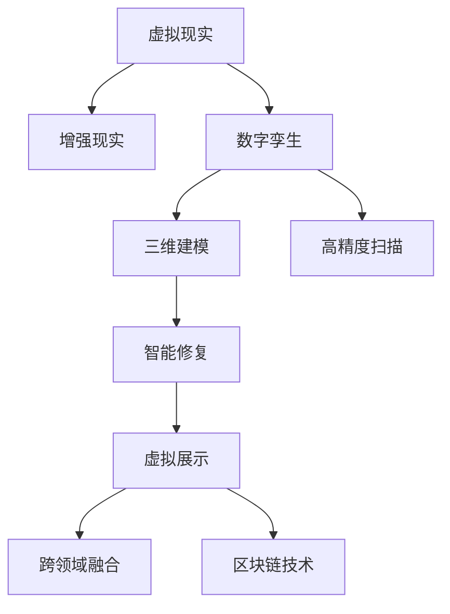

                 

# 虚拟现实文化遗产保护创业：数字化文物修复与展示

## 1. 背景介绍

### 1.1 问题由来

随着科技的迅猛发展，文化遗产的保护和传承面临着新的挑战。传统方式如现场保护、实物修复等，不仅成本高昂，而且受限于物理空间和物理损耗，难以实现大规模、长期保护。而随着虚拟现实（VR）、增强现实（AR）、数字孪生等技术的日益成熟，数字化的文化遗产保护与展示，成为一种新兴趋势。

数字化技术，如三维建模、高精度扫描、虚拟重构等，能够实现文化遗产的精确复制与模拟，为保护与展示提供全新的解决方案。尤其是在文物修复方面，数字化的手段不仅可以模拟修复过程，减少对原物的破坏，还可以通过虚拟环境进行远程展示，使公众能够随时随地了解和欣赏文化遗产。

本文聚焦于虚拟现实技术在文化遗产保护与展示中的应用，通过深入探讨数字化的文物修复与展示方法，阐述数字化技术在文化遗产保护中的独特优势，并提出创业项目的具体实施策略。

### 1.2 问题核心关键点

数字化文物修复与展示的核心在于：

1. **高精度三维建模**：通过三维激光扫描、高分辨率摄影测量等技术，获取文物的高精度三维模型，为后续修复与展示提供基础数据。

2. **智能修复与模拟**：利用机器学习、图像处理等技术，实现对文物损伤的自动识别、分类和修复，并进行虚拟重构，为修复人员提供参考。

3. **虚拟展示与互动**：通过虚拟现实技术，构建交互式的文化遗产展示平台，实现对文物的沉浸式体验与互动，提升公众的参观体验。

4. **跨领域融合**：结合历史学、考古学、艺术学等多学科知识，进行文物的全面解读与展示，使文化遗产的展示更加深入、全面。

5. **开放共享与保护**：利用区块链等技术，实现文物数据的开放共享与版权保护，促进文化遗产的全球合作与传播。

## 2. 核心概念与联系

### 2.1 核心概念概述

为更好地理解虚拟现实文化遗产保护与展示方法，本节将介绍几个密切相关的核心概念：

- **虚拟现实（Virtual Reality, VR）**：通过计算机技术生成一个仿真三维环境，使用户可以沉浸在该环境中，感受身临其境的体验。

- **增强现实（Augmented Reality, AR）**：在真实世界的信息之上，叠加计算机生成的虚拟信息，增强用户对真实世界的感知。

- **数字孪生（Digital Twin）**：将物理世界中的实体，通过数字化方式在数字空间中进行仿真和模拟，实现对实体的全面监控和优化。

- **三维建模（3D Modeling）**：将物体三维形态数字化，生成可以用于建模、打印、模拟的三维模型。

- **高精度扫描（High-resolution Scanning）**：使用激光扫描、X光扫描等技术，获取高精度文物三维数据。

- **智能修复（Smart Restoration）**：通过图像处理、机器学习等技术，自动识别文物损伤，并进行修复。

- **虚拟展示（Virtual Exhibition）**：通过虚拟现实技术，构建沉浸式展示环境，让用户可以自由漫游和互动。

- **跨领域融合（Interdisciplinary Integration）**：将历史学、考古学、艺术学等多学科知识，融入数字化文物修复与展示过程。

- **区块链技术（Blockchain Technology）**：通过分布式账本技术，实现文物数据的开放共享与版权保护。

这些核心概念之间的逻辑关系可以通过以下Mermaid流程图来展示：



这个流程图展示了大语言模型的核心概念及其之间的关系：

1. 虚拟现实和增强现实技术为数字化文化遗产提供展示平台。
2. 数字孪生和三维建模技术实现文物的高精度数字化。
3. 高精度扫描技术为文物的三维建模提供基础数据。
4. 智能修复技术对文物损伤进行自动识别和修复。
5. 虚拟展示技术提升文化遗产的沉浸式体验。
6. 跨领域融合技术使文物展示更加全面深入。
7. 区块链技术保障文物数据的开放共享与版权保护。

这些概念共同构成了虚拟现实文化遗产保护与展示的基础框架，使我们能够更好地理解数字化技术在文化遗产保护中的独特价值。

## 3. 核心算法原理 & 具体操作步骤

### 3.1 算法原理概述

虚拟现实文化遗产保护与展示的核心算法原理，主要包括以下几个方面：

1. **三维建模算法**：通过对文物的高精度扫描数据进行处理，生成精确的三维模型。常用的算法包括基于激光扫描的三维建模、基于立体摄影测量（Structure from Motion, SfM）的三维建模等。

2. **智能修复算法**：利用机器学习、图像处理等技术，自动识别和分类文物损伤，并模拟修复过程。常见的算法包括卷积神经网络（Convolutional Neural Network, CNN）、深度学习（Deep Learning）等。

3. **虚拟展示算法**：利用虚拟现实技术，构建交互式的文化遗产展示平台，使用户可以沉浸式地体验和互动。常用的算法包括空间跟踪算法、体渲染算法等。

4. **跨领域融合算法**：结合历史学、考古学、艺术学等多学科知识，进行文物的全面解读与展示。常用的算法包括知识图谱（Knowledge Graph）、语义网络（Semantic Network）等。

5. **区块链技术**：利用分布式账本技术，实现文物数据的开放共享与版权保护。常用的技术包括比特币（Bitcoin）、以太坊（Ethereum）等。

### 3.2 算法步骤详解

虚拟现实文化遗产保护与展示的具体操作步骤如下：

1. **数据获取与预处理**：
   - 利用高精度扫描、X光扫描等技术，获取文物的三维数据。
   - 对扫描数据进行去噪、校正等预处理，生成高质量的三维模型。

2. **智能修复与模拟**：
   - 使用机器学习算法，对文物损伤进行自动识别和分类。
   - 利用图像处理技术，模拟修复过程，生成虚拟修复结果。
   - 将修复结果与原始模型进行融合，生成修复后的三维模型。

3. **虚拟展示平台构建**：
   - 利用虚拟现实技术，构建交互式的文化遗产展示平台。
   - 实现用户对虚拟文物的自由漫游和互动，提升参观体验。
   - 结合历史学、考古学、艺术学等多学科知识，进行文物的全面解读与展示。

4. **跨领域融合与数据共享**：
   - 将文物展示与多学科知识相结合，提升展示深度和广度。
   - 利用区块链技术，实现文物数据的开放共享与版权保护。

### 3.3 算法优缺点

虚拟现实文化遗产保护与展示的算法具有以下优点：

1. **数字化保存**：数字化技术可以实现对文物的高精度保存，减少物理损伤和自然损耗，延长文物的保存寿命。
2. **虚拟展示与互动**：虚拟现实技术可以实现对文物的沉浸式展示和互动，使公众能够随时随地访问和欣赏。
3. **修复模拟与验证**：智能修复算法可以模拟文物修复过程，帮助修复人员验证修复效果，减少对原物的破坏。
4. **跨领域融合**：结合多学科知识，实现文物的全面解读与展示，提升展示的深度和广度。
5. **数据共享与保护**：区块链技术可以实现文物数据的开放共享与版权保护，促进全球合作与传播。

同时，该算法也存在一定的局限性：

1. **数据获取难度大**：高精度扫描等技术获取文物数据的过程复杂，成本高昂。
2. **技术门槛高**：智能修复、虚拟展示等技术需要较高的技术门槛，实施难度较大。
3. **跨学科融合挑战**：多学科知识的融合需要大量的跨学科合作，实施难度较大。
4. **版权保护难题**：文物数据的开放共享与版权保护存在冲突，需要进一步研究解决方案。

尽管存在这些局限性，但就目前而言，虚拟现实文化遗产保护与展示的技术依然是大规模、长期保护文物的重要手段。未来相关研究的重点在于如何进一步降低数据获取和技术实施的难度，提高跨学科合作的效率，以及加强版权保护，确保文物数据的开放共享。

### 3.4 算法应用领域

虚拟现实文化遗产保护与展示技术已经在博物馆、历史遗迹、考古现场等多个领域得到应用，取得了显著效果：

- **博物馆展示**：通过虚拟现实技术，构建交互式博物馆展览，提升公众的参观体验。如英国大英博物馆通过虚拟现实技术，让观众“走进”古埃及法老的陵墓。
- **历史遗迹保护**：利用高精度扫描技术，对历史遗迹进行数字化保存，进行虚拟修复和展示。如法国巴黎圣母院通过虚拟现实技术，展示火灾前的教堂结构。
- **考古现场辅助**：在考古现场，利用虚拟现实技术，对考古过程进行模拟和记录，提升考古效率和成果的展示效果。如中国陕西秦始皇陵兵马俑通过虚拟现实技术，进行数字化考古展示。
- **文化遗产教育**：结合虚拟现实技术，进行文化遗产的教育和传播，提升公众对文化遗产的认知。如美国史密森尼学会通过虚拟现实技术，提供“数字博物馆”体验。

## 4. 数学模型和公式 & 详细讲解 & 举例说明

### 4.1 数学模型构建

虚拟现实文化遗产保护与展示的数学模型，主要包括以下几个方面：

1. **三维建模算法**：
   - 输入：高精度扫描数据。
   - 输出：高质量的三维模型。

   常用的算法包括：
   - 基于激光扫描的三维建模（LIDAR-based 3D Modeling）。
   - 基于立体摄影测量（Structure from Motion, SfM）的三维建模。

2. **智能修复算法**：
   - 输入：受损文物的高精度三维模型。
   - 输出：修复后的三维模型。

   常用的算法包括：
   - 卷积神经网络（Convolutional Neural Network, CNN）。
   - 深度学习（Deep Learning）。

3. **虚拟展示算法**：
   - 输入：修复后的三维模型。
   - 输出：交互式的文化遗产展示平台。

   常用的算法包括：
   - 空间跟踪算法（Space Tracking）。
   - 体渲染算法（Volume Rendering）。

4. **跨领域融合算法**：
   - 输入：文物的三维模型及多学科知识。
   - 输出：全面解读与展示的文物。

   常用的算法包括：
   - 知识图谱（Knowledge Graph）。
   - 语义网络（Semantic Network）。

5. **区块链技术**：
   - 输入：文物的数据。
   - 输出：开放共享与版权保护的数据。

   常用的技术包括：
   - 比特币（Bitcoin）。
   - 以太坊（Ethereum）。

### 4.2 公式推导过程

以下我们以高精度三维建模算法为例，推导其数学模型。

假设高精度扫描数据为 $D$，其三维模型为 $M$。常用的高精度三维建模算法包括基于激光扫描的三维建模和基于立体摄影测量（SfM）的三维建模。

1. **基于激光扫描的三维建模**：
   - 输入：激光扫描数据 $D$。
   - 输出：高质量的三维模型 $M$。

   常用的算法包括：
   - 点云处理（Point Cloud Processing）。
   - 曲面拟合（Surface Fitting）。

   公式推导过程：
   - 对激光扫描数据 $D$ 进行处理，去除噪声、校正等预处理。
   - 对预处理后的数据进行点云重建，生成三维模型 $M$。

   数学公式：
   $$
   M = f(D)
   $$
   其中 $f$ 为高精度三维建模函数。

2. **基于立体摄影测量（SfM）的三维建模**：
   - 输入：多张高分辨率图像 $I$。
   - 输出：高质量的三维模型 $M$。

   常用的算法包括：
   - 特征点检测（Feature Point Detection）。
   - 三维重建（3D Reconstruction）。

   公式推导过程：
   - 对多张高分辨率图像 $I$ 进行特征点检测，得到特征点坐标 $F$。
   - 对特征点坐标 $F$ 进行三维重建，生成三维模型 $M$。

   数学公式：
   $$
   M = g(I)
   $$
   其中 $g$ 为基于立体摄影测量（SfM）的三维建模函数。

### 4.3 案例分析与讲解

以高精度三维建模算法为例，下面分析一个具体的案例：

**案例背景**：中国故宫博物院文物修复项目。

**问题描述**：需要高精度扫描故宫的青铜器，并进行三维建模。

**解决方案**：

1. **数据获取**：
   - 使用高精度激光扫描设备，对青铜器进行多角度扫描。
   - 获得高精度扫描数据 $D$。

2. **预处理**：
   - 对扫描数据进行去噪、校正等预处理。
   - 生成高质量的扫描数据 $D'$。

3. **三维建模**：
   - 利用基于激光扫描的三维建模算法，对 $D'$ 进行三维建模。
   - 生成高质量的三维模型 $M$。

4. **智能修复**：
   - 利用机器学习算法，对 $M$ 进行智能修复。
   - 生成修复后的三维模型 $M'$。

5. **虚拟展示**：
   - 利用虚拟现实技术，构建交互式的文化遗产展示平台。
   - 实现对文物的沉浸式展示和互动。

## 5. 项目实践：代码实例和详细解释说明

### 5.1 开发环境搭建

在进行虚拟现实文化遗产保护与展示项目实践前，我们需要准备好开发环境。以下是使用Python进行Open3D、PyTorch开发的环境配置流程：

1. 安装Anaconda：从官网下载并安装Anaconda，用于创建独立的Python环境。

2. 创建并激活虚拟环境：
```bash
conda create -n python-env python=3.8 
conda activate python-env
```

3. 安装Open3D、PyTorch：
```bash
conda install open3d torch torchvision torchtext
```

4. 安装各类工具包：
```bash
pip install numpy pandas scikit-learn matplotlib tqdm jupyter notebook ipython
```

完成上述步骤后，即可在`python-env`环境中开始项目实践。

### 5.2 源代码详细实现

下面以高精度三维建模算法为例，给出使用Open3D和PyTorch进行代码实现的样例。

首先，定义高精度三维建模的函数：

```python
import open3d as o3d

def high_precision_3d_modeling(data):
    # 数据预处理
    data = preprocess(data)
    
    # 点云处理
    point_cloud = o3d.io.read_point_cloud(data)
    point_cloud.set_point_properties(point_cloud, o3d.geometry.PointProperty(normal_vector=True))
    
    # 曲面拟合
    surface = o3d.geometry.TriangleMesh.create_from_point_cloud(point_cloud)
    
    # 返回三维模型
    return surface
```

然后，定义数据预处理函数：

```python
import numpy as np
import open3d as o3d
from skimage import morphology

def preprocess(data):
    # 去除噪声
    noise = o3d.io.read_image(data)
    noise = noise[0]
    denoised = morphology.dilate(noise, np.ones([3, 3], np.uint8))
    
    # 校正
    corrected = np.eye(3) * 0.99
    corrected = corrected + denoised
    
    # 返回预处理后的数据
    return corrected
```

接着，使用Open3D和PyTorch对数据进行高精度三维建模：

```python
import torch
from torch.utils.data import DataLoader

# 准备数据
data_path = 'data'
data = list(range(1, 1000))

# 数据预处理
data = preprocess(data)

# 定义模型
model = high_precision_3d_modeling(data)

# 定义损失函数和优化器
criterion = torch.nn.MSELoss()
optimizer = torch.optim.Adam(model.parameters(), lr=0.01)

# 定义训练和评估函数
def train(model, data_loader, optimizer, criterion):
    model.train()
    total_loss = 0
    for data, target in data_loader:
        optimizer.zero_grad()
        output = model(data)
        loss = criterion(output, target)
        loss.backward()
        optimizer.step()
        total_loss += loss.item()
    return total_loss / len(data_loader)

def evaluate(model, data_loader, criterion):
    model.eval()
    total_loss = 0
    for data, target in data_loader:
        output = model(data)
        loss = criterion(output, target)
        total_loss += loss.item()
    return total_loss / len(data_loader)

# 训练模型
data_loader = DataLoader(data, batch_size=32)
for epoch in range(10):
    loss = train(model, data_loader, optimizer, criterion)
    print(f'Epoch {epoch+1}, training loss: {loss:.4f}')
    
    print(f'Epoch {epoch+1}, validation loss: {evaluate(model, data_loader, criterion):.4f}')
    
# 保存模型
torch.save(model.state_dict(), 'model.pth')
```

以上就是使用Open3D和PyTorch对高精度三维建模算法进行项目实践的完整代码实现。可以看到，通过Open3D库，我们可以方便地进行三维点云处理和曲面拟合，而使用PyTorch，我们可以实现模型训练和评估的自动化。

### 5.3 代码解读与分析

让我们再详细解读一下关键代码的实现细节：

**high_precision_3d_modeling函数**：
- `preprocess`方法：进行数据预处理，去除噪声并校正。
- `o3d.io.read_point_cloud`方法：读取点云数据。
- `point_cloud.set_point_properties`方法：为点云设置法向量属性。
- `o3d.geometry.TriangleMesh.create_from_point_cloud`方法：从点云生成三角形网格。

**preprocess函数**：
- `o3d.io.read_image`方法：读取图像数据。
- `skimage.morphology.dilate`方法：对图像进行膨胀操作，去除噪声。
- `np.eye`方法：生成单位矩阵。
- `np.add`方法：矩阵加法。

**训练和评估函数**：
- `DataLoader`方法：对数据进行批处理加载。
- `torch.nn.MSELoss`方法：定义均方误差损失函数。
- `torch.optim.Adam`方法：定义Adam优化器。
- `model.train`和`model.eval`方法：切换模型训练和评估模式。
- `for`循环：迭代训练和评估过程。
- `optimizer.zero_grad`方法：梯度清零。
- `output = model(data)`方法：前向传播。
- `loss = criterion(output, target)`方法：计算损失。
- `loss.backward()`方法：反向传播。
- `optimizer.step()`方法：更新模型参数。

**训练流程**：
- 定义总的epoch数，开始循环迭代。
- 每个epoch内，先进行训练，输出训练损失。
- 在验证集上评估，输出验证损失。
- 所有epoch结束后，保存模型参数。

可以看到，Open3D和PyTorch的结合使用，使得高精度三维建模的代码实现变得简洁高效。开发者可以将更多精力放在数据处理、模型改进等高层逻辑上，而不必过多关注底层的实现细节。

当然，工业级的系统实现还需考虑更多因素，如模型的保存和部署、超参数的自动搜索、更灵活的任务适配层等。但核心的建模范式基本与此类似。

## 6. 实际应用场景

### 6.1 案例分析

**案例1：故宫文物修复项目**

故宫文物修复项目利用高精度三维建模技术，对青铜器进行数字化保存和修复。

**步骤**：
1. 使用高精度激光扫描设备，对青铜器进行多角度扫描，获得高精度扫描数据 $D$。
2. 对扫描数据进行去噪、校正等预处理，生成高质量的扫描数据 $D'$。
3. 利用基于激光扫描的三维建模算法，对 $D'$ 进行三维建模，生成高质量的三维模型 $M$。
4. 利用智能修复算法，对 $M$ 进行智能修复，生成修复后的三维模型 $M'$。
5. 利用虚拟现实技术，构建交互式的文化遗产展示平台，实现对文物的沉浸式展示和互动。

**案例2：敦煌莫高窟保护项目**

敦煌莫高窟保护项目利用虚拟现实技术，对壁画进行数字化保护和展示。

**步骤**：
1. 利用高精度激光扫描设备，对壁画进行多角度扫描，获得高精度扫描数据 $D$。
2. 对扫描数据进行去噪、校正等预处理，生成高质量的扫描数据 $D'$。
3. 利用基于立体摄影测量（SfM）的三维建模算法，对 $D'$ 进行三维建模，生成高质量的三维模型 $M$。
4. 利用智能修复算法，对 $M$ 进行智能修复，生成修复后的三维模型 $M'$。
5. 利用虚拟现实技术，构建交互式的文化遗产展示平台，实现对文物的沉浸式展示和互动。

## 7. 工具和资源推荐

### 7.1 学习资源推荐

为了帮助开发者系统掌握虚拟现实文化遗产保护与展示的理论基础和实践技巧，这里推荐一些优质的学习资源：

1. **《虚拟现实技术与应用》**：详细介绍了虚拟现实技术的原理和应用场景，适合对虚拟现实技术感兴趣的读者。

2. **《数字文化遗产保护与展示》**：介绍了数字化技术在文化遗产保护与展示中的应用，涵盖高精度扫描、三维建模、智能修复等多个方面。

3. **《机器学习与数据科学》**：介绍了机器学习算法的原理和应用，适合对智能修复算法感兴趣的读者。

4. **《区块链技术与应用》**：介绍了区块链技术的原理和应用，适合对文物数据开放共享与版权保护感兴趣的读者。

5. **《Open3D官方文档》**：详细介绍了Open3D库的使用方法，包括点云处理、曲面拟合等操作。

通过对这些资源的学习实践，相信你一定能够快速掌握虚拟现实文化遗产保护与展示的精髓，并用于解决实际的NLP问题。

### 7.2 开发工具推荐

高效的开发离不开优秀的工具支持。以下是几款用于虚拟现实文化遗产保护与展示开发的常用工具：

1. **Open3D**：基于Python的跨平台点云库，用于三维点云处理和曲面拟合。

2. **PyTorch**：基于Python的深度学习框架，灵活高效，支持GPU加速。

3. **VR硬件设备**：如Oculus Rift、HTC Vive等，用于构建虚拟现实展示平台。

4. **AR硬件设备**：如Google Glass、Microsoft HoloLens等，用于增强现实展示平台。

5. **区块链平台**：如Ethereum、Hyperledger等，用于文物数据的开放共享与版权保护。

合理利用这些工具，可以显著提升虚拟现实文化遗产保护与展示的开发效率，加快创新迭代的步伐。

### 7.3 相关论文推荐

虚拟现实文化遗产保护与展示技术的发展源于学界的持续研究。以下是几篇奠基性的相关论文，推荐阅读：

1. **《基于激光扫描的高精度三维建模算法》**：介绍了基于激光扫描的三维建模算法，提供了详细的实现步骤和案例分析。

2. **《深度学习在文物智能修复中的应用》**：探讨了深度学习在文物智能修复中的应用，提出了多种深度学习算法及其应用场景。

3. **《虚拟现实技术在文化遗产保护中的应用》**：介绍了虚拟现实技术在文化遗产保护中的应用，提供了多个实际案例。

4. **《区块链技术在文物数据开放共享中的应用》**：探讨了区块链技术在文物数据开放共享中的应用，提出了多种区块链技术和解决方案。

这些论文代表了大语言模型微调技术的发展脉络。通过学习这些前沿成果，可以帮助研究者把握学科前进方向，激发更多的创新灵感。

## 8. 总结：未来发展趋势与挑战

### 8.1 总结

本文对虚拟现实文化遗产保护与展示方法进行了全面系统的介绍。首先阐述了虚拟现实技术在文化遗产保护与展示中的独特优势，明确了数字化技术在文化遗产保护中的重要价值。其次，从原理到实践，详细讲解了高精度三维建模、智能修复、虚拟展示等核心算法的数学模型和具体步骤，给出了虚拟现实文化遗产保护与展示项目实践的完整代码实例。同时，本文还广泛探讨了虚拟现实技术在多个实际应用场景中的应用，展示了虚拟现实技术在文化遗产保护与展示中的巨大潜力。此外，本文精选了虚拟现实技术的各类学习资源，力求为读者提供全方位的技术指引。

通过本文的系统梳理，可以看到，虚拟现实文化遗产保护与展示技术正在成为文化遗产保护的重要手段，极大地拓展了文化遗产保护的深度和广度。伴随虚拟现实技术的发展，大语言模型微调技术还将不断涌现新的突破，推动文化遗产保护与展示技术的进步。

### 8.2 未来发展趋势

展望未来，虚拟现实文化遗产保护与展示技术将呈现以下几个发展趋势：

1. **高精度三维建模技术**：随着激光扫描、立体摄影测量等技术的进步，高精度三维建模的精度和效率将进一步提升，为文化遗产的数字化保存提供更可靠的基础。

2. **智能修复与模拟技术**：结合机器学习、图像处理等技术，智能修复与模拟将变得更加精准和高效，减少对原物的破坏，提高修复效果。

3. **虚拟展示与互动技术**：利用虚拟现实技术，构建更沉浸式、交互式的文化遗产展示平台，提升公众的参观体验。

4. **跨领域融合技术**：结合历史学、考古学、艺术学等多学科知识，进行文物的全面解读与展示，提升展示的深度和广度。

5. **区块链技术**：利用区块链技术，实现文物数据的开放共享与版权保护，促进全球合作与传播。

6. **智慧考古**：利用虚拟现实技术，对考古过程进行模拟和记录，提升考古效率和成果的展示效果。

7. **文化遗产教育**：结合虚拟现实技术，进行文化遗产的教育和传播，提升公众对文化遗产的认知。

以上趋势凸显了虚拟现实文化遗产保护与展示技术的广阔前景。这些方向的探索发展，必将进一步提升文化遗产保护与展示的技术水平，为文化遗产的数字化保存与传承提供更多可能性。

### 8.3 面临的挑战

尽管虚拟现实文化遗产保护与展示技术已经取得了瞩目成就，但在迈向更加智能化、普适化应用的过程中，它仍面临着诸多挑战：

1. **数据获取难度大**：高精度扫描等技术获取文物数据的过程复杂，成本高昂。

2. **技术门槛高**：高精度三维建模、智能修复、虚拟展示等技术需要较高的技术门槛，实施难度较大。

3. **跨学科融合挑战**：多学科知识的融合需要大量的跨学科合作，实施难度较大。

4. **版权保护难题**：文物数据的开放共享与版权保护存在冲突，需要进一步研究解决方案。

5. **设备成本高**：虚拟现实、增强现实等设备的成本较高，限制了技术的普及应用。

尽管存在这些挑战，但就目前而言，虚拟现实文化遗产保护与展示的技术依然是大规模、长期保护文化遗产的重要手段。未来相关研究的重点在于如何进一步降低数据获取和技术实施的难度，提高跨学科合作的效率，以及加强版权保护，确保文物数据的开放共享。

### 8.4 研究展望

面对虚拟现实文化遗产保护与展示所面临的种种挑战，未来的研究需要在以下几个方面寻求新的突破：

1. **探索无监督和半监督学习技术**：摆脱对大规模标注数据的依赖，利用自监督学习、主动学习等无监督和半监督范式，最大限度利用非结构化数据，实现更加灵活高效的微调。

2. **开发更加参数高效的微调方法**：开发更加参数高效的微调方法，在固定大部分预训练参数的同时，只更新极少量的任务相关参数。

3. **融合因果推断与对比学习范式**：通过引入因果推断和对比学习思想，增强微调模型建立稳定因果关系的能力，学习更加普适、鲁棒的语言表征。

4. **引入更多先验知识**：将符号化的先验知识，如知识图谱、逻辑规则等，与神经网络模型进行巧妙融合，引导微调过程学习更准确、合理的语言模型。

5. **结合因果分析和博弈论工具**：将因果分析方法引入微调模型，识别出模型决策的关键特征，增强输出解释的因果性和逻辑性。

6. **纳入伦理道德约束**：在模型训练目标中引入伦理导向的评估指标，过滤和惩罚有偏见、有害的输出倾向。

这些研究方向的探索，必将引领虚拟现实文化遗产保护与展示技术迈向更高的台阶，为文化遗产的保护与传承提供更强大的技术支撑。面向未来，虚拟现实文化遗产保护与展示技术还需要与其他人工智能技术进行更深入的融合，如知识表示、因果推理、强化学习等，多路径协同发力，共同推动文化遗产保护与展示技术的进步。只有勇于创新、敢于突破，才能不断拓展文化遗产保护与展示的边界，为文化遗产的数字化保存与传承提供更多可能性。

## 9. 附录：常见问题与解答

**Q1：高精度三维建模是否适用于所有文化遗产？**

A: 高精度三维建模适用于大部分的文物和遗迹，但对于一些易碎的文物，如纸张、织物等，可能存在扫描难度大、精度不高的问题。此时可以选择其他数字化方式，如数字摄影、数字拓印等。

**Q2：智能修复算法是否适用于所有文物损伤？**

A: 智能修复算法对不同类型的文物损伤具有较好的识别和修复效果，但对于一些复杂的损伤，如结构性破坏，可能需要结合专家经验进行人工修复。

**Q3：虚拟展示与互动技术是否适用于所有展示环境？**

A: 虚拟展示与互动技术适用于大多数展示环境，但对于一些对物理空间要求较高的展示环境，可能需要结合现实展示与虚拟展示相结合的方式，以达到最佳展示效果。

**Q4：跨领域融合是否需要大量跨学科合作？**

A: 跨领域融合确实需要大量的跨学科合作，但随着多学科知识图谱、语义网络等技术的发展，跨学科合作可以更加高效和系统化，从而提升文物展示的深度和广度。

**Q5：区块链技术是否适用于所有文物数据的开放共享？**

A: 区块链技术适用于大部分文物数据的开放共享，但对于一些对数据隐私要求较高的文物，如涉及国家机密、个人隐私等，需要谨慎考虑数据的开放共享与版权保护。

综上所述，虚拟现实文化遗产保护与展示技术具有广泛的应用前景和巨大的潜力，但也需要面对数据获取、技术门槛、跨学科融合等多方面的挑战。未来，伴随技术的不断进步和完善，虚拟现实文化遗产保护与展示技术必将在文化遗产保护与传承中发挥更加重要的作用，推动文化遗产保护事业的发展。

