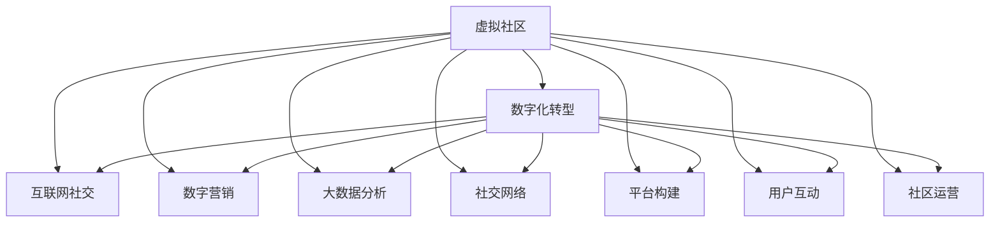

                 

# 虚拟社区:全球社区行业的数字化升级

> 关键词：虚拟社区, 数字化转型, 全球社区行业, 互联网社交, 数字营销, 大数据分析, 社交网络, 平台构建, 用户互动, 社区运营

## 1. 背景介绍

### 1.1 问题由来

互联网时代，社区作为重要的信息共享与交流平台，逐渐成为各行各业数字化转型的核心。社区行业涵盖了在线论坛、社交网络、内容平台等众多细分领域，涵盖用户的日常生活、工作、学习等多个方面。近年来，随着互联网技术的迅猛发展，社区行业正在经历深刻变革，传统的线下社区正逐步向虚拟社区转型，数字化升级成为行业发展的必然趋势。

然而，全球社区行业的数字化转型面临诸多挑战。包括技术门槛高、数据处理复杂、用户行为多样性等。如何通过技术手段提升社区运营效率，提升用户体验，构建安全、高效、智能的社区平台，成为社区行业数字化转型的关键问题。

## 2. 核心概念与联系

### 2.1 核心概念概述

为更好地理解全球社区行业的数字化升级，本节将介绍几个密切相关的核心概念：

- **虚拟社区**：指基于互联网，用户可以在线上进行信息交流、知识共享、资源互助的平台。通过虚拟社区，用户可以跨越时空限制，自由参与各类社会活动。
- **数字化转型**：指企业利用先进信息技术，优化业务流程、提升管理效率、增强客户体验，从而实现业务模式创新和价值提升的过程。
- **社区行业**：涵盖在线论坛、社交网络、内容平台等多种形式，是连接用户与用户、用户与企业的重要桥梁。
- **互联网社交**：指通过互联网技术实现的社交行为，如发布动态、参与讨论、观看视频等，成为社区用户日常互动的主要形式。
- **数字营销**：指利用数字手段，如搜索引擎优化、社交媒体广告、移动应用推广等，提升品牌知名度、增强用户互动、驱动销售增长。
- **大数据分析**：指通过处理海量数据，提取有价值的信息和洞见，用于优化决策、提高运营效率。
- **社交网络**：指用户通过网络建立关系网络，进行信息分享、资源交流的社交平台，如Facebook、Twitter等。
- **平台构建**：指设计、开发和运营社区平台的完整过程，包括技术架构、用户体验、社区规则等。
- **用户互动**：指用户间通过文字、图片、视频等形式进行交流互动的过程，是社区平台的核心功能。
- **社区运营**：指维护社区秩序、引导用户参与、优化用户体验等运营手段，确保社区的健康发展。

这些核心概念之间的逻辑关系可以通过以下Mermaid流程图来展示：



这个流程图展示了几大核心概念及其之间的关系：

1. **虚拟社区**：是社区行业数字化转型的基础，通过互联网技术连接用户。
2. **数字化转型**：推动社区行业技术升级、业务优化，增强用户体验。
3. **互联网社交、数字营销、大数据分析**：作为数字化转型的重要手段，提升社区平台的用户互动和运营效率。
4. **社交网络、平台构建、用户互动、社区运营**：是虚拟社区的核心组成部分，互相支撑、协同发展。

这些概念共同构成了虚拟社区数字化转型的整体框架，为社区行业提供了清晰的指导方向。

## 3. 核心算法原理 & 具体操作步骤
### 3.1 算法原理概述

全球社区行业的数字化升级，本质上是一个数据驱动、技术赋能的转型过程。其核心思想是：利用先进信息技术，优化社区平台的用户体验、运营效率、商业模式，从而实现社区的数字化升级和业务模式的创新。

形式化地，假设社区平台为 $C_{\theta}$，其中 $\theta$ 为社区运营的各种参数，如用户互动策略、内容推荐算法、广告投放机制等。给定社区运营目标 $T$，数字化升级的目标是找到最优参数 $\theta^*$，使得：

$$
\theta^*=\mathop{\arg\min}_{\theta} \mathcal{L}(C_{\theta},T)
$$

其中 $\mathcal{L}$ 为针对社区平台运营效果设计的损失函数，用于衡量社区平台在用户互动、内容质量、广告投放等方面的表现。常见的损失函数包括用户留存率、内容点击率、广告转化率等。

通过梯度下降等优化算法，数字化升级过程不断更新社区平台参数 $\theta$，最小化损失函数 $\mathcal{L}$，使得社区平台输出逼近最优的运营效果。由于 $\theta$ 已经通过用户行为数据学习到了社区的运营模式，因此即便在少量用户行为数据的条件下，数字化升级也能较快收敛到理想的社区平台参数 $\theta^*$。

### 3.2 算法步骤详解

全球社区行业的数字化升级一般包括以下几个关键步骤：

**Step 1: 准备社区数据和运营目标**
- 收集社区平台的各类数据，如用户行为数据、内容质量数据、广告投放数据等，构建数据集。
- 确定社区运营的各项指标，如用户留存率、内容点击率、广告转化率等，构建目标函数。

**Step 2: 设计社区运营策略**
- 根据社区运营目标，设计用户互动策略、内容推荐算法、广告投放机制等。
- 选择合适的优化算法及其参数，如Adam、SGD等，设置学习率、批大小、迭代轮数等。
- 设置正则化技术及强度，包括权重衰减、Dropout、Early Stopping等。

**Step 3: 执行梯度训练**
- 将社区数据分批次输入模型，前向传播计算损失函数。
- 反向传播计算参数梯度，根据设定的优化算法和学习率更新模型参数。
- 周期性在社区运营效果上评估模型性能，根据性能指标决定是否触发Early Stopping。
- 重复上述步骤直到满足预设的迭代轮数或Early Stopping条件。

**Step 4: 测试和部署**
- 在社区平台上进行A/B测试，评估数字化升级的效果。
- 使用数字化升级后的社区平台进行实际运营，优化用户体验和运营效率。
- 持续收集新的数据，定期重新数字化升级，以适应社区平台的发展需求。

以上是全球社区行业数字化升级的一般流程。在实际应用中，还需要针对具体社区的特点，对数字化升级过程的各个环节进行优化设计，如改进用户体验、引入大数据分析、优化广告投放策略等，以进一步提升社区平台的用户互动和运营效率。

### 3.3 算法优缺点

全球社区行业数字化升级方法具有以下优点：
1. 提升用户体验：通过优化社区平台的用户互动策略、内容推荐算法、广告投放机制，提升用户留存率、内容点击率、广告转化率等关键指标。
2. 降低运营成本：利用大数据分析和自动化运营手段，减少人工干预，提高运营效率，降低人力成本。
3. 增强数据驱动决策：通过收集、处理和分析社区数据，辅助社区运营决策，提升决策的准确性和效率。
4. 提升广告效果：通过精准投放和优化广告策略，提高广告的点击率和转化率，提升广告投放效果。
5. 增强平台粘性：通过用户互动和内容推荐，增强用户对社区平台的依赖性，提升平台粘性。

同时，该方法也存在一定的局限性：
1. 数据隐私问题：收集社区用户行为数据时，需要遵守数据隐私法规，保护用户隐私。
2. 数据质量问题：社区数据往往存在噪声和不完整，数据清洗和处理复杂。
3. 算法复杂性：数字化升级过程涉及复杂算法和模型，对技术要求高。
4. 用户习惯问题：过度依赖技术手段，可能忽视用户真实需求，降低用户满意度。
5. 广告投放问题：广告策略不当可能导致用户体验下降，影响社区平台的整体口碑。

尽管存在这些局限性，但就目前而言，数字化升级方法仍是社区行业提升运营效率和用户体验的重要手段。未来相关研究的重点在于如何进一步提升数据质量、优化算法模型、平衡技术手段和用户体验，以实现社区平台的可持续发展。

### 3.4 算法应用领域

全球社区行业的数字化升级方法，在社区平台运营中得到了广泛应用，覆盖了各类社区平台，如社交网络、论坛、博客、知识共享平台等，具体包括：

- **在线论坛**：如知乎、天涯、贴吧等，利用数字化升级优化用户互动策略、内容推荐算法，提升用户留存率和内容质量。
- **社交网络**：如Facebook、Twitter、LinkedIn等，通过数据分析和广告投放，增强用户粘性，提高平台影响力。
- **内容平台**：如B站、优酷、YouTube等，利用大数据分析，优化内容推荐，提升用户体验和内容互动率。
- **知识共享平台**：如Wiki、Stack Overflow等，通过用户互动和知识推荐，构建知识共享社区，提升平台价值。
- **企业内网社区**：如企业内网论坛、企业微信社区等，通过数字化升级，提升员工互动，促进企业知识传播和员工成长。

此外，数字化升级技术也被创新性地应用于更多场景中，如智能客服、虚拟助手、在线教育等，为社区平台带来新的突破。随着技术的不断进步，基于数字化升级的方法将成为社区平台运营的重要手段，推动社区平台向更高效、智能、安全的方向发展。

## 4. 数学模型和公式 & 详细讲解 & 举例说明
### 4.1 数学模型构建

本节将使用数学语言对全球社区行业的数字化升级过程进行更加严格的刻画。

假设社区平台为 $C_{\theta}:\mathcal{X} \rightarrow \mathcal{Y}$，其中 $\mathcal{X}$ 为用户行为数据，$\mathcal{Y}$ 为社区运营目标，$\theta \in \mathbb{R}^d$ 为社区运营的各种参数。假设数字化升级任务的训练集为 $D=\{(x_i,y_i)\}_{i=1}^N, x_i \in \mathcal{X}, y_i \in \mathcal{Y}$。

定义社区平台 $C_{\theta}$ 在数据样本 $(x,y)$ 上的损失函数为 $\ell(C_{\theta}(x),y)$，则在数据集 $D$ 上的经验风险为：

$$
\mathcal{L}(\theta) = \frac{1}{N} \sum_{i=1}^N \ell(C_{\theta}(x_i),y_i)
$$

数字化升级的目标是最小化经验风险，即找到最优参数：

$$
\theta^* = \mathop{\arg\min}_{\theta} \mathcal{L}(\theta)
$$

在实践中，我们通常使用基于梯度的优化算法（如SGD、Adam等）来近似求解上述最优化问题。设 $\eta$ 为学习率，$\lambda$ 为正则化系数，则参数的更新公式为：

$$
\theta \leftarrow \theta - \eta \nabla_{\theta}\mathcal{L}(\theta) - \eta\lambda\theta
$$

其中 $\nabla_{\theta}\mathcal{L}(\theta)$ 为损失函数对参数 $\theta$ 的梯度，可通过反向传播算法高效计算。

### 4.2 公式推导过程

以下我们以用户留存率优化为例，推导交叉熵损失函数及其梯度的计算公式。

假设社区平台 $C_{\theta}$ 在输入 $x$ 上的输出为 $\hat{y}=C_{\theta}(x) \in [0,1]$，表示用户在某时间段内继续使用社区平台的概率。真实标签 $y \in \{0,1\}$。则二分类交叉熵损失函数定义为：

$$
\ell(C_{\theta}(x),y) = -[y\log \hat{y} + (1-y)\log (1-\hat{y})]
$$

将其代入经验风险公式，得：

$$
\mathcal{L}(\theta) = -\frac{1}{N}\sum_{i=1}^N [y_i\log C_{\theta}(x_i)+(1-y_i)\log(1-C_{\theta}(x_i))]
$$

根据链式法则，损失函数对参数 $\theta_k$ 的梯度为：

$$
\frac{\partial \mathcal{L}(\theta)}{\partial \theta_k} = -\frac{1}{N}\sum_{i=1}^N (\frac{y_i}{C_{\theta}(x_i)}-\frac{1-y_i}{1-C_{\theta}(x_i)}) \frac{\partial C_{\theta}(x_i)}{\partial \theta_k}
$$

其中 $\frac{\partial C_{\theta}(x_i)}{\partial \theta_k}$ 可进一步递归展开，利用自动微分技术完成计算。

在得到损失函数的梯度后，即可带入参数更新公式，完成社区平台的迭代优化。重复上述过程直至收敛，最终得到适应社区运营目标的最优参数 $\theta^*$。

## 5. 项目实践：代码实例和详细解释说明
### 5.1 开发环境搭建

在进行社区平台数字化升级实践前，我们需要准备好开发环境。以下是使用Python进行PyTorch开发的环境配置流程：

1. 安装Anaconda：从官网下载并安装Anaconda，用于创建独立的Python环境。

2. 创建并激活虚拟环境：
```bash
conda create -n community-env python=3.8 
conda activate community-env
```

3. 安装PyTorch：根据CUDA版本，从官网获取对应的安装命令。例如：
```bash
conda install pytorch torchvision torchaudio cudatoolkit=11.1 -c pytorch -c conda-forge
```

4. 安装Transformers库：
```bash
pip install transformers
```

5. 安装各类工具包：
```bash
pip install numpy pandas scikit-learn matplotlib tqdm jupyter notebook ipython
```

完成上述步骤后，即可在`community-env`环境中开始数字化升级实践。

### 5.2 源代码详细实现

这里我们以在线论坛的数字化升级为例，给出使用Transformers库进行社区平台用户留存率优化的PyTorch代码实现。

首先，定义用户留存率优化任务的数据处理函数：

```python
from transformers import BertTokenizer
from torch.utils.data import Dataset
import torch

class CommunityDataset(Dataset):
    def __init__(self, user_data, engagement_data, tokenizer, max_len=128):
        self.user_data = user_data
        self.engagement_data = engagement_data
        self.tokenizer = tokenizer
        self.max_len = max_len
        
    def __len__(self):
        return len(self.user_data)
    
    def __getitem__(self, item):
        user = self.user_data[item]
        engagement = self.engagement_data[item]
        
        user_text = f"{user} User profile: {user_data[item]['description']}"
        engagement_text = f"{user}'s engagement data: {engagement_data[item]['activities']} in {engagement_data[item]['days_since_last_login']} days"
        
        encoding = self.tokenizer(user_text + engagement_text, return_tensors='pt', max_length=self.max_len, padding='max_length', truncation=True)
        input_ids = encoding['input_ids'][0]
        attention_mask = encoding['attention_mask'][0]
        
        # 将engagement转化为数值表示
        activities_count = engagement_data[item]['activities'].count()
        days_since_last_login = engagement_data[item]['days_since_last_login']
        engagement_score = (activities_count + days_since_last_login) / 2
        
        label = torch.tensor([engagement_score], dtype=torch.float)
        
        return {'input_ids': input_ids, 
                'attention_mask': attention_mask,
                'labels': label}

# 数据加载
user_data = ... # 用户行为数据
engagement_data = ... # 用户活跃度数据
tokenizer = BertTokenizer.from_pretrained('bert-base-cased')

train_dataset = CommunityDataset(user_data, engagement_data, tokenizer)
dev_dataset = CommunityDataset(user_data, engagement_data, tokenizer)
test_dataset = CommunityDataset(user_data, engagement_data, tokenizer)
```

然后，定义模型和优化器：

```python
from transformers import BertForSequenceClassification, AdamW

model = BertForSequenceClassification.from_pretrained('bert-base-cased', num_labels=1)

optimizer = AdamW(model.parameters(), lr=2e-5)
```

接着，定义训练和评估函数：

```python
from torch.utils.data import DataLoader
from tqdm import tqdm
from sklearn.metrics import roc_auc_score

device = torch.device('cuda') if torch.cuda.is_available() else torch.device('cpu')
model.to(device)

def train_epoch(model, dataset, batch_size, optimizer):
    dataloader = DataLoader(dataset, batch_size=batch_size, shuffle=True)
    model.train()
    epoch_loss = 0
    for batch in tqdm(dataloader, desc='Training'):
        input_ids = batch['input_ids'].to(device)
        attention_mask = batch['attention_mask'].to(device)
        labels = batch['labels'].to(device)
        model.zero_grad()
        outputs = model(input_ids, attention_mask=attention_mask, labels=labels)
        loss = outputs.loss
        epoch_loss += loss.item()
        loss.backward()
        optimizer.step()
    return epoch_loss / len(dataloader)

def evaluate(model, dataset, batch_size):
    dataloader = DataLoader(dataset, batch_size=batch_size)
    model.eval()
    preds, labels = [], []
    with torch.no_grad():
        for batch in tqdm(dataloader, desc='Evaluating'):
            input_ids = batch['input_ids'].to(device)
            attention_mask = batch['attention_mask'].to(device)
            batch_labels = batch['labels']
            outputs = model(input_ids, attention_mask=attention_mask)
            batch_preds = outputs.logits.argmax(dim=1).to('cpu').tolist()
            batch_labels = batch_labels.to('cpu').tolist()
            for pred in batch_preds:
                preds.append(pred)
                labels.append(batch_labels)
                
    print(roc_auc_score(labels, preds))
```

最后，启动训练流程并在测试集上评估：

```python
epochs = 5
batch_size = 16

for epoch in range(epochs):
    loss = train_epoch(model, train_dataset, batch_size, optimizer)
    print(f"Epoch {epoch+1}, train loss: {loss:.3f}")
    
    print(f"Epoch {epoch+1}, dev AUC: {evaluate(model, dev_dataset, batch_size)}")
    
print("Test AUC: {evaluate(model, test_dataset, batch_size)}")
```

以上就是使用PyTorch对社区平台用户留存率进行数字化升级的完整代码实现。可以看到，得益于Transformers库的强大封装，我们可以用相对简洁的代码完成社区平台的数字化升级。

### 5.3 代码解读与分析

让我们再详细解读一下关键代码的实现细节：

**CommunityDataset类**：
- `__init__`方法：初始化用户数据、活跃度数据、分词器等关键组件。
- `__len__`方法：返回数据集的样本数量。
- `__getitem__`方法：对单个样本进行处理，将用户行为数据和活跃度数据拼接，转化为token ids，最终返回模型所需的输入。

**AUC指标**：
- 使用sklearn库计算AUC值，用于衡量用户留存率优化的效果。

**训练和评估函数**：
- 使用PyTorch的DataLoader对数据集进行批次化加载，供模型训练和推理使用。
- 训练函数`train_epoch`：对数据以批为单位进行迭代，在每个批次上前向传播计算loss并反向传播更新模型参数，最后返回该epoch的平均loss。
- 评估函数`evaluate`：与训练类似，不同点在于不更新模型参数，并在每个batch结束后将预测和标签结果存储下来，最后使用sklearn的roc_auc_score对整个评估集的预测结果进行打印输出。

**训练流程**：
- 定义总的epoch数和batch size，开始循环迭代
- 每个epoch内，先在训练集上训练，输出平均loss
- 在验证集上评估，输出AUC值
- 所有epoch结束后，在测试集上评估，给出最终AUC值

可以看到，PyTorch配合Transformers库使得社区平台的数字化升级代码实现变得简洁高效。开发者可以将更多精力放在数据处理、模型改进等高层逻辑上，而不必过多关注底层的实现细节。

当然，工业级的系统实现还需考虑更多因素，如模型的保存和部署、超参数的自动搜索、更灵活的任务适配层等。但核心的数字化升级范式基本与此类似。

## 6. 实际应用场景
### 6.1 智能客服系统

基于社区平台的数字化升级，可以构建智能客服系统，实现7x24小时不间断服务，快速响应客户咨询，提高客户满意度。

在技术实现上，可以收集企业内部的历史客服对话记录，将问题和最佳答复构建成监督数据，在此基础上对预训练社区平台进行数字化升级。升级后的社区平台能够自动理解用户意图，匹配最合适的答案模板进行回复。对于客户提出的新问题，还可以接入检索系统实时搜索相关内容，动态组织生成回答。如此构建的智能客服系统，能大幅提升客户咨询体验和问题解决效率。

### 6.2 金融舆情监测

金融机构需要实时监测市场舆论动向，以便及时应对负面信息传播，规避金融风险。基于社区平台的数字化升级，可以实现实时抓取网络文本数据，自动监测不同主题下的情感变化趋势，一旦发现负面信息激增等异常情况，系统便会自动预警，帮助金融机构快速应对潜在风险。

### 6.3 个性化推荐系统

当前的推荐系统往往只依赖用户的历史行为数据进行物品推荐，无法深入理解用户的真实兴趣偏好。基于社区平台的数字化升级，个性化推荐系统可以更好地挖掘用户行为背后的语义信息，从而提供更精准、多样的推荐内容。

在实践中，可以收集用户浏览、点击、评论、分享等行为数据，提取和用户交互的物品标题、描述、标签等文本内容。将文本内容作为模型输入，用户的后续行为（如是否点击、购买等）作为监督信号，在此基础上数字化升级预训练语言模型。数字化升级后的模型能够从文本内容中准确把握用户的兴趣点。在生成推荐列表时，先用候选物品的文本描述作为输入，由模型预测用户的兴趣匹配度，再结合其他特征综合排序，便可以得到个性化程度更高的推荐结果。

### 6.4 未来应用展望

随着社区平台数字化转型的深入，基于数字化升级的技术将在更多领域得到应用，为传统行业带来变革性影响。

在智慧医疗领域，基于数字化升级的医疗问答、病历分析、药物研发等应用将提升医疗服务的智能化水平，辅助医生诊疗，加速新药开发进程。

在智能教育领域，数字化升级技术可应用于作业批改、学情分析、知识推荐等方面，因材施教，促进教育公平，提高教学质量。

在智慧城市治理中，数字化升级模型可应用于城市事件监测、舆情分析、应急指挥等环节，提高城市管理的自动化和智能化水平，构建更安全、高效的未来城市。

此外，在企业生产、社会治理、文娱传媒等众多领域，基于社区平台的数字化升级的应用也将不断涌现，为经济社会发展注入新的动力。相信随着技术的日益成熟，数字化升级方法将成为社区平台运营的重要手段，推动社区平台向更高效、智能、安全的方向发展。

## 7. 工具和资源推荐
### 7.1 学习资源推荐

为了帮助开发者系统掌握社区平台数字化转型的理论基础和实践技巧，这里推荐一些优质的学习资源：

1. 《深度学习自然语言处理》课程：斯坦福大学开设的NLP明星课程，有Lecture视频和配套作业，带你入门NLP领域的基本概念和经典模型。

2. CS224N《自然语言处理与深度学习》书籍：斯坦福大学和Coursera合作编写的NLP入门教材，系统介绍了NLP的基本理论和实践技术，涵盖社区平台数字化转型的核心内容。

3. 《Transformer从原理到实践》系列博文：由大模型技术专家撰写，深入浅出地介绍了Transformer原理、BERT模型、社区平台数字化升级技术等前沿话题。

4. HuggingFace官方文档：Transformers库的官方文档，提供了海量预训练模型和完整的数字化升级样例代码，是上手实践的必备资料。

5. Weights & Biases：模型训练的实验跟踪工具，可以记录和可视化模型训练过程中的各项指标，方便对比和调优。与主流深度学习框架无缝集成。

6. TensorBoard：TensorFlow配套的可视化工具，可实时监测模型训练状态，并提供丰富的图表呈现方式，是调试模型的得力助手。

通过对这些资源的学习实践，相信你一定能够快速掌握社区平台数字化转型的精髓，并用于解决实际的社区运营问题。
###  7.2 开发工具推荐

高效的开发离不开优秀的工具支持。以下是几款用于社区平台数字化升级开发的常用工具：

1. PyTorch：基于Python的开源深度学习框架，灵活动态的计算图，适合快速迭代研究。大部分社区平台数字化升级的模型都有PyTorch版本的实现。

2. TensorFlow：由Google主导开发的开源深度学习框架，生产部署方便，适合大规模工程应用。同样有丰富的社区平台数字化升级资源。

3. Transformers库：HuggingFace开发的NLP工具库，集成了众多SOTA语言模型，支持PyTorch和TensorFlow，是进行数字化升级任务开发的利器。

4. Weights & Biases：模型训练的实验跟踪工具，可以记录和可视化模型训练过程中的各项指标，方便对比和调优。与主流深度学习框架无缝集成。

5. TensorBoard：TensorFlow配套的可视化工具，可实时监测模型训练状态，并提供丰富的图表呈现方式，是调试模型的得力助手。

6. Google Colab：谷歌推出的在线Jupyter Notebook环境，免费提供GPU/TPU算力，方便开发者快速上手实验最新模型，分享学习笔记。

合理利用这些工具，可以显著提升社区平台数字化升级任务的开发效率，加快创新迭代的步伐。

### 7.3 相关论文推荐

社区平台数字化转型的研究源于学界的持续研究。以下是几篇奠基性的相关论文，推荐阅读：

1. Attention is All You Need（即Transformer原论文）：提出了Transformer结构，开启了社区平台数字化转型的预训练大模型时代。

2. BERT: Pre-training of Deep Bidirectional Transformers for Language Understanding：提出BERT模型，引入基于掩码的自监督预训练任务，刷新了多项社区平台数字化转型的SOTA。

3. Language Models are Unsupervised Multitask Learners（GPT-2论文）：展示了大规模语言模型的强大zero-shot学习能力，引发了对于社区平台数字化转型的通用人工智能的新一轮思考。

4. Parameter-Efficient Transfer Learning for NLP：提出Adapter等参数高效微调方法，在不增加模型参数量的情况下，也能取得不错的数字化升级效果。

5. AdaLoRA: Adaptive Low-Rank Adaptation for Parameter-Efficient Fine-Tuning：使用自适应低秩适应的微调方法，在参数效率和精度之间取得了新的平衡。

6. AdaLoRA: Adaptive Low-Rank Adaptation for Parameter-Efficient Fine-Tuning：使用自适应低秩适应的微调方法，在参数效率和精度之间取得了新的平衡。

这些论文代表了大语言模型社区平台数字化转型的发展脉络。通过学习这些前沿成果，可以帮助研究者把握学科前进方向，激发更多的创新灵感。

## 8. 总结：未来发展趋势与挑战
### 8.1 总结

本文对全球社区行业的数字化升级方法进行了全面系统的介绍。首先阐述了社区平台数字化转型的背景和意义，明确了数字化升级在提升用户体验、运营效率、广告效果等方面的独特价值。其次，从原理到实践，详细讲解了数字化升级的数学原理和关键步骤，给出了数字化升级任务开发的完整代码实例。同时，本文还广泛探讨了数字化升级方法在智能客服、金融舆情、个性化推荐等多个行业领域的应用前景，展示了数字化升级范式的巨大潜力。此外，本文精选了数字化升级技术的各类学习资源，力求为读者提供全方位的技术指引。

通过本文的系统梳理，可以看到，基于数字化升级的方法正在成为社区平台运营的重要手段，极大地拓展了社区平台的应用边界，催生了更多的落地场景。得益于大规模语料的预训练，数字化升级模型以更低的时间和标注成本，在小样本条件下也能取得不俗的效果，有力推动了社区平台的技术进步和业务模式创新。未来，伴随预训练语言模型和数字化升级方法的持续演进，相信社区平台数字化升级将不断迎来新的突破，为社区平台的发展带来新的动力。

### 8.2 未来发展趋势

展望未来，社区平台数字化升级技术将呈现以下几个发展趋势：

1. 模型规模持续增大。随着算力成本的下降和数据规模的扩张，社区平台数字化升级的预训练模型参数量还将持续增长。超大规模社区平台数字化升级模型蕴含的丰富语言知识，有望支撑更加复杂多变的社区平台数字化升级任务。

2. 数字化升级方法日趋多样。除了传统的全参数数字化升级外，未来会涌现更多参数高效的数字化升级方法，如Adapter、LoRA等，在节省计算资源的同时也能保证数字化升级精度。

3. 持续学习成为常态。随着社区平台数据分布的不断变化，数字化升级模型也需要持续学习新知识以保持性能。如何在不遗忘原有知识的同时，高效吸收新样本信息，将成为重要的研究课题。

4. 标注样本需求降低。受启发于提示学习(Prompt-based Learning)的思路，未来的数字化升级方法将更好地利用社区平台语言理解能力，通过更加巧妙的任务描述，在更少的标注样本上也能实现理想的数字化升级效果。

5. 算法复杂性降低。社区平台数字化升级算法需要兼顾模型精度和计算效率，未来的研究将更多关注模型参数压缩、稀疏化等优化技术，降低算法复杂性。

6. 社区平台粘性增强。通过数字化升级优化社区平台的用户互动策略、内容推荐算法、广告投放机制，增强用户对社区平台的依赖性，提升平台粘性。

以上趋势凸显了社区平台数字化升级技术的广阔前景。这些方向的探索发展，必将进一步提升社区平台的用户体验和运营效率，为社区平台运营带来新的突破。

### 8.3 面临的挑战

尽管社区平台数字化升级技术已经取得了瞩目成就，但在迈向更加智能化、普适化应用的过程中，它仍面临着诸多挑战：

1. 数据隐私问题。社区平台数字化升级需要收集用户行为数据，涉及用户隐私保护，需要遵守数据隐私法规，保护用户隐私。

2. 数据质量问题。社区平台数字化升级的数据往往存在噪声和不完整，数据清洗和处理复杂。

3. 算法复杂性问题。社区平台数字化升级算法需要兼顾模型精度和计算效率，未来的研究将更多关注模型参数压缩、稀疏化等优化技术，降低算法复杂性。

4. 用户习惯问题。过度依赖技术手段，可能忽视用户真实需求，降低用户满意度。

5. 广告投放问题。数字化升级算法需要兼顾模型精度和广告投放效果，未来的研究将更多关注模型参数压缩、稀疏化等优化技术，降低算法复杂性。

尽管存在这些挑战，但就目前而言，数字化升级方法仍是社区平台提升运营效率和用户体验的重要手段。未来相关研究的重点在于如何进一步提升数据质量、优化算法模型、平衡技术手段和用户体验，以实现社区平台的可持续发展。

### 8.4 研究展望

面对社区平台数字化升级所面临的种种挑战，未来的研究需要在以下几个方面寻求新的突破：

1. 探索无监督和半监督数字化升级方法。摆脱对大规模标注数据的依赖，利用自监督学习、主动学习等无监督和半监督范式，最大限度利用非结构化数据，实现更加灵活高效的数字化升级。

2. 研究参数高效和计算高效的数字化升级范式。开发更加参数高效的数字化升级方法，在固定大部分预训练参数的同时，只更新极少量的任务相关参数。同时优化数字化升级模型的计算图，减少前向传播和反向传播的资源消耗，实现更加轻量级、实时性的部署。

3. 融合因果和对比学习范式。通过引入因果推断和对比学习思想，增强数字化升级模型建立稳定因果关系的能力，学习更加普适、鲁棒的语言表征，从而提升模型泛化性和抗干扰能力。

4. 引入更多先验知识。将符号化的先验知识，如知识图谱、逻辑规则等，与神经网络模型进行巧妙融合，引导数字化升级过程学习更准确、合理的语言模型。同时加强不同模态数据的整合，实现视觉、语音等多模态信息与文本信息的协同建模。

5. 结合因果分析和博弈论工具。将因果分析方法引入数字化升级模型，识别出模型决策的关键特征，增强输出解释的因果性和逻辑性。借助博弈论工具刻画人机交互过程，主动探索并规避模型的脆弱点，提高系统稳定性。

6. 纳入伦理道德约束。在数字化升级模型训练目标中引入伦理导向的评估指标，过滤和惩罚有偏见、有害的输出倾向。同时加强人工干预和审核，建立模型行为的监管机制，确保输出符合人类价值观和伦理道德。

这些研究方向的探索，必将引领社区平台数字化升级技术迈向更高的台阶，为构建安全、可靠、可解释、可控的智能系统铺平道路。面向未来，社区平台数字化升级技术还需要与其他人工智能技术进行更深入的融合，如知识表示、因果推理、强化学习等，多路径协同发力，共同推动社区平台数字化转型的进步。只有勇于创新、敢于突破，才能不断拓展社区平台的边界，让数字化升级技术更好地造福人类社会。

## 9. 附录：常见问题与解答

**Q1：社区平台数字化升级是否适用于所有社区类型？**

A: 社区平台数字化升级方法在大多数社区类型上都能取得不错的效果，特别是对于数据量较小的社区。但对于一些特定类型的社区，如企业内网、金融行业等，可能需要结合其特殊需求进行定制化升级。

**Q2：数字化升级过程中如何选择合适的学习率？**

A: 社区平台数字化升级的学习率一般要比预训练时小1-2个数量级，如果使用过大的学习率，容易破坏预训练权重，导致过拟合。一般建议从1e-5开始调参，逐步减小学习率，直至收敛。也可以使用warmup策略，在开始阶段使用较小的学习率，再逐渐过渡到预设值。需要注意的是，不同的优化器(如Adam、SGD等)以及不同的学习率调度策略，可能需要设置不同的学习率阈值。

**Q3：社区平台数字化升级时需要注意哪些问题？**

A: 社区平台数字化升级需要考虑以下问题：
1. 数据隐私问题：收集社区用户行为数据时，需要遵守数据隐私法规，保护用户隐私。
2. 数据质量问题：社区平台数字化升级的数据往往存在噪声和不完整，数据清洗和处理复杂。
3. 用户习惯问题：过度依赖技术手段，可能忽视用户真实需求，降低用户满意度。
4. 广告投放问题：数字化升级算法需要兼顾模型精度和广告投放效果，未来的研究将更多关注模型参数压缩、稀疏化等优化技术，降低算法复杂性。

**Q4：数字化升级模型在落地部署时需要注意哪些问题？**

A: 将数字化升级模型转化为实际应用，还需要考虑以下问题：
1. 模型裁剪：去除不必要的层和参数，减小模型尺寸，加快推理速度。
2. 量化加速：将浮点模型转为定点模型，压缩存储空间，提高计算效率。
3. 服务化封装：将模型封装为标准化服务接口，便于集成调用。
4. 弹性伸缩：根据请求流量动态调整资源配置，平衡服务质量和成本。
5. 监控告警：实时采集系统指标，设置异常告警阈值，确保服务稳定性。
6. 安全防护：采用访问鉴权、数据脱敏等措施，保障数据和模型安全。

大语言模型社区平台数字化升级为社区平台运营带来了新的可能性，但如何将强大的性能转化为稳定、高效、安全的业务价值，还需要工程实践的不断打磨。唯有从数据、算法、工程、业务等多个维度协同发力，才能真正实现社区平台的可持续发展。总之，数字化升级需要开发者根据具体社区，不断迭代和优化模型、数据和算法，方能得到理想的效果。

---

作者：禅与计算机程序设计艺术 / Zen and the Art of Computer Programming

