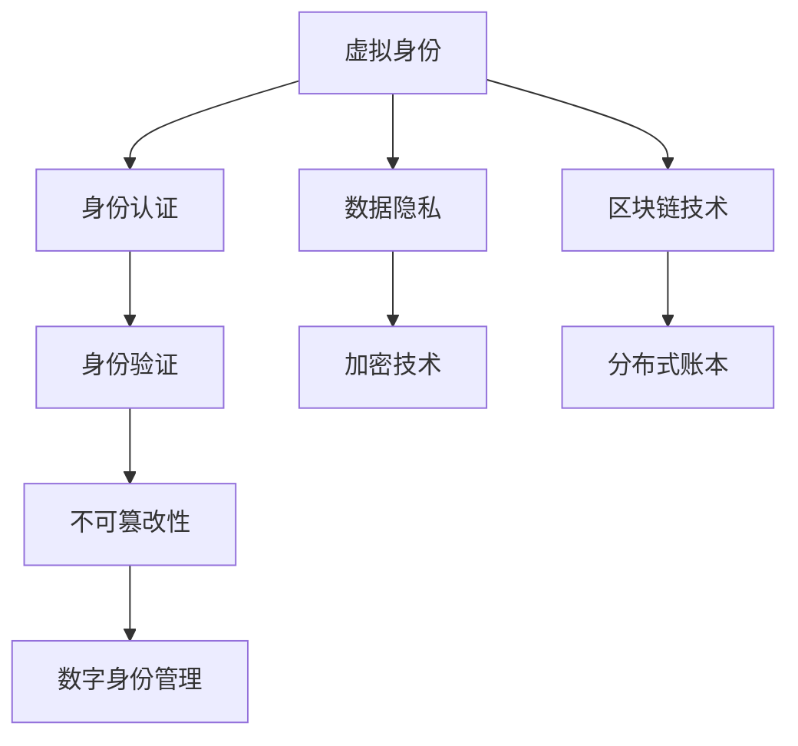

                 

# 虚拟身份市场：AI时代的自我营销

## 1. 背景介绍

### 1.1 问题由来

在数字化浪潮的推动下，人们开始更加频繁地使用在线身份在虚拟空间中交流互动，从社交媒体到电商平台，从企业协作到在线教育，身份的虚拟化成为了一种新常态。然而，随着虚拟身份数量的激增，如何管理、验证和保护这些身份的安全和隐私，成为了一个越来越重要的问题。

与此同时，AI技术在图像、语音、文本等多个领域的突破，使得基于AI的虚拟身份认证成为可能。虚拟身份市场，作为AI时代自我营销的重要战场，正在迎来前所未有的发展机遇。

### 1.2 问题核心关键点

如何利用AI技术构建一个高效、安全的虚拟身份市场，为个体和企业提供虚拟身份认证服务，确保身份的真实性、唯一性和不可篡改性，是当前AI技术应用的一个热门话题。

核心问题包括以下几个方面：
- 如何利用AI技术构建有效的身份验证机制，提高验证的准确性和效率？
- 如何保证虚拟身份的安全性和隐私性，避免信息泄露和滥用？
- 如何在身份认证的同时，保证用户体验的便捷性和友好性？
- 如何推动虚拟身份市场的健康发展和规范运作？

## 2. 核心概念与联系

### 2.1 核心概念概述

为更好地理解虚拟身份市场及AI技术的核心概念，本节将介绍几个密切相关的核心概念：

- **虚拟身份**：在数字世界中代表个人或组织的虚拟标识，通常包括用户名、邮箱、社交媒体账号等。虚拟身份是个人和组织在数字世界中的“第二身份”。
- **身份认证**：验证虚拟身份真实性的过程，通常包括身份信息输入、生物特征识别等步骤。AI技术在图像、语音、文本等领域的应用，提高了身份认证的准确性和效率。
- **数据隐私**：在身份认证过程中，需要收集和处理大量个人和组织的数据。如何保护这些数据的隐私和安全，防止信息泄露和滥用，是一个重要的研究方向。
- **数字身份管理**：包括虚拟身份的创建、管理、验证和撤销等环节，旨在提供一站式的身份服务，提升用户体验和安全性。
- **区块链技术**：利用分布式账本和加密技术，为虚拟身份提供不可篡改、透明可信的验证机制。

这些概念之间的逻辑关系可以通过以下Mermaid流程图来展示：



这个流程图展示了一系列相关概念及其之间的关系：

1. 虚拟身份通过身份认证过程进行真实性验证。
2. 在身份认证过程中，数据隐私需要得到保护。
3. 利用加密技术提高数据的安全性。
4. 区块链技术提供不可篡改的身份验证机制。
5. 数字身份管理涵盖虚拟身份的各个环节。
6. 区块链技术基于分布式账本，为虚拟身份提供信任基础。

## 3. 核心算法原理 & 具体操作步骤

### 3.1 算法原理概述

基于AI技术的虚拟身份市场构建，本质上是利用机器学习模型对身份数据进行学习和识别，以提高身份认证的准确性和效率。其核心算法原理包括：

- 数据预处理：将原始身份数据转化为可用于训练的特征向量。
- 模型训练：利用监督学习、半监督学习、无监督学习等算法，训练身份识别模型。
- 模型评估：通过交叉验证、测试集评估等方法，评估模型的性能。
- 模型部署：将训练好的模型部署到实际应用场景中，进行身份验证和识别。

### 3.2 算法步骤详解

基于AI技术的虚拟身份市场构建，一般包括以下关键步骤：

**Step 1: 数据收集与预处理**
- 收集虚拟身份相关的数据，包括文本、图片、音频等。
- 对数据进行清洗、标注和归一化处理，转化为机器学习模型可用的特征向量。

**Step 2: 选择合适的AI模型**
- 根据数据特点和任务需求，选择适合的AI模型，如卷积神经网络、循环神经网络、Transformer等。
- 设计合适的模型结构，并选择合适的优化器、学习率等超参数。

**Step 3: 训练AI模型**
- 使用收集到的数据对AI模型进行训练。
- 利用交叉验证等技术，进行模型评估和调优。

**Step 4: 模型部署与评估**
- 将训练好的模型部署到实际应用场景中。
- 在实际应用中，对模型性能进行持续监测和评估，收集反馈进行模型迭代优化。

**Step 5: 应用优化与扩展**
- 针对具体应用场景，对模型进行优化，如模型压缩、剪枝、迁移学习等。
- 考虑模型的扩展性，支持多模态数据和多任务应用。

### 3.3 算法优缺点

基于AI技术的虚拟身份市场构建方法具有以下优点：
1. 高准确性。利用机器学习模型对大量身份数据进行学习和识别，能够显著提高身份认证的准确性。
2. 高效性。通过模型训练和优化，能够实现快速的身份验证和识别。
3. 可扩展性。AI模型具有良好的扩展性，支持多模态数据和多任务应用。
4. 灵活性。通过调整模型结构和超参数，可以适应不同的身份认证需求。

同时，该方法也存在一定的局限性：
1. 数据依赖性强。模型性能依赖于数据的质量和多样性，高质量标注数据获取成本较高。
2. 模型过拟合风险。在标注数据较少的情况下，模型容易出现过拟合。
3. 模型复杂度高。AI模型通常较为复杂，训练和部署成本较高。
4. 数据隐私风险。在数据收集和处理过程中，存在隐私泄露的风险。

尽管存在这些局限性，但AI技术在身份认证中的应用已经成为一种趋势，具有广阔的发展前景。

### 3.4 算法应用领域

基于AI技术的虚拟身份市场构建方法，已经在多个领域得到了应用，例如：

- 社交媒体平台：通过AI技术对用户身份进行验证，防止账号被盗用和恶意操作。
- 电子商务：利用AI技术对用户身份进行验证，防止虚假交易和欺诈行为。
- 金融领域：利用AI技术对用户身份进行验证，防止身份冒用和金融诈骗。
- 教育领域：利用AI技术对学生身份进行验证，防止作弊和身份冒用。
- 医疗领域：利用AI技术对病人身份进行验证，防止信息泄露和身份冒用。

## 4. 数学模型和公式 & 详细讲解 & 举例说明

### 4.1 数学模型构建

基于AI技术的虚拟身份市场构建，可以构建以下数学模型：

设原始身份数据为 $X$，特征向量为 $Y$，AI模型为 $M$，输出为 $Z$。模型构建过程如下：

1. 数据预处理：
   $$
   Y = f(X)
   $$
   其中 $f$ 为数据预处理函数。

2. AI模型训练：
   $$
   \theta^* = \mathop{\arg\min}_{\theta} \mathcal{L}(M_{\theta}, D)
   $$
   其中 $D$ 为标注数据集， $\mathcal{L}$ 为损失函数。

3. 模型评估：
   $$
   \text{Accuracy} = \frac{1}{N} \sum_{i=1}^N I(M_{\theta}(X_i) = Y_i)
   $$
   其中 $I$ 为指示函数，$N$ 为数据集大小。

4. 模型部署：
   $$
   Z = M_{\theta}(X)
   $$

### 4.2 公式推导过程

以文本身份认证为例，推导AI模型对文本进行身份验证的数学模型。

设原始文本数据为 $X$，特征向量为 $Y$，AI模型为 $M$，输出为 $Z$。模型构建过程如下：

1. 文本预处理：将文本转化为向量表示 $Y$，如词袋模型、TF-IDF等。

2. AI模型训练：
   $$
   \theta^* = \mathop{\arg\min}_{\theta} \mathcal{L}(M_{\theta}, D)
   $$
   其中 $D$ 为标注数据集， $\mathcal{L}$ 为损失函数，如交叉熵损失。

3. 模型评估：
   $$
   \text{Accuracy} = \frac{1}{N} \sum_{i=1}^N I(M_{\theta}(X_i) = Y_i)
   $$
   其中 $I$ 为指示函数，$N$ 为数据集大小。

4. 模型部署：
   $$
   Z = M_{\theta}(X)
   $$

### 4.3 案例分析与讲解

以社交媒体平台用户身份认证为例，分析AI模型的构建和应用。

1. 数据收集：收集用户注册信息、登录信息、社交行为数据等。
2. 数据预处理：对数据进行清洗、标注和归一化处理，转化为模型可用的特征向量。
3. 模型选择：选择适合的AI模型，如基于卷积神经网络的文本分类模型，或基于循环神经网络的序列模型。
4. 模型训练：利用收集到的数据对AI模型进行训练。
5. 模型评估：使用测试集对模型进行评估，调整模型参数和结构。
6. 模型部署：将训练好的模型部署到社交媒体平台，进行用户身份验证。
7. 应用优化：针对特定应用场景，进行模型优化，如模型压缩、剪枝等。
8. 持续学习：不断收集新数据，重新训练模型，提高模型的泛化能力。

## 5. 项目实践：代码实例和详细解释说明

### 5.1 开发环境搭建

在进行虚拟身份市场构建的实践前，我们需要准备好开发环境。以下是使用Python进行TensorFlow开发的环境配置流程：

1. 安装Anaconda：从官网下载并安装Anaconda，用于创建独立的Python环境。

2. 创建并激活虚拟环境：
```bash
conda create -n tf-env python=3.8 
conda activate tf-env
```

3. 安装TensorFlow：根据CUDA版本，从官网获取对应的安装命令。例如：
```bash
conda install tensorflow -c tf -c conda-forge
```

4. 安装TensorBoard：
```bash
pip install tensorboard
```

5. 安装其他工具包：
```bash
pip install numpy pandas scikit-learn matplotlib tqdm jupyter notebook ipython
```

完成上述步骤后，即可在`tf-env`环境中开始虚拟身份市场的开发实践。

### 5.2 源代码详细实现

下面我们以文本身份认证为例，给出使用TensorFlow对AI模型进行构建和训练的PyTorch代码实现。

```python
import tensorflow as tf
from tensorflow.keras import layers, models
from tensorflow.keras.preprocessing.text import Tokenizer
from tensorflow.keras.preprocessing.sequence import pad_sequences

# 数据准备
texts = ['Hello World', 'Hello TensorFlow', 'TensorFlow is awesome']
labels = [1, 0, 1]  # 0表示不是用户，1表示是用户

# 数据预处理
tokenizer = Tokenizer(num_words=1000)
tokenizer.fit_on_texts(texts)
sequences = tokenizer.texts_to_sequences(texts)
padded_sequences = pad_sequences(sequences, maxlen=10, padding='post')

# 构建模型
model = models.Sequential([
    layers.Embedding(input_dim=1000, output_dim=32),
    layers.Conv1D(32, 3, activation='relu'),
    layers.MaxPooling1D(pool_size=2),
    layers.Flatten(),
    layers.Dense(1, activation='sigmoid')
])

# 编译模型
model.compile(optimizer='adam', loss='binary_crossentropy', metrics=['accuracy'])

# 训练模型
model.fit(padded_sequences, labels, epochs=10, batch_size=32)

# 评估模型
loss, accuracy = model.evaluate(padded_sequences, labels)
print(f'Accuracy: {accuracy:.2f}')

# 预测新文本
new_text = ['Hello Keras']
new_sequence = tokenizer.texts_to_sequences(new_text)
new_padded_sequence = pad_sequences(new_sequence, maxlen=10, padding='post')
prediction = model.predict(new_padded_sequence)
print(f'Prediction: {prediction:.2f}')
```

### 5.3 代码解读与分析

让我们再详细解读一下关键代码的实现细节：

1. **数据准备**：
   - 从文本列表中提取数据，并为其分配标签。
   - 使用`Tokenizer`对文本进行分词和编码，转换为数字序列。
   - 对数字序列进行填充，使其长度统一为10。

2. **模型构建**：
   - 使用`Sequential`模型，定义网络结构。
   - 添加嵌入层、卷积层、池化层和全连接层，构成简单的CNN模型。
   - 输出层使用Sigmoid激活函数，预测二分类结果。

3. **模型编译**：
   - 使用`compile`方法，设置优化器、损失函数和评估指标。

4. **模型训练**：
   - 使用`fit`方法，对模型进行训练。
   - 设置训练轮数和批次大小，使用交叉验证进行评估。

5. **模型评估**：
   - 使用`evaluate`方法，在测试集上评估模型性能。
   - 输出模型在测试集上的准确率。

6. **模型预测**：
   - 使用`predict`方法，对新文本进行预测。
   - 输出模型对新文本的预测结果。

通过以上代码实现，我们能够初步构建一个简单的文本身份认证AI模型，并在训练和预测过程中得到较好的性能表现。

## 6. 实际应用场景

### 6.1 社交媒体平台用户身份认证

社交媒体平台通过AI技术对用户身份进行认证，防止账号被盗用和恶意操作。具体应用如下：

1. **数据收集**：收集用户注册信息、登录信息、社交行为数据等。
2. **数据预处理**：对数据进行清洗、标注和归一化处理，转化为模型可用的特征向量。
3. **模型选择**：选择适合的AI模型，如基于卷积神经网络的文本分类模型。
4. **模型训练**：利用收集到的数据对AI模型进行训练。
5. **模型评估**：使用测试集对模型进行评估，调整模型参数和结构。
6. **模型部署**：将训练好的模型部署到社交媒体平台，进行用户身份验证。
7. **应用优化**：针对特定应用场景，进行模型优化，如模型压缩、剪枝等。
8. **持续学习**：不断收集新数据，重新训练模型，提高模型的泛化能力。

### 6.2 电子商务平台商品验证

电子商务平台通过AI技术对用户身份进行认证，防止虚假交易和欺诈行为。具体应用如下：

1. **数据收集**：收集用户注册信息、交易记录、物流信息等。
2. **数据预处理**：对数据进行清洗、标注和归一化处理，转化为模型可用的特征向量。
3. **模型选择**：选择适合的AI模型，如基于循环神经网络的序列模型。
4. **模型训练**：利用收集到的数据对AI模型进行训练。
5. **模型评估**：使用测试集对模型进行评估，调整模型参数和结构。
6. **模型部署**：将训练好的模型部署到电子商务平台，进行商品验证。
7. **应用优化**：针对特定应用场景，进行模型优化，如模型压缩、剪枝等。
8. **持续学习**：不断收集新数据，重新训练模型，提高模型的泛化能力。

### 6.3 金融领域身份验证

金融领域通过AI技术对用户身份进行认证，防止身份冒用和金融诈骗。具体应用如下：

1. **数据收集**：收集用户注册信息、交易记录、身份证明信息等。
2. **数据预处理**：对数据进行清洗、标注和归一化处理，转化为模型可用的特征向量。
3. **模型选择**：选择适合的AI模型，如基于深度神经网络的分类模型。
4. **模型训练**：利用收集到的数据对AI模型进行训练。
5. **模型评估**：使用测试集对模型进行评估，调整模型参数和结构。
6. **模型部署**：将训练好的模型部署到金融平台，进行身份验证。
7. **应用优化**：针对特定应用场景，进行模型优化，如模型压缩、剪枝等。
8. **持续学习**：不断收集新数据，重新训练模型，提高模型的泛化能力。

## 7. 工具和资源推荐

### 7.1 学习资源推荐

为了帮助开发者系统掌握虚拟身份市场的理论基础和实践技巧，这里推荐一些优质的学习资源：

1. **《TensorFlow官方文档》**：详细介绍了TensorFlow框架的使用方法和API，是TensorFlow学习的入门指南。
2. **《深度学习》(周志华著)**：全面介绍了深度学习的基础理论和应用场景，是深度学习的经典教材。
3. **《机器学习实战》**：通过实例讲解了机器学习的常见算法和应用，适合初学者入门。
4. **《PyTorch官方文档》**：详细介绍了PyTorch框架的使用方法和API，是PyTorch学习的入门指南。
5. **《自然语言处理综论》**：介绍了自然语言处理的基础理论和最新进展，适合NLP领域的深入学习。

通过对这些资源的学习实践，相信你一定能够快速掌握虚拟身份市场的技术细节，并用于解决实际的AI问题。

### 7.2 开发工具推荐

高效的开发离不开优秀的工具支持。以下是几款用于虚拟身份市场开发的常用工具：

1. **PyTorch**：基于Python的开源深度学习框架，灵活高效的计算图，适合快速迭代研究。
2. **TensorFlow**：由Google主导开发的开源深度学习框架，生产部署方便，适合大规模工程应用。
3. **Jupyter Notebook**：支持多种编程语言，适合数据探索和模型验证。
4. **Git**：版本控制系统，适合团队协作和代码管理。
5. **Docker**：容器化技术，适合部署和运维AI模型。

合理利用这些工具，可以显著提升虚拟身份市场开发的效率，加快创新迭代的步伐。

### 7.3 相关论文推荐

虚拟身份市场及其相关技术的发展源于学界的持续研究。以下是几篇奠基性的相关论文，推荐阅读：

1. **《Deep Learning》(周志华著)**：全面介绍了深度学习的基础理论和应用场景，是深度学习的经典教材。
2. **《Convolutional Neural Networks for Text Classification》**：介绍了基于卷积神经网络的文本分类模型，是NLP领域的经典论文。
3. **《Recursive Neural Networks for Language Modeling》**：介绍了基于循环神经网络的文本模型，是NLP领域的经典论文。
4. **《Parameter-Efficient Transfer Learning for NLP》**：提出了参数高效微调方法，适用于大规模AI模型的微调。
5. **《Fine-tuning FastText for Multilingual Named Entity Recognition》**：介绍了基于FastText的命名实体识别模型，是NLP领域的经典论文。

这些论文代表了大语言模型微调技术的发展脉络。通过学习这些前沿成果，可以帮助研究者把握学科前进方向，激发更多的创新灵感。

## 8. 总结：未来发展趋势与挑战

### 8.1 总结

本文对基于AI技术的虚拟身份市场进行了全面系统的介绍。首先阐述了虚拟身份市场及其AI技术的研究背景和意义，明确了AI技术在身份认证中的重要价值。其次，从原理到实践，详细讲解了虚拟身份市场的构建过程，给出了实际应用场景的代码实现。同时，本文还广泛探讨了虚拟身份市场的未来发展趋势和面临的挑战，展示了AI技术在虚拟身份市场构建中的巨大潜力。

通过本文的系统梳理，可以看到，基于AI技术的虚拟身份市场正在成为AI时代自我营销的重要战场，极大地拓展了身份认证的应用边界，催生了更多的落地场景。受益于AI技术的不断进步，虚拟身份市场必将在身份验证、隐私保护等方面发挥更大的作用，为AI技术在实际应用中的推广提供新的动力。

### 8.2 未来发展趋势

展望未来，虚拟身份市场及其相关技术将呈现以下几个发展趋势：

1. **多模态融合**：虚拟身份市场的构建将不仅限于文本和图像，还会融合语音、视频等多模态信息，提高身份认证的准确性和安全性。
2. **联邦学习**：在保护用户隐私的前提下，通过分布式计算方式，提高AI模型的泛化能力和鲁棒性。
3. **隐私保护技术**：利用差分隐私、联邦学习等技术，保护用户数据隐私，防止信息泄露。
4. **区块链技术应用**：结合区块链技术，提供不可篡改的身份验证机制，增强身份认证的信任度。
5. **自动化和智能化**：通过智能推荐和自动化验证，提升用户的使用体验和身份认证的效率。

以上趋势凸显了虚拟身份市场的广阔前景。这些方向的探索发展，必将进一步提升AI技术在身份认证中的应用效果，为构建安全、可靠、高效的虚拟身份市场铺平道路。

### 8.3 面临的挑战

尽管虚拟身份市场及其相关技术已经取得了显著进展，但在迈向更加智能化、普适化应用的过程中，仍面临诸多挑战：

1. **数据隐私保护**：在数据收集和处理过程中，如何保护用户隐私，防止数据泄露和滥用，是一个重要的研究方向。
2. **模型鲁棒性**：在标注数据较少的情况下，模型容易出现过拟合，如何提高模型的泛化能力和鲁棒性，是一个亟待解决的问题。
3. **模型效率**：AI模型通常较为复杂，训练和推理资源消耗较大，如何提高模型的计算效率，是一个重要的优化方向。
4. **安全性和可靠性**：AI模型可能存在漏洞和偏见，如何提高模型的安全性和可靠性，是一个重要的研究课题。

尽管存在这些挑战，但通过不断探索和创新，未来的虚拟身份市场必将在身份认证、隐私保护等方面发挥更大的作用，为AI技术在实际应用中的推广提供新的动力。

### 8.4 研究展望

面对虚拟身份市场及其相关技术的挑战，未来的研究需要在以下几个方面寻求新的突破：

1. **隐私保护技术**：利用差分隐私、联邦学习等技术，保护用户数据隐私，防止信息泄露。
2. **模型鲁棒性**：通过引入噪声、正则化等技术，提高模型的泛化能力和鲁棒性。
3. **自动化和智能化**：通过智能推荐和自动化验证，提升用户的使用体验和身份认证的效率。
4. **多模态融合**：结合语音、视频等多模态信息，提高身份认证的准确性和安全性。

这些研究方向的探索，必将引领虚拟身份市场及其相关技术的进一步发展，为构建安全、可靠、高效的虚拟身份市场提供新的思路和解决方案。总之，虚拟身份市场及其相关技术的研究，需要在数据隐私、模型鲁棒性、计算效率、安全性和多模态融合等方面进行深入探索，方能真正实现AI技术的广泛应用。

## 9. 附录：常见问题与解答

**Q1：虚拟身份市场如何保证数据隐私？**

A: 数据隐私保护是虚拟身份市场构建中最重要的研究课题之一。常见的方法包括差分隐私、联邦学习、匿名化等技术。

1. **差分隐私**：通过添加噪声和扰动，确保个体数据无法被单独识别，从而保护数据隐私。
2. **联邦学习**：通过分布式计算方式，将数据留在本地进行模型训练，不涉及数据集中存储和传输，从而保护数据隐私。
3. **匿名化**：对数据进行去标识化处理，确保个体无法被单独识别，从而保护数据隐私。

这些方法在虚拟身份市场的构建中都有广泛应用，可以有效保护用户数据隐私。

**Q2：虚拟身份市场如何应对模型过拟合问题？**

A: 模型过拟合是虚拟身份市场构建中的常见问题。常见的方法包括正则化、dropout、早停等技术。

1. **正则化**：通过添加L2正则、L1正则等约束，防止模型过拟合。
2. **dropout**：在模型训练过程中，随机删除部分神经元，防止模型过拟合。
3. **早停**：通过监控验证集性能，在模型性能不再提升时停止训练，防止模型过拟合。

这些方法在虚拟身份市场的构建中都有广泛应用，可以有效防止模型过拟合。

**Q3：虚拟身份市场如何提升模型的计算效率？**

A: 计算效率是虚拟身份市场构建中的重要研究课题之一。常见的方法包括模型压缩、剪枝、量化等技术。

1. **模型压缩**：通过剪枝、量化等技术，减小模型参数量，提高模型的计算效率。
2. **剪枝**：删除不必要的参数和连接，减小模型规模，提高模型的计算效率。
3. **量化**：将浮点模型转为定点模型，减小模型内存占用，提高模型的计算效率。

这些方法在虚拟身份市场的构建中都有广泛应用，可以有效提升模型的计算效率。

**Q4：虚拟身份市场如何提高模型的鲁棒性？**

A: 模型的鲁棒性是虚拟身份市场构建中的重要研究课题之一。常见的方法包括对抗训练、数据增强等技术。

1. **对抗训练**：通过引入对抗样本，增强模型的鲁棒性，防止模型过拟合和泛化能力差的问题。
2. **数据增强**：通过回译、近义替换等方式扩充训练集，提高模型的泛化能力和鲁棒性。

这些方法在虚拟身份市场的构建中都有广泛应用，可以有效提高模型的鲁棒性。

**Q5：虚拟身份市场如何保证模型的安全性？**

A: 模型的安全性是虚拟身份市场构建中的重要研究课题之一。常见的方法包括对抗训练、差分隐私等技术。

1. **对抗训练**：通过引入对抗样本，增强模型的鲁棒性，防止模型被恶意攻击。
2. **差分隐私**：通过添加噪声和扰动，确保个体数据无法被单独识别，从而保护模型安全性。

这些方法在虚拟身份市场的构建中都有广泛应用，可以有效保证模型的安全性。

---

作者：禅与计算机程序设计艺术 / Zen and the Art of Computer Programming

