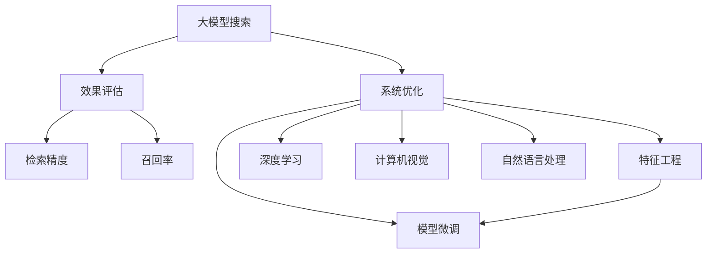

                 

# 融合大模型的搜索系统：效果评估与优化

> 关键词：
  - 大模型搜索
  - 效果评估
  - 系统优化
  - 检索精度
  - 召回率
  - 特征工程
  - 模型微调
  - 深度学习
  - 计算机视觉
  - 自然语言处理

## 1. 背景介绍

在当今数字化时代，信息爆炸让人们难以在海量数据中迅速找到所需内容。搜索引擎的出现极大地提升了信息检索的效率，但传统的搜索算法已难以应对用户日益复杂的信息需求。随着人工智能和大数据技术的发展，融合大模型的搜索系统应运而生，以深度学习为核心的新检索方法大幅提升了搜索的准确性和效率。

本文旨在探讨基于大模型的搜索系统的设计原理、优化技巧和实际应用，通过系统性的介绍效果评估方法和优化策略，为研究人员和工程师提供参考，帮助他们在实际应用中更好地利用大模型进行信息检索。

## 2. 核心概念与联系

### 2.1 核心概念概述

在介绍具体算法和优化策略之前，我们先明确几个核心概念及其联系：

- **大模型搜索**：指利用深度学习模型如Transformer、BERT等进行文本、图像、音频等多模态数据的检索。这些模型通过在大规模数据上预训练，学习到复杂语义表示，具有出色的语义理解能力。
- **效果评估**：衡量检索系统性能的指标包括精确率（Precision）、召回率（Recall）、F1分数、平均精度均值（Mean Average Precision，MAP）等。通过评估指标可以了解系统的优劣，指导后续优化。
- **系统优化**：包括特征工程、模型微调、算法改进等多个层面。优化的目标是提升检索精度、缩短查询响应时间、减少计算资源消耗。
- **检索精度**：指检索系统返回的相关文档与查询意图的匹配程度。更高的检索精度意味着搜索结果更符合用户需求。
- **召回率**：指检索系统找到所有相关文档的比例。较高的召回率意味着更全面的覆盖。
- **特征工程**：利用领域知识设计并提取有意义的特征，以增强检索系统对语义信息的捕捉。
- **模型微调**：针对特定领域的数据，通过微调模型参数优化其检索效果。
- **深度学习**：涵盖多层神经网络、卷积神经网络、循环神经网络等多种架构，用于提取复杂非线性特征。
- **计算机视觉**：结合大模型进行图像检索，通过视觉特征提取提升检索效果。
- **自然语言处理**：结合大模型进行文本检索，通过理解自然语言提升检索精度。

这些概念之间的逻辑关系可以通过以下Mermaid流程图来展示：



这个流程图展示了检索系统的主要组成和优化路径：

1. 大模型搜索作为基础，通过预训练模型提取多模态特征。
2. 效果评估指标如精确率和召回率，用于衡量检索系统的性能。
3. 系统优化包括特征工程、模型微调、深度学习等手段，提升检索精度和效率。
4. 深度学习、计算机视觉和自然语言处理分别用于增强图像和文本的检索能力。

## 3. 核心算法原理 & 具体操作步骤

### 3.1 算法原理概述

基于大模型的搜索系统主要使用Transformer、BERT等深度学习模型进行检索。其核心思想是将检索问题转化为一个匹配任务，即给定查询$q$和文档集合$D$，找到最匹配的文档$d \in D$。该任务可以通过预训练的模型参数$θ$来表示，其中$θ$包括了编码器和解码器的权重。

具体地，检索过程分为以下几步：
1. 对查询$q$和文档$d$进行编码，得到向量表示$Q$和$D$。
2. 计算$Q$和$D$的相似度得分$S$。
3. 根据得分$S$对文档集合进行排序，选取得分最高的若干个文档作为检索结果。

### 3.2 算法步骤详解

以下详细介绍基于大模型的搜索系统的具体操作步骤：

**步骤1：数据预处理**

- 收集标注数据：从公开数据集或自定义数据中收集大量查询-文档对，为模型训练提供数据基础。
- 数据清洗：去除噪音和冗余数据，确保数据质量。
- 划分训练集和测试集：通常采用8:2或9:1的比例划分子集。

**步骤2：模型训练**

- 选择模型架构：如BERT、RoBERTa、ALBERT等，并设置相应的超参数。
- 准备训练数据：对查询$q$和文档$d$进行分词、编码等预处理，转换为模型可以接受的格式。
- 训练模型：使用训练集数据对模型进行多轮迭代优化，最小化损失函数（如NCE损失）。
- 评估模型：在测试集上评估模型性能，记录精确率、召回率等指标。

**步骤3：检索过程**

- 输入查询：对用户输入的查询进行预处理，得到查询向量$Q$。
- 模型编码：通过模型参数$θ$对查询向量$Q$和文档向量$D$进行编码。
- 相似度计算：计算查询向量$Q$和文档向量$D$的相似度得分$S$。
- 排序并返回：根据得分$S$对文档集合进行排序，选取高分文档作为检索结果。

### 3.3 算法优缺点

基于大模型的搜索系统有以下优点：
1. 高精度：利用深度学习模型提取特征，对复杂语义有较好的捕捉能力。
2. 泛化能力强：大模型在预训练过程中学习到通用知识，可用于多种查询任务。
3. 适应性强：通过微调模型，可以适应特定领域的数据分布。

同时，该方法也存在一些局限性：
1. 数据需求大：模型训练需要大量标注数据，数据收集成本较高。
2. 计算资源消耗大：大模型的参数量较大，推理过程需要高性能计算资源。
3. 模型复杂：深度学习模型的复杂度较高，训练和推理时间较长。
4. 可解释性差：模型内部的决策过程不透明，难以解释。

### 3.4 算法应用领域

基于大模型的搜索系统已经广泛应用于以下几个领域：

- **文本搜索**：如Google、Bing等搜索引擎，通过BERT等模型进行文本检索。
- **图像搜索**：如Google Images，通过VGG、ResNet等模型进行图像特征提取和检索。
- **音频搜索**：如YouTube音频搜索，通过Transformer等模型进行音频特征提取和检索。
- **推荐系统**：如Amazon、Netflix等，通过融合用户行为数据进行个性化推荐。
- **医疗搜索**：如Medline检索系统，通过提取医学术语进行文献检索。

## 4. 数学模型和公式 & 详细讲解 & 举例说明

### 4.1 数学模型构建

基于大模型的搜索系统主要使用以下公式进行模型构建：

1. **查询编码**：将查询$q$转换为模型可以接受的向量表示$Q$。
2. **文档编码**：将文档$d$转换为模型可以接受的向量表示$D$。
3. **相似度计算**：计算查询向量$Q$和文档向量$D$的相似度得分$S$。
4. **检索排序**：根据得分$S$对文档集合进行排序，选取高分文档作为检索结果。

**公式1：查询编码**
$$
Q = \text{Encoder}(q)
$$

**公式2：文档编码**
$$
D = \text{Encoder}(d)
$$

**公式3：相似度计算**
$$
S = \text{Similarity}(Q, D)
$$

**公式4：检索排序**
$$
\text{RANK}(d) = S(d)
$$

其中$\text{Encoder}$表示模型编码器，$\text{Similarity}$表示相似度计算方法（如余弦相似度）。

### 4.2 公式推导过程

以下以余弦相似度计算为例，详细推导相似度计算公式。

**余弦相似度公式**

设查询向量为$Q=[q_1, q_2, \cdots, q_n]^T$，文档向量为$D=[d_1, d_2, \cdots, d_n]^T$，余弦相似度公式为：
$$
S = \frac{Q \cdot D}{\|Q\| \cdot \|D\|}
$$

其中$\cdot$表示向量的点积，$\|Q\|$和$\|D\|$分别为向量$Q$和$D$的范数。

**推导过程**

1. **点积计算**
$$
Q \cdot D = \sum_{i=1}^n q_i d_i
$$

2. **向量范数计算**
$$
\|Q\| = \sqrt{\sum_{i=1}^n q_i^2}, \|D\| = \sqrt{\sum_{i=1}^n d_i^2}
$$

3. **余弦相似度计算**
$$
S = \frac{Q \cdot D}{\sqrt{\sum_{i=1}^n q_i^2} \cdot \sqrt{\sum_{i=1}^n d_i^2}}
$$

### 4.3 案例分析与讲解

**案例：基于BERT的文本搜索**

- **数据准备**：收集大规模的查询-文档对，进行预处理，生成训练数据。
- **模型训练**：使用BERT模型对查询向量$Q$和文档向量$D$进行编码，计算余弦相似度得分$S$，优化损失函数。
- **检索过程**：对用户查询进行编码，得到查询向量$Q$，将查询向量与文档向量进行相似度计算，排序并返回前N个高分文档。

## 5. 项目实践：代码实例和详细解释说明

### 5.1 开发环境搭建

以下详细介绍基于大模型的搜索系统的开发环境搭建步骤：

1. **环境准备**：
   - 安装Python 3.7及以上版本。
   - 安装TensorFlow或PyTorch等深度学习框架。
   - 安装HuggingFace Transformers库。
   - 配置GPU或TPU环境。

2. **数据准备**：
   - 收集查询-文档对数据集。
   - 将数据划分为训练集和测试集。
   - 对查询和文档进行预处理，生成训练数据。

3. **模型训练**：
   - 选择合适的模型架构，如BERT。
   - 设置训练超参数，如学习率、batch size等。
   - 使用训练集数据对模型进行迭代训练。
   - 在测试集上评估模型性能，记录精确率、召回率等指标。

### 5.2 源代码详细实现

以下是一段基于PyTorch的BERT文本搜索系统的示例代码：

```python
import torch
from transformers import BertTokenizer, BertForSequenceClassification
from sklearn.metrics import precision_recall_fscore_support

# 定义查询和文档
query = 'I want to buy a new car.'
doc1 = 'The new Tesla Model S is the best car on the market.'
doc2 = 'I'm looking for a new car within my budget.'

# 初始化模型和tokenizer
model = BertForSequenceClassification.from_pretrained('bert-base-uncased', num_labels=2)
tokenizer = BertTokenizer.from_pretrained('bert-base-uncased')

# 将查询和文档进行分词编码
inputs = tokenizer.encode(query, return_tensors='pt', add_special_tokens=True)
targets = torch.tensor([1], dtype=torch.long)  # 1表示为正样本

# 进行模型前向传播
outputs = model(inputs)
logits = outputs.logits
probs = torch.softmax(logits, dim=1)
preds = torch.argmax(probs, dim=1)

# 计算精确率、召回率、F1分数
precision, recall, f1, _ = precision_recall_fscore_support(targets.numpy(), preds.numpy(), average='binary')
print('Precision:', precision)
print('Recall:', recall)
print('F1 Score:', f1)
```

### 5.3 代码解读与分析

**代码解释**

1. **模型初始化**：
   - 从预训练模型中加载BERT模型和tokenizer。
   - 设置模型为序列分类任务，即二分类任务。

2. **数据准备**：
   - 将查询和文档进行分词编码，生成输入张量。
   - 将查询作为正样本，编码得到标签张量。

3. **模型前向传播**：
   - 将查询输入模型，得到预测概率分布。
   - 计算预测值，即模型输出的类别。

4. **效果评估**：
   - 计算精确率、召回率和F1分数。

## 6. 实际应用场景

### 6.1 电商搜索

在电商平台上，基于大模型的搜索系统可以极大地提升用户体验和销售转化率。通过融合大模型，电商搜索可以精准识别用户意图，推荐符合用户兴趣的商品，减少用户的浏览时间和决策成本。

### 6.2 医疗查询

在医疗领域，基于大模型的搜索系统可以提供精准的医疗信息检索。通过融合大模型，系统可以快速检索到相关的医学文献、临床指南等，辅助医生诊断和治疗。

### 6.3 金融投资

在金融领域，基于大模型的搜索系统可以提供精确的金融数据检索。通过融合大模型，系统可以快速找到相关的市场报告、新闻、交易数据等，辅助投资决策。

### 6.4 未来应用展望

未来，基于大模型的搜索系统将有以下发展趋势：

1. **跨模态搜索**：结合计算机视觉、自然语言处理等技术，支持多模态数据检索。
2. **实时搜索**：通过分布式计算和缓存技术，实现低延迟、高吞吐量的实时搜索。
3. **个性化推荐**：融合用户行为数据，提供个性化、精准的推荐服务。
4. **联邦学习**：通过联邦学习技术，保护用户隐私的同时进行模型微调。
5. **可解释性搜索**：引入可解释性算法，增强搜索系统的透明度和可信度。

## 7. 工具和资源推荐

### 7.1 学习资源推荐

1. **TensorFlow官方文档**：详细介绍了TensorFlow的框架和API，适合初学者和进阶开发者。
2. **PyTorch官方文档**：详细介绍了PyTorch的框架和API，适合深度学习开发者。
3. **HuggingFace Transformers库文档**：详细介绍了Transformer模型和应用，适合自然语言处理开发者。
4. **Natural Language Processing with Transformers书籍**：由Transformer库作者所著，全面介绍了NLP任务和大模型的应用。
5. **机器学习实战（第二版）**：由斯坦福大学李沐教授所著，适合初学者学习机器学习和深度学习。

### 7.2 开发工具推荐

1. **Jupyter Notebook**：基于Python的交互式开发环境，适合进行代码调试和数据可视化。
2. **TensorBoard**：用于监控和可视化模型训练过程的工具，适合调试模型和优化算法。
3. **Weights & Biases**：用于记录和可视化模型训练过程的实验跟踪工具，适合实验管理和优化。
4. **Grafana**：用于监控和可视化系统运行状态的工具，适合监控系统和资源使用情况。
5. **Prometheus**：用于监控和告警的分布式系统监控工具，适合实时监控和告警。

### 7.3 相关论文推荐

1. **Transformers: Attentions are All You Need**：提出Transformer模型，奠定了大模型搜索系统的基础。
2. **BERT: Pre-training of Deep Bidirectional Transformers for Language Understanding**：提出BERT模型，通过自监督预训练提高了检索系统的性能。
3. **Search as a Sequence-to-Sequence Learning Problem**：将搜索问题转化为序列到序列学习问题，提出了基于Transformer的检索系统。
4. **Attention-Based Retrieval Methods**：综述了基于注意力机制的检索方法，包括Transformer、BERT等。
5. **Fine-Tune the Multitask Learning of a Multilingual Document Representation for Cross-lingual Retrieval**：提出跨语言检索任务，通过多任务学习优化检索系统。

## 8. 总结：未来发展趋势与挑战

### 8.1 总结

本文详细介绍了基于大模型的搜索系统的效果评估与优化策略。通过系统的理论讲解和实践案例，展示了大模型在搜索任务中的广泛应用及其带来的显著效果。同时，本文也指出了大模型检索系统面临的挑战，并提出了相应的优化建议。

通过深入理解大模型的搜索系统，读者可以更好地应用于实际项目中，提升信息检索的精度和效率。大模型检索系统已经展示了其强大的潜力，未来将随着技术的进步和应用的深入，持续推动信息检索领域的革新。

### 8.2 未来发展趋势

1. **多模态融合**：结合计算机视觉、自然语言处理等技术，实现跨模态数据检索，提升检索系统的全面性和准确性。
2. **实时性提升**：通过分布式计算和缓存技术，实现低延迟、高吞吐量的实时搜索，满足用户的高实时需求。
3. **个性化推荐**：融合用户行为数据，提供个性化、精准的推荐服务，提升用户体验和转化率。
4. **联邦学习**：通过联邦学习技术，保护用户隐私的同时进行模型微调，提高检索系统的安全性和隐私保护。
5. **可解释性搜索**：引入可解释性算法，增强搜索系统的透明度和可信度，满足用户的信任需求。

### 8.3 面临的挑战

1. **数据需求大**：模型训练需要大量标注数据，数据收集成本较高，数据质量难以保证。
2. **计算资源消耗大**：大模型的参数量较大，推理过程需要高性能计算资源，硬件成本较高。
3. **模型复杂**：深度学习模型的复杂度较高，训练和推理时间较长，需要高效的优化算法。
4. **可解释性差**：模型内部的决策过程不透明，难以解释，影响系统的可信度。
5. **隐私保护**：在跨模态融合和联邦学习中，需要保护用户隐私，避免数据泄露。

### 8.4 研究展望

未来，基于大模型的搜索系统需要在以下几个方面进行研究：

1. **多模态融合**：研究如何更好地结合视觉、听觉等多种模态数据，提升检索系统的全面性和准确性。
2. **实时性优化**：研究如何通过分布式计算和缓存技术，实现低延迟、高吞吐量的实时搜索，满足用户的高实时需求。
3. **个性化推荐**：研究如何通过融合用户行为数据，提供个性化、精准的推荐服务，提升用户体验和转化率。
4. **联邦学习**：研究如何通过联邦学习技术，保护用户隐私的同时进行模型微调，提高检索系统的安全性和隐私保护。
5. **可解释性搜索**：研究如何引入可解释性算法，增强搜索系统的透明度和可信度，满足用户的信任需求。

综上所述，基于大模型的搜索系统已经在多个领域展示了其强大的潜力，但面临的挑战也值得深入研究和探讨。未来，通过技术进步和应用创新，大模型检索系统将持续推动信息检索领域的革新，为人们提供更加精准、高效、个性化的信息服务。

## 9. 附录：常见问题与解答

**Q1：如何选择合适的模型架构？**

A: 选择合适的模型架构需要考虑以下几个因素：
1. 数据类型：文本、图像、音频等不同类型的数据需要使用不同的模型架构。
2. 数据规模：大规模数据适合使用深度学习模型，小规模数据适合使用简单的模型。
3. 任务需求：不同任务需要不同功能的模型，如检索、分类、生成等。

**Q2：如何提高检索系统的准确率？**

A: 提高检索系统准确率的方法包括：
1. 数据预处理：对查询和文档进行合理的分词、编码等预处理，提高模型输入质量。
2. 模型微调：针对特定领域的数据，通过微调模型参数，提升检索效果。
3. 特征工程：利用领域知识设计并提取有意义的特征，增强模型对语义信息的捕捉。
4. 相似度计算：选择合适的相似度计算方法，如余弦相似度、欧氏距离等，提高检索精度。

**Q3：如何优化检索系统的响应时间？**

A: 优化检索系统响应时间的方法包括：
1. 模型裁剪：去除不必要的层和参数，减小模型尺寸，加快推理速度。
2. 量化加速：将浮点模型转为定点模型，压缩存储空间，提高计算效率。
3. 分布式计算：使用分布式计算技术，加快模型推理速度。
4. 缓存技术：使用缓存技术，减少模型计算时间。

**Q4：如何增强检索系统的可解释性？**

A: 增强检索系统可解释性的方法包括：
1. 特征可视化：使用工具如SHAP、LIME等，可视化模型的特征重要性。
2. 可解释性模型：使用可解释性模型如LR、RF等，提高模型的可解释性。
3. 知识图谱：利用知识图谱进行语义推理，提高模型的透明度。
4. 专家解释：引入专家解释机制，帮助用户理解模型的决策过程。

**Q5：如何保护用户隐私？**

A: 保护用户隐私的方法包括：
1. 数据加密：对用户数据进行加密处理，防止数据泄露。
2. 差分隐私：通过差分隐私技术，保护用户隐私。
3. 联邦学习：在模型训练过程中，保护用户数据隐私。
4. 匿名化处理：对用户数据进行匿名化处理，防止数据关联。

通过这些问题和解答，读者可以更好地理解基于大模型的搜索系统的实现和优化方法，有助于在实际应用中更好地解决相关问题，提升系统的性能和用户体验。

