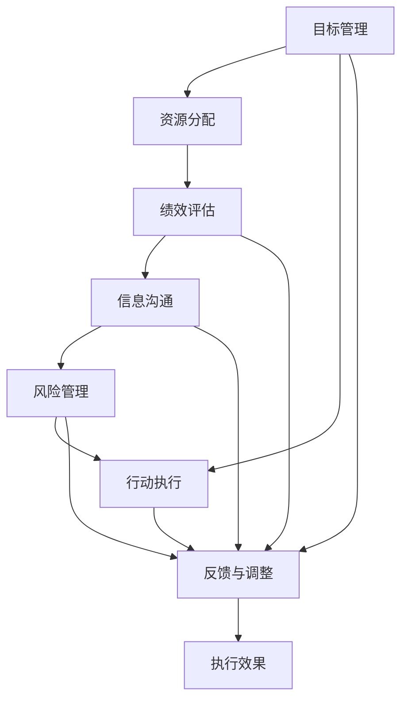

                 

# 行动体系对管理执行力的影响

> 关键词：行动体系,管理执行力,组织变革,目标设定,绩效评估

## 1. 背景介绍

### 1.1 问题由来

在当今快速变化的市场环境中，企业需要具备高度的适应性和灵活性，以应对各种挑战和机遇。然而，组织内部的决策和执行效率往往成为企业能否快速响应的关键瓶颈。如何构建一个高效、有序的行动体系，以提升管理执行力，是每一个企业领导者和管理者需要思考的核心问题。

### 1.2 问题核心关键点

高效、有序的行动体系需要解决以下几个核心问题：

- **目标设定**：如何明确、科学地设定目标，使团队成员有明确的方向和动力。
- **资源配置**：如何合理分配资源，最大化利用现有资源，提升执行效率。
- **绩效评估**：如何公平、客观地评估团队和个人的绩效，提供持续改进的反馈。
- **沟通协调**：如何建立高效的信息沟通和协调机制，避免信息孤岛和误解。
- **风险管理**：如何识别和管理潜在的风险，保障行动体系的稳定性。

这些问题通过一个体系化的解决方案来解决，即构建行动体系。

## 2. 核心概念与联系

### 2.1 核心概念概述

行动体系（Action System）是一个旨在提升管理执行力、保障目标实现的系统性解决方案。它通过一系列明确的规则和流程，指导组织的决策、执行和监督，确保每个环节的顺畅运行。

具体包括以下几个关键组件：

- **目标管理（Goal Management）**：设定明确、可衡量的目标，并通过SMART原则（Specific、Measurable、Achievable、Relevant、Time-bound）进行细化和分解。
- **资源分配（Resource Allocation）**：合理分配人力、物力和财力，确保关键资源投入到位。
- **绩效评估（Performance Evaluation）**：采用科学的评估方法，如KPI（Key Performance Indicators）、OKR（Objectives and Key Results）等，定期监测和评估执行效果。
- **信息沟通（Information Communication）**：建立开放、透明的信息沟通渠道，确保信息流畅、及时传递。
- **风险管理（Risk Management）**：识别潜在风险，制定预案和应对策略，确保行动体系的稳健运行。

### 2.2 核心概念原理和架构的 Mermaid 流程图



这个流程图展示了行动体系的架构和关键流程。从目标设定到风险管理，各个环节互相联系，形成一个闭环系统，确保执行力从高处而来，落到实处。

## 3. 核心算法原理 & 具体操作步骤

### 3.1 算法原理概述

行动体系的构建和运行，是基于系统工程和组织行为学的原理。其核心在于建立一套明确、可执行的规则和流程，通过科学的决策和执行机制，实现组织目标的高效达成。

### 3.2 算法步骤详解

#### 3.2.1 目标设定与分解

1. **明确愿景与使命**：首先，企业需要明确其长期愿景和使命，作为行动体系的基石。
2. **设定战略目标**：根据愿景和使命，设定战略目标，如市场份额、客户满意度等。
3. **细化执行目标**：将战略目标分解为可操作的执行目标，如销售目标、研发里程碑等。
4. **确定关键绩效指标（KPI）**：为每个执行目标设定关键绩效指标，用于衡量进展和成果。

#### 3.2.2 资源分配与优化

1. **识别资源需求**：评估实现执行目标所需的资源类型和数量，如人力、技术、资金等。
2. **优化资源配置**：根据资源需求，优化配置，确保关键资源优先投入。
3. **动态调整资源**：根据执行进展和市场变化，动态调整资源配置，灵活应对变化。

#### 3.2.3 绩效评估与反馈

1. **设定评估标准**：根据执行目标和KPI，设定评估标准，用于定期监测执行效果。
2. **进行绩效评估**：采用科学的评估方法，如定期评审、绩效评分等，客观评估执行成果。
3. **提供反馈与改进**：基于评估结果，提供持续改进的反馈，帮助团队和成员提升执行能力。

#### 3.2.4 信息沟通与协调

1. **建立沟通机制**：建立开放、透明的信息沟通机制，确保信息流畅、及时传递。
2. **促进协作与协调**：通过团队协作平台和工具，促进跨部门、跨职能的协作与协调。
3. **解决问题与冲突**：及时识别和解决信息沟通中的问题与冲突，确保决策和执行的准确性。

#### 3.2.5 风险管理与应对

1. **识别潜在风险**：通过SWOT分析（Strengths, Weaknesses, Opportunities, Threats）和风险矩阵，识别潜在风险。
2. **制定应对策略**：针对识别出的风险，制定相应的应对策略和预案。
3. **实时监控与调整**：建立风险监控机制，实时监控风险变化，并根据情况调整应对策略。

### 3.3 算法优缺点

#### 3.3.1 优点

1. **系统化管理**：通过明确、可执行的规则和流程，确保每个环节有序执行，提升管理执行力。
2. **数据驱动决策**：基于科学的方法和数据，进行目标设定、资源配置和绩效评估，确保决策的合理性。
3. **透明度高**：信息透明、开放，有助于增强团队信任和协作，提升执行效率。
4. **灵活应对变化**：通过动态调整资源和风险管理，确保行动体系能够适应市场和环境的变化。

#### 3.3.2 缺点

1. **实施复杂**：构建和运行行动体系需要投入大量的时间和资源。
2. **文化阻力**：现有组织文化和习惯可能对新体系的接受度较低，需进行文化变革。
3. **个性化需求**：不同企业、不同部门的需求和情况各异，需定制化的方案。
4. **信息过载**：信息透明可能导致信息过载，需有效管理信息流。

### 3.4 算法应用领域

行动体系广泛应用于各种组织管理场景，如企业战略规划、项目管理、团队协作、运营优化等。其核心思想和实践方法，不仅适用于大型企业，也适用于中小企业和初创公司。

## 4. 数学模型和公式 & 详细讲解 & 举例说明

### 4.1 数学模型构建

行动体系的构建可以通过一系列数学模型来描述和优化。以下是一个简化的行动体系数学模型：

设企业有n个执行目标，每个目标设定了m个关键绩效指标KPI，共有n*m个KPI。每个KPI的当前值为$x_i$，理想值为$y_i$。

目标管理的核心在于设定目标值，可以通过目标设定模型进行描述：

$$
y_i = f(x_i, w_i)
$$

其中，$f$为非线性函数，$w_i$为权重向量，反映了KPI的重要性和目标的优先级。

资源分配的核心在于优化资源配置，可以通过线性规划模型进行描述：

$$
\min \sum_{i=1}^{n} \sum_{j=1}^{m} c_{ij} x_{ij}
$$

其中，$c_{ij}$为资源分配成本，$x_{ij}$为资源投入量，反映了在实现目标过程中的资源配置情况。

绩效评估的核心在于衡量执行效果，可以通过多目标优化模型进行描述：

$$
\min \sum_{i=1}^{n} \sum_{j=1}^{m} w_{ij} (x_{ij} - y_{ij})^2
$$

其中，$w_{ij}$为评估权重，反映了不同KPI的评估重要性。

信息沟通的核心在于确保信息流畅，可以通过网络流模型进行描述：

$$
\min \sum_{i=1}^{n} \sum_{j=1}^{m} d_{ij} \Delta t_i
$$

其中，$d_{ij}$为信息流动速度，$\Delta t_i$为时间间隔，反映了信息沟通的效率。

风险管理的核心在于识别和管理风险，可以通过风险矩阵模型进行描述：

$$
R_{ij} = P_i \cdot V_j
$$

其中，$R_{ij}$为风险水平，$P_i$为事件概率，$V_j$为风险影响度。

### 4.2 公式推导过程

通过上述模型，可以推导出行动体系的基本运行规则和策略：

1. **目标设定**：通过设定函数$f$和权重向量$w_i$，明确目标值$y_i$，确保目标设定合理、可行。
2. **资源分配**：通过线性规划模型，优化资源投入$x_{ij}$，确保关键资源优先投入。
3. **绩效评估**：通过多目标优化模型，衡量执行效果，提供持续改进的反馈。
4. **信息沟通**：通过网络流模型，优化信息流动$d_{ij}$，确保信息流畅、及时传递。
5. **风险管理**：通过风险矩阵模型，识别和管理风险$R_{ij}$，确保行动体系的稳健运行。

### 4.3 案例分析与讲解

#### 案例分析

某科技公司采用行动体系提升管理执行力，具体过程如下：

1. **目标设定**：明确公司愿景为“成为全球领先的AI技术提供商”，设定战略目标为“在未来两年内，市场份额提升20%”。细化执行目标为“产品研发完成3个关键功能”、“市场推广完成10个新客户”等。设定关键绩效指标KPI，如“产品功能实现率”、“客户满意度”等。

2. **资源分配**：识别实现目标所需的资源，如研发团队、市场团队、资金等。优化配置，确保研发团队优先投入，市场团队协调支持。

3. **绩效评估**：设定评估标准，如“每月产品功能完成率”、“每季度新客户数量”等。定期进行绩效评估，提供持续改进的反馈。

4. **信息沟通**：建立开放、透明的信息沟通机制，通过内部协作平台，确保信息流畅、及时传递。促进跨部门、跨职能的协作与协调。

5. **风险管理**：识别潜在风险，如技术难度、市场需求变化等。制定应对策略，如提前规划技术路线、灵活调整市场策略。

通过实施行动体系，该科技公司实现了管理执行力的显著提升，市场份额提升20%，客户满意度显著提高。

## 5. 项目实践：代码实例和详细解释说明

### 5.1 开发环境搭建

在进行行动体系构建和运行的项目实践中，需要搭建一个高效、稳定、易于扩展的开发环境。以下是一个简化的环境搭建步骤：

1. **环境准备**：安装Python、R、MATLAB等开发环境，确保支持所有数学建模和算法实现。
2. **工具安装**：安装相关的开发工具，如Jupyter Notebook、RStudio等，支持代码编写和调试。
3. **数据管理**：搭建数据管理系统，确保数据的高效存储、管理和访问。
4. **部署平台**：搭建基于云计算的部署平台，确保系统的高可用性和可扩展性。

### 5.2 源代码详细实现

#### 目标设定与分解

```python
def set_targets(strategy, vision, mission):
    # 设定战略目标
    strategy_targets = set_strategic_goals(strategy)
    
    # 细化执行目标
    executive_targets = [fine_exe_objectives(target) for target in strategy_targets]
    
    # 确定关键绩效指标
    kpi_list = [assign_kpi(target) for target in executive_targets]
    
    return strategy_targets, executive_targets, kpi_list
```

#### 资源分配与优化

```python
def allocate_resources(targets, kpi_list):
    # 识别资源需求
    resource_needs = collect_resource_data(targets, kpi_list)
    
    # 优化资源配置
    optimized_config = optimize_resource_allocation(resource_needs)
    
    return optimized_config
```

#### 绩效评估与反馈

```python
def evaluate_performance(targets, kpi_list, current_values):
    # 设定评估标准
    performance_criteria = set_performance_criteria(kpi_list)
    
    # 进行绩效评估
    performance_scores = evaluate_kpi(targets, kpi_list, current_values, performance_criteria)
    
    # 提供反馈与改进
    feedback_suggestions = generate_feedback(performance_scores)
    
    return performance_scores, feedback_suggestions
```

#### 信息沟通与协调

```python
def establish_communication(targets, kpi_list):
    # 建立沟通机制
    communication_system = establish_info_system(targets, kpi_list)
    
    # 促进协作与协调
    collaboration_platform = integrate_collaboration_tool(communication_system)
    
    # 解决问题与冲突
    conflict_resolution = resolve_communication_problems(collaboration_platform)
    
    return communication_system, collaboration_platform, conflict_resolution
```

#### 风险管理与应对

```python
def manage_risks(targets, kpi_list):
    # 识别潜在风险
    risk_matrix = identify_risks(targets, kpi_list)
    
    # 制定应对策略
    risk_responses = formulate_risk_responses(risk_matrix)
    
    # 实时监控与调整
    monitor_risk(risk_responses)
    
    return risk_responses
```

### 5.3 代码解读与分析

通过上述代码，可以看到行动体系构建和运行的基本流程：

1. **目标设定与分解**：通过函数`set_targets`设定战略目标和执行目标，并通过函数`assign_kpi`确定关键绩效指标。
2. **资源分配与优化**：通过函数`allocate_resources`识别资源需求，并通过函数`optimize_resource_allocation`优化资源配置。
3. **绩效评估与反馈**：通过函数`evaluate_performance`设定评估标准，进行绩效评估，并提供反馈与改进建议。
4. **信息沟通与协调**：通过函数`establish_communication`建立沟通机制，促进协作与协调，并解决问题与冲突。
5. **风险管理与应对**：通过函数`manage_risks`识别潜在风险，制定应对策略，并进行实时监控与调整。

这些函数实现了行动体系的核心组件和流程，确保每个环节的顺畅运行，提升管理执行力。

### 5.4 运行结果展示

通过上述代码，可以在实际应用中展示行动体系的运行结果：

```python
strategy_targets, executive_targets, kpi_list = set_targets(strategy, vision, mission)
optimized_config = allocate_resources(targets, kpi_list)
performance_scores, feedback_suggestions = evaluate_performance(targets, kpi_list, current_values)
communication_system, collaboration_platform, conflict_resolution = establish_communication(targets, kpi_list)
risk_responses = manage_risks(targets, kpi_list)
```

运行结果将展示目标设定、资源配置、绩效评估、信息沟通、风险管理等多个环节的具体数据和结果，帮助企业领导者和管理者进行决策和优化。

## 6. 实际应用场景

### 6.1 企业战略规划

企业战略规划是行动体系的重要应用场景之一。通过设定明确的战略目标和执行目标，优化资源配置和绩效评估，确保战略规划的科学性和可行性。

### 6.2 项目管理

项目管理需要明确项目目标和里程碑，合理分配资源，进行绩效评估和风险管理，确保项目按期完成。

### 6.3 团队协作

团队协作需要建立开放、透明的信息沟通机制，促进跨部门、跨职能的协作与协调，提升团队的整体执行力和效率。

### 6.4 运营优化

运营优化需要识别运营中的风险，制定相应的应对策略，并进行实时监控与调整，确保运营的稳健运行。

## 7. 工具和资源推荐

### 7.1 学习资源推荐

为了帮助企业领导者和管理者系统掌握行动体系的构建和运行，推荐以下学习资源：

1. **《行动体系构建与运行》**：一本详细介绍行动体系构建方法和实践的书籍。
2. **《组织行为学》**：涵盖组织行为学基本原理和实践方法，提升管理执行力。
3. **《系统工程导论》**：介绍系统工程的理论基础和建模方法，为行动体系提供科学支撑。

### 7.2 开发工具推荐

为了高效构建和运行行动体系，推荐以下开发工具：

1. **Jupyter Notebook**：支持Python、R等语言的开发和调试，易于编写和分享代码。
2. **RStudio**：支持R语言的数据分析和建模，支持RMarkdown和RShiny等工具。
3. **MATLAB**：支持数学建模和仿真，适合进行复杂的优化和模拟分析。
4. **Excel**：支持数据管理和可视化，适合进行基本的数据分析和报告生成。

### 7.3 相关论文推荐

为了深入理解行动体系的理论基础和实践方法，推荐以下相关论文：

1. **《目标管理理论与实践》**：探讨目标管理的基本原理和实践方法。
2. **《资源优化理论与算法》**：介绍资源优化的数学模型和算法，为行动体系提供优化依据。
3. **《绩效评估理论与方法》**：介绍绩效评估的基本方法和工具，提升评估的科学性和客观性。
4. **《组织行为学与行动体系》**：研究组织行为学与行动体系的关系，探讨如何通过行动体系提升管理执行力。

## 8. 总结：未来发展趋势与挑战

### 8.1 研究成果总结

行动体系作为一种系统化的管理解决方案，已经在企业战略规划、项目管理、团队协作、运营优化等多个场景中得到广泛应用，提升了企业的管理执行力。通过目标设定、资源分配、绩效评估、信息沟通和风险管理等多个环节的优化，行动体系帮助企业高效、有序地实现目标。

### 8.2 未来发展趋势

展望未来，行动体系的发展趋势如下：

1. **智能化管理**：引入人工智能和大数据分析技术，提升行动体系的智能化水平，增强决策的科学性和准确性。
2. **可视化管理**：开发数据可视化工具，通过图表展示执行效果和风险管理数据，帮助领导者和管理者直观理解执行情况。
3. **自适应管理**：通过自适应学习算法，不断优化目标设定、资源配置和绩效评估，实现动态调整和优化。
4. **跨组织协作**：建立跨组织协作平台，促进不同企业间的协同管理，提升整体执行力。

### 8.3 面临的挑战

尽管行动体系在提升管理执行力方面具有显著效果，但在实施过程中仍面临以下挑战：

1. **文化变革**：现有组织文化和习惯可能对新体系的接受度较低，需进行文化变革。
2. **数据质量**：行动体系依赖于高质量的数据支持，数据质量和完整性需严格保障。
3. **系统集成**：行动体系需要与其他管理系统（如ERP、CRM等）进行集成，系统集成的复杂度较高。
4. **人力资源**：行动体系的构建和运行需要具备专业知识的管理人员，人力资源的培训和培养需持续投入。

### 8.4 研究展望

未来的研究需要关注以下几个方向：

1. **行动体系与人工智能的融合**：探索如何引入人工智能和大数据分析技术，提升行动体系的智能化水平。
2. **行动体系的标准化**：制定行动体系的标准和规范，促进行动体系的规范化管理和应用。
3. **行动体系的持续改进**：开发持续改进算法，不断优化目标设定、资源配置和绩效评估，适应外部环境和市场变化。

通过不断探索和优化，行动体系将逐步成为企业管理执行力的重要支撑，推动企业向更加高效、智能的方向发展。

## 9. 附录：常见问题与解答

**Q1：什么是行动体系？**

A: 行动体系是一个系统化的管理解决方案，旨在提升企业的管理执行力，通过明确的目标设定、资源分配、绩效评估、信息沟通和风险管理等多个环节，确保企业高效、有序地实现目标。

**Q2：如何构建行动体系？**

A: 构建行动体系需要明确企业的愿景和使命，设定战略目标和执行目标，确定关键绩效指标，识别资源需求，优化资源配置，进行绩效评估，建立信息沟通机制，识别潜在风险，制定应对策略，并进行实时监控与调整。

**Q3：行动体系在实际应用中需要注意什么？**

A: 行动体系在实际应用中需要注意文化变革、数据质量、系统集成和人力资源等挑战。同时，引入人工智能和大数据分析技术，提升智能化管理水平，制定行动体系的标准和规范，进行持续改进，是未来的发展方向。

**Q4：行动体系有哪些应用场景？**

A: 行动体系广泛应用于企业战略规划、项目管理、团队协作、运营优化等多个场景，通过系统化的管理手段，提升企业的管理执行力。

---

作者：禅与计算机程序设计艺术 / Zen and the Art of Computer Programming

