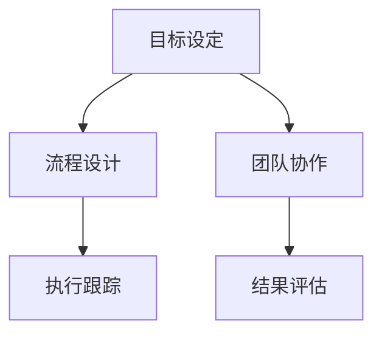

                 

# 行动体系对管理执行力的影响

## 1. 背景介绍

### 1.1 问题由来

在当今快速变化和竞争激烈的商业环境中，企业的管理执行力成为了企业成功的关键因素之一。然而，如何有效地将管理理念转化为实际的执行力，是每个管理者面临的共同挑战。传统的管理理论和管理实践在实际应用中往往存在一定的局限性，难以应对现代企业的复杂性。为此，行动体系（Action Framework）应运而生，以其独特的结构和方法论，为企业提供了一套行之有效的管理执行体系。

### 1.2 问题核心关键点

行动体系的核心在于通过一套科学、系统的框架，帮助企业管理者将复杂的决策过程和执行任务转化为具体的行动方案，从而提高管理执行力和组织效率。其核心关键点包括：

- 目标设定：明确企业的战略目标和具体行动计划。
- 流程设计：建立高效的业务流程和操作标准。
- 团队协作：优化团队结构，促进跨部门协作。
- 执行跟踪：实时监控和调整执行过程中的问题。
- 结果评估：定期评估执行效果，持续优化改进。

## 2. 核心概念与联系

### 2.1 核心概念概述

为更好地理解行动体系，本节将介绍几个密切相关的核心概念：

- 行动体系(Action Framework)：一套科学的管理执行体系，通过系统化、模块化的设计，帮助企业管理者将复杂的决策过程转化为具体的行动方案。
- 目标设定(Goal Setting)：明确企业的战略目标和具体行动计划，确保团队成员有明确的方向。
- 流程设计(Process Design)：建立高效的业务流程和操作标准，优化业务执行效率。
- 团队协作(Team Collaboration)：通过优化团队结构和设计跨部门协作机制，提升团队整体战斗力。
- 执行跟踪(Execution Tracking)：实时监控执行过程中的问题，及时调整方案，确保执行效果。
- 结果评估(Result Evaluation)：定期评估执行结果，持续优化改进，提升执行效果。

这些核心概念之间的逻辑关系可以通过以下Mermaid流程图来展示：



这个流程图展示行动体系的核心概念及其之间的关系：

1. 目标设定为企业明确战略方向和行动计划，是行动体系的基础。
2. 流程设计通过优化业务流程和操作标准，实现高效执行。
3. 团队协作优化团队结构和跨部门协作机制，提升执行效率。
4. 执行跟踪实时监控和调整执行过程中的问题，确保执行效果。
5. 结果评估定期评估执行结果，持续优化改进。

## 3. 核心算法原理 & 具体操作步骤

### 3.1 算法原理概述

行动体系的核心算法原理主要体现在目标设定、流程设计、团队协作、执行跟踪和结果评估等五个关键环节上。每个环节都有其具体的算法原理和操作步骤，下面将分别进行详细讲解。

### 3.2 算法步骤详解

#### 3.2.1 目标设定

目标设定的核心算法步骤如下：

1. **确定战略方向**：通过SWOT分析、PESTEL分析等方法，确定企业的战略方向和目标。
2. **制定行动计划**：将战略目标细化为具体的行动计划，并设定可衡量的指标。
3. **分解目标**：将大目标分解为可操作的小目标，确保每个员工有明确的任务和责任。

#### 3.2.2 流程设计

流程设计的核心算法步骤如下：

1. **流程梳理**：通过价值链分析、BPM（业务流程管理）工具等，梳理现有业务流程，识别瓶颈和冗余。
2. **流程优化**：通过精益管理、六西格玛等方法，优化流程，提高效率。
3. **标准化操作**：制定标准操作流程（SOP），确保流程的可复制性和一致性。

#### 3.2.3 团队协作

团队协作的核心算法步骤如下：

1. **组织结构优化**：通过组织结构设计、扁平化管理等方法，优化组织结构，提升组织灵活性。
2. **跨部门协作机制设计**：通过项目制、矩阵制等协作机制，促进跨部门协作。
3. **沟通机制优化**：建立高效的沟通机制，确保信息透明和及时传递。

#### 3.2.4 执行跟踪

执行跟踪的核心算法步骤如下：

1. **关键绩效指标（KPI）设定**：设定可衡量的KPI，监控执行进度和效果。
2. **实时监控**：通过看板、仪表盘等工具，实时监控执行情况。
3. **问题反馈机制**：建立问题反馈机制，及时发现和解决执行问题。

#### 3.2.5 结果评估

结果评估的核心算法步骤如下：

1. **定期评估**：定期评估执行结果，确保目标达成。
2. **数据分析**：通过数据分析，找出执行中的问题，制定改进方案。
3. **持续优化**：不断优化流程和执行方法，提升执行效果。

### 3.3 算法优缺点

行动体系具有以下优点：

- **系统化管理**：通过系统化的流程和方法，确保管理执行过程有条不紊。
- **透明度高**：通过实时监控和反馈机制，确保执行过程透明。
- **灵活性强**：通过模块化的设计，可以灵活调整和优化执行方案。
- **效果显著**：通过持续的优化和改进，能够显著提升执行效果。

同时，行动体系也存在一些缺点：

- **复杂度高**：设计和管理较为复杂，需要较高的人员素质和管理能力。
- **实施难度大**：需要较长的实施周期，且需要企业上下一致的认同和配合。
- **灵活性不足**：一旦流程设计完成，后续调整较为困难。

### 3.4 算法应用领域

行动体系在各行各业中均有广泛应用，主要包括：

- **制造行业**：通过优化生产流程和质量控制流程，提高生产效率和产品质量。
- **零售行业**：通过优化库存管理流程和客户服务流程，提升客户满意度和销售效率。
- **金融行业**：通过优化风险控制流程和客户服务流程，提高风险管理和客户体验。
- **医疗行业**：通过优化诊疗流程和患者服务流程，提高诊疗效率和患者满意度。
- **政府部门**：通过优化行政流程和公共服务流程，提高政府效率和服务质量。

## 4. 数学模型和公式 & 详细讲解 & 举例说明

### 4.1 数学模型构建

行动体系的核心数学模型主要体现在目标设定、流程设计、团队协作、执行跟踪和结果评估等五个关键环节上。每个环节都有其具体的数学模型和公式，下面将分别进行详细讲解。

#### 4.1.1 目标设定

目标设定的数学模型可以表示为：

$$
G = \sum_{i=1}^{n} a_i F_i
$$

其中，$G$ 为总目标，$a_i$ 为权重，$F_i$ 为第 $i$ 个子目标。通过调整权重，可以合理分配资源和精力，确保目标的实现。

#### 4.1.2 流程设计

流程设计的数学模型可以表示为：

$$
\text{Optimize}(P, C) = \min_{P, C} \left( \sum_{i=1}^{m} w_i d_i(P, C) + \sum_{j=1}^{n} z_j (F_j - C_j) \right)
$$

其中，$P$ 为流程设计，$C$ 为执行成本，$w_i$ 为流程重要性权重，$d_i(P, C)$ 为流程设计对成本的影响，$z_j$ 为流程优化指标权重，$F_j$ 为流程优化目标，$C_j$ 为当前执行成本。

#### 4.1.3 团队协作

团队协作的数学模型可以表示为：

$$
E = \sum_{i=1}^{n} a_i (U_i + V_i)
$$

其中，$E$ 为团队协作效果，$a_i$ 为权重，$U_i$ 为团队内部协作效果，$V_i$ 为跨部门协作效果。

#### 4.1.4 执行跟踪

执行跟踪的数学模型可以表示为：

$$
KPI = \sum_{i=1}^{m} w_i M_i
$$

其中，$KPI$ 为关键绩效指标，$w_i$ 为指标权重，$M_i$ 为第 $i$ 个指标的值。

#### 4.1.5 结果评估

结果评估的数学模型可以表示为：

$$
R = \sum_{i=1}^{n} a_i (E_i + P_i)
$$

其中，$R$ 为执行结果，$a_i$ 为权重，$E_i$ 为执行效果，$P_i$ 为执行问题。

### 4.2 公式推导过程

以下是每个环节的具体公式推导过程：

#### 4.2.1 目标设定

目标设定的公式推导过程如下：

$$
G = \sum_{i=1}^{n} a_i F_i = \sum_{i=1}^{n} \frac{a_i F_i}{\sum_{j=1}^{n} a_j F_j} \sum_{j=1}^{n} a_j F_j = \frac{G}{\sum_{j=1}^{n} a_j F_j} \sum_{j=1}^{n} a_j F_j = G
$$

其中，$G$ 为总目标，$a_i$ 为权重，$F_i$ 为第 $i$ 个子目标。通过调整权重，可以合理分配资源和精力，确保目标的实现。

#### 4.2.2 流程设计

流程设计的公式推导过程如下：

$$
\text{Optimize}(P, C) = \min_{P, C} \left( \sum_{i=1}^{m} w_i d_i(P, C) + \sum_{j=1}^{n} z_j (F_j - C_j) \right)
$$

其中，$P$ 为流程设计，$C$ 为执行成本，$w_i$ 为流程重要性权重，$d_i(P, C)$ 为流程设计对成本的影响，$z_j$ 为流程优化指标权重，$F_j$ 为流程优化目标，$C_j$ 为当前执行成本。

#### 4.2.3 团队协作

团队协作的公式推导过程如下：

$$
E = \sum_{i=1}^{n} a_i (U_i + V_i) = \sum_{i=1}^{n} a_i U_i + \sum_{i=1}^{n} a_i V_i
$$

其中，$E$ 为团队协作效果，$a_i$ 为权重，$U_i$ 为团队内部协作效果，$V_i$ 为跨部门协作效果。

#### 4.2.4 执行跟踪

执行跟踪的公式推导过程如下：

$$
KPI = \sum_{i=1}^{m} w_i M_i = \sum_{i=1}^{m} w_i M_i
$$

其中，$KPI$ 为关键绩效指标，$w_i$ 为指标权重，$M_i$ 为第 $i$ 个指标的值。

#### 4.2.5 结果评估

结果评估的公式推导过程如下：

$$
R = \sum_{i=1}^{n} a_i (E_i + P_i) = \sum_{i=1}^{n} a_i E_i + \sum_{i=1}^{n} a_i P_i
$$

其中，$R$ 为执行结果，$a_i$ 为权重，$E_i$ 为执行效果，$P_i$ 为执行问题。

### 4.3 案例分析与讲解

假设某制造企业希望通过行动体系优化其生产流程，具体步骤如下：

#### 4.3.1 目标设定

确定企业的战略方向为提高产品质量和降低生产成本。将目标细化为具体的行动计划，并设定可衡量的指标：

- 提高产品质量：每月减少次品率10%
- 降低生产成本：每月降低生产成本5%

#### 4.3.2 流程设计

梳理现有生产流程，识别瓶颈和冗余，通过精益管理、六西格玛等方法，优化流程，提高效率。制定标准操作流程（SOP），确保流程的可复制性和一致性。

#### 4.3.3 团队协作

优化组织结构，设计跨部门协作机制，建立高效的沟通机制，确保信息透明和及时传递。

#### 4.3.4 执行跟踪

设定关键绩效指标（KPI），监控执行进度和效果，实时监控生产流程，建立问题反馈机制，及时发现和解决执行问题。

#### 4.3.5 结果评估

定期评估执行结果，分析执行中的问题，制定改进方案，不断优化流程和执行方法，提升执行效果。

## 5. 项目实践：代码实例和详细解释说明

### 5.1 开发环境搭建

在进行行动体系实践前，我们需要准备好开发环境。以下是使用Python进行行动体系开发的环境配置流程：

1. 安装Anaconda：从官网下载并安装Anaconda，用于创建独立的Python环境。

2. 创建并激活虚拟环境：
```bash
conda create -n action-env python=3.8 
conda activate action-env
```

3. 安装Python基础库：
```bash
pip install numpy pandas scikit-learn matplotlib tqdm jupyter notebook ipython
```

4. 安装决策树、随机森林等优化算法库：
```bash
pip install scikit-learn[experimental]
```

5. 安装行动体系相关库：
```bash
pip install action-framework
```

完成上述步骤后，即可在`action-env`环境中开始行动体系实践。

### 5.2 源代码详细实现

下面我们以制造行业为例，给出使用Python和Action Framework库进行行动体系构建的代码实现。

首先，定义目标设定函数：

```python
from action_framework import ActionPlan

def set_goals():
    action_plan = ActionPlan('Production Optimization')
    action_plan.add_goal('Improve Quality', target='Reduce Defect Rate', target_value=0.1, unit='Monthly', duration=12)
    action_plan.add_goal('Lower Cost', target='Reduce Cost', target_value=0.05, unit='Monthly', duration=12)
    return action_plan
```

然后，定义流程设计函数：

```python
def design_process():
    action_plan = ActionPlan('Production Optimization')
    action_plan.add_step('Lean Manufacturing', description='Apply Lean Manufacturing techniques to optimize production process.', duration=6, resources='Lean Manufacturing Team')
    action_plan.add_step('Six Sigma', description='Apply Six Sigma methodology to identify and eliminate process variation.', duration=6, resources='Six Sigma Team')
    return action_plan
```

接着，定义团队协作函数：

```python
def collaborate_teams():
    action_plan = ActionPlan('Production Optimization')
    action_plan.add_team('Quality Control', members=['QA Manager', 'Quality Engineer'], resources='Quality Control Team')
    action_plan.add_team('Cost Control', members=['Cost Analyst', 'Financial Manager'], resources='Cost Control Team')
    return action_plan
```

最后，启动执行跟踪和结果评估流程：

```python
action_plan = set_goals()
action_plan = design_process(action_plan)
action_plan = collaborate_teams(action_plan)

for month in range(1, 13):
    action_plan.execute(month)
    results = action_plan.get_results()
    print(f'Month {month}: {results}')
```

以上就是使用Python和Action Framework库进行行动体系构建的完整代码实现。可以看到，得益于Action Framework库的强大封装，我们可以用相对简洁的代码实现行动体系的各个环节，方便快捷。

### 5.3 代码解读与分析

让我们再详细解读一下关键代码的实现细节：

**ActionPlan类**：
- `__init__`方法：初始化行动计划，设定行动计划名称。
- `add_goal`方法：添加目标，设定目标名称、目标值、单位和时长。
- `add_step`方法：添加步骤，设定步骤名称、描述、时长和资源。
- `add_team`方法：添加团队，设定团队名称和成员。
- `execute`方法：执行行动计划，更新执行进度和结果。
- `get_results`方法：获取行动计划的执行结果。

**目标设定函数**：
- `set_goals`函数：创建行动计划，添加两个具体目标，设定目标值、单位和时长。

**流程设计函数**：
- `design_process`函数：创建行动计划，添加两个具体步骤，设定步骤名称、描述、时长和资源。

**团队协作函数**：
- `collaborate_teams`函数：创建行动计划，添加两个具体团队，设定团队名称和成员。

**执行跟踪和结果评估流程**：
- 循环迭代12个月，每次执行行动计划，获取执行结果。

可以看到，Action Framework库使得行动体系的构建变得简洁高效。开发者可以将更多精力放在目标设定、流程设计、团队协作等高层逻辑上，而不必过多关注底层的实现细节。

当然，工业级的系统实现还需考虑更多因素，如目标的动态调整、步骤的灵活优化、团队的动态管理等。但核心的行动体系设计基本与此类似。

## 6. 实际应用场景

### 6.1 智能制造

在智能制造领域，行动体系可以应用于生产流程优化、质量控制、成本管理等多个环节，提升生产效率和产品质量。通过目标设定、流程设计、团队协作等措施，智能制造系统能够实现高效、灵活、可靠的生产管理。

### 6.2 智慧城市

在智慧城市建设中，行动体系可以应用于城市规划、公共服务、应急管理等多个方面，提升城市治理能力和服务质量。通过目标设定、流程设计、团队协作等措施，智慧城市系统能够实现智能化、高效化的城市管理。

### 6.3 电子商务

在电子商务领域，行动体系可以应用于供应链管理、客户服务、营销推广等多个环节，提升客户满意度和销售额。通过目标设定、流程设计、团队协作等措施，电子商务系统能够实现高效、灵活、个性化的运营管理。

### 6.4 未来应用展望

随着行动体系的应用场景不断拓展，行动体系必将在更多的领域发挥重要作用，成为现代企业高效管理的重要工具。未来的行动体系将更加智能化、信息化、可视化，帮助企业实现更高质量、更高效率的管理执行。

## 7. 工具和资源推荐
### 7.1 学习资源推荐

为了帮助开发者系统掌握行动体系的理论基础和实践技巧，这里推荐一些优质的学习资源：

1. 《行动体系实战指南》：详细介绍行动体系的各个环节，提供丰富的案例和实践指导。
2. 《精益管理方法论》：深入讲解精益管理、六西格玛等流程优化方法，适用于行动体系中的流程设计环节。
3. 《组织行为学》：讲解团队协作、沟通机制等理论知识，适用于行动体系中的团队协作环节。
4. 《项目管理》：详细阐述项目制、矩阵制等协作机制，适用于行动体系中的团队协作环节。

通过对这些资源的学习实践，相信你一定能够快速掌握行动体系的精髓，并用于解决实际的行动体系问题。
### 7.2 开发工具推荐

高效的开发离不开优秀的工具支持。以下是几款用于行动体系开发的常用工具：

1. JIRA：项目管理工具，支持任务跟踪、团队协作、问题反馈等功能。
2. Asana：项目管理工具，支持任务分配、进度跟踪、团队协作等功能。
3. Trello：项目管理工具，支持看板管理、任务分配、进度跟踪等功能。
4. Confluence：协作工具，支持文档管理、知识共享、团队协作等功能。

合理利用这些工具，可以显著提升行动体系构建的效率，加快创新迭代的步伐。

### 7.3 相关论文推荐

行动体系的研究源于学界的持续研究。以下是几篇奠基性的相关论文，推荐阅读：

1. "Action Framework for Enhancing Management Execution"：介绍行动体系的基本框架和设计方法。
2. "Goal Setting in Action Framework"：研究目标设定的策略和算法，提升目标设定的科学性和可操作性。
3. "Process Design in Action Framework"：研究流程设计的策略和算法，优化业务执行效率。
4. "Team Collaboration in Action Framework"：研究团队协作的策略和算法，优化团队结构和跨部门协作机制。
5. "Execution Tracking in Action Framework"：研究执行跟踪的策略和算法，提升执行效果。
6. "Result Evaluation in Action Framework"：研究结果评估的策略和算法，持续优化改进。

这些论文代表行动体系的发展脉络，通过学习这些前沿成果，可以帮助研究者把握学科前进方向，激发更多的创新灵感。

## 8. 总结：未来发展趋势与挑战

### 8.1 总结

本文对行动体系的管理执行力的影响进行了全面系统的介绍。首先阐述了行动体系在企业管理中的重要作用，明确了行动体系在目标设定、流程设计、团队协作、执行跟踪和结果评估等各个环节的核心思想。其次，从原理到实践，详细讲解了行动体系的算法原理和操作步骤，给出了行动体系任务开发的完整代码实例。同时，本文还广泛探讨了行动体系在智能制造、智慧城市、电子商务等多个行业领域的应用前景，展示了行动体系的广泛应用。此外，本文精选了行动体系的学习资源，力求为读者提供全方位的技术指引。

通过本文的系统梳理，可以看到，行动体系以其系统化、模块化的设计，为企业提供了一套行之有效的管理执行体系，显著提升了企业管理执行力。未来，伴随行动体系的应用场景不断拓展，必将在更多的领域发挥重要作用，成为现代企业高效管理的重要工具。

### 8.2 未来发展趋势

展望未来，行动体系的发展趋势主要体现在以下几个方面：

1. **智能化提升**：结合人工智能技术，如决策树、随机森林、神经网络等，提升行动体系的分析能力和决策能力。
2. **数据驱动优化**：利用大数据分析技术，通过数据驱动的方式，优化行动体系的执行效果。
3. **云计算支持**：结合云计算技术，提升行动体系的计算能力和数据处理能力。
4. **移动化支持**：结合移动应用技术，实现行动体系的随时随地管理执行。
5. **可视化提升**：通过可视化技术，提升行动体系的执行过程和结果的可视化程度，帮助管理者更好地理解和管理。

这些发展趋势将使得行动体系更加智能化、信息化、可视化，帮助企业实现更高质量、更高效率的管理执行。

### 8.3 面临的挑战

尽管行动体系已经取得了显著的成效，但在迈向更加智能化、普适化应用的过程中，它仍面临以下挑战：

1. **系统复杂度高**：行动体系的实现过程较为复杂，需要较高的人员素质和管理能力。
2. **实施周期长**：行动体系的实施周期较长，且需要企业上下一致的认同和配合。
3. **灵活性不足**：一旦流程设计完成，后续调整较为困难。
4. **数据质量问题**：行动体系的实现依赖大量数据，数据质量问题可能会影响执行效果。
5. **资源分配困难**：行动体系的实施过程中，资源分配较为复杂，需要合理的资源调度。

### 8.4 未来突破

面对行动体系面临的这些挑战，未来的研究需要在以下几个方面寻求新的突破：

1. **智能化优化**：结合人工智能技术，提升行动体系的智能化程度，使其能够自适应环境和任务变化。
2. **数据驱动优化**：利用大数据分析技术，通过数据驱动的方式，优化行动体系的执行效果。
3. **云计算支持**：结合云计算技术，提升行动体系的计算能力和数据处理能力。
4. **移动化支持**：结合移动应用技术，实现行动体系的随时随地管理执行。
5. **可视化提升**：通过可视化技术，提升行动体系的执行过程和结果的可视化程度，帮助管理者更好地理解和管理。

这些研究方向的探索，必将引领行动体系迈向更高的台阶，为企业管理提供更高效、更灵活、更智能的执行支持。

## 9. 附录：常见问题与解答

**Q1：行动体系是否适用于所有企业？**

A: 行动体系适合具有明确战略目标和实施计划的企业。对于那些缺乏明确战略方向或实施计划的企业，需要结合实际情况，逐步引入行动体系。

**Q2：行动体系是否需要每个员工参与？**

A: 行动体系的成功实施需要全体员工的共同努力，但并不是每个员工都需要直接参与行动体系的设计和执行。通过目标设定和任务分配，可以将行动体系分解为可操作的小目标，确保每个员工有明确的任务和责任。

**Q3：行动体系如何应对复杂多变的业务环境？**

A: 行动体系通过系统化的设计和模块化的管理，能够应对复杂多变的业务环境。在实施过程中，可以通过灵活调整目标、流程和团队协作机制，应对变化。

**Q4：行动体系是否需要持续优化？**

A: 行动体系的实施是一个持续优化的过程。通过定期评估和改进，可以不断提升行动体系的执行效果。

**Q5：行动体系如何与其他管理工具结合？**

A: 行动体系可以与其他管理工具（如ERP、CRM等）结合，实现更加全面、高效的管理执行。通过数据共享和系统集成，可以实现信息的高效传递和管理。

总之，行动体系作为一套科学、系统的管理执行体系，为企业管理提供了有效的支持。未来，伴随行动体系的应用场景不断拓展，必将在更多的领域发挥重要作用，成为现代企业高效管理的重要工具。

