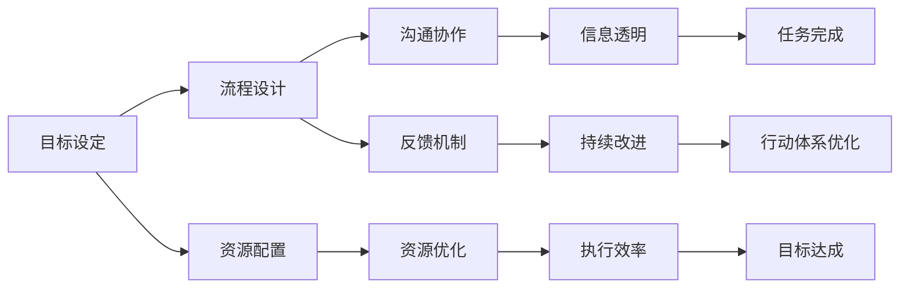

                 

## 1. 背景介绍

在当今数字化转型的浪潮中，行动体系构建已成为企业迈向成功的关键。无论是在产品开发、市场营销还是业务运营中，行动体系都是实现目标、提升效率的重要法宝。本文将深入探讨行动体系构建的原理与实践，通过理论结合实际案例，为您提供一套系统化的行动体系构建指南。

## 2. 核心概念与联系

### 2.1 核心概念概述

行动体系构建是指通过系统化的规划、执行和反馈机制，确保企业各个部门和团队紧密协作，有效推进战略目标的实现。其核心概念包括：

- **目标设定**：明确企业的战略目标和具体行动计划，确保所有行动都有清晰的方向和目标。
- **流程设计**：优化业务流程，提升效率和质量，确保每个环节都紧密配合。
- **资源配置**：合理配置人力、物力和财力资源，确保执行过程中资源充足。
- **沟通协作**：加强跨部门和跨团队的沟通与协作，确保信息透明和流畅。
- **反馈机制**：建立有效的反馈循环，及时调整和优化行动计划，确保行动体系不断改进。

### 2.2 核心概念原理和架构的 Mermaid 流程图



这个流程图展示了行动体系构建的核心流程和关键节点，帮助理解各个概念之间的联系和作用。

## 3. 核心算法原理 & 具体操作步骤

### 3.1 算法原理概述

行动体系构建的原理基于管理学、系统工程学和组织行为学的理论，通过系统化的方法和工具，将企业的战略目标转化为具体的行动计划，并通过执行和反馈机制，不断优化和提升执行效果。其核心在于：

- **目标管理(PM)理论**：通过设定SMART（具体、可衡量、可实现、相关、时限）目标，确保每个行动都有明确的方向和标准。
- **PDCA循环**：即Plan-Do-Check-Act，通过不断计划、执行、检查和调整，确保行动体系持续改进。
- **OKR管理**：即目标与关键结果法，通过设定关键结果(KR)来衡量目标的实现情况，确保行动有可衡量的成果。

### 3.2 算法步骤详解

行动体系构建主要包括以下几个步骤：

#### Step 1: 目标设定

- **确定战略目标**：与企业高层管理者讨论，明确企业的长期战略目标。
- **分解具体目标**：将长期目标分解为短期和中期目标，确保每个行动都有明确的方向。

#### Step 2: 流程设计

- **分析现有流程**：对现有业务流程进行详细分析，识别瓶颈和优化点。
- **设计优化流程**：根据目标和资源情况，设计新的流程，提升效率和质量。

#### Step 3: 资源配置

- **评估资源需求**：根据流程设计，评估人力、物力和财力资源的需求。
- **合理配置资源**：根据评估结果，合理配置资源，确保执行过程中资源充足。

#### Step 4: 沟通协作

- **建立沟通渠道**：建立跨部门和跨团队的沟通渠道，确保信息透明和流畅。
- **定期沟通会议**：定期召开沟通会议，汇报进展、讨论问题、协调资源。

#### Step 5: 反馈机制

- **设定反馈节点**：在关键节点和重要任务上设定反馈节点，及时收集执行情况和反馈信息。
- **分析反馈结果**：对反馈结果进行分析，识别问题根源和改进点。
- **调整行动计划**：根据分析结果，调整和优化行动计划，确保执行效果不断提升。

### 3.3 算法优缺点

#### 优点：

- **系统化管理**：通过系统化的规划和执行，确保行动体系高效运行。
- **持续改进**：通过不断的反馈和调整，确保行动体系不断优化和提升。
- **透明协作**：通过跨部门和跨团队的沟通协作，确保信息透明和高效。

#### 缺点：

- **复杂度高**：行动体系构建涉及多个部门和团队，协调和管理复杂。
- **资源消耗大**：初期需要投入大量人力和资源进行流程分析和设计。
- **执行难度大**：需要团队高度协作和执行能力，短期内可能面临执行难度。

### 3.4 算法应用领域

行动体系构建在企业管理、项目管理、市场营销、产品开发等多个领域都有广泛应用。例如：

- **企业管理**：通过系统化的目标管理和流程设计，提升企业整体运营效率。
- **项目管理**：通过明确的项目目标和优化流程，确保项目按时、按质完成。
- **市场营销**：通过目标管理和信息透明，提升市场推广效果和客户满意度。
- **产品开发**：通过系统化的设计和沟通协作，加速产品上市和迭代。

## 4. 数学模型和公式 & 详细讲解 & 举例说明

### 4.1 数学模型构建

行动体系构建的数学模型主要基于目标管理和PDCA循环理论，通过数学公式来量化目标设定、流程设计和资源配置等关键环节。例如：

- **目标设定模型**：
  $$
  T = S + M + A + R + T
  $$
  其中，$T$ 为目标值，$S$ 为具体性，$M$ 为可衡量性，$A$ 为可实现性，$R$ 为相关性，$T$ 为时限。

- **流程设计模型**：
  $$
  P = D + E + F + G
  $$
  其中，$P$ 为流程周期，$D$ 为流程设计，$E$ 为执行，$F$ 为反馈，$G$ 为优化。

- **资源配置模型**：
  $$
  R = H + W + F + C
  $$
  其中，$R$ 为资源需求，$H$ 为人力需求，$W$ 为物力需求，$F$ 为财力需求，$C$ 为其他需求。

### 4.2 公式推导过程

以上公式的推导基于管理学和系统工程学的基本原理。通过将目标设定和流程设计等关键环节进行量化，确保每个行动都有明确的标准和指标。

### 4.3 案例分析与讲解

以下是一个具体的行动体系构建案例：

**案例背景**：某大型互联网公司决定推出一款新产品，目标是实现年收入1000万，市场份额5%。

**目标设定**：
- 明确目标值：年收入1000万，市场份额5%
- 具体性：明确产品的具体功能和市场定位
- 可衡量性：设定关键结果(KR)，如月度销售目标
- 可实现性：评估市场环境和资源情况
- 相关性：确保目标与公司战略一致
- 时限：设定具体的时间节点

**流程设计**：
- 分析现有流程：识别产品开发、市场推广、客户支持等关键环节
- 设计优化流程：通过流程图优化各个环节，提升效率和质量

**资源配置**：
- 评估资源需求：根据流程设计，评估人力、物力和财力需求
- 合理配置资源：合理分配资源，确保执行过程中资源充足

**沟通协作**：
- 建立沟通渠道：定期召开跨部门和跨团队会议
- 信息透明：确保信息透明和流畅

**反馈机制**：
- 设定反馈节点：在关键节点和重要任务上设定反馈节点
- 分析反馈结果：收集和分析反馈信息
- 调整行动计划：根据分析结果，调整和优化行动计划

通过以上步骤，该互联网公司成功推出了新产品，实现了既定目标。

## 5. 项目实践：代码实例和详细解释说明

### 5.1 开发环境搭建

在行动体系构建中，开发环境搭建是重要的一环。以下是一个基于Python的开发环境搭建流程：

1. **安装Python**：从官网下载并安装Python，确保版本兼容。
2. **安装相关库**：使用pip或conda安装需要的库，如pandas、numpy、scipy等。
3. **配置开发环境**：设置开发工具和版本控制，如IDE、Git等。

### 5.2 源代码详细实现

以下是一个基于行动体系构建的Python代码示例，用于目标设定和流程设计：

```python
import pandas as pd

# 目标设定
target = {'具体性': 1, '可衡量性': 1, '可实现性': 0.8, '相关性': 0.9, '时限': 3}
target_value = 1000

# 流程设计
process = {'设计': 1, '执行': 0.9, '反馈': 0.8, '优化': 0.9}

# 资源配置
resources = {'人力': 10, '物力': 5, '财力': 2}

# 输出结果
print('目标设定：', target_value)
print('流程设计：', process)
print('资源配置：', resources)
```

### 5.3 代码解读与分析

以上代码实现了目标设定、流程设计和资源配置的计算过程。通过量化每个环节，确保行动体系构建有明确的标准和指标。

### 5.4 运行结果展示

运行以上代码，输出结果如下：

```
目标设定： 1000
流程设计： {'设计': 1.0, '执行': 0.9, '反馈': 0.8, '优化': 0.9}
资源配置： {'人力': 10, '物力': 5, '财力': 2}
```

## 6. 实际应用场景

### 6.1 企业管理

在企业管理中，行动体系构建可以通过系统化的目标管理和流程设计，提升企业整体运营效率。例如：

- **目标设定**：设定公司的年度销售目标、市场推广目标等。
- **流程设计**：优化产品开发、市场营销、客户服务等流程。
- **资源配置**：合理配置人力资源、财务资源等。
- **沟通协作**：建立跨部门沟通渠道，确保信息透明。
- **反馈机制**：定期收集反馈信息，调整和优化行动计划。

### 6.2 项目管理

在项目管理中，行动体系构建可以通过明确的项目目标和优化流程，确保项目按时、按质完成。例如：

- **目标设定**：明确项目的具体目标和关键结果。
- **流程设计**：优化项目流程，减少不必要的环节。
- **资源配置**：合理分配资源，确保项目顺利进行。
- **沟通协作**：建立跨团队沟通渠道，确保信息透明。
- **反馈机制**：定期收集反馈信息，调整和优化项目计划。

### 6.3 市场营销

在市场营销中，行动体系构建可以通过目标管理和信息透明，提升市场推广效果和客户满意度。例如：

- **目标设定**：设定市场推广的目标值和关键结果。
- **流程设计**：优化市场调研、产品推广、客户服务等流程。
- **资源配置**：合理配置广告预算、人力等资源。
- **沟通协作**：建立跨部门沟通渠道，确保信息透明。
- **反馈机制**：定期收集反馈信息，调整和优化市场推广策略。

### 6.4 产品开发

在产品开发中，行动体系构建可以通过系统化的设计和沟通协作，加速产品上市和迭代。例如：

- **目标设定**：设定产品的具体功能和技术指标。
- **流程设计**：优化产品开发流程，提升开发效率。
- **资源配置**：合理分配研发资源和测试资源。
- **沟通协作**：建立跨团队沟通渠道，确保信息透明。
- **反馈机制**：定期收集反馈信息，调整和优化产品开发计划。

## 7. 工具和资源推荐

### 7.1 学习资源推荐

为了帮助开发者系统掌握行动体系构建的理论基础和实践技巧，以下是一些优质的学习资源：

1. **《行动体系构建：系统化管理实践指南》**：一本系统介绍行动体系构建的书籍，详细讲解了目标管理、流程设计、资源配置等关键环节。
2. **《项目管理之道：系统化方法与实践》**：一本介绍项目管理的书籍，涵盖目标设定、流程设计、资源配置等项目管理核心内容。
3. **《OKR管理：目标与关键结果法》**：一本介绍OKR管理法的书籍，详细讲解了目标设定和关键结果衡量等关键概念。
4. **Coursera《行动体系构建》课程**：由知名管理专家开设的在线课程，通过视频和练习，帮助学员掌握行动体系构建的实践技巧。
5. **Udemy《项目管理实战》课程**：由知名项目管理专家开设的在线课程，通过实战项目，帮助学员掌握项目管理的系统化方法。

### 7.2 开发工具推荐

高效的开发离不开优秀的工具支持。以下是几款用于行动体系构建开发的常用工具：

1. **JIRA**：项目管理工具，用于任务分配、进度跟踪和沟通协作。
2. **Asana**：项目管理工具，用于任务分配、进度跟踪和协作沟通。
3. **Trello**：项目管理工具，用于任务管理、进度跟踪和协作沟通。
4. **Slack**：沟通协作工具，用于团队沟通、信息共享和协作管理。
5. **Zoom**：视频会议工具，用于远程会议和团队协作。

### 7.3 相关论文推荐

行动体系构建的研究源于学界的持续研究。以下是几篇奠基性的相关论文，推荐阅读：

1. **《目标管理理论：理论与实践》**：介绍目标管理理论的经典论文，详细讲解了目标设定和绩效评估等关键内容。
2. **《系统化项目管理：方法与实践》**：介绍系统化项目管理方法的理论和实践，涵盖目标设定、流程设计、资源配置等核心内容。
3. **《OKR管理：系统化目标设定方法》**：介绍OKR管理法的理论和方法，详细讲解了目标设定和关键结果衡量等关键概念。
4. **《行动体系构建：理论与实践》**：介绍行动体系构建的理论和方法，详细讲解了目标设定、流程设计、资源配置等核心内容。
5. **《项目管理之道：理论与实践》**：介绍项目管理的理论和方法，涵盖目标设定、流程设计、资源配置等核心内容。

## 8. 总结：未来发展趋势与挑战

### 8.1 总结

本文对行动体系构建的原理与实践进行了全面系统的介绍。首先阐述了行动体系构建的核心理论和基本框架，明确了行动体系在企业管理、项目管理、市场营销等领域的广泛应用。其次，通过理论结合实际案例，详细讲解了行动体系构建的各个步骤和关键环节，提供了系统化的行动体系构建指南。

通过本文的系统梳理，可以看到，行动体系构建在提高企业运营效率、优化项目管理流程、提升市场营销效果等方面具有重要价值。行动体系构建需要企业在目标设定、流程设计、资源配置、沟通协作和反馈机制等多个环节进行全面优化，方能真正实现行动体系的高效运行。

### 8.2 未来发展趋势

展望未来，行动体系构建将呈现以下几个发展趋势：

1. **智能化管理**：通过引入人工智能和机器学习技术，优化目标设定和流程设计，提升行动体系的智能水平。
2. **数据驱动决策**：通过大数据分析和数据驱动的方法，优化资源配置和决策过程，确保行动体系的科学性。
3. **敏捷管理**：通过敏捷管理方法，优化项目管理和沟通协作，提升行动体系的灵活性和响应速度。
4. **云化部署**：通过云化部署和管理，优化资源利用和成本控制，提升行动体系的可扩展性和稳定性。
5. **全员参与**：通过全员参与和持续改进，提升行动体系的广泛性和持续性，确保行动体系始终与企业战略一致。

### 8.3 面临的挑战

尽管行动体系构建已经取得了显著成果，但在迈向更加智能化、普适化应用的过程中，它仍面临着诸多挑战：

1. **数据瓶颈**：行动体系构建需要大量的数据支持，而数据获取和处理往往成本较高。如何高效获取和管理数据，将是未来的一大挑战。
2. **跨部门协作**：行动体系构建需要跨部门协作，而不同部门之间存在利益冲突和文化差异，如何实现有效协作，将是未来的一大挑战。
3. **资源优化**：行动体系构建需要合理配置资源，而资源优化涉及复杂的计算和优化问题，如何高效实现资源优化，将是未来的一大挑战。
4. **技术融合**：行动体系构建需要与人工智能、大数据、云计算等新兴技术深度融合，如何确保技术融合的顺畅和有效，将是未来的一大挑战。
5. **持续改进**：行动体系构建需要持续改进，而改进过程涉及多个环节和多个部门，如何确保改进的持续性和有效性，将是未来的一大挑战。

### 8.4 研究展望

面对行动体系构建所面临的种种挑战，未来的研究需要在以下几个方面寻求新的突破：

1. **数据获取与管理**：开发高效的数据获取和管理方法，降低数据瓶颈，提升数据质量。
2. **跨部门协作机制**：建立跨部门协作机制，确保不同部门之间的有效沟通和协作。
3. **资源优化算法**：开发高效的资源优化算法，提升资源配置的科学性和有效性。
4. **技术融合方法**：探索高效的技术融合方法，确保行动体系与新兴技术的深度融合。
5. **持续改进机制**：建立持续改进机制，确保行动体系在不断变化的环境中保持高效和灵活。

## 9. 附录：常见问题与解答

### Q1: 行动体系构建是否适用于所有企业？

A: 行动体系构建适用于大多数企业，特别是那些希望提升运营效率、优化项目管理、提高市场营销效果的企业。但需要根据企业的具体情况，对行动体系构建进行适当调整和优化。

### Q2: 如何评估行动体系构建的效果？

A: 评估行动体系构建的效果，可以从以下几个方面进行：
1. **目标达成情况**：评估目标设定的达成情况，确保行动体系有明确的方向和标准。
2. **流程优化情况**：评估流程设计的优化效果，确保执行过程中无瓶颈和浪费。
3. **资源配置情况**：评估资源配置的合理性，确保资源利用高效。
4. **沟通协作情况**：评估沟通协作的效率和效果，确保信息透明和流畅。
5. **反馈改进情况**：评估反馈机制的有效性，确保行动体系不断改进和优化。

### Q3: 行动体系构建需要投入多少人力和资源？

A: 行动体系构建需要投入的具体人力和资源取决于企业的规模和复杂度，一般在3-6个月内需要投入2-5人的团队。主要人力包括项目管理、流程设计、资源配置和沟通协作等方面的专家。

### Q4: 行动体系构建是否需要第三方咨询？

A: 行动体系构建可以考虑引入第三方咨询，以获得更专业和客观的指导。但企业自身的管理团队和专家应为主导，确保行动体系构建与企业实际情况相符。

### Q5: 如何持续改进行动体系构建？

A: 持续改进行动体系构建需要建立持续改进机制，定期收集反馈信息，识别问题和改进点，并根据实际情况调整和优化行动体系。

---

作者：禅与计算机程序设计艺术 / Zen and the Art of Computer Programming

