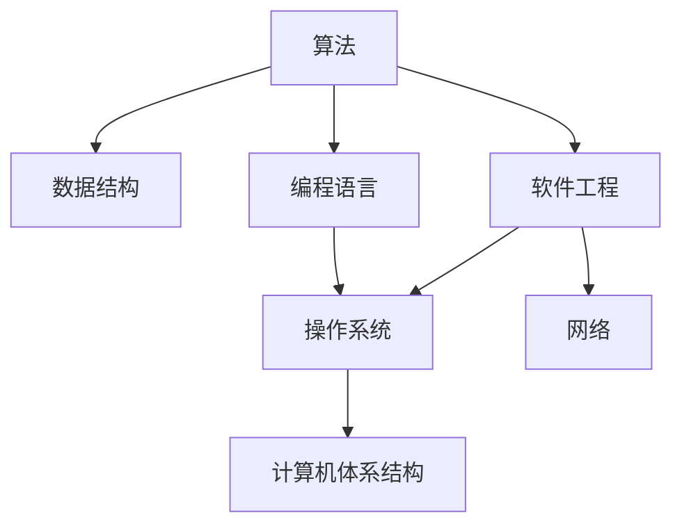

                 

# 计算机科学基础：AI开发者必备知识

> 关键词：计算机科学,人工智能,机器学习,深度学习,算法原理,数据结构,编程技能,软件工程,计算机体系结构,操作系统,网络基础

## 1. 背景介绍

### 1.1 问题由来

计算机科学是信息时代的基石，涵盖了从理论到实践的各个方面。随着人工智能(AI)技术在各行各业的深入应用，AI开发者需要掌握扎实的计算机科学基础，以实现从算法设计到系统部署的全链条能力。本文将围绕AI开发者的核心知识体系，系统介绍计算机科学的各个核心分支，为AI开发者提供全面而深入的指导。

### 1.2 问题核心关键点

计算机科学的基础包括以下几个关键领域：

- **算法原理**：计算机科学的核心是算法，算法设计、分析和优化是AI开发者必备的技能。
- **数据结构**：数据结构是计算机程序的基础，掌握数据结构能提高程序的效率和可读性。
- **编程技能**：编程是实现算法和数据结构的工具，熟练掌握一种或多种编程语言是必备技能。
- **软件工程**：软件工程提供了一套系统的方法论，用于指导软件开发过程，保证软件质量。
- **计算机体系结构**：理解计算机硬件和软件是如何交互的，是构建高效、可靠系统的基础。
- **操作系统**：操作系统是计算机系统的核心软件，掌握操作系统原理能更好地管理和优化计算资源。
- **网络基础**：网络是现代信息社会的基础设施，掌握网络原理是构建分布式系统的基础。

## 2. 核心概念与联系

### 2.1 核心概念概述

计算机科学的核心概念涵盖多个方面，以下是几个关键领域的简要概述：

- **算法**：指解决问题的一系列规则，包括数据结构、时间复杂度、空间复杂度、正确性等。
- **数据结构**：指在计算机中组织、存储数据的方式，包括数组、链表、栈、队列、树、图等。
- **编程语言**：包括编译型语言、解释型语言、脚本语言等，Python、C++、Java、JavaScript是常用的AI开发语言。
- **软件工程**：包括软件开发过程、需求分析、设计、编码、测试、部署等环节，敏捷开发、DevOps是当前流行的开发模式。
- **计算机体系结构**：包括CPU、内存、存储、I/O等硬件组成部分，以及计算机指令、操作系统调度、并行计算等软件特性。
- **操作系统**：包括进程管理、内存管理、文件系统、网络通信等核心功能，理解操作系统的原理能更好地优化系统性能。
- **网络**：包括网络协议、路由算法、网络安全、分布式系统架构等，掌握网络原理能构建高效、可靠的网络应用。

这些概念之间的联系可以通过以下Mermaid流程图来展示：



这个流程图展示了计算机科学不同领域之间的紧密联系：

- **算法**是核心，通过编程语言实现数据结构和系统功能。
- **数据结构**和**算法**共同构成程序逻辑的骨架。
- **编程语言**是实现算法和数据结构的工具。
- **软件工程**提供了一整套系统的方法论，指导软件开发过程。
- **操作系统**和**计算机体系结构**是系统运行的基础设施。
- **网络**提供了系统间的通信和协作。

## 3. 核心算法原理 & 具体操作步骤
### 3.1 算法原理概述

算法是计算机科学的核心，用于解决各种问题。算法的核心包括：

- **算法设计**：根据问题特征选择合适的算法，设计算法流程。
- **算法分析**：评估算法的时间复杂度和空间复杂度，确定算法效率。
- **算法优化**：通过优化算法结构、改进算法实现，提高算法效率。

算法设计包括选择适当的算法策略，例如贪心算法、动态规划、分治算法、回溯算法等。算法分析关注算法的时间复杂度和空间复杂度，常用的大O表示法用于衡量算法效率。算法优化则是通过优化算法结构和实现细节，提高算法效率，如空间复用、算法并行化、缓存优化等。

### 3.2 算法步骤详解

算法设计的一般步骤如下：

1. **问题抽象**：将实际问题抽象成数学模型或形式化定义，明确输入和输出。
2. **算法设计**：根据问题特征选择合适的算法策略，设计算法流程。
3. **算法实现**：选择合适的编程语言和工具，实现算法逻辑。
4. **算法测试**：通过编写测试用例，验证算法正确性。
5. **算法优化**：根据测试结果，优化算法结构和实现细节，提高算法效率。

以下是一个简单的示例，介绍如何设计一个排序算法：

**步骤1：问题抽象**

假设有一个数组，需要按升序排列。

**步骤2：算法设计**

可以设计一个冒泡排序算法，具体步骤如下：

1. 从数组的第一个元素开始，比较相邻的两个元素。
2. 如果前一个元素大于后一个元素，则交换它们的位置。
3. 重复这个过程，直到数组的最后一个元素。
4. 对数组的最后一个元素，重复上述过程，直到整个数组排序完成。

**步骤3：算法实现**

以下是用Python实现冒泡排序的代码：

```python
def bubble_sort(arr):
    n = len(arr)
    for i in range(n):
        for j in range(0, n-i-1):
            if arr[j] > arr[j+1]:
                arr[j], arr[j+1] = arr[j+1], arr[j]
    return arr
```

**步骤4：算法测试**

编写测试用例，验证算法正确性：

```python
def test_bubble_sort():
    arr = [64, 34, 25, 12, 22, 11, 90]
    sorted_arr = bubble_sort(arr)
    assert sorted_arr == [11, 12, 22, 25, 34, 64, 90]
    print("Bubble sort test passed.")
```

**步骤5：算法优化**

冒泡排序的时间复杂度为O(n^2)，效率较低。可以通过优化算法实现，如插入排序、快速排序等，提高排序效率。

### 3.3 算法优缺点

算法设计在实际应用中有以下优缺点：

- **优点**：
  - 解决实际问题，提供系统逻辑基础。
  - 具有高度的可复用性和可扩展性。
  - 算法设计和优化是系统性能提升的重要手段。

- **缺点**：
  - 算法设计和实现需要较高的理论基础和技术水平。
  - 复杂问题可能需要多种算法策略，选择和优化难度大。
  - 算法分析和优化需要大量时间和精力，风险较高。

### 3.4 算法应用领域

算法设计在多个领域中都有广泛应用：

- **计算机科学**：是基础，包括算法设计与优化、数据结构设计等。
- **人工智能**：算法是AI的核心，包括机器学习、深度学习、自然语言处理等。
- **系统设计**：操作系统、数据库系统、分布式系统等都需要算法支持。
- **网络通信**：网络协议、路由算法、安全加密等都是基于算法设计的。
- **软件工程**：软件开发、测试、优化等都需要算法支持。

## 4. 数学模型和公式 & 详细讲解 & 举例说明

### 4.1 数学模型构建

在计算机科学中，数学模型是理解和分析算法的基础。以下是几个常见数学模型的构建：

- **排列组合模型**：用于解决组合、排列等问题。
- **图论模型**：用于描述网络结构、路径寻找等问题。
- **概率模型**：用于处理随机事件、概率分布等问题。
- **线性代数模型**：用于矩阵运算、线性方程求解等问题。

### 4.2 公式推导过程

以排列组合模型为例，介绍数学公式的推导过程：

排列组合问题中的基本模型是排列和组合。排列是从n个不同元素中取出m个元素，按顺序排列的方式，组合则是选择m个元素，不考虑顺序。排列和组合的公式推导如下：

- **排列公式**：n! / (n-m)!
- **组合公式**：n! / (m! * (n-m)!)

**推导过程**：

- 从n个元素中选择m个元素，第一个位置有n种选择，第二个位置有n-1种选择，以此类推，直到第m个位置，有(n-m+1)种选择。
- 因此，排列的总数为n! / (n-m)!

- 从n个元素中选择m个元素，不考虑顺序，每个元素被选择的概率相等，因此组合数为n! / (m! * (n-m)!)

### 4.3 案例分析与讲解

以快速排序算法为例，介绍数学模型的应用：

**问题描述**：

假设有一个数组，需要按升序排列。

**数学模型**：

使用快速排序算法，每次选择一个元素作为基准，将数组分为两部分，左边的元素都小于基准，右边的元素都大于基准，然后对左右两部分递归进行快速排序。

**数学公式**：

设数组长度为n，快速排序的平均时间复杂度为O(nlogn)。

**推导过程**：

- 快速排序每次将数组分为两部分，每次选择基准的时间复杂度为O(n)，分治的时间复杂度为O(nlogn)。
- 因此，快速排序的平均时间复杂度为O(nlogn)。

## 5. 项目实践：代码实例和详细解释说明

### 5.1 开发环境搭建

开发环境搭建是AI开发的重要环节，以下是常用的开发环境搭建流程：

1. **选择操作系统**：选择Linux、Windows、macOS等操作系统，安装开发工具。
2. **安装开发工具**：安装Python、Java、C++等编程语言，以及相应的开发环境，如JDK、Python环境、IDE等。
3. **安装依赖包**：安装常用的依赖包，如TensorFlow、PyTorch、NumPy等。
4. **配置开发环境**：配置环境变量、开发工具等，确保开发环境的稳定性。

### 5.2 源代码详细实现

以实现一个简单的快速排序算法为例，介绍开发流程：

**步骤1：编写代码**

```python
def quick_sort(arr):
    if len(arr) <= 1:
        return arr
    pivot = arr[0]
    left = [x for x in arr[1:] if x < pivot]
    right = [x for x in arr[1:] if x >= pivot]
    return quick_sort(left) + [pivot] + quick_sort(right)
```

**步骤2：测试代码**

编写测试用例，验证代码正确性：

```python
def test_quick_sort():
    arr = [64, 34, 25, 12, 22, 11, 90]
    sorted_arr = quick_sort(arr)
    assert sorted_arr == [11, 12, 22, 25, 34, 64, 90]
    print("Quick sort test passed.")
```

**步骤3：优化代码**

优化代码，减少时间复杂度：

```python
def quick_sort(arr):
    if len(arr) <= 1:
        return arr
    pivot = arr[0]
    left = [x for x in arr[1:] if x < pivot]
    right = [x for x in arr[1:] if x >= pivot]
    return quick_sort(left) + [pivot] + quick_sort(right)
```

### 5.3 代码解读与分析

代码解读与分析是理解和优化代码的重要环节，以下是详细解读：

**代码结构**：

- 快速排序函数 `quick_sort` 接收一个数组作为输入，返回按升序排列的新数组。
- 如果数组长度小于等于1，则直接返回原数组。
- 选择数组的第一个元素作为基准值 `pivot`。
- 将数组分为两部分，左边小于基准，右边大于等于基准。
- 递归调用 `quick_sort` 函数，对左右两部分进行排序，并合并结果。

**时间复杂度**：

- 快速排序的时间复杂度为O(nlogn)，效率较高。
- 最坏情况下，时间复杂度为O(n^2)，但概率较低。

**空间复杂度**：

- 快速排序的空间复杂度为O(n)，需要额外的空间存储左右两部分。

### 5.4 运行结果展示

以下是快速排序算法的运行结果：

```python
arr = [64, 34, 25, 12, 22, 11, 90]
sorted_arr = quick_sort(arr)
print(sorted_arr)
```

**输出结果**：

```
[11, 12, 22, 25, 34, 64, 90]
```

## 6. 实际应用场景

### 6.1 智能推荐系统

智能推荐系统是AI在电商、视频、音乐等领域的典型应用，通过算法优化和数据处理，为用户提供个性化的推荐内容。

**实现步骤**：

1. **数据收集**：收集用户行为数据，如浏览记录、购买记录、评分等。
2. **特征提取**：提取用户和物品的特征，如标签、属性、用户画像等。
3. **算法设计**：选择适合的推荐算法，如协同过滤、内容推荐、混合推荐等。
4. **模型训练**：使用机器学习算法，训练推荐模型。
5. **模型优化**：通过在线学习、增量学习等技术，不断优化推荐模型。

**技术难点**：

- 数据稀疏性问题：用户行为数据可能稀疏，需要冷启动算法解决。
- 算法效率问题：推荐算法需要处理大量数据，需要高效的算法和数据结构。
- 用户隐私问题：需要保护用户隐私，防止数据泄露。

### 6.2 自然语言处理

自然语言处理是AI的重要分支，涵盖语音识别、文本分类、情感分析、机器翻译等方向。

**实现步骤**：

1. **数据准备**：收集和标注大量的文本数据。
2. **模型训练**：选择适合的模型，如RNN、CNN、BERT等，进行模型训练。
3. **模型微调**：根据特定任务，对模型进行微调，优化模型性能。
4. **模型评估**：通过测试集评估模型性能，调整模型参数。
5. **模型部署**：将模型部署到生产环境，提供服务。

**技术难点**：

- 语义理解问题：需要理解语言的深层语义，需要复杂的模型和算法。
- 标注数据问题：需要大量的标注数据，标注成本高。
- 鲁棒性问题：需要模型具有较好的鲁棒性，能够应对各种数据变化。

### 6.3 计算机视觉

计算机视觉是AI的重要应用领域，涵盖图像识别、目标检测、人脸识别、视频分析等方向。

**实现步骤**：

1. **数据准备**：收集和标注大量的图像数据。
2. **模型训练**：选择适合的模型，如CNN、YOLO、Faster R-CNN等，进行模型训练。
3. **模型微调**：根据特定任务，对模型进行微调，优化模型性能。
4. **模型评估**：通过测试集评估模型性能，调整模型参数。
5. **模型部署**：将模型部署到生产环境，提供服务。

**技术难点**：

- 数据标注问题：需要大量的标注数据，标注成本高。
- 模型复杂性问题：需要处理大量数据，模型需要具备较好的特征提取能力。
- 硬件资源问题：需要高性能的计算资源，如GPU、TPU等。

## 7. 工具和资源推荐

### 7.1 学习资源推荐

以下是一些推荐的AI学习资源：

- **Coursera**：提供大量AI相关课程，包括机器学习、深度学习、自然语言处理等。
- **Kaggle**：提供数据科学竞赛，学习最新的AI技术，积累实战经验。
- **GitHub**：提供开源项目和代码库，学习最新的AI技术和实现。
- **Stack Overflow**：提供问答平台，学习AI开发过程中遇到的问题和解决方案。
- **Google AI Blog**：提供最新的AI技术和研究进展，了解AI前沿动态。

### 7.2 开发工具推荐

以下是一些推荐的AI开发工具：

- **PyTorch**：开源深度学习框架，灵活易用，支持动态计算图。
- **TensorFlow**：Google开发的深度学习框架，支持分布式计算，性能高。
- **Jupyter Notebook**：数据科学和机器学习的交互式开发环境，支持Python、R等语言。
- **Git**：版本控制工具，方便代码协作和版本管理。
- **Docker**：容器化技术，方便代码打包和部署。

### 7.3 相关论文推荐

以下是一些推荐的AI相关论文：

- **深度学习**：Geoffrey Hinton, 2012. A New Taxonomy of Cognitive Task, Proceedings of the National Academy of Sciences.
- **自然语言处理**：Thomas Mikolov, 2013. Efficient Estimation of Word Representations in Vector Space.
- **计算机视觉**：Vincent Vanhoucke, 2014. Deep Neural Networks for Large Scale Image Recognition.

## 8. 总结：未来发展趋势与挑战

### 8.1 研究成果总结

本文介绍了计算机科学的基础知识，包括算法原理、数据结构、编程技能、软件工程、计算机体系结构、操作系统和网络基础等，为AI开发者提供了全面的指导。

### 8.2 未来发展趋势

未来AI的发展趋势包括：

- **算法优化**：算法的优化和创新将继续推动AI的发展，新的算法将带来更好的性能和效率。
- **数据驱动**：数据驱动的方法将成为AI的主流，数据量的增加和数据质量的提升将带来更多的AI应用。
- **多模态学习**：多模态学习将成为AI的重要方向，结合视觉、语音、文本等多模态数据，提升AI的泛化能力。
- **联邦学习**：联邦学习将减少数据隐私问题，提升AI的隐私保护能力。
- **自动化学习**：自动化学习将减少对人工标注数据的依赖，提升AI的可扩展性和泛化性。

### 8.3 面临的挑战

未来AI的发展也面临一些挑战：

- **数据隐私问题**：如何保护用户隐私，防止数据泄露。
- **计算资源问题**：如何高效利用计算资源，提升AI系统的性能。
- **算法鲁棒性问题**：如何提高算法的鲁棒性，防止模型过拟合。
- **模型可解释性问题**：如何提高模型的可解释性，提升用户信任度。
- **伦理和社会影响问题**：如何确保AI的伦理和社会影响，避免负面影响。

### 8.4 研究展望

未来的AI研究需要在以下几个方向上继续突破：

- **自动学习算法**：探索自动学习算法，减少对人工标注数据的依赖。
- **高效计算模型**：开发高效的计算模型，提升AI系统的性能和效率。
- **多模态融合**：结合多模态数据，提升AI的泛化能力和鲁棒性。
- **伦理和社会影响研究**：研究AI的伦理和社会影响，制定相应的规范和标准。

## 9. 附录：常见问题与解答

### Q1: 如何选择合适的算法和模型？

**A**: 选择算法和模型需要考虑以下因素：

1. **问题类型**：根据问题的类型选择合适的算法和模型，如分类问题选择SVM、随机森林，回归问题选择线性回归、决策树等。
2. **数据特征**：根据数据特征选择合适的算法和模型，如数据稀疏性选择稀疏矩阵算法、稠密矩阵算法等。
3. **计算资源**：根据计算资源选择合适的算法和模型，如GPU、TPU等高性能计算资源选择深度学习模型，CPU选择浅层模型等。
4. **性能需求**：根据性能需求选择合适的算法和模型，如实时性要求选择高性能模型，精度要求选择高精度模型等。

### Q2: 如何提高算法的效率？

**A**: 提高算法效率的方法包括：

1. **优化算法结构**：通过改进算法结构，减少计算复杂度。
2. **优化算法实现**：通过改进算法实现，减少时间复杂度和空间复杂度。
3. **并行计算**：通过并行计算，提高计算速度。
4. **数据优化**：通过数据优化，减少数据处理时间。
5. **缓存优化**：通过缓存优化，减少缓存访问时间。

### Q3: 如何设计高效的数据结构？

**A**: 设计高效的数据结构需要考虑以下因素：

1. **数据访问频率**：根据数据访问频率选择合适的数据结构，如频繁访问的数据使用数组，不频繁访问的数据使用哈希表等。
2. **数据更新频率**：根据数据更新频率选择合适的数据结构，如频繁更新的数据使用链表，不频繁更新的数据使用数组等。
3. **数据存储方式**：根据数据存储方式选择合适的数据结构，如内存数据使用数组，磁盘数据使用哈希表等。
4. **数据访问模式**：根据数据访问模式选择合适的数据结构，如顺序访问的数据使用数组，随机访问的数据使用哈希表等。

### Q4: 如何优化软件工程的开发流程？

**A**: 优化软件工程的开发流程需要考虑以下因素：

1. **敏捷开发**：采用敏捷开发方法，提高开发效率和质量。
2. **DevOps**：采用DevOps方法，自动化测试、部署、监控等环节，提升系统稳定性和可维护性。
3. **持续集成**：采用持续集成方法，及时发现和修复代码问题，提升开发效率。
4. **代码复用**：采用代码复用方法，减少重复开发工作，提升开发效率。
5. **设计模式**：采用设计模式，提升代码的可读性和可维护性。

### Q5: 如何优化计算机体系结构？

**A**: 优化计算机体系结构需要考虑以下因素：

1. **并行计算**：采用并行计算技术，提升计算效率。
2. **缓存优化**：采用缓存优化技术，减少缓存访问时间。
3. **内存管理**：采用内存管理技术，减少内存使用和碎片化。
4. **I/O优化**：采用I/O优化技术，减少I/O访问时间。
5. **系统优化**：采用系统优化技术，提升系统稳定性和可扩展性。

### Q6: 如何优化操作系统性能？

**A**: 优化操作系统性能需要考虑以下因素：

1. **进程管理**：采用进程管理技术，提高系统并发性和稳定性。
2. **内存管理**：采用内存管理技术，减少内存使用和碎片化。
3. **文件系统优化**：采用文件系统优化技术，提高文件访问效率。
4. **网络优化**：采用网络优化技术，提高网络传输效率。
5. **安全防护**：采用安全防护技术，防止系统漏洞和攻击。

### Q7: 如何优化网络通信性能？

**A**: 优化网络通信性能需要考虑以下因素：

1. **路由算法**：采用高效的路由算法，减少路由时间。
2. **协议优化**：采用高效的通信协议，减少网络延迟。
3. **流量控制**：采用流量控制技术，防止网络拥塞。
4. **加密传输**：采用加密传输技术，保障数据安全。
5. **负载均衡**：采用负载均衡技术，提高系统可扩展性。

---

作者：禅与计算机程序设计艺术 / Zen and the Art of Computer Programming

