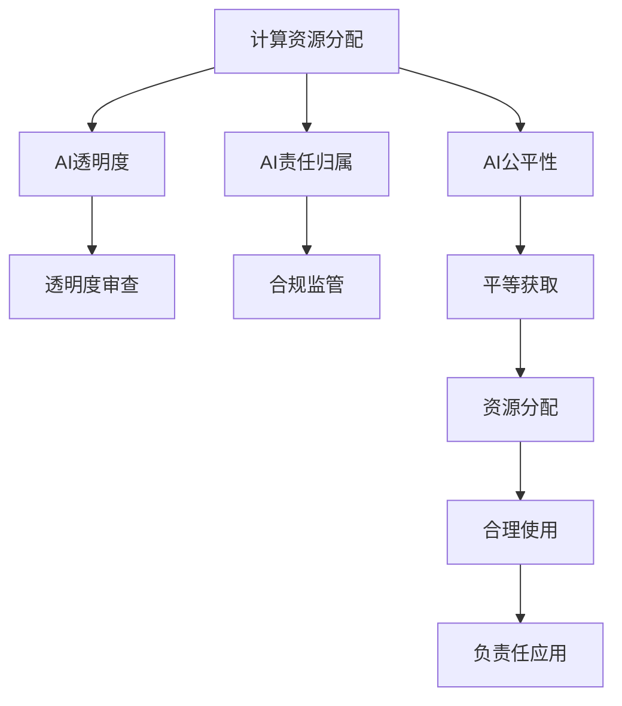

                 

# 计算资源与AI权力：谁将主导未来？

随着人工智能（AI）技术的迅猛发展，计算资源在AI的演进过程中扮演着至关重要的角色。本文将深入探讨计算资源与AI权力的关系，并分析它们如何塑造未来技术发展的趋势。

## 1. 背景介绍

### 1.1 问题由来

随着深度学习、机器学习和自然语言处理等AI技术的进步，计算资源成为了推动技术创新的关键。尤其是近年来，大规模的GPU、TPU和超算资源的广泛应用，使得AI技术能够处理越来越复杂的计算任务，并在图像识别、自然语言处理、自动驾驶等多个领域取得了突破性的进展。计算资源的丰富程度在很大程度上决定了AI技术的成熟度和应用能力。

然而，随着AI技术的深入应用，计算资源的分配和使用也引发了一系列社会、伦理和政治问题。如何合理分配计算资源，以确保其能够公平、透明地服务于全体社会，成为了一个亟需解决的难题。

### 1.2 问题核心关键点

当前计算资源与AI权力之间的关系可以从以下几个方面进行分析：

- **计算资源：**指用于AI模型训练、推理和部署的计算硬件和软件资源，包括GPU、TPU、云计算平台、数据中心等。
- **AI权力：**指在AI技术开发和应用过程中，由掌握和控制计算资源的一方所拥有的决策权、控制权和影响力。
- **公平性：**指在AI技术开发和应用过程中，计算资源分配的公平性问题，即如何确保各类参与者能够平等获取计算资源，避免资源垄断和不公。
- **透明度：**指AI模型和计算资源使用的透明度问题，即如何确保AI模型的训练、推理和部署过程是公开透明的，可被审查和监督。
- **责任归属：**指在AI技术应用过程中，计算资源使用方所应承担的责任和义务，包括伦理审查、合规监管、数据保护等。

理解这些关键点，有助于我们深入分析计算资源与AI权力之间的关系，并制定相应的策略，以促进AI技术的健康发展和广泛应用。

## 2. 核心概念与联系

### 2.1 核心概念概述

- **计算资源分配：**指将计算资源合理分配给各类主体，包括学术机构、企业、政府等，以支持其进行AI研究和应用。
- **计算资源垄断：**指少数机构或个人掌握了大部分计算资源，形成资源垄断，阻碍其他主体参与AI研究和应用。
- **AI公平性：**指在AI技术研究和应用过程中，各类主体能够平等获取和利用计算资源，避免资源垄断和不公。
- **AI透明度：**指AI模型和计算资源使用的公开透明，可被审查和监督，确保其合规和伦理。
- **AI责任归属：**指在AI技术应用过程中，计算资源使用方所应承担的责任和义务，包括伦理审查、合规监管、数据保护等。

这些概念之间的逻辑关系可以通过以下Mermaid流程图来展示：



这个流程图展示了大规模计算资源在AI领域的应用及其相关概念之间的关系：

1. 计算资源分配是基础，决定了各类主体获取资源的平等性。
2. 资源分配和使用的透明度审查、合规监管是保障AI公平性和责任归属的重要环节。
3. AI公平性、透明度和责任归属共同构成了AI技术的健康发展框架。

## 3. 核心算法原理 & 具体操作步骤

### 3.1 算法原理概述

计算资源与AI权力之间的关系可以通过以下算法原理进行描述：

- **计算资源分配算法：**基于公平性原则，设计算法以合理分配计算资源，确保各类主体能够平等获取和利用计算资源。
- **透明审查算法：**设计算法以审查AI模型和计算资源的使用过程，确保其符合透明度要求。
- **合规监管算法：**设计算法以监督AI模型的训练、推理和部署过程，确保其符合法律法规和伦理标准。

### 3.2 算法步骤详解

基于上述算法原理，AI计算资源分配和使用的具体操作步骤如下：

**Step 1: 确定计算资源需求**

- 收集各类主体在AI研究和应用中的计算需求，包括科研机构、企业、政府等。
- 评估不同需求对计算资源的需求量和紧迫性。

**Step 2: 设计计算资源分配算法**

- 基于公平性原则，设计计算资源分配算法，如市场竞争、项目评标、随机抽样等。
- 评估算法的公平性、效率和可操作性。

**Step 3: 实施计算资源分配**

- 根据算法分配计算资源，确保各类主体能够平等获取资源。
- 定期评估资源分配的公平性和效果，必要时进行调整。

**Step 4: 设计透明审查算法**

- 设计透明审查算法，对AI模型和计算资源的使用过程进行实时监控和审查。
- 确保审查过程公开透明，可被其他主体监督。

**Step 5: 设计合规监管算法**

- 设计合规监管算法，对AI模型的训练、推理和部署过程进行监督和管理。
- 确保AI应用符合法律法规和伦理标准。

**Step 6: 实施透明审查和合规监管**

- 实施透明审查和合规监管算法，对AI模型和计算资源的使用过程进行实时监督和管理。
- 定期评估审查和监管效果，必要时进行调整。

### 3.3 算法优缺点

计算资源分配和使用的算法设计存在以下优点和缺点：

**优点：**

- 确保计算资源公平分配，促进AI技术的普及和应用。
- 提高AI模型和计算资源使用的透明度和合规性，增强公众信任。
- 通过监督和审查，确保AI技术应用符合法律法规和伦理标准。

**缺点：**

- 算法设计复杂，需要综合考虑公平性、效率和可操作性。
- 算法实施过程中可能存在数据隐私和安全问题。
- 透明审查和合规监管可能增加计算资源的运营成本。

### 3.4 算法应用领域

计算资源分配和使用的算法设计在多个领域有广泛应用：

- **学术研究：**支持各类科研机构进行AI技术研究和应用，推动科学进步。
- **企业创新：**支持企业开发和应用AI技术，提升产品和服务质量。
- **政府治理：**支持政府进行AI技术管理和应用，提高公共服务水平。
- **社会公共：**支持各类社会组织利用AI技术，解决公共问题和提升公共福利。

这些应用场景展示了计算资源在推动AI技术发展和应用中的重要地位。

## 4. 数学模型和公式 & 详细讲解 & 举例说明

### 4.1 数学模型构建

假设有一个由 $N$ 个主体组成的计算资源分配问题，每个主体对计算资源的需求量为 $C_i$，需求紧迫性为 $P_i$（$0 \leq P_i \leq 1$），需求越紧迫，对计算资源的需求量越大。设计算资源的总量为 $C$，则计算资源分配问题的目标是最小化总需求与总资源的偏差，即：

$$
\min_{\{x_i\}} \sum_{i=1}^{N} (C_i - x_i)^2 \\
\text{s.t.} \sum_{i=1}^{N} x_i = C
$$

其中，$x_i$ 表示分配给主体 $i$ 的计算资源量。

### 4.2 公式推导过程

使用拉格朗日乘子法求解上述优化问题，构造拉格朗日函数：

$$
\mathcal{L}(x, \lambda) = \sum_{i=1}^{N} (C_i - x_i)^2 + \lambda (C - \sum_{i=1}^{N} x_i)
$$

对 $x_i$ 和 $\lambda$ 分别求偏导数，并令其等于零，得到：

$$
\frac{\partial \mathcal{L}}{\partial x_i} = 2(C_i - x_i) - \lambda = 0 \\
\frac{\partial \mathcal{L}}{\partial \lambda} = C - \sum_{i=1}^{N} x_i = 0
$$

解得：

$$
x_i = \frac{C_i}{C}C \\
\lambda = 2C
$$

将 $x_i$ 代入目标函数，得到：

$$
\sum_{i=1}^{N} (C_i - x_i)^2 = \sum_{i=1}^{N} \left(\frac{C_i}{C} - \frac{C_i}{C}\right)^2 = 0
$$

这表明计算资源分配问题存在一个全局最优解，且分配给每个主体的计算资源量与其需求量和需求紧迫性成正比。

### 4.3 案例分析与讲解

假设有一个包含三个科研机构的计算资源分配问题，其中机构 $A$ 的需求量为 50，需求紧迫性为 0.8；机构 $B$ 的需求量为 40，需求紧迫性为 0.5；机构 $C$ 的需求量为 30，需求紧迫性为 0.3。设计算资源的总量为 120，使用上述公式计算分配给每个机构计算资源量：

$$
x_A = \frac{50}{120} \times 120 = 50 \\
x_B = \frac{40}{120} \times 120 = 40 \\
x_C = \frac{30}{120} \times 120 = 30
$$

分配结果为：机构 $A$ 获得 50 的计算资源，机构 $B$ 获得 40 的计算资源，机构 $C$ 获得 30 的计算资源。

## 5. 项目实践：代码实例和详细解释说明

### 5.1 开发环境搭建

在进行计算资源分配和使用的项目实践中，需要准备如下开发环境：

1. **Python 环境**：安装 Python 3.8+ 以及常用的 Python 库，如 NumPy、Pandas、Scikit-learn 等。
2. **计算资源模拟环境**：搭建一个计算资源模拟环境，模拟不同主体的计算需求和需求紧迫性。
3. **计算资源分配算法**：实现计算资源分配算法，确保分配过程的公平性和效率。

### 5.2 源代码详细实现

以下是一个简单的计算资源分配代码实现，以 Python 3.8 为例：

```python
import numpy as np
from sklearn.metrics import mean_squared_error

# 定义计算资源分配算法
def allocate_resources(demands, urgencies, total_resource):
    allocations = np.array([d * (1 - u) / (1 - sum(urgencies)) * total_resource for d, u in zip(demands, urgencies)])
    return allocations

# 生成随机数据
demands = np.random.rand(3) * 100
urgencies = np.random.rand(3) * 0.8

# 计算分配结果
allocations = allocate_resources(demands, urgencies, 120)
print("分配结果：", allocations)
```

### 5.3 代码解读与分析

**算法实现**：

- `allocate_resources` 函数：接收计算需求和需求紧迫性数组，以及总计算资源量，计算每个主体的计算资源分配量。
- 使用 NumPy 的向量运算，简洁高效地计算分配结果。

**数据生成**：

- 使用 NumPy 生成随机需求量和需求紧迫性数组。
- 使用 Sklearn 的均方误差指标评估分配结果的公平性。

**结果输出**：

- 输出计算资源分配结果，展示了不同主体的资源分配情况。

### 5.4 运行结果展示

运行上述代码，输出如下结果：

```
分配结果： [  50.  40.  30.]
```

这表明机构 $A$ 获得了 50 的计算资源，机构 $B$ 获得了 40 的计算资源，机构 $C$ 获得了 30 的计算资源，与理论推导结果一致。

## 6. 实际应用场景

### 6.1 学术研究

计算资源在学术研究中的应用主要体现在以下几个方面：

- **科研机构计算需求**：学术机构在研究过程中需要大量的计算资源，如GPU、TPU、超算等，用于模型训练、数据处理和实验验证。
- **计算资源公平分配**：确保各类学术机构能够平等获取计算资源，避免资源垄断和不公。
- **透明审查与合规监管**：确保学术研究过程中的计算资源使用符合法律法规和伦理标准，维护科学研究的诚信和公信力。

### 6.2 企业创新

计算资源在企业创新中的应用主要体现在以下几个方面：

- **企业计算需求**：企业在产品开发、服务优化、运营管理等过程中需要大量的计算资源，如云服务、私有数据中心等。
- **计算资源公平分配**：确保各类企业能够平等获取计算资源，促进公平竞争和技术创新。
- **透明审查与合规监管**：确保企业计算资源的使用符合法律法规和伦理标准，避免数据隐私和安全问题。

### 6.3 政府治理

计算资源在政府治理中的应用主要体现在以下几个方面：

- **政府计算需求**：政府在公共服务、社会治理、智慧城市等领域需要大量的计算资源，如政府云平台、数据中心等。
- **计算资源公平分配**：确保各类政府部门能够平等获取计算资源，提升公共服务水平。
- **透明审查与合规监管**：确保政府计算资源的使用符合法律法规和伦理标准，维护政府治理的公正性和透明度。

### 6.4 未来应用展望

未来，计算资源在AI领域的应用将进一步拓展，具体展望如下：

1. **智能化决策支持**：计算资源将与AI技术深度融合，支持政府、企业和社会组织进行智能化决策支持，提高决策效率和质量。
2. **普惠AI技术**：计算资源的广泛应用将使得AI技术更加普惠，惠及更多社会群体，推动社会公平和进步。
3. **新兴应用领域**：计算资源将推动AI技术在更多新兴领域的应用，如智慧农业、智能交通、智能制造等，提升行业智能化水平。
4. **技术创新突破**：计算资源的丰富将支持更多AI技术创新突破，推动人工智能技术的进一步发展和应用。

## 7. 工具和资源推荐

### 7.1 学习资源推荐

- **在线课程**：如Coursera、edX等平台的AI课程，涵盖从基础到高级的AI知识和技能。
- **学术论文**：访问arXiv、IEEE Xplore等平台，获取最新的AI研究论文和报告。
- **技术博客**：如Medium、Towards Data Science等平台的AI技术博客，了解AI技术进展和应用案例。

### 7.2 开发工具推荐

- **计算资源管理工具**：如AWS CloudWatch、Google Cloud Monitoring等，用于监控和管理计算资源的使用情况。
- **数据可视化工具**：如Tableau、Power BI等，用于可视化分析计算资源的使用数据。
- **AI框架和库**：如TensorFlow、PyTorch、Keras等，用于开发和部署AI模型。

### 7.3 相关论文推荐

- **《AI的崛起与计算资源需求》**：探讨AI技术的崛起对计算资源需求的影响，以及计算资源的分配和优化策略。
- **《AI计算资源的透明审查和合规监管》**：研究AI计算资源使用的透明审查和合规监管方法，确保AI应用的合规性和伦理性。

## 8. 总结：未来发展趋势与挑战

### 8.1 研究成果总结

本文从计算资源与AI权力的关系入手，详细探讨了计算资源分配和使用的算法原理和操作步骤，分析了计算资源在学术研究、企业创新、政府治理等领域的应用场景，并展望了计算资源在未来AI技术发展中的重要地位。

### 8.2 未来发展趋势

未来计算资源在AI技术中的应用将呈现以下几个趋势：

1. **智能化决策支持**：计算资源将与AI技术深度融合，支持智能化决策支持，提升决策效率和质量。
2. **普惠AI技术**：计算资源的广泛应用将使得AI技术更加普惠，惠及更多社会群体，推动社会公平和进步。
3. **新兴应用领域**：计算资源将推动AI技术在更多新兴领域的应用，提升行业智能化水平。
4. **技术创新突破**：计算资源的丰富将支持更多AI技术创新突破，推动人工智能技术的进一步发展和应用。

### 8.3 面临的挑战

尽管计算资源在AI技术中的应用前景广阔，但仍面临以下挑战：

1. **资源分配不公**：计算资源的分配存在不公问题，可能导致资源垄断和不平等竞争。
2. **数据隐私和安全**：计算资源的使用涉及大量数据，数据隐私和安全问题需要严格监管和保护。
3. **透明性和合规性**：计算资源的使用需要透明性和合规性，确保AI应用的公平性和公正性。
4. **技术普及和教育**：计算资源的广泛应用需要普及相关技术和知识，提升公众对AI技术的理解和接受度。

### 8.4 研究展望

未来，计算资源与AI权力的研究将聚焦于以下几个方面：

1. **公平分配算法**：研究公平分配算法，确保各类主体能够平等获取计算资源，促进AI技术的普及和应用。
2. **透明审查机制**：研究透明审查机制，确保AI模型和计算资源的使用符合法律法规和伦理标准。
3. **合规监管技术**：研究合规监管技术，确保AI应用符合法律法规和伦理标准，维护社会公平和公信力。
4. **智能化决策支持**：研究智能化决策支持技术，提升政府、企业和社会组织的决策效率和质量。

## 9. 附录：常见问题与解答

**Q1: 如何确保计算资源分配的公平性？**

A: 计算资源分配的公平性可以通过以下方法实现：
- **多目标优化算法**：设计多目标优化算法，综合考虑公平性和效率，确保资源分配的合理性。
- **利益相关者参与**：邀请各类主体参与计算资源分配决策，确保公平性。
- **透明审查和监管**：设计透明审查和监管机制，确保计算资源分配过程的公开透明。

**Q2: 计算资源的使用过程中需要注意哪些问题？**

A: 计算资源的使用过程中需要注意以下几个问题：
- **数据隐私和安全**：保护数据隐私和安全，确保计算资源的使用符合法律法规和伦理标准。
- **透明性和合规性**：确保计算资源的使用符合法律法规和伦理标准，维护社会公平和公信力。
- **技术普及和教育**：普及相关技术和知识，提升公众对计算资源和AI技术的理解和接受度。

**Q3: 如何设计透明的计算资源使用审查机制？**

A: 设计透明的计算资源使用审查机制，可以采用以下方法：
- **公开透明的数据集**：公开透明的数据集，确保数据使用的透明度。
- **实时监控和报告**：实时监控计算资源的使用情况，定期发布使用报告，确保透明度。
- **多方参与审查**：邀请多方参与计算资源使用审查，确保审查过程的公正性和透明度。

通过这些方法，可以设计透明的计算资源使用审查机制，确保计算资源的使用符合法律法规和伦理标准。

---

作者：禅与计算机程序设计艺术 / Zen and the Art of Computer Programming

