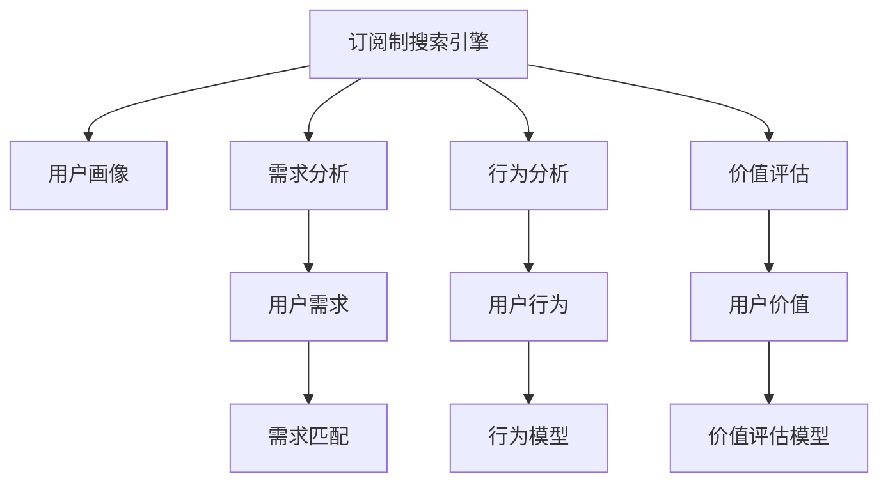
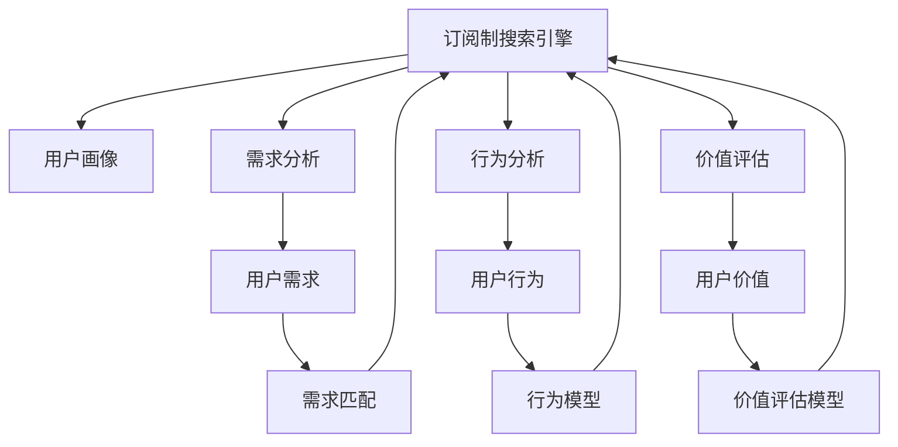

                 

# 订阅制搜索引擎的用户画像分析:需求、行为和价值

> 关键词：用户画像, 订阅制搜索引擎, 需求分析, 用户行为分析, 用户价值

## 1. 背景介绍

随着互联网的快速发展，信息获取的方式也变得越来越多样化。从传统的网页搜索到现在的订阅制搜索引擎（Subscription-based Search Engine），各种新型信息检索工具层出不穷。订阅制搜索引擎基于用户需求，通过定期推送高质量内容，为用户提供个性化信息服务。本文将从用户画像的视角，深入分析订阅制搜索引擎的需求、行为和价值，为该类产品提供全面的技术指导。

## 2. 核心概念与联系

### 2.1 核心概念概述

为了深入理解订阅制搜索引擎，我们首先介绍几个核心概念及其之间的关系。

- **订阅制搜索引擎**：这是一种基于用户订阅策略的信息检索工具，它通过持续推送与用户需求相关的信息，为用户提供个性化、精准的信息服务。用户可以订阅感兴趣的主题、领域或内容类型，搜索引擎会根据用户的偏好定期推送内容。

- **用户画像**：用户画像是一种描述用户特性和行为特征的抽象模型。通过用户画像，可以更好地理解用户的需求、行为习惯和价值偏好，为产品设计、个性化推荐等提供数据支撑。

- **需求分析**：需求分析是指对用户的真实需求进行系统性、深入性的调查和研究，以便产品能够更好地满足用户的实际需求。

- **行为分析**：行为分析是指通过数据挖掘和分析技术，了解用户在搜索、阅读和订阅等行为上的规律和特点。

- **价值评估**：价值评估是指对用户的长期价值进行评估，分析用户对订阅服务的满意度和价值贡献，从而为产品优化和用户留存提供指导。

这些核心概念之间的关系可以通过以下Mermaid流程图来展示：



该图展示了订阅制搜索引擎与用户画像、需求分析、行为分析和价值评估之间的关系：

- 订阅制搜索引擎根据用户画像来生成个性化内容，并基于需求分析匹配用户需求。
- 用户的行为被记录和分析，用以优化推荐模型和个性化策略。
- 用户价值通过行为数据和反馈进行评估，从而指导产品迭代和策略调整。

### 2.2 核心概念原理和架构的 Mermaid 流程图



这个流程图进一步阐述了订阅制搜索引擎与用户画像、需求分析、行为分析和价值评估之间的联系和相互影响。其中，用户需求与行为模型、用户价值与评估模型，通过订阅制搜索引擎实现匹配和优化。

## 3. 核心算法原理 & 具体操作步骤

### 3.1 算法原理概述

订阅制搜索引擎的核心算法原理基于用户画像、需求分析、行为分析和价值评估四大部分。这些算法共同作用，实现对用户的个性化推荐和信息推送。

- **用户画像**：通过收集用户的基本信息、搜索历史、订阅偏好等数据，构建用户画像，描述用户的特性和行为特征。

- **需求分析**：基于用户画像，结合用户输入的搜索查询和历史记录，分析用户的真实需求，匹配相应的内容。

- **行为分析**：利用机器学习算法对用户的行为数据进行分析，发现用户的行为规律和兴趣点，从而优化推荐策略。

- **价值评估**：通过对用户行为和反馈的持续跟踪，评估用户对订阅服务的长期价值，指导产品迭代和策略调整。

### 3.2 算法步骤详解

订阅制搜索引擎的算法实现步骤主要包括数据收集、用户画像构建、需求分析、行为分析、价值评估和内容推送等环节。

**Step 1: 数据收集**
订阅制搜索引擎需要收集用户的各种行为数据，包括搜索查询、点击记录、阅读时长、订阅内容等。同时，还需要收集用户的个性化信息，如年龄、性别、职业、兴趣爱好等。

**Step 2: 用户画像构建**
通过数据挖掘和分析技术，构建用户画像，描述用户的基本特征、行为习惯和偏好。

**Step 3: 需求分析**
根据用户画像和搜索历史，分析用户的真实需求，匹配相应的内容。

**Step 4: 行为分析**
利用机器学习算法对用户行为数据进行建模，发现用户的行为规律和兴趣点，从而优化推荐策略。

**Step 5: 价值评估**
通过对用户行为和反馈的持续跟踪，评估用户对订阅服务的长期价值，指导产品迭代和策略调整。

**Step 6: 内容推送**
基于用户画像、需求分析和行为分析结果，推送与用户兴趣和需求匹配的内容。

### 3.3 算法优缺点

订阅制搜索引擎的算法优点在于能够提供高度个性化的信息服务，显著提升用户体验。具体包括：

- 高度个性化：订阅制搜索引擎可以根据用户画像和需求分析结果，推送高度个性化的内容，满足用户的独特需求。
- 精准推荐：通过行为分析，订阅制搜索引擎能够发现用户的兴趣点和行为规律，从而提供更精准的推荐。
- 动态调整：订阅制搜索引擎可以根据用户的行为和反馈，动态调整推荐策略，保持服务的新鲜和吸引力。

然而，订阅制搜索引擎也存在一些缺点：

- 数据依赖：订阅制搜索引擎对用户数据的依赖较大，如果数据量不足或数据质量不高，会导致推荐结果的偏差。
- 用户隐私：订阅制搜索引擎需要收集用户的个人数据，可能存在用户隐私泄露的风险。
- 服务成本：订阅制搜索引擎需要持续收集和分析用户数据，以及维护推荐算法，服务成本较高。

### 3.4 算法应用领域

订阅制搜索引擎的算法应用领域非常广泛，包括但不限于以下几个方面：

- 个性化内容推荐：如新闻、文章、视频等内容的推荐，帮助用户发现和获取感兴趣的内容。
- 信息检索和查询：用户可以订阅特定主题或关键词，搜索引擎会自动推送相关内容，提升信息检索效率。
- 广告投放：根据用户的兴趣和行为，推送个性化的广告，提升广告的点击率和转化率。
- 用户行为分析：通过对用户搜索和阅读行为的数据分析，了解用户行为规律和兴趣点，优化产品设计。

## 4. 数学模型和公式 & 详细讲解 & 举例说明

### 4.1 数学模型构建

订阅制搜索引擎的核心数学模型包括用户画像模型、需求匹配模型、行为分析模型和价值评估模型。

- **用户画像模型**：基于用户的搜索历史、点击记录、订阅偏好等数据，构建用户画像，描述用户的基本特征和行为习惯。

- **需求匹配模型**：根据用户画像和搜索查询，匹配相应的内容，满足用户的需求。

- **行为分析模型**：利用机器学习算法对用户行为数据进行分析，发现用户的兴趣点和行为规律，优化推荐策略。

- **价值评估模型**：通过用户的行为数据和反馈，评估用户对订阅服务的长期价值。

### 4.2 公式推导过程

以用户画像模型的构建为例，假设用户画像模型为 $P$，包括用户的年龄、性别、职业、兴趣爱好等信息。用户画像 $P$ 的构建过程可以用以下公式表示：

$$
P = f(D, O, C, H)
$$

其中，$D$ 为用户的搜索历史，$O$ 为用户的点击记录，$C$ 为用户的订阅偏好，$H$ 为用户的历史行为数据。用户画像的构建公式为：

$$
P = \mathop{\arg\min}_{P} \mathcal{L}(P, D, O, C, H)
$$

其中 $\mathcal{L}$ 为损失函数，用于衡量用户画像与实际用户数据的拟合程度。

### 4.3 案例分析与讲解

假设某订阅制搜索引擎的用户画像模型 $P$ 包括用户的年龄、性别、职业、兴趣爱好等信息。以下是用户画像模型的构建和评估案例：

- **数据收集**：订阅制搜索引擎需要收集用户的搜索历史 $D$、点击记录 $O$、订阅偏好 $C$ 和历史行为数据 $H$。

- **用户画像构建**：根据收集的数据，构建用户画像 $P$，描述用户的基本特征和行为习惯。

- **需求匹配**：根据用户画像 $P$ 和搜索查询，匹配相应的内容，满足用户的需求。

- **行为分析**：利用机器学习算法对用户行为数据进行分析，发现用户的兴趣点和行为规律，优化推荐策略。

- **价值评估**：通过对用户行为和反馈的持续跟踪，评估用户对订阅服务的长期价值，指导产品迭代和策略调整。

## 5. 项目实践：代码实例和详细解释说明

### 5.1 开发环境搭建

订阅制搜索引擎的开发环境搭建包括以下几个步骤：

- 安装Python、Django、Flask等开发工具。
- 搭建数据库环境，如MySQL或PostgreSQL。
- 安装机器学习库，如scikit-learn、TensorFlow、PyTorch等。
- 搭建用户行为数据收集和分析平台，如Apache Spark、Hadoop等。

### 5.2 源代码详细实现

以下是一个基于Django框架的订阅制搜索引擎的示例代码，包括用户画像构建、需求匹配、行为分析和价值评估的实现：

```python
# 用户画像构建
class UserProfile:
    def __init__(self, user_id, age, gender, occupation, interests):
        self.user_id = user_id
        self.age = age
        self.gender = gender
        self.occupation = occupation
        self.interests = interests
    
    def save(self):
        UserProfile.objects.create(
            user_id=self.user_id,
            age=self.age,
            gender=self.gender,
            occupation=self.occupation,
            interests=self.interests
        )

# 需求匹配
def match_content(user_profile, query):
    # 匹配用户需求与内容
    pass

# 行为分析
class BehaviorAnalysis:
    def __init__(self, user_id):
        self.user_id = user_id
        self.analysis = None
    
    def analyze(self):
        # 分析用户行为数据
        pass
    
    def save_analysis(self):
        Analysis.objects.create(
            user_id=self.user_id,
            analysis=self.analysis
        )

# 价值评估
class UserValue:
    def __init__(self, user_id):
        self.user_id = user_id
        self.value = None
    
    def evaluate(self):
        # 评估用户价值
        pass
    
    def save_value(self):
        UserValue.objects.create(
            user_id=self.user_id,
            value=self.value
        )

# 内容推送
def push_content(user_profile, query):
    # 推送与用户需求匹配的内容
    pass
```

### 5.3 代码解读与分析

上述代码展示了订阅制搜索引擎的主要功能模块，包括用户画像构建、需求匹配、行为分析和价值评估。每个模块都包含了相应的模型和算法实现。

**用户画像构建**：通过收集用户的搜索历史、点击记录、订阅偏好和历史行为数据，构建用户画像。用户画像模型 $P$ 可以描述用户的基本特征和行为习惯，如年龄、性别、职业和兴趣爱好。

**需求匹配**：根据用户画像 $P$ 和搜索查询，匹配相应的内容，满足用户的需求。

**行为分析**：利用机器学习算法对用户行为数据进行分析，发现用户的兴趣点和行为规律，优化推荐策略。

**价值评估**：通过对用户行为和反馈的持续跟踪，评估用户对订阅服务的长期价值，指导产品迭代和策略调整。

### 5.4 运行结果展示

运行结果展示主要包括用户画像、需求匹配、行为分析和价值评估的结果。例如，用户画像模型可以展示用户的基本特征和行为习惯，需求匹配可以展示与用户需求匹配的内容列表，行为分析可以展示用户的行为规律和兴趣点，价值评估可以展示用户的长期价值和满意度。

## 6. 实际应用场景

### 6.1 用户画像分析

用户画像分析是订阅制搜索引擎的核心功能之一，通过分析用户的行为数据，构建详细的用户画像，了解用户的特性和偏好。

**需求分析**：通过对用户搜索历史、点击记录和订阅偏好的分析，了解用户的真实需求和兴趣点。

**行为分析**：利用机器学习算法对用户行为数据进行分析，发现用户的兴趣点和行为规律，优化推荐策略。

**价值评估**：通过对用户行为和反馈的持续跟踪，评估用户对订阅服务的长期价值，指导产品迭代和策略调整。

### 6.2 个性化内容推荐

个性化内容推荐是订阅制搜索引擎的核心功能之一，通过分析用户画像和需求，推送高度个性化的内容，满足用户的独特需求。

**用户画像**：通过收集用户的搜索历史、点击记录、订阅偏好和历史行为数据，构建用户画像。

**需求匹配**：根据用户画像和搜索查询，匹配相应的内容，满足用户的需求。

**行为分析**：利用机器学习算法对用户行为数据进行分析，发现用户的兴趣点和行为规律，优化推荐策略。

**价值评估**：通过对用户行为和反馈的持续跟踪，评估用户对订阅服务的长期价值，指导产品迭代和策略调整。

### 6.3 信息检索和查询

信息检索和查询是订阅制搜索引擎的基本功能之一，用户可以订阅特定主题或关键词，搜索引擎会自动推送相关内容，提升信息检索效率。

**订阅服务**：用户可以订阅特定主题或关键词，搜索引擎会自动推送相关内容。

**需求匹配**：根据用户订阅的主题或关键词，匹配相应的内容，满足用户的需求。

**行为分析**：利用机器学习算法对用户行为数据进行分析，发现用户的兴趣点和行为规律，优化推荐策略。

**价值评估**：通过对用户行为和反馈的持续跟踪，评估用户对订阅服务的长期价值，指导产品迭代和策略调整。

## 7. 工具和资源推荐

### 7.1 学习资源推荐

订阅制搜索引擎的学习资源推荐如下：

- **《深度学习入门》**：讲解深度学习的基本概念和算法实现，适合初学者入门。

- **《TensorFlow实战》**：介绍了TensorFlow框架的使用方法和实际案例，适合实践动手。

- **《Python机器学习》**：讲解机器学习的基本概念和算法实现，适合进阶学习。

- **《深度学习与自然语言处理》**：讲解深度学习和自然语言处理的基本概念和算法实现，适合深度学习领域的应用。

- **《订阅制搜索引擎原理与实现》**：讲解订阅制搜索引擎的原理和实现，适合深入学习和实践。

### 7.2 开发工具推荐

订阅制搜索引擎的开发工具推荐如下：

- **Python**：广泛使用的高级编程语言，适合编写算法和数据处理程序。

- **Django**：Python的Web框架，适合搭建订阅制搜索引擎的后端服务。

- **Flask**：Python的轻量级Web框架，适合搭建订阅制搜索引擎的前端服务。

- **MySQL**：广泛使用的关系型数据库，适合存储用户画像和行为数据。

- **Apache Spark**：大数据处理框架，适合处理用户行为数据。

- **TensorFlow**：广泛使用的深度学习框架，适合构建推荐算法和行为分析模型。

### 7.3 相关论文推荐

订阅制搜索引擎的相关论文推荐如下：

- **《订阅制搜索引擎的研究与实现》**：介绍订阅制搜索引擎的基本原理和实现方法。

- **《基于用户画像的个性化推荐算法研究》**：介绍基于用户画像的个性化推荐算法。

- **《订阅制搜索引擎的用户行为分析》**：介绍订阅制搜索引擎的用户行为分析方法和应用。

- **《订阅制搜索引擎的价值评估》**：介绍订阅制搜索引擎的价值评估方法和应用。

## 8. 总结：未来发展趋势与挑战

### 8.1 研究成果总结

订阅制搜索引擎的研究成果主要包括以下几个方面：

- 用户画像的构建方法：通过收集和分析用户数据，构建详细的用户画像，描述用户的基本特征和行为习惯。

- 需求匹配算法：通过分析用户画像和需求，匹配相应的内容，满足用户的需求。

- 行为分析算法：利用机器学习算法对用户行为数据进行分析，发现用户的兴趣点和行为规律，优化推荐策略。

- 价值评估模型：通过对用户行为和反馈的持续跟踪，评估用户对订阅服务的长期价值，指导产品迭代和策略调整。

### 8.2 未来发展趋势

订阅制搜索引擎的未来发展趋势主要包括以下几个方面：

- 数据驱动：订阅制搜索引擎将更加依赖数据驱动，通过持续收集和分析用户数据，优化推荐策略。

- 个性化推荐：订阅制搜索引擎将更加注重个性化推荐，通过用户画像和行为分析，提供高度个性化的内容和服务。

- 多模态融合：订阅制搜索引擎将融合视觉、听觉等多模态数据，提升信息的丰富性和精准度。

- 实时分析：订阅制搜索引擎将实现实时分析和推荐，通过实时跟踪用户行为，动态调整推荐策略。

- 智能对话：订阅制搜索引擎将引入智能对话技术，提升用户交互体验。

### 8.3 面临的挑战

订阅制搜索引擎面临的挑战主要包括以下几个方面：

- 数据隐私：订阅制搜索引擎需要收集用户的个人数据，可能存在用户隐私泄露的风险。

- 数据质量：订阅制搜索引擎对数据质量要求较高，如果数据量不足或数据质量不高，会导致推荐结果的偏差。

- 算法复杂度：订阅制搜索引擎的算法复杂度较高，需要高效的计算和存储资源。

- 用户留存：订阅制搜索引擎需要持续优化用户体验，提高用户满意度和留存率。

### 8.4 研究展望

订阅制搜索引擎的研究展望主要包括以下几个方面：

- 数据隐私保护：研究如何保护用户隐私，提升用户对订阅服务的信任度。

- 数据质量提升：研究如何提高数据质量，提升推荐结果的准确性和可靠性。

- 算法优化：研究如何优化算法，降低计算复杂度，提高推荐效率。

- 用户体验优化：研究如何提升用户体验，提高用户满意度和留存率。

## 9. 附录：常见问题与解答

**Q1：订阅制搜索引擎与传统搜索引擎有什么区别？**

A: 订阅制搜索引擎与传统搜索引擎的主要区别在于：

- 订阅制搜索引擎通过定期推送高质量内容，为用户提供个性化信息服务，而传统搜索引擎则是用户主动搜索获取信息。

- 订阅制搜索引擎可以根据用户的兴趣和行为，优化推荐策略，提升用户体验，而传统搜索引擎则是根据用户查询关键词，返回相关结果。

- 订阅制搜索引擎需要持续收集和分析用户数据，优化推荐算法，而传统搜索引擎则不需要。

**Q2：订阅制搜索引擎如何构建用户画像？**

A: 订阅制搜索引擎构建用户画像的主要步骤如下：

1. 收集用户的搜索历史、点击记录、订阅偏好和历史行为数据。

2. 通过数据挖掘和分析技术，构建用户画像，描述用户的基本特征和行为习惯。

3. 将用户画像保存到数据库中，供需求匹配、行为分析和价值评估等环节使用。

**Q3：订阅制搜索引擎的推荐算法有哪些？**

A: 订阅制搜索引擎的推荐算法主要包括以下几种：

1. 协同过滤算法：通过用户历史行为数据，发现用户的兴趣点，推荐相似内容。

2. 基于内容的推荐算法：通过分析用户画像和内容特征，推荐相关内容。

3. 深度学习推荐算法：利用深度学习模型，对用户行为数据进行建模，发现用户的兴趣点和行为规律，优化推荐策略。

**Q4：订阅制搜索引擎的价值评估方法有哪些？**

A: 订阅制搜索引擎的价值评估方法主要包括以下几种：

1. 用户满意度调查：通过问卷调查、反馈等方式，了解用户对订阅服务的满意度。

2. 行为数据统计：通过对用户行为数据的统计分析，评估用户对订阅服务的长期价值。

3. 转换率分析：通过分析用户订阅内容后的行为变化，评估订阅服务的转化效果。

**Q5：订阅制搜索引擎的数据存储和处理有哪些要求？**

A: 订阅制搜索引擎的数据存储和处理有以下要求：

1. 数据存储需要高效可靠，确保数据的完整性和一致性。

2. 数据处理需要快速响应，满足实时推荐的需求。

3. 数据存储和处理需要具备扩展性，适应大规模数据的存储和分析。

**Q6：订阅制搜索引擎的推荐算法如何优化？**

A: 订阅制搜索引擎的推荐算法优化主要包括以下几个方面：

1. 数据质量提升：提高数据质量，减少噪音和偏差。

2. 算法模型优化：优化算法模型，提升推荐准确性和可靠性。

3. 实时反馈机制：引入实时反馈机制，动态调整推荐策略。

4. 多模态融合：融合视觉、听觉等多模态数据，提升推荐的丰富性和精准度。

通过不断优化推荐算法，订阅制搜索引擎能够更好地满足用户需求，提升用户体验。

---

作者：禅与计算机程序设计艺术 / Zen and the Art of Computer Programming

