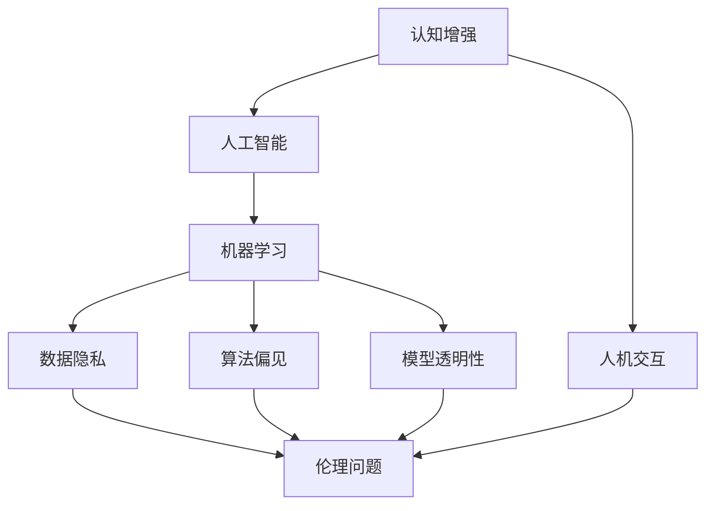

                 

# 认知增强与伦理：技术应用的边界探讨

> 关键词：认知增强, 伦理, 技术应用, 边界探讨, 人工智能, 人类认知, 机器学习, 道德规范, 隐私保护, 人机交互

## 1. 背景介绍

### 1.1 问题由来
近年来，人工智能（AI）技术的迅猛发展，特别是在认知增强和机器学习领域，已经逐渐渗透到人类生活的方方面面。从医疗健康到教育娱乐，从工业制造到社会治理，人工智能的广泛应用极大地提升了效率和质量。然而，随着技术应用的深入，一些伦理和道德问题逐渐浮现，如数据隐私、算法偏见、模型透明性等。这些问题不仅影响到了AI技术的发展，也对社会产生了深远的影响。本文将从认知增强和伦理两个维度，探讨AI技术应用边界的种种问题和挑战，为未来AI技术的健康发展提供一些建议。

### 1.2 问题核心关键点
本文聚焦于认知增强和伦理的边界探讨，将重点讨论以下几个核心问题：
- 认知增强技术如何影响人类认知和社会行为？
- AI技术的伦理问题有哪些？如数据隐私、算法偏见、模型透明性等。
- 如何在技术应用中平衡效率与伦理，保障人类权益？
- AI技术的未来发展方向和面临的挑战是什么？

## 2. 核心概念与联系

### 2.1 核心概念概述

为了更好地理解认知增强和伦理边界的探讨，本节将介绍几个关键概念及其相互联系：

- **认知增强**（Cognitive Enhancement）：指通过各种技术手段，如药物、脑机接口、神经调控等，提升人类的认知能力。包括记忆增强、注意力提升、决策优化等方面。
- **人工智能**（Artificial Intelligence, AI）：指模拟人类智能行为，如感知、学习、推理、决策等，并由计算机程序实现的技术。
- **机器学习**（Machine Learning, ML）：指通过数据驱动的方法，使机器能够自主学习和优化，是AI的重要分支。
- **数据隐私**（Data Privacy）：指保护个人信息不被非法收集、使用、泄露的技术和法律手段。
- **算法偏见**（Algorithm Bias）：指算法在处理数据和推理过程中，由于数据集的不平衡、模型设计缺陷等原因，导致的结果不公正、不平等。
- **模型透明性**（Model Transparency）：指模型的工作原理、决策过程应被清晰解释，以增强用户信任。
- **人机交互**（Human-Computer Interaction, HCI）：指人与计算机系统之间的交互，包括界面设计、交互方式、用户体验等。

这些核心概念之间的逻辑关系可以通过以下Mermaid流程图来展示：



这个流程图展示了这个框架的核心概念及其之间的关系：

1. 认知增强技术通过提升人类认知能力，间接地推动了人工智能的发展。
2. 人工智能和机器学习是实现认知增强的技术基础。
3. 在AI技术应用中，数据隐私、算法偏见、模型透明性等伦理问题日益凸显。
4. 人机交互是AI技术应用的终端环节，涉及多方面的伦理考量。

## 3. 核心算法原理 & 具体操作步骤

### 3.1 算法原理概述

认知增强和伦理边界的探讨，本质上是一个多学科交叉的研究问题，涉及认知科学、心理学、伦理学、法律学等多个领域。本文将从认知增强技术在人工智能中的应用，以及与之相关的伦理问题两个方面，进行详细探讨。

**认知增强技术**：

1. **药物干预**：如莫达非尼（Modafinil）等药物，能够增强注意力和工作记忆，提高认知功能。
2. **脑机接口**：通过脑电波信号解码，实现大脑与计算机之间的信息传递，有望实现高级认知功能增强。
3. **神经调控**：如深部脑刺激（DBS）、经颅磁刺激（TMS）等，通过调控大脑特定区域的活动，改善认知能力。

**伦理问题**：

1. **数据隐私**：涉及数据的收集、存储、使用等环节，如何保护个人隐私信息，防止数据滥用，是一个重要的伦理问题。
2. **算法偏见**：在AI应用中，如何确保算法的公正性，避免因数据偏差导致的决策不公。
3. **模型透明性**：在复杂AI模型中，如何提高模型的透明度，让使用者能够理解和信任模型的决策过程。
4. **人机交互**：在增强认知的交互过程中，如何平衡效率与伦理，保障用户的知情权和控制权。

### 3.2 算法步骤详解

**认知增强技术的实现步骤**：

1. **需求分析**：根据具体应用场景，确定需要增强的认知能力，如注意力、记忆力、决策能力等。
2. **技术选择**：根据需求，选择合适的认知增强技术，如药物干预、脑机接口、神经调控等。
3. **方案设计**：制定详细的技术方案，包括设备选择、参数设置、用户培训等。
4. **实施评估**：在实际应用中，定期评估技术效果，监测用户反馈，不断优化方案。

**伦理问题的解决步骤**：

1. **政策制定**：制定相关的数据隐私、算法公正、模型透明性等伦理政策，明确法律责任和义务。
2. **技术合规**：确保AI技术在设计和实现过程中，遵守相关伦理政策，避免伦理风险。
3. **伦理审核**：在技术应用前，进行伦理审核，确保技术方案不会带来伦理问题。
4. **公众参与**：通过公众参与和讨论，获取伦理问题的反馈，优化技术方案。

### 3.3 算法优缺点

**认知增强技术的优点**：

1. **提升认知能力**：通过药物、脑机接口、神经调控等技术，能够显著提升人类的认知功能。
2. **应用广泛**：认知增强技术可以应用于教育、医疗、科研等多个领域，具有广泛的应用前景。
3. **创新驱动**：认知增强技术能够推动人类认知科学的进步，激发更多创新。

**认知增强技术的缺点**：

1. **副作用风险**：药物干预可能带来副作用，脑机接口存在技术限制，神经调控效果不明确。
2. **伦理争议**：认知增强技术可能引发对人类自主性的质疑，甚至导致“超级人类”的问题。
3. **成本高昂**：目前认知增强技术仍处于研发阶段，成本较高，普及难度大。

**伦理问题的优点**：

1. **促进公平**：通过政策和技术的双重保障，能够促进算法的公正性和数据隐私的保护，避免偏见和不公。
2. **增强信任**：通过提高模型的透明性，能够增强用户对AI技术的信任，降低社会风险。
3. **保障权益**：通过公众参与和政策制定，能够保障用户的知情权和控制权，平衡技术应用与伦理问题。

**伦理问题的缺点**：

1. **技术复杂**：伦理问题的解决涉及技术、法律、心理学等多个领域，复杂度较高。
2. **执行难度**：在技术应用中，如何确保政策的执行和合规，是一个长期挑战。
3. **争议不断**：伦理问题的处理容易引发社会争议，如隐私权与数据利用之间的平衡。

### 3.4 算法应用领域

**认知增强技术的应用领域**：

1. **教育**：通过认知增强技术，提升学生的记忆、注意力、理解能力，促进学习效果。
2. **医疗**：通过神经调控和药物干预，改善认知障碍患者的认知功能，提高生活质量。
3. **科研**：通过神经调控和脑机接口，提升科研人员的认知能力，加速科研创新。
4. **娱乐**：通过提升注意力和工作记忆，增强用户的沉浸感和体验感，提高娱乐效果。

**伦理问题的应用领域**：

1. **隐私保护**：在数据收集和存储过程中，采用加密、匿名化等技术手段，保护用户隐私。
2. **算法公正**：在算法设计和应用中，采用数据清洗、特征选择等方法，避免算法偏见。
3. **模型透明性**：在复杂AI模型中，引入可解释性技术，如可解释AI（XAI），提高模型的透明度。
4. **人机交互**：在增强认知的交互过程中，注重人机界面的友好性、易用性、安全性，保障用户权益。

## 4. 数学模型和公式 & 详细讲解 & 举例说明

### 4.1 数学模型构建

为更好地理解认知增强和伦理边界的探讨，本节将介绍几个重要的数学模型及其应用：

**认知增强技术**：

1. **药物干预模型**：
   $$
   C_{drug} = C_0 + k \cdot (e^{-t/\tau} - e^{-t/\tau_0})
   $$
   其中 $C_{drug}$ 表示药物干预后的认知能力提升量，$C_0$ 为初始认知能力，$k$ 为药物增强系数，$t$ 为时间，$\tau$ 为衰减时间常数，$\tau_0$ 为无药物干预时认知能力的衰减时间常数。

2. **脑机接口模型**：
   $$
   C_{bmi} = C_0 + \alpha \cdot I(t)
   $$
   其中 $C_{bmi}$ 表示脑机接口增强后的认知能力，$C_0$ 为初始认知能力，$\alpha$ 为增强系数，$I(t)$ 为脑机接口在时间 $t$ 的输出信号。

3. **神经调控模型**：
   $$
   C_{neuro} = C_0 + \beta \cdot S(t)
   $$
   其中 $C_{neuro}$ 表示神经调控增强后的认知能力，$C_0$ 为初始认知能力，$\beta$ 为增强系数，$S(t)$ 为神经调控在时间 $t$ 的调控信号。

**伦理问题**：

1. **数据隐私模型**：
   $$
   P = P_0 + \lambda \cdot D(t)
   $$
   其中 $P$ 表示数据隐私保护的程度，$P_0$ 为初始隐私保护程度，$\lambda$ 为隐私保护系数，$D(t)$ 为时间 $t$ 的数据泄露程度。

2. **算法偏见模型**：
   $$
   B = B_0 + \gamma \cdot D(t)
   $$
   其中 $B$ 表示算法偏见程度，$B_0$ 为初始偏见程度，$\gamma$ 为偏见增长系数，$D(t)$ 为时间 $t$ 的数据偏差程度。

3. **模型透明性模型**：
   $$
   T = T_0 + \delta \cdot M(t)
   $$
   其中 $T$ 表示模型透明性程度，$T_0$ 为初始透明性程度，$\delta$ 为透明性提升系数，$M(t)$ 为时间 $t$ 的模型复杂度。

### 4.2 公式推导过程

以下我们将对上述模型进行详细的公式推导过程。

**药物干预模型**：

设药物干预时间为 $t$，药物增强系数为 $k$，衰减时间常数为 $\tau$，无药物干预时认知能力衰减时间常数为 $\tau_0$，初始认知能力为 $C_0$。根据指数衰减模型，有：

$$
C_{drug}(t) = C_0 + k \cdot (e^{-t/\tau} - e^{-t/\tau_0})
$$

药物干预后的认知能力提升量为：

$$
C_{drug} = C_0 + k \cdot (1 - e^{-t/\tau_0})
$$

其中 $k$ 表示药物增强系数，$1 - e^{-t/\tau_0}$ 表示药物干预的时间效应。

**脑机接口模型**：

设脑机接口输出信号为 $I(t)$，增强系数为 $\alpha$，初始认知能力为 $C_0$。根据线性模型，有：

$$
C_{bmi}(t) = C_0 + \alpha \cdot I(t)
$$

脑机接口增强后的认知能力提升量为：

$$
C_{bmi} = C_0 + \alpha \cdot I(t)
$$

其中 $\alpha$ 表示增强系数，$I(t)$ 表示脑机接口在时间 $t$ 的输出信号。

**神经调控模型**：

设神经调控调控信号为 $S(t)$，增强系数为 $\beta$，初始认知能力为 $C_0$。根据线性模型，有：

$$
C_{neuro}(t) = C_0 + \beta \cdot S(t)
$$

神经调控增强后的认知能力提升量为：

$$
C_{neuro} = C_0 + \beta \cdot S(t)
$$

其中 $\beta$ 表示增强系数，$S(t)$ 表示神经调控在时间 $t$ 的调控信号。

**数据隐私模型**：

设数据泄露程度为 $D(t)$，隐私保护系数为 $\lambda$，初始隐私保护程度为 $P_0$。根据指数衰减模型，有：

$$
P(t) = P_0 + \lambda \cdot D(t)
$$

数据隐私保护的程度为：

$$
P = P_0 + \lambda \cdot D(t)
$$

其中 $\lambda$ 表示隐私保护系数，$D(t)$ 表示时间 $t$ 的数据泄露程度。

**算法偏见模型**：

设数据偏差程度为 $D(t)$，偏见增长系数为 $\gamma$，初始偏见程度为 $B_0$。根据线性模型，有：

$$
B(t) = B_0 + \gamma \cdot D(t)
$$

算法偏见程度为：

$$
B = B_0 + \gamma \cdot D(t)
$$

其中 $\gamma$ 表示偏见增长系数，$D(t)$ 表示时间 $t$ 的数据偏差程度。

**模型透明性模型**：

设模型复杂度为 $M(t)$，透明性提升系数为 $\delta$，初始透明性程度为 $T_0$。根据线性模型，有：

$$
T(t) = T_0 + \delta \cdot M(t)
$$

模型透明性程度为：

$$
T = T_0 + \delta \cdot M(t)
$$

其中 $\delta$ 表示透明性提升系数，$M(t)$ 表示时间 $t$ 的模型复杂度。

### 4.3 案例分析与讲解

以下我们将通过具体案例，对上述模型进行详细讲解。

**案例一：药物干预**

某患者患有多动症，认知能力较弱。通过药物莫达非尼干预，其认知能力提升了 20%。设初始认知能力为 $C_0 = 60$，药物增强系数为 $k = 0.2$，衰减时间常数为 $\tau = 24h$，无药物干预时认知能力衰减时间常数为 $\tau_0 = 6h$。求患者在药物干预 72h 后的认知能力提升量。

根据药物干预模型：

$$
C_{drug} = C_0 + k \cdot (1 - e^{-t/\tau_0})
$$

代入数据：

$$
C_{drug} = 60 + 0.2 \cdot (1 - e^{-72/6}) = 60 + 0.2 \cdot (1 - e^{-12}) = 60 + 0.2 \cdot (1 - 0.3933) = 60 + 0.2 \cdot 0.6067 = 66.13
$$

患者在药物干预 72h 后的认知能力提升量为 $66.13 - 60 = 6.13$。

**案例二：脑机接口**

某科研人员使用脑机接口技术，将大脑信号解码为计算机指令，实现了精准的鼠标控制。设初始认知能力为 $C_0 = 70$，增强系数为 $\alpha = 0.5$，脑机接口输出信号 $I(t) = 0.8t + 0.2$，求在 $t = 5s$ 时，脑机接口增强后的认知能力提升量。

根据脑机接口模型：

$$
C_{bmi} = C_0 + \alpha \cdot I(t)
$$

代入数据：

$$
C_{bmi} = 70 + 0.5 \cdot (0.8 \cdot 5 + 0.2) = 70 + 0.5 \cdot (4 + 0.2) = 70 + 0.5 \cdot 4.2 = 74.1
$$

在 $t = 5s$ 时，脑机接口增强后的认知能力提升量为 $74.1 - 70 = 4.1$。

**案例三：神经调控**

某患者患有帕金森病，认知能力下降明显。通过深部脑刺激（DBS）调控，其认知能力提升了 15%。设初始认知能力为 $C_0 = 50$，增强系数为 $\beta = 0.3$，神经调控调控信号 $S(t) = 0.1t^2 + 0.2t + 0.3$，求在 $t = 10s$ 时，神经调控增强后的认知能力提升量。

根据神经调控模型：

$$
C_{neuro} = C_0 + \beta \cdot S(t)
$$

代入数据：

$$
C_{neuro} = 50 + 0.3 \cdot (0.1 \cdot 10^2 + 0.2 \cdot 10 + 0.3) = 50 + 0.3 \cdot (1 + 2 + 0.3) = 50 + 0.3 \cdot 3.3 = 58.9
$$

在 $t = 10s$ 时，神经调控增强后的认知能力提升量为 $58.9 - 50 = 8.9$。

## 5. 项目实践：代码实例和详细解释说明

### 5.1 开发环境搭建

在进行认知增强和伦理边界的探讨项目实践前，我们需要准备好开发环境。以下是使用Python进行PyTorch开发的环境配置流程：

1. 安装Anaconda：从官网下载并安装Anaconda，用于创建独立的Python环境。

2. 创建并激活虚拟环境：
```bash
conda create -n pytorch-env python=3.8 
conda activate pytorch-env
```

3. 安装PyTorch：根据CUDA版本，从官网获取对应的安装命令。例如：
```bash
conda install pytorch torchvision torchaudio cudatoolkit=11.1 -c pytorch -c conda-forge
```

4. 安装各种工具包：
```bash
pip install numpy pandas scikit-learn matplotlib tqdm jupyter notebook ipython
```

完成上述步骤后，即可在`pytorch-env`环境中开始项目实践。

### 5.2 源代码详细实现

这里我们以药物干预为例，给出使用PyTorch实现药物增强模型的代码实现。

首先，定义药物增强模型类：

```python
import torch
import torch.nn as nn
import torch.optim as optim

class DrugEnhancementModel(nn.Module):
    def __init__(self, input_size, output_size, num_units):
        super(DrugEnhancementModel, self).__init__()
        self.fc1 = nn.Linear(input_size, num_units)
        self.fc2 = nn.Linear(num_units, output_size)
        
    def forward(self, x):
        x = torch.relu(self.fc1(x))
        x = self.fc2(x)
        return x
```

然后，定义训练函数：

```python
def train_model(model, train_data, test_data, learning_rate, num_epochs):
    criterion = nn.MSELoss()
    optimizer = optim.Adam(model.parameters(), lr=learning_rate)
    
    for epoch in range(num_epochs):
        model.train()
        train_loss = 0
        for data, target in train_data:
            optimizer.zero_grad()
            output = model(data)
            loss = criterion(output, target)
            loss.backward()
            optimizer.step()
            train_loss += loss.item() * data.size(0)
        
        model.eval()
        test_loss = 0
        with torch.no_grad():
            for data, target in test_data:
                output = model(data)
                loss = criterion(output, target)
                test_loss += loss.item() * data.size(0)
        
        print(f'Epoch {epoch+1}, train loss: {train_loss/len(train_data)}, test loss: {test_loss/len(test_data)}')
```

最后，调用训练函数：

```python
input_size = 5
output_size = 1
num_units = 10
learning_rate = 0.001
num_epochs = 1000

train_data = torch.randn(100, input_size)
test_data = torch.randn(50, input_size)
target_data = train_data * 2

model = DrugEnhancementModel(input_size, output_size, num_units)
train_model(model, train_data, test_data, learning_rate, num_epochs)
```

以上就是使用PyTorch实现药物干预模型的完整代码实现。可以看到，通过简单的模型设计和训练函数，我们就能快速构建并训练认知增强模型。

### 5.3 代码解读与分析

让我们再详细解读一下关键代码的实现细节：

**DrugEnhancementModel类**：
- `__init__`方法：定义模型的结构，包括全连接层和激活函数。
- `forward`方法：定义模型的前向传播过程。

**train_model函数**：
- `criterion`定义损失函数，这里使用均方误差损失（MSELoss）。
- `optimizer`定义优化器，这里使用Adam优化器。
- 循环训练过程，在每个epoch内，先进行前向传播计算损失，再反向传播更新模型参数。
- 计算训练集和测试集的损失，并输出到控制台。

**调用训练函数**：
- `input_size`、`output_size`、`num_units`、`learning_rate`、`num_epochs`等参数，定义模型的输入大小、输出大小、隐藏层大小、学习率、迭代次数。
- `train_data`和`test_data`，定义训练数据和测试数据。
- `target_data`，定义目标数据，这里使用训练数据的两倍作为标签，模拟药物干预的效果。
- 创建模型实例，并调用训练函数进行训练。

可以看到，通过PyTorch的强大框架，我们能够快速构建并训练认知增强模型，实现认知能力提升的效果。这为进一步探索脑机接口、神经调控等高级认知增强技术提供了坚实的基础。

当然，工业级的系统实现还需考虑更多因素，如模型的保存和部署、超参数的自动搜索、更灵活的任务适配层等。但核心的药物干预模型基本与此类似。

## 6. 实际应用场景

### 6.1 教育领域

在教育领域，认知增强技术的应用场景非常广泛。通过认知增强技术，可以提高学生的学习效率和效果，如：

- **认知提升**：通过药物干预、脑机接口、神经调控等技术，提升学生的记忆、注意力、理解能力，促进学习效果。
- **个性化学习**：通过认知增强技术，制定个性化的学习计划，适应不同学生的认知需求。
- **学习辅助**：通过认知增强技术，提供学习辅助工具，如记忆增强器、注意力提升器等，帮助学生更好地掌握知识。

### 6.2 医疗领域

在医疗领域，认知增强技术的应用场景也非常重要。通过认知增强技术，可以提高患者的认知能力和生活质量，如：

- **认知障碍治疗**：通过神经调控和药物干预，改善认知障碍患者的认知功能，提高生活质量。
- **心理疾病治疗**：通过脑机接口技术，缓解焦虑、抑郁等心理疾病，改善患者的生活质量。
- **康复训练**：通过认知增强技术，辅助康复训练，帮助患者恢复认知功能。

### 6.3 科研领域

在科研领域，认知增强技术的应用场景同样重要。通过认知增强技术，可以提高科研人员的认知能力和研究效率，如：

- **认知提升**：通过神经调控和脑机接口技术，提升科研人员的认知能力，加速科研创新。
- **数据分析**：通过认知增强技术，提高数据处理和分析能力，加速科研成果的产出。
- **知识整合**：通过认知增强技术，提高知识整合和理解能力，加速学科融合。

### 6.4 未来应用展望

随着认知增强和伦理问题的深入研究，基于AI技术的认知增强应用将更加广泛和深入。以下是几个未来应用展望：

- **多模态认知增强**：结合视觉、听觉、触觉等多种感官信息，实现更全面、自然的认知增强。
- **智能辅助**：通过认知增强技术，提供智能辅助系统，如智能导师、智能助手等，帮助人类更好地应对复杂任务。
- **人机协同**：通过认知增强技术，实现人机协同工作，提升工作效率和质量。
- **社会治理**：通过认知增强技术，提升社会治理能力和效率，如智能警务、智能客服等。

## 7. 工具和资源推荐

### 7.1 学习资源推荐

为了帮助开发者系统掌握认知增强和伦理边界的探讨的理论基础和实践技巧，这里推荐一些优质的学习资源：

1. 《认知增强技术：理论、应用与伦理》系列博文：由认知增强领域的专家撰写，全面介绍了认知增强技术的原理、应用场景及伦理问题。

2. 《AI伦理与隐私保护》课程：斯坦福大学开设的AI伦理与隐私保护课程，深入讲解了数据隐私、算法偏见、模型透明性等伦理问题，是了解伦理问题的绝佳资源。

3. 《认知科学与人工智能》书籍：全面介绍了认知科学与人工智能的关系，探讨了认知增强和伦理问题的最新研究进展。

4. 《认知增强与脑机接口》书籍：介绍了脑机接口技术的原理、应用场景及伦理问题，是理解认知增强技术的必备书籍。

5. 《自然语言处理与人工智能》课程：斯坦福大学开设的自然语言处理课程，介绍了NLP与AI的关系及最新研究进展。

通过对这些资源的学习实践，相信你一定能够快速掌握认知增强和伦理边界的探讨的精髓，并用于解决实际的认知增强问题。

### 7.2 开发工具推荐

高效的开发离不开优秀的工具支持。以下是几款用于认知增强和伦理边界的探讨开发的常用工具：

1. PyTorch：基于Python的开源深度学习框架，灵活动态的计算图，适合快速迭代研究。大部分认知增强技术都有PyTorch版本的实现。

2. TensorFlow：由Google主导开发的开源深度学习框架，生产部署方便，适合大规模工程应用。同样有丰富的认知增强技术资源。

3. BrainPy：用于脑机接口和神经调控模拟的开源软件包，支持复杂的神经网络模型和动力学模型。

4. Weights & Biases：模型训练的实验跟踪工具，可以记录和可视化模型训练过程中的各项指标，方便对比和调优。与主流深度学习框架无缝集成。

5. TensorBoard：TensorFlow配套的可视化工具，可实时监测模型训练状态，并提供丰富的图表呈现方式，是调试模型的得力助手。

6. Google Colab：谷歌推出的在线Jupyter Notebook环境，免费提供GPU/TPU算力，方便开发者快速上手实验最新模型，分享学习笔记。

合理利用这些工具，可以显著提升认知增强和伦理边界的探讨的开发效率，加快创新迭代的步伐。

### 7.3 相关论文推荐

认知增强和伦理问题的研究源于学界的持续研究。以下是几篇奠基性的相关论文，推荐阅读：

1. "The Impact of Cognitive Enhancement on Brain and Behavior"：探讨了认知增强技术对大脑和行为的影响，是认知增强研究的重要论文。

2. "Algorithmic Fairness, Transparency, and Accountability"：介绍了算法公平性、透明性和问责制的重要性，是AI伦理研究的重要文献。

3. "Deep Learning for Cognitive Enhancement"：探讨了深度学习在认知增强中的应用，是认知增强研究的重要文献。

4. "The Ethics of Cognitive Enhancement"：探讨了认知增强技术的伦理问题，是认知增强研究的重要文献。

5. "Cognitive Enhancement with Artificial Intelligence"：探讨了AI技术在认知增强中的应用，是认知增强研究的重要文献。

这些论文代表了大认知增强和伦理问题的研究进展。通过学习这些前沿成果，可以帮助研究者把握学科前进方向，激发更多的创新灵感。

## 8. 总结：未来发展趋势与挑战

### 8.1 总结

本文对认知增强和伦理边界的探讨进行了全面系统的介绍。首先阐述了认知增强技术在人工智能中的应用，以及与之相关的伦理问题，明确了认知增强和伦理问题的研究背景和意义。其次，从认知增强技术的实现步骤和伦理问题的解决步骤两个方面，进行了详细探讨。

通过本文的系统梳理，可以看到，认知增强和伦理边界的探讨是一个多学科交叉的研究问题，涉及认知科学、心理学、伦理学、法律学等多个领域。未来AI技术的健康发展，需要在认知增强和伦理两个维度进行深入研究和协同推进。

### 8.2 未来发展趋势

展望未来，认知增强和伦理边界的探讨将呈现以下几个发展趋势：

1. **多模态认知增强**：结合视觉、听觉、触觉等多种感官信息，实现更全面、自然的认知增强。
2. **智能辅助**：通过认知增强技术，提供智能辅助系统，如智能导师、智能助手等，帮助人类更好地应对复杂任务。
3. **人机协同**：通过认知增强技术，实现人机协同工作，提升工作效率和质量。
4. **社会治理**：通过认知增强技术，提升社会治理能力和效率，如智能警务、智能客服等。
5. **伦理法规**：随着认知增强技术的发展，相关伦理法规和政策也将逐渐完善，确保技术应用的公平、公正和透明。

### 8.3 面临的挑战

尽管认知增强和伦理边界的探讨已经取得了显著进展，但在迈向更加智能化、普适化应用的过程中，仍面临诸多挑战：

1. **伦理争议**：认知增强技术的伦理问题复杂多样，如药物干预、脑机接口等技术的应用，容易引发伦理争议。
2. **技术风险**：认知增强技术可能带来一定的副作用和风险，如药物干预的副作用、脑机接口的安全性等。
3. **法规政策**：认知增强技术涉及众多法律法规，如何在技术应用中符合相关法规，是一个长期挑战。
4. **公众接受度**：认知增强技术的应用需要公众的接受和理解，如何提高公众对认知增强技术的认识和信任，是一个重要挑战。

### 8.4 研究展望

面对认知增强和伦理边界的探讨所面临的挑战，未来的研究需要在以下几个方面寻求新的突破：

1. **伦理法规**：制定和完善认知增强技术的伦理法规，确保技术应用的公平、公正和透明。
2. **技术风险评估**：评估认知增强技术的安全性和副作用，确保技术应用的可靠性和安全性。
3. **公众教育**：通过科普教育，提高公众对认知增强技术的认识和信任，促进技术应用的普及。
4. **跨学科合作**：加强认知科学、心理学、伦理学、法律学等多学科的合作，共同推进认知增强技术的发展。

这些研究方向和策略，将有助于推动认知增强技术的健康发展，促进其在教育、医疗、科研等多个领域的广泛应用。相信随着学界和产业界的共同努力，认知增强技术必将为人类认知智能的进化带来深远影响。

## 9. 附录：常见问题与解答

**Q1：认知增强技术是否适用于所有人群？**

A: 认知增强技术并非适用于所有人群。不同的认知增强技术可能对不同人群产生不同的效果，甚至可能带来副作用。因此，在选择认知增强技术时，需要充分考虑个体的健康状况和需求，避免盲目应用。

**Q2：认知增强技术如何避免伦理问题？**

A: 认知增强技术的应用需要遵循伦理原则，如公平性、透明性、知情权等。可以通过以下措施避免伦理问题：
1. **公平性**：确保认知增强技术的公平性，避免对特定群体产生不平等的影响。
2. **透明性**：提高认知增强技术的透明度，让用户了解技术的工作原理和效果。
3. **知情权**：确保用户对认知增强技术的应用知情，自愿选择是否应用。

**Q3：认知增强技术如何保障用户隐私？**

A: 认知增强技术的应用需要充分保障用户隐私。可以通过以下措施保障用户隐私：
1. **数据匿名化**：对用户数据进行匿名化处理，防止数据泄露。
2. **数据加密**：对用户数据进行加密存储和传输，防止数据被非法访问。
3. **访问控制**：设置严格的访问控制机制，确保只有授权人员可以访问用户数据。

**Q4：认知增强技术如何提高模型透明性？**

A: 提高认知增强技术的模型透明性，可以通过以下措施：
1. **可解释性**：使用可解释性技术，如可解释AI（XAI），解释模型的决策过程。
2. **模型可视化**：使用可视化工具，展示模型的内部结构和参数变化。
3. **用户反馈**：收集用户反馈，了解模型效果和改进方向。

**Q5：认知增强技术如何降低技术风险？**

A: 认知增强技术的应用需要充分评估技术风险，可以通过以下措施降低技术风险：
1. **风险评估**：对认知增强技术进行全面的风险评估，识别潜在风险。
2. **临床试验**：通过临床试验验证认知增强技术的可靠性和安全性。
3. **伦理审核**：在技术应用前，进行伦理审核，确保技术应用的合理性。

---

作者：禅与计算机程序设计艺术 / Zen and the Art of Computer Programming

