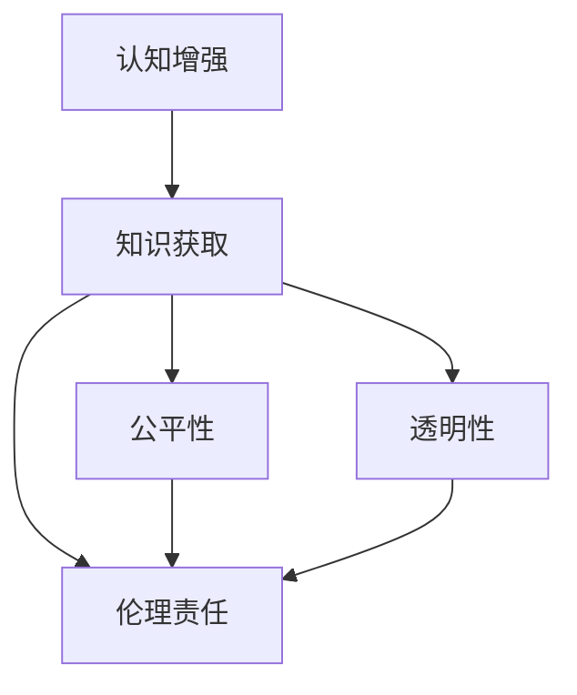

                 

# 认知增强与伦理：知识获取公平性的思考

> 关键词：认知增强, 公平性, 知识获取, 伦理, 技术应用, 道德责任

## 1. 背景介绍

### 1.1 问题由来

随着人工智能(AI)技术的飞速发展，人类对智能体的认知能力增强提出了更高的要求。这不仅体现在认知能力的提升上，还体现在知识获取的公平性和透明性上。认知增强技术通过增强人类的学习能力，能够帮助人们更好地应对复杂的现实问题。然而，当知识获取变得依赖于智能系统时，公平性、透明性和伦理问题也随之而来。

这些问题在技术层面上涉及如何处理数据偏见、隐私保护、算法透明性等议题。在社会层面上，如何确保技术应用的社会责任，使得所有人都能公平地从认知增强技术中获益，成为了一个亟待解决的问题。

### 1.2 问题核心关键点

认知增强技术主要通过算法和模型来提升人类在特定任务上的认知能力。例如，通过深度学习模型进行图像识别、自然语言处理等。知识获取的公平性则涉及到技术如何确保不同背景的用户获得相同质量的认知增强效果。伦理问题则关乎如何处理技术应用可能带来的偏见和社会不公。

以下三个关键点将贯穿本文的探讨：

- **公平性**：技术应该确保所有用户都有平等的知识获取机会，不受性别、年龄、种族、经济状况等因素的影响。
- **透明性**：技术决策过程应公开透明，用户应能理解算法如何做出决策，并有权质疑和监督。
- **伦理责任**：开发者应承担起技术应用的伦理责任，避免技术应用可能带来的社会风险。

## 2. 核心概念与联系

### 2.1 核心概念概述

为了更好地理解认知增强技术及其对知识获取公平性的影响，本节将介绍几个核心概念：

- **认知增强**：利用人工智能技术，如机器学习、深度学习等，增强人类的认知能力，提升其在特定任务上的表现。
- **知识获取**：通过算法和模型，从海量数据中获取并提炼出有用的知识，为用户提供辅助决策的能力。
- **公平性**：确保技术应用中不出现任何形式的不平等现象，包括但不限于性别、种族、年龄等方面的偏见。
- **透明性**：算法决策过程应公开透明，用户应能理解技术的工作机制和逻辑。
- **伦理责任**：开发者应考虑技术应用可能带来的社会影响，承担起应有的道德和社会责任。

这些概念之间的逻辑关系可以通过以下Mermaid流程图来展示：



这个流程图展示了几大核心概念之间的关系：

1. 认知增强技术通过知识获取，提升人类在特定任务上的认知能力。
2. 知识获取过程应追求公平性，确保所有用户都能平等获取知识。
3. 透明度是知识获取过程的基础，用户应能理解并监督技术决策。
4. 伦理责任是技术应用的最高要求，确保技术应用符合道德和社会规范。

## 3. 核心算法原理 & 具体操作步骤

### 3.1 算法原理概述

认知增强技术通常依赖于机器学习算法，特别是深度学习模型。这些模型通过学习大量的数据，能够自动提取并抽象出数据中的特征，从而在特定任务上提升人类的认知能力。知识获取则涉及到从这些特征中提炼出有用的信息，为决策提供支持。

在知识获取过程中，公平性和透明性是两个关键要素。公平性要求算法不因用户背景不同而产生不同的结果；透明性则要求算法的工作机制公开透明，用户能够理解其决策过程。

### 3.2 算法步骤详解

以下是一个典型的认知增强流程，包含算法步骤和操作细节：

**Step 1: 数据收集与处理**
- 收集不同背景用户的训练数据，确保数据多样性。
- 对数据进行清洗和预处理，如去除噪声、归一化等，提高数据质量。

**Step 2: 模型训练与优化**
- 选择合适的深度学习模型，如卷积神经网络(CNN)、循环神经网络(RNN)、变压器(Transformer)等。
- 将预处理后的数据输入模型进行训练，调整模型参数以优化性能。
- 在训练过程中，使用正则化技术如Dropout、L2正则等，防止过拟合。
- 通过交叉验证等技术，评估模型在不同数据上的表现，选择最优模型。

**Step 3: 知识提炼与输出**
- 将训练好的模型应用到新的数据上，提炼出有用的特征。
- 利用特征提炼出的知识，为用户提供辅助决策的支持。
- 在知识获取过程中，确保算法不引入任何形式的偏见，保证公平性。
- 使用可解释的算法模型，如决策树、线性回归等，提高算法的透明性。

**Step 4: 系统部署与监控**
- 将训练好的模型部署到生产环境中，供用户使用。
- 监控系统的运行状态，确保系统稳定运行。
- 收集用户反馈，不断优化模型和系统，提升用户体验。
- 在模型和系统应用中，始终将公平性和透明性作为首要考虑因素。

### 3.3 算法优缺点

认知增强技术通过深度学习等算法，能够显著提升人类的认知能力。但同时也存在一些局限性和潜在风险：

**优点**：
1. 提升认知能力：通过算法和模型，增强人类在特定任务上的认知能力，如图像识别、自然语言处理等。
2. 提高决策质量：基于大规模数据的知识获取，为用户提供更准确的决策支持。
3. 加速学习进程：算法可以快速处理大量数据，加速学习过程，缩短决策时间。

**缺点**：
1. 数据偏见：如果训练数据存在偏见，算法可能会继承这些偏见，导致不公平的结果。
2. 透明性不足：深度学习模型往往被视为“黑盒”，难以解释其内部机制和决策逻辑。
3. 伦理风险：算法的决策过程可能带来隐私泄露、歧视等伦理问题。

### 3.4 算法应用领域

认知增强技术在多个领域中得到了广泛应用，例如：

- 医疗诊断：利用深度学习模型对医学影像进行自动诊断，提高诊断准确率。
- 智能客服：通过自然语言处理技术，提供智能化的客户服务，提升用户体验。
- 教育辅助：利用认知增强技术，为学生提供个性化的学习支持，提升学习效率。
- 金融分析：通过机器学习模型，进行风险评估和预测，帮助金融机构做出决策。
- 自动驾驶：通过计算机视觉技术，提升自动驾驶系统的感知能力，提高行车安全。

这些领域的应用展示了认知增强技术在提升人类认知能力、提高决策质量等方面的潜力。然而，公平性、透明性和伦理责任也是这些应用中需要认真考虑的问题。

## 4. 数学模型和公式 & 详细讲解 & 举例说明

### 4.1 数学模型构建

认知增强技术的核心是深度学习模型，其数学模型可以表示为：

$$
f(x; \theta) = \sigma(W^T \sigma(Wx + b))
$$

其中 $x$ 表示输入数据，$\theta$ 表示模型参数，$\sigma$ 表示激活函数，$W$ 和 $b$ 分别表示权重和偏置项。

在知识获取过程中，我们通常使用交叉熵损失函数：

$$
L(y, \hat{y}) = -\frac{1}{N}\sum_{i=1}^N y_i \log \hat{y}_i + (1-y_i) \log (1-\hat{y}_i)
$$

其中 $y$ 表示真实标签，$\hat{y}$ 表示模型预测输出，$N$ 表示样本数量。

### 4.2 公式推导过程

在训练深度学习模型时，我们通常使用反向传播算法进行参数更新。反向传播算法的核心是计算损失函数对每个参数的梯度，然后根据梯度更新参数。

以二分类问题为例，反向传播的推导过程如下：

1. 前向传播：
   - $z = W^T \sigma(Wx + b)$
   - $\hat{y} = \sigma(z)$

2. 损失函数：
   - $L(y, \hat{y}) = -\frac{1}{N}\sum_{i=1}^N y_i \log \hat{y}_i + (1-y_i) \log (1-\hat{y}_i)$

3. 梯度计算：
   - $\frac{\partial L}{\partial z} = \frac{1}{N}[\frac{y_i}{\hat{y}_i} - \frac{1-y_i}{1-\hat{y}_i}]$
   - $\frac{\partial L}{\partial W} = \frac{\partial L}{\partial z} \cdot \frac{\partial z}{\partial W}$
   - $\frac{\partial L}{\partial b} = \frac{\partial L}{\partial z} \cdot \frac{\partial z}{\partial b}$

其中 $\frac{\partial L}{\partial z}$ 表示损失函数对输出 $z$ 的梯度，$\frac{\partial z}{\partial W}$ 和 $\frac{\partial z}{\partial b}$ 表示输出 $z$ 对权重 $W$ 和偏置 $b$ 的导数。

### 4.3 案例分析与讲解

以医疗影像识别为例，说明认知增强技术在实际应用中的操作流程：

1. **数据收集与处理**：
   - 收集不同类型和背景的医学影像数据，如X光片、CT扫描、MRI等。
   - 对影像数据进行预处理，如去噪、归一化等，提高数据质量。

2. **模型训练与优化**：
   - 使用卷积神经网络(CNN)进行模型训练，将影像数据输入模型进行训练。
   - 调整模型参数以优化性能，使用正则化技术如Dropout、L2正则等，防止过拟合。
   - 通过交叉验证等技术，评估模型在不同数据上的表现，选择最优模型。

3. **知识提炼与输出**：
   - 将训练好的模型应用到新的医学影像上，提炼出有用的特征。
   - 利用特征提炼出的知识，辅助医生进行诊断，提升诊断准确率。
   - 确保算法不引入任何形式的偏见，保证诊断的公平性。
   - 使用可解释的算法模型，如决策树、线性回归等，提高算法的透明性。

4. **系统部署与监控**：
   - 将训练好的模型部署到生产环境中，供医生使用。
   - 监控系统的运行状态，确保系统稳定运行。
   - 收集医生反馈，不断优化模型和系统，提升用户体验。
   - 在模型和系统应用中，始终将公平性和透明性作为首要考虑因素。

## 5. 项目实践：代码实例和详细解释说明

### 5.1 开发环境搭建

在进行认知增强技术开发前，我们需要准备好开发环境。以下是使用Python进行TensorFlow开发的环境配置流程：

1. 安装Anaconda：从官网下载并安装Anaconda，用于创建独立的Python环境。

2. 创建并激活虚拟环境：
```bash
conda create -n tf-env python=3.8 
conda activate tf-env
```

3. 安装TensorFlow：根据CUDA版本，从官网获取对应的安装命令。例如：
```bash
conda install tensorflow -c tf -c conda-forge
```

4. 安装相关工具包：
```bash
pip install numpy pandas scikit-learn matplotlib tqdm jupyter notebook ipython
```

完成上述步骤后，即可在`tf-env`环境中开始认知增强技术的开发。

### 5.2 源代码详细实现

下面以医疗影像分类为例，给出使用TensorFlow对卷积神经网络进行训练的代码实现。

首先，定义医疗影像数据处理函数：

```python
import tensorflow as tf
from tensorflow.keras.preprocessing.image import ImageDataGenerator

def preprocess_data(data_dir):
    train_generator = ImageDataGenerator(rescale=1./255,
                                        shear_range=0.2,
                                        zoom_range=0.2,
                                        horizontal_flip=True)
    train_generator.fit(data_dir)
    
    test_generator = ImageDataGenerator(rescale=1./255)
    test_generator.fit(data_dir)
    
    train_generator = train_generator.flow_from_directory(
        data_dir, target_size=(256, 256),
        batch_size=32, class_mode='categorical')
    test_generator = test_generator.flow_from_directory(
        data_dir, target_size=(256, 256),
        batch_size=32, class_mode='categorical')
    
    return train_generator, test_generator
```

然后，定义卷积神经网络模型：

```python
from tensorflow.keras.models import Sequential
from tensorflow.keras.layers import Conv2D, MaxPooling2D, Flatten, Dense

model = Sequential([
    Conv2D(32, (3, 3), activation='relu', input_shape=(256, 256, 3)),
    MaxPooling2D((2, 2)),
    Conv2D(64, (3, 3), activation='relu'),
    MaxPooling2D((2, 2)),
    Conv2D(128, (3, 3), activation='relu'),
    MaxPooling2D((2, 2)),
    Flatten(),
    Dense(128, activation='relu'),
    Dense(10, activation='softmax')
])
```

接着，定义训练和评估函数：

```python
from tensorflow.keras.optimizers import Adam
from tensorflow.keras.metrics import CategoricalAccuracy

def train_epoch(model, train_generator, batch_size, optimizer):
    model.compile(optimizer=optimizer, loss='categorical_crossentropy', metrics=[CategoricalAccuracy()])
    model.fit(train_generator, epochs=10, batch_size=batch_size, validation_data=test_generator)

def evaluate(model, test_generator, batch_size):
    model.evaluate(test_generator, batch_size=batch_size)
```

最后，启动训练流程并在测试集上评估：

```python
batch_size = 32

train_generator, test_generator = preprocess_data(data_dir)

model = build_model()

optimizer = Adam(lr=0.001)

train_epoch(model, train_generator, batch_size, optimizer)
evaluate(model, test_generator, batch_size)
```

以上就是使用TensorFlow对医疗影像分类任务进行认知增强技术的完整代码实现。可以看到，借助TensorFlow的强大封装，我们可以快速实现卷积神经网络的训练和评估。

### 5.3 代码解读与分析

让我们再详细解读一下关键代码的实现细节：

**preprocess_data函数**：
- 定义了数据预处理的步骤，包括缩放、翻转、归一化等，确保数据质量。
- 使用`ImageDataGenerator`对数据进行批处理和随机生成，提高训练效率。

**model定义**：
- 构建了一个简单的卷积神经网络，包含卷积层、池化层、全连接层等。
- 使用`softmax`激活函数进行多分类预测，输出结果为10类医疗影像的分类概率。

**train_epoch函数**：
- 定义了模型的编译参数和优化器，包括损失函数和评价指标。
- 使用`fit`方法进行训练，指定训练轮数和批次大小。
- 在每个epoch结束时，在测试集上评估模型性能。

**evaluate函数**：
- 直接使用`evaluate`方法在测试集上评估模型性能，给出模型在测试集上的准确率。

可以看出，TensorFlow提供的高效API大大简化了认知增强技术的开发流程。开发者可以将更多精力放在模型架构设计、数据处理等高层逻辑上，而不必过多关注底层实现细节。

## 6. 实际应用场景

### 6.1 智能客服系统

基于认知增强技术的智能客服系统，通过深度学习模型对用户提问进行自然语言理解，提供智能化的客户服务。认知增强技术能显著提升客服系统的响应速度和准确性，减少人力成本，提升用户体验。

在技术实现上，可以收集企业内部的历史客服对话记录，训练深度学习模型以识别用户意图和生成回答。认知增强技术使得客服系统能够快速理解用户需求，提供准确的解决方案，大大提高了客户满意度。

### 6.2 教育辅助系统

认知增强技术在教育领域也有广泛应用，如智能辅导系统、个性化学习推荐等。通过深度学习模型，系统可以分析学生的学习习惯和知识掌握情况，提供个性化的学习资源和辅导建议。

在实际应用中，可以收集学生的学习行为数据，如观看视频、做题、提问等，训练深度学习模型以识别学生的知识盲点和兴趣点，推荐相应的学习资源。认知增强技术使得教育资源更加个性化和高效，提升学生的学习效果。

### 6.3 医疗诊断系统

在医疗领域，认知增强技术通过深度学习模型对医学影像进行自动诊断，帮助医生提高诊断准确率。

在实际应用中，可以收集不同类型和背景的医学影像数据，训练深度学习模型以识别病变区域和病变类型，辅助医生进行诊断。认知增强技术使得医生能够更快、更准确地诊断疾病，提高医疗服务质量。

### 6.4 金融风险评估

在金融领域，认知增强技术通过深度学习模型对客户行为和市场数据进行分析，预测风险和进行投资决策。

在实际应用中，可以收集客户的交易记录和市场数据，训练深度学习模型以识别风险因素和预测市场趋势，提供投资建议。认知增强技术使得金融机构能够更好地进行风险评估和投资决策，提升经济效益。

## 7. 工具和资源推荐

### 7.1 学习资源推荐

为了帮助开发者系统掌握认知增强技术的理论基础和实践技巧，这里推荐一些优质的学习资源：

1. **深度学习课程**：斯坦福大学开设的CS231n《卷积神经网络》课程，详细介绍了卷积神经网络的原理和应用，适合初学者和进阶者。
2. **自然语言处理课程**：斯坦福大学开设的CS224n《深度学习自然语言处理》课程，涵盖自然语言处理的基本概念和前沿技术，是了解认知增强技术的重要基础。
3. **机器学习书籍**：《机器学习实战》是一本实战性很强的机器学习入门书籍，适合初学者通过实际项目来理解认知增强技术的原理和应用。
4. **TensorFlow官方文档**：TensorFlow的官方文档提供了丰富的API和样例代码，是学习认知增强技术的重要参考资料。
5. **Kaggle竞赛**：Kaggle是一个数据科学竞赛平台，通过参与Kaggle竞赛，可以积累实战经验，提升认知增强技术的开发能力。

通过对这些资源的学习实践，相信你一定能够快速掌握认知增强技术的精髓，并用于解决实际的NLP问题。

### 7.2 开发工具推荐

高效的开发离不开优秀的工具支持。以下是几款用于认知增强技术开发的常用工具：

1. **TensorFlow**：由Google主导开发的开源深度学习框架，生产部署方便，适合大规模工程应用。
2. **PyTorch**：由Facebook主导开发的深度学习框架，灵活性高，适合科研和原型开发。
3. **Keras**：基于TensorFlow和Theano的高级神经网络API，易于上手，适合快速原型开发。
4. **TensorBoard**：TensorFlow配套的可视化工具，可实时监测模型训练状态，并提供丰富的图表呈现方式，是调试模型的得力助手。
5. **Weights & Biases**：模型训练的实验跟踪工具，可以记录和可视化模型训练过程中的各项指标，方便对比和调优。

合理利用这些工具，可以显著提升认知增强技术的开发效率，加快创新迭代的步伐。

### 7.3 相关论文推荐

认知增强技术的发展离不开学界的持续研究。以下是几篇奠基性的相关论文，推荐阅读：

1. **ImageNet大规模视觉识别挑战**：提出了一种大规模数据集，用于训练和测试视觉识别模型，推动了视觉识别技术的发展。
2. **卷积神经网络**：提出了卷积神经网络，为视觉识别、自然语言处理等领域提供了强有力的工具。
3. **注意力机制**：提出了Transformer模型，引入注意力机制，提升了深度学习模型的表现能力。
4. **深度强化学习**：结合深度学习和强化学习，提出了深度强化学习算法，为智能决策提供了新的方法。
5. **可解释性深度学习**：研究了深度学习的可解释性问题，提出了多种方法，使得模型更加透明和可理解。

这些论文代表了大语言模型微调技术的发展脉络。通过学习这些前沿成果，可以帮助研究者把握学科前进方向，激发更多的创新灵感。

## 8. 总结：未来发展趋势与挑战

### 8.1 研究成果总结

本文对认知增强技术的公平性和伦理问题进行了全面系统的介绍。首先阐述了认知增强技术在提升人类认知能力方面的重要性，以及知识获取公平性的关键点。其次，从原理到实践，详细讲解了认知增强技术的核心算法原理和具体操作步骤，给出了认知增强技术开发的全码实例。同时，本文还广泛探讨了认知增强技术在智能客服、教育辅助、医疗诊断、金融风险评估等多个领域的应用前景，展示了认知增强技术的巨大潜力。此外，本文精选了认知增强技术的各类学习资源，力求为读者提供全方位的技术指引。

通过本文的系统梳理，可以看到，认知增强技术在提升人类认知能力、提高决策质量等方面的潜力。然而，公平性、透明性和伦理责任也是这些应用中需要认真考虑的问题。

### 8.2 未来发展趋势

展望未来，认知增强技术将呈现以下几个发展趋势：

1. **深度融合**：认知增强技术将与更多领域的技术进行深度融合，如自然语言处理、计算机视觉、语音识别等，形成更强大、更全面的认知增强系统。
2. **个性化推荐**：通过深度学习模型，实现更加个性化、精准的推荐，提升用户体验。
3. **实时计算**：通过优化算法和硬件，实现更高效的实时计算，满足用户对即时响应和高性能的要求。
4. **跨模态融合**：将视觉、语音、文本等多模态信息进行融合，形成更全面的认知增强系统。
5. **无监督学习**：利用无监督学习技术，提高模型的泛化能力和自适应性，降低对标注数据的需求。

这些趋势展示了认知增强技术未来的发展方向，为提升人类认知能力、改善决策质量提供了新的可能。

### 8.3 面临的挑战

尽管认知增强技术已经取得了显著成就，但在迈向更加智能化、普适化应用的过程中，仍面临诸多挑战：

1. **数据偏见**：训练数据存在偏见，可能导致算法继承这些偏见，影响公平性。
2. **透明性不足**：深度学习模型往往难以解释其内部机制和决策逻辑，缺乏透明性。
3. **伦理风险**：认知增强技术可能带来隐私泄露、歧视等伦理问题，需要慎重考虑。
4. **资源限制**：认知增强技术需要高性能计算资源，成本较高，可能难以普及。

这些挑战凸显了认知增强技术在实际应用中的复杂性和难度。未来研究需要更加注重公平性、透明性和伦理责任，同时寻找更高效、更经济的解决方案，以推动认知增强技术的广泛应用。

### 8.4 研究展望

面对认知增强技术面临的挑战，未来的研究需要在以下几个方面寻求新的突破：

1. **数据多元化**：收集更多样化、更公平的训练数据，减少数据偏见的影响。
2. **可解释性**：开发更可解释的深度学习模型，提高算法的透明性，增强用户信任。
3. **隐私保护**：引入隐私保护技术，确保用户数据的安全和隐私。
4. **算法优化**：优化算法结构和训练方法，提高模型的性能和效率。
5. **多领域融合**：将认知增强技术与更多领域的技术进行深度融合，提升系统的综合能力。

这些研究方向将引领认知增强技术迈向更高的台阶，为构建安全、可靠、可解释、可控的智能系统提供新的方向。面向未来，认知增强技术还需要与其他人工智能技术进行更深入的融合，如知识表示、因果推理、强化学习等，多路径协同发力，共同推动智能交互系统的进步。只有勇于创新、敢于突破，才能不断拓展认知增强技术的边界，让智能技术更好地造福人类社会。

## 9. 附录：常见问题与解答

**Q1：认知增强技术是否适用于所有领域？**

A: 认知增强技术在多个领域中得到了广泛应用，如医疗、教育、金融等。但对于一些特殊领域，如军事、司法等，由于其特殊性，可能需要根据实际情况进行定制化开发。

**Q2：如何处理认知增强技术中的数据偏见问题？**

A: 处理数据偏见的方法包括：
1. **数据采集**：确保数据采集的多样性和公平性，涵盖不同背景和群体的数据。
2. **数据预处理**：对数据进行去噪、归一化等预处理，提高数据质量。
3. **模型训练**：在训练模型时，使用公平性约束和正则化技术，防止模型引入偏见。
4. **公平性评估**：在模型训练结束后，使用公平性评估指标对模型进行测试，确保公平性。

**Q3：如何提高认知增强技术的透明性？**

A: 提高透明性的方法包括：
1. **模型选择**：选择可解释性强的模型，如决策树、线性回归等。
2. **特征可视化**：使用特征可视化技术，展示模型的输入输出特征，帮助用户理解模型决策过程。
3. **算法透明**：公开算法的实现细节和决策逻辑，增强算法的透明性。
4. **用户反馈**：收集用户反馈，不断优化模型和算法，提高透明度。

**Q4：如何确保认知增强技术的伦理责任？**

A: 确保伦理责任的方法包括：
1. **隐私保护**：采取隐私保护技术，如数据脱敏、加密等，保护用户隐私。
2. **算法监控**：建立算法监控机制，实时监测算法的决策过程，防止偏见和歧视。
3. **伦理审查**：在模型开发和应用过程中，进行伦理审查，确保模型符合道德规范。
4. **用户教育**：对用户进行教育，提高其对认知增强技术的认识和理解，增强其使用意识。

通过以上分析，我们可以看到，认知增强技术在提升人类认知能力、提高决策质量等方面的潜力，同时也面临公平性、透明性和伦理责任等重要问题。未来研究需要在这些方面寻求新的突破，推动认知增强技术的广泛应用，提升人类社会的信息获取和决策水平。

---

作者：禅与计算机程序设计艺术 / Zen and the Art of Computer Programming

