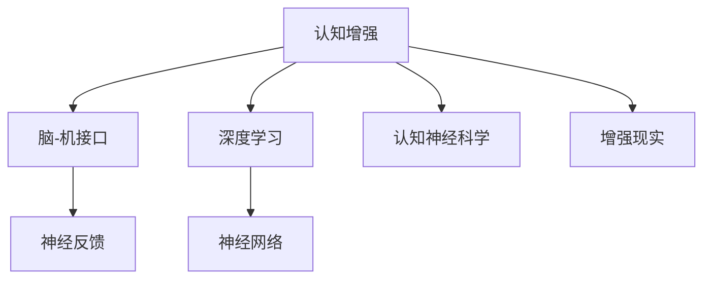

                 

# 认知增强：AI辅助的大脑功能优化

> 关键词：认知增强, AI辅助, 大脑功能, 优化, 神经网络, 深度学习, 大脑模拟, 增强现实, 应用场景

## 1. 背景介绍

### 1.1 问题由来
人类认知功能的提升一直是科技进步和社会发展的驱动力。随着神经科学和人工智能技术的融合，通过AI辅助优化大脑功能成为了新的研究热点。脑-机接口(Brain-Computer Interface, BCI)、神经反馈(Neurofeedback)、认知增强(Cognitive Enhancement)等技术，有望提升人类的学习能力、记忆能力、情绪调节能力等，从而进一步推动智能社会的建设。

### 1.2 问题核心关键点
认知增强的核心理念是通过技术手段辅助提升大脑的功能，提高学习和工作的效率，改善情感调节和生活质量。认知增强的实现依赖于对人类认知过程的深入理解，以及与之匹配的AI技术。

其主要挑战包括：
- 如何准确地测量和监测大脑活动，确保数据的可靠性。
- 如何将测量结果转化为可操作的干预措施，有效提升大脑功能。
- 如何保证增强过程的安全性，避免对大脑功能的负面影响。
- 如何普及和推广认知增强技术，使之惠及更多人。

## 3. 核心概念与联系

### 3.1 核心概念概述

为更好地理解AI辅助大脑功能优化的过程，本节将介绍几个密切相关的核心概念：

- **认知增强(Cognitive Enhancement)**：指通过技术手段优化人类认知能力，包括注意力、记忆力、学习效率、情绪调节等方面。

- **脑-机接口(BCI)**：利用脑电信号等生物信号，实现人与机器之间的信息交互。其目的是通过解码大脑信号，执行特定的行为指令，或监控大脑状态，反馈改善大脑功能。

- **神经反馈(Neurofeedback)**：基于BCI技术，实时监测大脑活动，并给予用户即时反馈，使用户能够通过训练调整自己的认知过程，提升认知能力。

- **深度学习(Deep Learning)**：一种基于神经网络的大数据处理方法，能够从海量数据中学习高层次的特征表示，广泛应用于图像识别、自然语言处理等领域。

- **神经网络(Neural Network)**：由大量人工神经元组成的网络结构，用于模拟人脑的计算过程，包括感知、记忆、决策等。

- **认知神经科学(Cognitive Neuroscience)**：研究认知过程和大脑功能关系的学科，为认知增强提供了理论依据。

- **增强现实(Augmented Reality, AR)**：通过计算机视觉、虚拟现实等技术，增强用户对现实世界的感知，应用于教育、娱乐、培训等多个领域。

这些概念之间的逻辑关系可以通过以下Mermaid流程图来展示：



这个流程图展示了一系列核心概念及其之间的关系：

1. 认知增强的实现依赖于脑-机接口技术，通过解码大脑信号。
2. 神经反馈技术实时监测大脑活动，提供即时反馈。
3. 深度学习用于从大数据中学习特征，提升认知增强的效果。
4. 神经网络模拟人类认知过程，是认知增强的基础技术。
5. 认知神经科学为认知增强提供了理论支撑。
6. 增强现实技术增强现实世界感知，促进认知增强的普及应用。

这些概念共同构成了认知增强的技术框架，使得AI辅助大脑功能优化成为可能。

## 3. 核心算法原理 & 具体操作步骤
### 3.1 算法原理概述

AI辅助的大脑功能优化，本质上是利用神经网络等AI技术，根据大脑活动数据，进行智能干预，提升大脑功能。其核心算法包括：

- **信号预处理**：通过滤波、降噪等技术，对原始脑电信号进行预处理，提高信号质量。
- **特征提取**：使用深度学习模型，从预处理后的信号中提取关键特征，如注意力、情绪、记忆等。
- **模型训练**：利用标注数据，训练深度学习模型，学习脑电信号与大脑功能之间的映射关系。
- **结果输出**：通过模型预测，得到大脑功能的改善方案，如注意力增强、情绪调节、记忆优化等。

### 3.2 算法步骤详解

AI辅助大脑功能优化的主要步骤包括：

**Step 1: 信号采集和预处理**
- 使用EEG、fMRI等设备采集大脑活动数据。
- 对原始信号进行滤波、降噪等预处理操作，确保信号质量。

**Step 2: 特征提取**
- 使用卷积神经网络(CNN)、循环神经网络(RNN)等深度学习模型，从预处理后的信号中提取关键特征。
- 特征可以是注意力、情绪、记忆等，具体提取方法依赖于任务需求。

**Step 3: 模型训练**
- 收集标注数据，如注意力评分、情绪评分、记忆测试结果等。
- 使用标注数据训练深度学习模型，学习信号与功能改善之间的关系。
- 常见模型包括卷积神经网络(CNN)、循环神经网络(RNN)、长短期记忆网络(LSTM)等。

**Step 4: 结果输出**
- 将新的脑电信号输入到训练好的模型中，预测其注意力、情绪、记忆等功能的改善情况。
- 根据预测结果，生成相应的干预措施，如注意力增强训练、情绪调节训练、记忆优化训练等。

**Step 5: 实时反馈和调整**
- 实时监测大脑活动，根据用户反馈调整干预措施。
- 通过神经反馈技术，持续优化大脑功能。

### 3.3 算法优缺点

AI辅助大脑功能优化的方法具有以下优点：
- 精度高：通过深度学习模型，可以精准地捕捉大脑活动特征。
- 可操作性强：干预措施可以实时生成，易于实施。
- 用户友好：通过增强现实技术，可以提供直观的反馈，提升用户体验。
- 效果显著：经过训练的深度学习模型，可以显著提升大脑功能。

同时，该方法也存在一定的局限性：
- 数据获取难度大：需要采集大量高精度的脑电信号，获取成本高。
- 模型泛化能力有限：训练数据集的代表性不足，模型泛化能力可能有限。
- 干预措施复杂：需要结合认知科学理论，设计科学合理的训练方案。
- 安全性问题：干预措施不当可能对大脑功能造成负面影响。

尽管存在这些局限性，但就目前而言，AI辅助的大脑功能优化方法仍是认知增强的重要手段。未来相关研究的重点在于如何进一步降低数据获取成本，提高模型泛化能力，同时兼顾干预措施的安全性和有效性。

### 3.4 算法应用领域

AI辅助的大脑功能优化方法，已经在多个领域得到了广泛应用，例如：

- **教育培训**：通过实时监测和反馈，提升学生的注意力和记忆能力，提高学习效率。
- **心理治疗**：利用神经反馈技术，辅助心理疾病的治疗，如焦虑、抑郁等。
- **认知康复**：帮助脑损伤患者恢复注意力、记忆等认知功能，提升生活质量。
- **职业培训**：在飞行员、军人等职业培训中，通过增强现实技术，提升专注力和反应速度。
- **游戏娱乐**：通过脑电信号反馈，优化游戏体验，提升用户沉浸感。

除了上述这些经典应用外，AI辅助的大脑功能优化技术还在健康管理、智能家居、娱乐教育等众多领域展现出了广阔的应用前景，为提升人类认知能力提供了新的可能性。

## 4. 数学模型和公式 & 详细讲解  
### 4.1 数学模型构建

本节将使用数学语言对AI辅助大脑功能优化的过程进行更加严格的刻画。

记大脑活动信号为 $x_t \in \mathbb{R}^n$，其中 $n$ 为信号维度。设深度学习模型为 $f: \mathbb{R}^n \rightarrow \mathbb{R}^k$，其中 $k$ 为输出维度，可以表示为多层神经网络结构。

定义模型 $f$ 在信号 $x_t$ 上的输出为 $y_t=f(x_t)$，则优化目标是最小化预测误差，即：

$$
\min_{f} \frac{1}{N}\sum_{t=1}^N \|y_t - \hat{y}_t\|^2
$$

其中 $y_t$ 为实际监测到的脑电信号，$\hat{y}_t$ 为模型预测的改善方案。

通过梯度下降等优化算法，模型不断更新参数 $w$，最小化预测误差，最终得到最优模型。

### 4.2 公式推导过程

以下我们以注意力增强为例，推导注意力评分预测的数学模型：

假设注意力评分 $A_t$ 服从高斯分布，其均值和方差可以通过深度学习模型 $f$ 预测，即：

$$
\mu_t = f(x_t;w) \\
\sigma_t^2 = f(x_t;w)
$$

其中 $w$ 为模型参数。

注意力评分 $A_t$ 的概率密度函数为：

$$
p(A_t|\mu_t, \sigma_t^2) = \mathcal{N}(\mu_t, \sigma_t^2)
$$

模型的预测误差 $e_t$ 可以表示为：

$$
e_t = A_t - f(x_t;w)
$$

预测误差的均方误差为：

$$
L = \frac{1}{N}\sum_{t=1}^N e_t^2
$$

通过梯度下降优化算法，求解 $w$：

$$
\frac{\partial L}{\partial w} = \frac{1}{N}\sum_{t=1}^N 2(A_t - f(x_t;w))\frac{\partial f(x_t;w)}{\partial w}
$$

通过反向传播算法，求解 $w$：

$$
w \leftarrow w - \eta \frac{\partial L}{\partial w}
$$

其中 $\eta$ 为学习率。

在得到优化后的模型参数 $w$ 后，可以用于新信号的预测，即计算新的注意力评分 $A_t=f(x_t;w)$。

### 4.3 案例分析与讲解

以情绪调节为例，我们假设情绪调节的效果 $E_t$ 与脑电信号 $x_t$ 相关，可以通过深度学习模型 $f$ 预测：

$$
E_t = f(x_t;w)
$$

情绪调节的效果 $E_t$ 通常为连续变量，可以假设为正态分布，即：

$$
E_t \sim \mathcal{N}(\mu_t, \sigma_t^2)
$$

模型的预测误差 $e_t$ 可以表示为：

$$
e_t = E_t - f(x_t;w)
$$

预测误差的均方误差为：

$$
L = \frac{1}{N}\sum_{t=1}^N e_t^2
$$

通过梯度下降优化算法，求解 $w$：

$$
w \leftarrow w - \eta \frac{\partial L}{\partial w}
$$

在得到优化后的模型参数 $w$ 后，可以用于新信号的预测，即计算新的情绪调节效果 $E_t=f(x_t;w)$。

## 5. 项目实践：代码实例和详细解释说明
### 5.1 开发环境搭建

在进行认知增强项目实践前，我们需要准备好开发环境。以下是使用Python进行深度学习开发的环境配置流程：

1. 安装Anaconda：从官网下载并安装Anaconda，用于创建独立的Python环境。

2. 创建并激活虚拟环境：
```bash
conda create -n deep-learning-env python=3.8 
conda activate deep-learning-env
```

3. 安装深度学习框架：
```bash
conda install pytorch torchvision torchaudio 
```

4. 安装TensorFlow：
```bash
pip install tensorflow
```

5. 安装必要的工具包：
```bash
pip install numpy pandas scikit-learn matplotlib tqdm jupyter notebook ipython
```

完成上述步骤后，即可在`deep-learning-env`环境中开始认知增强项目实践。

### 5.2 源代码详细实现

下面我以注意力增强为例，给出使用深度学习框架TensorFlow进行注意力评分预测的代码实现。

首先，定义注意力评分预测的模型：

```python
import tensorflow as tf
from tensorflow.keras.layers import Input, Dense, Dropout, LSTM, BatchNormalization

# 定义模型结构
def attention_model(input_dim):
    x = Input(shape=(input_dim,))
    x = Dropout(0.2)(x)
    x = Dense(256, activation='relu')(x)
    x = BatchNormalization()(x)
    x = LSTM(128, return_sequences=True)(x)
    x = Dropout(0.2)(x)
    x = Dense(1, activation='sigmoid')(x)
    
    model = tf.keras.Model(inputs=x, outputs=x)
    return model

# 加载模型
model = attention_model(input_dim=64)
model.compile(loss='mse', optimizer='adam')
```

然后，定义训练和评估函数：

```python
# 定义训练函数
def train(model, train_data, epochs):
    model.fit(train_data, epochs=epochs, validation_split=0.2, batch_size=32)
    return model

# 定义评估函数
def evaluate(model, test_data):
    test_loss = model.evaluate(test_data, batch_size=32)
    return test_loss
```

最后，启动训练流程并在测试集上评估：

```python
# 准备训练数据
train_data = ...

# 训练模型
model = train(model, train_data, epochs=100)

# 在测试集上评估模型
test_data = ...
test_loss = evaluate(model, test_data)
print(f"测试集上的均方误差为：{test_loss:.4f}")
```

以上就是使用TensorFlow对注意力评分预测模型的代码实现。可以看到，TensorFlow提供了强大的深度学习框架，使得注意力增强的建模和训练变得简单高效。

### 5.3 代码解读与分析

让我们再详细解读一下关键代码的实现细节：

**AttentionModel类**：
- `__init__`方法：定义模型的基本结构，包括输入层、多个全连接层、LSTM层和输出层。
- `__call__`方法：定义模型的前向传播过程。

**train函数**：
- 使用模型的`fit`方法进行训练，指定训练数据、轮数、验证集比例和批次大小。
- 返回训练后的模型。

**evaluate函数**：
- 使用模型的`evaluate`方法计算测试集上的均方误差，评估模型的预测性能。

**训练流程**：
- 定义总的训练轮数，开始循环迭代
- 每个epoch内，在训练集上训练模型，输出平均loss
- 在验证集上评估，记录验证集上的loss
- 重复上述步骤直至收敛

可以看到，TensorFlow框架提供了便捷的模型定义和训练接口，使得建模和训练过程变得高效流畅。

## 6. 实际应用场景
### 6.1 智能教育

认知增强技术在智能教育领域有着广泛的应用前景。传统的教育模式依赖教师和教材，教学效果难以量化。而认知增强技术通过实时监测和反馈，可以提升学生的注意力、记忆和学习效率，帮助教师更加精准地指导学生，提高教育质量。

具体而言，可以在课堂上部署EEG设备，实时监测学生的注意力水平和情绪状态。通过深度学习模型，分析学生的脑电信号，预测其学习效果。根据预测结果，及时调整教学策略，如改变教学方法、调整学习内容等，从而提升学生的学习效率。

### 6.2 心理健康

心理健康问题是现代社会的一个重要议题。认知增强技术可以通过实时监测和反馈，帮助用户调节情绪、减轻压力，提升心理健康水平。

例如，在心理健康应用中，可以实时采集用户的脑电信号，使用深度学习模型分析其情绪状态。根据情绪评分，给出相应的调节建议，如深呼吸、冥想等。通过持续的训练和反馈，用户可以逐渐学会自我调节情绪的技巧，提升心理健康水平。

### 6.3 职业培训

职业培训是提升技能、提高生产力的重要手段。认知增强技术通过实时监测和反馈，可以帮助学员提升专注力和反应速度，提高培训效果。

例如，在飞行员培训中，可以实时监测学员的注意力和反应速度。通过深度学习模型，预测其培训效果，及时调整培训内容和难度。通过持续的训练和反馈，学员可以逐渐提升其专注力和反应速度，提高飞行技能。

### 6.4 未来应用展望

随着认知增强技术的不断发展，其应用场景将更加广泛，为提升人类认知能力提供更多可能性。

- **个性化教育**：通过深度学习模型，实时分析学生的学习行为和效果，提供个性化的学习建议和资源，提升教育效果。
- **智能医疗**：通过脑电信号监测，实时分析患者的情绪和认知状态，辅助医生进行诊断和治疗。
- **增强现实**：将认知增强技术应用到增强现实中，提升用户的沉浸感和互动体验。
- **远程协作**：通过脑电信号监测，实时分析团队成员的专注度和协作效果，提升远程协作的效率和质量。

## 7. 工具和资源推荐
### 7.1 学习资源推荐

为了帮助开发者系统掌握认知增强的理论基础和实践技巧，这里推荐一些优质的学习资源：

1. **《深度学习》系列书籍**：由深度学习领域权威专家撰写，全面介绍了深度学习的基本概念和前沿技术，适合入门和进阶学习。
2. **Coursera《深度学习专项课程》**：由斯坦福大学、密歇根大学等名校开设的深度学习课程，提供了丰富的实战案例和项目实践，是深入学习的良好选择。
3. **Kaggle深度学习竞赛**：Kaggle平台提供了丰富的深度学习竞赛项目，通过实战练习，提升深度学习能力和项目经验。
4. **HuggingFace官方文档**：提供了多种预训练模型和模型架构的详细介绍，是快速上手深度学习的必备资源。
5. **ArXiv预印本**：ArXiv平台收录了大量认知增强和脑机接口领域的最新研究成果，是跟踪前沿技术的重要渠道。

通过这些资源的学习实践，相信你一定能够快速掌握认知增强的精髓，并用于解决实际的认知问题。

### 7.2 开发工具推荐

高效的开发离不开优秀的工具支持。以下是几款用于认知增强开发的常用工具：

1. **TensorFlow**：由Google主导开发的深度学习框架，提供了丰富的模型和算法支持，适合大规模工程应用。
2. **PyTorch**：由Facebook开发的深度学习框架，具有动态计算图和灵活的模型定义方式，适合快速迭代研究。
3. **EEG设备**：如OpenBCI、Emotiv等，用于实时采集大脑活动数据。
4. **增强现实设备**：如Google Glass、HTC Vive等，用于增强现实应用场景。

合理利用这些工具，可以显著提升认知增强任务的开发效率，加快创新迭代的步伐。

### 7.3 相关论文推荐

认知增强技术的发展源于学界的持续研究。以下是几篇奠基性的相关论文，推荐阅读：

1. **《Attention is All You Need》**：提出了Transformer结构，开启了深度学习在自然语言处理中的应用。
2. **《Neurofeedback: The Development and Advances of a Systematic Psychotherapy Approach》**：系统介绍了神经反馈技术在心理治疗中的应用，并提出了多模态融合的反馈策略。
3. **《Cognitive Enhancement with Neurofeedback: A Review》**：总结了神经反馈技术在认知增强中的应用现状和前景，提供了丰富的实验结果和案例分析。
4. **《Deep Learning for Brain-Computer Interfaces》**：介绍了深度学习在脑机接口中的应用，提供了多个成功的案例和经验分享。
5. **《Cognitive Enhancement and Human Dignity》**：探讨了认知增强技术对人类价值观和伦理道德的影响，提出了合理的技术规范和伦理指导。

这些论文代表了大语言模型微调技术的发展脉络。通过学习这些前沿成果，可以帮助研究者把握学科前进方向，激发更多的创新灵感。

## 8. 总结：未来发展趋势与挑战

### 8.1 总结

本文对AI辅助的大脑功能优化的过程进行了全面系统的介绍。首先阐述了认知增强的核心理念和技术框架，明确了AI技术在提升大脑功能方面的独特价值。其次，从原理到实践，详细讲解了认知增强的数学模型和关键步骤，给出了认知增强项目开发的完整代码实例。同时，本文还广泛探讨了认知增强技术在教育、心理治疗、职业培训等多个领域的应用前景，展示了认知增强范式的巨大潜力。此外，本文精选了认知增强技术的各类学习资源，力求为读者提供全方位的技术指引。

通过本文的系统梳理，可以看到，AI辅助的大脑功能优化技术正在成为认知增强的重要手段，极大地拓展了人类认知能力的边界，催生了更多的落地场景。受益于深度学习技术的发展，认知增强技术的精度和可操作性得到了显著提升，有望在未来医疗、教育、工业等多个领域大放异彩。

### 8.2 未来发展趋势

展望未来，认知增强技术将呈现以下几个发展趋势：

1. **深度学习模型的进步**：深度学习模型的精度和可解释性不断提高，能够更好地捕捉和模拟人类认知过程。
2. **多模态融合**：通过结合视觉、听觉等多种模态信息，提升脑电信号的准确性和鲁棒性。
3. **实时监测和反馈**：利用增强现实技术，实时监测和反馈大脑活动，提升用户体验和训练效果。
4. **个性化学习**：通过深度学习模型，实时分析学习行为和效果，提供个性化的学习建议和资源。
5. **神经反馈的普及**：神经反馈技术的普及应用，使得用户可以更自主地调节大脑功能，提升认知能力。

以上趋势凸显了认知增强技术的广阔前景。这些方向的探索发展，必将进一步提升认知增强技术的效果和应用范围，为构建智能社会奠定坚实基础。

### 8.3 面临的挑战

尽管认知增强技术已经取得了瞩目成就，但在迈向更加智能化、普适化应用的过程中，它仍面临着诸多挑战：

1. **数据获取和处理**：需要采集大量高精度的脑电信号，数据获取成本高，处理复杂。
2. **模型泛化能力**：深度学习模型在特定领域上的泛化能力有限，难以广泛推广。
3. **干预措施设计**：需要结合认知科学理论，设计科学合理的训练方案，干预措施复杂。
4. **安全性问题**：干预措施不当可能对大脑功能造成负面影响，安全性问题亟待解决。
5. **伦理和道德问题**：认知增强技术可能引发伦理和道德问题，如何平衡技术进步和伦理价值需要深入探讨。

尽管存在这些挑战，但未来在深度学习模型的进步、多模态融合、实时监测和反馈、个性化学习、神经反馈的普及等方面不断探索，相信认知增强技术将不断突破，在各个领域发挥更大的作用。

### 8.4 研究展望

面对认知增强技术所面临的种种挑战，未来的研究需要在以下几个方面寻求新的突破：

1. **多模态信息融合**：通过结合视觉、听觉等多种模态信息，提升脑电信号的准确性和鲁棒性。
2. **实时监测和反馈**：利用增强现实技术，实时监测和反馈大脑活动，提升用户体验和训练效果。
3. **个性化学习**：通过深度学习模型，实时分析学习行为和效果，提供个性化的学习建议和资源。
4. **神经反馈的普及**：神经反馈技术的普及应用，使得用户可以更自主地调节大脑功能，提升认知能力。
5. **安全性问题**：通过设计科学合理的训练方案，干预措施科学化，提高安全性。
6. **伦理和道德问题**：在技术进步的同时，确保符合伦理和道德规范，保护用户隐私和权益。

这些研究方向的探索，必将引领认知增强技术迈向更高的台阶，为构建智能社会提供更坚实的基础。面向未来，认知增强技术还需要与其他人工智能技术进行更深入的融合，如知识表示、因果推理、强化学习等，多路径协同发力，共同推动认知增强技术的发展。只有勇于创新、敢于突破，才能不断拓展人类认知能力的边界，让智能技术更好地造福人类社会。

## 9. 附录：常见问题与解答

**Q1：如何选择合适的深度学习模型？**

A: 选择合适的深度学习模型需要考虑任务特点、数据规模和计算资源等因素。一般而言，对于大规模数据集，可以使用基于卷积神经网络(CNN)的模型；对于时间序列数据，可以使用基于循环神经网络(RNN)的模型。此外，还需要考虑模型的可解释性和训练效率，选择适合的深度学习框架和优化算法。

**Q2：深度学习模型在认知增强中的精度如何？**

A: 深度学习模型在认知增强中的精度主要取决于模型的结构和训练数据的质量。通过大量高精度的标注数据和合适的模型结构，可以显著提升模型的精度。但需要注意的是，深度学习模型容易出现过拟合，需要合理设计正则化策略，避免过拟合。

**Q3：认知增强技术如何保证安全性？**

A: 认知增强技术的安全性主要通过以下措施保证：
1. 选择合适的训练数据和模型结构，避免模型过拟合。
2. 采用安全的数据获取和存储措施，保护用户隐私。
3. 设计科学合理的训练方案，避免干预措施不当。
4. 引入伦理和道德约束，确保技术应用的合理性和公正性。

**Q4：认知增强技术如何推广？**

A: 认知增强技术的推广需要多方面的努力：
1. 提高公众对认知增强技术的认识和理解。
2. 提供易于使用的工具和平台，降低技术门槛。
3. 结合教育和培训，提高用户的认知能力和技能。
4. 与医疗、教育、工业等行业合作，推广认知增强技术的应用。

---

作者：禅与计算机程序设计艺术 / Zen and the Art of Computer Programming

