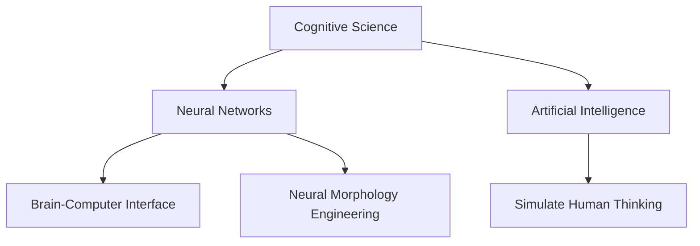

                 

# 认知科学与人工智能：模拟人类思维

> 关键词：认知科学,人工智能,模拟人类思维,脑机接口,神经网络,机器学习

## 1. 背景介绍

### 1.1 问题由来

随着人工智能技术的迅猛发展，人类对智能系统的理解愈发深入。其中，模拟人类思维成为一个重要研究方向。通过模仿人脑的神经机制和认知过程，人工智能不仅能够在特定任务上超越人类，还具备了更强的适应性和学习力。

尽管如此，人工神经网络等技术仍与真实的人脑有所差异。真实的人脑拥有复杂的神经网络结构，能够在多任务间切换自如，并在自然环境中高效处理信息。相比之下，当前的人工智能模型虽然强大，但更多的是针对特定任务进行优化，缺乏全面而灵活的智能。

因此，模拟人类思维成为了人工智能研究的新趋势。本文将探讨这一前沿领域，介绍关键概念、核心算法以及实际应用案例，旨在帮助读者深入理解如何构建具备认知功能的智能系统。

## 2. 核心概念与联系

### 2.1 核心概念概述

为了更好地理解认知科学与人工智能的融合，本节将介绍几个关键概念：

- 认知科学(Cognitive Science)：研究人类认知过程及其心理机制的科学。包括感知、记忆、推理、学习、思维等各个方面。

- 神经网络(Neural Networks)：模拟人脑神经元连接和信息传递的计算模型。通过多层神经元组成的网络结构，实现对数据的提取、转换和预测。

- 人工智能(Artificial Intelligence, AI)：模仿人类智能的系统，能够执行复杂任务，甚至超越人类在某些领域的性能。

- 模拟人类思维：通过构建与人类思维过程相似的算法和模型，使人工智能具备更接近人类的认知能力。

- 脑机接口(Brain-Computer Interface, BCIs)：将人脑与计算机系统进行交互的设备。用于解码和控制信息，实现人机互动。

- 神经形态工程(Neural Morphology Engineering)：设计类脑芯片或神经元网络，模拟人脑的生物结构和功能，提升计算效率和能效。

这些概念之间的逻辑关系可以通过以下Mermaid流程图来展示：



这个流程图展示了从认知科学到神经网络，再到人工智能和模拟人类思维的逻辑链条，以及脑机接口和神经形态工程的技术支撑。

## 3. 核心算法原理 & 具体操作步骤

### 3.1 算法原理概述

模拟人类思维的核心算法是神经网络，特别是深度神经网络(Deep Neural Networks, DNNs)。深度神经网络由多层神经元组成，通过反向传播算法进行训练，能够学习数据的复杂特征表示。

神经网络通过模拟人脑神经元的激活与连接，实现对输入数据的处理和输出。与传统的人工智能方法不同，神经网络能够自动学习特征表示，不需要人工设计特征工程。

具体来说，神经网络通过训练数据集，调整模型参数，使得模型在测试集上的表现最佳。训练过程中，模型不断通过前向传播和反向传播，更新权重和偏置，优化损失函数。

### 3.2 算法步骤详解

基于神经网络的模拟人类思维算法，通常包括以下几个关键步骤：

**Step 1: 构建神经网络模型**

选择合适的神经网络架构，如卷积神经网络(CNN)、递归神经网络(RNN)、长短期记忆网络(LSTM)、门控循环单元(GRU)、变分自编码器(VAE)、生成对抗网络(GAN)等。设置网络参数，如层数、神经元数、激活函数等。

**Step 2: 准备数据集**

收集人类思维数据，如脑电图(Brain Electrography, EEG)、功能性磁共振成像(Fuctional Magnetic Resonance Imaging, fMRI)、事件相关电位(Event-Related Potentials, ERPs)等。对这些数据进行预处理，包括去噪、归一化、分块等。

**Step 3: 设计训练流程**

选择合适的损失函数和优化器，如交叉熵损失、均方误差损失、AdamW优化器等。设定训练轮数、批大小、学习率等超参数。

**Step 4: 训练模型**

将数据集分成训练集、验证集和测试集。使用训练集对模型进行反向传播训练，每轮迭代更新模型参数，以最小化损失函数。验证集用于监测模型性能，防止过拟合。测试集用于评估模型最终性能。

**Step 5: 应用模型**

将训练好的模型应用到实际问题中，如脑机接口、智能机器人、自然语言处理(NLP)等。通过模型进行数据预测、行为控制、信息处理等。

### 3.3 算法优缺点

基于神经网络的模拟人类思维算法具有以下优点：

1. 强大表达能力：能够处理高维数据，自动提取特征，实现复杂数据类型的表示和处理。
2. 自适应能力：具有较强的泛化能力，适应不同任务和数据集。
3. 并行计算：多层网络结构适合并行计算，能够快速处理大量数据。
4. 高效学习：通过梯度下降等优化算法，模型能够高效学习任务相关的知识。

然而，这些算法也存在一些局限性：

1. 高复杂度：深层神经网络模型复杂度高，训练和推理耗时较多。
2. 过拟合风险：深层网络容易出现过拟合，需要复杂的正则化方法。
3. 可解释性差：深层网络通常是“黑盒”模型，难以解释其内部决策过程。
4. 数据需求大：深层网络需要大量标注数据进行训练，且对数据质量要求较高。
5. 计算资源要求高：深层网络对计算资源要求较高，需要GPU、TPU等高性能设备支持。

尽管存在这些局限性，但深层神经网络仍是当前模拟人类思维的主要技术手段。未来研究将聚焦于提高模型效率、降低计算成本、增强可解释性等方面。

### 3.4 算法应用领域

基于神经网络的模拟人类思维算法，已经在多个领域取得了显著应用：

- 脑机接口：通过解码人脑信号，实现人机交互和控制。例如，基于EEG信号的BrainGate系统，能够将人类运动意图转换为计算机命令。
- 智能机器人：模仿人脑认知过程，使机器人具备高智能水平。例如，Kenta Lab研发的iCub机器人，通过深度学习算法实现自主导航和决策。
- 自然语言处理：模拟语言认知过程，使机器能够理解和生成自然语言。例如，Google的BERT模型，通过深度学习实现语义表示和语言生成。
- 医疗诊断：通过分析脑电信号，帮助医生进行疾病诊断和预测。例如，Using BrainNetCNN对EEG数据进行分析，能够识别癫痫等脑部疾病。
- 人机协同：模拟人脑决策过程，使计算机系统能够更好地理解和执行人类指令。例如，IBM的Watson系统，通过深度学习实现复杂问题求解和知识推理。

这些应用展示了深层神经网络在模拟人类思维方面的巨大潜力，进一步推动了认知科学与人工智能的融合。

## 4. 数学模型和公式 & 详细讲解 & 举例说明

### 4.1 数学模型构建

本节将使用数学语言对神经网络模拟人类思维的数学模型进行更加严格的刻画。

假设神经网络由 $L$ 层组成，输入为 $x$，输出为 $y$。网络参数为 $\theta = \{\omega_i, b_i\}$，其中 $\omega_i$ 为权重矩阵，$b_i$ 为偏置向量。

定义网络的第 $l$ 层的输出为 $a_l = \sigma(\omega_l a_{l-1} + b_l)$，其中 $\sigma$ 为激活函数。网络的总输出为 $y = a_L$。

训练数据集为 $\{(x_i, y_i)\}$，损失函数为 $J(\theta)$。常用的损失函数包括均方误差损失、交叉熵损失等。

### 4.2 公式推导过程

以均方误差损失函数为例，进行公式推导：

假设训练数据集为 $\{(x_i, y_i)\}$，其中 $x_i$ 为输入，$y_i$ 为输出。网络输出为 $y_i = a_L$，真实输出为 $y_i^*$。均方误差损失函数为：

$$
J(\theta) = \frac{1}{N}\sum_{i=1}^N(y_i - y_i^*)^2
$$

通过反向传播算法，计算损失函数对每个参数的偏导数，更新参数：

$$
\frac{\partial J}{\partial \theta_j} = \frac{\partial y_i}{\partial \theta_j} = \frac{\partial y_i}{\partial a_L} \frac{\partial a_L}{\partial a_{l-1}} \dots \frac{\partial a_2}{\partial a_1} \frac{\partial a_1}{\partial \theta_j}
$$

其中 $\frac{\partial y_i}{\partial a_L}$ 可通过链式法则计算，$\frac{\partial a_L}{\partial a_{l-1}}$ 为激活函数的导数。

重复上述过程，直至所有参数更新完毕，完成一轮训练。

### 4.3 案例分析与讲解

以图像分类为例，展示神经网络在模拟人类思维中的应用。

假设输入为一张图像，输出为该图像所属的类别。使用卷积神经网络(CNN)进行图像分类。

**Step 1: 构建网络**

- 输入层：输入图像，维度为 $C \times H \times W$。
- 卷积层：通过多个卷积核，提取图像特征。
- 池化层：对卷积层输出进行下采样，减小特征维度。
- 全连接层：将池化层输出映射到类别概率。
- 输出层：将全连接层输出转化为类别标签。

**Step 2: 准备数据集**

- 收集大量标注图像数据集，如CIFAR-10、MNIST等。
- 对数据进行预处理，包括图像缩放、归一化、增强等。

**Step 3: 训练模型**

- 选择合适的网络结构，如LeNet、AlexNet、VGG等。
- 设置损失函数和优化器，如交叉熵损失、AdamW优化器。
- 使用训练集进行反向传播训练，验证集监测性能。

**Step 4: 应用模型**

- 在测试集上评估模型性能，如准确率、召回率等。
- 使用模型对新图像进行分类预测。

通过上述步骤，神经网络可以模拟人类对图像的感知、特征提取、分类推理等认知过程，实现高效、准确、鲁棒的图像分类。

## 5. 项目实践：代码实例和详细解释说明

### 5.1 开发环境搭建

在进行神经网络项目实践前，我们需要准备好开发环境。以下是使用Python进行PyTorch开发的环境配置流程：

1. 安装Anaconda：从官网下载并安装Anaconda，用于创建独立的Python环境。

2. 创建并激活虚拟环境：
```bash
conda create -n pytorch-env python=3.8 
conda activate pytorch-env
```

3. 安装PyTorch：根据CUDA版本，从官网获取对应的安装命令。例如：
```bash
conda install pytorch torchvision torchaudio cudatoolkit=11.1 -c pytorch -c conda-forge
```

4. 安装其他相关库：
```bash
pip install numpy scipy matplotlib scikit-learn tqdm torchvision torchtext
```

完成上述步骤后，即可在`pytorch-env`环境中开始项目实践。

### 5.2 源代码详细实现

下面我们以图像分类为例，给出使用PyTorch进行神经网络开发的完整代码实现。

```python
import torch
import torch.nn as nn
import torch.optim as optim
from torch.utils.data import DataLoader
from torchvision import datasets, transforms

# 定义神经网络模型
class Net(nn.Module):
    def __init__(self):
        super(Net, self).__init__()
        self.conv1 = nn.Conv2d(3, 32, 3, 1, 1)
        self.conv2 = nn.Conv2d(32, 64, 3, 1, 1)
        self.dropout1 = nn.Dropout(0.25)
        self.dropout2 = nn.Dropout(0.5)
        self.fc1 = nn.Linear(9216, 128)
        self.fc2 = nn.Linear(128, 10)

    def forward(self, x):
        x = self.conv1(x)
        x = nn.functional.relu(x)
        x = nn.functional.max_pool2d(x, 2)
        x = self.dropout1(x)
        x = self.conv2(x)
        x = nn.functional.relu(x)
        x = nn.functional.max_pool2d(x, 2)
        x = self.dropout2(x)
        x = torch.flatten(x, 1)
        x = self.fc1(x)
        x = nn.functional.relu(x)
        x = self.dropout2(x)
        x = self.fc2(x)
        x = nn.functional.log_softmax(x, dim=1)
        return x

# 加载数据集
transform = transforms.Compose([
    transforms.ToTensor(),
    transforms.Normalize((0.5, 0.5, 0.5), (0.5, 0.5, 0.5))
])
train_dataset = datasets.CIFAR10(root='./data', train=True, download=True, transform=transform)
test_dataset = datasets.CIFAR10(root='./data', train=False, download=True, transform=transform)
train_loader = DataLoader(train_dataset, batch_size=4, shuffle=True, num_workers=2)
test_loader = DataLoader(test_dataset, batch_size=4, shuffle=False, num_workers=2)

# 定义模型和优化器
model = Net()
criterion = nn.CrossEntropyLoss()
optimizer = optim.Adam(model.parameters(), lr=0.001)

# 训练模型
for epoch in range(2):
    running_loss = 0.0
    for i, data in enumerate(train_loader, 0):
        inputs, labels = data
        optimizer.zero_grad()
        outputs = model(inputs)
        loss = criterion(outputs, labels)
        loss.backward()
        optimizer.step()
        running_loss += loss.item()
        if i % 2000 == 1999:
            print('[%d, %5d] loss: %.3f' %
                  (epoch + 1, i + 1, running_loss / 2000))
            running_loss = 0.0

print('Finished Training')

# 评估模型
correct = 0
total = 0
with torch.no_grad():
    for data in test_loader:
        images, labels = data
        outputs = model(images)
        _, predicted = torch.max(outputs.data, 1)
        total += labels.size(0)
        correct += (predicted == labels).sum().item()

print('Accuracy of the network on the 10000 test images: %d %%' % (
    100 * correct / total))
```

以上就是使用PyTorch进行神经网络项目实践的完整代码实现。可以看到，通过简单的代码，我们构建了一个基本的卷积神经网络，并在CIFAR-10数据集上进行了训练和测试。

### 5.3 代码解读与分析

让我们再详细解读一下关键代码的实现细节：

**Net类定义**：
- 继承自nn.Module，定义神经网络结构。
- 包含卷积层、池化层、全连接层和Dropout层，实现特征提取和分类预测。

**数据集加载**：
- 使用torchvision库加载CIFAR-10数据集，并进行预处理，包括图像归一化和通道转置。
- 使用DataLoader对数据集进行批量加载，提高加载效率。

**模型训练**：
- 定义损失函数和优化器，如交叉熵损失和Adam优化器。
- 循环迭代训练集，前向传播计算输出，反向传播更新参数，循环迭代多次。

**模型评估**：
- 使用测试集对模型进行评估，统计分类准确率。
- 在测试集上打印评估结果，显示模型性能。

通过以上步骤，我们完成了一个完整的神经网络项目实践，展示了如何使用PyTorch实现图像分类任务。

## 6. 实际应用场景

### 6.1 脑机接口

脑机接口技术将人脑信号转化为计算机指令，实现人机交互和控制。例如，BrainGate系统通过EEG信号解码，将患者的运动意图转换为计算机命令，实现了瘫痪患者对轮椅的控制。未来，脑机接口技术有望在医疗、军事、游戏等领域获得广泛应用。

### 6.2 智能机器人

智能机器人通过模仿人脑认知过程，实现自主导航和决策。例如，Kenta Lab研发的iCub机器人，通过深度学习算法，实现了对复杂环境的感知和响应。未来，智能机器人将在制造业、服务业、农业等领域发挥重要作用。

### 6.3 自然语言处理

自然语言处理技术通过模拟人脑语言理解过程，使机器能够理解和生成自然语言。例如，Google的BERT模型，通过深度学习算法，实现了高质量的语言表示和生成。未来，自然语言处理技术将在智能客服、自动翻译、文本摘要等领域获得广泛应用。

### 6.4 医疗诊断

医疗诊断技术通过分析脑电信号，帮助医生进行疾病诊断和预测。例如，Using BrainNetCNN对EEG数据进行分析，能够识别癫痫等脑部疾病。未来，医疗诊断技术将在神经科学、精神疾病等领域获得重要应用。

### 6.5 人机协同

人机协同技术通过模拟人脑决策过程，使计算机系统能够更好地理解和执行人类指令。例如，IBM的Watson系统，通过深度学习算法，实现了复杂问题求解和知识推理。未来，人机协同技术将在智能问答、智能推荐、智能写作等领域发挥重要作用。

## 7. 工具和资源推荐

### 7.1 学习资源推荐

为了帮助开发者系统掌握神经网络模拟人类思维的理论基础和实践技巧，这里推荐一些优质的学习资源：

1. 《深度学习》书籍：Ian Goodfellow所著，全面介绍了深度学习的原理和应用。

2. 《神经网络与深度学习》课程：吴恩达主讲，涵盖深度学习的基本概念和经典算法。

3. 《深度学习入门：基于Python的理论与实现》书籍：斋藤康毅所著，深入浅出地介绍了深度学习的基本概念和编程实现。

4. DeepLearning.AI平台：吴恩达创办的在线学习平台，提供深度学习相关的课程和资源。

5. PyTorch官方文档：PyTorch官方文档，提供了完整的深度学习框架的使用指南和样例代码。

6. Kaggle竞赛：Kaggle提供大量深度学习竞赛，可以锻炼实战能力。

通过对这些资源的学习实践，相信你一定能够快速掌握神经网络模拟人类思维的精髓，并用于解决实际的深度学习问题。

### 7.2 开发工具推荐

高效的深度学习开发离不开优秀的工具支持。以下是几款用于深度学习开发的常用工具：

1. PyTorch：基于Python的开源深度学习框架，灵活动态的计算图，适合快速迭代研究。

2. TensorFlow：由Google主导开发的开源深度学习框架，生产部署方便，适合大规模工程应用。

3. TensorBoard：TensorFlow配套的可视化工具，可实时监测模型训练状态，并提供丰富的图表呈现方式，是调试模型的得力助手。

4. Weights & Biases：模型训练的实验跟踪工具，可以记录和可视化模型训练过程中的各项指标，方便对比和调优。

5. Keras：高层次深度学习框架，提供了简单易用的API，适合快速原型开发。

6. Jupyter Notebook：交互式Python环境，适合撰写和分享学习笔记，便于协作开发。

合理利用这些工具，可以显著提升深度学习开发的效率，加快创新迭代的步伐。

### 7.3 相关论文推荐

深度学习技术的发展源于学界的持续研究。以下是几篇奠基性的相关论文，推荐阅读：

1. 《深度学习》书籍：Ian Goodfellow所著，全面介绍了深度学习的原理和应用。

2. 《神经网络与深度学习》课程：吴恩达主讲，涵盖深度学习的基本概念和经典算法。

3. 《深度学习入门：基于Python的理论与实现》书籍：斋藤康毅所著，深入浅出地介绍了深度学习的基本概念和编程实现。

4. DeepLearning.AI平台：吴恩达创办的在线学习平台，提供深度学习相关的课程和资源。

5. PyTorch官方文档：PyTorch官方文档，提供了完整的深度学习框架的使用指南和样例代码。

6. Kaggle竞赛：Kaggle提供大量深度学习竞赛，可以锻炼实战能力。

这些论文代表了大语言模型微调技术的发展脉络。通过学习这些前沿成果，可以帮助研究者把握学科前进方向，激发更多的创新灵感。

## 8. 总结：未来发展趋势与挑战

### 8.1 总结

本文对神经网络模拟人类思维进行了全面系统的介绍。首先阐述了神经网络在认知科学中的应用背景和重要意义，明确了神经网络模拟人类思维的核心算法和关键步骤，展示了其强大表达能力和应用前景。其次，通过详细讲解PyTorch代码实例，帮助读者深入理解神经网络的基本实现原理和应用技巧。

通过本文的系统梳理，可以看到，神经网络在模拟人类思维方面具备强大的潜力和广泛的应用前景。深度学习技术正在逐步逼近人类智能，有望在未来带来更深远的变革。

### 8.2 未来发展趋势

展望未来，神经网络模拟人类思维技术将呈现以下几个发展趋势：

1. 计算效率提升：未来将进一步优化深度学习算法的计算图，降低计算复杂度，提升训练和推理速度。

2. 多模态融合：深度学习将实现不同模态数据（如视觉、听觉、文本等）的协同建模，提升信息整合能力。

3. 可解释性增强：未来将研究更加可解释的深度学习算法，提升模型的透明性和可解释性。

4. 跨领域应用拓展：深度学习将在更多领域获得应用，如医疗、教育、金融、智能交通等。

5. 协同优化：未来将研究深度学习与其他人工智能技术的协同优化，提升系统的综合性能。

6. 跨学科融合：深度学习将与其他学科（如认知科学、神经科学、心理学等）进行更深入的融合，推动认知科学的发展。

以上趋势展示了神经网络模拟人类思维技术的广阔前景，未来将在各个领域获得更多应用和突破。

### 8.3 面临的挑战

尽管神经网络模拟人类思维技术已经取得了重要进展，但在实际应用中也面临诸多挑战：

1. 数据依赖：深度学习模型需要大量标注数据进行训练，难以在数据稀缺的领域获得理想效果。

2. 计算成本高：深度学习模型对计算资源要求较高，训练和推理需要高性能设备支持。

3. 可解释性差：深度学习模型通常是“黑盒”模型，难以解释其内部决策过程。

4. 泛化能力不足：深度学习模型容易出现过拟合，泛化能力有限。

5. 安全性问题：深度学习模型可能学习到有害信息，存在安全隐患。

6. 伦理道德问题：深度学习模型可能产生偏见，需考虑伦理道德问题。

这些挑战将对神经网络模拟人类思维技术的普及应用构成重要障碍，未来需要进一步研究解决。

### 8.4 研究展望

面对神经网络模拟人类思维技术面临的挑战，未来的研究需要在以下几个方面寻求新的突破：

1. 探索无监督和半监督学习方法：摆脱对大量标注数据的依赖，利用自监督学习、主动学习等方法，实现更高效、更灵活的模型训练。

2. 研究参数高效方法：开发更加参数高效的深度学习算法，在固定大部分参数的情况下，只调整少量任务相关参数，提升模型泛化能力。

3. 融合因果和对比学习：引入因果推断和对比学习思想，增强深度学习模型的泛化能力和抗干扰能力。

4. 跨学科合作：推动认知科学与深度学习技术的跨学科合作，实现更全面、更深入的理论突破。

5. 注重伦理和社会影响：加强对深度学习模型的伦理审查和监管，确保其应用符合人类价值观和伦理道德。

这些研究方向的探索，必将引领神经网络模拟人类思维技术迈向更高的台阶，为人类认知智能的进步做出更大贡献。

## 9. 附录：常见问题与解答

**Q1：神经网络模拟人类思维有哪些优点？**

A: 神经网络模拟人类思维具有以下优点：

1. 强大表达能力：能够处理高维数据，自动提取特征，实现复杂数据类型的表示和处理。

2. 自适应能力：具有较强的泛化能力，适应不同任务和数据集。

3. 并行计算：多层网络结构适合并行计算，能够快速处理大量数据。

4. 高效学习：通过梯度下降等优化算法，模型能够高效学习任务相关的知识。

**Q2：神经网络模拟人类思维的缺点有哪些？**

A: 神经网络模拟人类思维存在以下缺点：

1. 高复杂度：深层神经网络模型复杂度高，训练和推理耗时较多。

2. 过拟合风险：深层网络容易出现过拟合，需要复杂的正则化方法。

3. 可解释性差：深层网络通常是“黑盒”模型，难以解释其内部决策过程。

4. 数据需求大：深层网络需要大量标注数据进行训练，且对数据质量要求较高。

5. 计算资源要求高：深层网络对计算资源要求较高，需要GPU、TPU等高性能设备支持。

**Q3：神经网络模拟人类思维有哪些应用场景？**

A: 神经网络模拟人类思维已经在多个领域取得了显著应用：

1. 脑机接口：通过解码人脑信号，实现人机交互和控制。

2. 智能机器人：通过模仿人脑认知过程，实现自主导航和决策。

3. 自然语言处理：通过模拟人脑语言理解过程，使机器能够理解和生成自然语言。

4. 医疗诊断：通过分析脑电信号，帮助医生进行疾病诊断和预测。

5. 人机协同：通过模拟人脑决策过程，使计算机系统能够更好地理解和执行人类指令。

这些应用展示了神经网络模拟人类思维的巨大潜力，进一步推动了认知科学与人工智能的融合。

**Q4：神经网络模拟人类思维的未来发展趋势是什么？**

A: 神经网络模拟人类思维技术的发展趋势包括：

1. 计算效率提升：未来将进一步优化深度学习算法的计算图，降低计算复杂度，提升训练和推理速度。

2. 多模态融合：深度学习将实现不同模态数据（如视觉、听觉、文本等）的协同建模，提升信息整合能力。

3. 可解释性增强：未来将研究更加可解释的深度学习算法，提升模型的透明性和可解释性。

4. 跨领域应用拓展：深度学习将在更多领域获得应用，如医疗、教育、金融、智能交通等。

5. 协同优化：未来将研究深度学习与其他人工智能技术的协同优化，提升系统的综合性能。

6. 跨学科融合：深度学习将与其他学科（如认知科学、神经科学、心理学等）进行更深入的融合，推动认知科学的发展。

这些趋势展示了神经网络模拟人类思维技术的广阔前景，未来将在各个领域获得更多应用和突破。

**Q5：神经网络模拟人类思维面临的挑战有哪些？**

A: 神经网络模拟人类思维技术面临以下挑战：

1. 数据依赖：深度学习模型需要大量标注数据进行训练，难以在数据稀缺的领域获得理想效果。

2. 计算成本高：深度学习模型对计算资源要求较高，训练和推理需要高性能设备支持。

3. 可解释性差：深度学习模型通常是“黑盒”模型，难以解释其内部决策过程。

4. 泛化能力不足：深度学习模型容易出现过拟合，泛化能力有限。

5. 安全性问题：深度学习模型可能学习到有害信息，存在安全隐患。

6. 伦理道德问题：深度学习模型可能产生偏见，需考虑伦理道德问题。

这些挑战将对神经网络模拟人类思维技术的普及应用构成重要障碍，未来需要进一步研究解决。

**Q6：神经网络模拟人类思维的应用前景是什么？**

A: 神经网络模拟人类思维技术的应用前景包括：

1. 脑机接口：通过解码人脑信号，实现人机交互和控制。

2. 智能机器人：通过模仿人脑认知过程，实现自主导航和决策。

3. 自然语言处理：通过模拟人脑语言理解过程，使机器能够理解和生成自然语言。

4. 医疗诊断：通过分析脑电信号，帮助医生进行疾病诊断和预测。

5. 人机协同：通过模拟人脑决策过程，使计算机系统能够更好地理解和执行人类指令。

这些应用展示了神经网络模拟人类思维的巨大潜力，未来将在各个领域获得更多应用和突破。

**Q7：神经网络模拟人类思维的局限性有哪些？**

A: 神经网络模拟人类思维的局限性包括：

1. 高复杂度：深层神经网络模型复杂度高，训练和推理耗时较多。

2. 过拟合风险：深层网络容易出现过拟合，需要复杂的正则化方法。

3. 可解释性差：深层网络通常是“黑盒”模型，难以解释其内部决策过程。

4. 数据需求大：深层网络需要大量标注数据进行训练，且对数据质量要求较高。

5. 计算资源要求高：深层网络对计算资源要求较高，需要GPU、TPU等高性能设备支持。

这些局限性将对神经网络模拟人类思维技术的实际应用构成重要挑战，未来需要进一步研究解决。

---

作者：禅与计算机程序设计艺术 / Zen and the Art of Computer Programming

