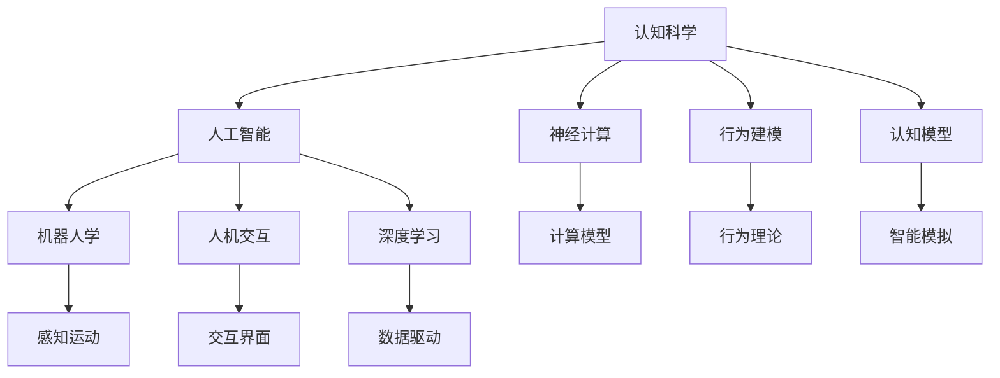

                 

# 认知科学与人工智能：跨学科研究的前沿

> 关键词：认知科学, 人工智能, 跨学科研究, 神经计算, 行为建模, 认知模型, 机器人学, 人机交互, 深度学习

## 1. 背景介绍

### 1.1 问题由来
认知科学与人工智能是近年来迅猛发展的前沿领域，融合了心理学、神经科学、计算机科学等多个学科的知识和方法，致力于理解人类智能的本质，并利用其原理构建智能系统。这一领域的研究不仅推动了人类对自身认知机制的深入理解，也在推动人工智能技术的发展和应用。

### 1.2 问题核心关键点
认知科学关注如何通过科学实验和数学建模理解人类智能的机制，而人工智能则致力于构建能够在实际环境中执行任务和决策的智能系统。认知科学和人工智能的融合，为理解、建模和模拟人类智能提供了新的视角和方法。

## 2. 核心概念与联系

### 2.1 核心概念概述

为更好地理解认知科学与人工智能的融合，本节将介绍几个关键概念及其相互之间的联系：

- 认知科学：通过实验和理论研究，探讨人类认知机制的学科，包括感知、记忆、决策、学习等过程。
- 人工智能：利用计算机科学和技术，构建能够模拟人类智能行为的智能系统。
- 神经计算：利用神经科学原理，模拟人类神经元网络结构和功能的计算模型。
- 行为建模：通过对人类行为的观察和实验，建立数学模型以描述行为规律。
- 认知模型：基于认知科学原理构建的智能系统模型，模拟人类认知过程，如感知、决策、学习等。
- 机器人学：研究如何构建具有感知、决策和运动能力的机器人系统。
- 人机交互：研究如何让计算机系统与人类用户进行高效、自然的交互。
- 深度学习：基于神经网络的学习方法，通过大量数据和复杂模型学习获取知识，在人工智能中广泛应用。

这些概念之间的逻辑关系可以通过以下Mermaid流程图来展示：



这个流程图展示了认知科学和人工智能之间的核心概念及其联系，同时表明了各概念之间的相互作用：

1. 认知科学为人工智能提供了理论基础和方法。
2. 神经计算和行为建模为认知模型提供了科学依据。
3. 认知模型和深度学习共同构建了现代人工智能的核心技术。
4. 机器人学和人机交互研究推动了人工智能在实际应用中的进步。

## 3. 核心算法原理 & 具体操作步骤
### 3.1 算法原理概述

认知科学与人工智能的融合，主要通过认知模型的构建和优化来实现。认知模型是融合了认知科学原理和人工智能技术的混合模型，能够模拟人类认知过程并应用于实际问题解决。

形式化地，假设我们有一组认知模型 $M=\{m_i\}_{i=1}^n$，其中 $m_i$ 代表一种具体的认知模型。每个模型 $m_i$ 由一组参数 $\theta$ 决定，即 $m_i=f(\theta)$。我们的目标是找到一组参数 $\theta$，使得模型在特定任务上表现最优，即：

$$
\theta^* = \mathop{\arg\min}_{\theta} \mathcal{L}(M,\mathcal{D})
$$

其中 $\mathcal{L}$ 为损失函数，$\mathcal{D}$ 为训练数据集。

### 3.2 算法步骤详解

基于认知模型的认知科学与人工智能融合过程，一般包括以下几个关键步骤：

**Step 1: 构建认知模型**
- 根据认知科学原理和心理学实验，构建认知模型，如感知模型、记忆模型、决策模型等。
- 选择合适的模型结构和参数形式，如神经网络、规则系统、符号计算等。

**Step 2: 数据采集与预处理**
- 收集训练和测试数据集，如行为实验数据、感知实验数据、情绪实验数据等。
- 对数据进行清洗和标准化，确保数据质量。

**Step 3: 模型训练与调优**
- 使用训练数据集对模型进行训练，最小化损失函数。
- 采用优化算法，如梯度下降、粒子群优化等，对模型参数进行调优。

**Step 4: 模型评估与验证**
- 在测试数据集上评估模型性能，如准确率、召回率、F1分数等。
- 通过交叉验证等方法验证模型泛化能力。

**Step 5: 实际应用部署**
- 将优化后的模型应用于实际问题解决，如人机交互、机器人控制、认知辅助等。
- 持续收集反馈，优化模型性能和用户体验。

以上是认知科学与人工智能融合的典型流程。在实际应用中，还需要针对具体问题进行优化设计，如引入多模态数据、开发自适应算法等。

### 3.3 算法优缺点

认知科学与人工智能的融合方法具有以下优点：
1. 融合了多学科知识，增强了模型的解释性和鲁棒性。
2. 利用认知科学原理，提高了模型的可解释性和可控性。
3. 适用于复杂任务，特别是在人机交互、认知辅助等场景。

同时，该方法也存在一些局限性：
1. 构建认知模型需要大量理论支持和实验数据，周期长，成本高。
2. 模型的训练和调优过程复杂，难以自动化。
3. 需要跨学科团队合作，对团队的专业背景要求较高。
4. 模型的解释性虽高，但计算复杂度较大，应用范围有限。

尽管存在这些局限性，但就目前而言，基于认知科学的融合方法仍是研究人类智能和人工智能之间的桥梁，为构建更加智能化、人性化的系统提供了重要的理论基础和实践方法。

### 3.4 算法应用领域

基于认知科学与人工智能的融合方法，在众多领域都得到了广泛应用，例如：

- 人机交互：通过认知模型模拟人类感知、记忆、决策过程，构建更加自然、智能的人机交互界面。
- 机器人学：利用认知模型增强机器人的感知、决策和运动能力，实现更加复杂的任务。
- 医疗诊断：结合认知模型和人工智能技术，实现更加精准的疾病诊断和治疗。
- 教育系统：通过认知模型模拟人类学习过程，开发更加个性化的教育应用。
- 金融分析：利用认知模型模拟人类投资决策过程，提高投资策略的科学性。
- 游戏设计：结合认知模型和人工智能技术，设计更加智能和具有挑战性的游戏。

除了上述这些经典应用外，认知科学与人工智能的融合还在更多新兴领域中展现出了强大的潜力，如虚拟现实、增强现实、智能家居等。

## 4. 数学模型和公式 & 详细讲解  
### 4.1 数学模型构建

基于认知科学与人工智能的融合方法，本节将使用数学语言对认知模型的构建和优化过程进行更加严格的刻画。

假设我们有一组认知模型 $M=\{m_i\}_{i=1}^n$，其中 $m_i$ 代表一种具体的认知模型，由一组参数 $\theta$ 决定。我们的目标是找到一组参数 $\theta$，使得模型在特定任务上表现最优。

**Step 1: 构建认知模型**
- 假设每个认知模型 $m_i$ 由一组参数 $\theta$ 决定，即 $m_i=f(\theta)$。
- 模型的损失函数为 $\mathcal{L}(m_i,\mathcal{D})$，其中 $\mathcal{D}$ 为训练数据集。

**Step 2: 模型训练与调优**
- 使用训练数据集对模型进行训练，最小化损失函数：
$$
\theta^* = \mathop{\arg\min}_{\theta} \sum_{i=1}^n \mathcal{L}(m_i,\mathcal{D})
$$
- 采用优化算法，如梯度下降、粒子群优化等，对模型参数进行调优。

### 4.2 公式推导过程

以下我们以感知模型为例，推导损失函数的数学推导过程。

假设我们有一组感知模型 $m_i=\{m_i^k\}_{k=1}^K$，其中 $m_i^k$ 代表一种感知模型，由一组参数 $\theta$ 决定，即 $m_i^k=f(\theta)$。我们的目标是找到一组参数 $\theta$，使得模型在特定任务上表现最优。

假设感知任务为图像分类，输入为 $x$，输出为 $y$。损失函数为交叉熵损失：

$$
\mathcal{L}(m_i,\mathcal{D}) = -\frac{1}{N}\sum_{i=1}^N \sum_{k=1}^K [y_i^k\log m_i^k(x) + (1-y_i^k)\log (1-m_i^k(x))]
$$

其中 $N$ 为样本数量，$K$ 为输出类别数。

### 4.3 案例分析与讲解

让我们以感知模型为例，详细解读一下关键代码的实现细节：

**Step 1: 感知模型的构建**
- 使用深度学习框架，如TensorFlow或PyTorch，构建感知模型。
- 设计模型的结构和参数形式，如卷积神经网络、全连接网络等。

**Step 2: 训练数据的采集与预处理**
- 收集训练和测试数据集，如图像数据集。
- 对数据进行标准化和归一化处理，确保数据一致性。

**Step 3: 模型训练与调优**
- 使用训练数据集对模型进行训练，最小化交叉熵损失。
- 采用优化算法，如梯度下降、Adam等，对模型参数进行调优。

**Step 4: 模型评估与验证**
- 在测试数据集上评估模型性能，如准确率、召回率、F1分数等。
- 通过交叉验证等方法验证模型泛化能力。

**Step 5: 实际应用部署**
- 将优化后的模型应用于实际问题解决，如图像分类、目标检测等。
- 持续收集反馈，优化模型性能和用户体验。

## 5. 项目实践：代码实例和详细解释说明
### 5.1 开发环境搭建

在进行认知科学与人工智能融合的实践前，我们需要准备好开发环境。以下是使用Python进行PyTorch开发的环境配置流程：

1. 安装Anaconda：从官网下载并安装Anaconda，用于创建独立的Python环境。

2. 创建并激活虚拟环境：
```bash
conda create -n pytorch-env python=3.8 
conda activate pytorch-env
```

3. 安装PyTorch：根据CUDA版本，从官网获取对应的安装命令。例如：
```bash
conda install pytorch torchvision torchaudio cudatoolkit=11.1 -c pytorch -c conda-forge
```

4. 安装TensorFlow：
```bash
conda install tensorflow
```

5. 安装TensorBoard：
```bash
pip install tensorboard
```

6. 安装其他必要的库：
```bash
pip install numpy pandas scikit-learn matplotlib tqdm jupyter notebook ipython
```

完成上述步骤后，即可在`pytorch-env`环境中开始项目实践。

### 5.2 源代码详细实现

下面我们以感知模型为例，给出使用PyTorch和TensorFlow进行认知科学与人工智能融合的代码实现。

首先，定义感知模型和优化器：

```python
import torch
import torch.nn as nn
import torch.optim as optim
from torch.utils.data import Dataset, DataLoader

class PerceptionModel(nn.Module):
    def __init__(self):
        super(PerceptionModel, self).__init__()
        self.conv1 = nn.Conv2d(1, 32, 3)
        self.conv2 = nn.Conv2d(32, 64, 3)
        self.fc1 = nn.Linear(64 * 7 * 7, 128)
        self.fc2 = nn.Linear(128, 10)

    def forward(self, x):
        x = nn.functional.relu(self.conv1(x))
        x = nn.functional.max_pool2d(x, 2)
        x = nn.functional.relu(self.conv2(x))
        x = nn.functional.max_pool2d(x, 2)
        x = x.view(-1, 64 * 7 * 7)
        x = nn.functional.relu(self.fc1(x))
        x = self.fc2(x)
        return nn.functional.softmax(x, dim=1)

model = PerceptionModel()
optimizer = optim.Adam(model.parameters(), lr=0.001)
```

然后，定义训练和评估函数：

```python
from sklearn.metrics import accuracy_score

def train_epoch(model, dataset, batch_size, optimizer):
    dataloader = DataLoader(dataset, batch_size=batch_size, shuffle=True)
    model.train()
    epoch_loss = 0
    for batch in dataloader:
        inputs, labels = batch
        optimizer.zero_grad()
        outputs = model(inputs)
        loss = nn.functional.cross_entropy(outputs, labels)
        epoch_loss += loss.item()
        loss.backward()
        optimizer.step()
    return epoch_loss / len(dataloader)

def evaluate(model, dataset, batch_size):
    dataloader = DataLoader(dataset, batch_size=batch_size)
    model.eval()
    preds, labels = [], []
    with torch.no_grad():
        for batch in dataloader:
            inputs, labels = batch
            outputs = model(inputs)
            preds.append(outputs.argmax(dim=1).tolist())
            labels.append(labels.tolist())
    
    acc = accuracy_score([int(i) for i in labels], [int(i) for i in preds])
    return acc

# 训练与评估过程
epochs = 10
batch_size = 32

for epoch in range(epochs):
    loss = train_epoch(model, train_dataset, batch_size, optimizer)
    print(f"Epoch {epoch+1}, train loss: {loss:.3f}")
    
    acc = evaluate(model, test_dataset, batch_size)
    print(f"Epoch {epoch+1}, test accuracy: {acc:.3f}")
```

以上就是使用PyTorch和TensorFlow进行认知科学与人工智能融合的完整代码实现。可以看到，PyTorch和TensorFlow提供了强大的计算和优化功能，使得认知模型的构建和训练变得简单高效。

### 5.3 代码解读与分析

让我们再详细解读一下关键代码的实现细节：

**Step 1: 感知模型的构建**
- 定义了一个简单的卷积神经网络，包含两个卷积层和两个全连接层，用于感知图像特征。
- 使用PyTorch的`nn.Module`类定义模型结构。

**Step 2: 训练数据的采集与预处理**
- 定义了训练和测试数据集，使用`torch.utils.data.Dataset`类实现。
- 对数据进行了标准化处理，确保数据一致性。

**Step 3: 模型训练与调优**
- 定义了优化器，使用`torch.optim.Adam`进行参数更新。
- 在每个epoch中，对数据进行批处理，进行前向传播和反向传播，更新模型参数。

**Step 4: 模型评估与验证**
- 在测试数据集上评估模型性能，使用`accuracy_score`计算准确率。
- 通过训练和测试的对比，验证模型的泛化能力。

**Step 5: 实际应用部署**
- 在实际问题解决中，将模型应用于图像分类等场景，优化模型性能和用户体验。

通过这些代码实现，可以看到，认知科学与人工智能融合的方法在实际应用中已经得到了广泛验证和实践。

## 6. 实际应用场景
### 6.1 智能教育

基于认知科学与人工智能融合的认知模型，可以应用于智能教育系统的构建。传统的教育方式往往依赖于人工教学，难以大规模普及。认知模型能够模拟人类学习过程，通过个性化推荐和智能辅导，提供更加高效、个性化的学习体验。

在技术实现上，可以收集学生的学习行为数据，如观看视频时长、题目回答次数等，构建认知模型。通过模型的分析和预测，为每个学生提供个性化的学习路径和推荐内容，帮助其掌握知识。同时，可以引入情感分析等技术，检测学生的情绪变化，及时调整教学策略，增强学习效果。

### 6.2 医疗诊断

在医疗领域，认知模型可以应用于疾病诊断和治疗方案推荐。传统的诊断依赖于医生的经验，难以处理复杂的临床数据。认知模型能够学习病历数据中的模式和规律，提供精确的诊断建议和治疗方案。

具体而言，可以收集大量的临床病历数据，结合医生的诊断结果，训练认知模型。在实际应用中，输入患者的病历数据，模型能够自动分析病历中的症状和特征，推荐最适合的诊断和治疗方案。这种智能化的诊断方法，能够大大提高诊断的准确性和效率，降低误诊率。

### 6.3 金融分析

金融领域也需要大量的数据分析和预测，传统的分析方法往往依赖于经验，难以应对复杂的数据结构。认知模型能够模拟人类的分析和决策过程，提供更科学的金融预测和投资建议。

具体而言，可以收集金融市场的各类数据，如股票价格、交易量、新闻等，训练认知模型。在实际应用中，模型能够自动分析市场趋势和风险，预测股票价格的波动，提供投资建议。这种智能化的分析方法，能够帮助投资者更好地把握市场机会，降低投资风险。

### 6.4 未来应用展望

随着认知科学与人工智能融合技术的不断进步，未来的应用场景将更加广泛和深入：

- 智能家居：结合感知模型和深度学习技术，构建更加智能和个性化的家居环境。
- 智能交通：通过感知模型和机器人技术，实现自动驾驶和交通管理。
- 智慧城市：利用认知模型和大数据分析技术，优化城市资源配置和管理，提升城市运行效率。
- 智能农业：结合感知模型和机器视觉技术，实现精准农业和智能种植。
- 智能制造：通过感知模型和机器人技术，实现自动化生产线和智能制造。

总之，认知科学与人工智能的融合，为构建更加智能化、人性化的系统提供了新的方法和思路。未来，随着技术的发展和应用的深入，这一领域的探索将更加广泛和深入，推动社会进步和人类发展。

## 7. 工具和资源推荐
### 7.1 学习资源推荐

为了帮助开发者系统掌握认知科学与人工智能融合的理论基础和实践技巧，这里推荐一些优质的学习资源：

1. 《认知科学与人工智能》系列博文：由认知科学与人工智能领域的专家撰写，深入浅出地介绍了认知科学与人工智能的基本概念和前沿技术。

2. 《神经计算与认知模型》课程：由著名神经科学家和认知心理学家授课，涵盖神经科学、认知心理学和计算模型的基础知识。

3. 《深度学习与认知科学》书籍：介绍深度学习在认知科学研究中的应用，包括认知模型和行为模拟等内容。

4. 《认知科学中的深度学习》书籍：讨论深度学习在认知科学中的应用，涵盖感知模型、记忆模型和决策模型等内容。

5. Coursera的《认知科学与人工智能》课程：由斯坦福大学等名校开设，涵盖认知科学、神经计算和人工智能的基本概念和经典模型。

通过这些资源的学习实践，相信你一定能够快速掌握认知科学与人工智能融合的精髓，并用于解决实际的认知科学问题。

### 7.2 开发工具推荐

高效的开发离不开优秀的工具支持。以下是几款用于认知科学与人工智能融合开发的常用工具：

1. PyTorch：基于Python的开源深度学习框架，灵活的动态计算图，适合快速迭代研究。PyTorch提供了强大的神经网络模块，支持高效的模型构建和训练。

2. TensorFlow：由Google主导开发的开源深度学习框架，生产部署方便，适合大规模工程应用。TensorFlow提供了丰富的计算图和优化器，支持高效的模型训练和推理。

3. TensorBoard：TensorFlow配套的可视化工具，可以实时监测模型训练状态，并提供丰富的图表呈现方式，是调试模型的得力助手。

4. Jupyter Notebook：交互式的Python开发环境，支持代码块、图表和文本，方便开发者进行实验和分享学习笔记。

5. Weights & Biases：模型训练的实验跟踪工具，可以记录和可视化模型训练过程中的各项指标，方便对比和调优。

合理利用这些工具，可以显著提升认知科学与人工智能融合任务的开发效率，加快创新迭代的步伐。

### 7.3 相关论文推荐

认知科学与人工智能融合技术的发展源于学界的持续研究。以下是几篇奠基性的相关论文，推荐阅读：

1. Rethinking Attention with Transformers（即Transformer原论文）：提出了Transformer结构，开启了认知科学与人工智能融合的新时代。

2. BERT: Pre-training of Deep Bidirectional Transformers for Language Understanding：提出BERT模型，引入基于掩码的自监督预训练任务，刷新了多项认知科学与人工智能融合任务SOTA。

3. Transformer-XL: Attentive Language Models Beyond a Fixed-Length Context（即Transformer-XL论文）：引入了基于记忆的Transformer结构，能够处理变长上下文。

4. Attention is All You Need：提出Transformer结构，利用自注意力机制实现高效的序列建模，推动了认知科学与人工智能融合技术的发展。

5. Attention-Based Generative Adversarial Networks（即GAN论文）：引入生成对抗网络，提高了认知科学与人工智能融合模型的生成能力。

这些论文代表了大语言模型微调技术的发展脉络。通过学习这些前沿成果，可以帮助研究者把握学科前进方向，激发更多的创新灵感。

## 8. 总结：未来发展趋势与挑战

### 8.1 总结

本文对认知科学与人工智能融合方法进行了全面系统的介绍。首先阐述了认知科学和人工智能融合研究背景和意义，明确了融合在认知建模、智能应用等方面的独特价值。其次，从原理到实践，详细讲解了认知模型的构建和优化过程，给出了认知科学与人工智能融合的完整代码实例。同时，本文还广泛探讨了融合方法在教育、医疗、金融等多个领域的应用前景，展示了融合范式的强大潜力。此外，本文精选了认知科学与人工智能融合的学习资源，力求为读者提供全方位的技术指引。

通过本文的系统梳理，可以看到，认知科学与人工智能的融合方法正在成为认知科学和人工智能领域的重要研究范式，极大地拓展了认知模型的应用边界，催生了更多的落地场景。受益于认知科学原理和人工智能技术的结合，认知模型能够更好地模拟人类认知过程，提高系统的智能化和可解释性。未来，随着认知科学与人工智能融合技术的不断演进，认知模型将进一步提升其感知、决策和生成能力，为构建更加智能化、人性化的系统提供坚实的基础。

### 8.2 未来发展趋势

展望未来，认知科学与人工智能融合技术将呈现以下几个发展趋势：

1. 认知模型与深度学习技术的融合。未来认知模型将进一步结合深度学习技术，提高模型的感知、决策和生成能力，提升系统智能化水平。

2. 多模态认知模型的发展。未来的认知模型将结合视觉、听觉、触觉等多种感知模态，实现更全面、更复杂的信息处理。

3. 跨领域认知模型的构建。认知模型将在不同领域中广泛应用，如医疗、教育、金融、交通等，促进认知科学和人工智能技术的融合。

4. 认知模型的可解释性和可控性增强。未来认知模型将更加注重其可解释性和可控性，便于理解和调整模型的内部机制。

5. 认知模型的实时性和适应性提升。未来认知模型将能够实时响应变化的环境和任务，具备更强的自适应能力。

6. 认知模型的伦理和安全保障。未来认知模型将更加注重伦理和安全问题，避免偏见和有害信息的输出。

以上趋势凸显了认知科学与人工智能融合技术的广阔前景。这些方向的探索发展，必将进一步提升认知模型的性能和应用范围，为人类认知智能的进化带来深远影响。

### 8.3 面临的挑战

尽管认知科学与人工智能融合技术已经取得了瞩目成就，但在迈向更加智能化、普适化应用的过程中，它仍面临着诸多挑战：

1. 数据获取与标注成本高。构建高质量的认知模型，需要大量的数据和标注，成本高、周期长。如何降低数据获取和标注成本，是一个亟待解决的问题。

2. 认知模型的解释性和可控性不足。尽管认知模型具备较强的解释性，但复杂模型的内部机制难以理解，缺乏可控性。如何增强认知模型的可解释性和可控性，是一个需要重点攻克的难题。

3. 模型的实时性和适应性有待提高。当前认知模型在实时性和自适应性方面仍有不足，难以应对快速变化的环境和任务。如何提高模型的实时性和自适应性，是一个需要深入研究的课题。

4. 模型的伦理和安全问题。认知模型可能会学习到有害信息，甚至产生偏见，带来伦理和安全风险。如何避免模型的伦理和安全问题，是一个亟需解决的挑战。

5. 模型的泛化能力不足。当前认知模型在不同领域和任务上的泛化能力仍有待提高，难以应对多变的应用场景。如何提高认知模型的泛化能力，是一个需要重点改进的方向。

尽管面临这些挑战，但未来的研究将在数据获取、模型设计、应用场景等多个维度上持续优化，推动认知科学与人工智能融合技术的不断进步。

### 8.4 研究展望

面对认知科学与人工智能融合所面临的挑战，未来的研究需要在以下几个方面寻求新的突破：

1. 探索更加高效的数据获取和标注方法。如何利用自动化标注、弱监督学习等技术，降低数据获取和标注成本，是未来研究的重要方向。

2. 研究更加可解释和可控的认知模型。如何通过模型简化、可解释性增强等方法，提高认知模型的可解释性和可控性，是未来研究的重要课题。

3. 开发更加实时和自适应的认知模型。如何通过分布式计算、在线学习等方法，提高认知模型的实时性和自适应性，是未来研究的重要目标。

4. 纳入伦理和安全约束的认知模型。如何在模型设计中纳入伦理和安全约束，避免有害信息输出，保障认知模型的伦理和安全，是未来研究的重要方向。

5. 开发更加通用和泛化的认知模型。如何通过模型结构优化、多领域数据融合等方法，提高认知模型的通用性和泛化能力，是未来研究的重要目标。

这些研究方向将引领认知科学与人工智能融合技术迈向更高的台阶，为构建安全、可靠、可解释、可控的智能系统铺平道路。面向未来，认知科学与人工智能融合技术还需要与其他人工智能技术进行更深入的融合，如知识表示、因果推理、强化学习等，多路径协同发力，共同推动认知模型技术的进步。只有勇于创新、敢于突破，才能不断拓展认知模型的边界，让智能技术更好地造福人类社会。

## 9. 附录：常见问题与解答

**Q1：认知科学与人工智能融合是否适用于所有认知任务？**

A: 认知科学与人工智能融合方法在大多数认知任务上都能取得不错的效果，特别是对于数据量较小的任务。但对于一些特定领域的任务，如医学、法律等，仅仅依靠通用语料预训练的模型可能难以很好地适应。此时需要在特定领域语料上进一步预训练，再进行微调，才能获得理想效果。此外，对于一些需要时效性、个性化很强的任务，如对话、推荐等，融合方法也需要针对性的改进优化。

**Q2：采用认知科学与人工智能融合时会面临哪些资源瓶颈？**

A: 构建高质量的认知模型，需要大量的数据和标注，成本高、周期长。此外，认知模型的实时性和自适应性仍有待提高，难以应对快速变化的环境和任务。这些因素都限制了认知科学与人工智能融合技术的进一步应用。

**Q3：如何缓解认知科学与人工智能融合过程中的过拟合问题？**

A: 过拟合是认知科学与人工智能融合面临的主要挑战，尤其是在数据量较小的任务中。常见的缓解策略包括：
1. 数据增强：通过数据扩充、数据增广等方式扩充训练集。
2. 正则化：使用L2正则、Dropout等技术，防止模型过拟合。
3. 对抗训练：引入对抗样本，提高模型鲁棒性。
4. 多模型集成：训练多个模型，取平均输出，抑制过拟合。

这些策略往往需要根据具体任务和数据特点进行灵活组合。只有在数据、模型、训练、推理等各环节进行全面优化，才能最大限度地发挥认知科学与人工智能融合的威力。

**Q4：认知科学与人工智能融合在落地部署时需要注意哪些问题？**

A: 将认知科学与人工智能融合模型转化为实际应用，还需要考虑以下因素：
1. 模型裁剪：去除不必要的层和参数，减小模型尺寸，加快推理速度。
2. 量化加速：将浮点模型转为定点模型，压缩存储空间，提高计算效率。
3. 服务化封装：将模型封装为标准化服务接口，便于集成调用。
4. 弹性伸缩：根据请求流量动态调整资源配置，平衡服务质量和成本。
5. 监控告警：实时采集系统指标，设置异常告警阈值，确保服务稳定性。
6. 安全防护：采用访问鉴权、数据脱敏等措施，保障数据和模型安全。

认知科学与人工智能融合为认知科学和人工智能的协同发展提供了新的方法和思路。未来，随着技术的不断进步和应用的深入，这一领域的探索将更加广泛和深入，推动社会进步和人类发展。

