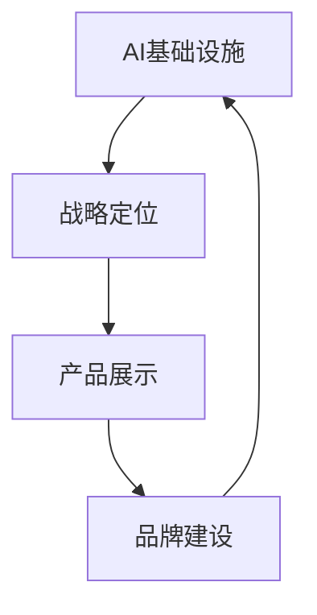

                 

# 讲好AI infra故事：贾扬清的策略，产品展示与品牌建设

在人工智能领域，贾扬清博士无疑是一位有着深刻影响力的重要人物。他不仅在深度学习理论和实践方面有着广泛而深入的研究，还成功创办了深传科技（Megvii），引领了人工智能在图像识别、视频分析等领域的实际应用。他的成功，不仅仅在于技术的突破，还在于如何将AI基础设施（AI infra）的故事讲得生动、深入、具有高度的吸引力和说服力。本文将从贾扬清的AI infra策略、产品展示和品牌建设三个方面，探讨他在这一领域的独到见解与实践。

## 1. 背景介绍

### 1.1 背景概述

随着人工智能技术的快速发展，AI基础设施（AI infra）的重要性日益凸显。AI infra包括硬件设施、软件框架、数据集、模型训练与优化工具等，是支撑AI应用开发与部署的关键基础。然而，构建和维护AI infra并非易事，它需要广泛的知识、深厚的技术储备以及细致的管理策略。

### 1.2 核心问题

贾扬清博士在创办深传科技后，面临的第一个问题是如何构建一个既符合实际需求，又具有高度可扩展性的AI infra，以支撑公司的长期发展。在科技创业初期，他不仅要平衡技术和商业化的关系，还要确定符合公司战略和市场需求的AI infra方案。

## 2. 核心概念与联系

### 2.1 核心概念概述

为了更好地理解贾扬清的AI infra策略，我们需要明确几个核心概念：

- **AI基础设施（AI infra）**：指支撑AI应用开发与部署的各种硬件、软件和数据的集合，包括计算资源、深度学习框架、模型库、数据集、训练与优化工具等。
- **战略定位**：确定AI infra的长期发展方向和目标，明确公司需要提供哪些基础设施，以及这些基础设施如何支持公司的战略目标。
- **产品展示**：通过实际应用案例展示AI infra的价值和功能，吸引更多开发者和用户。
- **品牌建设**：塑造AI infra的品牌形象，增强市场竞争力和用户信任度。

### 2.2 核心概念联系

贾扬清的AI infra策略紧密联系着产品展示和品牌建设。战略定位决定了AI infra的方向和重点，产品展示则让市场和用户直观感受到AI infra的价值，而品牌建设则通过情感连接和价值传递，增强用户的认同感和忠诚度。三者相互作用，共同推动AI infra的发展和应用。

### 2.3 Mermaid 流程图

以下是一个简单的Mermaid流程图，展示了AI infra策略、产品展示和品牌建设之间的联系：



## 3. 核心算法原理 & 具体操作步骤

### 3.1 算法原理概述

贾扬清的AI infra策略主要基于以下几个核心算法原理：

- **模块化与组件化设计**：将AI infra分解为多个独立的模块和组件，每个模块承担特定的功能，便于维护和升级。
- **集中与分散平衡**：在集中管理和分散部署之间找到平衡，既确保统一管理，又支持灵活部署。
- **模型优化与数据增强**：通过模型优化和数据增强技术，提高模型训练效率和性能。

### 3.2 算法步骤详解

1. **战略定位**：
   - 分析市场需求和公司资源，确定AI infra的战略目标。
   - 确定核心功能和扩展方向。

2. **模块化设计**：
   - 将AI infra分解为多个功能模块，每个模块负责特定功能。
   - 设计模块间的接口和数据交换标准，确保系统可扩展性和互操作性。

3. **集中管理与分散部署**：
   - 在中央服务器上集中管理AI infra的配置和状态。
   - 将AI infra的运行环境分散部署在多个节点上，支持不同规模的计算需求。

4. **模型优化与数据增强**：
   - 利用自动混合精度、模型剪枝等技术优化模型性能。
   - 通过数据增强技术提高数据的多样性和质量。

### 3.3 算法优缺点

- **优点**：
  - 模块化设计提高了系统的灵活性和可扩展性，便于快速响应市场变化。
  - 集中管理与分散部署平衡了集中控制与灵活性的需求，提高了系统的稳定性和可维护性。
  - 模型优化与数据增强提高了模型训练效率和性能。

- **缺点**：
  - 模块化设计可能增加系统的复杂度，管理成本较高。
  - 集中管理可能限制了部分模块的灵活部署。

### 3.4 算法应用领域

贾扬清的AI infra策略广泛应用于图像识别、视频分析、自然语言处理等领域，具体应用如下：

- **图像识别**：利用AI infra提供的高效图像处理能力和丰富的模型库，支持人脸识别、物体检测、场景分析等应用。
- **视频分析**：结合视频处理和深度学习技术，实现视频内容理解、行为识别、情感分析等。
- **自然语言处理**：提供自然语言理解、对话系统、文本摘要等功能，支持智能客服、内容推荐、智能写作等应用。

## 4. 数学模型和公式 & 详细讲解 & 举例说明

### 4.1 数学模型构建

贾扬清的AI infra策略涉及多个数学模型，其中最为关键的模型是深度学习模型。深度学习模型通常由多个层组成，包括卷积层、池化层、全连接层等。

以图像识别为例，模型的输入为图像像素，输出为类别概率。模型通常使用交叉熵损失函数，通过前向传播和反向传播更新模型参数。

### 4.2 公式推导过程

交叉熵损失函数可以表示为：

$$
L = -\frac{1}{N}\sum_{i=1}^N \sum_{j=1}^C y_j \log(p_j)
$$

其中 $N$ 是样本数量，$C$ 是类别数，$y_j$ 是真实标签，$p_j$ 是模型预测的概率。

### 4.3 案例分析与讲解

以人脸识别为例，我们可以使用深度学习模型进行训练。模型输入是人脸图像，输出是每个人脸对应的标签。训练过程如下：

1. 数据准备：收集大量人脸图像和对应的标签。
2. 模型选择：选择适合的深度学习模型，如卷积神经网络（CNN）。
3. 训练过程：使用交叉熵损失函数和随机梯度下降（SGD）优化算法进行模型训练。
4. 测试验证：在测试集上评估模型性能，调整模型参数以提高识别准确率。

## 5. 项目实践：代码实例和详细解释说明

### 5.1 开发环境搭建

1. **选择编程语言和框架**：
   - 选择Python作为主要编程语言，使用TensorFlow或PyTorch深度学习框架。

2. **配置开发环境**：
   - 安装所需的库和工具，如Numpy、Scikit-learn、Jupyter Notebook等。
   - 配置GPU环境，确保能够进行高效的模型训练和推理。

### 5.2 源代码详细实现

以人脸识别为例，以下是使用TensorFlow进行模型训练的代码实现：

```python
import tensorflow as tf
from tensorflow.keras import layers, models

# 构建模型
model = models.Sequential([
    layers.Conv2D(32, (3, 3), activation='relu', input_shape=(64, 64, 3)),
    layers.MaxPooling2D((2, 2)),
    layers.Conv2D(64, (3, 3), activation='relu'),
    layers.MaxPooling2D((2, 2)),
    layers.Flatten(),
    layers.Dense(128, activation='relu'),
    layers.Dense(1, activation='sigmoid')
])

# 编译模型
model.compile(optimizer='adam', loss='binary_crossentropy', metrics=['accuracy'])

# 训练模型
model.fit(x_train, y_train, epochs=10, batch_size=32, validation_data=(x_val, y_val))
```

### 5.3 代码解读与分析

- **数据预处理**：通过调整输入图像的大小和颜色通道数，使模型能够处理标准化的数据。
- **模型构建**：使用卷积层、池化层、全连接层等构建深度学习模型。
- **模型训练**：使用Adam优化算法和二元交叉熵损失函数进行模型训练。
- **模型评估**：在验证集上评估模型性能，优化模型参数以提高识别准确率。

### 5.4 运行结果展示

训练完成后，可以通过测试集评估模型的性能。以下是使用测试集评估模型的代码：

```python
test_loss, test_acc = model.evaluate(x_test, y_test, verbose=2)
print(f'Test accuracy: {test_acc}')
```

## 6. 实际应用场景

### 6.1 智能安防系统

智能安防系统可以集成人脸识别、行为分析等功能，保障公共安全。深传科技的人脸识别技术已经广泛应用于全球多个城市的安防监控系统中，提高了安全防护的效率和准确性。

### 6.2 电商推荐系统

电商推荐系统通过分析用户的购买历史和浏览行为，利用AI infra提供的人脸识别、行为识别技术，提升推荐算法的效果。深传科技的推荐系统已经为多个电商平台提供了强大的技术支持，显著提高了用户体验和满意度。

### 6.3 视频内容审核

视频内容审核系统通过分析视频中的行为和情感，识别出潜在的违法违规内容，保护用户免受有害信息的影响。深传科技的视频分析技术已经广泛应用于社交媒体、在线视频平台等领域，提高了内容监管的效率和准确性。

### 6.4 未来应用展望

随着AI infra技术的不断进步，未来将会有更多创新应用涌现。以下是一些可能的未来应用：

- **智能驾驶**：利用AI infra进行图像处理和行为识别，提高自动驾驶的安全性和可靠性。
- **智能家居**：结合AI infra提供的人脸识别、语音识别等技术，实现智能家居设备的联动和自动化控制。
- **医疗健康**：利用AI infra进行疾病诊断、健康监测等，提高医疗服务的智能化水平。

## 7. 工具和资源推荐

### 7.1 学习资源推荐

1. **《深度学习》课程**：由斯坦福大学开设的深度学习课程，讲解了深度学习的基础理论和实际应用。
2. **《TensorFlow官方文档》**：详细介绍了TensorFlow的使用方法、性能优化技巧等。
3. **《自然语言处理》课程**：由Coursera提供的自然语言处理课程，讲解了自然语言处理的基本概念和实际应用。
4. **《机器学习实战》书籍**：介绍了机器学习的基本理论和实际应用，涵盖深度学习、自然语言处理等多个领域。
5. **《Python深度学习》书籍**：讲解了使用Python进行深度学习的全过程，包括数据预处理、模型训练、模型优化等。

### 7.2 开发工具推荐

1. **Jupyter Notebook**：用于编写和执行Python代码，支持数据可视化、交互式计算等。
2. **TensorFlow**：开源深度学习框架，支持分布式计算和模型优化。
3. **PyTorch**：另一个流行的深度学习框架，支持动态图和静态图计算。
4. **Keras**：高级深度学习框架，简单易用，支持多种深度学习模型。

### 7.3 相关论文推荐

1. **《ImageNet Classification with Deep Convolutional Neural Networks》**：深度学习领域的经典论文，介绍了使用CNN进行图像分类的基本方法。
2. **《Natural Language Processing (almost) for Free with Google Cloud》**：讲解了如何使用Google Cloud进行自然语言处理的实践指南。
3. **《YAGO: A Core of Semantic Knowledge》**：介绍了YAGO知识图谱的应用，探讨了如何结合知识图谱进行深度学习模型的训练。

## 8. 总结：未来发展趋势与挑战

### 8.1 总结

贾扬清博士的AI infra策略在理论和实践上都取得了显著的成果。他的策略不仅推动了公司的发展，也为AI基础设施的建设提供了宝贵的经验和参考。未来，AI infra将更加智能、高效、灵活，为各行各业提供强大的技术支撑。

### 8.2 未来发展趋势

1. **AI infra的智能化**：未来的AI infra将具备更高的智能化水平，能够进行自主学习、自适应优化，提高系统的灵活性和适应性。
2. **跨平台集成**：未来的AI infra将支持跨平台、跨系统集成，实现无缝对接和协同工作。
3. **边缘计算与雾计算**：将AI infra部署在边缘计算和雾计算环境中，提高数据处理和模型推理的效率和实时性。

### 8.3 面临的挑战

1. **资源管理**：如何高效管理计算资源、存储资源等，是未来AI infra面临的主要挑战之一。
2. **模型可解释性**：AI infra中的深度学习模型往往被视为"黑盒"系统，如何提高模型的可解释性，增强用户信任度，是未来需要解决的重要问题。
3. **安全与隐私保护**：AI infra中的数据和模型可能包含敏感信息，如何确保数据安全和隐私保护，是未来需要重点关注的方向。

### 8.4 研究展望

未来，AI infra的研究将更加注重以下几个方面：

1. **自动化和自适应**：提高AI infra的自动化和自适应能力，实现自主学习、自优化。
2. **跨领域融合**：将AI infra与物联网、大数据、区块链等技术融合，形成更加全面、高效的基础设施。
3. **人机协同**：推动AI infra与人类智慧的协同发展，实现人机交互的自然化、智能化。

## 9. 附录：常见问题与解答

**Q1: AI infra中的数据管理有哪些关键技术？**

A: AI infra中的数据管理主要涉及数据采集、存储、清洗、标注等关键技术。数据清洗和标注是保证模型训练质量的重要环节，需采用自动标注、半监督学习等技术进行优化。

**Q2: 如何确保AI infra中的模型训练和推理的高效性？**

A: 通过使用自动混合精度、模型剪枝、量化等技术，可以提高模型训练和推理的效率。同时，优化计算图和算法，减少资源消耗，实现高效部署。

**Q3: 在实际应用中，AI infra的部署和维护需要注意哪些问题？**

A: 在部署AI infra时，需考虑模型的负载均衡、资源管理、系统监控等问题。在维护过程中，需定期更新模型和数据，进行性能优化，确保系统稳定运行。

**Q4: 如何评估AI infra的性能和效果？**

A: 使用准确率、召回率、F1值等指标评估AI infra在特定任务上的性能。同时，结合用户反馈和业务需求，进行全面的效果评估。

---

作者：禅与计算机程序设计艺术 / Zen and the Art of Computer Programming

