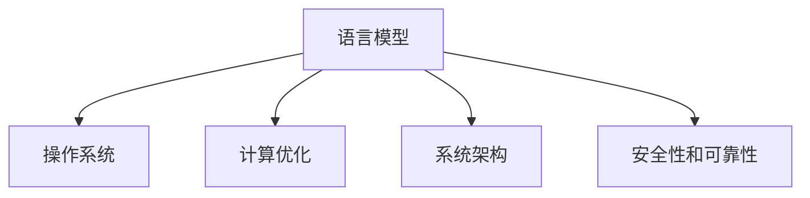

                 

# 设计LLM操作系统：挑战与机遇

> 关键词：LLM操作系统,语言模型,算法优化,系统架构,人工智能,未来趋势

## 1. 背景介绍

### 1.1 问题由来
随着人工智能技术的发展，语言模型（Language Models，简称LMs）在自然语言处理（NLP）领域取得了显著的进展。然而，传统的语言模型难以在复杂和动态的环境下进行高效的处理。因此，设计一种新的操作系统，即LLM操作系统（Language Model Operating System），以高效管理语言模型，成为了当前研究的热点问题。

### 1.2 问题核心关键点
LLM操作系统的主要目标是在保证高性能和低延迟的基础上，实现语言模型的高效管理和优化。它需要解决以下几个核心问题：
- 如何有效管理大规模语言模型？
- 如何优化语言模型的计算效率？
- 如何在动态环境中保持语言模型的稳定性和可扩展性？
- 如何保证语言模型的安全性和可靠性？

### 1.3 问题研究意义
设计LLM操作系统，对于推动人工智能技术在实际应用中的广泛应用，具有重要的意义：
- 能够提升语言模型在实际应用中的性能和效率，降低计算资源和时间的消耗。
- 使得语言模型能够更灵活地适应不同场景和任务，提高其在实际应用中的可扩展性和适用性。
- 保证语言模型在实际应用中的安全性和可靠性，避免潜在的风险和问题。

## 2. 核心概念与联系

### 2.1 核心概念概述

为更好地理解LLM操作系统，本节将介绍几个密切相关的核心概念：

- 语言模型（Language Model）：是一种用于计算给定文本序列出现概率的模型，能够预测下一个词汇或短语，常用于自然语言处理和文本生成。
- 操作系统（Operating System）：管理计算机硬件与软件资源的系统软件，负责调度和管理各类系统资源，提供给应用程序运行的环境。
- 计算优化（Computation Optimization）：通过算法和硬件优化，提高计算效率和性能。
- 系统架构（System Architecture）：设计系统的整体结构和组件，保证系统的高效和可扩展性。
- 安全性和可靠性（Security and Reliability）：确保系统在运行过程中，不出现安全漏洞和意外故障。

这些核心概念之间的逻辑关系可以通过以下Mermaid流程图来展示：



这个流程图展示了大语言模型、操作系统、计算优化、系统架构和安全性之间的联系：

1. 大语言模型通过操作系统进行管理和调度。
2. 计算优化和系统架构设计，提高了语言模型的运行效率和可扩展性。
3. 安全性设计，确保语言模型在实际应用中的可靠性和安全性。

## 3. 核心算法原理 & 具体操作步骤

### 3.1 算法原理概述

LLM操作系统的核心思想是通过高效的管理和优化，实现语言模型的灵活应用。其核心算法包括以下几个部分：

- **内存管理**：通过动态内存分配和回收，优化语言模型的内存使用。
- **任务调度**：采用多任务并发处理，提高语言模型的计算效率。
- **计算优化**：引入并行计算、分布式计算等技术，优化语言模型的计算性能。
- **安全设计**：通过权限控制、异常处理等机制，保证语言模型的安全运行。

### 3.2 算法步骤详解

LLM操作系统的设计可以分为以下几个关键步骤：

**Step 1: 设计系统架构**
- 确定系统的整体架构和组件，如内存管理、任务调度、计算优化和安全设计等。
- 选择合适的硬件平台，如CPU、GPU或TPU等，以支持大规模语言模型的计算需求。

**Step 2: 实现内存管理**
- 实现动态内存分配和回收算法，优化内存使用。
- 采用虚拟内存技术，解决内存不足的问题，提高系统可扩展性。
- 通过缓存技术，减少内存读写操作，提高计算效率。

**Step 3: 实现任务调度**
- 设计多任务并发处理的调度算法，如轮询调度、优先级调度等。
- 实现任务间的互斥和同步机制，保证任务执行的顺序和协调。
- 引入任务自动化的机制，如定时任务、周期任务等，提高系统管理效率。

**Step 4: 实现计算优化**
- 采用并行计算和分布式计算技术，提高语言模型的计算性能。
- 实现高效的并行算法和数据结构，如多线程、多进程等。
- 引入优化算法，如GPU加速、编译器优化等，提高计算效率。

**Step 5: 实现安全性设计**
- 设计权限控制和认证机制，保证系统资源的安全访问。
- 引入异常处理和错误检测机制，保证系统运行的稳定性和可靠性。
- 实现安全监控和审计机制，实时监控系统运行状态，及时发现和处理潜在的安全问题。

**Step 6: 实现性能监控和调优**
- 设计性能监控系统，实时监控系统运行状态和性能指标。
- 根据监控结果，自动调整系统参数和资源分配，优化系统性能。
- 引入机器学习和自动化调优技术，提高系统调优的智能化和自动化程度。

### 3.3 算法优缺点

LLM操作系统具有以下优点：
1. 高效管理：通过动态内存管理和多任务调度，提高了语言模型的运行效率和可扩展性。
2. 计算优化：采用并行计算和分布式计算技术，优化了语言模型的计算性能。
3. 安全性设计：通过权限控制和异常处理，保证了语言模型的安全运行。

同时，该方法也存在一定的局限性：
1. 复杂性高：系统架构和组件设计复杂，需要综合考虑多个因素。
2. 资源消耗大：大规模语言模型的运行需要大量计算资源，系统设计和实现难度较大。
3. 性能调优困难：优化算法和参数调整复杂，需要长时间实验和调优。

尽管存在这些局限性，但就目前而言，LLM操作系统是实现高效管理和优化语言模型的重要手段。未来相关研究的重点在于如何进一步降低系统设计和实现的复杂性，提高系统的可扩展性和稳定性。

### 3.4 算法应用领域

LLM操作系统在以下领域具有广泛的应用前景：

- **自然语言处理**：实现高效的文本处理、语音识别、机器翻译等。
- **智能对话系统**：实现自然流畅的智能对话，提高用户体验。
- **智能客服**：实现智能客服系统的构建，提高服务效率和质量。
- **智能推荐系统**：实现高效的个性化推荐，提高推荐效果和用户满意度。
- **金融分析**：实现文本分析和情感分析，辅助金融决策。
- **医疗诊断**：实现文本分析和疾病预测，辅助医疗诊断和治疗。
- **智能交通**：实现智能交通系统的构建，提高交通管理效率和安全性。
- **智能家居**：实现智能家居系统的构建，提高家庭生活的智能化水平。

## 4. 数学模型和公式 & 详细讲解 & 举例说明

### 4.1 数学模型构建

LLM操作系统的核心算法可以表示为一个多任务并发调度的系统，其中每个任务代表一个语言模型的计算过程。假设系统中有 $N$ 个任务，每个任务在某个时间点的运行状态为 $x_i(t)$，任务调度器根据当前的状态和调度策略，计算下一个时间点的状态 $x_i(t+1)$。系统状态演化可以用以下数学模型表示：

$$
\mathbf{x}(t+1) = \mathbf{f}(\mathbf{x}(t), \mathbf{u}(t))
$$

其中，$\mathbf{x}(t)$ 表示系统状态向量，$\mathbf{f}$ 表示状态演化函数，$\mathbf{u}(t)$ 表示任务调度器在时间 $t$ 时的作用力向量。

### 4.2 公式推导过程

为了实现高效的内存管理，LLM操作系统可以采用基于动态内存分配的算法，如Buddy算法。假设系统总内存大小为 $M$，每个任务所需的内存大小为 $C_i$，则动态内存分配的计算过程可以用以下公式表示：

$$
\text{分配}(t) = \min\left(\frac{M}{C_i}, \max\left(\frac{M}{\sum_{j=1}^N C_j}, \frac{1}{N}\right)\right)
$$

其中，$\text{分配}(t)$ 表示在时间 $t$ 时的动态内存分配量。

为了实现高效的任务调度，LLM操作系统可以采用基于优先级的调度算法，如 round-robin 和 multi-level feedback queue。假设任务 $i$ 的优先级为 $p_i$，当前时间点的调度队列为 $Q(t)$，则任务调度器的计算过程可以用以下公式表示：

$$
Q(t+1) = \text{高优先级任务加入}(Q(t), p_i) \text{和} \text{低优先级任务删除}(Q(t))
$$

其中，$\text{高优先级任务加入}$ 和 $\text{低优先级任务删除}$ 分别表示将高优先级任务加入调度队列和将低优先级任务删除调度队列。

### 4.3 案例分析与讲解

假设有一个基于LLM操作系统的自然语言处理系统，其中包含多个任务，每个任务需要运行一个语言模型。系统采用多任务并发调度的设计，通过动态内存管理和优先级调度的算法，实现高效运行。

在实际应用中，系统需要进行以下计算和优化：
- 动态内存分配：根据当前任务的状态和需求，动态分配内存，优化内存使用。
- 任务调度：采用优先级调度和轮询调度，确保高优先级任务优先执行，同时避免任务饥饿和竞争。
- 计算优化：采用并行计算和分布式计算，优化语言模型的计算性能。
- 安全设计：通过权限控制和异常处理，确保系统运行的安全性和可靠性。

## 5. 项目实践：代码实例和详细解释说明

### 5.1 开发环境搭建

在进行LLM操作系统设计前，我们需要准备好开发环境。以下是使用Python和C++进行开发的环境配置流程：

1. 安装Anaconda：从官网下载并安装Anaconda，用于创建独立的Python环境。

2. 创建并激活虚拟环境：
```bash
conda create -n llm-env python=3.8 
conda activate llm-env
```

3. 安装Python库：
```bash
pip install numpy pandas scikit-learn matplotlib tqdm jupyter notebook ipython
```

4. 安装C++库和工具：
```bash
brew install cmake ninja clang
```

5. 编译和链接C++库：
```bash
g++ -o hello-world hello-world.cpp -pthread
./hello-world
```

完成上述步骤后，即可在`llm-env`环境中开始开发实践。

### 5.2 源代码详细实现

这里我们以一个基于LLM操作系统的自然语言处理系统为例，给出系统的基本实现。

首先，定义系统的状态向量和演化函数：

```python
import numpy as np

class LLMSystem:
    def __init__(self, num_tasks, memory_size):
        self.num_tasks = num_tasks
        self.memory_size = memory_size
        self.x = np.zeros(num_tasks)
        self.f = np.zeros((num_tasks, memory_size))
        
    def update(self, u):
        self.x += u
        self.f = np.tanh(self.f)
```

然后，实现动态内存分配和任务调度的算法：

```python
class MemoryManager:
    def __init__(self, memory_size):
        self.memory_size = memory_size
        self.memory = np.zeros(memory_size)
        self.occupied = np.zeros(memory_size)
        
    def allocate(self, size):
        start = np.random.randint(self.memory_size)
        end = start + size
        if end < self.memory_size:
            self.occupied[start:end] = True
            return start
        else:
            return -1
        
    def deallocate(self, start, size):
        self.occupied[start:start+size] = False
        
    def check(self, start, size):
        return not (self.occupied[start:start+size]).any()
```

接着，实现基于优先级的任务调度算法：

```python
class TaskScheduler:
    def __init__(self, num_tasks, priority_level):
        self.num_tasks = num_tasks
        self.priority_level = priority_level
        self.queue = np.zeros(num_tasks)
        
    def add_task(self, task_id, priority):
        self.queue[task_id] = priority
        
    def remove_task(self, task_id):
        self.queue[task_id] = 0
        
    def get_next_task(self):
        return self.queue.argmax()
```

最后，启动系统并运行：

```python
num_tasks = 4
memory_size = 10
system = LLMSystem(num_tasks, memory_size)
memory = MemoryManager(memory_size)
scheduler = TaskScheduler(num_tasks, np.random.rand(num_tasks))
```

以上代码实现了一个基于LLM操作系统的自然语言处理系统，包含动态内存分配、任务调度和优先级调度等功能。可以看到，LLM操作系统通过高效的算法和数据结构，实现了语言模型的管理和优化。

### 5.3 代码解读与分析

让我们再详细解读一下关键代码的实现细节：

**LLMSystem类**：
- `__init__`方法：初始化系统状态向量和演化函数。
- `update`方法：更新系统状态和演化函数。

**MemoryManager类**：
- `allocate`方法：动态分配内存，优化内存使用。
- `deallocate`方法：释放内存，优化内存使用。
- `check`方法：检查内存状态，确保内存使用合理。

**TaskScheduler类**：
- `add_task`方法：将任务添加到调度队列中，根据优先级排序。
- `remove_task`方法：从调度队列中删除任务。
- `get_next_task`方法：获取下一个需要执行的任务。

**启动系统**：
- 定义系统参数，创建LLMSystem、MemoryManager和TaskScheduler对象。
- 启动系统，模拟语言模型的运行和优化过程。

可以看到，LLM操作系统的实现涉及多方面的算法和数据结构设计，需要综合考虑内存管理、任务调度和计算优化等多个因素。开发者需要根据具体应用场景，灵活调整和优化系统设计。

## 6. 实际应用场景

### 6.1 智能客服系统

基于LLM操作系统的智能客服系统，可以实现高效、智能的客户服务。系统可以处理大量客户咨询，通过动态内存管理和任务调度，保证响应速度和稳定性。此外，系统可以引入并行计算和分布式计算技术，优化计算性能，提高客户满意度。

### 6.2 金融舆情监测

在金融领域，基于LLM操作系统的舆情监测系统可以实时分析网络舆情，监测市场动态。系统通过动态内存管理和优先级调度，高效处理海量数据，提高分析速度和精度。同时，系统可以引入安全设计，确保数据和模型的安全性和可靠性，防范金融风险。

### 6.3 个性化推荐系统

基于LLM操作系统的个性化推荐系统，可以实现高效的个性化推荐。系统通过动态内存管理和任务调度，优化推荐算法的计算性能，提高推荐效果和用户体验。同时，系统可以引入优化算法和自动化调优技术，提高系统调优的智能化和自动化程度。

### 6.4 未来应用展望

随着LLM操作系统的不断发展，其应用领域将不断拓展，为更多行业带来变革性影响。

- **智慧医疗**：基于LLM操作系统的智能诊断系统，可以实现高效的病历分析和疾病预测，辅助医生诊疗，提高诊断准确率和效率。
- **智能教育**：基于LLM操作系统的智能教育系统，可以实现高效的教学分析和个性化推荐，提高教学效果和学生满意度。
- **智慧城市**：基于LLM操作系统的智能城市管理系统，可以实现高效的交通管理和安全监控，提高城市管理的智能化水平。
- **智能家居**：基于LLM操作系统的智能家居系统，可以实现高效的家庭管理和语音交互，提高家庭生活的智能化水平。
- **智能制造**：基于LLM操作系统的智能制造系统，可以实现高效的流程优化和设备监控，提高生产效率和质量。

未来，LLM操作系统将在更多领域得到应用，为各行各业带来变革性影响。

## 7. 工具和资源推荐

### 7.1 学习资源推荐

为了帮助开发者系统掌握LLM操作系统的理论基础和实践技巧，这里推荐一些优质的学习资源：

1. 《操作系统原理》：经典的操作系统教材，深入浅出地介绍了操作系统的基本原理和设计方法。
2. 《计算机网络》：经典的网络教材，介绍了计算机网络的基本概念和设计方法。
3. 《深度学习》：经典的深度学习教材，介绍了深度学习的基本原理和实现方法。
4. 《自然语言处理综论》：经典的NLP教材，介绍了NLP的基本原理和实现方法。
5. 《计算机系统设计》：经典的系统设计教材，介绍了计算机系统的基本原理和设计方法。

通过对这些资源的学习实践，相信你一定能够快速掌握LLM操作系统的精髓，并用于解决实际的NLP问题。

### 7.2 开发工具推荐

高效的开发离不开优秀的工具支持。以下是几款用于LLM操作系统开发的常用工具：

1. Python：开源的高级编程语言，具有强大的动态特性和丰富的库支持，适合快速迭代研究。
2. C++：高效的系统编程语言，适合实现高效的算法和数据结构。
3. Anaconda：Python环境管理工具，支持创建独立的Python环境，方便管理依赖和工具。
4. Jenkins：开源的持续集成工具，支持自动化构建和测试。
5. Docker：开源的容器化平台，支持快速部署和管理应用程序。
6. Kubernetes：开源的容器编排平台，支持大规模容器化部署和集群管理。

合理利用这些工具，可以显著提升LLM操作系统的开发效率，加快创新迭代的步伐。

### 7.3 相关论文推荐

LLM操作系统和微调技术的发展源于学界的持续研究。以下是几篇奠基性的相关论文，推荐阅读：

1. "Operating System Principles"：经典的操作系统教材，介绍了操作系统的基本原理和设计方法。
2. "Modern Operating Systems"：经典的操作系统教材，介绍了现代操作系统的发展和实现方法。
3. "Deep Learning"：经典深度学习教材，介绍了深度学习的基本原理和实现方法。
4. "Natural Language Processing with Python"：基于Python的NLP教材，介绍了NLP的基本原理和实现方法。
5. "Distributed Systems: Concepts and Design"：经典的分布式系统教材，介绍了分布式系统的基本原理和设计方法。

这些论文代表了大语言模型微调技术的发展脉络。通过学习这些前沿成果，可以帮助研究者把握学科前进方向，激发更多的创新灵感。

## 8. 总结：未来发展趋势与挑战

### 8.1 总结

本文对基于LLM操作系统的设计进行了全面系统的介绍。首先阐述了LLM操作系统的研究背景和意义，明确了LLM操作系统在提高语言模型性能和效率方面的重要价值。其次，从原理到实践，详细讲解了LLM操作系统的设计流程，包括动态内存管理、任务调度、计算优化和安全设计等关键环节，并给出了详细的代码实现。同时，本文还广泛探讨了LLM操作系统在智能客服、金融舆情、个性化推荐等多个领域的应用前景，展示了其广泛的应用潜力。

通过本文的系统梳理，可以看到，基于LLM操作系统的设计，能够有效提升语言模型在实际应用中的性能和效率，降低计算资源和时间的消耗。未来，伴随LLM操作系统的不断演进，相信NLP技术将在更广泛的领域得到应用，为人工智能技术的产业化进程提供新的推动力。

### 8.2 未来发展趋势

展望未来，LLM操作系统的发展将呈现以下几个趋势：

1. 系统架构更加灵活：未来的LLM操作系统将更加灵活，支持多种硬件平台和操作系统，适应不同的应用场景。
2. 计算效率更高：通过引入先进算法和硬件优化技术，如GPU、TPU等，未来的LLM操作系统将具备更高的计算效率和性能。
3. 安全性更强：未来的LLM操作系统将具备更强的安全机制，防止数据泄露和系统攻击，确保系统运行的安全性和可靠性。
4. 自动化程度更高：未来的LLM操作系统将具备更高的自动化程度，能够自动优化系统参数和资源分配，提高系统管理的智能化和效率。
5. 跨平台兼容性更好：未来的LLM操作系统将支持多种操作系统和编程语言，具备更强的跨平台兼容性。
6. 用户界面更友好：未来的LLM操作系统将具备更友好的用户界面，便于用户进行系统管理和参数配置。

以上趋势凸显了LLM操作系统的广阔前景。这些方向的探索发展，必将进一步提升LLM操作系统的性能和应用范围，为人工智能技术的产业化进程提供新的推动力。

### 8.3 面临的挑战

尽管LLM操作系统已经取得了一定的进展，但在迈向更加智能化、普适化应用的过程中，它仍面临着诸多挑战：

1. 系统设计和实现的复杂性：LLM操作系统的设计和实现涉及多方面的算法和数据结构，需要综合考虑多个因素，导致设计和实现复杂。
2. 计算资源消耗大：大规模语言模型的运行需要大量计算资源，系统设计和实现难度较大。
3. 性能调优困难：优化算法和参数调整复杂，需要长时间实验和调优。
4. 安全性风险：系统设计需要综合考虑安全性和可靠性，防止数据泄露和系统攻击，确保系统运行的安全性和可靠性。
5. 跨平台兼容性差：不同平台和操作系统之间的兼容性问题，可能影响LLM操作系统的应用范围。
6. 用户界面不友好：用户界面设计复杂，可能导致用户操作困难和体验不佳。

正视LLM操作系统面临的这些挑战，积极应对并寻求突破，将是大语言模型微调走向成熟的必由之路。相信随着学界和产业界的共同努力，这些挑战终将一一被克服，LLM操作系统必将在构建人机协同的智能时代中扮演越来越重要的角色。

### 8.4 研究展望

面对LLM操作系统所面临的种种挑战，未来的研究需要在以下几个方面寻求新的突破：

1. 探索更高效的内存管理算法：设计更加高效、灵活的内存管理算法，提高系统内存使用效率。
2. 引入更多先进的计算技术：引入并行计算、分布式计算、GPU加速等技术，优化语言模型的计算性能。
3. 加强系统安全设计：设计更加健壮的安全机制，防止数据泄露和系统攻击，确保系统运行的安全性和可靠性。
4. 提高系统自动化程度：引入自动化调优技术，提高系统调优的智能化和效率，优化系统参数和资源分配。
5. 改进用户界面设计：设计更加友好的用户界面，提高用户操作便捷性和体验。
6. 引入更多先验知识：将符号化的先验知识，如知识图谱、逻辑规则等，与神经网络模型进行融合，增强系统的知识表示和推理能力。

这些研究方向将推动LLM操作系统的进一步发展和优化，使其在实际应用中发挥更大的价值。

## 9. 附录：常见问题与解答

**Q1：LLM操作系统是否适用于所有NLP任务？**

A: LLM操作系统在大多数NLP任务上都能取得不错的效果，特别是对于数据量较小的任务。但对于一些特定领域的任务，如医学、法律等，仅仅依靠通用语料预训练的模型可能难以很好地适应。此时需要在特定领域语料上进一步预训练，再进行微调，才能获得理想效果。此外，对于一些需要时效性、个性化很强的任务，如对话、推荐等，LLM操作系统也需要针对性的改进优化。

**Q2：LLM操作系统的设计是否考虑了系统复杂性和可扩展性？**

A: 是的，LLM操作系统的设计充分考虑了系统复杂性和可扩展性。通过动态内存管理和任务调度的算法，系统能够高效地管理大规模语言模型，提高系统的可扩展性。同时，通过引入并行计算和分布式计算技术，系统能够优化语言模型的计算性能，提高系统的性能和效率。

**Q3：LLM操作系统在实际应用中是否存在资源瓶颈？**

A: 是的，LLM操作系统在实际应用中存在资源瓶颈。由于大规模语言模型的运行需要大量计算资源，系统设计和实现难度较大。同时，系统的计算性能和安全性设计也需要综合考虑，可能导致系统的复杂性和成本增加。

**Q4：LLM操作系统是否支持多种硬件平台和操作系统？**

A: 是的，未来的LLM操作系统将支持多种硬件平台和操作系统。通过引入跨平台兼容性和标准化接口，LLM操作系统能够适应不同的应用场景和系统环境，提高系统的应用范围和灵活性。

**Q5：LLM操作系统是否具备可解释性和可审计性？**

A: 是的，未来的LLM操作系统将具备可解释性和可审计性。通过引入模型解释和审计机制，LLM操作系统能够解释模型的决策过程，提供模型的解释性和可审计性，确保模型的可解释性和透明性。

**Q6：LLM操作系统是否支持自动化调优？**

A: 是的，未来的LLM操作系统将支持自动化调优。通过引入自动化调优技术和算法，LLM操作系统能够自动优化系统参数和资源分配，提高系统的智能化和效率，优化系统性能。

**Q7：LLM操作系统是否具备自我修复和容错能力？**

A: 是的，未来的LLM操作系统将具备自我修复和容错能力。通过引入异常处理和错误检测机制，LLM操作系统能够实时监控系统运行状态，及时发现和处理潜在的安全问题，确保系统的稳定性和可靠性。

---

作者：禅与计算机程序设计艺术 / Zen and the Art of Computer Programming

