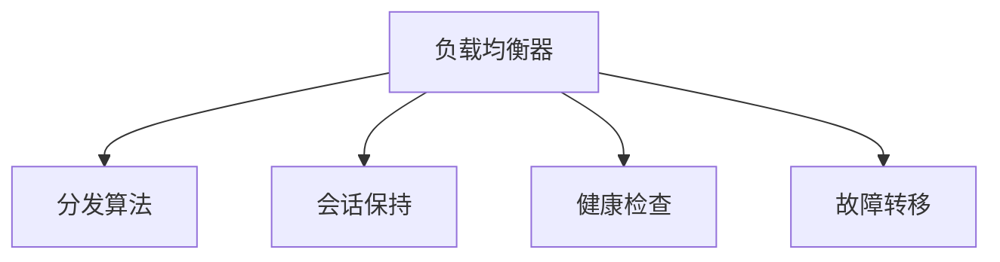

                 

# 负载均衡技术：从硬件到软件解决方案

## 1. 背景介绍

### 1.1 问题由来

随着互联网应用的不断发展，尤其是Web应用、云服务、大数据等领域的迅速崛起，对于数据中心和服务器集群的要求也在不断提升。高并发、大流量、高可用性成为网络服务的关键需求，而负载均衡作为支撑这些需求的基石技术，自然成为了关注的焦点。

所谓负载均衡（Load Balancing, LB），指的是将来自客户端的请求均匀分配到多个服务器上，从而提高系统的整体吞吐量和可用性。负载均衡技术经历了从简单的硬件转发到复杂的软件调度和算法优化，不断演进和发展。本文将从硬件和软件两个角度，深入探讨负载均衡技术的核心原理、实现机制以及未来发展趋势。

### 1.2 问题核心关键点

负载均衡技术的关键在于如何高效、稳定地分发请求，避免单点故障，实现系统的负载均衡和容错。其核心技术点包括：

1. **分发算法（Distribution Algorithm）**：如何根据请求特征（如IP地址、URL、会话状态等）将请求合理地分配到后端服务器。
2. **流量控制（Traffic Control）**：如何根据系统负载动态调整流量分发策略，避免资源过载和瓶颈。
3. **会话保持（Session Stickiness）**：如何保证用户请求的连续性，避免因负载均衡导致的会话断开。
4. **健康检查（Health Check）**：如何检测后端服务器的健康状态，自动将故障服务器移除出负载均衡系统。
5. **故障转移（Fault Tolerance）**：如何在故障发生时，快速将请求导向健康的后端服务器，保障服务连续性。

这些技术点共同构成了负载均衡系统的核心，其性能和可靠性直接影响到整体系统的稳定性和用户体验。

## 2. 核心概念与联系

### 2.1 核心概念概述

为了更好地理解负载均衡技术的原理和架构，本节将介绍几个密切相关的核心概念：

- **负载均衡器（Load Balancer）**：负载均衡器是实现负载均衡的核心组件，通常部署在网络入口或服务器集群中间，负责分发请求到后端服务器。
- **分发算法（Distribution Algorithm）**：负载均衡器根据一定的算法将请求分配到后端服务器，常用的算法包括轮询、随机、哈希、最小连接数等。
- **会话保持（Session Stickiness）**：为了保证用户体验的连续性，负载均衡器需要对同一用户的请求进行粘性处理，确保请求始终被分配到同一个后端服务器。
- **健康检查（Health Check）**：负载均衡器周期性地检查后端服务器的健康状态，避免因服务器故障导致的请求响应延迟或错误。
- **故障转移（Fault Tolerance）**：负载均衡器能够自动检测并隔离故障服务器，保证请求可以被重新路由到健康的服务器上。

这些核心概念之间的逻辑关系可以通过以下Mermaid流程图来展示：



这个流程图展示了大语言模型的核心概念及其之间的关系：

1. 负载均衡器根据分发算法将请求分配到后端服务器。
2. 会话保持技术确保同一用户请求始终被分配到同一服务器。
3. 健康检查机制定期检测服务器状态，保障系统可靠。
4. 故障转移技术在服务器故障时，快速切换到健康服务器，保持系统连续性。

## 3. 核心算法原理 & 具体操作步骤

### 3.1 算法原理概述

负载均衡算法的核心思想是通过一定的策略，将请求均匀分配到后端服务器上。常用的算法包括：

- **轮询（Round Robin）**：将请求按照顺序依次分配到后端服务器上，简单高效，适用于服务器负载均衡。
- **随机（Random）**：随机选择一个后端服务器处理请求，避免请求分布不均，但不够稳定。
- **哈希（Hash）**：根据请求特征（如IP、URL等）计算哈希值，将请求分配到对应的服务器，适用于特定请求的粘性处理。
- **最小连接数（Least Connections）**：将请求分配到当前连接数最少的服务器上，避免过载。

### 3.2 算法步骤详解

负载均衡算法的详细步骤通常包括：

1. **接收请求**：负载均衡器从客户端接收请求。
2. **计算负载**：根据请求特征（如IP地址、URL等）计算负载均衡器的负载。
3. **选择服务器**：根据分发算法选择目标服务器。
4. **转发请求**：将请求转发到选定的后端服务器。
5. **返回响应**：接收后端服务器的响应，返回给客户端。
6. **健康检查**：定期检查目标服务器的健康状态，确保其可用性。
7. **故障转移**：在服务器故障时，重新选择健康服务器，继续处理请求。

### 3.3 算法优缺点

负载均衡算法具有以下优点：

- **简单易行**：实现原理简单，易于部署和维护。
- **扩展性强**：可以轻松扩展到多个后端服务器，提高系统的整体容量。
- **性能可靠**：合理的算法选择和参数设置，可以有效避免负载均衡器成为系统瓶颈。

同时，该算法也存在以下局限性：

- **不够智能**：基于规则的算法无法动态调整，可能无法应对突发的流量波动。
- **资源消耗**：负载均衡器本身需要消耗一定的计算资源，处理大量的请求信息。
- **故障敏感**：负载均衡器一旦出现故障，可能会影响整个系统的可用性。

### 3.4 算法应用领域

负载均衡技术广泛应用于多个领域，如Web应用、云服务、大数据、网络存储、电子商务等。其典型应用场景包括：

- **Web应用负载均衡**：为Web服务器集群提供请求分发，提高系统性能和可用性。
- **云服务负载均衡**：为云基础设施提供请求分发，支持多云平台的弹性扩展。
- **大数据负载均衡**：为大数据集群提供请求分发，优化数据处理和存储性能。
- **网络存储负载均衡**：为存储系统提供请求分发，提升数据访问速度和可靠性。
- **电子商务负载均衡**：为电子商务平台提供请求分发，支持高并发和大流量处理。

## 4. 数学模型和公式 & 详细讲解

### 4.1 数学模型构建

负载均衡算法通常基于一定的数学模型和公式进行设计和优化。以哈希算法为例，假设请求特征为IP地址，哈希算法的数学模型可以表示为：

$$
H(IP) = \text{hash(IP)}
$$

其中，$H(\cdot)$ 表示哈希函数，$IP$ 表示请求的IP地址。

### 4.2 公式推导过程

对于轮询算法，假设后端服务器数量为 $N$，总请求数量为 $T$，则轮询算法的数学模型可以表示为：

$$
\text{Server} = \frac{T}{N} \mod N
$$

其中，$\text{Server}$ 表示请求分配的服务器编号，$N$ 表示后端服务器数量，$T$ 表示总请求数量。

### 4.3 案例分析与讲解

以Amazon的Dynamo为例，其负载均衡算法采用了随机一致性哈希算法，确保了数据的分区和一致性。具体来说，Amazon的Dynamo将请求哈希到虚拟节点上，然后通过虚拟节点将请求映射到实际节点，从而实现了数据的分区和一致性。

## 5. 项目实践：代码实例和详细解释说明

### 5.1 开发环境搭建

要进行负载均衡的开发实践，首先需要搭建好开发环境。以下是使用Linux环境进行Nginx负载均衡器搭建的示例：

1. 安装Nginx：
```bash
sudo apt-get update
sudo apt-get install nginx
```

2. 启动Nginx：
```bash
sudo systemctl start nginx
sudo systemctl enable nginx
```

3. 配置Nginx：
```nginx
server {
    listen 80;
    server_name example.com;
    location / {
        proxy_pass http://127.0.0.1:8080;
        proxy_set_header Host $host;
        proxy_set_header X-Real-IP $remote_addr;
        proxy_set_header X-Forwarded-For $proxy_add_x_forwarded_for;
    }
}
```

4. 测试Nginx：
```bash
curl http://example.com
```

### 5.2 源代码详细实现

接下来，我们将通过示例代码来实现基于Nginx的负载均衡器。首先，在Nginx的配置文件 `nginx.conf` 中添加以下内容：

```nginx
upstream backend {
    server server1:8080;
    server server2:8080;
    server server3:8080;
}

server {
    listen 80;
    server_name example.com;
    location / {
        proxy_pass http://backend;
        proxy_set_header Host $host;
        proxy_set_header X-Real-IP $remote_addr;
        proxy_set_header X-Forwarded-For $proxy_add_x_forwarded_for;
    }
}
```

然后，重新加载Nginx配置文件：

```bash
sudo systemctl reload nginx
```

### 5.3 代码解读与分析

通过上述代码，我们实现了基于Nginx的负载均衡器，主要步骤包括：

1. 配置后端服务器的地址和端口。
2. 将请求转发到后端服务器集群。
3. 设置代理头，确保请求能够正确传递到后端服务器。

Nginx作为轻量级的高性能负载均衡器，具有配置简单、性能高效的特点，广泛应用于Web应用中。

### 5.4 运行结果展示

通过访问 `http://example.com`，可以看到请求被转发到了后端服务器，并且能够正常返回响应。

## 6. 实际应用场景

### 6.1 Web应用负载均衡

在Web应用中，负载均衡器扮演着关键角色。一个典型的Web应用可能由多个Web服务器、数据库服务器、缓存服务器组成，通过负载均衡器可以将请求均匀地分配到各个服务器上，提高系统的性能和可靠性。例如，在Nginx中，可以使用upstream和server模块来实现负载均衡和服务器选择。

### 6.2 云服务负载均衡

云服务提供商通常提供负载均衡服务，如AWS的ELB、Google的GCE LB等，可以帮助用户自动管理负载均衡器的配置和故障转移。这些服务通常支持多种分发算法和会话保持策略，能够动态调整流量分发，保证系统的稳定性和高可用性。

### 6.3 大数据负载均衡

大数据集群通常由多个计算节点和存储节点组成，通过负载均衡器可以将请求均匀地分配到各个节点上，提高数据处理和存储的效率。例如，Hadoop的YARN框架支持负载均衡器的集成，可以自动调度任务到不同的计算节点上。

## 7. 工具和资源推荐

### 7.1 学习资源推荐

为了帮助开发者系统掌握负载均衡技术的理论基础和实践技巧，这里推荐一些优质的学习资源：

1. **《负载均衡技术详解》**：一本系统介绍负载均衡技术的书籍，涵盖硬件和软件负载均衡的详细讲解。
2. **《Linux服务器与网络技术》**：一本介绍Linux系统管理和网络技术的经典教材，包括Nginx负载均衡器的配置和优化。
3. **《Nginx权威指南》**：一本深入解析Nginx配置和性能优化的指南，适合Nginx负载均衡器的实践开发。
4. **《负载均衡实战》**：一本实战性强的负载均衡技术书籍，结合实际案例讲解负载均衡的配置和优化。

### 7.2 开发工具推荐

高效的开发离不开优秀的工具支持。以下是几款用于负载均衡开发的常用工具：

1. **Nginx**：轻量级的高性能Web服务器和反向代理服务器，支持基于URL的负载均衡和会话保持。
2. **HAProxy**：一款高性能的负载均衡器，支持多种分发算法和会话保持策略，适用于高并发场景。
3. **Amazon ELB**：云服务提供商AWS提供的负载均衡服务，支持自动扩展、故障转移等功能。
4. **Google Cloud LB**：云服务提供商Google提供的负载均衡服务，支持动态负载均衡和健康检查。
5. **Kubernetes**：一个开源的容器编排系统，支持自动扩展和负载均衡，适用于分布式系统的部署和管理。

### 7.3 相关论文推荐

负载均衡技术的发展源于学界的持续研究。以下是几篇奠基性的相关论文，推荐阅读：

1. **Load Balancing for Web Applications**：一篇介绍Web应用负载均衡的学术论文，详细讲解了负载均衡的算法和实现。
2. **HAProxy: The Next Generation of High-Performance Load Balancing**：HAProxy开发团队的论文，介绍HAProxy的设计思想和实现细节。
3. **Amazon Elastic Load Balancing**：亚马逊ELB开发团队的论文，介绍ELB的架构和负载均衡算法。
4. **High-Performance Load Balancing for Web Services**：一篇综述性论文，总结了负载均衡算法的分类和实现。
5. **Kubernetes: Beyond Docker**：一篇介绍Kubernetes的论文，讲解了Kubernetes的架构和负载均衡功能。

## 8. 总结：未来发展趋势与挑战

### 8.1 总结

本文对负载均衡技术的核心原理和实践方法进行了全面系统的介绍。首先阐述了负载均衡技术的研究背景和意义，明确了负载均衡在提升系统性能和可用性方面的关键作用。其次，从原理到实践，详细讲解了负载均衡算法的数学模型和实现机制，给出了负载均衡系统开发的完整代码实例。同时，本文还广泛探讨了负载均衡技术在Web应用、云服务、大数据等多个行业领域的应用前景，展示了负载均衡技术的巨大潜力。

通过本文的系统梳理，可以看到，负载均衡技术已经成为支撑高可用性、高性能网络系统的重要手段，其性能和可靠性直接影响到系统的稳定性和用户体验。未来，随着负载均衡技术的不断发展，必将进一步推动网络服务的安全、稳定和高效运行。

### 8.2 未来发展趋势

展望未来，负载均衡技术将呈现以下几个发展趋势：

1. **智能负载均衡**：未来的负载均衡技术将更加智能化，能够根据实时流量和服务器状态动态调整负载分发策略，提高系统的灵活性和自适应性。
2. **边缘计算负载均衡**：边缘计算的兴起，将使得负载均衡技术向网络边缘延伸，降低时延，提升用户体验。
3. **混合负载均衡**：未来的负载均衡技术将更加多样化，结合云负载均衡和本地负载均衡，实现更高效的资源管理。
4. **分布式负载均衡**：随着数据中心和云计算的不断发展，分布式负载均衡技术将得到广泛应用，支持大规模集群的管理和调度。
5. **AI驱动的负载均衡**：引入人工智能算法，优化负载均衡策略，提高系统的智能度和响应速度。

以上趋势凸显了负载均衡技术的广阔前景。这些方向的探索发展，必将进一步提升网络系统的性能和可靠性，为数字经济的发展提供更坚实的技术支撑。

### 8.3 面临的挑战

尽管负载均衡技术已经取得了显著成果，但在迈向更加智能化、普适化应用的过程中，仍面临诸多挑战：

1. **性能瓶颈**：负载均衡器本身也需要高效的计算和存储资源，如何在保持高性能的同时，降低资源消耗，是一个重要问题。
2. **故障处理**：负载均衡器作为系统的重要组件，一旦出现故障，将影响整个系统的可用性，如何保证高可用性和容错性，是关键的挑战。
3. **配置复杂性**：负载均衡器的配置和优化需要一定的技术储备，如何降低配置复杂性，使得普通开发者也能够快速上手，是一个亟待解决的问题。
4. **安全性和隐私**：负载均衡器需要处理大量敏感数据，如何保护数据安全和隐私，也是一个重要课题。

### 8.4 研究展望

面对负载均衡技术面临的种种挑战，未来的研究需要在以下几个方面寻求新的突破：

1. **混合负载均衡算法**：结合多种负载均衡算法，设计更智能、更高效的负载分发策略。
2. **分布式负载均衡架构**：设计分布式负载均衡架构，支持大规模集群的管理和调度。
3. **AI驱动的负载均衡**：引入AI算法，优化负载均衡策略，提高系统的智能度和响应速度。
4. **边缘计算负载均衡**：引入边缘计算技术，降低时延，提升用户体验。
5. **安全性和隐私保护**：引入安全性和隐私保护技术，保护数据安全和隐私。

这些研究方向的探索，必将引领负载均衡技术迈向更高的台阶，为构建安全、可靠、高效的网络系统提供更强大的技术支撑。面向未来，负载均衡技术还需要与其他人工智能技术进行更深入的融合，如云计算、大数据、人工智能等，多路径协同发力，共同推动网络系统的进步。只有勇于创新、敢于突破，才能不断拓展负载均衡技术的边界，让网络技术更好地服务社会。

## 9. 附录：常见问题与解答

**Q1：负载均衡器为什么需要健康检查机制？**

A: 健康检查机制是为了检测后端服务器的健康状态，避免因服务器故障导致的请求响应延迟或错误。当后端服务器出现故障时，负载均衡器可以将故障服务器移除出分发列表，从而保证系统的稳定性和高可用性。

**Q2：负载均衡器如何实现会话保持？**

A: 会话保持技术可以通过设置cookie、使用粘性哈希算法等方式实现。当负载均衡器收到同一用户的请求时，将请求路由到之前处理的服务器，从而保证会话的连续性。

**Q3：负载均衡器有哪些常用的分发算法？**

A: 常用的负载均衡算法包括轮询（Round Robin）、随机（Random）、哈希（Hash）、最小连接数（Least Connections）等。轮询算法按照顺序分配请求，随机算法随机选择服务器，哈希算法根据请求特征计算哈希值分配请求，最小连接数算法选择当前连接数最少的服务器。

**Q4：负载均衡器如何处理高并发流量？**

A: 负载均衡器可以通过以下方式处理高并发流量：
1. 增加后端服务器数量，提高系统的整体容量。
2. 引入流量控制机制，根据系统负载动态调整流量分发策略。
3. 引入会话保持技术，保证同一用户的请求始终被分配到同一服务器。

**Q5：负载均衡器有哪些常用的故障处理机制？**

A: 常用的故障处理机制包括：
1. 自动重试机制，当请求超时时，重新发送请求到健康的服务器。
2. 心跳检测机制，周期性地检测后端服务器的健康状态，避免因故障导致的请求丢失。
3. 故障转移机制，当后端服务器故障时，自动将请求重新路由到健康的服务器上。

这些机制确保了负载均衡器在故障情况下的高可靠性和系统连续性。

