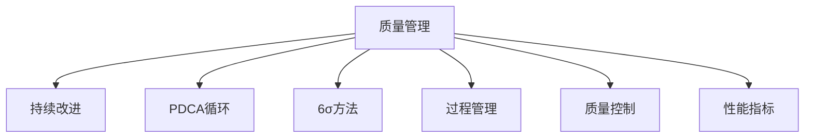

                 

# 质量管理：追求卓越的持续改进之路

> 关键词：质量管理,持续改进,6σ方法,PDCA循环,质量控制,过程优化,过程管理,性能指标

## 1. 背景介绍

### 1.1 问题由来
在信息时代，全球化竞争日益激烈，企业之间的竞争不仅仅是产品和服务的竞争，更是管理能力和文化底蕴的较量。质量管理作为一种系统化、标准化、可操作化的管理方法，能够帮助企业在激烈的市场竞争中立足，持续提升产品质量和客户满意度，从而赢得市场和客户的信任。

随着经济社会的快速发展，企业面临的环境越来越复杂多变，不确定性因素增加，如何在这样的环境下实现稳定和持续的质量管理，成为企业关注的焦点。传统的质量管理方法如ISO9000、六西格玛（Six Sigma）等方法，已经无法完全适应现代企业发展的需要。

### 1.2 问题核心关键点
当前质量管理面临的核心问题包括：

1. 质量管理工具和流程过于复杂，难以操作和落地。
2. 质量管理过程中缺乏数据驱动的决策支持，无法精准把握质量风险。
3. 质量管理与企业战略和业务流程脱节，无法形成有机的系统整体。
4. 质量管理依赖于经验丰富的专家，无法大规模推广和复制。
5. 质量管理效果缺乏客观、可衡量的绩效指标，无法进行持续改进。

### 1.3 问题研究意义
研究持续改进的质量管理方法，对于企业提升市场竞争力和客户满意度，具有重要意义：

1. 提升产品和服务质量。持续改进的质量管理方法能够帮助企业识别和消除质量缺陷，确保产品和服务符合客户期望和标准。
2. 降低成本和浪费。通过持续改进，企业能够优化流程，减少资源浪费，提升生产效率，降低运营成本。
3. 增强客户满意度。高质量的产品和服务能够提高客户满意度，促进客户忠诚度，增加市场份额。
4. 增强市场竞争力。持续改进的质量管理方法能够使企业不断提升核心竞争力，在激烈的市场竞争中保持领先地位。
5. 推动企业创新。持续改进的过程本身就是不断探索、创新的过程，能够促进企业技术进步和业务创新。

## 2. 核心概念与联系

### 2.1 核心概念概述

为更好地理解持续改进的质量管理方法，本节将介绍几个密切相关的核心概念：

- **质量管理（Quality Management）**：指通过制定和实施一系列管理制度、流程和方法，确保产品和服务达到预定质量标准的过程。
- **持续改进（Continuous Improvement）**：指在质量管理过程中，不断识别问题、分析原因、制定改进措施并实施的过程，以实现质量持续提升。
- **PDCA循环（Plan-Do-Check-Act Cycle）**：即计划-执行-检查-改进循环，是持续改进的基本方法。
- **6σ方法（Six Sigma）**：一种数据驱动的质量管理方法，旨在通过减少缺陷、提高过程能力，达到更高的质量水平。
- **过程管理（Process Management）**：强调对企业各项管理活动和业务流程的优化和管理，提高过程效率和质量。
- **质量控制（Quality Control）**：通过各种方法和手段，对产品和服务进行监督和检测，确保其符合质量标准。
- **性能指标（Performance Metrics）**：用于量化和衡量质量管理过程和结果的关键指标，如缺陷率、客户满意度、过程能力指数等。

这些核心概念之间的逻辑关系可以通过以下Mermaid流程图来展示：



这个流程图展示了几大核心概念及其之间的关系：

1. 质量管理通过制定和实施一系列方法，确保产品和服务质量。
2. 持续改进在质量管理过程中，通过PDCA循环等方法不断提升质量。
3. 6σ方法通过数据驱动，实现质量的高水平提升。
4. 过程管理优化各项管理活动和业务流程，提升过程效率和质量。
5. 质量控制对产品和服务进行监督检测，确保其符合质量标准。
6. 性能指标量化和衡量质量管理过程和结果，为持续改进提供依据。

这些概念共同构成了质量管理的核心框架，帮助企业在质量提升中不断优化和完善管理策略和方法。

## 3. 核心算法原理 & 具体操作步骤
### 3.1 算法原理概述

持续改进的质量管理方法，本质上是通过科学、系统的方法，不断识别、分析和解决问题，提升质量水平。其核心思想是：

1. **数据驱动**：通过收集、分析和利用数据，发现问题、分析原因、制定改进措施，提升质量管理决策的科学性和准确性。
2. **系统思维**：将质量管理视为一个完整的系统，通过优化各个环节，实现整体提升。
3. **持续优化**：将质量管理视为一个持续的过程，不断识别问题、分析原因、制定改进措施，形成循环改进机制。
4. **员工参与**：通过培训、激励和授权，提高员工的质量意识和技能，激发其积极性和创造力。
5. **绩效评估**：通过量化和衡量质量管理过程和结果，评估改进措施的效果，指导持续改进。

### 3.2 算法步骤详解

基于持续改进的质量管理方法，本节详细介绍其具体操作步骤：

**Step 1: 准备基础数据**
- 收集和整理与质量相关的各项数据，如缺陷率、客户满意度、过程能力指数等。
- 分析数据来源、数据完整性和数据可靠性，确保数据质量。

**Step 2: 实施PDCA循环**
- **Plan**：制定改进目标和计划，明确改进措施和时间表。
- **Do**：执行改进措施，确保改进计划的顺利实施。
- **Check**：评估改进措施的效果，进行数据对比和分析，确定改进效果。
- **Act**：根据改进结果，调整和优化改进措施，形成新的改进计划，进入下一轮PDCA循环。

**Step 3: 应用6σ方法**
- **定义（Define）**：明确问题范围和目标，制定改进计划。
- **测量（Measure）**：收集和分析数据，识别问题原因和过程关键指标。
- **分析（Analyze）**：通过数据统计和分析，确定问题根本原因，制定改进措施。
- **改进（Improve）**：实施改进措施，并持续监控改进效果。
- **控制（Control）**：固化改进成果，制定标准操作程序，防止问题再次发生。

**Step 4: 优化过程管理**
- **流程优化**：通过价值流图、过程图等工具，识别流程瓶颈和浪费，优化流程设计。
- **员工培训**：通过培训、激励和授权，提高员工质量意识和技能，激发其积极性和创造力。
- **绩效评估**：制定和实施绩效评估体系，量化和衡量质量管理过程和结果。

### 3.3 算法优缺点

持续改进的质量管理方法具有以下优点：

1. **数据驱动**：通过科学的数据分析，发现问题、分析原因、制定改进措施，提升决策科学性和准确性。
2. **系统思维**：将质量管理视为一个完整的系统，通过优化各个环节，实现整体提升。
3. **持续优化**：将质量管理视为一个持续的过程，不断识别问题、分析原因、制定改进措施，形成循环改进机制。
4. **员工参与**：通过培训、激励和授权，提高员工质量意识和技能，激发其积极性和创造力。
5. **绩效评估**：通过量化和衡量质量管理过程和结果，评估改进措施的效果，指导持续改进。

同时，该方法也存在一定的局限性：

1. **复杂度高**：实施持续改进需要大量的数据和系统的分析工具，对企业数据处理能力要求较高。
2. **成本高**：持续改进的实施和维护需要较高的成本投入，包括培训、工具采购等。
3. **实施难度大**：需要企业全体员工的积极参与和配合，对企业文化和管理水平要求较高。
4. **数据依赖性强**：质量管理效果依赖于数据的质量和完整性，数据收集和分析过程复杂且易出错。

尽管存在这些局限性，但就目前而言，持续改进的质量管理方法仍是最主流和有效的质量管理方法之一。未来相关研究的重点在于如何进一步降低持续改进的实施成本，提高数据处理的自动化和智能化水平，同时兼顾员工参与和绩效评估等关键环节。

### 3.4 算法应用领域

持续改进的质量管理方法在各个行业领域中都有广泛应用，包括但不限于：

- **制造业**：通过持续改进，提升产品质量和生产效率，降低成本。
- **医疗行业**：通过持续改进，提升医疗服务质量和患者满意度。
- **金融行业**：通过持续改进，提升风险控制能力和客户体验。
- **IT行业**：通过持续改进，提升系统性能和用户体验。
- **服务业**：通过持续改进，提升服务质量和工作效率。
- **教育行业**：通过持续改进，提升教学质量和学习效果。
- **政府部门**：通过持续改进，提升公共服务质量和效率。

这些领域中，持续改进的质量管理方法已经得到了广泛的应用，并在不断推动各行业质量管理水平的提升。

## 4. 数学模型和公式 & 详细讲解 & 举例说明
### 4.1 数学模型构建

本节将使用数学语言对持续改进的质量管理方法进行更加严格的刻画。

假设质量管理过程的输出为 $y$，过程能力指数为 $C_p$，缺陷率为 $D$，客户满意度为 $CS$。定义质量管理过程的输出与期望值 $E(y)$ 之间的偏差为 $y-E(y)$。则质量管理过程的性能指标可以定义为：

$$
Q = \frac{C_p \times (1 - D)}{CS}
$$

其中，$C_p$ 表示过程能力指数，$D$ 表示缺陷率，$CS$ 表示客户满意度。

### 4.2 公式推导过程

以下我们以过程能力指数 $C_p$ 的计算为例，推导其公式及其在质量管理中的应用。

假设过程的均值为 $\mu$，标准差为 $\sigma$，则过程能力指数 $C_p$ 可以定义为：

$$
C_p = \frac{\mu - \text{下限}}{\text{上限} - \mu}
$$

其中，下限为 $\mu - 3\sigma$，上限为 $\mu + 3\sigma$。

在质量管理过程中，通过收集和分析过程数据，可以估计出 $\mu$ 和 $\sigma$ 的参数。然后根据这些参数计算过程能力指数 $C_p$，判断过程是否满足质量要求。

### 4.3 案例分析与讲解

以一家电子产品制造企业的质量管理为例，说明如何应用持续改进的质量管理方法：

**案例背景**：
某电子产品制造企业，每年生产数百万件电子产品，然而产品缺陷率高达5%，客户满意度仅为70%。企业希望通过持续改进，提升产品质量和客户满意度。

**实施步骤**：

1. **数据收集**：收集过去一年的产品质量数据和客户满意度数据。
2. **PDCA循环**：
   - **Plan**：制定改进目标，如将缺陷率降至2%，客户满意度提升至85%。
   - **Do**：实施改进措施，如引入新的质量检测设备，优化生产流程。
   - **Check**：评估改进措施的效果，分析改进后的数据。
   - **Act**：根据评估结果，调整和优化改进措施，进入下一轮PDCA循环。

3. **6σ方法**：
   - **定义**：明确问题范围和目标，如改进生产线的过程能力。
   - **测量**：收集和分析过程数据，识别问题原因和过程关键指标。
   - **分析**：通过数据统计和分析，确定问题根本原因，制定改进措施。
   - **改进**：实施改进措施，并持续监控改进效果。
   - **控制**：固化改进成果，制定标准操作程序，防止问题再次发生。

4. **过程管理**：
   - **流程优化**：通过价值流图、过程图等工具，识别流程瓶颈和浪费，优化流程设计。
   - **员工培训**：通过培训、激励和授权，提高员工质量意识和技能，激发其积极性和创造力。
   - **绩效评估**：制定和实施绩效评估体系，量化和衡量质量管理过程和结果。

通过持续改进的质量管理方法，企业逐步将缺陷率降至2%，客户满意度提升至85%，产品品质显著提升，客户满意度大幅提升，企业市场份额增加。

## 5. 项目实践：代码实例和详细解释说明
### 5.1 开发环境搭建

在进行质量管理实践前，我们需要准备好开发环境。以下是使用Python进行质量管理开发的典型环境配置流程：

1. 安装Anaconda：从官网下载并安装Anaconda，用于创建独立的Python环境。

2. 创建并激活虚拟环境：
```bash
conda create -n quality-env python=3.8 
conda activate quality-env
```

3. 安装Python相关库：
```bash
pip install pandas numpy matplotlib scipy statsmodels
```

4. 安装数据分析工具：
```bash
pip install statsmodels
```

5. 安装质量管理工具：
```bash
pip install pyqc
```

完成上述步骤后，即可在`quality-env`环境中开始质量管理实践。

### 5.2 源代码详细实现

这里我们以统计分析为例，展示如何使用Python进行质量管理数据分析。

```python
import pandas as pd
import numpy as np
import matplotlib.pyplot as plt
from scipy.stats import probplot, shapiro

# 示例数据集
data = pd.DataFrame({
    '缺陷率': [0.05, 0.03, 0.02, 0.01, 0.03],
    '客户满意度': [0.7, 0.8, 0.85, 0.9, 0.8],
    '过程能力指数': [1.5, 1.3, 1.2, 1.1, 1.3]
})

# 绘制质量管理指标的变化趋势图
fig, ax = plt.subplots(1, 1, figsize=(10, 6))
ax.plot(data['缺陷率'], label='缺陷率')
ax.plot(data['客户满意度'], label='客户满意度')
ax.plot(data['过程能力指数'], label='过程能力指数')
ax.legend()
ax.set_xlabel('时间')
ax.set_ylabel('指标值')
plt.show()
```

以上代码展示了如何使用Python进行质量管理指标的变化趋势分析。

### 5.3 代码解读与分析

代码的关键部分如下：

**数据准备**：
- 使用Pandas库创建示例数据集，包含缺陷率、客户满意度、过程能力指数等质量管理指标。

**数据分析**：
- 使用Matplotlib库绘制质量管理指标的变化趋势图。

**代码解释**：
- 首先，使用Pandas库创建包含质量管理指标的DataFrame。
- 然后，使用Matplotlib库绘制指标的变化趋势图，并设置横纵坐标轴标签。
- 最后，展示绘制的趋势图。

**代码分析**：
- 代码简洁明了，易于理解和操作。
- 通过图表展示质量管理指标的变化趋势，直观明了，便于分析。

## 6. 实际应用场景
### 6.1 智能制造系统

智能制造系统是制造业质量管理的典型应用场景。通过应用持续改进的质量管理方法，智能制造系统可以显著提升产品质量和生产效率，降低成本。

在智能制造系统中，持续改进的质量管理方法可以通过以下几个步骤实施：

1. **数据采集**：通过传感器、监测设备等采集生产过程中的各项数据。
2. **数据分析**：对采集到的数据进行分析，识别生产过程中的问题和瓶颈。
3. **过程优化**：根据分析结果，优化生产流程和工艺参数，提升过程能力。
4. **员工培训**：通过培训、激励和授权，提高员工的质量意识和技能。
5. **绩效评估**：制定和实施绩效评估体系，量化和衡量质量管理过程和结果。

通过持续改进的质量管理方法，智能制造系统能够实现全流程的数字化、智能化管理，显著提升产品质量和生产效率，降低生产成本。

### 6.2 医疗服务质量管理

医疗服务质量管理是医疗行业质量管理的典型应用场景。通过应用持续改进的质量管理方法，医疗服务质量管理可以显著提升医疗服务质量和患者满意度。

在医疗服务质量管理中，持续改进的质量管理方法可以通过以下几个步骤实施：

1. **数据收集**：收集和整理医疗服务过程中的各项数据，如医疗错误率、患者满意度、医生工作效率等。
2. **PDCA循环**：通过PDCA循环，不断识别和消除医疗服务中的问题和瓶颈。
3. **6σ方法**：通过6σ方法，减少医疗错误，提升医疗服务质量。
4. **过程管理**：优化医疗服务流程，提高医疗服务效率和质量。
5. **员工培训**：通过培训、激励和授权，提高医疗人员的医疗水平和质量意识。
6. **绩效评估**：制定和实施绩效评估体系，量化和衡量医疗服务质量管理过程和结果。

通过持续改进的质量管理方法，医疗服务质量管理能够实现医疗服务的高质量、高效率，提升患者满意度和医疗服务质量。

### 6.3 金融风险控制

金融风险控制是金融行业质量管理的典型应用场景。通过应用持续改进的质量管理方法，金融风险控制可以显著降低金融风险，提高金融服务质量。

在金融风险控制中，持续改进的质量管理方法可以通过以下几个步骤实施：

1. **数据收集**：收集和整理金融交易过程中的各项数据，如交易金额、交易频率、风险指标等。
2. **PDCA循环**：通过PDCA循环，不断识别和消除金融交易中的问题和瓶颈。
3. **6σ方法**：通过6σ方法，减少金融交易风险，提升金融服务质量。
4. **过程管理**：优化金融交易流程，提高金融服务效率和质量。
5. **员工培训**：通过培训、激励和授权，提高金融人员的金融水平和风险意识。
6. **绩效评估**：制定和实施绩效评估体系，量化和衡量金融风险控制过程和结果。

通过持续改进的质量管理方法，金融风险控制能够实现金融交易的高质量、高效率，降低金融风险，提高金融服务质量。

### 6.4 未来应用展望

随着技术的不断进步，持续改进的质量管理方法将进一步得到发展和应用，覆盖更广泛的领域和应用场景。

未来，持续改进的质量管理方法将在以下几个方面得到更广泛的应用：

1. **智慧城市管理**：通过持续改进的质量管理方法，提升智慧城市管理的效率和质量，提升城市公共服务的水平。
2. **智能农业管理**：通过持续改进的质量管理方法，提升智能农业管理的效率和质量，提高农业生产效率和农民收入。
3. **智慧物流管理**：通过持续改进的质量管理方法，提升智慧物流管理的效率和质量，降低物流成本，提高物流服务水平。
4. **智能能源管理**：通过持续改进的质量管理方法，提升智能能源管理的效率和质量，提高能源利用效率，降低能源消耗。
5. **智能交通管理**：通过持续改进的质量管理方法，提升智能交通管理的效率和质量，提高交通安全和效率。

通过持续改进的质量管理方法，企业能够不断优化和管理各项业务流程，提升管理效率和质量，实现高质量的业务运营和发展。

## 7. 工具和资源推荐
### 7.1 学习资源推荐

为了帮助开发者系统掌握质量管理理论基础和实践技巧，这里推荐一些优质的学习资源：

1. **《质量管理》系列书籍**：涵盖质量管理的基础理论、方法工具和实践案例，如《质量管理与控制》、《质量管理体系与认证》等。
2. **质量管理在线课程**：包括Coursera、edX等平台的质量管理课程，如Coursera上的《质量管理》课程，edX上的《质量管理与控制》课程。
3. **质量管理培训课程**：各大培训机构提供的质量管理培训课程，如IATF16949、ISO9001等质量管理体系认证培训课程。
4. **质量管理论坛和社区**：如Qualityworld、Quality Digest等论坛和社区，提供质量管理专业人士的交流平台。
5. **质量管理软件和工具**：如QMinder、MQE Advantage等质量管理软件，提供质量管理过程和数据分析的支持。

通过对这些资源的学习实践，相信你一定能够系统掌握质量管理理论和方法，并在实际应用中取得理想效果。

### 7.2 开发工具推荐

高效的开发离不开优秀的工具支持。以下是几款用于质量管理开发的常用工具：

1. **JMP**：SAS公司推出的统计分析软件，支持复杂的数据分析和管理，适用于质量管理的各个环节。
2. **Excel**：Microsoft推出的电子表格软件，支持数据处理、分析和可视化，适用于质量管理的日常管理。
3. **Python**：开源的编程语言，支持数据分析、统计和可视化，适用于质量管理的数据分析和模型开发。
4. **R语言**：开源的统计分析软件，支持复杂的数据分析和建模，适用于质量管理的统计分析和数据挖掘。
5. **Tableau**：数据可视化工具，支持数据连接、分析和可视化，适用于质量管理的数据可视化和管理。

合理利用这些工具，可以显著提升质量管理的开发效率，加快创新迭代的步伐。

### 7.3 相关论文推荐

质量管理研究领域已经积累了大量的研究成果。以下是几篇具有代表性的论文，推荐阅读：

1. **《质量管理原理与实践》**：阐述了质量管理的基本原理和实践方法，是质量管理理论研究的经典之作。
2. **《六西格玛方法论》**：介绍了六西格玛方法的基本原理、工具和实施方法，是六西格玛实践的必备资料。
3. **《持续改进的质量管理》**：探讨了持续改进的质量管理方法，提出了质量管理的系统化、标准化管理方法。
4. **《质量管理与控制》**：系统介绍了质量管理的基础理论、方法和工具，是质量管理理论和实践的全面总结。
5. **《质量管理体系与认证》**：介绍了质量管理体系的基本概念、方法和认证流程，是质量管理标准化管理的重要参考。

这些论文代表了大质量管理理论的发展脉络。通过学习这些前沿成果，可以帮助研究者把握学科前进方向，激发更多的创新灵感。

## 8. 总结：未来发展趋势与挑战
### 8.1 研究成果总结

持续改进的质量管理方法在理论和实践中都已经取得了显著的成果，广泛应用于各个行业领域，推动了质量管理水平的不断提升。

通过多年的研究实践，持续改进的质量管理方法已经在以下几个方面取得了重要进展：

1. **理论框架的完善**：形成了系统的质量管理理论体系，包括质量管理的基础理论、方法工具和实践案例。
2. **工具和技术的创新**：开发了众多质量管理工具和软件，支持质量管理的各个环节。
3. **实践应用的推广**：在各个行业领域中广泛应用，推动了质量管理水平的不断提升。
4. **国际标准的制定**：推动了质量管理体系和认证标准的制定和实施，提高了质量管理的标准化和规范化水平。

这些成果的取得，离不开质量管理专家的不懈努力和理论实践的不断探索。未来，持续改进的质量管理方法将进一步发展和完善，推动质量管理的科学化和系统化。

### 8.2 未来发展趋势

展望未来，持续改进的质量管理方法将呈现以下几个发展趋势：

1. **数据驱动的决策支持**：通过大数据和人工智能技术，实现质量管理的数据驱动决策，提升质量管理决策的科学性和准确性。
2. **系统化的质量管理体系**：建立系统化的质量管理体系，涵盖质量管理的各个环节，实现质量管理的全流程管理和优化。
3. **智能化质量管理工具**：开发智能化质量管理工具，实现质量管理的自动化和智能化，提升质量管理效率和效果。
4. **全球化的质量管理标准**：推动全球化的质量管理标准和认证，提高质量管理的国际化和标准化水平。
5. **人机协同的质量管理**：实现人机协同的质量管理，提升质量管理的效率和效果，推动质量管理的持续优化。

以上趋势凸显了持续改进的质量管理方法的广阔前景。这些方向的探索发展，必将进一步提升质量管理的效果和应用范围，为各行各业带来高质量的管理支持。

### 8.3 面临的挑战

尽管持续改进的质量管理方法已经取得了显著的成果，但在迈向更加智能化、系统化管理的过程中，仍然面临诸多挑战：

1. **数据质量问题**：质量管理的效果依赖于数据的质量，数据收集和处理过程中的误差和偏差，可能导致质量管理决策的失真。
2. **工具和技术的局限性**：现有的质量管理工具和技术，虽然能够支持质量管理的各个环节，但在处理复杂数据和问题时，仍存在一定的局限性。
3. **管理人才短缺**：质量管理需要高素质的管理人才，但由于质量管理人才的培养和引进难度较大，导致质量管理人才短缺。
4. **组织文化的差异**：不同组织和行业，其文化和管理方式不同，质量管理方法的推广和应用面临文化差异的挑战。
5. **国际标准的不统一**：不同国家和地区，其质量管理标准和认证存在差异，国际标准的统一和推广仍需进一步努力。

这些挑战将是大质量管理方法未来发展的障碍，需要相关专家和组织共同努力，才能克服这些难题，推动质量管理的持续优化。

### 8.4 研究展望

未来，持续改进的质量管理方法需要在以下几个方面进行进一步的研究和探索：

1. **大数据与人工智能**：将大数据和人工智能技术应用于质量管理，实现质量管理的数据驱动决策和智能化优化。
2. **系统化的质量管理**：建立系统化的质量管理体系，涵盖质量管理的各个环节，实现质量管理的全流程管理和优化。
3. **人机协同的质量管理**：实现人机协同的质量管理，提升质量管理的效率和效果，推动质量管理的持续优化。
4. **全球化的质量管理标准**：推动全球化的质量管理标准和认证，提高质量管理的国际化和标准化水平。
5. **质量管理人才的培养**：通过教育培训和引进人才，提升质量管理人才的素质和数量，满足质量管理的需求。

这些研究方向将引领持续改进的质量管理方法迈向更高的台阶，为各行各业提供高质量的管理支持，推动质量管理的持续优化和提升。

## 9. 附录：常见问题与解答

**Q1：质量管理是否适用于所有企业？**

A: 质量管理适用于大多数企业，特别是那些希望提升产品质量和客户满意度的企业。然而，对于一些特定的行业，如医疗、金融等，质量管理的实施可能存在一定的难度和挑战，需要在特定领域内进行进一步的研究和探索。

**Q2：如何选择合适的质量管理工具？**

A: 选择质量管理工具应考虑以下几个方面：
1. 工具的功能和适用性：选择与企业业务流程和管理需求相匹配的工具。
2. 工具的易用性和可操作性：选择易于操作和使用，能够快速上手和运行的工具。
3. 工具的可扩展性和集成性：选择能够与企业现有系统和工具进行良好集成的工具。
4. 工具的成本和投资回报：选择性价比高的工具，能够在较短时间内实现质量管理效果的提升。

**Q3：质量管理与传统质量控制的区别是什么？**

A: 质量管理与传统质量控制的区别主要体现在以下几个方面：
1. 数据驱动决策：质量管理通过数据分析和统计方法，实现质量管理的决策支持，而传统质量控制更多依赖经验和方法。
2. 系统化的管理：质量管理通过系统化的管理体系，实现质量管理的全流程管理和优化，而传统质量控制更多依赖于流程和规范。
3. 持续改进：质量管理强调持续改进，通过PDCA循环等方法不断优化质量管理过程，而传统质量控制更多依赖于检查和验证。

通过以上讨论，可以看到，持续改进的质量管理方法在理论和实践中已经取得了显著的成果，广泛应用于各个行业领域，推动了质量管理水平的不断提升。未来，随着技术的不断进步和理论研究的深入，持续改进的质量管理方法将继续发挥其重要作用，推动各行各业实现高质量的发展。

作者：禅与计算机程序设计艺术 / Zen and the Art of Computer Programming

