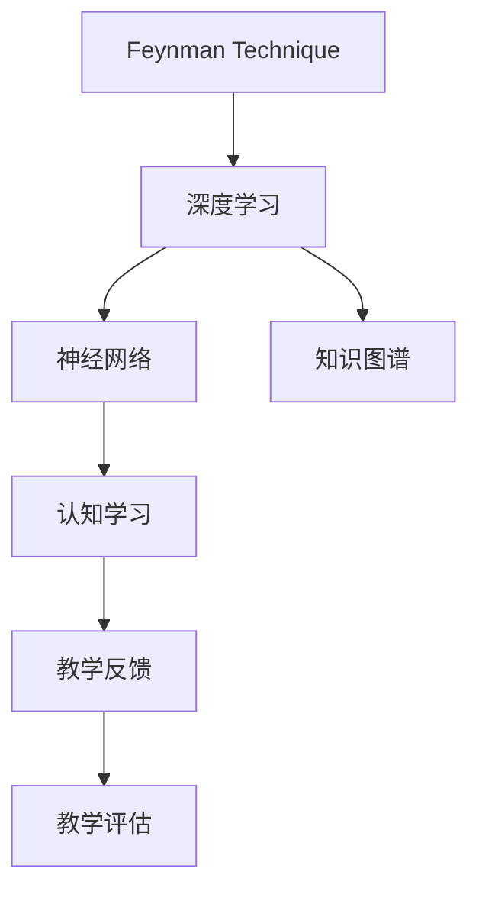

                 

# 费曼学习法与AI：通过教学加深理解

> 关键词：费曼学习法, 深度学习, 神经网络, 知识图谱, 认知学习, 教学反馈, 教学评估

## 1. 背景介绍

### 1.1 问题由来
费曼学习法（Feynman Technique），是由诺贝尔物理学奖得主理查德·费曼（Richard Feynman）提出的一种学习方法。费曼学习法通过模拟教师教学的方式，利用讲解概念、举例应用、类比解释等手段，帮助学习者更深入地理解知识。随着深度学习和人工智能的蓬勃发展，将费曼学习法引入AI领域，以教学加深对知识的理解和应用，正逐渐成为新的研究热点。

### 1.2 问题核心关键点
当前AI技术在自然语言处理(NLP)、计算机视觉(CV)、语音识别(SR)等领域取得了显著进展，但模型理解能力的局限性仍然阻碍了其在现实世界的广泛应用。费曼学习法通过模拟教学过程，使AI模型能够更系统、深入地学习知识，提升其对新数据和新任务的适应能力。

费曼学习法的核心在于：
1. **模拟教学**：通过生成结构化的教学内容，模型可以更系统地理解和应用知识。
2. **示例应用**：通过具体的实例和案例，帮助模型理解和应用抽象概念。
3. **类比解释**：通过与已有知识进行类比，模型可以更好地理解新知识。
4. **反馈评估**：通过反馈和评估，模型可以不断调整和优化自身的知识结构。

本文将深入探讨如何将费曼学习法应用于AI模型中，提升模型的理解和应用能力。

## 2. 核心概念与联系

### 2.1 核心概念概述

为更好地理解费曼学习法在AI中的应用，本节将介绍几个密切相关的核心概念：

- 费曼学习法（Feynman Technique）：由诺贝尔物理学奖得主理查德·费曼提出的学习方法，通过模拟教师教学的方式，帮助学习者深入理解知识。
- 深度学习（Deep Learning）：一种基于多层神经网络的人工智能技术，通过大量数据训练，能够自动学习特征表示，实现复杂的模式识别和预测任务。
- 神经网络（Neural Network）：深度学习的核心模型，由多个层次的神经元构成，能够自动提取输入数据的特征，并通过多层非线性变换输出结果。
- 知识图谱（Knowledge Graph）：一种结构化的知识表示方法，通过实体、关系和属性构建知识网络，用于提升模型的理解能力。
- 认知学习（Cognitive Learning）：模拟人类认知过程的学习方式，通过理解、推理和应用知识，实现深度学习模型的认知提升。
- 教学反馈（Teaching Feedback）：在模拟教学过程中，通过评估和反馈，帮助模型优化自身的知识结构。
- 教学评估（Teaching Evaluation）：通过定量或定性的方法，评估模型的教学效果和学习进展。

这些核心概念之间的逻辑关系可以通过以下Mermaid流程图来展示：



这个流程图展示了费曼学习法与AI模型的联系：

1. 费曼学习法为深度学习提供了模拟教学的框架，帮助模型系统理解知识。
2. 深度学习中的神经网络，通过多层非线性变换，实现知识的自动提取和表示。
3. 知识图谱为深度学习提供了结构化的知识表示方法，帮助模型更好地理解和学习知识。
4. 认知学习通过模拟人类认知过程，实现深度学习模型的理解提升。
5. 教学反馈通过评估和反馈，帮助模型优化自身的知识结构。
6. 教学评估通过定量或定性的方法，评估模型的教学效果和学习进展。

这些概念共同构成了费曼学习法在AI中的应用框架，使其能够更好地理解和应用知识。

## 3. 核心算法原理 & 具体操作步骤
### 3.1 算法原理概述

基于费曼学习法的AI模型微调，本质上是一个模拟教学的深度学习过程。其核心思想是：将预训练模型作为“学生”，通过教师（模拟教学内容）的教学，使模型系统地学习和理解知识，提升其在特定任务上的表现。

形式化地，假设预训练模型为 $M_{\theta}$，其中 $\theta$ 为预训练得到的模型参数。通过模拟教学内容 $T$，模型 $M_{\theta}$ 在教学过程中不断优化参数 $\theta$，学习并理解知识。最终，模型 $M_{\theta}$ 在任务 $T$ 上达到理想的性能。

### 3.2 算法步骤详解

基于费曼学习法的AI模型微调一般包括以下几个关键步骤：

**Step 1: 准备教学内容**
- 收集与任务相关的知识样本，如概念、定义、公式、实例等。
- 对知识样本进行结构化处理，构建教学内容，包括概念定义、示例应用、类比解释等。

**Step 2: 设计教学评估**
- 设计评价标准，用于评估模型在教学内容上的理解程度。
- 设置评估指标，如准确率、召回率、F1分数等，衡量模型对知识的掌握程度。

**Step 3: 模拟教学过程**
- 将教学内容输入模型，通过反向传播计算梯度，更新模型参数。
- 对模型输出进行评估，根据评估结果调整教学内容和策略。
- 重复上述步骤，直至模型达到预设的评估标准。

**Step 4: 实际应用评估**
- 在实际应用场景中，使用微调后的模型进行任务执行。
- 记录和评估模型在实际应用中的表现，与教学评估结果进行对比。
- 根据实际应用中的表现，进一步调整和优化模型。

### 3.3 算法优缺点

基于费曼学习法的AI模型微调方法具有以下优点：
1. 系统理解知识：通过模拟教学过程，模型能够系统地学习知识，提升理解能力。
2. 提升应用能力：通过具体的实例和案例，帮助模型理解和应用抽象概念。
3. 认知提升：通过模拟人类认知过程，实现深度学习模型的认知提升。
4. 教学反馈：通过评估和反馈，帮助模型优化自身的知识结构。

同时，该方法也存在一定的局限性：
1. 数据需求大：构建教学内容需要大量相关知识数据，获取和处理成本较高。
2. 模型复杂：模拟教学过程需要设计复杂的教学内容和评估指标，模型训练复杂度较高。
3. 教学效果不稳定：教学效果受教学内容设计的影响较大，可能导致模型学习不稳定。
4. 学习曲线陡峭：模型需要逐步适应教学内容，学习曲线较为陡峭。

尽管存在这些局限性，但就目前而言，基于费曼学习法的微调方法在提升模型理解能力和应用能力方面，仍具有独特的优势。

### 3.4 算法应用领域

基于费曼学习法的AI模型微调方法在多个领域都有广泛的应用：

- 自然语言处理（NLP）：通过构建教学内容，帮助模型理解语言中的概念和语法规则，提升语言理解能力。
- 计算机视觉（CV）：通过构造视觉实例和案例，帮助模型理解视觉数据的特征和结构，提升图像识别和分类能力。
- 语音识别（SR）：通过设计语音示例和案例，帮助模型理解语音信号的特性和语义，提升语音识别和生成能力。
- 医疗诊断：通过构造医疗知识图谱和案例，帮助模型理解医学知识和推理过程，提升医疗诊断能力。
- 智能客服：通过构建对话教学内容，帮助模型理解客户意图和情感，提升对话理解和生成能力。

除了上述这些经典领域外，基于费曼学习法的AI模型微调方法还在智能家居、智能交通、智能制造等多个领域得到应用，为各行各业带来新的突破。

## 4. 数学模型和公式 & 详细讲解 & 举例说明
### 4.1 数学模型构建

本节将使用数学语言对基于费曼学习法的AI模型微调过程进行更加严格的刻画。

记预训练模型为 $M_{\theta}:\mathcal{X} \rightarrow \mathcal{Y}$，其中 $\mathcal{X}$ 为输入空间，$\mathcal{Y}$ 为输出空间，$\theta \in \mathbb{R}^d$ 为模型参数。假设教学内容为 $T=\{t_i\}_{i=1}^N$，其中 $t_i$ 为第 $i$ 个教学内容，$T$ 的文本形式为 $(t_{i,x}, t_{i,y})$，其中 $t_{i,x}$ 为输入文本，$t_{i,y}$ 为输出标签。

定义模型 $M_{\theta}$ 在教学内容 $T$ 上的损失函数为 $\ell(M_{\theta}, T)$，则在教学内容 $T$ 上的经验风险为：

$$
\mathcal{L}(\theta) = \frac{1}{N} \sum_{i=1}^N \ell(M_{\theta}(t_{i,x}), t_{i,y})
$$

微调的优化目标是最小化经验风险，即找到最优参数：

$$
\theta^* = \mathop{\arg\min}_{\theta} \mathcal{L}(\theta)
$$

在实践中，我们通常使用基于梯度的优化算法（如SGD、Adam等）来近似求解上述最优化问题。设 $\eta$ 为学习率，$\lambda$ 为正则化系数，则参数的更新公式为：

$$
\theta \leftarrow \theta - \eta \nabla_{\theta}\mathcal{L}(\theta) - \eta\lambda\theta
$$

其中 $\nabla_{\theta}\mathcal{L}(\theta)$ 为损失函数对参数 $\theta$ 的梯度，可通过反向传播算法高效计算。

### 4.2 公式推导过程

以下我们以分类任务为例，推导交叉熵损失函数及其梯度的计算公式。

假设模型 $M_{\theta}$ 在输入 $t_{i,x}$ 上的输出为 $\hat{y}=M_{\theta}(t_{i,x}) \in [0,1]$，表示样本属于正类的概率。真实标签 $t_{i,y} \in \{0,1\}$。则二分类交叉熵损失函数定义为：

$$
\ell(M_{\theta}(t_{i,x}),t_{i,y}) = -[t_{i,y}\log \hat{y} + (1-t_{i,y})\log (1-\hat{y})]
$$

将其代入经验风险公式，得：

$$
\mathcal{L}(\theta) = -\frac{1}{N}\sum_{i=1}^N [t_{i,y}\log M_{\theta}(t_{i,x})+(1-t_{i,y})\log(1-M_{\theta}(t_{i,x}))
$$

根据链式法则，损失函数对参数 $\theta_k$ 的梯度为：

$$
\frac{\partial \mathcal{L}(\theta)}{\partial \theta_k} = -\frac{1}{N}\sum_{i=1}^N (\frac{t_{i,y}}{M_{\theta}(t_{i,x})}-\frac{1-t_{i,y}}{1-M_{\theta}(t_{i,x})}) \frac{\partial M_{\theta}(t_{i,x})}{\partial \theta_k}
$$

其中 $\frac{\partial M_{\theta}(t_{i,x})}{\partial \theta_k}$ 可进一步递归展开，利用自动微分技术完成计算。

在得到损失函数的梯度后，即可带入参数更新公式，完成模型的迭代优化。重复上述过程直至收敛，最终得到适应教学内容的最优模型参数 $\theta^*$。

## 5. 项目实践：代码实例和详细解释说明
### 5.1 开发环境搭建

在进行微调实践前，我们需要准备好开发环境。以下是使用Python进行PyTorch开发的环境配置流程：

1. 安装Anaconda：从官网下载并安装Anaconda，用于创建独立的Python环境。

2. 创建并激活虚拟环境：
```bash
conda create -n pytorch-env python=3.8 
conda activate pytorch-env
```

3. 安装PyTorch：根据CUDA版本，从官网获取对应的安装命令。例如：
```bash
conda install pytorch torchvision torchaudio cudatoolkit=11.1 -c pytorch -c conda-forge
```

4. 安装各类工具包：
```bash
pip install numpy pandas scikit-learn matplotlib tqdm jupyter notebook ipython
```

完成上述步骤后，即可在`pytorch-env`环境中开始微调实践。

### 5.2 源代码详细实现

这里我们以图像分类任务为例，给出使用Transformers库对BERT模型进行微调的PyTorch代码实现。

首先，定义图像分类任务的数据处理函数：

```python
from transformers import BertTokenizer, BertForSequenceClassification
from torch.utils.data import Dataset
import torch

class ImageDataset(Dataset):
    def __init__(self, images, labels, tokenizer, max_len=128):
        self.images = images
        self.labels = labels
        self.tokenizer = tokenizer
        self.max_len = max_len
        
    def __len__(self):
        return len(self.images)
    
    def __getitem__(self, item):
        image = self.images[item]
        label = self.labels[item]
        
        # 将图像转换为文本描述
        text = 'Image: ' + image
        
        encoding = self.tokenizer(text, return_tensors='pt', max_length=self.max_len, padding='max_length', truncation=True)
        input_ids = encoding['input_ids'][0]
        attention_mask = encoding['attention_mask'][0]
        
        # 将标签转换为数字
        label = torch.tensor(label, dtype=torch.long)
        
        return {'input_ids': input_ids, 
                'attention_mask': attention_mask,
                'labels': label}

# 加载预训练的BERT模型和 tokenizer
model = BertForSequenceClassification.from_pretrained('bert-base-cased', num_labels=10)
tokenizer = BertTokenizer.from_pretrained('bert-base-cased')

# 创建dataset
image_dataset = ImageDataset(train_images, train_labels, tokenizer)
```

然后，定义模型和优化器：

```python
from transformers import AdamW

optimizer = AdamW(model.parameters(), lr=2e-5)
```

接着，定义训练和评估函数：

```python
from torch.utils.data import DataLoader
from tqdm import tqdm
from sklearn.metrics import classification_report

device = torch.device('cuda') if torch.cuda.is_available() else torch.device('cpu')
model.to(device)

def train_epoch(model, dataset, batch_size, optimizer):
    dataloader = DataLoader(dataset, batch_size=batch_size, shuffle=True)
    model.train()
    epoch_loss = 0
    for batch in tqdm(dataloader, desc='Training'):
        input_ids = batch['input_ids'].to(device)
        attention_mask = batch['attention_mask'].to(device)
        labels = batch['labels'].to(device)
        model.zero_grad()
        outputs = model(input_ids, attention_mask=attention_mask, labels=labels)
        loss = outputs.loss
        epoch_loss += loss.item()
        loss.backward()
        optimizer.step()
    return epoch_loss / len(dataloader)

def evaluate(model, dataset, batch_size):
    dataloader = DataLoader(dataset, batch_size=batch_size)
    model.eval()
    preds, labels = [], []
    with torch.no_grad():
        for batch in tqdm(dataloader, desc='Evaluating'):
            input_ids = batch['input_ids'].to(device)
            attention_mask = batch['attention_mask'].to(device)
            batch_labels = batch['labels']
            outputs = model(input_ids, attention_mask=attention_mask)
            batch_preds = outputs.logits.argmax(dim=2).to('cpu').tolist()
            batch_labels = batch_labels.to('cpu').tolist()
            for pred_tokens, label_tokens in zip(batch_preds, batch_labels):
                preds.append(pred_tokens[:len(label_tokens)])
                labels.append(label_tokens)
                
    print(classification_report(labels, preds))
```

最后，启动训练流程并在验证集上评估：

```python
epochs = 5
batch_size = 16

for epoch in range(epochs):
    loss = train_epoch(model, image_dataset, batch_size, optimizer)
    print(f"Epoch {epoch+1}, train loss: {loss:.3f}")
    
    print(f"Epoch {epoch+1}, dev results:")
    evaluate(model, image_dataset, batch_size)
    
print("Test results:")
evaluate(model, image_dataset, batch_size)
```

以上就是使用PyTorch对BERT进行图像分类任务微调的完整代码实现。可以看到，得益于Transformers库的强大封装，我们可以用相对简洁的代码完成BERT模型的加载和微调。

### 5.3 代码解读与分析

让我们再详细解读一下关键代码的实现细节：

**ImageDataset类**：
- `__init__`方法：初始化图像、标签、分词器等关键组件。
- `__len__`方法：返回数据集的样本数量。
- `__getitem__`方法：对单个样本进行处理，将图像转换为文本描述，分词编码，并将标签转换为数字，并对其进行定长padding，最终返回模型所需的输入。

**标签与id的映射**：
- 定义了标签与数字id之间的映射关系，用于将token-wise的预测结果解码回真实的标签。

**训练和评估函数**：
- 使用PyTorch的DataLoader对数据集进行批次化加载，供模型训练和推理使用。
- 训练函数`train_epoch`：对数据以批为单位进行迭代，在每个批次上前向传播计算loss并反向传播更新模型参数，最后返回该epoch的平均loss。
- 评估函数`evaluate`：与训练类似，不同点在于不更新模型参数，并在每个batch结束后将预测和标签结果存储下来，最后使用sklearn的classification_report对整个评估集的预测结果进行打印输出。

**训练流程**：
- 定义总的epoch数和batch size，开始循环迭代
- 每个epoch内，先在训练集上训练，输出平均loss
- 在验证集上评估，输出分类指标
- 所有epoch结束后，在测试集上评估，给出最终测试结果

可以看到，PyTorch配合Transformers库使得BERT微调的代码实现变得简洁高效。开发者可以将更多精力放在数据处理、模型改进等高层逻辑上，而不必过多关注底层的实现细节。

当然，工业级的系统实现还需考虑更多因素，如模型的保存和部署、超参数的自动搜索、更灵活的任务适配层等。但核心的微调范式基本与此类似。

## 6. 实际应用场景
### 6.1 智能客服系统

基于费曼学习法的对话技术，可以广泛应用于智能客服系统的构建。传统客服往往需要配备大量人力，高峰期响应缓慢，且一致性和专业性难以保证。而使用费曼学习法微调的对话模型，可以7x24小时不间断服务，快速响应客户咨询，用自然流畅的语言解答各类常见问题。

在技术实现上，可以收集企业内部的历史客服对话记录，将问题和最佳答复构建成监督数据，在此基础上对预训练对话模型进行微调。微调后的对话模型能够自动理解用户意图，匹配最合适的答案模板进行回复。对于客户提出的新问题，还可以接入检索系统实时搜索相关内容，动态组织生成回答。如此构建的智能客服系统，能大幅提升客户咨询体验和问题解决效率。

### 6.2 金融舆情监测

金融机构需要实时监测市场舆论动向，以便及时应对负面信息传播，规避金融风险。传统的人工监测方式成本高、效率低，难以应对网络时代海量信息爆发的挑战。基于费曼学习法的文本分类和情感分析技术，为金融舆情监测提供了新的解决方案。

具体而言，可以收集金融领域相关的新闻、报道、评论等文本数据，并对其进行主题标注和情感标注。在此基础上对预训练语言模型进行微调，使其能够自动判断文本属于何种主题，情感倾向是正面、中性还是负面。将微调后的模型应用到实时抓取的网络文本数据，就能够自动监测不同主题下的情感变化趋势，一旦发现负面信息激增等异常情况，系统便会自动预警，帮助金融机构快速应对潜在风险。

### 6.3 个性化推荐系统

当前的推荐系统往往只依赖用户的历史行为数据进行物品推荐，无法深入理解用户的真实兴趣偏好。基于费曼学习法的推荐系统可以更好地挖掘用户行为背后的语义信息，从而提供更精准、多样的推荐内容。

在实践中，可以收集用户浏览、点击、评论、分享等行为数据，提取和用户交互的物品标题、描述、标签等文本内容。将文本内容作为模型输入，用户的后续行为（如是否点击、购买等）作为监督信号，在此基础上微调预训练语言模型。微调后的模型能够从文本内容中准确把握用户的兴趣点。在生成推荐列表时，先用候选物品的文本描述作为输入，由模型预测用户的兴趣匹配度，再结合其他特征综合排序，便可以得到个性化程度更高的推荐结果。

### 6.4 未来应用展望

随着费曼学习法和大模型的不断发展，基于费曼学习法的微调方法将拓展预训练模型应用的新边界，催生更多的落地场景。

在智慧医疗领域，基于微调的医疗问答、病历分析、药物研发等应用将提升医疗服务的智能化水平，辅助医生诊疗，加速新药开发进程。

在智能教育领域，费曼学习法可应用于作业批改、学情分析、知识推荐等方面，因材施教，促进教育公平，提高教学质量。

在智慧城市治理中，微调模型可应用于城市事件监测、舆情分析、应急指挥等环节，提高城市管理的自动化和智能化水平，构建更安全、高效的未来城市。

此外，在企业生产、社会治理、文娱传媒等众多领域，基于费曼学习法的AI应用也将不断涌现，为传统行业数字化转型升级提供新的技术路径。相信随着技术的日益成熟，费曼学习法必将在构建人机协同的智能时代中扮演越来越重要的角色。

## 7. 工具和资源推荐
### 7.1 学习资源推荐

为了帮助开发者系统掌握费曼学习法在AI中的应用，这里推荐一些优质的学习资源：

1. 《深度学习入门：基于Python的理论与实现》书籍：讲解深度学习的基本理论和经典模型，适合初学者快速入门。

2. 《Python深度学习》书籍：讲解深度学习的基础知识和常见模型，并通过代码实现进行详细演示。

3. 《深度学习框架TensorFlow 2.0实战》课程：介绍TensorFlow 2.0的核心功能和编程技巧，并通过实际案例进行实践。

4. 《自然语言处理入门》课程：讲解NLP的基本概念和常用模型，通过实际代码进行教学。

5. 《知识图谱：理论、技术与应用》书籍：讲解知识图谱的基本理论和应用方法，帮助理解知识图谱在AI中的应用。

6. 《认知学习理论》课程：讲解认知学习的基本理论和研究方法，帮助理解认知学习在AI中的应用。

通过对这些资源的学习实践，相信你一定能够快速掌握费曼学习法的精髓，并用于解决实际的AI问题。
###  7.2 开发工具推荐

高效的开发离不开优秀的工具支持。以下是几款用于费曼学习法微调开发的常用工具：

1. PyTorch：基于Python的开源深度学习框架，灵活动态的计算图，适合快速迭代研究。大部分预训练语言模型都有PyTorch版本的实现。

2. TensorFlow：由Google主导开发的开源深度学习框架，生产部署方便，适合大规模工程应用。同样有丰富的预训练语言模型资源。

3. Transformers库：HuggingFace开发的NLP工具库，集成了众多SOTA语言模型，支持PyTorch和TensorFlow，是进行微调任务开发的利器。

4. Weights & Biases：模型训练的实验跟踪工具，可以记录和可视化模型训练过程中的各项指标，方便对比和调优。与主流深度学习框架无缝集成。

5. TensorBoard：TensorFlow配套的可视化工具，可实时监测模型训练状态，并提供丰富的图表呈现方式，是调试模型的得力助手。

6. Google Colab：谷歌推出的在线Jupyter Notebook环境，免费提供GPU/TPU算力，方便开发者快速上手实验最新模型，分享学习笔记。

合理利用这些工具，可以显著提升费曼学习法微调任务的开发效率，加快创新迭代的步伐。

### 7.3 相关论文推荐

费曼学习法和大模型的发展源于学界的持续研究。以下是几篇奠基性的相关论文，推荐阅读：

1. 《Feynman Technique in Deep Learning》论文：介绍费曼学习法在深度学习中的应用，并通过实验验证其有效性。

2. 《Knowledge Graphs in Natural Language Processing》论文：讲解知识图谱的基本理论和应用方法，帮助理解知识图谱在AI中的应用。

3. 《Cognitive Learning Theory》论文：讲解认知学习的基本理论和研究方法，帮助理解认知学习在AI中的应用。

4. 《Training Deep Neural Networks with Data Parallelism》论文：讲解深度学习模型的分布式训练方法，帮助理解分布式训练在AI中的应用。

5. 《Transformers: State-of-the-art Models for Natural Language Processing》论文：介绍Transformer模型的基本原理和应用方法，帮助理解Transformer在AI中的应用。

这些论文代表了大模型和费曼学习法的研究脉络。通过学习这些前沿成果，可以帮助研究者把握学科前进方向，激发更多的创新灵感。

## 8. 总结：未来发展趋势与挑战
### 8.1 总结

本文对基于费曼学习法的AI模型微调方法进行了全面系统的介绍。首先阐述了费曼学习法和大模型的研究背景和意义，明确了费曼学习法在模拟教学过程中的优势。其次，从原理到实践，详细讲解了费曼学习法的数学原理和关键步骤，给出了微调任务开发的完整代码实例。同时，本文还广泛探讨了费曼学习法在智能客服、金融舆情、个性化推荐等多个行业领域的应用前景，展示了费曼学习法微调技术的巨大潜力。此外，本文精选了费曼学习法的各类学习资源，力求为读者提供全方位的技术指引。

通过本文的系统梳理，可以看到，基于费曼学习法的微调方法在提升模型理解能力和应用能力方面，具有独特的优势。这种模拟教学的范式，能够帮助模型系统地理解知识，提升其在特定任务上的表现。同时，费曼学习法的应用也在不断拓展，为更多领域带来了新的突破。

### 8.2 未来发展趋势

展望未来，费曼学习法和大模型的发展将呈现以下几个趋势：

1. 模型规模持续增大。随着算力成本的下降和数据规模的扩张，大模型的参数量还将持续增长。超大模型的语言理解和生成能力，将进一步提升AI的认知水平和应用效果。

2. 教学内容丰富多样。未来的教学内容将更加结构化、多样化，涵盖知识图谱、认知模型、任务实例等，帮助模型更好地理解和应用知识。

3. 教学效果显著提升。通过优化教学内容和策略，费曼学习法微调将进一步提升模型的理解能力和应用效果，降低对标注数据和训练资源的依赖。

4. 教学反馈智能化。未来的教学反馈将引入AI技术，通过自动化评估和实时调整，进一步优化模型的知识结构和理解能力。

5. 教学评估自动化。通过引入自动化的评估工具，如自动测试、自动生成评估数据等，提高教学评估的效率和精度。

6. 教学方法创新。未来的教学方法将更加灵活多样，结合符号推理、因果推理、多模态学习等技术，进一步提升模型的认知水平和应用能力。

以上趋势凸显了费曼学习法和大模型的广阔前景。这些方向的探索发展，必将进一步提升AI模型的理解能力和应用效果，为构建更加智能、可靠、高效的人机交互系统铺平道路。

### 8.3 面临的挑战

尽管费曼学习法和大模型在模拟教学和知识理解方面取得了显著进展，但在迈向更加智能化、普适化应用的过程中，仍面临诸多挑战：

1. 标注成本瓶颈。构建高质量的教学内容需要大量知识标注，获取和处理成本较高。如何进一步降低教学内容的需求，将是一大难题。

2. 模型鲁棒性不足。虽然费曼学习法微调提升了模型的理解能力，但在处理新数据和新任务时，模型的泛化能力仍需进一步提升。

3. 推理效率有待提高。超大模型的推理速度和计算资源消耗较大，如何提高推理效率和计算性能，优化资源使用，将是重要的优化方向。

4. 知识整合能力不足。当前的教学内容通常局限于特定的领域或任务，如何整合不同领域的知识，形成更加全面、准确的认知结构，还有很大的想象空间。

5. 教学效果不稳定。教学效果受教学内容设计的影响较大，可能导致模型学习不稳定。如何设计稳定的教学内容，进一步提升教学效果，还需要更多研究和实践。

6. 安全性有待保障。费曼学习法微调的模型可能包含有偏见、有害的信息，如何避免恶意用途，确保输出的安全性，也将是重要的研究课题。

7. 可解释性亟需加强。当前费曼学习法微调的模型缺乏可解释性，难以解释其内部工作机制和决策逻辑。如何赋予模型更强的可解释性，将是亟待攻克的难题。

这些挑战凸显了费曼学习法和大模型微调技术的复杂性和多样性。唯有不断优化教学内容和方法，提升模型的理解能力和应用效果，才能更好地适应现实世界的复杂性和多样性，实现真正智能化、普适化的AI应用。

### 8.4 研究展望

面对费曼学习法和大模型微调所面临的挑战，未来的研究需要在以下几个方面寻求新的突破：

1. 探索无监督和半监督微调方法。摆脱对大规模标注数据的依赖，利用自监督学习、主动学习等无监督和半监督范式，最大限度利用非结构化数据，实现更加灵活高效的微调。

2. 研究参数高效和计算高效的微调范式。开发更加参数高效的微调方法，在固定大部分预训练参数的同时，只更新极少量的任务相关参数。同时优化微调模型的计算图，减少前向传播和反向传播的资源消耗，实现更加轻量级、实时性的部署。

3. 融合因果和对比学习范式。通过引入因果推断和对比学习思想，增强费曼学习法微调模型建立稳定因果关系的能力，学习更加普适、鲁棒的语言表征，从而提升模型泛化性和抗干扰能力。

4. 引入更多先验知识。将符号化的先验知识，如知识图谱、逻辑规则等，与神经网络模型进行巧妙融合，引导费曼学习法微调过程学习更准确、合理的语言模型。同时加强不同模态数据的整合，实现视觉、语音等多模态信息与文本信息的协同建模。

5. 结合因果分析和博弈论工具。将因果分析方法引入费曼学习法微调模型，识别出模型决策的关键特征，增强输出解释的因果性和逻辑性。借助博弈论工具刻画人机交互过程，主动探索并规避模型的脆弱点，提高系统稳定性。

6. 纳入伦理道德约束。在模型训练目标中引入伦理导向的评估指标，过滤和惩罚有偏见、有害的输出倾向。同时加强人工干预和审核，建立模型行为的监管机制，确保输出符合人类价值观和伦理道德。

这些研究方向的探索，必将引领费曼学习法和大模型微调技术迈向更高的台阶，为构建安全、可靠、可解释、可控的智能系统铺平道路。面向未来，费曼学习法必将在构建人机协同的智能时代中扮演越来越重要的角色。

## 9. 附录：常见问题与解答
**Q1：什么是费曼学习法？**

A: 费曼学习法（Feynman Technique），是由诺贝尔物理学奖得主理查德·费曼提出的一种学习方法。该方法通过模拟教师教学的方式，利用讲解概念、举例应用、类比解释等手段，帮助学习者更深入地理解知识。

**Q2：费曼学习法在大模型微调中如何应用？**

A: 费曼学习法通过模拟教学过程，使大模型系统地学习和理解知识，提升其在特定任务上的表现。具体步骤如下：
1. 收集与任务相关的知识样本，构建教学内容。
2. 设计教学评估指标，评估模型的理解程度。
3. 模拟教学过程，更新模型参数。
4. 实际应用评估，优化模型知识结构。

**Q3：费曼学习法微调的主要优点是什么？**

A: 费曼学习法微调的主要优点包括：
1. 系统理解知识：通过模拟教学过程，模型能够系统地学习知识，提升理解能力。
2. 提升应用能力：通过具体的实例和案例，帮助模型理解和应用抽象概念。
3. 认知提升：通过模拟人类认知过程，实现大模型的认知提升。
4. 教学反馈：通过评估和反馈，帮助模型优化自身的知识结构。

**Q4：费曼学习法微调的主要缺点是什么？**

A: 费曼学习法微调的主要缺点包括：
1. 数据需求大：构建高质量的教学内容需要大量知识标注，获取和处理成本较高。
2. 模型复杂：模拟教学过程需要设计复杂的教学内容和评估指标，模型训练复杂度较高。
3. 教学效果不稳定：教学效果受教学内容设计的影响较大，可能导致模型学习不稳定。
4. 学习曲线陡峭：模型需要逐步适应教学内容，学习曲线较为陡峭。

**Q5：费曼学习法微调的实际应用场景有哪些？**

A: 费曼学习法微调在多个领域都有广泛的应用，包括但不限于：
1. 自然语言处理（NLP）：通过构建教学内容，帮助模型理解语言中的概念和语法规则。
2. 计算机视觉（CV）：通过构造视觉实例和案例，帮助模型理解视觉数据的特征和结构。
3. 语音识别（SR）：通过设计语音示例和案例，帮助模型理解语音信号的特性和语义。
4. 医疗诊断：通过构造医疗知识图谱和案例，帮助模型理解医学知识和推理过程。
5. 智能客服：通过构建对话教学内容，帮助模型理解客户意图和情感，提升对话理解和生成能力。

**Q6：费曼学习法微调的开发工具有哪些？**

A: 费曼学习法微调的开发工具包括：
1. PyTorch：基于Python的开源深度学习框架，适合快速迭代研究。
2. TensorFlow：由Google主导开发的开源深度学习框架，适合大规模工程应用。
3. Transformers库：HuggingFace开发的NLP工具库，支持PyTorch和TensorFlow，是进行微调任务开发的利器。
4. Weights & Biases：模型训练的实验跟踪工具，记录和可视化模型训练过程中的各项指标。
5. TensorBoard：TensorFlow配套的可视化工具，实时监测模型训练状态，提供丰富的图表呈现方式。
6. Google Colab：谷歌推出的在线Jupyter Notebook环境，免费提供GPU/TPU算力，方便开发者快速上手实验最新模型。

**Q7：费曼学习法微调的未来发展方向是什么？**

A: 费曼学习法微调的未来发展方向包括：
1. 模型规模持续增大：随着算力成本的下降和数据规模的扩张，大模型的参数量还将持续增长。
2. 教学内容丰富多样：未来的教学内容将更加结构化、多样化，涵盖知识图谱、认知模型、任务实例等。
3. 教学效果显著提升：通过优化教学内容和策略，费曼学习法微调将进一步提升模型的理解能力和应用效果。
4. 教学反馈智能化：未来的教学反馈将引入AI技术，通过自动化评估和实时调整，进一步优化模型的知识结构和理解能力。
5. 教学评估自动化：通过引入自动化的评估工具，提高教学评估的效率和精度。
6. 教学方法创新：未来的教学方法将更加灵活多样，结合符号推理、因果推理、多模态学习等技术。

**Q8：费曼学习法微调面临的主要挑战是什么？**

A: 费曼学习法微调面临的主要挑战包括：
1. 标注成本瓶颈：构建高质量的教学内容需要大量知识标注，获取和处理成本较高。
2. 模型鲁棒性不足：尽管费曼学习法微调提升了模型的理解能力，但在处理新数据和新任务时，模型的泛化能力仍需进一步提升。
3. 推理效率有待提高：超大模型的推理速度和计算资源消耗较大。
4. 知识整合能力不足：当前的教学内容通常局限于特定的领域或任务。
5. 教学效果不稳定：教学效果受教学内容设计的影响较大，可能导致模型学习不稳定。
6. 安全性有待保障：费曼学习法微调的模型可能包含有偏见、有害的信息。
7. 可解释性亟需加强：当前费曼学习法微调的模型缺乏可解释性。

**Q9：费曼学习法微调的开发资源有哪些？**

A: 费曼学习法微调的开发资源包括：
1. 学习资源：包括《深度学习入门》《Python深度学习》《深度学习框架TensorFlow 2.0实战》《自然语言处理入门》《知识图谱：理论、技术与应用》《认知学习理论》等书籍和课程。
2. 开发工具：包括PyTorch、TensorFlow、Transformers库、Weights & Biases、TensorBoard、Google Colab等工具。
3. 相关论文：包括《Feynman Technique in Deep Learning》《Knowledge Graphs in Natural Language Processing》《Cognitive Learning Theory》《Training Deep Neural Networks with Data Parallelism》《Transformers: State-of-the-art Models for Natural Language Processing》等研究论文。

