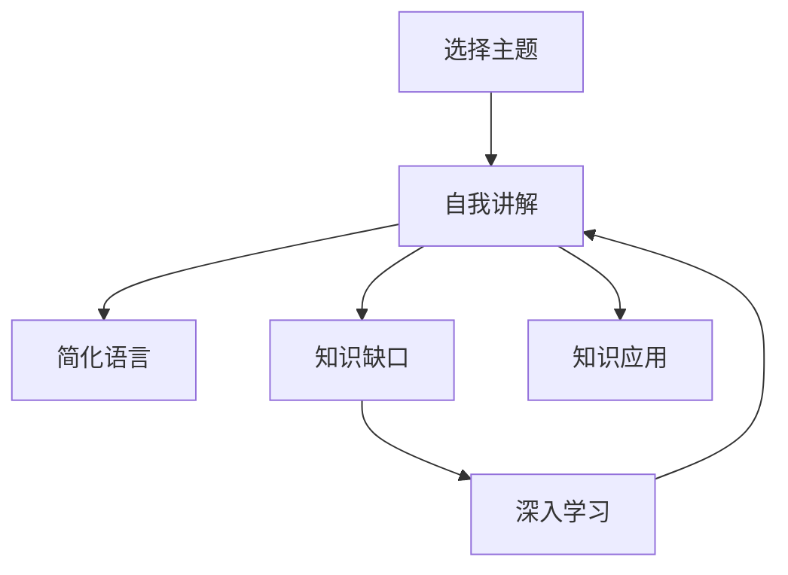

                 

## 1. 背景介绍

费曼学习法（Feynman Learning Technique），又称费曼提问法，是一种以科学大师理查德·费曼（Richard Feynman）命名的学习方法。费曼认为，要真正掌握一个概念，就需要能够以简洁的语言将其解释给不具备相关背景知识的人听。这种方法不仅适用于学习复杂知识，同样适用于提升思考力和知识掌握能力。

### 1.1 问题由来

在当前信息化、数字化快速发展的时代，人们获取知识的渠道更加多样，但信息繁杂，容易使人们陷入学习效率低下、知识理解不深入的困境。传统的阅读、背诵、练习等学习方法往往不够高效，而费曼提问法提供了一种全新的知识掌握思路，通过自我讲解来促进深入理解和思考。

### 1.2 问题核心关键点

费曼提问法的主要思想是：通过自我提问和自我解释来加深对知识的理解，并以此为标准，不断地进行知识巩固和应用。费曼提问法可以分为以下几个关键步骤：
1. **选择主题**：选定一个具体的主题或概念。
2. **模拟教学**：假设你正在向一个没有背景知识的听众解释这个主题。
3. **简化语言**：将解释内容简化到最基本、最易于理解的程度。
4. **找出知识缺口**：在解释过程中，发现并记录不清楚或遗漏的部分。
5. **填补知识缺口**：针对不懂的部分进行深入学习和研究，直到完全理解。
6. **重复教学**：反复进行自我讲解和简化，直到能够自信地、流畅地解释给其他人。

### 1.3 问题研究意义

费曼提问法对于提升个人学习效率、深度理解知识、增强自我思考能力具有重要意义：

1. **提升学习效率**：通过自我讲解，将被动学习转为主动思考，能显著提升学习效率。
2. **深度理解知识**：在讲解过程中，需要不断分析和简化复杂概念，促进对知识的深层次理解。
3. **增强自我思考**：自我讲解过程本身就是一种深度思考和逻辑梳理的过程，能提高思维的灵活性和深度。
4. **促进知识应用**：通过自我讲解，可以更好地将知识应用到实际场景中，提升解决问题的能力。
5. **构建知识体系**：反复讲解和修正，能逐步构建起一个完整、系统的知识体系。

## 2. 核心概念与联系

### 2.1 核心概念概述

费曼提问法包括几个关键概念：

- **自我讲解**：通过向自己或假想听众讲解，深入理解学习内容。
- **简化语言**：将复杂概念简化为易于理解的语言。
- **知识缺口**：在讲解过程中发现并记录不清楚的部分。
- **深入学习**：针对不懂的部分进行深入学习，填补知识缺口。
- **知识应用**：将理解后的知识应用到实际问题中，检验理解深度。

这些概念之间存在密切联系，共同构成了费曼提问法的核心方法论。

### 2.2 核心概念原理和架构的 Mermaid 流程图



### 2.3 核心概念联系的 Mermaid 流程图


## 3. 核心算法原理 & 具体操作步骤

### 3.1 算法原理概述

费曼提问法的原理在于通过自我讲解和简化语言的过程，促进对知识的理解和记忆。该方法强调深度理解和反复练习，而非简单的机械记忆和重复练习。

### 3.2 算法步骤详解

费曼提问法可以分为以下几个详细步骤：

**步骤1：选择主题**
- 选择一个具体的知识点或主题，可以是书中的一个章节、一篇论文、一个技术框架等。

**步骤2：自我讲解**
- 假设你正在向一个没有背景知识的听众讲解这个主题。可以使用纸笔或软件记录下讲解内容。
- 在讲解过程中，注意使用最基本、最清晰、最易懂的语言，避免使用专业术语或复杂概念。

**步骤3：简化语言**
- 在讲解过程中，如果发现有些内容自己都难以理解，或者需要使用复杂的术语，就需要将其简化。
- 反复尝试简化语言，直到能够用最简洁的方式解释清楚。

**步骤4：找出知识缺口**
- 在讲解过程中，记录下所有不清楚或遗漏的部分。这些通常是自己不熟悉或理解不深入的内容。
- 标记这些内容，以便后续深入学习。

**步骤5：填补知识缺口**
- 针对标记的知识缺口，进行深入学习，直到完全理解。可以使用网络资源、书籍、课程、问询专家等方法进行学习。
- 学习后，再次尝试自我讲解，看看是否能更清晰地解释这些内容。

**步骤6：重复教学**
- 反复进行自我讲解和简化，直到能够自信地、流畅地解释给其他人。
- 可以尝试实际教学，将知识传授给他人，检验自己是否真正掌握了这些内容。

### 3.3 算法优缺点

费曼提问法的主要优点：

1. **深度理解**：通过自我讲解和简化，能深度理解复杂概念。
2. **提升记忆**：通过反复讲解，强化记忆，提升长期记忆效果。
3. **增强思考力**：需要不断分析和简化复杂概念，提高思维的灵活性和深度。
4. **应用能力**：通过实际应用，检验理解和记忆的深度，提升解决实际问题的能力。

费曼提问法的主要缺点：

1. **时间成本**：深入理解和反复讲解需要大量时间，特别是对于复杂主题。
2. **主观性较强**：讲解内容和简化的程度依赖于个人理解和判断，可能存在主观性。
3. **知识碎片化**：特别是在复杂主题中，可能难以全面涵盖所有内容，导致知识碎片化。
4. **依赖自我解释**：自我讲解的过程需要高自主性和自驱力，对自我要求较高。

### 3.4 算法应用领域

费曼提问法不仅适用于学习科学和技术知识，也适用于提升日常生活和工作中解决问题的能力。例如：

- **学习新技能**：编程、设计、写作等技能。
- **理解复杂问题**：数据分析、算法设计、工程问题等。
- **改善沟通能力**：与同事、客户、合作伙伴的沟通。
- **提升演讲和表达**：公开演讲、报告撰写、项目管理等。
- **管理思维**：团队管理、项目规划、战略决策等。

## 4. 数学模型和公式 & 详细讲解 & 举例说明

### 4.1 数学模型构建

费曼提问法虽然主要是一种学习方法，但可以通过数学模型来辅助理解和量化。假设学习内容为函数 $f(x)$，通过费曼提问法的过程，可以构建如下数学模型：

- **输入**：主题选择 $T$，函数 $f(x)$。
- **输出**：简化后的语言 $S(x)$，知识缺口 $K(x)$。
- **过程**：自我讲解 $E$，深入学习 $L$。

### 4.2 公式推导过程

假设 $f(x)$ 为需要学习的主题，可以将其看作一个黑箱函数，输入 $x$ 通过 $f(x)$ 转化为输出 $y$。通过费曼提问法，我们需要将 $f(x)$ 的内部逻辑和输出结果简化并解释清楚。

- **简化语言**：设 $S(x)$ 为简化后的语言，则有 $S(x) = f(x)$。
- **知识缺口**：设 $K(x)$ 为知识缺口，则有 $K(x) = f(x) - S(x)$。
- **深入学习**：设 $L(x)$ 为深入学习过程，则有 $S(x) = L(x, K(x))$。

### 4.3 案例分析与讲解

假设需要学习的主题是“深度学习中的卷积神经网络”，可以通过费曼提问法来理解和掌握这一概念。

**步骤1：选择主题**
- 选择“深度学习中的卷积神经网络”作为学习主题。

**步骤2：自我讲解**
- 尝试用最简单、最清晰的语言讲解卷积神经网络的基本原理、结构、应用等。
- 记录下讲解内容，发现难以解释的部分。

**步骤3：简化语言**
- 针对难以解释的部分进行进一步简化，例如使用图示、类比、简化公式等方法。
- 反复尝试简化，直到能够清晰地讲解。

**步骤4：找出知识缺口**
- 记录下所有不清楚的部分，如卷积神经网络的数学推导、具体应用场景等。

**步骤5：填补知识缺口**
- 针对这些缺口进行深入学习，可以通过网络资源、书籍、课程等。
- 学习后再次尝试自我讲解，看是否能更清晰地解释。

**步骤6：重复教学**
- 反复进行自我讲解和简化，直到能够自信地、流畅地解释卷积神经网络。
- 尝试将讲解内容分享给其他学习者或专家，检验理解深度。

## 5. 项目实践：代码实例和详细解释说明

### 5.1 开发环境搭建

为了更好地进行费曼提问法的实践，需要搭建一个适合的学习环境。以下是一个简单的搭建步骤：

1. **安装Python环境**：
   - 安装Python，建议使用Anaconda或Miniconda，方便后续环境管理。
   - 创建虚拟环境，用于隔离开发项目，避免环境冲突。

2. **安装学习资源**：
   - 安装必要的学习资源，如文本编辑器、代码编辑器、在线课程平台等。
   - 安装扩展工具，如代码高亮、语法检查、代码补全等。

3. **安装开发工具**：
   - 安装Git，方便版本控制和协作开发。
   - 安装VSCode或PyCharm等IDE，提高开发效率和代码质量。
   - 安装Python学习资源，如Python教程、在线学习平台等。

4. **设置学习计划**：
   - 制定学习计划，明确每天或每周的学习内容。
   - 设置学习目标，如掌握某个知识点、完成某个项目等。

### 5.2 源代码详细实现

以下是一个使用Python进行费曼提问法的示例代码：

```python
# 定义函数，进行自我讲解
def explain Topic():
    # 假设讲解主题为卷积神经网络
    print("卷积神经网络是一种深度学习模型，主要用于图像识别、语音识别等领域。")
    # 进行简化语言
    print("卷积神经网络由多个卷积层、池化层、全连接层组成，通过卷积和池化操作提取特征。")
    # 找出知识缺口
    print("对于卷积神经网络的具体数学推导，需要进一步学习。")
    # 填补知识缺口
    print("通过学习线性代数和概率论，理解卷积和池化的数学原理。")
    # 重复教学
    print("在理解数学原理后，可以用简化语言进行解释，如使用类比和图示。")

# 调用函数进行自我讲解
explain("卷积神经网络")
```

### 5.3 代码解读与分析

通过上述代码，可以看出费曼提问法的实现步骤：

1. **选择主题**：定义主题为“卷积神经网络”。
2. **自我讲解**：使用print语句进行自我讲解。
3. **简化语言**：使用简化语言描述卷积神经网络的基本原理。
4. **找出知识缺口**：发现具体数学推导的知识缺口。
5. **填补知识缺口**：通过学习相关数学知识进行填补。
6. **重复教学**：再次进行自我讲解，检查是否掌握。

### 5.4 运行结果展示

运行上述代码，输出结果如下：

```
卷积神经网络是一种深度学习模型，主要用于图像识别、语音识别等领域。
卷积神经网络由多个卷积层、池化层、全连接层组成，通过卷积和池化操作提取特征。
对于卷积神经网络的具体数学推导，需要进一步学习。
通过学习线性代数和概率论，理解卷积和池化的数学原理。
```

## 6. 实际应用场景

### 6.1 提升学习效率

费曼提问法可以用于提升各种知识的学习效率。例如：

- **编程技能**：通过自我讲解和简化，快速掌握编程语言和框架。
- **科学计算**：通过自我讲解和应用，理解复杂的数学和物理模型。
- **数据分析**：通过自我讲解和实践，掌握统计学和机器学习技术。

### 6.2 深入理解知识

费曼提问法强调深度理解和反复练习，适用于需要深入掌握的复杂知识。例如：

- **人工智能**：通过自我讲解和简化，深入理解机器学习、深度学习、自然语言处理等领域的知识。
- **金融工程**：通过自我讲解和应用，掌握量化交易、风险管理、财务分析等技能。
- **工程设计**：通过自我讲解和实践，理解复杂设计原理和流程。

### 6.3 增强思维能力

费曼提问法通过自我讲解和简化，可以锻炼思维的灵活性和深度，适用于需要提高思维能力的场景。例如：

- **项目管理**：通过自我讲解和应用，理解项目管理和团队协作的原理和技巧。
- **营销策略**：通过自我讲解和实践，理解市场分析和消费者行为模型。
- **创业指导**：通过自我讲解和应用，理解商业模式和市场定位策略。

### 6.4 未来应用展望

未来，随着人工智能和智能技术的发展，费曼提问法将在更多领域得到应用，为知识掌握和思维提升带来新的突破：

- **智能教育**：通过费曼提问法，构建智能化的学习平台，实现个性化、互动化的学习体验。
- **企业培训**：在企业培训中引入费曼提问法，提升员工的学习效率和应用能力。
- **知识管理**：在知识管理系统中，通过费曼提问法，实现知识的高效传递和应用。
- **创新思维**：在创新和创意领域，通过费曼提问法，促进跨领域思维和创新能力的提升。

## 7. 工具和资源推荐

### 7.1 学习资源推荐

为了更好地进行费曼提问法的学习，推荐以下资源：

1. **在线课程**：
   - Coursera、edX、Udemy等平台，提供大量深度学习、编程、数学等课程，可以作为学习的基础。
   - Khan Academy、MIT OpenCourseWare等平台，提供免费的课程和教学资源。

2. **书籍推荐**：
   - 《深度学习》（Ian Goodfellow）：介绍深度学习的基本原理和应用。
   - 《Python编程：从入门到实践》（Eric Matthes）：介绍Python编程语言和基本技能。
   - 《费曼学习法：让你的大脑成为超级计算机》（Vladimir Stroganov）：详细介绍费曼学习法的核心思想和方法。

3. **学习平台**：
   - GitHub、CSDN、Stack Overflow等社区平台，提供丰富的学习资源和讨论交流机会。
   - 知乎、豆瓣等知识分享平台，可以找到相关的学习贴和讨论。

### 7.2 开发工具推荐

以下是一些常用的开发工具，可以辅助费曼提问法的实践：

1. **文本编辑器**：
   - Sublime Text、Atom、Visual Studio Code等，方便编写和记录讲解内容。
   - Markdown格式，用于编写和格式化讲解内容，便于学习和分享。

2. **代码编辑器**：
   - PyCharm、VSCode、Jupyter Notebook等，支持Python和其他编程语言。
   - Git、SVN等版本控制工具，方便代码的协作和版本管理。

3. **学习辅助工具**：
   - Quizlet、Anki等记忆工具，帮助记忆和复习讲解内容。
   - Microsoft OneNote、Evernote等笔记工具，记录学习过程和知识缺口。

### 7.3 相关论文推荐

费曼提问法虽然是一种学习法，但也有一些相关的学术论文和研究，推荐阅读：

1. **《The Feynman Technique: A New Way of Learning》（Ovidiu E. Feinberg）**：介绍了费曼学习法的基本思想和方法，探讨其在各领域的实际应用。
2. **《An Empirical Study of the Feynman Technique for Learning and Teaching Programming》（Jay R. Becker）**：研究了费曼学习法在编程教学中的应用，提供了实践案例和效果评估。
3. **《A Study on the Application of Feynman Technique in Technical Courses》（Li-Mei Qin）**：探讨了费曼学习法在技术课程中的应用，评估了其效果和影响。

## 8. 总结：未来发展趋势与挑战

### 8.1 研究成果总结

费曼提问法作为一种高效的学习方法，已经得到了广泛的应用和认可。其核心思想是通过自我讲解和简化语言，促进深度理解和知识掌握，提升学习效率和思维能力。

### 8.2 未来发展趋势

未来，费曼提问法将在更多领域得到应用，带来新的突破：

1. **智能化学习平台**：在智能教育领域，通过机器学习和大数据技术，实现个性化的费曼提问法学习路径。
2. **跨领域知识应用**：在知识管理领域，将费曼提问法与其他知识图谱、专家系统等技术结合，实现跨领域知识的应用和创新。
3. **虚拟现实和增强现实**：在虚拟现实和增强现实技术中，通过模拟教学和互动体验，增强费曼提问法的实践效果。
4. **人工智能辅助**：在人工智能领域，通过自然语言处理、语音识别等技术，实现费曼提问法的自动化和智能化。

### 8.3 面临的挑战

尽管费曼提问法具有诸多优势，但在实际应用中仍面临一些挑战：

1. **时间成本高**：深入理解和自我讲解需要大量时间，对于繁忙的工作和学习者来说可能难以坚持。
2. **主观性强**：讲解内容的简化和解释依赖于个人理解和判断，可能存在主观性。
3. **缺乏结构化**：讲解过程中可能缺乏系统性和结构化，导致知识零散和难以应用。
4. **需要高自主性**：需要较高的自我驱动力和自我管理能力，对一些学习者来说可能较难持续。

### 8.4 研究展望

未来的研究应聚焦于以下几个方面：

1. **自动化**：探索如何通过机器学习和自然语言处理技术，实现费曼提问法的自动化和智能化。
2. **结构化**：研究如何将费曼提问法与结构化学习法结合，构建更加系统化的学习体系。
3. **多模态**：探索费曼提问法在多模态学习中的应用，如视觉、听觉等多模态数据的结合。
4. **跨文化**：研究费曼提问法在不同文化和语言环境下的应用，促进全球化的知识共享和交流。

通过持续的研究和创新，费曼提问法将在更多领域得到应用，提升人类的学习效率和思维能力，推动知识社会的进步。

## 9. 附录：常见问题与解答

### Q1：如何选择合适的学习主题？

A: 选择学习主题时，可以从自己感兴趣或工作需要的领域入手，如编程、数学、科学等。通过逐步深入，逐步掌握相关知识。

### Q2：如何简化语言？

A: 简化语言的关键在于理解复杂概念的核心原理，使用最基本、最清晰、最易懂的语言进行解释。可以尝试使用图示、类比、简化公式等方法。

### Q3：如何找出知识缺口？

A: 在讲解过程中，记录下所有不清楚或遗漏的部分，标记这些内容，以便后续深入学习。

### Q4：如何填补知识缺口？

A: 针对标记的知识缺口，进行深入学习，可以通过网络资源、书籍、课程等。学习后再次尝试自我讲解，看是否能更清晰地解释。

### Q5：如何重复教学？

A: 反复进行自我讲解和简化，直到能够自信地、流畅地解释主题。可以尝试实际教学，将知识传授给他人，检验理解深度。

---

作者：禅与计算机程序设计艺术 / Zen and the Art of Computer Programming

