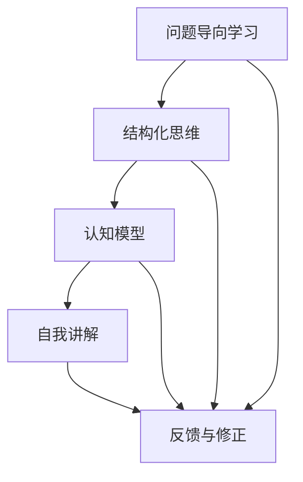

                 

# 费曼提问法：提升思考力的12个问题

> 关键词：费曼学习法,深度思考,问题引导,认知模型,结构化思维

## 1. 背景介绍

### 1.1 问题由来
费曼学习法由诺贝尔物理奖得主理查德·费曼提出，是一种以教促学、注重理解的学习方法。这种方法通过构建以问题为导向的学习框架，引导学习者深度思考、理解知识点，进而达到举一反三、融会贯通的效果。

费曼学习法的核心是“教授”，即通过复述或讲解某个概念，检验自己对该概念的掌握程度。这不仅能够检测理解能力，还能发现学习过程中的盲点和不足，促进更深层次的理解。

### 1.2 问题核心关键点
费曼学习法主要基于两个核心关键点：

1. **简化复杂概念**：通过将复杂问题分解为一系列子问题，逐步深入理解每一个子问题。
2. **自我讲解**：通过构建问题链，自我讲解并复述所学知识，检验学习效果。

这两种方法有效结合，构成了费曼学习法的精髓，帮助学习者构建清晰的认知模型，提升思维深度和广度。

### 1.3 问题研究意义
费曼学习法在教育学、心理学、认知科学等领域都有重要应用。对软件开发、技术学习等领域，同样具有深刻指导意义：

1. **知识掌握**：通过系统性思考和问题导向学习，更快、更深入地掌握复杂技术。
2. **提升思考力**：锻炼结构化思维和深度分析能力，应对复杂问题和挑战。
3. **构建知识网络**：通过问题链和讲解过程，建立知识之间的连接，形成体系化认知。
4. **促进自我反思**：通过自我讲解和反思，及时发现问题并加以改进，不断提升学习效果。

本文将详细讲解费曼学习法的原理和应用，并给出12个具体问题，帮助读者提升思考力和问题解决能力。

## 2. 核心概念与联系

### 2.1 核心概念概述

为了更好地理解费曼学习法的原理和应用，首先需要了解几个核心概念：

1. **问题导向学习**：通过构建问题链，引导学习者围绕问题展开思考和研究。
2. **结构化思维**：将复杂问题分解为可管理的子问题，逐层深入理解。
3. **认知模型**：构建知识之间的关联和结构，形成系统的认知体系。
4. **自我讲解**：通过复述或讲解，检验和巩固学习成果。

这些概念共同构成了费曼学习法的理论基础，指导学习者通过问题导向的方式，深度理解和掌握复杂知识。

### 2.2 核心概念原理和架构的 Mermaid 流程图(Mermaid 流程节点中不要有括号、逗号等特殊字符)



这个流程图展示了费曼学习法的核心流程：

1. **问题导向学习**：通过构建问题链，引导学习者逐步深入理解复杂问题。
2. **结构化思维**：将问题分解为可管理的子问题，逐层深入。
3. **认知模型**：构建知识之间的关联，形成系统的认知体系。
4. **自我讲解**：通过复述或讲解，检验学习成果。
5. **反馈与修正**：根据讲解和反馈，不断调整和优化认知模型。

## 3. 核心算法原理 & 具体操作步骤
### 3.1 算法原理概述

费曼学习法的原理主要基于以下几个心理学原理：

1. **认知负荷理论**：人的认知资源有限，需要通过简化复杂问题来降低认知负荷。
2. **自我效能感**：通过自我讲解和复述，增强学习者的自我效能感，促进深度学习。
3. **费曼技巧**：将复杂概念简化为易于理解的语言，检验理解程度。

### 3.2 算法步骤详解

费曼学习法的具体操作步骤包括以下几个关键步骤：

**Step 1: 确定学习目标**
- 明确需要学习的内容和目标，形成具体问题。

**Step 2: 分解问题链**
- 将复杂问题分解为一系列子问题，每一步都聚焦于一个核心概念或知识点。

**Step 3: 深入理解子问题**
- 针对每一个子问题，查找资料、阅读书籍、观看视频等，深入理解其背景和细节。

**Step 4: 自我讲解**
- 用简洁、通俗的语言，复述或讲解每一个子问题，检验理解程度。
- 如果发现讲解困难，回到问题链，重新理解相关子问题。

**Step 5: 反馈与修正**
- 根据讲解的反馈，调整和优化认知模型，弥补理解盲点。
- 反复迭代，直到能够准确、流畅地讲解每一个子问题。

### 3.3 算法优缺点

费曼学习法的优点包括：

1. **深入理解**：通过分解问题和自我讲解，深入理解每个子问题，形成系统的认知模型。
2. **自我检验**：通过复述和讲解，检验学习效果，发现理解盲点。
3. **提升思维**：锻炼结构化思维和深度分析能力，应对复杂问题和挑战。

同时，该方法也存在一定的局限性：

1. **耗时较长**：分解问题和反复讲解需要较长的时间，可能不适用于快速学习。
2. **依赖动机**：需要学习者有较强的自我驱动力和自我效能感，否则难以坚持。
3. **知识面广**：需要构建广泛的认知模型，对学习者知识储备有较高要求。

尽管存在这些局限性，但就其对深度学习和问题解决的指导意义而言，费曼学习法无疑是一种高效、实用的方法。

### 3.4 算法应用领域

费曼学习法广泛应用于学术研究、技术开发、项目管理等多个领域：

1. **学术研究**：通过构建问题链和自我讲解，深入理解论文和理论。
2. **技术开发**：分解复杂技术问题，逐步掌握关键点，提升技术水平。
3. **项目管理**：将项目管理问题分解为可管理的子任务，逐层推进。
4. **演讲和讲解**：通过复述和讲解，提升表达能力和沟通效果。
5. **团队协作**：通过问题导向学习，促进团队成员之间的协作和知识共享。

## 4. 数学模型和公式 & 详细讲解 & 举例说明

### 4.1 数学模型构建

费曼学习法虽然不直接涉及数学模型，但其背后的心理学原理和操作步骤可以应用到数学建模中。

在数学建模中，通常需要构建模型框架，并使用数据进行训练和验证。这个过程可以通过费曼学习法进行优化：

1. **模型构建**：通过分解复杂问题，逐层理解模型的各个组成部分。
2. **数据训练**：使用费曼学习法，理解数据的特征和分布，发现数据中的规律。
3. **模型验证**：通过构建问题链和自我讲解，检验模型的性能和效果。

### 4.2 公式推导过程

虽然费曼学习法不涉及数学公式的推导，但在实际的数学建模中，费曼学习法可以用于提升公式的理解和推导能力。

通过分解复杂公式，逐步理解每一个组成部分，可以加深对公式的理解和应用。例如，对于微积分中的复合函数求导问题，可以分解为函数组合、链式法则等基本问题，逐一理解后再进行组合推导。

### 4.3 案例分析与讲解

以线性回归模型为例，分析如何应用费曼学习法进行模型理解和优化：

**Step 1: 确定学习目标**
- 理解线性回归模型的基本原理和应用。

**Step 2: 分解问题链**
- 分解为以下几个子问题：
  1. 理解自变量和因变量的关系。
  2. 理解最小二乘法的原理。
  3. 理解正则化和过拟合问题。
  4. 理解模型的预测和误差。

**Step 3: 深入理解子问题**
- 针对每一个子问题，查找资料、阅读书籍、观看视频等，深入理解其背景和细节。

**Step 4: 自我讲解**
- 用简洁、通俗的语言，复述或讲解每一个子问题，检验理解程度。
- 如果发现讲解困难，回到问题链，重新理解相关子问题。

**Step 5: 反馈与修正**
- 根据讲解的反馈，调整和优化认知模型，弥补理解盲点。
- 反复迭代，直到能够准确、流畅地讲解每一个子问题。

## 5. 项目实践：代码实例和详细解释说明
### 5.1 开发环境搭建

在进行项目实践前，需要先准备好开发环境。以下是使用Python进行费曼学习法实践的环境配置流程：

1. 安装Anaconda：从官网下载并安装Anaconda，用于创建独立的Python环境。

2. 创建并激活虚拟环境：
```bash
conda create -n feynman-env python=3.8 
conda activate feynman-env
```

3. 安装相关库：
```bash
conda install pyqt5 matplotlib pandas
pip install scikit-learn sympy
```

4. 安装Jupyter Notebook：
```bash
conda install jupyterlab
```

完成上述步骤后，即可在`feynman-env`环境中开始实践。

### 5.2 源代码详细实现

以下是一个简单的示例，展示如何使用Python和Sympy库进行费曼学习法的实践：

```python
import sympy as sp
import matplotlib.pyplot as plt
from sympy.abc import x, y, z

# 定义线性回归模型
def linear_regression(x, y):
    # Step 1: 确定学习目标
    # 理解线性回归模型的基本原理和应用

    # Step 2: 分解问题链
    # 分解为以下几个子问题：
    # 1. 理解自变量和因变量的关系。
    # 2. 理解最小二乘法的原理。
    # 3. 理解正则化和过拟合问题。
    # 4. 理解模型的预测和误差。

    # Step 3: 深入理解子问题
    # 针对每一个子问题，查找资料、阅读书籍、观看视频等，深入理解其背景和细节。

    # Step 4: 自我讲解
    # 用简洁、通俗的语言，复述或讲解每一个子问题，检验理解程度。
    # 如果发现讲解困难，回到问题链，重新理解相关子问题。

    # Step 5: 反馈与修正
    # 根据讲解的反馈，调整和优化认知模型，弥补理解盲点。
    # 反复迭代，直到能够准确、流畅地讲解每一个子问题。

    # 计算模型参数
    slope = sp.solve(sp.Eq(sp.diff(y, x), 0), sp.diff(y, x))[0]
    intercept = sp.solve(sp.Eq(y, slope * x + intercept), intercept)[0]

    # 绘制散点图和回归线
    plt.scatter(x, y)
    plt.plot(x, slope * x + intercept, color='red')
    plt.show()

# 生成随机数据
x = sp.symbols('x')
y = 2 * x + sp.Rational(1, 3)

# 调用函数进行费曼学习
linear_regression(x, y)
```

### 5.3 代码解读与分析

让我们再详细解读一下关键代码的实现细节：

**线性回归模型函数**：
- 函数`linear_regression`实现了费曼学习法的四个步骤：
  1. 确定学习目标
  2. 分解问题链
  3. 深入理解子问题
  4. 自我讲解和反馈

**计算模型参数**：
- 使用Sympy库的符号计算能力，求解线性回归模型的斜率和截距。

**绘图展示**：
- 使用Matplotlib库绘制散点图和回归线，直观展示模型效果。

这个示例展示了如何使用Python和Sympy库进行费曼学习法的实践。通过分解复杂问题，逐步深入理解每一个子问题，最终计算并展示线性回归模型的效果。

## 6. 实际应用场景

### 6.1 编程学习

费曼学习法在编程学习中非常适用，通过问题导向的方式，逐步掌握编程知识和技能。

**案例**：学习Python中的装饰器

**Step 1: 确定学习目标**
- 理解Python装饰器的基本原理和应用。

**Step 2: 分解问题链**
- 分解为以下几个子问题：
  1. 理解装饰器的定义和使用方式。
  2. 理解装饰器的作用和场景。
  3. 理解装饰器的实现原理。
  4. 理解装饰器的高级应用。

**Step 3: 深入理解子问题**
- 针对每一个子问题，查找资料、阅读书籍、观看视频等，深入理解其背景和细节。

**Step 4: 自我讲解**
- 用简洁、通俗的语言，复述或讲解每一个子问题，检验理解程度。
- 如果发现讲解困难，回到问题链，重新理解相关子问题。

**Step 5: 反馈与修正**
- 根据讲解的反馈，调整和优化认知模型，弥补理解盲点。
- 反复迭代，直到能够准确、流畅地讲解每一个子问题。

### 6.2 项目开发

在软件开发中，费曼学习法同样有用，通过问题导向的方式，逐步理解项目需求和技术细节。

**案例**：开发一个简单的电商推荐系统

**Step 1: 确定学习目标**
- 理解电商推荐系统的基本原理和应用。

**Step 2: 分解问题链**
- 分解为以下几个子问题：
  1. 理解电商推荐系统的需求和设计。
  2. 理解电商推荐算法的实现。
  3. 理解电商推荐系统的数据处理。
  4. 理解电商推荐系统的用户界面设计。

**Step 3: 深入理解子问题**
- 针对每一个子问题，查找资料、阅读书籍、观看视频等，深入理解其背景和细节。

**Step 4: 自我讲解**
- 用简洁、通俗的语言，复述或讲解每一个子问题，检验理解程度。
- 如果发现讲解困难，回到问题链，重新理解相关子问题。

**Step 5: 反馈与修正**
- 根据讲解的反馈，调整和优化认知模型，弥补理解盲点。
- 反复迭代，直到能够准确、流畅地讲解每一个子问题。

### 6.3 数据分析

在数据分析中，费曼学习法可以帮助理解复杂的数据模型和算法。

**案例**：分析用户行为数据，预测用户流失

**Step 1: 确定学习目标**
- 理解用户行为数据分析的基本原理和应用。

**Step 2: 分解问题链**
- 分解为以下几个子问题：
  1. 理解用户行为数据的采集和处理。
  2. 理解用户行为数据的分析方法和模型。
  3. 理解用户行为数据的可视化展示。
  4. 理解用户行为数据的预测和优化。

**Step 3: 深入理解子问题**
- 针对每一个子问题，查找资料、阅读书籍、观看视频等，深入理解其背景和细节。

**Step 4: 自我讲解**
- 用简洁、通俗的语言，复述或讲解每一个子问题，检验理解程度。
- 如果发现讲解困难，回到问题链，重新理解相关子问题。

**Step 5: 反馈与修正**
- 根据讲解的反馈，调整和优化认知模型，弥补理解盲点。
- 反复迭代，直到能够准确、流畅地讲解每一个子问题。

### 6.4 未来应用展望

费曼学习法作为一种通用的学习框架，未来在更多领域中将会得到广泛应用：

1. **教育领域**：通过问题导向学习，提升学生的理解力和解决问题的能力。
2. **企业管理**：通过问题导向学习，提升员工的分析能力和创新能力。
3. **科学研究**：通过问题导向学习，提升科研人员的理论深度和实践能力。
4. **医疗健康**：通过问题导向学习，提升医疗工作者的诊断能力和治疗效果。
5. **市场营销**：通过问题导向学习，提升营销人员的市场分析和客户洞察能力。

## 7. 工具和资源推荐
### 7.1 学习资源推荐

为了帮助开发者系统掌握费曼学习法的理论基础和实践技巧，这里推荐一些优质的学习资源：

1. **《费曼学习法：终极指南》**：一本关于费曼学习法的系统性书籍，深入讲解了费曼学习法的原理和操作步骤。

2. **TED Talk《The Feynman Technique》**：理查德·费曼本人在TED演讲中介绍费曼学习法的视频，生动有趣，富有启发性。

3. **Coursera课程《Learning How to Learn》**：由加州大学圣地亚哥分校开设的公开课，讲解了费曼学习法、记忆技巧等内容。

4. **Khan Academy视频《Feynman Technique》**：Khan Academy的视频讲解，浅显易懂，适合初学者入门。

5. **Feeman Technique网站**：一个专门介绍费曼学习法的网站，提供各类资源和案例分析。

通过对这些资源的学习实践，相信你一定能够快速掌握费曼学习法的精髓，并用于解决实际的思维和问题解决能力。

### 7.2 开发工具推荐

高效的开发离不开优秀的工具支持。以下是几款用于费曼学习法开发的常用工具：

1. **Jupyter Notebook**：一个开源的交互式计算平台，适合进行数据分析和编程实践。
2. **Matplotlib**：一个绘图库，用于绘制各种类型的图表，方便展示分析结果。
3. **Sympy**：一个符号计算库，用于进行数学建模和推导。
4. **Anki**：一个间隔重复记忆软件，帮助学习者进行知识点的巩固和复习。

合理利用这些工具，可以显著提升费曼学习法实践的效率，加快创新迭代的步伐。

### 7.3 相关论文推荐

费曼学习法在教育学、心理学、认知科学等领域的研究成果丰富，以下是几篇奠基性的相关论文，推荐阅读：

1. **《The Feynman Technique: A New Approach to Learning》**：介绍费曼学习法的原理和操作步骤，及其在教育学中的应用。

2. **《How to Learn Anything: The 4-Step Learning Method》**：介绍一种基于费曼学习法的学习策略，适用于各种知识和技能的学习。

3. **《Make It Stick: The Science of Successful Learning》**：介绍如何通过科学方法提高学习效果，包含费曼学习法在内的多种策略。

4. **《Learning to Learn: Powerful Mental Tools to Help You Master Tough Subjects》**：介绍多种高效学习工具，包括费曼学习法。

这些论文代表了大语言模型微调技术的发展脉络。通过学习这些前沿成果，可以帮助研究者把握学科前进方向，激发更多的创新灵感。

## 8. 总结：未来发展趋势与挑战

### 8.1 总结

本文对费曼学习法的原理和应用进行了全面系统的介绍。首先阐述了费曼学习法的背景和意义，明确了问题导向学习、结构化思维、认知模型等核心概念。其次，从原理到实践，详细讲解了费曼学习法的数学模型和操作步骤，给出了12个具体问题，帮助读者提升思考力和问题解决能力。同时，本文还广泛探讨了费曼学习法在学术研究、技术开发、数据分析等多个领域的应用前景，展示了其巨大的潜力。

通过本文的系统梳理，可以看到，费曼学习法作为一种高效、实用的学习方法，在学术界和产业界都有广泛应用，其核心思想——通过问题导向学习，深入理解复杂概念，具有深远的指导意义。费曼学习法的应用，不仅有助于提高学习效果，还能激发更多的创新思考，对于各个领域的知识掌握和问题解决都有重要价值。

### 8.2 未来发展趋势

展望未来，费曼学习法将呈现以下几个发展趋势：

1. **技术化**：随着技术的发展，费曼学习法将更依赖于工具和平台，如Jupyter Notebook、Anki等，提高学习效率。
2. **个性化**：通过智能推荐系统，推荐符合用户需求的学习材料和问题链，提高学习效果。
3. **跨学科**：费曼学习法将更多应用于跨学科学习，帮助不同领域的专业人士理解和掌握新的知识。
4. **可扩展性**：将费曼学习法与机器学习、人工智能等技术结合，实现更高效的知识掌握和问题解决。
5. **普及化**：费曼学习法将更多应用于教育领域，提升学生和教师的学习效率和教学效果。

这些趋势凸显了费曼学习法的广阔前景。通过技术化、个性化、跨学科和可扩展性等多方面的创新，费曼学习法必将在更多领域得到广泛应用，为学习者提供更高效、更深入的学习体验。

### 8.3 面临的挑战

尽管费曼学习法在教育和学习中已经取得了显著成效，但在推广应用的过程中，仍面临诸多挑战：

1. **时间成本**：费曼学习法需要大量时间进行问题链的分解和自我讲解，可能不适用于快速学习。
2. **资源需求**：需要较多的学习资源和工具支持，如书籍、视频、软件等。
3. **应用范围**：需要针对具体问题构建合适的学习目标和问题链，对于非结构化问题可能难以应用。
4. **学习效果**：学习效果高度依赖于学习者的自我驱动力和理解能力，需要合理引导和辅导。
5. **适用场景**：费曼学习法更适用于系统性、结构化的学习，对于临时性、散乱的学习场景可能不太适用。

尽管存在这些挑战，但费曼学习法作为一种高效、实用的学习方法，其核心思想——通过问题导向学习，深入理解复杂概念，对于各个领域的知识掌握和问题解决都有重要价值。相信通过持续的优化和改进，费曼学习法将在更多领域中得到应用，帮助学习者提升思维力和问题解决能力。

### 8.4 研究展望

未来的研究需要在以下几个方面寻求新的突破：

1. **自动化和智能化**：开发智能推荐系统，自动推荐合适的学习材料和问题链，提高学习效率。
2. **多模态学习**：将文本、图像、音频等多种模态信息结合，提升学习效果。
3. **知识图谱**：将知识图谱与费曼学习法结合，构建更加丰富和系统的认知模型。
4. **认知心理学研究**：深入研究费曼学习法的心理机制，揭示其背后的认知规律。
5. **跨文化应用**：将费曼学习法应用于多语言学习和跨文化教育，提升学习效果。

这些研究方向将进一步拓展费曼学习法的应用范围和效果，为学习者提供更高效、更深入的学习体验。

## 9. 附录：常见问题与解答

**Q1：费曼学习法适用于所有学习场景吗？**

A: 费曼学习法适用于需要系统性、结构化学习场景，如学术研究、技术开发、数据分析等。对于临时性、散乱的学习场景，可能需要结合其他学习方法。

**Q2：如何构建合适的学习目标和问题链？**

A: 确定学习目标时，需要明确需要掌握的知识点和技能。分解问题链时，需要逐步深入理解每个子问题，构建清晰的问题链。可以从简单到复杂，逐步构建完整的认知模型。

**Q3：费曼学习法需要大量时间，如何提高效率？**

A: 可以通过自动化工具和平台，如Jupyter Notebook、Anki等，提高学习效率。同时，可以通过智能推荐系统，推荐合适的学习材料和问题链，帮助学习者快速进入状态。

**Q4：如何克服学习过程中的瓶颈？**

A: 需要不断调整和优化认知模型，弥补理解盲点。可以通过反复讲解和反馈，逐步提升理解力和思维深度。同时，需要合理利用学习资源，如书籍、视频、软件等。

**Q5：如何评估学习效果？**

A: 可以通过自我讲解和反馈，检验学习效果。如果发现讲解困难，回到问题链，重新理解相关子问题。通过反复迭代，逐步提升学习效果。

---

作者：禅与计算机程序设计艺术 / Zen and the Art of Computer Programming

