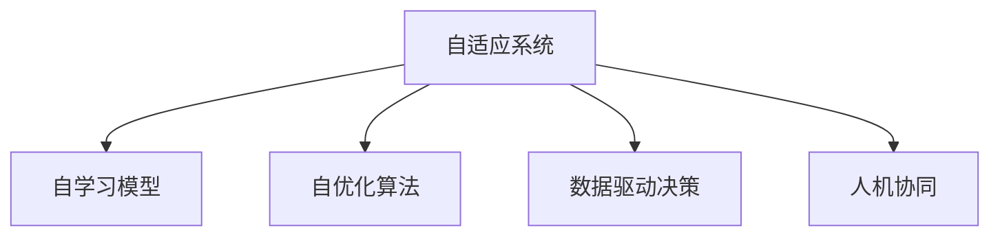

                 

# 软件 2.0 的未来展望：更智能、更强大

## 1. 背景介绍

在过去的几十年里，软件技术经历了从软件 1.0 到软件 2.0 的演进，从基于命令行的交互式编程语言到高级抽象语言，从简单的软件工具到复杂的系统架构。现在，我们正处在软件 2.0 向软件 3.0 过渡的时期，这一阶段将标志着软件更加智能、更强大的突破。

软件 2.0 的到来，得益于云计算、大数据、人工智能和机器学习的飞速发展。软件 2.0 不仅能够实现业务逻辑的自动化，还能够自学习、自优化，从而更好地适应复杂多变的市场需求。

本文将深入探讨软件 2.0 的核心概念、算法原理、具体实现和未来展望，帮助读者全面理解这一技术变革，并思考其对企业战略和技术架构的影响。

## 2. 核心概念与联系

### 2.1 核心概念概述

软件 2.0 的核心概念包括以下几个关键点：

- **自适应系统**：能够根据环境变化和用户需求自适应调整的软件系统。
- **自学习模型**：通过数据训练和优化算法，自动学习新知识和改进性能的模型。
- **自优化算法**：能够自动调整参数和资源分配，实现最优性能的软件算法。
- **数据驱动决策**：基于大量数据进行分析、预测和决策的软件系统。
- **人机协同**：将人类智能与机器智能相结合，实现高效协同的软件系统。

### 2.2 核心概念原理和架构的 Mermaid 流程图



这一流程图展示了软件 2.0 的核心理念和各个组件之间的联系。自适应系统是基础，通过自学习模型、自优化算法、数据驱动决策和人机协同等多维度的技术支持，实现智能、强大多样的软件应用。

## 3. 核心算法原理 & 具体操作步骤

### 3.1 算法原理概述

软件 2.0 的核心算法原理主要基于机器学习、深度学习和强化学习。

- **机器学习**：通过统计学习方法，从数据中学习到通用的知识，用于预测和分类等任务。
- **深度学习**：利用多层神经网络，实现对复杂非线性关系的建模，广泛应用于图像识别、语音识别等领域。
- **强化学习**：通过试错和奖励机制，训练模型在特定环境中学习最优策略，用于自动控制和优化决策。

### 3.2 算法步骤详解

软件 2.0 的算法步骤包括数据收集、模型训练、性能优化和部署应用四个环节。

#### 3.2.1 数据收集

- **数据源**：来自各种渠道的数据，包括日志、传感器数据、用户行为数据等。
- **数据处理**：数据清洗、特征提取和预处理，确保数据质量和可用性。

#### 3.2.2 模型训练

- **模型选择**：根据任务需求选择合适的机器学习、深度学习或强化学习模型。
- **训练过程**：通过迭代训练和优化算法，调整模型参数，优化模型性能。
- **超参数调优**：通过网格搜索、贝叶斯优化等方法，调整模型超参数，提高模型泛化能力。

#### 3.2.3 性能优化

- **模型调优**：通过模型压缩、剪枝、蒸馏等技术，优化模型结构和性能。
- **资源管理**：通过自动资源分配和负载均衡，提高系统效率。
- **算法优化**：通过算法优化和优化算法，提升模型执行效率和响应速度。

#### 3.2.4 部署应用

- **应用集成**：将优化后的模型集成到业务系统中，实现自动化和智能决策。
- **监控和反馈**：实时监控模型性能，根据反馈数据调整模型参数和策略。
- **持续学习**：通过在线学习机制，模型能够不断学习新数据和知识，提升性能。

### 3.3 算法优缺点

#### 3.3.1 优点

- **自动化**：软件 2.0 实现了业务逻辑的自动化，减少了人工干预，提高了工作效率。
- **自适应**：能够根据环境变化和用户需求自适应调整，提高了系统的灵活性和响应速度。
- **自学习**：通过自学习模型，能够不断学习新知识和改进性能，提升了系统的智能水平。
- **高效性**：利用自优化算法和大数据驱动，提高了系统的运行效率和资源利用率。
- **可扩展性**：能够通过横向扩展和垂直扩展，适应业务规模的增长。

#### 3.3.2 缺点

- **数据依赖**：依赖于高质量、大量的数据，数据获取和处理成本较高。
- **模型复杂**：深度学习模型复杂度高，需要大量计算资源和存储空间。
- **隐私和安全**：模型训练和应用过程中可能涉及敏感数据，需要加强隐私保护和数据安全。
- **可解释性**：深度学习模型的决策过程缺乏可解释性，难以理解其内部工作机制。
- **伦理问题**：模型的决策可能涉及伦理和道德问题，需要考虑公平性、透明性和责任性。

### 3.4 算法应用领域

软件 2.0 的应用领域非常广泛，涉及多个行业和领域：

- **金融**：用于风险评估、信用评分、智能投顾等。
- **医疗**：用于诊断辅助、患者管理、药物研发等。
- **零售**：用于个性化推荐、库存管理、客户服务等。
- **制造**：用于预测维护、质量控制、供应链优化等。
- **交通**：用于智能交通管理、路径规划、自动驾驶等。
- **能源**：用于需求预测、资源优化、智能调度等。
- **农业**：用于精准农业、灾害预测、智能灌溉等。

## 4. 数学模型和公式 & 详细讲解 & 举例说明

### 4.1 数学模型构建

软件 2.0 的数学模型构建主要涉及以下几个方面：

- **特征工程**：从原始数据中提取有意义的特征，用于训练模型。
- **模型选择**：选择适合的机器学习、深度学习或强化学习模型。
- **训练和优化**：使用优化算法（如梯度下降、Adam等）训练模型，并进行超参数调优。
- **性能评估**：使用指标（如准确率、召回率、F1分数等）评估模型性能。

### 4.2 公式推导过程

以线性回归模型为例，其公式推导过程如下：

$$
y = \theta_0 + \theta_1x_1 + \theta_2x_2 + ... + \theta_nx_n
$$

其中，$y$ 为预测值，$x_i$ 为输入特征，$\theta_i$ 为模型参数。

通过最小二乘法求解模型参数：

$$
\theta = (X^TX)^{-1}X^Ty
$$

其中，$X$ 为特征矩阵，$y$ 为标签向量。

### 4.3 案例分析与讲解

以金融风险评估为例，利用线性回归模型预测贷款违约概率。

- **数据准备**：收集贷款申请数据，包括申请人年龄、收入、信用评分、贷款金额等。
- **特征工程**：提取年龄、收入、信用评分、贷款金额等特征，用于训练模型。
- **模型训练**：使用梯度下降算法训练线性回归模型，调整模型参数。
- **性能评估**：使用准确率、召回率、F1分数等指标评估模型性能。
- **结果解释**：根据模型预测结果，调整贷款审批策略，降低违约风险。

## 5. 项目实践：代码实例和详细解释说明

### 5.1 开发环境搭建

为了实现软件 2.0 的项目实践，需要搭建一个Python开发环境。

- **安装Python**：安装最新版本的Python，建议使用Anaconda或Miniconda。
- **安装依赖库**：安装必要的依赖库，如NumPy、Pandas、Scikit-learn、TensorFlow等。
- **配置开发环境**：配置环境变量，确保Python路径正确。

### 5.2 源代码详细实现

以线性回归模型为例，展示软件 2.0 的实现代码。

```python
import numpy as np
from sklearn.linear_model import LinearRegression
from sklearn.model_selection import train_test_split
from sklearn.metrics import mean_squared_error

# 数据准备
X = np.array([[10, 5000, 700], [20, 7000, 800], [30, 9000, 900], [40, 10000, 1000]])
y = np.array([0, 0, 1, 1])

# 特征工程
X_train, X_test, y_train, y_test = train_test_split(X, y, test_size=0.2)

# 模型训练
model = LinearRegression()
model.fit(X_train, y_train)

# 性能评估
y_pred = model.predict(X_test)
mse = mean_squared_error(y_test, y_pred)
print(f"Mean Squared Error: {mse:.2f}")
```

### 5.3 代码解读与分析

- **数据准备**：收集和准备数据，包括特征和标签。
- **特征工程**：使用`train_test_split`函数将数据集划分为训练集和测试集。
- **模型训练**：使用`LinearRegression`模型训练线性回归模型，调整模型参数。
- **性能评估**：使用均方误差（MSE）评估模型性能。

## 6. 实际应用场景

### 6.1 智能客服系统

智能客服系统是软件 2.0 的一个典型应用。通过自然语言处理（NLP）和机器学习技术，智能客服能够自动回答客户咨询，解决常见问题，提供个性化服务。

- **数据来源**：收集客户咨询记录，包括问题、回答、客户满意度等。
- **模型训练**：使用文本分类、情感分析等技术，训练NLP模型。
- **智能客服**：将模型集成到客服系统中，实现自动回答和反馈。
- **持续改进**：根据客户反馈和模型性能，不断优化和更新模型。

### 6.2 智能推荐系统

智能推荐系统是软件 2.0 的另一个重要应用。通过深度学习和强化学习技术，推荐系统能够根据用户行为和偏好，推荐个性化产品或内容。

- **数据来源**：收集用户浏览记录、购买记录、评分等数据。
- **模型训练**：使用协同过滤、深度学习等技术，训练推荐模型。
- **推荐服务**：将模型集成到推荐系统中，实现个性化推荐。
- **持续优化**：根据用户反馈和模型效果，不断调整和优化推荐策略。

### 6.3 自动驾驶

自动驾驶是软件 2.0 在交通领域的应用。通过计算机视觉、深度学习和强化学习技术，自动驾驶系统能够实现环境感知、路径规划和控制决策。

- **数据来源**：收集车辆传感器数据、道路交通数据、环境数据等。
- **模型训练**：使用计算机视觉、深度学习技术，训练感知和决策模型。
- **自动驾驶**：将模型集成到自动驾驶系统中，实现环境感知和路径规划。
- **持续改进**：根据实际驾驶情况和模型效果，不断优化和更新模型。

## 7. 工具和资源推荐

### 7.1 学习资源推荐

为了深入学习软件 2.0 技术，推荐以下学习资源：

- **Coursera**：提供机器学习和深度学习课程，涵盖从基础到高级的多个方面。
- **edX**：提供计算机视觉、自然语言处理等领域的课程，包括软件 2.0 相关内容。
- **Google AI**：提供深度学习和强化学习的教程和资源，适合自学和实践。
- **TensorFlow** 和 **PyTorch**：提供丰富的文档和样例代码，适合深度学习实践。
- **Kaggle**：提供数据科学竞赛和项目，适合实践和验证学习成果。

### 7.2 开发工具推荐

为了实现软件 2.0 的开发和部署，推荐以下开发工具：

- **Jupyter Notebook**：用于数据处理、模型训练和结果展示。
- **TensorBoard**：用于模型训练和性能监控。
- **Kubeflow**：用于机器学习模型的自动化部署和运维。
- **AWS SageMaker**：提供云端机器学习平台，支持模型训练、部署和管理。
- **Google Cloud AI Platform**：提供云计算和机器学习服务，支持模型训练和部署。

### 7.3 相关论文推荐

为了深入了解软件 2.0 的研究进展，推荐以下相关论文：

- **"Deep Learning with Python"** by Ian Goodfellow, Yoshua Bengio, Aaron Courville
- **"Hands-On Machine Learning with Scikit-Learn, Keras, and TensorFlow"** by Aurélien Géron
- **"Programming for Humanity"** by Yoav Shpilka and Oded Goldreich
- **"Introduction to Machine Learning with Python"** by Andreas C. Müller and Sarah Guido
- **"Machine Learning Yearning"** by Andrew Ng

## 8. 总结：未来发展趋势与挑战

### 8.1 研究成果总结

软件 2.0 技术的引入，极大地提升了软件的智能化水平和业务效率。通过自学习、自适应和自优化，软件 2.0 能够更好地适应复杂多变的市场需求，提高系统的响应速度和稳定性。

### 8.2 未来发展趋势

未来，软件 2.0 将呈现出以下几个发展趋势：

- **更智能**：通过深度学习和强化学习技术，软件 2.0 将变得更加智能，能够处理更加复杂和不确定的任务。
- **更强大**：利用云计算和大数据技术，软件 2.0 将具备更强的计算能力和资源支持，提高系统的扩展性和性能。
- **更高效**：通过自动调优和优化算法，软件 2.0 将实现更高效率的资源利用和任务处理。
- **更安全**：利用区块链和加密技术，软件 2.0 将提高数据和模型的安全性，防止数据泄露和攻击。
- **更透明**：通过可解释性技术，软件 2.0 将提供更透明的决策过程和解释机制，增强系统的可信度和可接受性。

### 8.3 面临的挑战

尽管软件 2.0 带来了诸多优势，但在其实现和应用过程中，仍面临以下几个挑战：

- **数据获取和处理**：高质量数据的获取和处理成本较高，且数据隐私和安全问题需要解决。
- **模型复杂度**：深度学习模型的复杂度较高，需要大量的计算资源和存储空间。
- **算法可解释性**：深度学习模型的决策过程缺乏可解释性，难以理解其内部工作机制。
- **系统鲁棒性**：模型在面对异常数据和环境变化时，需要具备更强的鲁棒性和稳定性。
- **伦理和法律**：模型的决策可能涉及伦理和法律问题，需要考虑公平性、透明性和责任性。

### 8.4 研究展望

未来的研究将聚焦于以下几个方向：

- **数据隐私保护**：通过差分隐私和联邦学习等技术，保护数据隐私和安全性。
- **算法可解释性**：通过可解释性技术，增强模型的决策过程和解释机制，提高系统的可信度。
- **鲁棒性和稳定性**：通过鲁棒性测试和模型优化，提高模型在面对异常数据和环境变化时的鲁棒性和稳定性。
- **跨领域知识整合**：通过多模态融合和跨领域知识整合，提升系统的智能水平和适应性。
- **伦理和法律规范**：制定伦理和法律规范，确保模型的公平性、透明性和责任性，避免潜在的负面影响。

## 9. 附录：常见问题与解答

**Q1: 什么是软件 2.0 技术？**

A: 软件 2.0 技术是基于机器学习、深度学习和强化学习等先进技术，实现业务逻辑自动化、自学习、自适应和自优化的一类软件系统。

**Q2: 软件 2.0 的应用场景有哪些？**

A: 软件 2.0 的应用场景非常广泛，包括智能客服、智能推荐、自动驾驶、金融风险评估、医疗诊断辅助等。

**Q3: 如何构建软件 2.0 的数学模型？**

A: 软件 2.0 的数学模型构建主要涉及特征工程、模型选择、训练和优化、性能评估等环节。

**Q4: 如何提高软件 2.0 的鲁棒性和稳定性？**

A: 通过鲁棒性测试、模型优化、数据增强等技术，提高软件 2.0 的鲁棒性和稳定性。

**Q5: 软件 2.0 的技术挑战有哪些？**

A: 数据获取和处理、模型复杂度、算法可解释性、系统鲁棒性、伦理和法律问题是软件 2.0 面临的主要挑战。

作者：禅与计算机程序设计艺术 / Zen and the Art of Computer Programming

