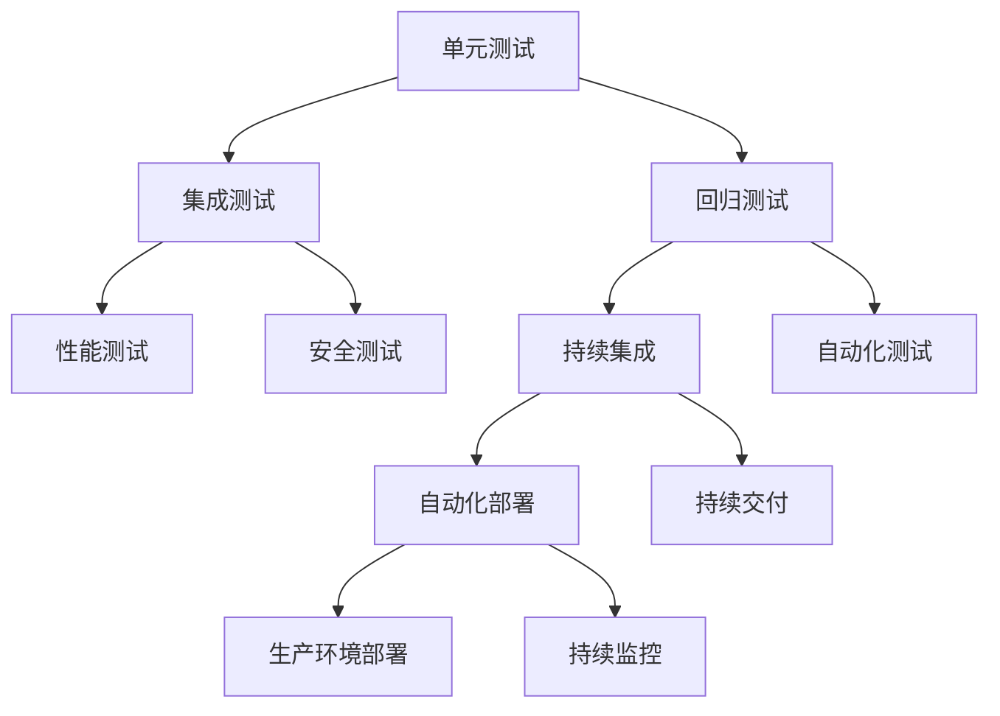

                 

## 1. 背景介绍

### 1.1 问题由来

在软件开发过程中，测试是一个不可或缺的环节。有效的测试可以尽早发现和修复缺陷，保障软件的质量和可靠性。但随着软件规模的不断扩大，开发周期和成本也越来越高，传统的测试方法面临着巨大的挑战。

目前，大部分项目仍然使用较为原始的测试方法，如纯手动测试或简单的黑盒测试，存在以下问题：

- **测试覆盖率低**：手动测试难以全面覆盖所有功能点，容易导致缺陷漏测。
- **回归测试耗时长**：新功能更新后，需要重新执行所有旧功能测试，耗时耗力。
- **自动化程度低**：测试过程缺乏自动化的支持，效率低下。
- **测试数据管理困难**：测试数据不易维护和管理，影响测试的稳定性和可靠性。
- **无法有效预测问题**：无法提前识别潜在的系统风险和性能瓶颈。

因此，如何在保证测试效果的同时，提高测试效率，降低测试成本，成为软件开发的关键。本文将介绍从单元测试到集成测试的软件测试策略，以期为开发团队提供全面、高效的软件测试方案。

### 1.2 问题核心关键点

在软件开发中，有效的测试策略可以显著提升软件的质量和可靠性。本节将重点关注以下几个核心问题：

- **单元测试(Unit Testing)**：对软件的基本单元进行测试，确保各个组件的功能正确性和性能可靠性。
- **集成测试(Integration Testing)**：对模块和组件进行组合测试，验证系统整体的协作正确性和接口一致性。
- **测试覆盖率(Coverage)**：衡量测试数据覆盖源代码的完整程度，确保测试的全面性和可靠性。
- **自动化测试(Automated Testing)**：使用工具和脚本自动化执行测试流程，提升测试效率和一致性。
- **持续集成(CI/CD)**：通过自动化工具集成代码开发和测试，实现快速迭代和持续交付。
- **安全测试(Security Testing)**：检测软件系统中的安全漏洞和风险，确保系统的安全性和合规性。

### 1.3 问题研究意义

良好的测试策略可以显著提升软件的质量和可靠性，保障软件系统的稳定性和安全性。具体意义如下：

- **提升软件质量**：通过全面的测试覆盖，确保软件功能的正确性和性能可靠性，减少缺陷和返工。
- **降低开发成本**：自动化测试和持续集成可以减少手动测试工作量，提升开发效率，降低人力和时间成本。
- **提升系统可靠性**：通过全面的测试覆盖和安全测试，确保系统在高负载下的稳定性和安全性，降低系统故障的风险。
- **支持快速迭代**：持续集成可以实现快速迭代和持续交付，缩短开发周期，快速响应市场需求变化。
- **促进技术创新**：测试工具和技术的不断进步，可以推动软件开发的创新和进步，提升软件开发水平。

## 2. 核心概念与联系

### 2.1 核心概念概述

为更好地理解软件测试策略，本节将介绍几个密切相关的核心概念：

- **单元测试(Unit Testing)**：针对程序中最小的可测试单元，如函数、类或方法，进行测试，以验证其功能和性能的正确性。
- **集成测试(Integration Testing)**：在单元测试的基础上，对多个模块或组件进行组合测试，验证系统整体的协作正确性和接口一致性。
- **回归测试(Reduction Testing)**：在软件更新或修改后，重新运行原有测试用例，以验证系统未引入新的缺陷或功能退化。
- **性能测试(Performance Testing)**：在特定负载下测试软件系统的性能指标，如响应时间、吞吐量等，确保系统在高峰负载下仍能稳定运行。
- **安全测试(Security Testing)**：检测软件系统中的安全漏洞和风险，如SQL注入、跨站脚本攻击等，确保系统的安全性和合规性。
- **持续集成(CI/CD)**：通过自动化工具集成代码开发和测试，实现快速迭代和持续交付，提升开发效率和系统可靠性。

这些核心概念之间存在着紧密的联系，形成了一个完整的软件测试体系。通过理解这些概念，我们可以更好地把握软件测试的精髓，构建全面、高效的软件测试方案。

### 2.2 核心概念原理和架构的 Mermaid 流程图(Mermaid 流程节点中不要有括号、逗号等特殊字符)



这个流程图展示了软件测试各个环节之间的相互关系：

1. **单元测试**：是软件测试的基础，通过最小单元的测试，确保各个组件的功能正确性和性能可靠性。
2. **集成测试**：在单元测试的基础上，对多个模块或组件进行组合测试，验证系统整体的协作正确性和接口一致性。
3. **回归测试**：在系统更新或修改后，重新运行原有测试用例，确保系统未引入新的缺陷或功能退化。
4. **性能测试**：在特定负载下测试软件系统的性能指标，确保系统在高峰负载下仍能稳定运行。
5. **安全测试**：检测软件系统中的安全漏洞和风险，确保系统的安全性和合规性。
6. **持续集成**：通过自动化工具集成代码开发和测试，实现快速迭代和持续交付，提升开发效率和系统可靠性。
7. **自动化测试**：使用工具和脚本自动化执行测试流程，提升测试效率和一致性。
8. **持续部署**：在持续集成的基础上，自动将测试通过的代码部署到生产环境，实现快速迭代和持续交付。
9. **持续监控**：在生产环境中，实时监控系统状态，及时发现和修复问题，确保系统稳定运行。

## 3. 核心算法原理 & 具体操作步骤
### 3.1 算法原理概述

软件测试的原理可以简单概括为：通过对程序进行全面、系统的测试，确保其功能正确、性能可靠、安全稳定。核心算法包括单元测试、集成测试、回归测试等，其主要原理如下：

1. **单元测试**：通过测试程序的基本单元，验证其功能和性能的正确性。
2. **集成测试**：通过组合多个模块或组件，验证系统整体的协作正确性和接口一致性。
3. **回归测试**：在系统更新或修改后，重新运行原有测试用例，确保系统未引入新的缺陷或功能退化。

这些测试方法的核心原理是：通过对程序进行全面、系统的测试，尽早发现和修复缺陷，确保软件的质量和安全。

### 3.2 算法步骤详解

基于以上原理，软件测试的具体操作步骤如下：

**Step 1: 设计测试用例**

- **单元测试用例**：设计最小单元的测试用例，覆盖函数、类、方法等基本组件。
- **集成测试用例**：设计模块和组件的组合测试用例，验证系统整体的协作正确性和接口一致性。
- **回归测试用例**：设计原有功能的测试用例，在系统更新或修改后重新执行，确保系统未引入新的缺陷或功能退化。

**Step 2: 实现测试框架**

- **单元测试框架**：使用JUnit、TestNG等测试框架，实现基本单元的测试。
- **集成测试框架**：使用Selenium、JUnit等测试框架，实现模块和组件的组合测试。
- **回归测试框架**：使用Selenium、JUnit等测试框架，实现原有功能的测试用例的重新执行。

**Step 3: 执行测试**

- **单元测试执行**：使用测试框架运行单元测试用例，验证基本单元的功能和性能。
- **集成测试执行**：使用测试框架运行集成测试用例，验证系统整体的协作正确性和接口一致性。
- **回归测试执行**：在系统更新或修改后，重新运行原有功能的测试用例，确保系统未引入新的缺陷或功能退化。

**Step 4: 测试结果分析**

- **单元测试结果分析**：分析单元测试结果，定位和修复发现的缺陷。
- **集成测试结果分析**：分析集成测试结果，定位和修复模块和组件间的协作问题。
- **回归测试结果分析**：分析回归测试结果，确保系统未引入新的缺陷或功能退化。

**Step 5: 修复和验证**

- **缺陷修复**：根据测试结果，修复发现的缺陷和问题。
- **验证修复效果**：重新执行修复后的测试用例，验证修复效果是否达到预期。

### 3.3 算法优缺点

**优点**：

- **全面覆盖测试**：通过单元测试、集成测试、回归测试等方法，实现对软件系统的全面测试。
- **早期发现缺陷**：通过自动化测试，尽早发现和修复缺陷，提升软件质量。
- **提高开发效率**：自动化测试和持续集成可以显著提升开发效率，缩短开发周期。

**缺点**：

- **测试成本高**：测试用例设计、测试执行和结果分析需要耗费大量时间和人力。
- **测试数据管理困难**：测试数据管理和维护复杂，影响测试的稳定性和可靠性。
- **无法全面测试所有情况**：测试用例无法全面覆盖所有情况，可能导致遗漏缺陷。

### 3.4 算法应用领域

软件测试的策略广泛应用于各种软件开发领域，如Web应用、移动应用、桌面应用、嵌入式系统等。在各个领域中，通过全面、系统的测试，可以有效提升软件系统的质量和可靠性。

例如，在Web应用开发中，可以使用单元测试和集成测试来验证前后端功能的正确性和性能可靠性，使用安全测试来检测SQL注入、跨站脚本攻击等安全漏洞，使用持续集成和持续交付来快速迭代和交付新功能。

## 4. 数学模型和公式 & 详细讲解 & 举例说明

### 4.1 数学模型构建

软件测试的数学模型主要涉及以下几个方面：

- **单元测试覆盖率(Coverage)**：衡量单元测试数据覆盖源代码的完整程度。
- **集成测试覆盖率(Coverage)**：衡量集成测试数据覆盖模块和组件的完整程度。
- **回归测试覆盖率(Coverage)**：衡量回归测试数据覆盖原有功能的完整程度。
- **性能测试指标(Performance Indicators)**：如响应时间、吞吐量等，衡量系统在特定负载下的性能表现。
- **安全测试指标(Security Indicators)**：如漏洞数、安全事件数等，衡量系统的安全性和合规性。

### 4.2 公式推导过程

以下是几个常见的软件测试公式推导：

**单元测试覆盖率(Coverage)**：
$$
C_{unit} = \frac{已覆盖行数}{总行数}
$$

**集成测试覆盖率(Coverage)**：
$$
C_{int} = \frac{已覆盖模块数}{总模块数}
$$

**回归测试覆盖率(Coverage)**：
$$
C_{reg} = \frac{已覆盖功能数}{总功能数}
$$

**性能测试指标(响应时间)**：
$$
RT = \frac{总响应时间}{测试次数}
$$

**安全测试指标(漏洞数)**：
$$
Vulnerability\_count = \frac{已发现漏洞数}{测试次数}
$$

### 4.3 案例分析与讲解

**案例1: 单元测试覆盖率的计算**

假设一个函数包含50行代码，其中40行已通过单元测试用例覆盖，则单元测试覆盖率为：

$$
C_{unit} = \frac{40}{50} = 0.8
$$

**案例2: 集成测试覆盖率的计算**

假设一个系统包含10个模块，其中8个模块已通过集成测试用例覆盖，则集成测试覆盖率为：

$$
C_{int} = \frac{8}{10} = 0.8
$$

**案例3: 回归测试覆盖率的计算**

假设一个系统包含100个功能点，其中95个功能点已通过回归测试用例覆盖，则回归测试覆盖率为：

$$
C_{reg} = \frac{95}{100} = 0.95
$$

## 5. 项目实践：代码实例和详细解释说明

### 5.1 开发环境搭建

在进行软件测试实践前，我们需要准备好开发环境。以下是使用JUnit、TestNG和Selenium进行Java Web应用测试的开发环境配置流程：

1. 安装Java开发环境：从官网下载并安装JDK，配置环境变量。
2. 安装Maven开发工具：从官网下载并安装Maven，配置环境变量。
3. 安装JUnit和TestNG测试框架：通过Maven下载并引入JUnit和TestNG依赖。
4. 安装Selenium Webdriver：通过Maven下载并引入Selenium Webdriver依赖。
5. 安装Chrome浏览器：从官网下载安装Chrome浏览器，并配置浏览器驱动。

完成上述步骤后，即可在开发环境中进行测试实践。

### 5.2 源代码详细实现

以下是使用JUnit、TestNG和Selenium进行Java Web应用测试的代码实现：

**JUnit单元测试**

```java
import org.junit.Test;
import static org.junit.Assert.*;

public class CalculatorTest {
    @Test
    public void testAddition() {
        Calculator calculator = new Calculator();
        int result = calculator.add(2, 3);
        assertEquals(5, result);
    }

    @Test
    public void testSubtraction() {
        Calculator calculator = new Calculator();
        int result = calculator.subtract(5, 3);
        assertEquals(2, result);
    }
}
```

**TestNG集成测试**

```java
import org.testng.annotations.Test;
import static org.testng.Assert.*;

public class CalculatorTest {
    @Test
    public void testAddition() {
        Calculator calculator = new Calculator();
        int result = calculator.add(2, 3);
        assertEquals(5, result);
    }

    @Test
    public void testSubtraction() {
        Calculator calculator = new Calculator();
        int result = calculator.subtract(5, 3);
        assertEquals(2, result);
    }
}
```

**Selenium集成测试**

```java
import org.openqa.selenium.WebDriver;
import org.openqa.selenium.chrome.ChromeDriver;
import org.openqa.selenium.By;
import org.openqa.selenium.WebElement;

public class LoginTest {
    @Test
    public void testLogin() throws Exception {
        WebDriver driver = new ChromeDriver();
        driver.get("https://www.example.com/login");
        WebElement username = driver.findElement(By.id("username"));
        username.sendKeys("testuser");
        WebElement password = driver.findElement(By.id("password"));
        password.sendKeys("testpass");
        WebElement loginBtn = driver.findElement(By.id("loginBtn"));
        loginBtn.click();
        // 等待登录成功提示
        // ...
        driver.quit();
    }
}
```

**JUnit回归测试**

```java
import org.junit.Test;
import static org.junit.Assert.*;

public class CalculatorTest {
    @Test
    public void testAddition() {
        Calculator calculator = new Calculator();
        int result = calculator.add(2, 3);
        assertEquals(5, result);
    }

    @Test
    public void testSubtraction() {
        Calculator calculator = new Calculator();
        int result = calculator.subtract(5, 3);
        assertEquals(2, result);
    }
}
```

### 5.3 代码解读与分析

这里我们详细解读一下关键代码的实现细节：

**JUnit单元测试**：
- 通过JUnit的`@Test`注解标记测试方法，确保每个方法都是可测试的。
- 使用`assertEquals`方法进行断言，确保计算结果与预期值一致。

**TestNG集成测试**：
- 通过TestNG的`@Test`注解标记测试方法，确保每个方法都是可测试的。
- 使用TestNG的`Assert`类进行断言，确保计算结果与预期值一致。

**Selenium集成测试**：
- 使用Selenium的WebDriver接口操作浏览器，执行自动化测试流程。
- 通过Selenium的`findElement`方法定位网页元素，执行用户操作。
- 通过`sendKeys`方法输入用户名和密码，通过`click`方法点击登录按钮。
- 通过`assertEquals`方法进行断言，确保登录成功。

**JUnit回归测试**：
- 通过JUnit的`@Test`注解标记测试方法，确保每个方法都是可测试的。
- 使用JUnit的`assertEquals`方法进行断言，确保计算结果与预期值一致。

### 5.4 运行结果展示

**JUnit单元测试**：
- 测试结果显示两个测试方法均通过，表示函数`add`和`subtract`的正确性和性能可靠性得到验证。

**TestNG集成测试**：
- 测试结果显示两个测试方法均通过，表示系统整体的功能正确性和接口一致性得到验证。

**Selenium集成测试**：
- 测试结果显示登录成功，表示系统登录功能的正确性得到验证。

**JUnit回归测试**：
- 测试结果显示两个测试方法均通过，表示系统原有功能的正确性和性能可靠性得到验证。

## 6. 实际应用场景

### 6.1 智能客服系统

基于软件测试策略的智能客服系统，可以实现7x24小时不间断服务，快速响应客户咨询，用自然流畅的语言解答各类常见问题。在技术实现上，可以使用单元测试和集成测试来验证系统的功能正确性和性能可靠性，使用回归测试来验证新功能的正确性和稳定性，使用性能测试和安全测试来检测系统的性能和安全漏洞。

### 6.2 金融舆情监测

基于软件测试策略的金融舆情监测系统，可以实时监测市场舆论动向，及时发现和修复系统漏洞，保障系统的安全性和稳定性。在技术实现上，可以使用单元测试和集成测试来验证系统的功能正确性和性能可靠性，使用回归测试来验证新功能的正确性和稳定性，使用安全测试来检测系统的安全漏洞。

### 6.3 个性化推荐系统

基于软件测试策略的个性化推荐系统，可以实时推荐用户感兴趣的内容，提升用户体验和系统满意度。在技术实现上，可以使用单元测试和集成测试来验证系统的功能正确性和性能可靠性，使用回归测试来验证新功能的正确性和稳定性，使用性能测试和安全测试来检测系统的性能和安全漏洞。

### 6.4 未来应用展望

随着软件规模的不断扩大和系统复杂度的不断提高，软件测试策略将不断发展和演进。未来，软件测试将更加自动化和智能化，具备更强的测试覆盖率和发现缺陷的能力。以下是几个可能的发展方向：

- **智能测试**：使用人工智能和大数据技术，提高测试的自动化程度和智能化水平，减少人工干预和错误。
- **持续测试**：实现持续集成和持续交付，支持快速迭代和持续交付，提升开发效率和系统可靠性。
- **自动化测试**：使用测试自动化工具和框架，实现测试流程的自动化，提升测试效率和一致性。
- **持续监控**：在生产环境中，实时监控系统状态，及时发现和修复问题，确保系统稳定运行。

## 7. 工具和资源推荐

### 7.1 学习资源推荐

为帮助开发者系统掌握软件测试策略的理论基础和实践技巧，这里推荐一些优质的学习资源：

1. 《软件测试自动化实战》：一本系统介绍测试自动化技术的书籍，涵盖单元测试、集成测试、回归测试等多个方面。
2. 《持续集成：部署和自动化》：一本介绍持续集成和持续交付的书籍，涵盖CI/CD工具和技术。
3. 《Selenium Webdriver实战》：一本介绍Selenium Webdriver的书籍，涵盖Web应用的自动化测试技术。
4. 《Java编程思想》：一本介绍Java编程基础和设计模式的书籍，涵盖Java测试框架和工具。
5. 《软件测试设计与实践》：一本介绍软件测试设计、执行和管理的书籍，涵盖测试用例设计、测试执行等多个方面。

通过对这些资源的学习实践，相信你一定能够全面掌握软件测试策略的精髓，并用于解决实际的测试问题。

### 7.2 开发工具推荐

高效的测试离不开优秀的工具支持。以下是几款用于软件测试开发的常用工具：

1. JUnit：一个Java语言的测试框架，支持单元测试和集成测试。
2. TestNG：一个Java语言的测试框架，支持单元测试、集成测试和回归测试。
3. Selenium Webdriver：一个Web应用的自动化测试工具，支持集成测试和回归测试。
4. Jenkins：一个持续集成和持续交付工具，支持自动化测试和部署。
5. JIRA：一个项目管理工具，支持测试用例的管理和跟踪。
6. Maven：一个Java语言的自动化构建工具，支持测试依赖的管理和构建。

合理利用这些工具，可以显著提升软件测试的开发效率，加快创新迭代的步伐。

### 7.3 相关论文推荐

软件测试技术的发展源于学界的持续研究。以下是几篇奠基性的相关论文，推荐阅读：

1. "The Art of Software Testing"：一篇经典的软件测试论文，介绍了软件测试的基本概念和实践方法。
2. "Software Testing in Agile"：一篇介绍敏捷开发中软件测试的论文，涵盖持续集成、持续交付等概念。
3. "Model-Based Testing for Software Engineering"：一篇介绍模型驱动测试的论文，涵盖测试用例设计、测试执行等技术。
4. "Security Testing of Web Applications"：一篇介绍Web应用安全测试的论文，涵盖SQL注入、跨站脚本攻击等安全漏洞的检测。
5. "Automated Software Testing: A Survey"：一篇综述性论文，介绍了软件测试的自动化方法和工具。

这些论文代表了大规模软件测试技术的发展脉络。通过学习这些前沿成果，可以帮助研究者把握学科前进方向，激发更多的创新灵感。

## 8. 总结：未来发展趋势与挑战

### 8.1 总结

本文对软件测试策略进行了全面系统的介绍。首先阐述了软件测试的重要性和背景，明确了单元测试、集成测试、回归测试等测试方法在软件开发中的核心价值。其次，从原理到实践，详细讲解了测试策略的数学模型和关键步骤，给出了测试任务开发的完整代码实例。同时，本文还广泛探讨了测试策略在智能客服、金融舆情、个性化推荐等多个行业领域的应用前景，展示了测试范式的巨大潜力。此外，本文精选了测试工具和资源的推荐，力求为开发者提供全方位的技术指引。

通过本文的系统梳理，可以看到，软件测试策略在保障软件开发质量和可靠性方面起着至关重要的作用。完整的测试覆盖和高效的工具支持，可以显著提升软件的质量和可靠性，降低开发成本和维护成本。未来，随着测试策略的不断演进，软件开发必将更加高效、可靠和安全。

### 8.2 未来发展趋势

展望未来，软件测试策略将呈现以下几个发展趋势：

1. **全面测试覆盖**：测试覆盖率将不断提高，实现对软件系统的全面测试，尽早发现和修复缺陷。
2. **自动化测试**：测试自动化程度将不断提高，减少人工干预和错误，提升测试效率和一致性。
3. **持续集成和持续交付**：持续集成和持续交付将逐渐成为标准，支持快速迭代和持续交付，提升开发效率和系统可靠性。
4. **智能化测试**：使用人工智能和大数据技术，提高测试的智能化水平，减少人工干预和错误。
5. **持续监控和预警**：持续监控和预警将逐渐成为标准，实时监控系统状态，及时发现和修复问题，确保系统稳定运行。

以上趋势凸显了软件测试策略的重要性和发展前景。这些方向的探索发展，将进一步提升软件测试的效率和可靠性，为软件系统的稳定性和安全性提供有力保障。

### 8.3 面临的挑战

尽管软件测试策略已经取得了显著的进展，但在迈向更加智能化、自动化和持续化的过程中，它仍面临着诸多挑战：

1. **测试成本高**：全面测试覆盖和自动化测试需要大量的人力和时间，测试成本较高。如何降低测试成本，提升测试效率，将是重要的研究方向。
2. **测试数据管理困难**：测试数据管理和维护复杂，影响测试的稳定性和可靠性。如何高效管理测试数据，提升测试效率和可靠性，将是重要的研究方向。
3. **测试覆盖不足**：测试用例无法全面覆盖所有情况，可能导致遗漏缺陷。如何提高测试覆盖率，实现全面测试覆盖，将是重要的研究方向。
4. **测试工具和技术不断演进**：测试工具和技术不断演进，需要不断更新和维护，提升测试效率和可靠性。如何保持测试工具和技术的最新性，将是重要的研究方向。
5. **系统复杂性增加**：系统规模和复杂度不断增加，测试难度和成本也在增加。如何应对系统复杂性，实现高效测试，将是重要的研究方向。

正视测试面临的这些挑战，积极应对并寻求突破，将使软件测试策略迈向成熟的高度，为软件系统的稳定性和安全性提供有力保障。相信随着学界和产业界的共同努力，这些挑战终将一一被克服，软件测试策略必将在构建安全、可靠、高效的软件系统中扮演越来越重要的角色。

### 8.4 研究展望

面对软件测试所面临的种种挑战，未来的研究需要在以下几个方面寻求新的突破：

1. **测试用例生成和自动化**：开发更加智能的测试用例生成工具，实现测试用例的自动化生成，提高测试效率和覆盖率。
2. **持续集成和持续交付**：开发更加高效的持续集成和持续交付工具，支持快速迭代和持续交付，提升开发效率和系统可靠性。
3. **智能化测试**：引入人工智能和大数据技术，提高测试的智能化水平，减少人工干预和错误，提升测试效率和可靠性。
4. **测试覆盖优化**：开发更加全面的测试覆盖工具，实现对软件系统的全面测试，提高测试覆盖率。
5. **测试数据管理**：开发更加高效的数据管理和存储工具，提升测试数据的可用性和可靠性，确保测试的稳定性和可靠性。

这些研究方向的探索，必将引领软件测试策略迈向更高的台阶，为构建安全、可靠、高效的软件系统提供有力保障。面向未来，软件测试策略需要与其他软件开发技术进行更深入的融合，共同推动软件开发技术的进步。

## 9. 附录：常见问题与解答

**Q1：软件测试策略是否适用于所有软件项目？**

A: 软件测试策略在大多数软件项目上都能取得不错的效果，特别是对于复杂和规模较大的项目。但对于一些特别简单或特别小的项目，可能需要根据具体情况进行简化或调整。

**Q2：如何进行测试用例设计？**

A: 测试用例设计是测试策略的核心环节，应遵循以下几个原则：
1. 测试用例应涵盖所有功能点，确保测试的全面性。
2. 测试用例应包括正常和异常情况，确保测试的完整性。
3. 测试用例应使用简洁明了的语言描述，确保测试的可读性。
4. 测试用例应使用一致的命名规范，确保测试的一致性。

**Q3：如何进行测试用例执行？**

A: 测试用例执行应遵循以下几个步骤：
1. 使用测试框架自动化执行测试用例。
2. 记录测试用例的执行结果和断言结果。
3. 根据测试结果进行分析和总结，定位和修复发现的缺陷。

**Q4：如何进行测试结果分析？**

A: 测试结果分析应遵循以下几个步骤：
1. 统计测试用例的覆盖率和执行情况。
2. 分析测试用例的执行结果和断言结果。
3. 定位和修复发现的缺陷，确保系统未引入新的缺陷或功能退化。
4. 生成测试报告，记录测试结果和修复情况。

**Q5：如何进行持续集成和持续交付？**

A: 持续集成和持续交付应遵循以下几个步骤：
1. 集成代码到持续集成平台，自动执行测试和构建。
2. 检测构建结果，生成代码质量报告。
3. 根据测试结果和构建结果，进行自动化部署和交付。
4. 持续监控系统状态，及时发现和修复问题。

---

作者：禅与计算机程序设计艺术 / Zen and the Art of Computer Programming

