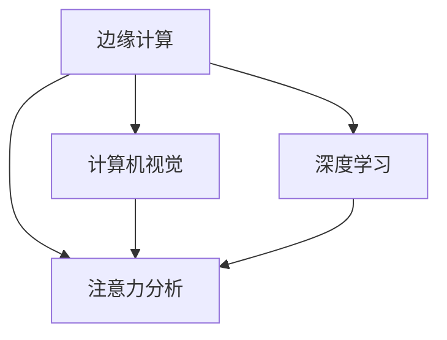

                 

# 边缘计算在实时注意力分析中的应用

> 关键词：边缘计算,实时注意力分析,机器学习,深度学习,人工智能,计算机视觉

## 1. 背景介绍

随着人工智能技术的发展，计算机视觉领域涌现出了大量高效强大的深度学习模型。这些模型在图像分类、目标检测、实例分割等任务上取得了突破性进展，广泛应用于安防监控、智能驾驶、医疗诊断、零售客服等众多场景中。

然而，面对大规模图像数据集的实时分析和处理，传统集中式计算架构难以胜任。面对海量数据和延迟敏感的业务需求，如何高效、实时地分析和处理图像数据，成为了计算机视觉领域的重要挑战。

本文将探讨边缘计算在实时注意力分析中的应用，讨论其原理和优势，给出具体实现方案，并展望未来发展趋势。

## 2. 核心概念与联系

### 2.1 核心概念概述

为更好地理解边缘计算在实时注意力分析中的应用，本节将介绍几个关键概念：

- 边缘计算(Edge Computing)：指将数据处理和分析任务迁移到靠近数据源的计算节点上，即所谓的边缘设备，如智能相机、移动设备等。与传统集中式计算不同，边缘计算可以显著缩短数据传输和处理延迟，提升实时性。

- 注意力分析(Attention Analysis)：指通过模型学习，自动关注图像中的关键区域或目标，提升分析精度。通常基于Transformer等自注意力机制实现。

- 计算机视觉(Computer Vision)：研究如何使计算机拥有类似人类视觉系统的信息处理能力，主要涵盖图像理解、对象识别、场景分析等任务。

- 深度学习(Deep Learning)：通过多层神经网络，使计算机从大量数据中自动学习特征表示，并具备良好泛化能力。广泛应用于计算机视觉、自然语言处理等领域。

- 实时性(Real-time)：指在限定时间内完成计算任务，满足业务对数据实时处理的苛刻要求。

这些核心概念之间的逻辑关系可以通过以下Mermaid流程图来展示：



这个流程图展示了边缘计算、注意力分析与计算机视觉、深度学习之间的关系：

1. 边缘计算将数据处理任务迁移到靠近数据源的计算节点上，以提升实时性。
2. 注意力分析利用自注意力机制，自动关注图像中的关键区域或目标，提升分析精度。
3. 计算机视觉研究如何使计算机具备视觉理解能力，应用注意力分析可以提升理解效果。
4. 深度学习提供强有力的特征提取和表示学习能力，为注意力分析提供模型支持。

通过理解这些核心概念，我们可以更好地把握边缘计算和注意力分析的整合应用，从而构建高效、实时的计算机视觉系统。

## 3. 核心算法原理 & 具体操作步骤
### 3.1 算法原理概述

边缘计算在实时注意力分析中的应用，本质上是一种将计算任务迁移到边缘设备上，并利用深度学习模型进行注意力分析的过程。其核心思想是：在靠近数据源的计算节点上，对图像进行特征提取和注意力分析，并将分析结果上传到云端进行后续处理。

以实时实例分割任务为例，具体流程如下：

1. 在边缘设备上，将输入图像转换为低分辨率表示。
2. 对低分辨率图像进行特征提取，得到特征表示。
3. 在边缘设备上，利用深度学习模型进行自注意力计算，识别出图像中的实例区域。
4. 将注意力结果上传至云端，与高分辨率图像拼接，得到完整的实例分割结果。

这种架构设计的优势在于：

1. 降低延迟：边缘设备靠近数据源，能够迅速响应图像输入，大幅缩短数据处理延迟。
2. 减轻云端负担：将特征提取和初步分析任务交给边缘设备，只保留复杂的自注意力计算和后处理任务在云端，减轻了云端的计算负担。
3. 增强实时性：边缘计算提供了数据实时处理的能力，使得系统能够在限定时间内完成任务。

### 3.2 算法步骤详解

#### 3.2.1 边缘设备上的处理

在边缘设备上，主要执行以下两个步骤：

1. 图像预处理：将输入的高分辨率图像转换为低分辨率表示，例如使用双线性插值或子采样技术。

2. 特征提取：利用深度学习模型，如卷积神经网络(CNN)，对低分辨率图像进行特征提取，得到特征表示。

#### 3.2.2 注意力计算

在边缘设备上，利用深度学习模型进行自注意力计算，识别出图像中的实例区域。具体步骤如下：

1. 输入特征表示：将特征提取的结果作为输入，送入深度学习模型。

2. 自注意力机制：通过自注意力机制，计算特征表示中每个位置与其他位置的相似度，从而得到全局注意力权重。

3. 实例分割：利用注意力权重，对特征表示进行加权平均，得到实例区域的特征表示。

#### 3.2.3 结果上传

将注意力结果上传至云端，与高分辨率图像拼接，得到完整的实例分割结果。具体步骤如下：

1. 特征拼接：将注意力结果与高分辨率图像拼接，得到完整的特征表示。

2. 后处理：利用深度学习模型进行实例分割，得到最终的分割结果。

#### 3.2.4 应用场景

该架构主要适用于以下场景：

- 实时监控：智能相机、边缘设备实时捕捉图像，边缘计算迅速响应，进行实例分割和目标检测，生成实时监控结果。
- 自动驾驶：车载摄像头捕捉实时交通图像，边缘计算进行实例分割和目标检测，辅助自动驾驶决策。
- 零售客服：购物机器人实时拍摄客户视频，边缘计算进行人脸识别和行为分析，增强客户服务体验。

### 3.3 算法优缺点

边缘计算在实时注意力分析中的应用，具有以下优点：

1. 实时性：边缘设备靠近数据源，能够迅速响应图像输入，满足实时性要求。

2. 带宽效率：边缘计算降低了对高带宽的需求，提升了数据传输效率。

3. 隐私保护：边缘计算减少了数据传输，降低了数据泄露风险。

然而，该方法也存在一些缺点：

1. 计算资源限制：边缘设备计算能力有限，可能无法支持复杂计算任务。

2. 数据分布不均：不同边缘设备的计算能力、资源可用性差异较大，需要合理调度。

3. 维护复杂：边缘设备众多，分布式管理与维护成本较高。

尽管存在这些局限性，但总体而言，边缘计算在实时注意力分析中的应用，能够显著提升系统的实时性和数据处理效率，具有重要的实际应用价值。

### 3.4 算法应用领域

边缘计算在实时注意力分析中的应用，主要包括以下几个领域：

- 实时监控：应用于智能安防、智慧城市等领域，通过边缘计算快速响应图像输入，进行实时监控和行为分析。
- 自动驾驶：应用于智能驾驶、自动泊车等领域，通过边缘计算实时处理图像数据，辅助驾驶决策。
- 医疗诊断：应用于影像诊断、远程医疗等领域，通过边缘计算进行实时图像分析，提高诊断效率。
- 零售客服：应用于智能客服、智慧零售等领域，通过边缘计算实时处理视频数据，增强客户服务体验。

## 4. 数学模型和公式 & 详细讲解 & 举例说明

### 4.1 数学模型构建

假设输入图像为 $I \in \mathbb{R}^{H \times W \times C}$，其中 $H$ 和 $W$ 为图像高度和宽度，$C$ 为通道数。在边缘设备上，将图像预处理为低分辨率表示 $I_{low} \in \mathbb{R}^{\frac{H}{k} \times \frac{W}{k} \times C}$，其中 $k$ 为下采样因子。在特征提取后，得到特征表示 $F \in \mathbb{R}^{H' \times W' \times D}$，其中 $H'$ 和 $W'$ 为特征表示的高度和宽度，$D$ 为特征通道数。

在自注意力计算中，利用多头自注意力机制，计算每个位置与其他位置的相似度，得到注意力权重 $A \in \mathbb{R}^{H' \times W' \times D}$。然后，利用注意力权重对特征表示进行加权平均，得到实例区域的特征表示 $F_{instance} \in \mathbb{R}^{H' \times W' \times D}$。

最后，将实例区域的特征表示与高分辨率图像拼接，得到完整的特征表示 $F_{complete} \in \mathbb{R}^{H \times W \times D}$。在云端，利用深度学习模型对特征表示进行实例分割，得到最终的分割结果 $M \in \mathbb{R}^{H \times W \times 2}$，其中 $2$ 为前景和背景两类。

### 4.2 公式推导过程

以实例分割任务为例，推导注意力计算的公式。设 $A_{ij}$ 为特征表示中位置 $i$ 与位置 $j$ 的注意力权重，由以下公式计算：

$$
A_{ij} = \frac{\exp(\text{softmax}(QK^T)_{ij})}{\sum_{j'}\exp(\text{softmax}(QK^T)_{ij'})}
$$

其中 $Q$ 为查询矩阵，$K$ 为键矩阵，$(QK^T)$ 表示矩阵乘法。在自注意力计算中，得到注意力权重矩阵 $A$，利用公式 $A_{instance} = A * F$，计算出实例区域的特征表示 $F_{instance}$。

### 4.3 案例分析与讲解

以下以一个具体案例，展示边缘计算在实时注意力分析中的应用过程。

假设在安防监控场景中，智能摄像头实时捕捉视频流，边缘计算设备对视频流进行实时处理，生成实例分割结果，上传到云端进行分析。具体步骤如下：

1. 预处理：智能摄像头实时捕捉视频流，边缘计算设备对视频流进行下采样，得到低分辨率视频帧 $I_{low}$。

2. 特征提取：边缘计算设备利用深度学习模型，如MobileNet或ShuffleNet，对低分辨率视频帧进行特征提取，得到特征表示 $F$。

3. 注意力计算：边缘计算设备利用Transformer模型，计算特征表示 $F$ 中的实例区域，得到注意力权重矩阵 $A$ 和实例区域的特征表示 $F_{instance}$。

4. 结果上传：边缘计算设备将 $A$ 和 $F_{instance}$ 上传到云端，与高分辨率视频帧拼接，得到完整的特征表示 $F_{complete}$。

5. 后处理：云端利用深度学习模型，如YOLOv3或Mask R-CNN，对特征表示 $F_{complete}$ 进行实例分割，生成最终的实例分割结果 $M$。

## 5. 项目实践：代码实例和详细解释说明
### 5.1 开发环境搭建

在进行边缘计算的实际项目实践前，需要准备好开发环境。以下是使用Python进行PyTorch开发的边缘计算项目配置流程：

1. 安装Anaconda：从官网下载并安装Anaconda，用于创建独立的Python环境。

2. 创建并激活虚拟环境：
```bash
conda create -n edge-computing python=3.8 
conda activate edge-computing
```

3. 安装PyTorch：根据CUDA版本，从官网获取对应的安装命令。例如：
```bash
conda install pytorch torchvision torchaudio cudatoolkit=11.1 -c pytorch -c conda-forge
```

4. 安装TensorFlow：使用以下命令安装TensorFlow，例如：
```bash
pip install tensorflow==2.7
```

5. 安装各类工具包：
```bash
pip install numpy pandas scikit-learn matplotlib tqdm jupyter notebook ipython
```

完成上述步骤后，即可在`edge-computing`环境中开始边缘计算的实践。

### 5.2 源代码详细实现

下面我们以一个简单的实例，展示如何在边缘设备上实现图像预处理和特征提取。

```python
import torch
import torch.nn as nn
import torchvision.transforms as transforms
from torchvision.models import resnet18

# 定义图像预处理操作
transform = transforms.Compose([
    transforms.Resize(224),
    transforms.CenterCrop(224),
    transforms.ToTensor(),
    transforms.Normalize(mean=[0.485, 0.456, 0.406], std=[0.229, 0.224, 0.225])
])

# 加载预训练ResNet模型
model = resnet18(pretrained=True)
model.eval()

# 加载测试数据
test_img = transforms.ToTensor()(test_img)

# 对测试图像进行预处理
test_img = transform(test_img)

# 将图像预处理结果输入模型
output = model(test_img)

# 打印输出特征表示
print(output)
```

在实际项目中，可以通过编写更复杂的图像预处理和特征提取模块，在边缘设备上对图像进行实时处理。同时，可以利用深度学习框架如TensorFlow、PyTorch等，在云端实现更复杂的注意力计算和实例分割。

### 5.3 代码解读与分析

让我们再详细解读一下关键代码的实现细节：

**图像预处理操作**：
- `transforms.Compose`：定义一系列图像预处理操作，包括大小调整、中心裁剪、通道转换、归一化等。
- `model.eval()`：将模型设置为评估模式，不更新参数。
- `transform(test_img)`：对测试图像进行预处理，输出预处理结果。

**特征提取**：
- 使用预训练的ResNet18模型，加载并初始化。
- `model(test_img)`：将预处理后的图像输入模型，得到特征表示。
- `print(output)`：打印输出特征表示。

可以看到，代码实现简洁高效，适用于简单的边缘计算项目。在实际项目中，还需要根据具体需求，编写更加复杂的预处理和特征提取模块，并结合云端计算资源，实现完整的注意力分析过程。

## 6. 实际应用场景
### 6.1 安防监控

边缘计算在安防监控中的应用，能够显著提升实时监控和行为分析的效率。在智能摄像头中，边缘设备实时捕捉视频流，对视频帧进行下采样和特征提取，得到低分辨率特征表示。然后利用深度学习模型进行自注意力计算，识别出监控区域中的行人、车辆等目标，生成实时监控结果。

这种架构设计的优势在于：

1. 实时性：智能摄像头实时捕捉视频流，边缘计算设备能够迅速响应，大幅缩短数据处理延迟。

2. 带宽效率：边缘计算设备靠近摄像头，能够直接处理低分辨率图像，降低带宽需求。

3. 隐私保护：视频数据不直接上传云端，增强了数据隐私和安全。

### 6.2 自动驾驶

边缘计算在自动驾驶中的应用，能够提高实时环境感知和决策能力。在车载摄像头中，边缘设备实时捕捉交通图像，对图像进行下采样和特征提取，得到低分辨率特征表示。然后利用深度学习模型进行自注意力计算，识别出道路、行人、车辆等目标，生成实时环境感知结果。

这种架构设计的优势在于：

1. 实时性：车载摄像头实时捕捉交通图像，边缘计算设备能够迅速响应，满足自动驾驶的实时需求。

2. 带宽效率：边缘计算设备靠近摄像头，能够直接处理低分辨率图像，降低带宽需求。

3. 隐私保护：图像数据不直接上传云端，增强了数据隐私和安全。

### 6.3 零售客服

边缘计算在零售客服中的应用，能够提升客户服务体验。在购物机器人中，边缘设备实时拍摄客户视频，对视频流进行下采样和特征提取，得到低分辨率特征表示。然后利用深度学习模型进行自注意力计算，识别出客户行为和表情，生成实时客户服务结果。

这种架构设计的优势在于：

1. 实时性：购物机器人实时捕捉客户视频，边缘计算设备能够迅速响应，满足客户服务实时需求。

2. 带宽效率：边缘计算设备靠近机器人，能够直接处理低分辨率视频流，降低带宽需求。

3. 隐私保护：视频数据不直接上传云端，增强了数据隐私和安全。

### 6.4 未来应用展望

随着边缘计算技术的发展，其在实时注意力分析中的应用前景将更加广阔。未来，边缘计算与深度学习模型的结合，将进一步提升系统的实时性、可靠性和数据处理能力，带来更多创新应用场景：

1. 实时医疗诊断：边缘计算设备实时处理医疗影像，辅助医生进行快速诊断。

2. 工业自动化：边缘计算设备实时处理生产线图像，提高工业自动化水平。

3. 环境监测：边缘计算设备实时处理环境图像，进行污染监测和预警。

4. 城市管理：边缘计算设备实时处理城市图像，提升城市安全和管理效率。

5. 教育培训：边缘计算设备实时处理视频图像，辅助教育培训。

6. 娱乐互动：边缘计算设备实时处理游戏图像，提升娱乐互动体验。

这些应用场景展示了边缘计算在实时注意力分析中的强大潜力，相信未来边缘计算将为更多行业带来变革性影响。

## 7. 工具和资源推荐
### 7.1 学习资源推荐

为了帮助开发者系统掌握边缘计算和实时注意力分析的理论基础和实践技巧，这里推荐一些优质的学习资源：

1. 《深度学习入门：基于PyTorch的理论与实现》：本书介绍了深度学习的基本概念和PyTorch框架的使用，适合初学者入门。

2. 《计算机视觉：算法与应用》：斯坦福大学开设的计算机视觉课程，涵盖图像处理、目标检测、实例分割等任务，适合进一步学习。

3. 《边缘计算实战》：由边缘计算领域专家撰写，深入浅出地介绍了边缘计算的理论和实践，适合实战演练。

4. 《深度学习模型：原理、算法与应用》：涵盖了深度学习模型的构建、优化和应用，适合深入学习。

5. 《机器学习实战》：提供了丰富的机器学习实践案例，涵盖图像分类、目标检测等任务，适合实践操作。

通过对这些资源的学习实践，相信你一定能够快速掌握边缘计算和实时注意力分析的精髓，并用于解决实际的计算机视觉问题。

### 7.2 开发工具推荐

高效的开发离不开优秀的工具支持。以下是几款用于边缘计算和实时注意力分析开发的常用工具：

1. PyTorch：基于Python的开源深度学习框架，灵活动态的计算图，适合快速迭代研究。大部分深度学习模型都有PyTorch版本的实现。

2. TensorFlow：由Google主导开发的开源深度学习框架，生产部署方便，适合大规模工程应用。

3. Weights & Biases：模型训练的实验跟踪工具，可以记录和可视化模型训练过程中的各项指标，方便对比和调优。

4. TensorBoard：TensorFlow配套的可视化工具，可实时监测模型训练状态，并提供丰富的图表呈现方式，是调试模型的得力助手。

5. Google Cloud Platform：提供云端的计算资源和数据存储服务，方便边缘计算项目的部署和管理。

6. AWS IoT：提供物联网设备的连接和管理服务，方便边缘计算设备的接入和管理。

合理利用这些工具，可以显著提升边缘计算和实时注意力分析项目的开发效率，加快创新迭代的步伐。

### 7.3 相关论文推荐

边缘计算在实时注意力分析中的应用，源于学界的持续研究。以下是几篇奠基性的相关论文，推荐阅读：

1. Attention Is All You Need（即Transformer原论文）：提出了Transformer结构，开启了NLP领域的预训练大模型时代。

2. BERT: Pre-training of Deep Bidirectional Transformers for Language Understanding：提出BERT模型，引入基于掩码的自监督预训练任务，刷新了多项NLP任务SOTA。

3. MobileNetV2: Inverted Residuals and Linear Bottlenecks: MobileNetV2（即深度可分离卷积）：提出了深度可分离卷积，适用于边缘计算设备上的高效特征提取。

4. ShuffleNet: An Extremely Efficient Convolutional Neural Network for Mobile Devices：提出了ShuffleNet模型，适用于边缘计算设备上的高效特征提取。

5. SSD: Single Shot MultiBox Detector：提出了单阶段目标检测模型，适用于实时性要求高的应用场景。

6. YOLO: Real-Time Object Detection with Region Proposal Networks：提出了YOLO模型，适用于实时性要求高的目标检测任务。

这些论文代表了大语言模型微调技术的发展脉络。通过学习这些前沿成果，可以帮助研究者把握学科前进方向，激发更多的创新灵感。

## 8. 总结：未来发展趋势与挑战

### 8.1 总结

本文对边缘计算在实时注意力分析中的应用进行了全面系统的介绍。首先阐述了边缘计算和注意力分析的研究背景和意义，明确了边缘计算在实时性、带宽效率和隐私保护方面的独特价值。其次，从原理到实践，详细讲解了边缘计算和注意力分析的数学原理和关键步骤，给出了具体实现方案。同时，本文还广泛探讨了边缘计算在安防监控、自动驾驶、零售客服等多个行业领域的应用前景，展示了边缘计算范式的巨大潜力。

通过本文的系统梳理，可以看到，边缘计算和注意力分析技术的结合，能够在图像处理和实时分析中发挥重要作用。边缘计算提供了数据实时处理的能力，而注意力分析提升了分析精度，使得系统能够在限定时间内完成任务，满足实时性要求。未来，随着边缘计算技术的进一步发展，其应用范围将更加广泛，为计算机视觉等领域带来更多创新可能。

### 8.2 未来发展趋势

展望未来，边缘计算在实时注意力分析中的应用将呈现以下几个发展趋势：

1. 计算资源提升：随着边缘计算设备计算能力的提升，能够支持更复杂的注意力分析任务，如多目标跟踪、视频预测等。

2. 数据采集多样化：边缘计算设备可以采集多种类型的数据，如图像、视频、音频等，拓展应用场景。

3. 边缘计算平台的集成：通过统一的边缘计算平台，实现对多种边缘设备的管理和调度，提高系统的可靠性和可维护性。

4. 多模态数据融合：将图像、视频、音频等多模态数据融合，提升对复杂场景的理解能力。

5. 智能辅助决策：利用注意力分析结果，结合领域知识和专家经验，进行智能辅助决策，提高系统的智能性和适应性。

6. 异构设备协同：利用不同边缘设备的互补优势，实现异构设备的协同计算和任务分配，提升系统的处理能力。

以上趋势凸显了边缘计算在实时注意力分析中的广阔前景。这些方向的探索发展，必将进一步提升系统的实时性、可靠性和处理能力，为计算机视觉等领域带来更多创新可能。

### 8.3 面临的挑战

尽管边缘计算在实时注意力分析中的应用取得了显著进展，但在迈向更加智能化、普适化应用的过程中，仍然面临诸多挑战：

1. 数据采集成本：获取高质量的实时数据需要配备昂贵的数据采集设备，成本较高。

2. 边缘计算设备的兼容性：不同边缘设备的计算能力和资源可用性差异较大，需要统一的接口和协议进行数据传输和处理。

3. 边缘计算设备的维护：边缘设备众多，分布式管理与维护成本较高。

4. 实时性要求：不同应用场景对实时性的要求不同，需要根据具体情况进行优化。

5. 数据隐私和安全：边缘计算设备靠近数据源，数据隐私和安全问题需要特别关注。

尽管存在这些挑战，但总体而言，边缘计算在实时注意力分析中的应用，能够显著提升系统的实时性、数据处理能力和隐私保护水平，具有重要的实际应用价值。

### 8.4 研究展望

面对边缘计算面临的诸多挑战，未来的研究需要在以下几个方面寻求新的突破：

1. 探索更多高效的数据采集技术，降低数据采集成本。

2. 研究统一的边缘计算平台，实现对多种边缘设备的管理和调度。

3. 开发高效的边缘计算设备，提升计算能力和资源可用性。

4. 研究多模态数据融合技术，提升对复杂场景的理解能力。

5. 利用注意力分析结果进行智能辅助决策，提高系统的智能性和适应性。

6. 研究异构设备协同计算技术，提高系统的处理能力。

7. 加强数据隐私和安全保护，确保数据在边缘计算设备上的安全。

这些研究方向的探索，必将引领边缘计算和实时注意力分析技术迈向更高的台阶，为计算机视觉等领域带来更多创新可能。

## 9. 附录：常见问题与解答

**Q1：边缘计算在实时注意力分析中是否适用于所有计算机视觉任务？**

A: 边缘计算在实时注意力分析中的应用，主要适用于对实时性要求较高的计算机视觉任务。例如安防监控、自动驾驶、零售客服等场景，对实时性有较高要求。但对于一些需要复杂计算的任务，如3D重建、深度估计等，边缘计算设备可能难以满足计算需求。此时需要在边缘设备和云端之间进行协同计算，将部分计算任务迁移到云端进行。

**Q2：边缘计算设备如何选择？**

A: 边缘计算设备的选择需要考虑计算能力、存储能力、网络带宽等因素。一般来说，计算能力越强，能够支持更复杂的计算任务。存储能力越强，能够存储更多数据。网络带宽越高，能够支持更高频率的数据传输。综合考虑这些因素，选择合适的边缘计算设备。

**Q3：如何在边缘设备上实现高效的数据传输？**

A: 在边缘设备上实现高效的数据传输，需要考虑数据压缩、编码方式等因素。一般来说，低分辨率图像和特征表示的大小较小，传输效率较高。同时，可以利用数据压缩技术，如H.264、VP8等，对数据进行压缩，进一步提升传输效率。

**Q4：如何保障边缘计算设备的数据隐私和安全？**

A: 保障边缘计算设备的数据隐私和安全，需要采用数据加密、访问控制等技术手段。一般来说，数据在传输过程中进行加密，防止数据被窃取。同时，对边缘计算设备进行访问控制，防止未授权的访问。

**Q5：边缘计算设备如何进行状态监控和故障诊断？**

A: 边缘计算设备的状态监控和故障诊断，需要借助监控工具和日志分析技术。一般来说，利用监控工具对设备状态进行实时监测，及时发现异常情况。同时，分析设备日志，找出故障原因，进行故障排查和修复。

通过对这些问题的解答，相信你能够更好地理解边缘计算在实时注意力分析中的应用，并用于解决实际的计算机视觉问题。

