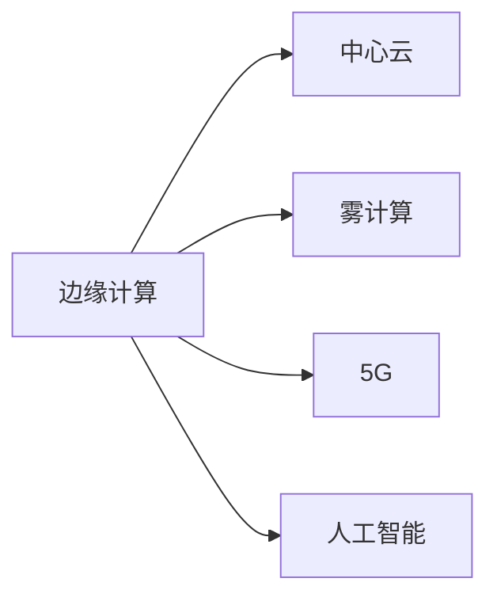

                 

# 边缘计算：IoT数据处理的新范式

> 关键词：边缘计算, 物联网, 数据处理, 分布式计算, 实时性, 边缘设备, 云计算, 5G

## 1. 背景介绍

### 1.1 问题由来

在物联网(IoT)领域，数据产生量呈爆炸式增长，这带来了数据存储、传输、处理等诸多挑战。传统依赖于集中式云计算的数据处理模式，已经难以满足物联网设备对实时性和低延迟的需求。边缘计算作为分布式计算的一种形式，能够将数据处理任务在靠近数据源的边缘设备上执行，从而大幅度减少数据传输时间和网络带宽消耗，显著提升数据处理效率。

近年来，随着5G、物联网、人工智能等技术的快速发展，边缘计算作为实现高效数据处理的关键技术，逐渐成为行业的热点话题。本文将详细阐述边缘计算的原理、应用场景、技术挑战与解决方案，希望能为IoT数据处理领域的从业人员提供有益的参考。

### 1.2 问题核心关键点

边缘计算的核心在于将数据处理任务分散到靠近数据源的边缘设备上，使得数据传输更高效、处理更快速。主要关键点包括：

1. **分布式计算**：将数据处理任务在多个边缘设备上并行执行。
2. **数据本地化**：在边缘设备上存储和处理本地数据，减少数据传输。
3. **实时性**：边缘计算可以提供更低的延迟和更快的响应时间，适用于对实时性要求较高的应用场景。
4. **计算资源多样性**：边缘设备可以是通用服务器、嵌入式设备、手机、传感器等，资源形式多样。

### 1.3 问题研究意义

边缘计算在物联网领域具有广泛的应用前景，其研究意义如下：

1. **提升数据处理效率**：通过本地化处理，减少数据传输，提升数据处理效率。
2. **降低网络带宽消耗**：边缘计算能显著降低数据传输带宽，降低网络成本。
3. **增强数据隐私与安全**：数据在本地处理，避免了跨网传输，提升了数据安全性。
4. **促进IoT应用落地**：边缘计算解决了数据处理瓶颈问题，有助于更多IoT应用的落地。
5. **加速行业创新**：边缘计算提供了更灵活、高效的计算平台，推动各行业智能化发展。

## 2. 核心概念与联系

### 2.1 核心概念概述

为更好地理解边缘计算，本节将介绍几个关键概念及其相互关系：

- **边缘计算**：指将数据处理任务从中心云服务器向边缘设备（如IoT设备、边缘服务器等）转移的一种分布式计算模式。
- **中心云**：传统的集中式计算模式，数据处理任务主要集中在中心云服务器上。
- **边缘设备**：靠近数据源的设备，如IoT传感器、移动设备等。
- **雾计算**：介于云和本地计算之间的计算方式，通常用于数据传输较少的场景。
- **5G**：新一代移动通信技术，提供更高的带宽和更低的延迟，为边缘计算的部署提供了技术基础。
- **人工智能**：结合边缘计算，可实现智能化的数据分析和决策，如自动驾驶、智能监控等。

这些概念之间的关系可以通过以下Mermaid流程图来展示：



## 3. 核心算法原理 & 具体操作步骤

### 3.1 算法原理概述

边缘计算的核心算法原理在于将数据处理任务在多个边缘设备上并行执行，利用分布式计算的优势，提升数据处理效率和实时性。

具体流程包括：

1. **数据采集**：IoT设备采集数据，并存储在本地。
2. **数据预处理**：在边缘设备上对数据进行初步处理，如降噪、压缩等。
3. **数据传输**：将处理后的数据传输至中心云或上云。
4. **数据存储**：在中心云进行存储，提供统一的管理和访问接口。
5. **数据处理**：在中心云进行高级数据分析和处理，生成决策结果。
6. **数据反馈**：将决策结果反馈至边缘设备，指导后续操作。

通过这种分布式计算模式，边缘计算显著提升了数据处理的效率和实时性，降低了网络带宽消耗，增强了数据隐私与安全。

### 3.2 算法步骤详解

边缘计算的算法步骤大致如下：

**Step 1: 数据采集与预处理**
- 使用IoT设备采集数据，并将其存储在本地设备中。
- 在边缘设备上对数据进行初步处理，如去噪、压缩、特征提取等，减少传输量。

**Step 2: 数据传输**
- 将处理后的数据通过无线网络传输至中心云或边缘服务器。
- 在传输过程中，采用分片、压缩等技术减少网络带宽消耗。

**Step 3: 数据存储与处理**
- 将传输至中心云的数据存储在云端数据库中，提供统一的访问接口。
- 在中心云进行高级数据分析和处理，生成决策结果。

**Step 4: 数据反馈**
- 将生成的决策结果通过网络反馈至边缘设备。
- 在边缘设备上执行决策结果，进行后续操作。

### 3.3 算法优缺点

边缘计算具有以下优点：

1. **提升处理效率**：通过分布式计算，利用边缘设备计算资源，减少数据传输时间，提升处理效率。
2. **降低网络带宽消耗**：数据在本地处理，减少了网络带宽消耗，降低成本。
3. **增强数据隐私与安全**：数据在本地处理，避免了跨网传输，提升了数据安全性。
4. **实时性增强**：边缘计算可以提供更低的延迟和更快的响应时间，适用于对实时性要求较高的应用场景。

同时，边缘计算也存在一些局限：

1. **计算资源有限**：边缘设备的计算能力和存储容量有限，可能无法处理大规模数据。
2. **数据本地化限制**：部分数据无法在本地处理，仍需传输至中心云。
3. **部署和维护成本高**：边缘设备数量众多，部署和维护成本较高。
4. **安全风险**：边缘计算设备容易成为网络攻击的入口，需采取额外的安全措施。

### 3.4 算法应用领域

边缘计算在物联网领域具有广泛的应用场景，如：

1. **智能家居**：通过边缘计算实现家庭设备互联互通，提升家居智能化水平。
2. **智能制造**：在工厂车间边缘设备上进行实时数据分析，提升生产效率和质量。
3. **智能交通**：在边缘设备上进行交通数据实时处理，优化交通流量和安全性。
4. **智慧城市**：在城市各个节点上部署边缘计算设备，实现智能监控、应急响应等。
5. **医疗健康**：在医疗设备上部署边缘计算，实时监测健康数据，提供智能诊断服务。

此外，边缘计算还被应用于自动驾驶、工业物联网、智慧农业等多个领域，推动了各行业的智能化转型升级。

## 4. 数学模型和公式 & 详细讲解 & 举例说明

### 4.1 数学模型构建

边缘计算的数学模型通常包括以下几个关键组件：

- **数据采集模型**：描述IoT设备采集数据的分布和采样方式。
- **数据预处理模型**：描述在边缘设备上对数据进行处理的数学方法。
- **数据传输模型**：描述数据从边缘设备传输至中心云的模型。
- **数据存储模型**：描述中心云对数据的存储和管理方式。
- **数据处理模型**：描述中心云对数据进行高级分析的数学方法。
- **数据反馈模型**：描述决策结果从中心云传输至边缘设备的模型。

### 4.2 公式推导过程

以一个简单的数据采集和处理为例，假设IoT设备采集的数据为 $X$，经过预处理后得到 $Y$，传输至中心云后进行数据处理得到 $Z$，最终反馈至边缘设备执行结果 $W$。

- **数据采集模型**：
$$
X \sim p_X
$$

- **数据预处理模型**：
$$
Y = f(X)
$$

- **数据传输模型**：
$$
Z = Y + \epsilon
$$

其中 $\epsilon$ 为数据传输过程中的噪声，假设服从高斯分布 $N(0,\sigma^2)$。

- **数据处理模型**：
$$
Z \xrightarrow{处理} W
$$

- **数据反馈模型**：
$$
W \rightarrow \text{边缘设备执行}
$$

### 4.3 案例分析与讲解

假设有一个智能家居系统，需要实时监测室内温度和湿度，并根据环境变化调整空调和加湿器。

- **数据采集**：智能传感器周期性采集室内温度和湿度数据。
- **数据预处理**：在本地边缘设备上对采集的数据进行降噪处理。
- **数据传输**：将处理后的数据通过无线网络传输至中心云。
- **数据存储**：在中心云存储历史数据，并提供访问接口。
- **数据处理**：在中心云上分析历史数据和实时数据，生成调控策略。
- **数据反馈**：将生成的调控策略通过网络反馈至边缘设备，调整空调和加湿器。

通过这种边缘计算模式，智能家居系统能够实时监测环境变化，提供智能化的调控服务，提升用户体验。

## 5. 项目实践：代码实例和详细解释说明

### 5.1 开发环境搭建

在进行边缘计算项目开发前，需要搭建开发环境。以下是使用Python进行Keras开发的环境配置流程：

1. 安装Anaconda：从官网下载并安装Anaconda，用于创建独立的Python环境。

2. 创建并激活虚拟环境：
```bash
conda create -n edge-env python=3.8 
conda activate edge-env
```

3. 安装TensorFlow：根据CUDA版本，从官网获取对应的安装命令。例如：
```bash
conda install tensorflow
```

4. 安装Keras：Keras是基于TensorFlow的高级深度学习框架，可以快速实现各类模型构建。
```bash
pip install keras
```

5. 安装各类工具包：
```bash
pip install numpy pandas scikit-learn matplotlib tqdm jupyter notebook ipython
```

完成上述步骤后，即可在`edge-env`环境中开始边缘计算项目开发。

### 5.2 源代码详细实现

下面以智能家居系统为例，给出使用TensorFlow实现边缘计算的代码实现。

首先，定义数据采集和预处理函数：

```python
import tensorflow as tf

def data_acquisition():
    # 模拟IoT设备采集数据
    data = tf.random.normal(shape=(10000, 4), mean=20, stddev=1)
    return data

def data_preprocessing(data):
    # 在边缘设备上进行数据预处理
    processed_data = tf.keras.layers.Dense(2)(data)
    return processed_data
```

然后，定义数据传输和反馈函数：

```python
def data_transmission(processed_data):
    # 将处理后的数据通过无线网络传输至中心云
    batch_size = 1000
    data_chunks = tf.split(processed_data, batch_size)
    return data_chunks

def data_feedback(data_chunks):
    # 将决策结果从中心云传输至边缘设备
    return data_chunks
```

最后，在TensorFlow上实现完整的边缘计算流程：

```python
data = data_acquisition()
processed_data = data_preprocessing(data)
data_chunks = data_transmission(processed_data)
decision = data_feedback(data_chunks)
```

可以看到，通过TensorFlow框架，我们能够方便地构建和实现边缘计算的各个组件，将数据处理任务分散到边缘设备上执行。

### 5.3 代码解读与分析

让我们再详细解读一下关键代码的实现细节：

**data_acquisition函数**：
- 使用TensorFlow生成随机数据，模拟IoT设备采集的数据。

**data_preprocessing函数**：
- 使用Keras的Dense层进行数据预处理，如降噪、降维等。

**data_transmission函数**：
- 将处理后的数据分批次传输至中心云，模拟数据传输过程。

**data_feedback函数**：
- 将决策结果从中心云传输至边缘设备，模拟数据反馈过程。

**边缘计算流程**：
- 数据采集：IoT设备采集环境数据。
- 数据预处理：在边缘设备上对采集的数据进行初步处理。
- 数据传输：将处理后的数据传输至中心云。
- 数据存储：在中心云存储处理后的数据。
- 数据处理：在中心云进行高级数据分析和处理。
- 数据反馈：将决策结果反馈至边缘设备，执行调控操作。

可以看到，通过TensorFlow和Keras框架，边缘计算的各个组件能够方便地实现，并且可以灵活地进行配置和调试。

## 6. 实际应用场景

### 6.1 智能家居

边缘计算在智能家居领域具有广泛的应用前景。通过在边缘设备上部署计算资源，智能家居系统可以实时监测环境变化，并根据用户行为提供智能化的服务。例如，通过边缘计算，智能空调可以根据室内温度和湿度自动调节风速和温度，提升居住舒适度。

### 6.2 智能制造

在智能制造领域，边缘计算能够实时监测生产线数据，优化生产流程和资源配置，提升生产效率和质量。例如，在工厂车间边缘设备上进行实时数据分析，生成生产调度计划，提高生产效率。

### 6.3 智能交通

智能交通系统依赖于实时数据分析和处理，边缘计算能够提供更低的延迟和更快的响应时间，优化交通流量和安全性。例如，在边缘设备上部署智能交通系统，实时监测交通数据，生成交通调度指令，提高道路通行效率。

### 6.4 智慧城市

智慧城市建设需要实时数据处理和分析，边缘计算能够显著提升数据处理效率和实时性。例如，在城市各个节点上部署边缘计算设备，实现智能监控、应急响应等功能，提升城市管理效率。

## 7. 工具和资源推荐

### 7.1 学习资源推荐

为了帮助开发者系统掌握边缘计算的理论基础和实践技巧，这里推荐一些优质的学习资源：

1. **《边缘计算》系列博文**：由边缘计算技术专家撰写，深入浅出地介绍了边缘计算原理、应用场景、技术挑战等前沿话题。

2. **MIT边缘计算课程**：麻省理工学院开设的边缘计算课程，涵盖边缘计算的基本概念、技术框架、实际应用等内容，适合深入学习。

3. **边缘计算白皮书**：各大厂商和组织发布的边缘计算白皮书，系统介绍了边缘计算的标准、技术和应用，是了解行业标准的权威资料。

4. **Kubernetes官方文档**：Kubernetes作为边缘计算的基础平台，其官方文档提供了丰富的实践样例和最佳实践，是边缘计算项目开发的必备资料。

5. **IoT平台推荐**：如ThingWorx、AWS IoT、Azure IoT等，提供了丰富的IoT设备和边缘计算服务，方便开发者进行项目实践。

通过对这些资源的学习实践，相信你一定能够快速掌握边缘计算的精髓，并用于解决实际的IoT数据处理问题。

### 7.2 开发工具推荐

高效的开发离不开优秀的工具支持。以下是几款用于边缘计算开发的常用工具：

1. **TensorFlow**：基于Python的开源深度学习框架，灵活高效，支持分布式计算和模型部署。
2. **Keras**：高级深度学习框架，易于使用，适合快速构建和调试边缘计算模型。
3. **Kubernetes**：开源容器编排工具，支持边缘计算容器化部署和管理。
4. **IoT平台**：如ThingWorx、AWS IoT、Azure IoT等，提供了丰富的IoT设备和边缘计算服务，方便开发者进行项目实践。
5. **云平台**：如AWS、Google Cloud、阿里云等，提供边缘计算云服务，支持大规模边缘计算应用。

合理利用这些工具，可以显著提升边缘计算项目的开发效率，加快创新迭代的步伐。

### 7.3 相关论文推荐

边缘计算领域的研究论文众多，以下是几篇奠基性的相关论文，推荐阅读：

1. **Edge computing system: architecture, challenges, and prospects**：深度介绍了边缘计算的架构、挑战和未来发展方向。
2. **Edge computing in IoT**：介绍了边缘计算在IoT领域的应用，讨论了关键技术和挑战。
3. **A survey on edge computing for IoT applications**：综述了边缘计算在IoT中的应用，提供了丰富的技术参考。
4. **Distributed IoT Data Processing with Edge Computing**：讨论了边缘计算在IoT数据处理中的应用，介绍了多种数据处理方法和技术。
5. **Edge computing for IoT: challenges and opportunities**：探讨了边缘计算在IoT领域的挑战和机遇，提供了深度思考。

这些论文代表了大规模数据处理技术的发展脉络。通过学习这些前沿成果，可以帮助研究者把握学科前进方向，激发更多的创新灵感。

## 8. 总结：未来发展趋势与挑战

### 8.1 总结

本文对边缘计算的原理、应用场景、技术挑战与解决方案进行了全面系统的介绍。首先阐述了边缘计算在物联网领域的重要地位，明确了其在提升数据处理效率和实时性方面的独特价值。其次，从原理到实践，详细讲解了边缘计算的数学模型和具体步骤，给出了边缘计算项目开发的完整代码实例。同时，本文还广泛探讨了边缘计算在智能家居、智能制造、智能交通等诸多领域的应用前景，展示了边缘计算范式的广泛潜力。最后，本文精选了边缘计算的相关资源，力求为读者提供全方位的技术指引。

通过本文的系统梳理，可以看到，边缘计算正在成为物联网领域的重要范式，极大地提升了IoT设备的处理能力和实时性。未来，伴随边缘计算技术的发展和应用，IoT设备的智能化水平将进一步提升，各行业也将迎来更加高效、灵活的数据处理模式。

### 8.2 未来发展趋势

展望未来，边缘计算技术将呈现以下几个发展趋势：

1. **5G网络普及**：5G网络的大规模部署将进一步提升边缘计算的带宽和连接密度，推动边缘计算的发展。
2. **AI和边缘计算融合**：边缘计算与人工智能的深度融合，将带来更高效、更智能的数据处理方式。
3. **多模态数据处理**：边缘计算能够处理多模态数据，如视频、音频、传感器数据等，提升数据处理的多样性和复杂性。
4. **边缘云一体化**：边缘计算与云服务的一体化，将提升数据处理的灵活性和扩展性。
5. **边缘设备智能化**：未来边缘设备将具备更高的计算能力和存储容量，支持更复杂的数据处理任务。

以上趋势凸显了边缘计算技术的前景广阔，其未来发展将为IoT设备和各行业带来新的创新机遇。

### 8.3 面临的挑战

尽管边缘计算技术已经取得了显著进展，但在迈向更加智能化、普适化应用的过程中，仍面临诸多挑战：

1. **计算资源有限**：边缘设备的计算能力和存储容量有限，难以处理大规模数据。
2. **数据本地化限制**：部分数据无法在本地处理，仍需传输至中心云。
3. **部署和维护成本高**：边缘设备数量众多，部署和维护成本较高。
4. **安全风险**：边缘计算设备容易成为网络攻击的入口，需采取额外的安全措施。

这些挑战需要通过技术创新和行业协同解决，才能进一步推动边缘计算的广泛应用。

### 8.4 研究展望

面对边缘计算面临的挑战，未来的研究需要在以下几个方面寻求新的突破：

1. **计算资源优化**：通过硬件优化和算法改进，提升边缘设备的计算能力。
2. **数据本地化策略**：优化数据本地化策略，减少数据传输量，提高本地处理效率。
3. **部署和维护自动化**：通过自动化工具和平台，降低边缘设备的部署和维护成本。
4. **安全防护机制**：建立强大的安全防护机制，保障边缘计算设备的安全性。
5. **跨设备数据共享**：实现不同边缘设备之间的数据共享和协同处理，提升整体数据处理效率。

这些研究方向的探索，必将引领边缘计算技术迈向更高的台阶，为IoT设备带来更加高效、智能、安全的数据处理能力。面向未来，边缘计算将与其他人工智能技术进行更深入的融合，推动各行业智能化转型升级，为人类生活和社会发展带来深远影响。

## 9. 附录：常见问题与解答

**Q1：边缘计算和雾计算有何区别？**

A: 边缘计算和雾计算都是分布式计算模式，但它们的数据处理和传输方式略有不同。边缘计算强调数据在边缘设备上的处理和存储，而雾计算则更侧重于数据在靠近终端用户的网络节点上的处理和存储。

**Q2：边缘计算在数据处理中是否需要中心云的参与？**

A: 边缘计算不是孤立的，通常需要与中心云协同工作。数据在边缘设备上预处理后，仍需上传到中心云进行高级分析和大规模存储。

**Q3：边缘计算如何提升数据处理效率？**

A: 通过在靠近数据源的设备上处理数据，减少了数据传输时间，从而提升了数据处理效率。

**Q4：边缘计算的优缺点有哪些？**

A: 边缘计算的优势在于提升处理效率、降低网络带宽消耗、增强数据隐私与安全、实时性增强。缺点在于计算资源有限、数据本地化限制、部署和维护成本高、安全风险。

**Q5：边缘计算如何应用于智能家居？**

A: 在智能家居系统中，边缘计算能够实时监测环境变化，并根据用户行为提供智能化的服务。例如，通过边缘计算，智能空调可以根据室内温度和湿度自动调节风速和温度，提升居住舒适度。

这些Q&A提供了对边缘计算更深入的理解和应用指导，有助于开发者更好地理解和应用边缘计算技术。

---

作者：禅与计算机程序设计艺术 / Zen and the Art of Computer Programming

