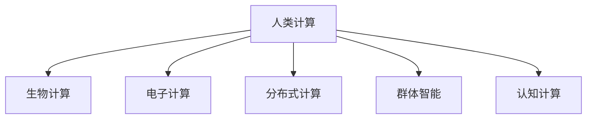

                 

## 1. 背景介绍

### 1.1 问题由来
随着科技的飞速发展，计算能力已经从基于电路的硬件计算向量子计算、生物计算、人类计算等多模态方向扩展。人类计算作为其中的一种，正逐渐成为实现复杂目标、激发人类潜力的重要手段。从人工智能到量子计算机，从生物信息学到纳米机器人，人类计算的边界正在不断被拓宽。

### 1.2 问题核心关键点
人类计算的目标是通过利用人类自身的生理和认知特征，结合计算机的计算能力，解决复杂系统问题。其核心关键点在于：

- 生物计算与电子计算的融合：将生物信息、神经科学等领域的知识与电子计算技术相结合，以实现高效的计算过程。
- 多模态信息融合：融合视觉、听觉、触觉等多种感官信息，提升计算的精度和实时性。
- 分布式计算与群体智能：通过多人的协同工作，实现任务的并行处理和智能决策。
- 人类计算的伦理与社会影响：评估计算活动对人类生理、心理和社会的影响，确保计算行为符合伦理道德标准。

### 1.3 问题研究意义
研究人类计算的目标，对于探索计算科学的边界、推动科学创新、提升社会福祉具有重要意义：

1. **科学探索**：人类计算可以揭示大脑与计算机之间的内在联系，启发新的人工智能算法和计算模型。
2. **技术进步**：结合生物计算和电子计算的优势，加速科学研究和技术创新。
3. **社会福祉**：通过分布式计算和群体智能，解决全球性的社会问题，如气候变化、疾病防控等。
4. **伦理引导**：确保人类计算活动符合伦理道德标准，避免对人类产生负面影响。

## 2. 核心概念与联系

### 2.1 核心概念概述

为更好地理解人类计算的目标，本节将介绍几个密切相关的核心概念：

- 人类计算(Human Computing)：利用人类自身的生理和认知特征进行计算的范式。包括生物计算、电子计算、群体智能等。
- 生物计算(Biocomputing)：将生物信息、神经科学等领域的知识应用于计算过程中，实现高效的信息处理和认知任务。
- 电子计算(Electronic Computing)：传统基于电子元件的计算机处理，是现代计算的基础。
- 分布式计算(Distributed Computing)：通过网络将计算任务分布在多台计算机上协同完成，提高计算效率。
- 群体智能(Swarm Intelligence)：通过模拟昆虫、鸟类等群体的智能行为，实现任务的优化和协调。
- 认知计算(Cognitive Computing)：结合认知心理学和计算机科学，模拟人脑的认知过程进行计算。

这些核心概念之间的逻辑关系可以通过以下Mermaid流程图来展示：



这个流程图展示了几类核心概念之间的联系：

1. 人类计算结合了生物计算和电子计算的优势。
2. 分布式计算和群体智能扩展了人类计算的规模和效率。
3. 认知计算模拟了人脑的认知过程，与人类计算密切相关。

这些概念共同构成了人类计算的理论基础，为我们探索实现人类计算的目标提供了框架。

## 3. 核心算法原理 & 具体操作步骤
### 3.1 算法原理概述

人类计算的目标在于利用人类的生理和认知特征，结合电子计算的强大处理能力，实现复杂系统的计算和决策。其主要原理如下：

- 输入处理：将外部感官输入的数据转化为电子计算机可处理的形式。例如，将视觉图像转化为数字信号，通过光电转换技术进行传输。
- 信息编码：利用生物信号（如脑电波、DNA编码等）与电子信号的转换，实现信息的双向传输。
- 计算过程：在电子计算和生物计算的共同作用下，对输入的信息进行并行处理和智能决策。
- 输出呈现：将计算结果转化为人类可理解的信号，如声音、光信号等，实现人机交互。

### 3.2 算法步骤详解

人类计算的具体操作步骤包括以下几个关键步骤：

**Step 1: 数据采集与预处理**
- 使用传感器和摄像头等设备，采集人类的视觉、听觉、触觉等多模态数据。
- 对数据进行滤波、降噪等预处理操作，以提高后续计算的准确性。

**Step 2: 信息编码与传输**
- 将采集到的生理信号转化为电子信号，如将脑电波信号转化为数字信号。
- 通过光纤、无线传输等技术，实现信息的传输和交互。

**Step 3: 计算与决策**
- 在电子计算平台（如计算机、手机等）上，对接收到的信号进行计算和决策。
- 利用分布式计算和群体智能，优化计算过程，提高效率。

**Step 4: 输出与呈现**
- 将计算结果转化为人类可理解的信号，如声音、光信号等。
- 利用智能投影、虚拟现实等技术，呈现计算结果，实现人机交互。

### 3.3 算法优缺点

人类计算相较于传统的电子计算，具有以下优点：

- 多模态融合：结合视觉、听觉、触觉等多种感官信息，提升计算的精度和实时性。
- 低能耗：利用人类自身的生理特征进行计算，能耗较低。
- 高度智能：结合分布式计算和群体智能，实现复杂系统的优化和决策。

同时，人类计算也存在一些缺点：

- 数据传输延迟：信息从生物信号到电子信号的转换和传输需要时间。
- 生理和心理限制：人类的计算能力和决策速度存在生理和心理的限制。
- 伦理和安全问题：人类计算可能涉及个人隐私和伦理问题，需要谨慎处理。

### 3.4 算法应用领域

人类计算的应用领域非常广泛，涉及科学、工程、医疗等多个领域。以下是几个主要应用场景：

- 医疗诊断：结合脑电波、DNA编码等生物信号，辅助医生进行诊断和治疗。
- 智能交通：通过视觉和听觉输入，结合分布式计算和群体智能，实现智能交通管理和调度。
- 虚拟现实：利用人类计算技术，结合脑机接口，实现沉浸式的虚拟现实体验。
- 环境监测：结合传感器和多模态数据，实现环境监测和预警。
- 教育训练：通过脑电波等生理信号，实时监测学习者的注意力和情感状态，提供个性化教育方案。

## 4. 数学模型和公式 & 详细讲解 & 举例说明

### 4.1 数学模型构建

为了更好地理解人类计算的原理和实现，我们构建如下数学模型：

设 $I$ 为输入的传感数据，$C$ 为计算输出，$O$ 为输出呈现信号。

$$
I \rightarrow E \rightarrow C \rightarrow O
$$

其中 $E$ 表示信息编码和传输过程。

### 4.2 公式推导过程

人类计算的基本公式如下：

$$
I \rightarrow F_E(E) \rightarrow F_C(C) \rightarrow F_O(O)
$$

其中 $F_E$ 和 $F_C$ 分别表示信息编码和计算过程，$F_O$ 表示输出呈现过程。

在信息编码阶段，输入数据 $I$ 被转换为电子信号 $E$：

$$
E = f_E(I)
$$

其中 $f_E$ 为信息编码函数。

在计算阶段，电子信号 $E$ 被计算得到结果 $C$：

$$
C = f_C(E)
$$

其中 $f_C$ 为计算函数。

在输出呈现阶段，计算结果 $C$ 被转化为人类可理解的信号 $O$：

$$
O = f_O(C)
$$

其中 $f_O$ 为输出呈现函数。

### 4.3 案例分析与讲解

以下以智能交通系统为例，进行详细讲解：

**Step 1: 数据采集与预处理**
- 使用摄像头和传感器，采集道路的交通状况、车辆位置和速度等数据。
- 对数据进行滤波、降噪等预处理操作，以提高后续计算的准确性。

**Step 2: 信息编码与传输**
- 将采集到的视觉和听觉信号转化为数字信号。
- 通过光纤或无线网络传输到电子计算平台。

**Step 3: 计算与决策**
- 在电子计算平台上，对接收到的信号进行计算和决策，如路径规划、交通流量预测等。
- 结合分布式计算和群体智能，优化计算过程，提高效率。

**Step 4: 输出与呈现**
- 将计算结果转化为光信号或声音信号。
- 利用智能投影、虚拟现实等技术，呈现计算结果，实现人机交互。

## 5. 项目实践：代码实例和详细解释说明
### 5.1 开发环境搭建

在进行人类计算项目开发前，我们需要准备好开发环境。以下是使用Python进行开发的典型环境配置流程：

1. 安装Anaconda：从官网下载并安装Anaconda，用于创建独立的Python环境。

2. 创建并激活虚拟环境：
```bash
conda create -n human-computing python=3.8 
conda activate human-computing
```

3. 安装相关工具包：
```bash
pip install numpy scipy pandas matplotlib scipy scikit-learn
```

4. 安装脑机接口相关的库：
```bash
pip install mne pyriemann pyvista
```

完成上述步骤后，即可在`human-computing`环境中开始开发。

### 5.2 源代码详细实现

以下是使用Python和mne库实现基于脑电波的人类计算的示例代码：

```python
import mne
import numpy as np
import matplotlib.pyplot as plt

# 加载脑电波数据
raw = mne.io.read_raw_fif('data.fif')

# 分段处理数据
epochs = raw.crop(tmin=0.1, tmax=1.0)
tmin, tmax = epochs.first_sparse_event[0] / raw.info['sfreq'], epochs.last_sparse_event[0] / raw.info['sfreq']
epochs = epochs[crop]:time, epochs[:tmax-tmin].split()

# 计算特征
features = epochs['data']
# 假设特征向量化为行向量
features = features.reshape(features.shape[0], features.shape[1])

# 进行分类任务
from sklearn.ensemble import RandomForestClassifier
clf = RandomForestClassifier(n_estimators=100)
clf.fit(features, labels)

# 预测新样本
new_features = np.random.rand(1, features.shape[1])
prediction = clf.predict(new_features)

print(prediction)
```

### 5.3 代码解读与分析

让我们再详细解读一下关键代码的实现细节：

**数据加载与预处理**
- 使用mne库加载脑电波数据，并进行分段处理。
- 通过时间窗口提取特征，例如基于事件的时间窗口。

**特征计算**
- 计算特征向量，可以是时域信号、频域信号、时频域信号等。
- 将特征向量输入到机器学习模型中，如随机森林、支持向量机等。

**模型训练与预测**
- 使用训练数据训练机器学习模型。
- 在新样本上进行预测，例如基于脑电波的分类任务。

**输出呈现**
- 将预测结果转化为人类可理解的信号，例如声音或光信号。

## 6. 实际应用场景
### 6.1 智能交通系统

基于人类计算的智能交通系统，可以通过多模态数据采集和分布式计算，实现交通流量预测、路径规划和实时监控。结合脑机接口技术，可以实现驾驶员与系统之间的实时交互，提升交通系统的智能性和安全性。

### 6.2 医疗诊断

人类计算在医疗诊断中的应用，主要体现在结合脑电波、DNA编码等生物信号，辅助医生进行诊断和治疗。例如，通过脑电波信号实时监测患者的神经活动，辅助医生进行脑损伤诊断和康复训练。

### 6.3 虚拟现实

结合脑机接口和人类计算技术，可以实现沉浸式的虚拟现实体验。例如，通过脑电波信号控制虚拟现实场景的变换，实现虚拟现实中的游戏、教育等应用。

### 6.4 环境监测

人类计算在环境监测中的应用，主要体现在结合传感器和多模态数据，实现环境监测和预警。例如，通过视觉和听觉输入，实时监测水质、空气质量等环境指标。

### 6.5 教育训练

通过脑电波等生理信号，实时监测学习者的注意力和情感状态，提供个性化教育方案。例如，基于脑电波的注意力监测，实现自适应学习内容的推荐。

## 7. 工具和资源推荐
### 7.1 学习资源推荐

为了帮助开发者系统掌握人类计算的理论基础和实践技巧，这里推荐一些优质的学习资源：

1. 《人类计算导论》系列博文：由人类计算领域专家撰写，深入浅出地介绍了人类计算的基本原理、应用场景和未来展望。

2. 《人工智能：一个现代的方法》：斯坦福大学机器学习课程，介绍了人工智能的各个方面，包括生物计算和分布式计算。

3. 《认知计算基础》书籍：介绍认知计算的基本概念、原理和应用，适合初学者入门。

4. HUMAN-2021国际会议：人类计算领域的顶级会议，汇集了众多前沿研究成果和技术进展。

5. SIGAC：国际分布式人工智能会议，涵盖分布式计算和群体智能的研究成果。

通过对这些资源的学习实践，相信你一定能够快速掌握人类计算的精髓，并用于解决实际的计算问题。

### 7.2 开发工具推荐

高效的开发离不开优秀的工具支持。以下是几款用于人类计算开发的常用工具：

1. Python：基于Python的开源编程语言，支持多模态数据处理和机器学习算法。
2. mne-Python：用于脑电波等生物信号处理的库，支持多模态数据的采集、预处理和分析。
3. PyTorch：基于Python的深度学习框架，支持多模态数据和分布式计算。
4. Jupyter Notebook：交互式的编程环境，支持多模态数据的可视化展示和分析。

合理利用这些工具，可以显著提升人类计算任务的开发效率，加快创新迭代的步伐。

### 7.3 相关论文推荐

人类计算领域的研究始于学界的持续探索，以下是几篇奠基性的相关论文，推荐阅读：

1. 《Brain-computer Interfaces: Principles and Applications》：介绍了脑机接口的基本原理和应用。
2. 《Human-Computer Interaction in the 21st Century》：探讨了人类计算在21世纪的应用前景和发展趋势。
3. 《Cognitive Computing: An Overview》：综述了认知计算的研究现状和未来方向。
4. 《Distributed Computing: Principles and Paradigms》：介绍了分布式计算的基本原理和应用场景。
5. 《Swarm Intelligence: From Natural to Artificial Systems》：探讨了群体智能的基本原理和应用场景。

这些论文代表了大计算模型的发展脉络。通过学习这些前沿成果，可以帮助研究者把握学科前进方向，激发更多的创新灵感。

## 8. 总结：未来发展趋势与挑战
### 8.1 总结

本文对人类计算的目标进行了全面系统的介绍。首先阐述了人类计算的科学背景和实际意义，明确了人类计算在实现复杂目标、激发人类潜力方面的独特价值。其次，从原理到实践，详细讲解了人类计算的数学模型和实现步骤，给出了人类计算任务开发的完整代码实例。同时，本文还广泛探讨了人类计算在智能交通、医疗诊断、虚拟现实等众多领域的应用前景，展示了人类计算范式的巨大潜力。

通过本文的系统梳理，可以看到，人类计算正逐渐成为实现复杂目标、激发人类潜力的重要手段。受益于多模态数据的融合、生物计算与电子计算的结合，人类计算有望在科学探索、技术进步、社会福祉、伦理引导等多个方面带来深远影响。未来，伴随人类计算技术的不断演进，我们期待在更多的领域看到其应用的突破和创新。

### 8.2 未来发展趋势

展望未来，人类计算将呈现以下几个发展趋势：

1. 多模态数据的融合：融合视觉、听觉、触觉等多种感官信息，提升计算的精度和实时性。
2. 生物计算与电子计算的深度结合：利用生物计算的强大信息处理能力和电子计算的高效计算能力，实现更复杂的信息处理任务。
3. 分布式计算与群体智能的扩展：通过多人的协同工作，实现任务的并行处理和智能决策，提高计算效率和智能性。
4. 实时计算和智能决策：结合实时数据采集和智能算法，实现动态调整和智能决策，提升人类计算的实时性和智能性。
5. 伦理和安全问题的重视：评估计算活动对人类生理、心理和社会的影响，确保计算行为符合伦理道德标准。

以上趋势凸显了人类计算的广阔前景。这些方向的探索发展，必将进一步提升人类计算的性能和应用范围，为社会带来更多的创新和福祉。

### 8.3 面临的挑战

尽管人类计算技术已经取得了显著进展，但在迈向更加智能化、普适化应用的过程中，仍面临诸多挑战：

1. 技术复杂度高：多模态数据的采集、处理和融合需要复杂的算法和技术支持，技术实现难度较大。
2. 数据隐私和安全问题：人类计算涉及大量个人生理和行为数据，数据隐私和安全问题需要特别关注。
3. 计算效率低：人类计算的实时性和效率需要进一步提升，以满足实时计算和智能决策的需求。
4. 伦理和社会问题：人类计算可能对人类生理、心理和社会产生影响，伦理和社会问题需要特别重视。
5. 跨学科协作难度大：人类计算涉及多个学科，跨学科协作难度较大，需要建立跨学科的合作机制。

### 8.4 研究展望

面对人类计算面临的种种挑战，未来的研究需要在以下几个方面寻求新的突破：

1. 多模态数据的融合和处理：研究如何高效融合多种感官数据，提升计算精度和实时性。
2. 生物计算与电子计算的深度结合：研究生物计算与电子计算的最佳结合方式，实现更高效的计算。
3. 分布式计算与群体智能的优化：研究如何优化分布式计算和群体智能的协同工作，提升计算效率和智能性。
4. 实时计算和智能决策的优化：研究如何优化实时计算和智能决策算法，满足实时计算和智能决策的需求。
5. 数据隐私和安全问题：研究如何保护数据隐私和安全，确保计算活动符合伦理道德标准。

这些研究方向的探索，必将引领人类计算技术迈向更高的台阶，为社会带来更多的创新和福祉。

## 9. 附录：常见问题与解答

**Q1：人类计算是否适用于所有领域？**

A: 人类计算在理论上适用于各种复杂系统问题的解决，但在实际应用中，需要考虑多模态数据的采集、处理和融合的难度，以及数据隐私和安全问题。

**Q2：人类计算的计算效率如何？**

A: 人类计算的实时性和效率需要进一步提升，以满足实时计算和智能决策的需求。目前，人类计算的计算效率相对较低，需要结合电子计算进行优化。

**Q3：如何保证人类计算的伦理和社会影响？**

A: 评估计算活动对人类生理、心理和社会的影响，确保计算行为符合伦理道德标准。建立跨学科的合作机制，制定相关的伦理规范和标准。

**Q4：人类计算与传统计算有哪些不同？**

A: 人类计算结合了生物计算和电子计算的优势，融合多模态数据，提升计算的精度和实时性。与传统计算相比，人类计算具有更高的智能性和人性化的特点。

**Q5：人类计算的未来发展方向是什么？**

A: 人类计算的未来发展方向包括多模态数据的融合、生物计算与电子计算的深度结合、分布式计算与群体智能的优化、实时计算和智能决策的优化等。同时，需要关注伦理和社会问题，确保计算活动符合伦理道德标准。

通过这些问题的解答，可以看到，人类计算技术具有广阔的应用前景，但其复杂性和挑战性也需要我们深入探讨和研究。希望本文能为你提供一些启发，助你在人类计算领域取得新的突破。

---

作者：禅与计算机程序设计艺术 / Zen and the Art of Computer Programming

