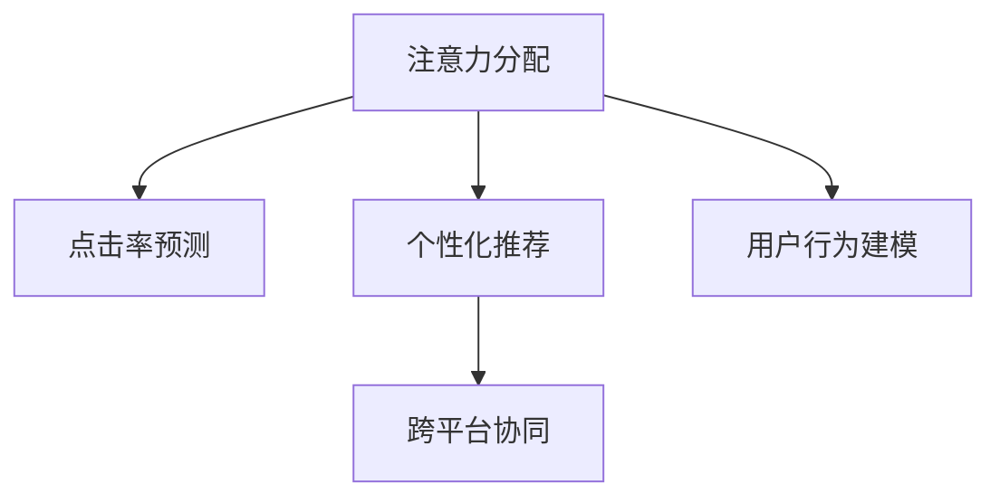

                 

# 重新思考AI时代的注意力经济学

> 关键词：注意力经济、人工智能、深度学习、计算广告学、人机交互、智能系统

## 1. 背景介绍

### 1.1 问题由来

在信息时代，人们所面临的注意力是一种有限的资源。随着数字媒体和社交网络的普及，信息过载问题愈发显著，个体难以在如此海量的信息中筛选出对自己有用的内容。因此，如何高效利用个体的注意力资源，最大化信息价值，成为现代社会亟需解决的问题。

近年来，人工智能（AI）和深度学习（DL）技术的迅猛发展，赋予了计算广告学（Computational Advertising）新的生命力。借助AI模型，广告主能够更精准地定向推送内容，提高广告的点击率和转化率，从而在有限的注意力资源下实现更高效的广告投放。这一过程实质上是一个对个体注意力的经济性配置和优化过程，被称为"注意力经济学"（Economics of Attention）。

本文将从注意力经济学的视角，深入探讨AI时代下，如何通过注意力经济学模型实现对个体注意力的高效配置，优化广告投放策略，提升用户体验，并赋能企业和市场。

### 1.2 问题核心关键点

注意力经济学模型的核心在于如何高效地利用有限注意力资源，使广告主能够以最小的成本达到最优的广告效果。具体来说，包括以下几个关键点：

1. **注意力分配算法**：如何根据用户的兴趣和行为特征，动态分配广告的展示权重。
2. **点击率预测模型**：如何预测用户对不同广告的点击概率，从而优化广告定向策略。
3. **个性化推荐系统**：如何将用户的长期行为与即时的广告展示内容关联，提升广告的相关性和用户体验。
4. **用户行为模拟与优化**：如何模拟用户对广告的认知和决策过程，调整广告设计和展示位置，以最大化广告效果。
5. **跨平台协同广告**：如何在不同平台间协同投放广告，实现跨设备的广告体验一致性。

这些关键点构成了注意力经济学的研究基础，旨在通过优化注意力分配，提升广告投放的精确性和有效性。

## 2. 核心概念与联系

### 2.1 核心概念概述

为更好地理解注意力经济学模型，本节将介绍几个密切相关的核心概念：

- **注意力分配**：指根据用户的兴趣、行为、地理位置等特征，动态调整广告的展示权重，以确保广告能够精准触达目标用户。
- **点击率预测**：指利用历史行为数据和上下文信息，预测用户对广告的点击概率。点击率是衡量广告效果的重要指标。
- **个性化推荐**：指通过分析用户的长期行为和偏好，为其推荐个性化的广告内容，提高广告的相关性和用户满意度。
- **用户行为建模**：指通过模型预测用户对广告的反应，包括点击、转发、收藏等行为，从而优化广告设计和展示策略。
- **跨平台协同**：指在多个平台上协同投放广告，实现用户跨设备的广告体验一致性，提高广告的整体效果。

这些核心概念之间的逻辑关系可以通过以下Mermaid流程图来展示：



这个流程图展示了几类核心概念及其之间的关系：

1. 注意力分配算法与点击率预测模型紧密联系，通过预测点击率来优化广告投放权重。
2. 个性化推荐系统与用户行为建模相互依赖，通过分析用户行为数据，实现更加精准的推荐。
3. 跨平台协同广告建立在注意力分配和个性化推荐的基础上，通过在不同平台间协同投放，提升广告整体效果。

这些概念共同构成了注意力经济学的研究框架，帮助广告主和平台在有限的注意力资源下，实现广告的高效投放和优化。

## 3. 核心算法原理 & 具体操作步骤
### 3.1 算法原理概述

注意力经济学模型主要通过深度学习算法，对用户的注意力资源进行高效分配，提升广告的点击率和转化率。其核心原理包括：

- **特征工程**：提取用户特征，如兴趣标签、历史点击记录、地理位置等。
- **模型训练**：使用点击率预测模型，如逻辑回归、决策树、随机森林、深度神经网络等，基于历史数据预测用户点击概率。
- **注意力计算**：根据用户特征和点击率预测结果，计算广告的展示权重。
- **推荐排序**：利用排序算法，将广告按照展示权重排序，并推荐给用户。
- **效果评估**：通过A/B测试等方法，评估广告投放效果，调整模型参数，提升模型性能。

### 3.2 算法步骤详解

基于注意力经济学模型，通常包括以下几个关键步骤：

**Step 1: 数据准备**
- 收集用户行为数据，包括点击记录、浏览行为、兴趣标签等。
- 清洗和归一化数据，去除噪音，确保数据的质量。
- 划分训练集、验证集和测试集，用于模型训练、验证和测试。

**Step 2: 特征提取**
- 提取用户特征，如兴趣标签、历史点击记录、地理位置等。
- 对特征进行编码，如独热编码、One-hot编码等。
- 选择重要的特征，构建特征集，用于后续模型训练。

**Step 3: 模型训练**
- 选择合适的模型，如深度神经网络、逻辑回归、随机森林等。
- 设置模型的超参数，如学习率、批大小、迭代轮数等。
- 使用训练集对模型进行训练，最小化预测误差。

**Step 4: 注意力计算**
- 根据用户特征和模型预测结果，计算广告的展示权重。
- 设定阈值，将权重排序，选择前N个广告进行展示。
- 根据用户行为反馈，调整展示权重和广告内容。

**Step 5: 推荐排序**
- 使用排序算法，如降序排序、基尼系数排序等，对广告进行排序。
- 根据排序结果推荐广告给用户，并实时更新推荐策略。
- 持续优化推荐算法，提高广告的相关性和用户体验。

**Step 6: 效果评估**
- 在测试集上评估广告的点击率和转化率，计算指标如点击率（CTR）、转化率（CVR）等。
- 通过A/B测试等方法，对比不同广告策略的效果。
- 根据评估结果调整模型参数，优化广告投放策略。

以上是注意力经济学模型的主要流程。在实际应用中，还需要根据具体场景进行优化设计，如改进特征提取方法、引入更多正则化技术、搜索最优的超参数组合等，以进一步提升模型性能。

### 3.3 算法优缺点

注意力经济学模型具有以下优点：
1. 提升广告效果。通过精准的特征提取和模型训练，能够有效提升广告的点击率和转化率。
2. 个性化推荐。利用用户的历史行为数据，实现更加精准的个性化推荐，提高用户满意度。
3. 实时优化。能够实时分析用户行为，动态调整广告展示权重，提升广告投放的灵活性和效率。

同时，该方法也存在一些局限性：
1. 数据依赖。模型的性能很大程度上依赖于数据的质量和数量，获取高质量标注数据的成本较高。
2. 模型复杂。深度学习模型通常需要大量的训练数据和计算资源，模型的训练和部署成本较高。
3. 透明性不足。深度学习模型缺乏可解释性，难以对其内部决策逻辑进行分析和调试。
4. 公平性问题。模型的决策过程可能存在偏差，导致某些用户群体被忽视或歧视。

尽管存在这些局限性，但就目前而言，注意力经济学模型仍是大数据和深度学习时代下，广告投放优化的重要手段。未来相关研究的重点在于如何进一步降低数据依赖，提高模型的透明度和公平性，以及提升模型的跨平台协同能力。

### 3.4 算法应用领域

注意力经济学模型在广告投放中的应用已经相当广泛，涵盖了几乎所有常见的广告类型，例如：

- 搜索广告：用户通过搜索引擎输入关键词，广告系统根据关键词匹配广告内容。
- 展示广告：用户在网页或应用上浏览内容，广告系统根据用户行为展示相关广告。
- 视频广告：用户在视频平台上观看视频，广告系统根据视频内容或用户行为展示相关广告。
- 社交广告：用户通过社交网络平台浏览内容，广告系统根据用户兴趣展示相关广告。

除了上述这些经典应用外，注意力经济学模型也被创新性地应用到更多场景中，如个性化推荐、跨平台协同、实时竞价（RTB）等，为广告投放提供了新的可能性。随着模型和技术的不断进步，相信注意力经济学模型将在更多领域得到应用，推动广告投放的智能化和个性化发展。

## 4. 数学模型和公式 & 详细讲解 & 举例说明

### 4.1 数学模型构建

本节将使用数学语言对注意力经济学模型的构建过程进行更加严格的刻画。

记用户特征向量为 $x$，广告特征向量为 $y$，用户点击广告的概率为 $p$，则点击率预测模型的目标是最小化预测误差，即：

$$
\min_{\theta} \sum_{i=1}^N (y_i - f(x_i, \theta))^2
$$

其中 $y_i$ 表示第 $i$ 个用户的点击行为，$f(x_i, \theta)$ 表示基于模型参数 $\theta$ 的预测概率，通常使用逻辑回归、深度神经网络等模型进行预测。

### 4.2 公式推导过程

以逻辑回归模型为例，计算点击率的公式为：

$$
p = \frac{1}{1 + e^{-z}}
$$

其中 $z$ 为线性回归的输出，即：

$$
z = \theta^T x
$$

$\theta$ 为模型的权重参数，$x$ 为特征向量。为了最小化预测误差，我们需要最小化损失函数：

$$
\mathcal{L}(\theta) = -\frac{1}{N} \sum_{i=1}^N (y_i \log p_i + (1-y_i) \log (1-p_i))
$$

利用梯度下降算法，求解上述最小化问题，得到最优的模型参数 $\theta^*$。

### 4.3 案例分析与讲解

假设有一个电子商务网站，想要优化其广告投放策略。该网站收集了用户的历史点击记录、浏览行为和兴趣标签等数据，并希望基于这些数据预测用户点击广告的概率。具体步骤如下：

1. **数据准备**：收集用户历史点击记录、浏览行为和兴趣标签等数据，划分训练集、验证集和测试集。
2. **特征提取**：提取用户的历史点击记录、浏览时长、兴趣标签等特征，并进行编码。
3. **模型训练**：选择逻辑回归模型，设置超参数，使用训练集对模型进行训练。
4. **注意力计算**：根据用户的历史行为数据和模型预测结果，计算广告的展示权重。
5. **推荐排序**：将广告按照展示权重排序，并推荐给用户。
6. **效果评估**：在测试集上评估广告的点击率和转化率，调整模型参数，优化广告投放策略。

通过这个过程，电子商务网站能够根据用户的兴趣和行为，动态调整广告的展示权重，实现广告的高效投放。

## 5. 项目实践：代码实例和详细解释说明
### 5.1 开发环境搭建

在进行广告投放优化的实践前，我们需要准备好开发环境。以下是使用Python进行TensorFlow开发的的环境配置流程：

1. 安装Anaconda：从官网下载并安装Anaconda，用于创建独立的Python环境。

2. 创建并激活虚拟环境：
```bash
conda create -n ad-env python=3.8 
conda activate ad-env
```

3. 安装TensorFlow：根据CUDA版本，从官网获取对应的安装命令。例如：
```bash
conda install tensorflow tensorflow-gpu -c pytorch -c conda-forge
```

4. 安装相关库：
```bash
pip install pandas scikit-learn numpy matplotlib
```

完成上述步骤后，即可在`ad-env`环境中开始广告投放优化的实践。

### 5.2 源代码详细实现

下面以展示广告为例，给出使用TensorFlow实现注意力经济学模型的PyTorch代码实现。

首先，定义广告和用户的数据结构：

```python
from tensorflow.keras.layers import Input, Dense
from tensorflow.keras.models import Model

# 定义广告特征和用户特征
input_ad = Input(shape=(3,), name='input_ad')
input_user = Input(shape=(3,), name='input_user')

# 广告特征与用户特征的交互
ad_user_interaction = Dense(32, activation='relu')([ad_feature, user_feature])

# 预测用户点击概率
click_prob = Dense(1, activation='sigmoid')(ad_user_interaction)

# 定义广告展示权重
ad_weight = Dense(1, activation='linear')(ad_user_interaction)

# 创建广告投放模型
model = Model(inputs=[input_ad, input_user], outputs=[click_prob, ad_weight])
model.compile(loss=['binary_crossentropy', 'mse'], optimizer='adam')
```

然后，定义训练和评估函数：

```python
import numpy as np
from sklearn.metrics import roc_auc_score, mean_squared_error

def train_epoch(model, X_train, y_train, X_val, y_val, batch_size):
    model.fit(X_train, y_train, validation_data=(X_val, y_val), batch_size=batch_size, epochs=1)

def evaluate(model, X_test, y_test, batch_size):
    y_pred, y_weight = model.predict(X_test, batch_size=batch_size)
    auc = roc_auc_score(y_test, y_pred[:, 0])
    mse = mean_squared_error(y_test, y_pred[:, 1])
    print(f"AUC: {auc:.4f}, MSE: {mse:.4f}")
```

最后，启动训练流程并在测试集上评估：

```python
X_train, y_train = ...
X_val, y_val = ...
X_test, y_test = ...

train_epoch(model, X_train, y_train, X_val, y_val, batch_size)
evaluate(model, X_test, y_test, batch_size)
```

以上就是使用TensorFlow对展示广告进行优化实践的完整代码实现。可以看到，TensorFlow提供了强大的深度学习框架，方便开发者构建和训练复杂的模型，同时通过Keras API简化了模型构建和训练的过程。

### 5.3 代码解读与分析

让我们再详细解读一下关键代码的实现细节：

**输入层定义**：
- `input_ad` 和 `input_user` 分别定义广告特征和用户特征的输入层。
- 特征维度可以根据具体任务进行调整。

**特征交互层**：
- `ad_user_interaction` 层定义了广告特征和用户特征的交互，通常使用全连接层进行线性映射，并加入非线性激活函数。

**点击率预测**：
- `click_prob` 层定义了基于交互特征的概率预测，通常使用sigmoid函数进行归一化处理。

**展示权重计算**：
- `ad_weight` 层定义了广告的展示权重，通常使用线性函数进行输出。

**模型定义**：
- `model` 层定义了完整的广告投放模型，包含了广告特征、用户特征、点击率和展示权重的计算过程。

**模型编译**：
- 使用二元交叉熵损失函数预测点击率，使用均方误差损失函数计算展示权重。

**训练和评估**：
- `train_epoch` 函数定义了模型训练的过程，每个epoch使用部分数据进行训练和验证。
- `evaluate` 函数定义了模型评估的过程，计算AUC和MSE指标，评估模型性能。

可以看到，TensorFlow的Keras API简化了模型的定义和训练过程，使得广告投放优化的代码实现变得简洁高效。开发者可以将更多精力放在模型设计、数据处理等高层次逻辑上，而不必过多关注底层实现细节。

当然，工业级的系统实现还需考虑更多因素，如模型的保存和部署、超参数的自动搜索、更灵活的任务适配层等。但核心的注意力经济学模型基本与此类似。

## 6. 实际应用场景
### 6.1 智能广告投放

基于注意力经济学模型的智能广告投放系统，可以广泛应用于电商平台、搜索引擎、视频平台等场景。传统广告投放方式难以精确匹配用户需求，导致广告点击率低、浪费成本。而智能广告系统能够根据用户的行为数据和兴趣特征，动态调整广告展示权重，实现广告的精准投放，提高广告效果。

例如，电商平台的智能推荐系统，可以基于用户的浏览记录、购买历史和搜索行为，推荐个性化的广告内容，使用户在浏览商品的同时，看到最相关的广告，提升广告的点击率和转化率。

### 6.2 个性化推荐系统

注意力经济学模型在个性化推荐系统中的应用也非常广泛。推荐系统根据用户的历史行为和偏好，为其推荐个性化的广告内容，提高广告的相关性和用户体验。

例如，视频平台的推荐系统可以基于用户的观看记录和兴趣标签，推荐相关的广告内容，使用户在观看视频的同时，看到最相关的广告，提高广告的点击率和转化率。

### 6.3 实时竞价广告

基于注意力经济学模型的实时竞价（RTB）广告系统，可以实现广告的实时投放和竞价，提高广告的投放效率和效果。

例如，RTB广告系统可以根据用户的实时行为和兴趣特征，动态调整广告展示权重，实现广告的精准投放。同时，广告主可以根据实时竞价结果，确定广告的投放位置和出价，优化广告投放策略。

### 6.4 未来应用展望

随着注意力经济学模型的不断发展，未来的广告投放和推荐系统将呈现以下几个趋势：

1. **跨平台协同**：未来的广告投放系统将实现跨平台的协同，提升广告的跨设备一致性，提高广告的整体效果。

2. **用户行为跟踪**：未来的广告系统将具备更强大的用户行为跟踪能力，能够实时分析用户的行为变化，动态调整广告展示策略。

3. **数据驱动决策**：未来的广告投放系统将更多地依赖数据驱动的决策，而不是人工干预，提高广告投放的精确性和效率。

4. **个性化推荐**：未来的推荐系统将实现更加精准的个性化推荐，提高广告的相关性和用户体验。

5. **广告效果优化**：未来的广告投放系统将具备更强大的广告效果优化能力，能够实时评估广告投放效果，动态调整广告策略。

6. **隐私保护**：未来的广告系统将更加注重用户隐私保护，通过差分隐私等技术手段，保护用户数据的安全性和匿名性。

这些趋势凸显了注意力经济学模型的广阔前景。这些方向的探索发展，必将进一步提升广告投放和推荐系统的性能和应用范围，为数字化商业的发展注入新的动力。

## 7. 工具和资源推荐
### 7.1 学习资源推荐

为了帮助开发者系统掌握注意力经济学模型的理论基础和实践技巧，这里推荐一些优质的学习资源：

1. 《Deep Learning for Advertisers》系列博文：由广告行业专家撰写，深入浅出地介绍了深度学习在广告投放中的应用。

2. 《Computational Advertising》课程：斯坦福大学开设的计算广告学课程，涵盖了广告投放和推荐系统的基本概念和经典模型。

3. 《Advances in Neural Information Processing Systems》（NeurIPS）会议：深度学习领域的顶级会议，每年发布的论文涵盖了广告投放和推荐系统的最新研究进展。

4. 《Advertising and Marketing Analytics》书籍：介绍了广告投放和推荐系统的数据驱动决策方法，适合对广告投放感兴趣的读者。

5. Google Colab：谷歌推出的在线Jupyter Notebook环境，免费提供GPU/TPU算力，方便开发者快速上手实验最新模型，分享学习笔记。

通过对这些资源的学习实践，相信你一定能够快速掌握注意力经济学模型的精髓，并用于解决实际的广告投放问题。

### 7.2 开发工具推荐

高效的开发离不开优秀的工具支持。以下是几款用于注意力经济学模型开发和评估的工具：

1. TensorFlow：由Google主导开发的深度学习框架，生产部署方便，适合大规模工程应用。

2. PyTorch：基于Python的开源深度学习框架，灵活动态的计算图，适合快速迭代研究。

3. Scikit-learn：提供了丰富的机器学习算法，方便进行广告点击率预测和用户行为分析。

4. Pandas：提供了强大的数据处理能力，方便进行数据清洗和特征提取。

5. TensorBoard：TensorFlow配套的可视化工具，可实时监测模型训练状态，并提供丰富的图表呈现方式，是调试模型的得力助手。

6. Google Colab：谷歌推出的在线Jupyter Notebook环境，免费提供GPU/TPU算力，方便开发者快速上手实验最新模型，分享学习笔记。

合理利用这些工具，可以显著提升注意力经济学模型的开发效率，加快创新迭代的步伐。

### 7.3 相关论文推荐

注意力经济学模型的发展源于学界的持续研究。以下是几篇奠基性的相关论文，推荐阅读：

1. "A Probabilistic Framework for Modeling Advert Interactions"：提出了概率框架下的广告点击率预测模型，奠定了计算广告学的基础。

2. "Deep Click-through Prediction"：介绍了深度学习在广告点击率预测中的应用，展示了深度模型在广告投放中的优势。

3. "Cross-platform Advertising Optimization"：探讨了跨平台广告投放的优化方法，提出了广告投放的协同优化策略。

4. "Generative Adversarial Networks for Conditional Image Generation"：介绍了生成对抗网络在广告生成中的应用，展示了深度学习在广告创意设计中的潜力。

5. "Neural Collaborative Filtering"：提出了神经网络在协同过滤推荐系统中的应用，展示了深度学习在个性化推荐中的优势。

这些论文代表了大语言模型微调技术的发展脉络。通过学习这些前沿成果，可以帮助研究者把握学科前进方向，激发更多的创新灵感。

## 8. 总结：未来发展趋势与挑战

### 8.1 总结

本文对注意力经济学模型的构建过程进行了全面系统的介绍。首先阐述了注意力经济学模型的研究背景和意义，明确了模型在广告投放中的应用价值。其次，从原理到实践，详细讲解了注意力经济学模型的数学模型和关键步骤，给出了广告投放优化的完整代码实例。同时，本文还广泛探讨了注意力经济学模型在智能广告投放、个性化推荐、实时竞价等多个领域的应用前景，展示了模型的高效性和广泛适用性。

通过本文的系统梳理，可以看到，注意力经济学模型在有限的注意力资源下，能够实现广告的精准投放和优化，提升广告点击率和转化率，赋能企业和市场。未来的研究需要在以下几个方面寻求新的突破：

### 8.2 未来发展趋势

展望未来，注意力经济学模型将呈现以下几个发展趋势：

1. **跨平台协同**：未来的广告投放系统将实现跨平台的协同，提升广告的跨设备一致性，提高广告的整体效果。

2. **用户行为跟踪**：未来的广告系统将具备更强大的用户行为跟踪能力，能够实时分析用户的行为变化，动态调整广告展示策略。

3. **数据驱动决策**：未来的广告投放系统将更多地依赖数据驱动的决策，而不是人工干预，提高广告投放的精确性和效率。

4. **个性化推荐**：未来的推荐系统将实现更加精准的个性化推荐，提高广告的相关性和用户体验。

5. **广告效果优化**：未来的广告投放系统将具备更强大的广告效果优化能力，能够实时评估广告投放效果，动态调整广告策略。

6. **隐私保护**：未来的广告系统将更加注重用户隐私保护，通过差分隐私等技术手段，保护用户数据的安全性和匿名性。

这些趋势凸显了注意力经济学模型的广阔前景。这些方向的探索发展，必将进一步提升广告投放和推荐系统的性能和应用范围，为数字化商业的发展注入新的动力。

### 8.3 面临的挑战

尽管注意力经济学模型已经取得了瞩目成就，但在迈向更加智能化、普适化应用的过程中，它仍面临着诸多挑战：

1. **标注成本瓶颈**：模型性能很大程度上依赖于数据的质量和数量，获取高质量标注数据的成本较高。如何进一步降低数据依赖，将是一大难题。

2. **模型鲁棒性不足**：当前模型面对域外数据时，泛化性能往往大打折扣。对于测试样本的微小扰动，模型也容易发生波动。如何提高模型的鲁棒性，避免灾难性遗忘，还需要更多理论和实践的积累。

3. **推理效率有待提高**：超大批次的训练和推理可能遇到显存不足的问题。如何优化推理速度，减小模型规模，是重要的优化方向。

4. **可解释性亟需加强**：当前模型缺乏可解释性，难以对其内部决策逻辑进行分析和调试。如何赋予模型更强的可解释性，将是亟待攻克的难题。

5. **安全性有待保障**：模型可能学习到有偏见、有害的信息，如何过滤和消除模型偏见，避免恶意用途，确保输出的安全性，也将是重要的研究课题。

6. **跨平台协同难度**：不同平台间的数据格式、展示方式、用户行为等差异较大，如何实现跨平台的无缝协同，仍需进一步探索。

这些挑战凸显了注意力经济学模型在实际应用中的复杂性。积极应对并寻求突破，将是大语言模型微调走向成熟的必由之路。

### 8.4 研究展望

面对注意力经济学模型所面临的种种挑战，未来的研究需要在以下几个方面寻求新的突破：

1. **无监督和半监督学习**：摆脱对大规模标注数据的依赖，利用自监督学习、主动学习等无监督和半监督范式，最大限度利用非结构化数据，实现更加灵活高效的广告投放。

2. **参数高效和计算高效的微调范式**：开发更加参数高效的微调方法，在固定大部分预训练参数的同时，只更新极少量的任务相关参数。同时优化微调模型的计算图，减少前向传播和反向传播的资源消耗，实现更加轻量级、实时性的部署。

3. **因果推断和对比学习**：引入因果推断和对比学习思想，增强广告投放的稳定性和因果关系，学习更加普适、鲁棒的语言表征，从而提升广告的泛化性能和抗干扰能力。

4. **知识图谱和逻辑规则**：将符号化的先验知识，如知识图谱、逻辑规则等，与神经网络模型进行巧妙融合，引导广告投放过程学习更准确、合理的语言模型。同时加强不同模态数据的整合，实现视觉、语音等多模态信息与文本信息的协同建模。

5. **因果分析和博弈论**：将因果分析方法引入广告投放模型，识别出模型决策的关键特征，增强输出解释的因果性和逻辑性。借助博弈论工具刻画人机交互过程，主动探索并规避模型的脆弱点，提高系统稳定性。

6. **伦理道德约束**：在模型训练目标中引入伦理导向的评估指标，过滤和惩罚有偏见、有害的输出倾向。同时加强人工干预和审核，建立模型行为的监管机制，确保输出符合人类价值观和伦理道德。

这些研究方向的探索，必将引领注意力经济学模型迈向更高的台阶，为构建安全、可靠、可解释、可控的智能系统铺平道路。面向未来，注意力经济学模型还需要与其他人工智能技术进行更深入的融合，如知识表示、因果推理、强化学习等，多路径协同发力，共同推动广告投放系统的进步。只有勇于创新、敢于突破，才能不断拓展注意力经济学模型的边界，让智能技术更好地造福人类社会。

## 9. 附录：常见问题与解答

**Q1：注意力经济学模型是否适用于所有广告场景？**

A: 注意力经济学模型在大多数广告场景上都能取得不错的效果，特别是对于数据量较小的任务。但对于一些特定领域的广告，如医疗、法律等，仅仅依靠通用广告数据可能难以很好地适应。此时需要在特定领域广告数据上进一步预训练，再进行微调，才能获得理想效果。此外，对于一些需要时效性、个性化很强的任务，如动态广告、实时竞价等，模型也需要针对性的改进优化。

**Q2：如何选择合适的学习率？**

A: 广告投放模型的学习率一般要比预训练时小1-2个数量级，如果使用过大的学习率，容易破坏预训练权重，导致过拟合。一般建议从1e-5开始调参，逐步减小学习率，直至收敛。也可以使用warmup策略，在开始阶段使用较小的学习率，再逐渐过渡到预设值。需要注意的是，不同的优化器(如AdamW、Adafactor等)以及不同的学习率调度策略，可能需要设置不同的学习率阈值。

**Q3：采用广告投放模型时会面临哪些资源瓶颈？**

A: 目前主流的广告投放模型动辄以亿计的参数规模，对算力、内存、存储都提出了很高的要求。GPU/TPU等高性能设备是必不可少的，但即便如此，超大批次的训练和推理也可能遇到显存不足的问题。因此需要采用一些资源优化技术，如梯度积累、混合精度训练、模型并行等，来突破硬件瓶颈。同时，模型的存储和读取也可能占用大量时间和空间，需要采用模型压缩、稀疏化存储等方法进行优化。

**Q4：如何缓解广告投放过程中的过拟合问题？**

A: 过拟合是广告投放面临的主要挑战，尤其是在标注数据不足的情况下。常见的缓解策略包括：
1. 数据增强：通过回译、近义替换等方式扩充训练集
2. 正则化：使用L2正则、Dropout、Early Stopping等避免过拟合
3. 对抗训练：引入对抗样本，提高模型鲁棒性
4. 参数高效微调：只调整少量参数(如Adapter、Prefix等)，减小过拟合风险
5. 多模型集成：训练多个广告投放模型，取平均输出，抑制过拟合

这些策略往往需要根据具体任务和数据特点进行灵活组合。只有在数据、模型、训练、推理等各环节进行全面优化，才能最大限度地发挥广告投放模型的威力。

**Q5：如何提升广告投放模型的效果？**

A: 提升广告投放模型效果的方法多种多样，以下是一些常见策略：
1. 特征工程：提取用户特征，如兴趣标签、历史点击记录、地理位置等。
2. 模型选择：选择合适的广告投放模型，如深度神经网络、逻辑回归、随机森林等。
3. 数据质量：确保广告数据和用户数据的准确性和完整性。
4. 超参数调优：通过网格搜索、随机搜索等方法，优化模型超参数。
5. 模型评估：使用A/B测试等方法，评估广告投放效果，调整模型参数，优化广告投放策略。

通过这些策略，可以显著提升广告投放模型的性能，提高广告点击率和转化率。

---

作者：禅与计算机程序设计艺术 / Zen and the Art of Computer Programming

