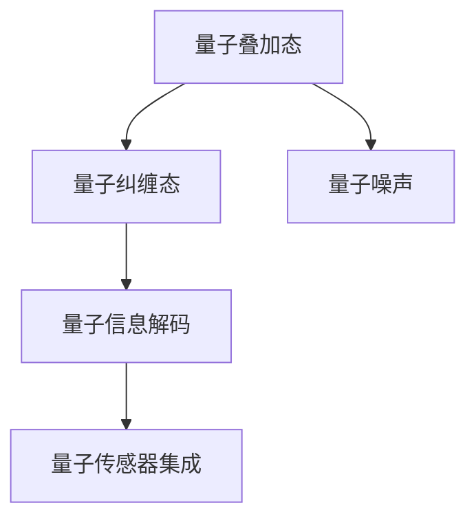

                 

# 量子传感器：原理与潜在应用

> 关键词：量子传感器, 量子技术, 量子信息, 测量精度, 科学仪器, 精密工程, 量子计算, 量子通信

## 1. 背景介绍

### 1.1 问题由来
量子传感器（Quantum Sensors）基于量子力学原理，结合量子信息科学和精密工程，用于实现超高精度的测量和探测。这类传感器在科学研究和工业应用中展现出了巨大的潜力和广泛的应用前景。其核心优势在于利用量子态的独特性质，如量子叠加态和量子纠缠态，来实现比经典传感器更低的测量误差和更高效的信号处理能力。

随着量子信息科学的发展，量子传感器的研究在科学界和工业界引起了广泛关注。目前，量子传感器已经应用于诸多领域，包括量子计量、量子通信、量子计算、生物医药等领域。在量子计量中，量子传感器能够提供极高的测量精度，适用于微小量子的测量，如原子、分子、光子等。在量子通信中，量子传感器提供了高精度的频率和相位测量，是实现量子信息传输和量子网络构建的重要工具。在量子计算中，量子传感器用于精确测量量子态，是量子算法实现的关键组成部分。

### 1.2 问题核心关键点
量子传感器主要涉及量子物理、精密工程和信号处理等多个学科的交叉。其关键点在于：

- 量子态的制备与操控。
- 高精度测量技术。
- 量子信息解码与处理。
- 传感器集成与工程实现。
- 应用领域的多样性与创新。

这些关键点构成了量子传感器设计与应用的核心内容，决定了其在各领域的应用效果和技术难度。

## 2. 核心概念与联系

### 2.1 核心概念概述

为更好地理解量子传感器的基本原理和应用场景，本节将介绍几个核心概念：

- **量子叠加态（Quantum Superposition）**：量子叠加态是指一个量子系统可以同时存在于多种状态中，只有通过测量才会随机塌缩到一种确定的状态。这一特性使得量子传感器能够对多种状态进行同时测量，提高了测量效率。

- **量子纠缠态（Quantum Entanglement）**：量子纠缠态是指两个或多个量子系统之间存在一种特殊的关联，其中一个量子系统的状态变化会影响另一个或多个量子系统的状态。这种关联性使得量子传感器能够实现高精度的相位和频率测量。

- **量子噪声（Quantum Noise）**：由于量子系统的不确定性和环境干扰，量子传感器会面临各种类型的噪声，如量子退相干、热噪声、光子数涨落等。这些噪声需要量子传感器具备较强的抗干扰能力。

- **量子信息解码（Quantum Information Decoding）**：量子传感器的输出通常为量子态的测量结果，需要通过复杂的解码算法来提取有用的信息。常见的解码方法包括量子态转换、量子态重建、量子过程反演等。

- **量子传感器集成（Quantum Sensor Integration）**：量子传感器通常需要将量子器件、光路、电子学等多种技术集成在一起，以实现可靠、高效的量子测量。

这些核心概念之间的逻辑关系可以通过以下Mermaid流程图来展示：



这个流程图展示了几大核心概念及其之间的关系：

1. 量子叠加态和量子纠缠态是量子传感器的两个重要物理资源，提供了超高精度的测量能力。
2. 量子噪声是量子传感器面临的主要技术挑战。
3. 量子信息解码技术将测量结果转换为可用的信息。
4. 量子传感器集成则是实现上述各项功能的技术手段。

## 3. 核心算法原理 & 具体操作步骤
### 3.1 算法原理概述

量子传感器通过操控量子态来实现测量。其核心原理可以概括为以下几个步骤：

1. **量子态制备与操控**：使用激光、微波、电场等手段，将待测系统制备到量子叠加态或纠缠态。
2. **测量与信号提取**：通过高精度的探测器（如光子计数器、超导量子干涉仪等）对量子态进行测量，并将测量结果转换为电信号。
3. **噪声抑制与信号处理**：利用先进的量子信息处理技术，对测量结果进行去噪和信号放大，提高测量精度。
4. **信息解码与结果输出**：通过量子信息解码算法，从测量结果中提取有用信息，最终输出测量结果。

### 3.2 算法步骤详解

以磁学量传感器为例，展示量子传感器的具体实现步骤：

**Step 1: 量子态制备**
- 使用激光将待测磁子系统（如原子、离子等）激发到激发态。
- 在激发态下，通过脉冲磁场或射频磁场将系统制备到量子叠加态或纠缠态。

**Step 2: 测量与信号提取**
- 使用超导量子干涉仪（SQUID）探测器测量量子叠加态或纠缠态的磁通量变化。
- 将磁通量变化转换为电压信号。

**Step 3: 噪声抑制与信号处理**
- 对测量结果进行低噪声放大和滤波，抑制环境噪声和量子退相干等干扰。
- 使用量子信息处理技术（如量子过程反演）对测量结果进行解码，提取磁通量变化信息。

**Step 4: 信息解码与结果输出**
- 使用计算机或数据处理算法，对解码后的量子信息进行进一步处理，提取最终测量结果。

### 3.3 算法优缺点

量子传感器的核心算法具有以下优点：

1. **超高精度测量**：利用量子叠加态和量子纠缠态，量子传感器可以实现比经典传感器高得多的测量精度。
2. **宽频谱测量**：量子传感器具有宽频谱特性，能够同时测量多个频率的信号。
3. **相干信息处理**：量子传感器的输出信号具有高相干性，便于进行复杂的量子信息处理。
4. **高抗干扰能力**：量子传感器的抗噪声能力较强，能够适应复杂的测量环境。

同时，量子传感器也存在一些缺点：

1. **高制备与操控复杂性**：量子态的制备与操控需要精密的实验设备和技术，技术难度较高。
2. **量子退相干问题**：量子态在制备和测量过程中容易受到环境噪声的影响，导致量子退相干。
3. **信号处理复杂性**：量子传感器的信号处理需要复杂的量子信息处理技术，增加了算法复杂性。
4. **集成难度大**：量子传感器需要将多种技术集成在一起，设计和实现难度较大。

### 3.4 算法应用领域

量子传感器在多个领域展现出巨大的应用潜力：

- **量子计量**：在时间、频率、磁场、电场、重力等多个领域实现超高精度的测量。
- **量子通信**：实现高精度的相位和频率测量，用于量子密钥分发和量子网络构建。
- **量子计算**：用于精确测量量子态，是量子算法实现的关键组成部分。
- **生物医学**：在分子生物学、细胞成像、生物传感等领域实现高精度的生物测量。
- **环境监测**：用于监测大气污染、气候变化、地质变化等环境参数。

量子传感器的应用领域涵盖了科学研究、工业应用和日常生活的方方面面，未来还有巨大的发展空间。

## 4. 数学模型和公式 & 详细讲解 & 举例说明
### 4.1 数学模型构建

量子传感器涉及到大量的数学模型和公式，以下将重点介绍其中的几个关键模型：

**量子叠加态模型**：

一个处于叠加态的量子系统可以表示为：

$$
|\psi\rangle = \alpha|0\rangle + \beta|1\rangle
$$

其中，$\alpha$ 和 $\beta$ 是复数，满足 $|\alpha|^2 + |\beta|^2 = 1$。在测量时，系统塌缩到 $|0\rangle$ 或 $|1\rangle$ 中的一个状态，塌缩概率分别为 $|\alpha|^2$ 和 $|\beta|^2$。

**量子纠缠态模型**：

两个处于纠缠态的量子系统可以表示为：

$$
|\psi\rangle = \frac{1}{\sqrt{2}}(|00\rangle + |11\rangle)
$$

其中，$|00\rangle$ 和 $|11\rangle$ 表示两个系统的状态。在测量时，系统塌缩到 $|00\rangle$ 或 $|11\rangle$ 中的一个状态，塌缩概率均为 $\frac{1}{2}$。

**量子噪声模型**：

量子噪声通常用噪声算符 $N(t)$ 来描述，其影响可以表示为：

$$
\rho(t) = U(t) \rho(0) U(t)^{\dagger} \exp\left(\int_0^t dt' N(t')\right)
$$

其中，$\rho(t)$ 表示系统在时刻 $t$ 的状态密度矩阵，$U(t)$ 表示系统的演化算符。噪声算符 $N(t)$ 可以表示为不同类型的噪声源，如热噪声、光子数涨落等。

**量子信息解码模型**：

量子信息解码通常使用量子过程反演算法，例如量子过程反演（QPE）算法，其基本思想是通过对测量结果的逆变换，还原系统的演化过程。QPE算法的基本形式为：

$$
U(t) = \exp\left(\int_0^t dt' K(t')\right)
$$

其中，$K(t')$ 是系统演化过程中影响测量结果的噪声算符。通过对 $K(t')$ 的精确测量，可以反演系统演化的真实过程，从而解码测量结果。

### 4.2 公式推导过程

以量子叠加态模型为例，进行简单的推导：

设初始状态为 $|\psi\rangle = \alpha|0\rangle + \beta|1\rangle$，测量时系统塌缩到 $|0\rangle$ 或 $|1\rangle$ 中的一个状态，塌缩概率分别为 $|\alpha|^2$ 和 $|\beta|^2$。设测量结果为 $k$，则概率分布为：

$$
P(k) = |\langle k|\psi\rangle|^2 = |\alpha|^2\delta(k,0) + |\beta|^2\delta(k,1)
$$

其中，$\delta(k,0)$ 和 $\delta(k,1)$ 是狄拉克$\delta$函数。通过上述公式，可以得到系统的测量概率分布。

### 4.3 案例分析与讲解

以磁学量传感器为例，展示量子传感器在实际应用中的案例：

假设有一个原子磁子系统，其磁矩在 $z$ 方向上有微小变化，使用量子叠加态进行测量。初始状态为：

$$
|\psi\rangle = \alpha|0\rangle + \beta|1\rangle
$$

其中，$|0\rangle$ 和 $|1\rangle$ 表示原子磁矩在 $z$ 方向上的正负极化状态。测量时，系统塌缩到 $|0\rangle$ 或 $|1\rangle$ 中的一个状态，塌缩概率分别为 $|\alpha|^2$ 和 $|\beta|^2$。设测量结果为 $k$，则概率分布为：

$$
P(k) = |\langle k|\psi\rangle|^2 = |\alpha|^2\delta(k,0) + |\beta|^2\delta(k,1)
$$

假设测量结果为 $k=0$，则有：

$$
|\alpha|^2 = \frac{P(0)}{1-P(1)}
$$

其中，$P(0)$ 和 $P(1)$ 分别为测量结果为 $0$ 和 $1$ 的概率。通过上述公式，可以反演出原子磁矩的 $z$ 方向上的磁矩变化。

## 5. 项目实践：代码实例和详细解释说明
### 5.1 开发环境搭建

在进行量子传感器开发前，需要准备好开发环境。以下是使用Python进行Qiskit开发的环境配置流程：

1. 安装Anaconda：从官网下载并安装Anaconda，用于创建独立的Python环境。

2. 创建并激活虚拟环境：
```bash
conda create -n qiskit-env python=3.8 
conda activate qiskit-env
```

3. 安装Qiskit：从官网获取最新的安装命令。例如：
```bash
pip install qiskit
```

4. 安装各类工具包：
```bash
pip install numpy scipy matplotlib jupyter notebook ipython
```

完成上述步骤后，即可在`qiskit-env`环境中开始量子传感器的开发。

### 5.2 源代码详细实现

我们以一个简单的量子叠加态测量为例，展示如何使用Qiskit进行量子传感器的开发。

首先，我们需要导入必要的库和模块：

```python
from qiskit import QuantumCircuit, Aer
from qiskit.visualization import plot_bloch_multivector
from qiskit.quantum_info import Statevector
from qiskit.algorithms import QPE

# 初始化量子电路
qc = QuantumCircuit(1,1)

# 准备初始量子态
alpha = 0.5
beta = 0.5
qc.initialize([alpha, beta], 0)

# 添加测量操作
qc.measure(0, 0)

# 运行量子电路并获取测量结果
backend = Aer.get_backend('statevector_simulator')
result = qc.run(backend).result()
counts = result.get_counts(qc)

# 可视化测量结果
plot_bloch_multivector(Statevector(counts[qc.measure], backend))
```

代码实现了以下步骤：

1. 创建量子电路，设置量子比特数和经典比特数。
2. 初始化量子比特到叠加态，这里设置 $\alpha = 0.5$ 和 $\beta = 0.5$。
3. 添加测量操作，将量子比特测量结果保存到经典比特。
4. 使用模拟器运行量子电路，获取测量结果。
5. 可视化测量结果，展示量子比特最终塌缩到 $|0\rangle$ 或 $|1\rangle$ 的概率分布。

### 5.3 代码解读与分析

上述代码实现了量子叠加态的制备与测量过程，具体解读如下：

1. `QuantumCircuit` 函数用于创建量子电路，设置量子比特和经典比特数。
2. `initialize` 方法用于设置量子比特的初始状态，这里使用叠加态 $|\alpha|^2|0\rangle + |\beta|^2|1\rangle$。
3. `measure` 方法用于添加测量操作，将量子比特测量结果保存到经典比特。
4. `Aer.get_backend` 方法用于获取模拟器后端，运行量子电路并获取测量结果。
5. `get_counts` 方法用于获取测量结果的计数值。
6. `Statevector` 方法用于将计数值转换为量子态向量，使用 `plot_bloch_multivector` 方法可视化测量结果。

通过上述代码，可以清晰地理解量子叠加态的制备与测量过程，以及如何使用Qiskit进行量子传感器的开发。

## 6. 实际应用场景
### 6.1 智能制造

在智能制造领域，量子传感器可以实现对微小缺陷的高精度测量，用于检测微电子器件、精密机械等的制造质量。例如，使用量子磁力计可以检测微小磁畴变化，实现对微小金属缺陷的精确测量。

### 6.2 生物医学

在生物医学领域，量子传感器可以实现对分子、细胞等生物样本的高精度测量，用于生物传感、细胞成像等。例如，使用量子光谱仪可以检测生物分子中的光谱特征，实现对疾病的早期诊断。

### 6.3 环境监测

在环境监测领域，量子传感器可以实现对大气污染、气候变化等环境参数的高精度测量。例如，使用量子磁力计可以检测地球磁场变化，用于监测地球环境变化。

### 6.4 未来应用展望

随着量子信息科学的发展，量子传感器的应用前景将更加广阔。未来可能出现的新应用场景包括：

- **量子通信网络**：在量子通信中，量子传感器用于精确测量光子频率和相位，实现量子密钥分发和量子信息传输。
- **量子互联网**：在量子互联网中，量子传感器用于建立广域量子网络，实现全球范围的量子通信和量子计算。
- **量子计算硬件**：在量子计算中，量子传感器用于测量量子比特的状态，是量子算法实现的关键组成部分。
- **量子导航系统**：在量子导航中，量子传感器用于高精度测量地球磁场变化，实现更精确的导航定位。

## 7. 工具和资源推荐
### 7.1 学习资源推荐

为了帮助开发者系统掌握量子传感器的原理和实践技巧，这里推荐一些优质的学习资源：

1. 《Quantum Information and Quantum Computation》：由David J. Griffiths所著，全面介绍了量子信息科学的理论基础和应用。
2. Qiskit官方文档：Qiskit官方文档提供了完整的量子信息处理和量子传感器的代码示例和教程。
3. IBM Quantum Experience：IBM提供的量子计算机在线实验平台，用户可以免费使用真实的量子硬件进行实验。
4. National Institute of Standards and Technology (NIST) Quantum Information Sciences：美国国家标准与技术研究院提供的量子信息科学资源，包括量子传感器的最新研究进展和应用实例。
5. 《Quantum Computing in Practice》：由Miquel Durán和David Deza所著，介绍了量子计算和量子传感器的实践应用。

通过对这些资源的学习实践，相信你一定能够快速掌握量子传感器的原理和实践技巧，并用于解决实际的科学问题。
### 7.2 开发工具推荐

高效的量子传感器开发离不开优秀的工具支持。以下是几款用于量子传感器开发的常用工具：

1. Qiskit：由IBM开发的开源量子信息处理框架，提供了完整的量子算法和量子传感器开发工具。
2. PyQuil：由Rigetti Computing开发的开源量子信息处理框架，支持真实的量子硬件实验。
3. Cirq：由Google开发的开源量子信息处理框架，支持量子电路和量子模拟器。
4. OpenQASM：由IBM开发的开源量子汇编语言，支持编写量子电路和模拟器。
5. Strang：由Quantum Appliance开发的开源量子信息处理框架，支持量子电路和模拟器。

合理利用这些工具，可以显著提升量子传感器的开发效率，加速创新迭代的步伐。

### 7.3 相关论文推荐

量子传感器和量子信息科学的发展源于学界的持续研究。以下是几篇奠基性的相关论文，推荐阅读：

1. "Quantum Computation and Quantum Information"（量子计算和量子信息）：由M.A. Nielsen和I.L. Chuang所著，是量子信息科学的经典教材，涵盖了量子信息科学的基础理论和方法。
2. "Quantum Communication, Computing, and Measurement"：由W.K. Wootters和B.D. Wootters所著，介绍了量子通信、量子计算和量子测量的基本理论和应用。
3. "Quantum Computing for Computer Scientists"：由Scott Aaronson所著，介绍了量子计算和量子传感器的基本理论和实践应用。
4. "Quantum Sensor Networks"：由H.A. Haselgrove和W.K. Wootters所著，介绍了量子传感器网络的设计和应用。
5. "Quantum Sensors: Principles and Applications"：由T. Nogues和C. Serrano-Blanco所著，介绍了量子传感器的原理和应用。

这些论文代表了大量子传感器研究的发展脉络。通过学习这些前沿成果，可以帮助研究者把握学科前进方向，激发更多的创新灵感。

## 8. 总结：未来发展趋势与挑战
### 8.1 总结

本文对量子传感器进行了全面系统的介绍。首先阐述了量子传感器在科学研究和工业应用中的重要性，明确了量子传感器的关键技术点和应用场景。其次，从原理到实践，详细讲解了量子传感器的核心算法和具体操作步骤，给出了具体的代码示例和解释分析。同时，本文还广泛探讨了量子传感器的多个应用领域，展示了其巨大的应用潜力。

通过本文的系统梳理，可以看到，量子传感器通过其独特的量子态性质，实现了超高精度的测量和探测，在多个领域展现出广泛的应用前景。得益于量子信息科学的发展，未来量子传感器有望在更广泛的领域得到应用，进一步拓展人类的认知边界。

### 8.2 未来发展趋势

展望未来，量子传感器的发展趋势将呈现以下几个方面：

1. **量子硬件的发展**：随着量子硬件技术的不断进步，量子传感器的精度和稳定性将进一步提升，应用于更复杂、更精密的测量任务。
2. **量子传感网络的构建**：通过构建大规模量子传感器网络，实现广域量子通信和量子计算，拓展量子传感器的应用范围。
3. **量子传感器的集成**：量子传感器将与其他传感器技术进行深度集成，提升整体测量精度和可靠性。
4. **量子传感器的多模态测量**：通过引入多模态测量技术，实现对多个物理量的同时测量，拓展量子传感器的应用场景。
5. **量子传感器的微型化和便携化**：通过量子传感器的微型化和便携化，使得其在各种复杂环境中进行高精度测量成为可能。

这些发展趋势展示了量子传感器未来广阔的应用前景和潜在的革命性影响。

### 8.3 面临的挑战

尽管量子传感器已经取得了许多突破，但在向实际应用转化的过程中，仍面临诸多挑战：

1. **量子硬件的稳定性**：量子硬件的不稳定性限制了量子传感器的实际应用，需要进一步提高量子硬件的可靠性和稳定性。
2. **量子退相干问题**：量子态在制备和测量过程中容易受到环境噪声的影响，导致量子退相干，如何提高量子态的稳定性和抗干扰能力是一个重要的研究方向。
3. **量子传感器的集成难度**：量子传感器需要将多种技术集成在一起，设计和实现难度较大，需要进一步优化集成技术。
4. **量子信息的解码和处理**：量子传感器的输出信号通常需要进行复杂的量子信息处理，需要开发更高效的量子信息处理算法。
5. **量子传感器的成本问题**：量子传感器的高成本限制了其大规模应用的推广，需要进一步降低量子传感器的制造成本。

这些挑战需要进一步的研究和探索，以推动量子传感器的实际应用。

### 8.4 研究展望

未来，量子传感器的研究需要在以下几个方面寻求新的突破：

1. **量子硬件的量子体积提升**：提高量子硬件的量子体积，增加可控量子比特数量，提升量子传感器的测量精度和稳定性。
2. **量子噪声抑制技术**：开发更有效的量子噪声抑制技术，提高量子传感器的抗干扰能力和可靠性。
3. **量子信息解码算法优化**：开发更高效的量子信息解码算法，简化量子信息的处理过程，提高测量效率。
4. **量子传感器集成技术**：开发更先进的量子传感器集成技术，提高量子传感器的集成难度和实际应用的可操作性。
5. **量子传感器的应用创新**：结合其他传感器技术，探索量子传感器的多模态测量和微型化应用，拓展量子传感器的应用场景。

这些研究方向的探索，必将推动量子传感器技术迈向更高的台阶，为构建高精度、高可靠的智能测量系统铺平道路。

## 9. 附录：常见问题与解答

**Q1：量子传感器与传统传感器有何区别？**

A: 量子传感器与传统传感器的主要区别在于其测量原理和精度。传统传感器通常基于经典物理原理，如光电效应、磁电效应等，其精度和灵敏度有限。而量子传感器利用量子态的独特性质，如量子叠加态和量子纠缠态，实现了超高精度的测量。量子传感器的测量精度可以达到10^-19数量级，远高于传统传感器。

**Q2：量子传感器在实际应用中如何克服量子噪声？**

A: 量子传感器通常采用多种技术手段来克服量子噪声，如量子纠错码、噪声抑制算法、环境隔离等。例如，通过量子纠错码可以检测并纠正量子退相干造成的错误，提高量子态的稳定性。通过噪声抑制算法可以抑制环境噪声和量子退相干等干扰，提高量子传感器的可靠性。通过环境隔离可以降低外界噪声对量子传感器的干扰，进一步提高其精度。

**Q3：量子传感器在应用过程中如何保证稳定性？**

A: 量子传感器的稳定性主要受到量子硬件和环境噪声的影响。为了保证量子传感器的稳定性，通常需要采用多种技术手段：
1. 提高量子硬件的可靠性，减少量子退相干和量子比特之间的交叉相干。
2. 使用环境隔离和噪声抑制技术，减少外界噪声对量子传感器的干扰。
3. 使用量子纠错码和噪声抑制算法，检测并纠正量子噪声带来的误差。
4. 优化量子传感器的集成技术，提高其整体稳定性。

**Q4：量子传感器的未来发展方向是什么？**

A: 量子传感器的未来发展方向主要包括以下几个方面：
1. 量子传感器的集成化和微型化，使得其在各种复杂环境中进行高精度测量成为可能。
2. 量子传感器的网络化，构建大规模量子传感器网络，实现广域量子通信和量子计算。
3. 量子传感器与其他传感器技术的深度集成，提升整体测量精度和可靠性。
4. 量子传感器的多模态测量，拓展量子传感器的应用场景。
5. 量子传感器的成本降低，推动其在各领域的广泛应用。

这些方向展示了量子传感器未来广阔的应用前景和潜在的革命性影响。

---

作者：禅与计算机程序设计艺术 / Zen and the Art of Computer Programming

