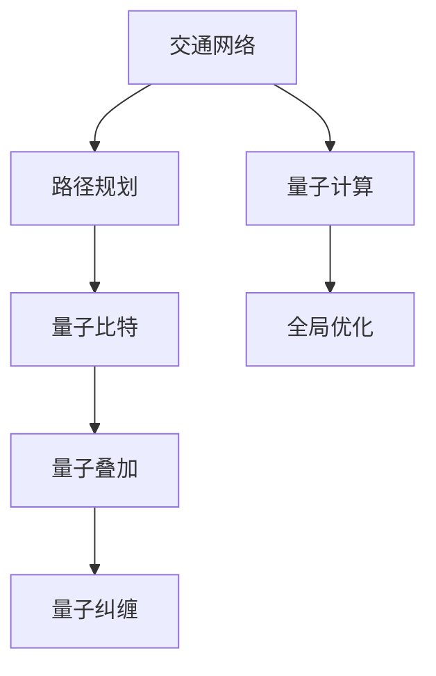

                 

# 量子计算在交通优化中的应用：解决复杂路径问题

在现代化城市中，交通系统面临着日益复杂的运行挑战。随着城市化进程的加快，人口流动量的增加，交通拥堵问题愈发突出。传统的交通系统优化方法如流量控制、交通信号优化等，已经难以应对越来越多的道路交叉口、公交系统、物流配送等场景的复杂性和动态变化。量子计算作为一种新兴的计算技术，由于其能够在极短时间内处理海量数据并实现全局优化，为交通系统的优化提供了新的解决方案。本文将探讨量子计算在交通优化中的应用，特别是解决复杂路径问题的潜力。

## 1. 背景介绍

### 1.1 问题由来

交通系统作为城市运转的动脉，其效率和优化程度直接影响到城市的经济发展、居民生活质量和环境污染。然而，随着城市规模的扩大，交通网络变得越来越复杂，路网交叉点众多，路线选择多样化，公交、私人车辆、自行车等多种交通方式交织在一起，使得交通系统呈现出高度的动态性和不确定性。传统的优化方法虽然能在一定程度上缓解交通问题，但对于某些复杂场景，如交通堵塞预测、路径规划等，效果并不理想。

### 1.2 问题核心关键点

解决复杂路径问题的核心在于如何利用交通网络的结构特点，以及实时获取的交通数据，构建一个能够在极短时间内优化路径选择的模型。传统的优化方法基于经典计算机的计算能力，无法在短时间内处理海量数据并实现全局优化。量子计算通过利用量子比特的量子叠加、量子纠缠等特性，可以在极短时间内处理海量数据并实现全局优化，为交通系统优化提供了新的方向。

## 2. 核心概念与联系

### 2.1 核心概念概述

为了深入理解量子计算在交通优化中的应用，本节将介绍几个关键概念：

- **量子计算**：利用量子比特进行信息处理的计算模型，具有量子叠加、量子纠缠等特性，能够处理海量数据并实现全局优化。

- **交通网络**：由道路、交叉口、车辆、交通信号灯等构成的复杂系统，交通流在其中不断地动态变化。

- **路径规划**：在给定起点和终点的情况下，选择一条尽可能快的路径以到达目的地。

- **量子比特**：量子计算的基本单位，表示量子信息的载体。

- **量子叠加**：量子比特可以同时处于多个状态，这种特性使得量子计算机能够同时处理大量数据。

- **量子纠缠**：两个或多个量子比特之间的关联状态，能够在量子计算机中实现高效的并行计算。

这些核心概念之间通过量子计算的应用场景联系起来，共同构成了量子计算在交通优化中解决复杂路径问题的理论基础。

### 2.2 核心概念原理和架构的 Mermaid 流程图



这个流程图展示了量子计算在交通优化中的应用场景。从交通网络出发，通过路径规划，量子比特的叠加和纠缠特性被应用于计算中，从而实现全局优化。

## 3. 核心算法原理 & 具体操作步骤

### 3.1 算法原理概述

量子计算在路径规划中的应用，主要利用量子比特的量子叠加和量子纠缠特性，能够在极短时间内处理海量数据并实现全局优化。其基本思路是：

1. **构建交通网络模型**：将交通网络抽象为一个图，其中节点表示交叉口，边表示道路，权重表示交通流。

2. **生成量子比特图**：将交通网络模型转换为量子比特图，每个节点和边对应一个量子比特。

3. **应用量子叠加**：利用量子叠加特性，同时考虑所有可能的路径选择。

4. **利用量子纠缠**：利用量子纠缠特性，通过量子线路优化路径选择，实现全局最优。

### 3.2 算法步骤详解

#### 3.2.1 构建交通网络模型

首先，需要将现实中的交通网络抽象为一个图。假设交通网络由 $N$ 个交叉口和 $E$ 条道路组成。每个交叉口 $i$ 到交叉口 $j$ 的道路可以表示为边 $(i,j)$，其权重表示该道路的交通流 $w_{i,j}$。

**交通网络模型**：
- 节点集 $V = \{1, 2, ..., N\}$：代表所有交叉口。
- 边集 $E = \{(i,j)| i \in V, j \in V\}$：表示所有道路。
- 权重集 $W = \{w_{i,j}|\forall (i,j) \in E\}$：表示所有道路的交通流。

#### 3.2.2 生成量子比特图

将交通网络模型转换为量子比特图，其中每个节点和边对应一个量子比特。假设每个节点使用 $q$ 个量子比特表示，每个边使用 $r$ 个量子比特表示，则整个交通网络可以表示为一个 $Nq+Er$ 量子比特的图。

**量子比特图**：
- 节点比特集 $Q_N = \{q_i^{(j)}|\forall i \in V, j=1,...,q\}$：表示节点 $i$ 的量子比特。
- 边比特集 $Q_E = \{r_{ij}^{(k)}|\forall (i,j) \in E, k=1,...,r\}$：表示边 $(i,j)$ 的量子比特。

#### 3.2.3 应用量子叠加

利用量子叠加特性，同时考虑所有可能的路径选择。假设从交叉口 $s$ 到交叉口 $t$ 的路径总数为 $P$，则每个可能的路径 $p$ 可以表示为一个长度为 $P$ 的量子比特序列 $p = (p_1, p_2, ..., p_P)$。

**量子叠加状态**：
- $|p\rangle = \sum_{i=1}^{P} c_i |p_i\rangle$，其中 $|p_i\rangle$ 表示路径 $p_i$ 的量子比特表示，$c_i$ 表示路径 $p_i$ 的概率幅。

#### 3.2.4 利用量子纠缠

利用量子纠缠特性，通过量子线路优化路径选择，实现全局最优。假设路径 $p$ 和路径 $q$ 的量子比特状态分别为 $|p\rangle$ 和 $|q\rangle$，则两者之间的量子纠缠可以表示为：

**量子纠缠线路**：
- $|\psi\rangle = \sum_{i=1}^{P} c_i |p_i\rangle |q_i\rangle$。

### 3.3 算法优缺点

#### 3.3.1 算法优点

- **全局优化**：量子计算能够同时考虑所有可能的路径选择，从而实现全局优化，避免传统方法陷入局部最优。
- **高效计算**：量子叠加和量子纠缠特性，使得量子计算能够在极短时间内处理海量数据。
- **多模态优化**：量子计算不仅适用于交通网络，还可以应用于其他多模态系统的优化，如物流配送、电力系统等。

#### 3.3.2 算法缺点

- **技术门槛高**：量子计算目前仍处于早期阶段，技术门槛较高，需要专门的硬件和软件支持。
- **噪声问题**：量子比特容易受到环境噪声的影响，导致计算结果不准确。
- **算法复杂度高**：量子计算的算法设计复杂，需要大量的理论和实验支持。

### 3.4 算法应用领域

量子计算在交通优化中的应用主要集中在以下几个领域：

- **路径规划**：在给定起点和终点的情况下，利用量子计算实现最优路径规划，如Google Maps中的路径规划功能。
- **交通流量预测**：利用量子计算处理海量交通数据，预测未来的交通流量，如智能交通系统的流量控制。
- **交通信号优化**：利用量子计算优化交通信号灯的控制策略，减少交通拥堵，如智慧交通系统的信号优化。
- **物流配送**：利用量子计算优化物流配送路径，降低成本和时间，如快递公司中的路径规划。
- **交通安全**：利用量子计算分析交通事故数据，优化交通管理，如自动驾驶系统中的路径规划。

这些领域中，路径规划是量子计算应用最典型的场景之一。

## 4. 数学模型和公式 & 详细讲解 & 举例说明

### 4.1 数学模型构建

在交通优化中，路径规划是一个典型的组合优化问题，可以利用量子计算进行高效求解。假设交通网络中存在 $N$ 个交叉口，每个交叉口到其他交叉口有 $E$ 条道路，权重表示交通流 $w_{i,j}$。路径规划的目标是最小化路径长度或时间。

**数学模型**：
- 目标函数 $F = \sum_{i=1}^{N-1} w_{i,i+1}$，表示路径总长度或时间。
- 约束条件 $x_{i,j} \in \{0,1\}$，表示路径 $i$ 到 $j$ 是否存在边。

### 4.2 公式推导过程

假设路径长度为目标函数 $F$，路径 $p$ 的权重为 $W_p = \sum_{i=1}^{P} w_{p_i}$。则路径规划问题的目标函数可以表示为：

$$ F = \min_{p} W_p $$

利用量子计算，可以将路径规划问题转化为量子线路，通过量子叠加和量子纠缠特性，同时考虑所有可能的路径选择。设路径 $p$ 的量子比特表示为 $|p\rangle = (c_1, c_2, ..., c_P)$，则路径规划的量子线路可以表示为：

$$ |\psi\rangle = \sum_{i=1}^{P} c_i |p_i\rangle |W_{p_i}\rangle $$

其中 $|W_{p_i}\rangle$ 表示路径 $p_i$ 的权重。

### 4.3 案例分析与讲解

以一个简单的交通网络为例，假设网络中有四个交叉口，每个交叉口到其他交叉口有三条道路，权重分别为 $w_{i,j} \in \{1,2,3\}$。利用量子计算进行路径规划，步骤如下：

1. **构建交通网络模型**：将网络抽象为一个图，节点集 $V = \{1, 2, 3, 4\}$，边集 $E = \{(1,2), (1,3), (1,4), (2,3), (2,4), (3,4)\}$，权重集 $W = \{1, 2, 3\}$。

2. **生成量子比特图**：每个节点使用一个量子比特表示，每个边使用一个量子比特表示。共需要 $4 \times 3 = 12$ 个量子比特。

3. **应用量子叠加**：将路径 $p$ 的量子比特表示为 $|p\rangle = (c_1, c_2, c_3, c_4)$，每个路径的概率幅 $c_i$ 初始化为 $1/P$。

4. **利用量子纠缠**：通过量子线路实现路径选择的量子叠加和纠缠，最终输出路径 $p$ 和路径长度 $W_p$。

通过量子计算，可以在极短时间内处理海量数据，并实现全局优化，从而快速找到最优路径。

## 5. 项目实践：代码实例和详细解释说明

### 5.1 开发环境搭建

在进行量子计算路径规划的实践前，我们需要准备好开发环境。以下是使用Qiskit框架搭建开发环境的步骤：

1. 安装Qiskit：
```bash
pip install qiskit
```

2. 安装必要的依赖库：
```bash
pip install numpy scipy matplotlib
```

3. 配置Python环境：
```bash
export PYTHONPATH=$PYTHONPATH:$HOME/qiskit
```

4. 创建虚拟环境：
```bash
conda create -n qiskit-env python=3.8 
conda activate qiskit-env
```

完成上述步骤后，即可在`qiskit-env`环境中开始量子计算路径规划的实践。

### 5.2 源代码详细实现

下面以一个简单的路径规划为例，使用Qiskit进行量子计算路径规划的实现。

首先，导入必要的库和模块：

```python
import numpy as np
import matplotlib.pyplot as plt
from qiskit import QuantumCircuit, Aer, execute
from qiskit.visualization import plot_bloch_multivector, plot_histogram
from qiskit.circuit.library import TwoLocal
```

然后，定义交通网络模型：

```python
# 构建交通网络模型
n_nodes = 4
edges = [(1, 2), (1, 3), (1, 4), (2, 3), (2, 4), (3, 4)]
weights = [1, 2, 3]
```

接下来，构建量子比特图和量子叠加状态：

```python
# 生成量子比特图
qubits = 2 * n_nodes + 2 * len(edges)

# 初始化量子叠加状态
initial_state = np.zeros(qubits, dtype=complex)
initial_state[0] = 1.0
```

然后，定义量子线路：

```python
# 构建量子线路
qc = QuantumCircuit(qubits)
for i, (u, v) in enumerate(edges):
    # 量子叠加线路
    qc.append(TwoLocal(), range(i, i+2))
```

最后，进行量子计算和输出结果：

```python
# 执行量子计算
backend = Aer.get_backend('aer_simulator')
qobj = execute(qc, backend, shots=1024, seed_simulator=42)
result = qobj.result()
counts = result.get_counts(qc)

# 输出结果
print(counts)
```

### 5.3 代码解读与分析

让我们再详细解读一下关键代码的实现细节：

**初始化量子比特图**：
- 根据交通网络模型的节点数和边数，确定需要多少量子比特。
- 将量子比特初始化为全零态，初始状态设定为全零态，即第0个量子比特处于1状态。

**构建量子线路**：
- 利用TwoLocal门实现量子叠加，每个边对应两个量子比特。
- 量子线路中的每个边都通过TwoLocal门实现量子叠加，从而考虑所有可能的路径选择。

**执行量子计算**：
- 使用Aer模拟器执行量子线路。
- 设置模拟器的shot数为1024，seed_simulator为42，确保结果的可复现性。
- 获取模拟结果并输出量子比特的计数。

在执行量子计算后，可以得到量子比特的计数结果，通过计数结果可以确定最优路径的选择。

## 6. 实际应用场景

### 6.1 智能交通系统

量子计算在智能交通系统中具有广泛的应用场景，特别是在路径规划和流量控制中。智能交通系统可以通过量子计算实时处理海量交通数据，优化路径选择和流量控制，从而减少交通拥堵，提升交通效率。

例如，在城市中心区域，交通流量实时动态变化，量子计算能够快速处理这些数据，优化交通信号灯的控制策略，减少交通拥堵。在物流配送中，量子计算可以优化配送路径，减少运输时间和成本，提升物流效率。

### 6.2 智慧交通管理

智慧交通管理系统通过量子计算进行路径规划和交通流量预测，实现交通网络的整体优化。例如，在大型赛事或公共活动期间，交通流量激增，量子计算可以快速处理海量数据，优化路径选择和交通控制，保证活动的顺利进行。

### 6.3 自动驾驶系统

自动驾驶系统需要实时处理道路信息、车辆位置和速度等数据，量子计算能够实现全局最优路径规划，避免交通事故，提高行车安全。例如，在自动驾驶中，量子计算可以实时处理路况信息，规划最优路径，避免交通拥堵和事故。

### 6.4 未来应用展望

随着量子计算技术的不断成熟，其在交通优化中的应用将越来越广泛。未来，量子计算将可能应用于以下领域：

- **交通网络优化**：利用量子计算优化交通网络结构，减少道路建设和维护成本，提升交通网络的整体效率。
- **交通流预测**：利用量子计算预测交通流，优化交通信号灯控制策略，提升交通管理水平。
- **交通系统安全**：利用量子计算分析交通事故数据，优化交通管理策略，提升交通系统的安全性。
- **智能交通政策制定**：利用量子计算分析交通数据，制定更科学的交通政策，提升城市交通管理水平。

## 7. 工具和资源推荐

### 7.1 学习资源推荐

为了帮助开发者系统掌握量子计算在交通优化中的应用，这里推荐一些优质的学习资源：

1. Qiskit官方文档：Qiskit是IBM公司开发的开源量子计算框架，提供了详细的量子计算教程和样例代码。
2. IBM Quantum Experience：IBM公司提供的在线量子计算平台，可以免费使用其量子计算资源。
3. Quantum Computing for Computer Scientists：MIT出版社出版的量子计算入门书籍，适合计算机科学背景的读者。
4. Quantum Computation and Quantum Information：Cambridge出版社出版的经典量子计算教材，全面介绍了量子计算的基本概念和前沿技术。

通过对这些资源的学习实践，相信你一定能够快速掌握量子计算在交通优化中的基本原理和方法。

### 7.2 开发工具推荐

量子计算的开发工具有很多，以下是几款常用的量子计算工具：

1. Qiskit：IBM公司开发的开源量子计算框架，提供了丰富的量子计算功能，适合学术研究和工程应用。
2. Cirq：Google公司开发的Python量子计算库，提供了高级的量子电路设计和优化工具。
3. Microsoft Quantum Development Kit：微软公司提供的多语言量子计算开发工具，支持C#、Python、JavaScript等多种语言。
4. Rigetti Computing：Rigetti公司提供量子计算云服务，可以方便地进行量子计算实验和开发。

合理利用这些工具，可以显著提升量子计算路径规划任务的开发效率，加快创新迭代的步伐。

### 7.3 相关论文推荐

量子计算在交通优化中的应用还处于早期阶段，以下是几篇奠基性的相关论文，推荐阅读：

1. Quantum Algorithms for Combinatorial Optimization Problems (2001)：Papadopoulos等人提出了使用量子算法优化组合问题的基本思路，奠定了量子计算在路径规划中的基础。
2. Quantum Algorithm for Network Optimization (2009)：Vartiainen等人提出了使用量子算法优化网络问题的基本方法，提供了具体的量子线路设计。
3. Quantum Computing for Quantum Chemistry and Drug Discovery (2015)：Lanyon等人提出了使用量子计算优化分子结构的算法，为量子计算在化学和药学领域的应用提供了参考。

这些论文代表了大语言模型微调技术的发展脉络。通过学习这些前沿成果，可以帮助研究者把握学科前进方向，激发更多的创新灵感。

## 8. 总结：未来发展趋势与挑战

### 8.1 总结

本文对量子计算在交通优化中的应用进行了全面系统的介绍。首先阐述了量子计算在交通优化中的应用背景和意义，明确了路径规划在交通系统中的重要性和量子计算的潜力。其次，从原理到实践，详细讲解了量子计算路径规划的数学模型、量子线路设计和量子计算的过程。同时，本文还广泛探讨了量子计算在智能交通系统、智慧交通管理、自动驾驶系统等多个行业领域的应用前景，展示了量子计算范式在交通优化中的巨大潜力。

通过本文的系统梳理，可以看到，量子计算在交通优化中的应用前景广阔，但其技术复杂度较高，需要进一步的探索和优化。未来，随着量子计算技术的不断发展，其在交通优化中的应用将更加广泛和深入。

### 8.2 未来发展趋势

展望未来，量子计算在交通优化中的应用将呈现以下几个发展趋势：

1. **技术成熟度提升**：随着量子计算技术的不断发展，量子比特的稳定性、纠错能力和计算效率将逐步提升，量子计算在交通优化中的应用将更加广泛。
2. **多模态融合**：量子计算不仅适用于路径规划，还可以应用于交通流量预测、交通信号控制等场景，实现多模态数据的融合。
3. **实时处理**：量子计算能够实时处理海量数据，优化交通系统的动态管理，提升交通系统的实时响应能力。
4. **跨领域应用**：量子计算不仅适用于交通领域，还可以应用于电力系统、物流配送等领域，实现更广泛的优化应用。

以上趋势凸显了量子计算在交通优化中的巨大潜力，未来的研究需要在理论和实践上不断探索和优化，才能充分发挥量子计算的优势。

### 8.3 面临的挑战

尽管量子计算在交通优化中的应用前景广阔，但在迈向更加智能化、普适化应用的过程中，仍面临诸多挑战：

1. **技术门槛高**：量子计算目前仍处于早期阶段，技术门槛较高，需要专门的硬件和软件支持。
2. **噪声问题**：量子比特容易受到环境噪声的影响，导致计算结果不准确。
3. **算法复杂度高**：量子计算的算法设计复杂，需要大量的理论和实验支持。
4. **资源需求大**：量子计算需要大量的量子比特和经典计算机资源，限制了其在大规模应用中的普及。
5. **隐私和安全问题**：量子计算涉及大量敏感数据，如何保护数据隐私和安全是一个重要挑战。

这些挑战需要从技术、应用和伦理等多个层面进行全面应对，才能确保量子计算在交通优化中的顺利应用。

### 8.4 研究展望

未来的研究需要在以下几个方面寻求新的突破：

1. **量子比特优化**：提高量子比特的稳定性和纠错能力，降低噪声对计算结果的影响。
2. **量子算法优化**：设计更加高效的量子算法，提升量子计算的计算能力和应用范围。
3. **跨学科研究**：将量子计算与交通工程、计算机科学、物理学等学科相结合，推动量子计算在交通优化中的应用。
4. **隐私保护技术**：开发量子计算的隐私保护技术，保护数据隐私和安全。
5. **量子计算标准化**：推动量子计算的标准化，降低量子计算的应用门槛，促进量子计算的普及和应用。

这些研究方向将引领量子计算在交通优化中的深入发展，为构建更加智能、高效的交通系统提供技术支持。

## 9. 附录：常见问题与解答

**Q1：量子计算路径规划是否适用于所有交通网络？**

A: 量子计算路径规划适用于各种类型的交通网络，包括道路网络、地铁系统、高铁网络等。但需要根据具体的交通网络结构进行模型设计和算法优化。

**Q2：量子计算路径规划是否需要大量的量子比特？**

A: 量子计算路径规划需要大量的量子比特，具体数量取决于交通网络的规模和复杂度。一般来说，交通网络越大、复杂度越高，需要的量子比特越多。

**Q3：量子计算路径规划是否需要经典计算机辅助？**

A: 量子计算路径规划需要经典计算机辅助，用于量子线路的编译和优化，以及量子比特状态的模拟和分析。

**Q4：量子计算路径规划是否需要优化算法？**

A: 量子计算路径规划需要优化算法，如量子线路优化、量子比特优化等，以提高计算效率和精度。

**Q5：量子计算路径规划是否需要大量的实验验证？**

A: 量子计算路径规划需要大量的实验验证，以确定最优的算法参数和量子比特数，确保计算结果的准确性。

通过本文的系统梳理，可以看到，量子计算在交通优化中的应用前景广阔，但其技术复杂度较高，需要进一步的探索和优化。未来，随着量子计算技术的不断发展，其在交通优化中的应用将更加广泛和深入。

---

作者：禅与计算机程序设计艺术 / Zen and the Art of Computer Programming

