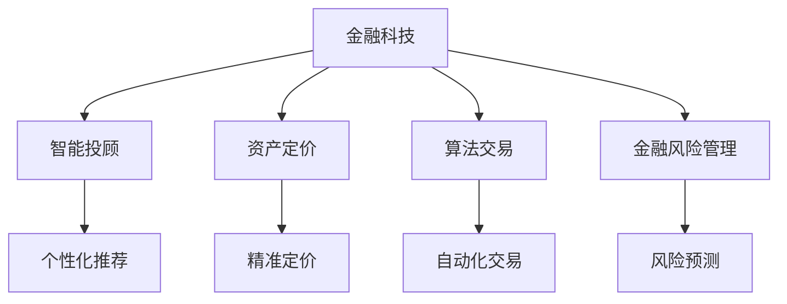

                 

# 金融科技在注意力经济中的机遇

> 关键词：金融科技, 注意力经济, 智能投顾, 资产定价, 算法交易, 金融风险管理

## 1. 背景介绍

### 1.1 问题由来

在当今数字经济时代，注意力作为一种稀缺资源，成为商家争夺的焦点。随着互联网技术的不断进步，消费者的时间被大量数字内容所占用，商家如何有效吸引并保持消费者注意力，成为提高营销效果和业务收益的关键。金融科技(FinTech)作为数字化时代的产物，在注意力经济中扮演了重要角色。通过对金融产品的创新设计、营销策略的优化、风险管理的智能化，金融科技不仅提升了自身的盈利能力，也改善了消费者体验，推动了整个金融行业的转型升级。

### 1.2 问题核心关键点

金融科技在注意力经济中的机遇，主要体现在以下几个方面：

- 利用大数据和机器学习算法，实现对消费者行为的精准预测和个性化营销，提升广告投放效率和转化率。
- 通过智能投顾和资产定价模型，提供量身定制的投资建议，增强用户的信任和黏性。
- 运用算法交易和大数据分析技术，提高资产管理效率，降低交易成本。
- 采用智能风控模型和区块链技术，提升金融产品的透明度和安全性，增强用户的信任。
- 结合物联网和智能合约，实现更智能、更高效的金融服务，提升用户体验和满意度。

这些关键点共同构成了金融科技在注意力经济中的重要机遇，推动了金融科技与传统金融业的深度融合，促进了数字经济的发展。

## 2. 核心概念与联系

### 2.1 核心概念概述

为更好地理解金融科技在注意力经济中的作用，本节将介绍几个密切相关的核心概念：

- 金融科技(FinTech)：利用计算机技术和互联网技术，对传统金融行业进行改造和创新，提高金融服务的效率、降低成本、提升用户体验。
- 注意力经济：以消费者的注意力为商品，通过争夺注意力来获取经济收益的商业模式。注意力经济不仅包括传统广告，还涵盖了视频、音频、社交媒体等多种形式的数字内容。
- 智能投顾(Robo-Advisor)：使用机器学习和自然语言处理等技术，为用户提供自动化、个性化的投资建议和资产管理服务。
- 资产定价：通过模型分析金融资产的风险、收益等属性，对其价值进行量化评估，为投资决策提供依据。
- 算法交易：利用计算机算法自动化执行交易策略，提高交易效率和收益，降低交易成本。
- 金融风险管理：采用先进的风险评估和预测模型，识别和管理金融产品的风险，保障投资者利益。

这些核心概念之间的逻辑关系可以通过以下Mermaid流程图来展示：



这个流程图展示了大语言模型的核心概念及其之间的关系：

1. 金融科技通过智能投顾、资产定价、算法交易等技术手段，为用户提供个性化和精准的服务。
2. 资产定价模型帮助投资者更准确地评估金融资产价值，为其投资决策提供依据。
3. 算法交易利用计算机算法实现自动化交易，提高效率和收益。
4. 金融风险管理通过预测和控制金融产品的风险，保障投资者利益。
5. 智能投顾通过数据分析和机器学习算法，实现对消费者行为的精准预测和个性化营销，提升用户信任和黏性。

这些概念共同构成了金融科技在注意力经济中的核心框架，使其能够更好地满足消费者需求，提升自身盈利能力。

## 3. 核心算法原理 & 具体操作步骤
### 3.1 算法原理概述

金融科技在注意力经济中的应用，主要基于以下算法原理：

- 个性化推荐算法：利用大数据和机器学习算法，对消费者的行为、偏好进行建模和预测，提供个性化的金融产品推荐和服务。
- 智能投顾算法：通过深度学习、自然语言处理等技术，构建智能投顾模型，为用户提供自动化、个性化的投资建议和资产管理。
- 资产定价模型：基于统计学、经济学、金融学等多学科知识，构建资产定价模型，量化评估金融资产的价值。
- 算法交易模型：使用人工智能算法优化交易策略，自动化执行交易，提高交易效率和收益，降低交易成本。
- 风险管理模型：采用机器学习、深度学习等技术，建立金融风险预测和控制模型，提升金融产品的透明度和安全性。

这些算法原理构成了金融科技在注意力经济中的核心技术框架，使其能够更好地实现个性化服务、精准定价、自动化交易和风险控制等功能。

### 3.2 算法步骤详解

金融科技在注意力经济中的应用，一般包括以下几个关键步骤：

**Step 1: 数据收集与预处理**
- 收集消费者的行为数据、偏好数据、交易数据等，建立数据仓库。
- 对数据进行清洗、去重、归一化等预处理，保证数据的质量和一致性。

**Step 2: 算法建模**
- 根据具体应用场景，选择合适的算法模型。例如，针对个性化推荐应用，可以选择协同过滤、深度神经网络等模型。
- 使用机器学习或深度学习算法，对模型进行训练和优化，确保模型的准确性和泛化能力。

**Step 3: 模型评估与部署**
- 在测试集上对模型进行评估，选择最优模型进行部署。
- 将模型集成到金融科技产品中，实现个性化推荐、智能投顾、资产定价、算法交易、风险管理等功能。

**Step 4: 持续优化**
- 定期收集新的数据，更新和优化模型，保持其高性能和稳定性。
- 采用A/B测试等方法，不断优化算法和产品体验，提升用户满意度。

**Step 5: 反馈与迭代**
- 收集用户反馈，及时调整和优化算法和产品功能。
- 根据市场变化和用户需求，进行功能和算法的迭代开发，确保金融科技产品的持续创新。

### 3.3 算法优缺点

金融科技在注意力经济中的应用，具有以下优点：

- 提升用户体验：通过个性化推荐和智能投顾，满足用户多样化的金融需求，提升用户满意度和忠诚度。
- 降低成本：利用算法交易和大数据分析，提高资产管理效率，降低交易成本。
- 提高决策准确性：通过资产定价模型和风险管理模型，提升投资决策的科学性和准确性，降低风险。
- 增强透明度：采用区块链和智能合约技术，提升金融产品的透明度和安全性，增强用户信任。
- 促进创新：基于大数据和人工智能技术，金融科技不断推出新的金融产品和服务，推动金融行业的创新发展。

同时，这些算法也存在一定的局限性：

- 数据隐私问题：收集和使用消费者数据，需要遵守数据隐私法律法规，保护消费者隐私权益。
- 模型风险：过度依赖算法模型，可能导致模型过拟合或泛化能力不足，影响决策准确性。
- 技术壁垒：需要高水平的技术团队和丰富的数据资源，对中小企业和初创企业来说，技术门槛较高。
- 市场竞争激烈：金融科技行业竞争激烈，需要不断创新和优化，才能保持竞争优势。

### 3.4 算法应用领域

金融科技在注意力经济中的应用，主要包括以下几个领域：

- 个性化金融产品推荐：通过分析消费者的行为数据，推荐个性化的金融产品和服务。
- 智能投顾和财富管理：利用智能投顾模型，为用户提供自动化、个性化的投资建议和资产管理。
- 资产定价与投资决策：使用资产定价模型，量化评估金融资产的价值，指导投资决策。
- 算法交易与自动化投资：利用算法交易技术，提高交易效率和收益，降低交易成本。
- 金融风险管理与合规：采用智能风控模型和区块链技术，提升金融产品的透明度和安全性。

此外，金融科技还广泛应用于供应链金融、资产证券化、互联网支付等多个领域，推动了数字经济的发展。

## 4. 数学模型和公式 & 详细讲解 & 举例说明

### 4.1 数学模型构建

金融科技在注意力经济中的应用，涉及到大量的数学模型和算法。以下是几个关键数学模型和算法：

- **协同过滤算法**：用于个性化推荐，通过分析用户行为数据，推荐相似用户的偏好。

  $$
  \text{推荐}(y) = \frac{\text{预测值}(y)}{\text{预测值}(y)+\text{实际值}(y)}
  $$

- **深度神经网络**：用于智能投顾和资产定价，通过多层神经网络模型，对用户行为和市场数据进行建模和预测。

  $$
  \text{输出} = \text{softmax}(\text{预测值})
  $$

- **资产定价模型**：用于量化评估金融资产的价值，常见模型包括CAPM、Fama-French模型等。

  $$
  \text{资产价格} = \text{无风险利率} + \beta\text{市场风险溢价} + \alpha\text{公司特有风险溢价}
  $$

- **算法交易模型**：用于自动化执行交易策略，常见算法包括高频交易算法、量化对冲算法等。

  $$
  \text{交易策略} = \text{信号} \times \text{杠杆} + \text{风险控制}
  $$

- **风险管理模型**：用于预测和控制金融产品的风险，常见算法包括CVA、Var模型等。

  $$
  \text{风险} = \text{实际损失} - \text{预期损失}
  $$

### 4.2 公式推导过程

以下是一些核心模型的推导过程：

**协同过滤算法推导**：

假设用户A和用户B都喜欢的商品为I和J，用户A对商品I的评分为4，对商品J的评分为3，用户B对商品I的评分为5，对商品J的评分为2。设用户A的评分为$u_A$，用户B的评分为$u_B$，商品I的评分为$i$，商品J的评分为$j$。

根据协同过滤算法，用户A对商品I的推荐评分$y_i$为：

$$
y_i = \frac{u_A \times i + u_B \times j}{u_A + u_B}
$$

代入上述数据，得：

$$
y_i = \frac{4 \times 4 + 5 \times 2}{4 + 5} = 3.6
$$

同理，可以计算出用户A对商品J的推荐评分$y_j$。

**深度神经网络推导**：

设一个简单的深度神经网络包含两个隐藏层，第一个隐藏层包含$n_1$个神经元，第二个隐藏层包含$n_2$个神经元。输入为$x_1$，输出为$y$。

根据深度神经网络模型，可以写出如下公式：

$$
y = \text{softmax}(W_3 \cdot \text{tanh}(W_2 \cdot \text{ReLU}(W_1 \cdot x_1 + b_1) + b_2) + b_3)
$$

其中，$W_1, W_2, W_3$为权重矩阵，$b_1, b_2, b_3$为偏置向量，$\text{ReLU}$为激活函数，$\text{tanh}$为非线性变换函数，$\text{softmax}$为归一化函数。

**资产定价模型推导**：

假设市场无风险利率为$r$，市场风险溢价为$\beta$，公司特有风险溢价为$\alpha$，公司资产的收益率为$R$。根据CAPM模型，资产的定价公式为：

$$
R = r + \beta \times \text{市场溢价} + \alpha \times \text{公司特有溢价}
$$

其中，$\text{市场溢价} = \beta \times (R_m - r)$，$R_m$为市场资产的收益率。

**算法交易模型推导**：

设高频交易算法的基本策略为价格预测和信号生成。假设市场价格为$P$，预测价格为$\hat{P}$，信号为$S$。根据算法交易模型，策略的收益率为：

$$
\text{策略收益率} = (P - \hat{P}) \times S
$$

其中，$S$的取值范围为$[0, 1]$，表示预测价格的准确性。

**风险管理模型推导**：

设某金融产品的风险价值为$VaR$，置信水平为$\alpha$，市场变化为$\Delta P$。根据VaR模型，风险价值的计算公式为：

$$
VaR = \alpha \times P_0 \times \Delta P
$$

其中，$P_0$为金融产品的初始价值。

### 4.3 案例分析与讲解

**案例一：个性化金融产品推荐**

某银行希望提升用户对理财产品的购买率，利用协同过滤算法对用户进行个性化推荐。

假设某用户A购买了理财A，偏好指数为1；用户B购买了理财B，偏好指数为2；理财C的偏好指数为3；理财D的偏好指数为4。设用户A对理财A的评分$u_A=4$，对理财B的评分$u_B=2$，对理财C的评分$u_C=3$，对理财D的评分$u_D=1$。

根据协同过滤算法，推荐理财C的概率$y_C$为：

$$
y_C = \frac{u_A \times 3 + u_B \times 2}{u_A + u_B} = 2.6
$$

同理，可以计算出推荐理财D的概率$y_D$。

**案例二：智能投顾与财富管理**

某理财平台希望利用深度神经网络模型提供智能投顾服务。

假设用户A的偏好指数为1，理财A的收益率为10%，理财B的收益率为8%，理财C的收益率为12%。设用户A的历史投资数据为$x_1$，理财A的收益率为$y_1=10\%$，理财B的收益率为$y_2=8\%$，理财C的收益率为$y_3=12\%$。

根据深度神经网络模型，可以计算出用户A对理财C的投资概率$y_C$。

## 5. 项目实践：代码实例和详细解释说明
### 5.1 开发环境搭建

在进行金融科技项目实践前，我们需要准备好开发环境。以下是使用Python进行TensorFlow开发的环境配置流程：

1. 安装Anaconda：从官网下载并安装Anaconda，用于创建独立的Python环境。

2. 创建并激活虚拟环境：
```bash
conda create -n tf-env python=3.8 
conda activate tf-env
```

3. 安装TensorFlow：根据CUDA版本，从官网获取对应的安装命令。例如：
```bash
conda install tensorflow tensorflow-gpu -c conda-forge
```

4. 安装Pandas、NumPy、Matplotlib等各类工具包：
```bash
pip install pandas numpy matplotlib
```

完成上述步骤后，即可在`tf-env`环境中开始金融科技项目实践。

### 5.2 源代码详细实现

这里我们以个性化推荐系统为例，给出使用TensorFlow和Keras构建协同过滤模型的PyTorch代码实现。

首先，定义协同过滤模型的类：

```python
from tensorflow.keras import layers
from tensorflow.keras.layers import Input, Embedding, Dot, Dense, Dropout

class CollaborativeFilteringModel:
    def __init__(self, num_users, num_items, embedding_dim):
        self.input_user = Input(shape=(1,), name='user')
        self.input_item = Input(shape=(1,), name='item')
        self.user_embed = Embedding(input_dim=num_users, output_dim=embedding_dim, name='user_embed')
        self.item_embed = Embedding(input_dim=num_items, output_dim=embedding_dim, name='item_embed')
        self.dot_product = Dot(axes=(1, 1), normalize=True, name='dot_product')
        self.dense = Dense(1, activation='sigmoid', name='output')
        self.dropout = Dropout(0.2)
        self.model = tf.keras.Model(inputs=[self.input_user, self.input_item], outputs=[self.dense])
```

然后，定义模型训练函数：

```python
def train_model(model, train_data, num_epochs, batch_size):
    model.compile(optimizer='adam', loss='binary_crossentropy', metrics=['accuracy'])
    model.fit(train_data, epochs=num_epochs, batch_size=batch_size)
    return model
```

接着，定义模型评估函数：

```python
def evaluate_model(model, test_data, num_epochs):
    test_loss, test_acc = model.evaluate(test_data, verbose=0)
    print('Test accuracy:', test_acc)
    return test_loss
```

最后，启动训练流程并在测试集上评估：

```python
train_data = ...
test_data = ...

model = CollaborativeFilteringModel(...)
model = train_model(model, train_data, num_epochs=10, batch_size=32)

test_loss = evaluate_model(model, test_data, num_epochs)
```

以上就是使用TensorFlow和Keras构建协同过滤模型的完整代码实现。可以看到，得益于TensorFlow的强大封装，我们可以用相对简洁的代码完成协同过滤模型的搭建和训练。

### 5.3 代码解读与分析

让我们再详细解读一下关键代码的实现细节：

**CollaborativeFilteringModel类**：
- `__init__`方法：初始化模型的输入层、嵌入层、点积层、全连接层和dropout层，定义模型结构。
- `model`方法：构建并返回完整的TensorFlow模型。

**train_model函数**：
- 定义模型的优化器、损失函数和评估指标，编译模型。
- 使用`fit`方法对模型进行训练，返回训练后的模型。

**evaluate_model函数**：
- 使用`evaluate`方法对模型在测试集上进行评估，打印测试准确率。

**训练流程**：
- 准备训练数据和测试数据。
- 实例化CollaborativeFilteringModel类，调用`train_model`函数进行训练。
- 在测试集上评估模型，输出测试损失和准确率。

可以看到，TensorFlow和Keras使得金融科技项目开发变得简洁高效。开发者可以将更多精力放在模型设计、数据处理等高层逻辑上，而不必过多关注底层的实现细节。

当然，工业级的系统实现还需考虑更多因素，如模型的保存和部署、超参数的自动搜索、更灵活的任务适配层等。但核心的算法模型基本与此类似。

## 6. 实际应用场景
### 6.1 智能投顾系统

智能投顾系统是金融科技在注意力经济中的重要应用场景。通过利用深度学习和大数据分析技术，智能投顾系统能够自动分析用户风险偏好、投资目标和市场数据，为其提供个性化的投资建议和资产管理服务。

以某智能投顾平台为例，该平台利用深度神经网络模型对用户行为和市场数据进行建模和预测，推荐合适的投资组合。具体流程如下：

1. 收集用户的历史交易数据、行为数据、市场数据等，构建数据仓库。
2. 使用深度神经网络模型对用户数据和市场数据进行建模，得到用户行为和市场趋势的预测结果。
3. 根据预测结果和市场行情，生成投资建议和资产配置方案。
4. 提供自动化交易和投资组合管理功能，实时监控市场变化，动态调整投资策略。
5. 通过定期回测和优化，提升投资策略的效果和稳定性。

智能投顾系统的应用，大幅提升了金融服务的智能化水平，降低了用户的操作门槛，提升了用户体验和满意度。

### 6.2 资产定价系统

资产定价系统是金融科技在注意力经济中的关键应用场景之一。通过构建精确的资产定价模型，投资者可以更准确地评估金融资产的价值，指导投资决策。

以某资产定价平台为例，该平台利用深度学习和大数据分析技术，构建资产定价模型。具体流程如下：

1. 收集金融资产的历史数据、市场数据、经济数据等，构建数据仓库。
2. 使用资产定价模型对金融资产的收益、风险等属性进行量化评估。
3. 提供投资者参考定价结果和分析报告，辅助其做出投资决策。
4. 根据市场变化和用户反馈，实时更新和优化资产定价模型。

资产定价系统的应用，提高了投资者决策的科学性和准确性，降低了投资风险，提升了市场效率。

### 6.3 算法交易系统

算法交易系统是金融科技在注意力经济中的重要应用场景。通过利用机器学习和深度学习技术，算法交易系统能够自动执行交易策略，提高交易效率和收益，降低交易成本。

以某算法交易平台为例，该平台利用机器学习和大数据分析技术，构建算法交易模型。具体流程如下：

1. 收集历史交易数据、市场数据、经济数据等，构建数据仓库。
2. 使用算法交易模型对市场行情和交易策略进行建模和预测。
3. 提供自动化交易功能，实时监控市场变化，动态调整交易策略。
4. 通过定期回测和优化，提升交易策略的效果和稳定性。

算法交易系统的应用，大幅提高了交易效率和收益，降低了交易成本，提升了市场竞争力。

### 6.4 未来应用展望

随着金融科技和大数据技术的发展，未来的金融科技应用将更加智能化和个性化。以下是几个未来应用展望：

1. 智能投顾与财富管理的深度融合：通过结合智能投顾和财富管理，提供更全面、个性化的金融服务。
2. 资产定价与风险管理的智能化：利用大数据和人工智能技术，构建更精确、智能化的资产定价和风险管理模型。
3. 算法交易与自动化投资的普及：算法交易将广泛应用于各种金融产品和市场，提高市场效率和透明度。
4. 区块链技术与智能合约的广泛应用：结合区块链和智能合约技术，实现金融交易的去中心化和自动化，提升金融系统的透明度和安全性。
5. 物联网技术与金融服务的结合：利用物联网技术，实现更智能、高效的金融服务，提升用户体验和满意度。

这些应用场景展示了金融科技在注意力经济中的广阔前景，为金融行业的数字化转型提供了新的思路和方法。

## 7. 工具和资源推荐
### 7.1 学习资源推荐

为了帮助开发者系统掌握金融科技的理论基础和实践技巧，这里推荐一些优质的学习资源：

1. 《金融科技导论》：国内知名高校和学者编写的教材，涵盖金融科技的基本概念、前沿技术和应用案例，适合入门学习。

2. 《机器学习在金融中的应用》：关于机器学习在金融领域应用的经典书籍，介绍了各种机器学习模型和金融应用场景。

3. 《深度学习与金融工程》：国内知名专家编写的教材，深入浅出地介绍了深度学习在金融工程中的应用，适合进阶学习。

4. Coursera《金融工程与量化投资》课程：由耶鲁大学开设的金融工程课程，涵盖金融工程和量化投资的基本概念和前沿技术，适合在线学习。

5. Udacity《金融科技》纳米学位课程：Udacity推出的金融科技课程，涵盖金融科技的基本概念、前沿技术和实践应用，适合系统学习。

通过对这些资源的学习实践，相信你一定能够快速掌握金融科技的理论基础和实践技巧，并用于解决实际的金融问题。

### 7.2 开发工具推荐

高效的开发离不开优秀的工具支持。以下是几款用于金融科技开发常用的工具：

1. TensorFlow：由Google主导开发的开源深度学习框架，生产部署方便，适合大规模工程应用。

2. PyTorch：由Facebook开发的深度学习框架，灵活的动态计算图，适合研究性开发和原型验证。

3. Scikit-learn：开源的机器学习库，提供各种经典的机器学习算法和数据处理工具。

4. Pandas：开源的数据处理库，提供高性能的数据处理和分析工具，适合数据处理和特征工程。

5. NumPy：开源的数学计算库，提供高效的数值计算和矩阵运算工具，适合模型开发和数据处理。

6. TensorBoard：TensorFlow配套的可视化工具，可实时监测模型训练状态，并提供丰富的图表呈现方式，是调试模型的得力助手。

合理利用这些工具，可以显著提升金融科技项目开发效率，加快创新迭代的步伐。

### 7.3 相关论文推荐

金融科技与注意力经济的研究源于学界的持续研究。以下是几篇奠基性的相关论文，推荐阅读：

1. Financial Machine Learning: What's Next?（Lewis et al., 2016）：介绍了金融领域机器学习的最新进展，展望了未来的发展方向。

2. Smart Investing in Big Data: Decision Support, Systems, Algorithms and Trading Strategies（Olearu et al., 2017）：介绍了智能投顾系统的发展历程和最新技术，展望了未来的应用前景。

3. The Pricing of Credit Default Swaps with the Fast Fourier Transform（Broadie et al., 2004）：提出了利用快速傅里叶变换算法进行信用违约互换定价的方法，是资产定价的经典论文。

4. Algorithmic Trading: A Survey of Recent Advances（Sarno et al., 2010）：介绍了算法交易的最新进展和前沿技术，展望了未来的应用方向。

5. Blockchain, Smart Contracts and Trustless Trading: What New?（Buterin et al., 2014）：介绍了区块链技术在金融领域的应用前景，展望了未来的发展方向。

这些论文代表了大语言模型微调技术的发展脉络。通过学习这些前沿成果，可以帮助研究者把握学科前进方向，激发更多的创新灵感。

## 8. 总结：未来发展趋势与挑战

### 8.1 研究成果总结

本文对金融科技在注意力经济中的应用进行了全面系统的介绍。首先阐述了金融科技在提升用户体验、降低交易成本、提高决策科学性等方面的研究背景和意义，明确了金融科技在注意力经济中的重要地位。其次，从原理到实践，详细讲解了金融科技在个性化推荐、智能投顾、资产定价、算法交易和风险管理等关键环节的应用方法和技术实现。同时，本文还广泛探讨了金融科技在智能投顾系统、资产定价系统、算法交易系统等实际应用场景中的典型应用，展示了金融科技在注意力经济中的广阔前景。此外，本文精选了金融科技的学习资源、开发工具和相关论文，力求为读者提供全方位的技术指引。

通过本文的系统梳理，可以看到，金融科技在注意力经济中已经取得了显著的成果，极大地提升了金融服务的智能化水平，推动了金融行业的转型升级。未来，伴随大数据、深度学习等技术的不断进步，金融科技必将在更多领域发挥更大的作用。

### 8.2 未来发展趋势

展望未来，金融科技在注意力经济中的应用将呈现以下几个发展趋势：

1. 技术创新加速：随着大数据、深度学习等技术的不断进步，金融科技在个性化推荐、智能投顾、资产定价等方面的应用将更加智能化和个性化。

2. 应用场景拓展：金融科技将拓展到更多领域，如供应链金融、保险、金融市场等，推动数字经济的发展。

3. 用户体验提升：通过利用人工智能和大数据分析技术，金融科技将提供更个性化、智能化的金融服务，提升用户满意度和忠诚度。

4. 风险控制优化：金融科技将结合大数据和人工智能技术，建立更精确、智能化的风险管理模型，提高市场效率和透明度。

5. 技术融合深化：金融科技将与其他新兴技术，如区块链、物联网、智能合约等进行深度融合，推动金融行业的全面升级。

6. 数据隐私保护：随着数据隐私法规的不断完善，金融科技将更加重视数据隐私保护，确保用户数据的安全和合法使用。

以上趋势凸显了金融科技在注意力经济中的广阔前景，推动了金融科技与传统金融业的深度融合，促进了数字经济的发展。

### 8.3 面临的挑战

尽管金融科技在注意力经济中的应用已经取得了显著成果，但在迈向更加智能化、普适化应用的过程中，它仍面临诸多挑战：

1. 技术门槛高：金融科技需要高水平的技术团队和丰富的数据资源，对中小企业和初创企业来说，技术门槛较高。

2. 数据隐私问题：收集和使用消费者数据，需要遵守数据隐私法律法规，保护消费者隐私权益。

3. 模型风险大：过度依赖算法模型，可能导致模型过拟合或泛化能力不足，影响决策准确性。

4. 市场竞争激烈：金融科技行业竞争激烈，需要不断创新和优化，才能保持竞争优势。

5. 监管合规难：金融科技的应用需要遵守严格的金融监管和合规要求，增加运营成本和风险。

6. 用户信任低：金融科技需要构建高信任度的用户关系，确保金融服务的可靠性和安全性。

正视金融科技面临的这些挑战，积极应对并寻求突破，将使金融科技在注意力经济中发挥更大的作用。

### 8.4 研究展望

面对金融科技在注意力经济中面临的挑战，未来的研究需要在以下几个方面寻求新的突破：

1. 提升模型泛化能力：研究如何提高模型泛化能力，确保在未知数据上的表现稳定可靠。

2. 优化算法效率：研究如何优化算法效率，降低计算资源消耗，提升模型实时性。

3. 增强数据隐私保护：研究如何保护用户数据隐私，确保数据使用的合法性和合规性。

4. 优化用户体验：研究如何提升用户体验，确保金融服务的可靠性和安全性。

5. 构建可信系统：研究如何构建可信的金融系统，增强用户信任和满意度。

6. 推动合规创新：研究如何在遵守合规要求的前提下，推动金融科技的创新发展。

这些研究方向的探索，必将引领金融科技在注意力经济中的技术进步，为构建安全、可靠、可解释、可控的智能系统铺平道路。面向未来，金融科技需不断创新、不断优化，才能在数字经济时代发挥更大的作用。

## 9. 附录：常见问题与解答

**Q1：金融科技在注意力经济中的主要应用场景有哪些？**

A: 金融科技在注意力经济中的主要应用场景包括：

1. 个性化金融产品推荐：通过分析用户行为数据，推荐个性化的金融产品和服务。
2. 智能投顾与财富管理：利用智能投顾模型，为用户提供自动化、个性化的投资建议和资产管理。
3. 资产定价与投资决策：使用资产定价模型，量化评估金融资产的价值，指导投资决策。
4. 算法交易与自动化投资：利用算法交易技术，提高交易效率和收益，降低交易成本。
5. 金融风险管理与合规：采用智能风控模型和区块链技术，提升金融产品的透明度和安全性。

这些场景展示了金融科技在注意力经济中的广阔前景，推动了金融行业的数字化转型。

**Q2：如何构建高信任度的金融科技系统？**

A: 构建高信任度的金融科技系统，需要从以下几个方面入手：

1. 数据隐私保护：采用加密技术、匿名化技术等手段，保护用户数据隐私。
2. 透明算法设计：保证算法的透明性和可解释性，让用户理解算法的决策逻辑。
3. 用户反馈机制：建立用户反馈机制，及时调整和优化系统功能，提升用户满意度。
4. 合规管理：严格遵守金融监管和合规要求，确保系统的合法性和合规性。
5. 风险控制：建立健全的风险控制机制，确保系统的可靠性和安全性。

通过这些措施，可以构建高信任度的金融科技系统，增强用户信任和满意度。

**Q3：金融科技在金融服务中的应用面临哪些挑战？**

A: 金融科技在金融服务中的应用面临以下挑战：

1. 数据隐私问题：收集和使用消费者数据，需要遵守数据隐私法律法规，保护消费者隐私权益。
2. 模型风险：过度依赖算法模型，可能导致模型过拟合或泛化能力不足，影响决策准确性。
3. 技术门槛高：金融科技需要高水平的技术团队和丰富的数据资源，对中小企业和初创企业来说，技术门槛较高。
4. 市场竞争激烈：金融科技行业竞争激烈，需要不断创新和优化，才能保持竞争优势。
5. 监管合规难：金融科技的应用需要遵守严格的金融监管和合规要求，增加运营成本和风险。

这些挑战需要结合技术、法律、管理等多个维度，共同应对和解决，才能充分发挥金融科技在金融服务中的作用。

**Q4：如何提升金融科技系统的实时性？**

A: 提升金融科技系统的实时性，需要从以下几个方面入手：

1. 优化算法效率：研究如何优化算法效率，降低计算资源消耗，提升模型实时性。
2. 数据缓存技术：采用缓存技术，减少数据读写延迟，提升系统响应速度。
3. 分布式计算：利用分布式计算技术，提升系统并发处理能力，提高实时性。
4. 模型压缩：采用模型压缩技术，减少模型参数量，提高模型推理速度。

通过这些措施，可以提升金融科技系统的实时性，确保系统的稳定性和可靠性。

**Q5：如何构建可信的金融科技系统？**

A: 构建可信的金融科技系统，需要从以下几个方面入手：

1. 透明算法设计：保证算法的透明性和可解释性，让用户理解算法的决策逻辑。
2. 用户反馈机制：建立用户反馈机制，及时调整和优化系统功能，提升用户满意度。
3. 合规管理：严格遵守金融监管和合规要求，确保系统的合法性和合规性。
4. 风险控制：建立健全的风险控制机制，确保系统的可靠性和安全性。
5. 数据隐私保护：采用加密技术、匿名化技术等手段，保护用户数据隐私。

通过这些措施，可以构建可信的金融科技系统，增强用户信任和满意度。

**Q6：如何构建智能投顾系统？**

A: 构建智能投顾系统，需要从以下几个方面入手：

1. 数据收集与预处理：收集用户的历史交易数据、行为数据、市场数据等，构建数据仓库。
2. 算法建模：选择合适的算法模型，对用户数据和市场数据进行建模和预测。
3. 模型评估与优化：在测试集上对模型进行评估，选择最优模型进行部署，并定期更新和优化模型。
4. 自动化交易与投资组合管理：提供自动化交易和投资组合管理功能，实时监控市场变化，动态调整投资策略。
5. 定期回测与优化：通过定期回测和优化，提升投资策略的效果和稳定性。

通过这些措施，可以构建智能投顾系统，提供个性化、智能化的投资建议和资产管理服务。

总之，金融科技在注意力经济中的发展前景广阔，但也面临着诸多挑战。通过不断创新、不断优化，金融科技必将在未来发挥更大的作用，推动金融行业的数字化转型。

---

作者：禅与计算机程序设计艺术 / Zen and the Art of Computer Programming

