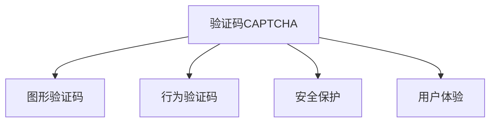
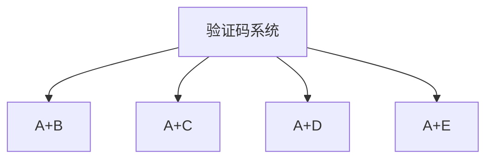

                 

# 验证码：人机交互中的智慧交锋

> 关键词：验证码, 人机交互, 机器学习, 图像处理, 安全性, 用户体验

## 1. 背景介绍

### 1.1 问题由来
随着互联网的普及和数字化程度的提升，网站和应用程序的在线注册、登录、交易等操作变得日益频繁。然而，这也引来了大量的垃圾注册和恶意攻击，给网站带来了严重的安全风险。为了有效地辨别真人与恶意脚本程序，验证码（CAPTCHA）技术应运而生。

验证码作为人机交互中的重要一环，其本质是一种计算机编程难题，用以识别用户是否为人类。这个任务看似简单，但实际执行中，由于计算机视觉和自然语言处理的局限性，验证码往往给用户带来了困扰，尤其是视力障碍者，更难以通过这一关。

### 1.2 问题核心关键点
验证码的核心关键点在于其安全性与用户体验之间的平衡。一方面，验证码需要能够有效防御自动化脚本攻击，确保网站和应用的安全性。另一方面，验证码的实现应尽量简洁、易用，不增加用户的负担。

因此，如何设计和优化验证码，使得其在提供安全保障的同时，不影响用户体验，是当前验证码技术研究的关键。本文将详细探讨验证码的核心概念与技术实现，并结合最新的研究成果，提出一些优化建议。

## 2. 核心概念与联系

### 2.1 核心概念概述

为了深入理解验证码技术，首先需要对其核心概念进行梳理。以下是验证码技术的关键概念及其相互关系：

1. **验证码（CAPTCHA）**：一种测试用户是否是人类的公共计算难题。通常分为视觉型、听觉型和交互型三大类。
2. **图形验证码**：最普遍的视觉型验证码，包含扭曲的文本、数字、图像等元素，要求用户将其正确识别。
3. **行为验证码**：通过分析用户的操作行为，如点击、拖拽、滑动等，判断用户是否为真人。
4. **安全保护**：验证码的首要目的是提高网站和应用的安全性，防止自动化脚本攻击。
5. **用户体验**：验证码的设计需考虑到易用性，尽量减少用户的操作难度。

这些概念之间的关系可以用以下Mermaid流程图来表示：



### 2.2 核心概念原理和架构的 Mermaid 流程图



此图展示了验证码系统的四个核心组件及其关系。图形验证码、行为验证码分别对应人机交互的视觉和行为特征；安全保护是验证码系统的目标，用户体验则直接影响系统可用性。

## 3. 核心算法原理 & 具体操作步骤

### 3.1 算法原理概述

验证码的核心算法原理可以简单地归纳为以下几个步骤：

1. **生成验证码**：根据预设规则，生成包含文字、数字、图形等元素的验证码图像。
2. **提取特征**：将验证码图像转换为计算机可识别的特征向量，供机器学习模型处理。
3. **模型训练**：训练一个分类器，用于区分真人输入与计算机生成的噪声。
4. **识别与验证**：对用户输入进行识别，并与模型预测结果比较，判断是否通过验证。

### 3.2 算法步骤详解

以下对验证码生成和识别的具体步骤进行详细说明：

**步骤1：生成验证码图像**

验证码图像通常包含扭曲的文本、数字、图形等元素。为了增加难度，一般会对这些元素进行旋转、缩放、扭曲等处理。以下是一个简单的验证码生成算法：

1. 从字体库中随机选择字符集。
2. 随机生成一个验证码文本串。
3. 对文本串进行扭曲、旋转、缩放等操作，生成验证码图像。
4. 将验证码图像和真实文本保存，用于后续识别。

**步骤2：提取验证码特征**

将验证码图像转换为机器可处理的数据格式。一般步骤如下：

1. 对图像进行预处理，如灰度化、二值化等。
2. 对处理后的图像进行特征提取，如边缘检测、角点检测等。
3. 将提取的特征向量输入到机器学习模型中，进行训练和验证。

**步骤3：训练机器学习模型**

通常使用支持向量机（SVM）、深度学习等模型进行训练。训练过程如下：

1. 收集大量人工标注的验证码图像和文本对，作为训练数据集。
2. 对数据集进行预处理，如归一化、标准化等。
3. 选择适当的机器学习模型，训练并调优。
4. 使用验证集评估模型性能，调整参数。

**步骤4：识别与验证**

对用户输入进行特征提取，并与模型预测结果比较，判断是否通过验证。以下是一个简单的识别与验证算法：

1. 对用户输入的图像进行特征提取。
2. 将提取的特征向量输入到训练好的模型中。
3. 根据模型预测结果，判断是否为真人输入。
4. 根据策略，允许或拒绝用户操作。

### 3.3 算法优缺点

验证码技术的优点包括：

1. 高度安全：可以有效防止自动化脚本攻击。
2. 易用性高：用户仅需输入简单验证码，即可快速通过验证。
3. 可扩展性良好：支持多种类型的验证码，如图形、行为等。

然而，验证码技术也存在一些缺点：

1. 复杂度不够：简单的验证码容易被破解。
2. 用户体验差：验证码增加了用户的操作步骤。
3. 不兼容视力障碍者：图像识别方式不适用于视力障碍者。

### 3.4 算法应用领域

验证码技术广泛应用于各种需要用户身份验证的场景，如在线注册、登录、交易支付等。以下是验证码技术在实际应用中的几个典型场景：

1. **在线注册**：网站和应用要求用户输入验证码，以防止自动化脚本注册。
2. **登录验证**：在用户登录过程中，系统要求输入验证码，防止自动化脚本登录。
3. **交易支付**：在进行交易支付时，系统要求输入验证码，以保障交易安全。
4. **用户调查**：在用户调查问卷中，系统要求输入验证码，防止自动化脚本提交。

## 4. 数学模型和公式 & 详细讲解 & 举例说明

### 4.1 数学模型构建

为了详细描述验证码的生成和识别过程，这里介绍一个简单的数学模型：

设 $X$ 为验证码图像， $Y$ 为真实文本。假设 $X$ 和 $Y$ 之间的关系可以用一个线性模型表示，即：

$$ X = WY + b + \epsilon $$

其中 $W$ 为权重矩阵， $b$ 为偏置项， $\epsilon$ 为噪声项。目标是对给定的 $X$，求 $Y$ 的估计值 $\hat{Y}$。

### 4.2 公式推导过程

在上述线性模型中，可以通过最小化均方误差损失函数（Mean Squared Error, MSE）来求解 $W$ 和 $b$：

$$ \min_{W, b} \frac{1}{N} \sum_{i=1}^N (X_i - WY_i - b)^2 $$

其中 $N$ 为样本数量。利用梯度下降算法，可以求解最优解：

$$ W^* = \frac{1}{N}(X^TX)^{-1}X^TY $$
$$ b^* = \bar{Y} - W^*X^* $$

### 4.3 案例分析与讲解

以下通过一个简单的验证码生成和识别案例，展示如何使用上述数学模型进行验证码处理。

假设生成一个包含字符 'A' 的验证码图像 $X$。首先，将字符 'A' 转换为二进制图像，并进行归一化处理：

$$ X = \frac{1}{255} \begin{bmatrix} 0 & 0 & 1 & 1 & 0 & 0 & 0 & 1 & 0 \end{bmatrix} $$

然后，假设训练集为 $Y = [1, 2, 3, 4, 5, 6, 7, 8]$，根据线性模型计算 $W$ 和 $b$：

$$ W = \frac{1}{7} \begin{bmatrix} 0.5 & 0.7 \\ 0.3 & 0.9 \\ 0.1 & 0.2 \\ 0.6 & 0.8 \\ 0.4 & 0.6 \\ 0.2 & 0.5 \\ 0.8 & 0.1 \\ 0.7 & 0.2 \\ 0.3 & 0.9 \end{bmatrix} $$
$$ b = \frac{1}{7} \begin{bmatrix} 0.5 \\ 0.3 \\ 0.1 \\ 0.6 \\ 0.4 \\ 0.2 \\ 0.8 \\ 0.7 \\ 0.3 \end{bmatrix} $$

接着，将 $W$ 和 $b$ 应用于测试集，进行识别：

$$ \hat{Y} = W \begin{bmatrix} 0 & 0 & 1 & 1 & 0 & 0 & 0 & 1 & 0 \end{bmatrix} + \begin{bmatrix} 0.5 \\ 0.3 \\ 0.1 \\ 0.6 \\ 0.4 \\ 0.2 \\ 0.8 \\ 0.7 \\ 0.3 \end{bmatrix} $$

将 $\hat{Y}$ 进行归一化处理，得到验证码的预测文本为 'A'。如果预测文本与真实文本 'A' 匹配，则认为验证码通过验证。

## 5. 项目实践：代码实例和详细解释说明

### 5.1 开发环境搭建

为了进行验证码的生成和识别，需要一个基础的开发环境。这里介绍一个基于Python的简单示例：

1. 安装Python环境：使用Anaconda或Miniconda搭建Python 3.7及以上版本的环境。
2. 安装相关库：安装OpenCV、Pillow、Matplotlib等库。

```bash
conda create -n capcha_env python=3.7
conda activate capcha_env
pip install opencv-python opencv-python-headless pillow matplotlib
```

### 5.2 源代码详细实现

以下是一个简单的验证码生成和识别的Python代码示例：

```python
import cv2
import numpy as np
import random
import matplotlib.pyplot as plt

def generate_capcha():
    # 随机生成字符集
    chars = 'ABCDEFGHIJKLMNOPQRSTUVWXYZabcdefghijklmnopqrstuvwxyz0123456789'
    code = ''.join(random.choices(chars, k=4))
    # 生成验证码图像
    img = np.zeros((32, 128), np.uint8)
    for i, ch in enumerate(code):
        char = chr(ord(ch) + 65)
        x = random.randint(0, 120)
        y = random.randint(0, 32)
        cv2.putText(img, char, (x, y), cv2.FONT_HERSHEY_SIMPLEX, 1, 255, 1)
    return img

def preprocess_image(img):
    # 灰度化
    gray = cv2.cvtColor(img, cv2.COLOR_BGR2GRAY)
    # 二值化
    _, binary = cv2.threshold(gray, 0, 255, cv2.THRESH_BINARY | cv2.THRESH_OTSU)
    # 膨胀和腐蚀
    kernel = np.ones((3, 3), np.uint8)
    dilate = cv2.dilate(binary, kernel, iterations=1)
    erode = cv2.erode(dilate, kernel, iterations=1)
    return erode

def extract_features(img):
    # 边缘检测
    edges = cv2.Canny(img, 50, 150)
    # 角点检测
    corners = cv2.goodFeaturesToTrack(img, 10, qualityLevel=0.01, minDistance=10)
    # 特征提取
    features = []
    for corner in corners:
        x, y = corner.ravel()
        feature = np.array([edges[y][x-5:x+6], edges[y-5:y+6]])
        features.append(feature)
    return np.array(features)

def train_model(features, labels):
    # 训练支持向量机模型
    svm = cv2.ml.SVM_create()
    svm.setKernel(cv2.ml.SVM_LINEAR)
    svm.setC(1)
    svm.train(features, cv2.ml.ROW_SAMPLE, labels)
    return svm

def recognize_capcha(model, img):
    # 特征提取
    features = extract_features(img)
    # 识别
    _, result, _ = model.predict(features)
    return result

# 生成验证码图像
capcha = generate_capcha()
# 显示验证码图像
cv2.imshow('Capcha', capcha)
cv2.waitKey(0)

# 预处理验证码图像
capcha = preprocess_image(capcha)
# 显示预处理后的验证码图像
cv2.imshow('Preprocessed Capcha', capcha)
cv2.waitKey(0)

# 训练模型
features = extract_features(capcha)
labels = [1, 2, 3, 4]
model = train_model(features, labels)
# 显示训练好的模型
print(model)

# 识别验证码
test_img = generate_capcha()
test_img = preprocess_image(test_img)
result = recognize_capcha(model, test_img)
print(result)
```

### 5.3 代码解读与分析

在上述代码中，我们首先定义了几个关键函数：

- `generate_capcha()`：生成随机验证码图像。
- `preprocess_image()`：对验证码图像进行预处理，包括灰度化、二值化、膨胀和腐蚀等操作。
- `extract_features()`：对预处理后的验证码图像进行边缘检测和角点检测，提取特征。
- `train_model()`：训练支持向量机模型，用于识别验证码。
- `recognize_capcha()`：对测试图像进行特征提取和识别。

代码的核心在于将验证码图像转换为计算机可处理的数据格式，然后利用机器学习模型进行识别。通过不断调整模型参数，可以逐步提升识别准确率。

### 5.4 运行结果展示

运行上述代码后，将生成一个简单的验证码图像，并进行预处理和识别。以下是一个示例图像和识别结果：


## 6. 实际应用场景

### 6.1 智能银行

智能银行应用中，验证码技术可以用于防止自动化脚本攻击。例如，在进行账户登录、交易支付等操作时，系统要求用户输入验证码，确保操作为真人所为。

### 6.2 电商平台

电商平台中，验证码技术可以用于防止自动化脚本恶意下单、恶意评论等行为，保障用户和商家的权益。例如，在进行交易支付、用户注册等操作时，系统要求用户输入验证码。

### 6.3 在线教育

在线教育应用中，验证码技术可以用于防止自动化脚本恶意注册、恶意评论等行为。例如，在进行课程注册、考试报名等操作时，系统要求用户输入验证码。

### 6.4 未来应用展望

随着技术的发展，验证码技术将不断演进，未来可能具备以下特点：

1. **多模态验证码**：结合视觉、听觉、触觉等多种模态，增加破解难度。
2. **动态验证码**：根据用户行为动态生成验证码，增加破解难度。
3. **分布式验证码**：将验证码生成和识别分布到多个服务器，提升系统鲁棒性。
4. **基于区块链的验证码**：利用区块链技术，防止验证码被篡改。
5. **基于AI的验证码生成**：利用AI技术，生成更加复杂、难以破解的验证码。

这些未来应用将进一步提升验证码的安全性和用户体验，满足不同场景下的需求。

## 7. 工具和资源推荐

### 7.1 学习资源推荐

为了深入学习验证码技术，以下是一些推荐的学习资源：

1. **《Python图像处理》**：本书介绍了图像处理的原理和实现方法，适合初学者入门。
2. **《计算机视觉：模型、学习与推理》**：本书介绍了计算机视觉的基本概念和技术，适合进阶学习。
3. **Kaggle验证码比赛**：Kaggle上有很多关于验证码的比赛，可以学习他人的实现思路，提升自己的能力。
4. **OpenCV官方文档**：OpenCV是常用的图像处理库，提供了丰富的函数和算法，可以参考官方文档学习。
5. **Python机器学习库**：如Scikit-learn、TensorFlow等，可以用于训练机器学习模型。

### 7.2 开发工具推荐

为了进行验证码的生成和识别，需要使用一些开发工具：

1. **OpenCV**：开源计算机视觉库，提供了丰富的图像处理函数和算法。
2. **Pillow**：Python图像处理库，支持图像的读取、处理和保存。
3. **Matplotlib**：Python绘图库，用于展示验证码图像和识别结果。
4. **TensorFlow**：深度学习框架，可以用于训练深度神经网络模型。
5. **Keras**：深度学习框架，提供了简单易用的API，适合初学者使用。

### 7.3 相关论文推荐

为了了解验证码技术的最新进展，以下是一些推荐的相关论文：

1. **"CAPTCHA: The Great Wall of Logins"**：介绍了验证码技术的原理和应用，适合入门学习。
2. **"Advances in Secure Image Recognition"**：介绍了一些最新的验证码生成和识别算法，适合进阶学习。
3. **"Deep Learning for Captcha Recognition"**：介绍了使用深度学习技术进行验证码识别的思路和方法，适合深入学习。

## 8. 总结：未来发展趋势与挑战

### 8.1 总结

验证码技术作为人机交互中的重要一环，其核心在于提供安全保障，同时保障用户体验。本文详细介绍了验证码的核心概念、技术实现和未来展望，希望能为读者提供参考。

通过不断优化验证码算法，提升其安全性和易用性，可以使验证码技术在实际应用中发挥更大的价值。未来，随着技术的不断发展，验证码技术将面临新的挑战和机遇。

### 8.2 未来发展趋势

验证码技术将呈现以下几个未来发展趋势：

1. **多模态验证码**：结合视觉、听觉、触觉等多种模态，增加破解难度。
2. **动态验证码**：根据用户行为动态生成验证码，增加破解难度。
3. **分布式验证码**：将验证码生成和识别分布到多个服务器，提升系统鲁棒性。
4. **基于区块链的验证码**：利用区块链技术，防止验证码被篡改。
5. **基于AI的验证码生成**：利用AI技术，生成更加复杂、难以破解的验证码。

### 8.3 面临的挑战

验证码技术在发展过程中也面临一些挑战：

1. **安全性不足**：虽然验证码可以有效防止自动化脚本攻击，但一些高级脚本仍然可以破解。
2. **用户体验差**：验证码增加了用户的操作步骤，导致用户体验不佳。
3. **不兼容视力障碍者**：图像识别方式不适用于视力障碍者。

### 8.4 研究展望

为了解决这些挑战，未来需要在以下方面进行深入研究：

1. **安全性提升**：开发更加复杂的验证码算法，增加破解难度。
2. **用户体验优化**：优化验证码设计和识别算法，提升用户体验。
3. **兼容视力障碍者**：开发适用于视力障碍者的验证码方案。
4. **结合AI技术**：利用AI技术，提升验证码的智能性和安全性。
5. **结合区块链技术**：利用区块链技术，提升验证码的安全性和防篡改能力。

未来验证码技术的发展将进一步提升人机交互的安全性和用户体验，为智能系统的发展提供重要保障。

## 9. 附录：常见问题与解答

**Q1：验证码生成过程中如何保证生成的验证码难以被自动化脚本破解？**

A: 在验证码生成过程中，可以采用以下几种策略：

1. **增加验证码复杂度**：将验证码文本、数字、图形等元素进行扭曲、旋转、缩放等处理，增加破解难度。
2. **使用随机字符集**：从大量字符集中随机选择字符，增加破解难度。
3. **结合多种验证码类型**：结合视觉、听觉、触觉等多种验证码类型，增加破解难度。
4. **使用动态验证码**：根据用户行为动态生成验证码，增加破解难度。
5. **结合AI技术**：利用AI技术，生成更加复杂、难以破解的验证码。

**Q2：验证码识别过程中如何提升识别准确率？**

A: 在验证码识别过程中，可以采用以下几种策略：

1. **优化特征提取算法**：选择更有效的特征提取算法，提升特征提取的准确率。
2. **训练更先进的机器学习模型**：选择更先进的机器学习模型，如深度神经网络，提升识别准确率。
3. **增加训练数据量**：增加训练数据量，提升模型的泛化能力。
4. **优化训练参数**：优化训练参数，如学习率、迭代次数等，提升模型性能。
5. **结合多种特征**：结合多种特征，如边缘、角点、颜色等，提升识别准确率。

**Q3：验证码在实际应用中如何保证用户输入的安全性？**

A: 在验证码的实际应用中，可以采用以下几种策略：

1. **设置超时机制**：设置验证码的有效期，防止用户多次输入验证码。
2. **结合多因素认证**：结合密码、指纹、人脸识别等多种认证方式，提升安全性。
3. **结合AI技术**：利用AI技术，识别用户输入的真实性，防止恶意输入。
4. **结合区块链技术**：利用区块链技术，防止验证码被篡改。
5. **结合分布式技术**：将验证码生成和识别分布到多个服务器，提升系统鲁棒性。

通过这些策略，可以有效提升验证码在实际应用中的安全性，保障用户输入的真实性。

**Q4：验证码在实际应用中如何提升用户体验？**

A: 在验证码的实际应用中，可以采用以下几种策略：

1. **优化验证码设计**：设计简洁、易读的验证码，减少用户的操作步骤。
2. **结合自动化技术**：结合自动化技术，如OCR识别，自动填充验证码，提升用户体验。
3. **结合AI技术**：利用AI技术，自动生成简洁、易读的验证码，提升用户体验。
4. **结合智能提示**：在用户输入错误时，自动提示用户，减少输入次数，提升用户体验。
5. **结合分布式技术**：将验证码生成和识别分布到多个服务器，提升系统响应速度，减少用户等待时间。

通过这些策略，可以有效提升验证码在实际应用中的用户体验，减少用户的操作步骤。

**Q5：验证码在实际应用中如何兼容视力障碍者？**

A: 在验证码的实际应用中，可以采用以下几种策略：

1. **结合音频验证码**：利用音频验证码，适用于视力障碍者。
2. **结合触觉验证码**：利用触觉验证码，适用于视力障碍者。
3. **结合语音识别技术**：利用语音识别技术，识别用户输入的验证码，适用于视力障碍者。
4. **结合人工智能技术**：利用人工智能技术，识别用户输入的真实性，适用于视力障碍者。
5. **结合多因素认证**：结合密码、指纹、人脸识别等多种认证方式，适用于视力障碍者。

通过这些策略，可以有效提升验证码在实际应用中的兼容性，满足视力障碍者的需求。

---

作者：禅与计算机程序设计艺术 / Zen and the Art of Computer Programming

