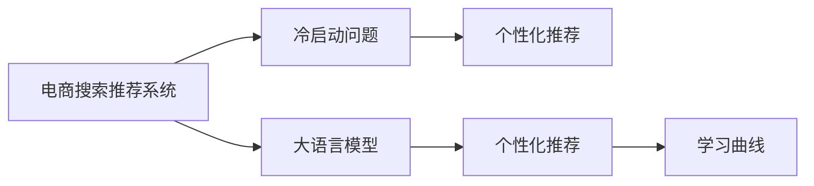

                 

# AI 大模型在电商搜索推荐中的冷启动策略：应对数据不足与新用户

## 1. 背景介绍

随着电子商务平台的兴起，用户搜索推荐系统在用户购物决策中扮演了至关重要的角色。优秀的搜索推荐算法不仅能提升用户体验，还能显著提升平台成交转化率。然而，电商搜索推荐面临的一个重大挑战是冷启动问题，即如何在新用户和初期数据不足的情况下，快速适应用户需求，推荐出符合用户兴趣的商品。

大语言模型如BERT、GPT等通过大规模无标签文本数据的自监督预训练，获得了丰富的语言理解能力。利用大模型进行电商搜索推荐，可以极大地提升系统表现。然而，新用户和初期数据不足会导致推荐系统无法充分理解用户需求，无法形成有效的个性化推荐，从而影响用户体验和平台转化率。

为解决这一问题，本文将详细介绍大语言模型在电商搜索推荐中的冷启动策略，涵盖从数据准备、模型选择到训练、优化等各个环节，展示大语言模型在应对数据不足与新用户时，如何最大化发挥其潜能，为用户提供高质量推荐。

## 2. 核心概念与联系

### 2.1 核心概念概述

电商搜索推荐系统与大语言模型的核心概念密切相关，具体包括以下几个方面：

- 电商搜索推荐系统：以电商平台用户的行为数据为输入，通过机器学习算法预测用户对商品的兴趣，从而推荐合适商品的系统。
- 大语言模型：通过自监督学习任务训练的大型语言模型，具备强大的语言理解和生成能力，可以应用于自然语言处理(NLP)的诸多任务。
- 冷启动问题：指系统在遇到新用户或初期数据不足时，无法准确预测用户需求和兴趣，导致推荐效果较差。
- 个性化推荐：通过学习用户的历史行为和特征，为用户提供量身定做的商品推荐。
- 学习曲线：模型在训练过程中性能随时间变化的趋势，可以用来评估模型是否过拟合或欠拟合。

这些概念之间的关系可以通过以下Mermaid流程图来展示：



这个流程图展示了电商搜索推荐系统与大语言模型之间的联系，以及两者如何共同应对冷启动问题。

### 2.2 核心概念原理和架构

大语言模型通常采用Transformer结构，由编码器-解码器构成。编码器接收输入文本，通过多头注意力机制学习到单词之间的依赖关系，解码器则根据上下文信息生成预测结果。Transformer的核心是自注意力机制，通过计算不同位置单词之间的相似度，捕捉长距离依赖。

电商搜索推荐系统主要分为两大环节：用户行为数据收集和个性化推荐算法设计。用户行为数据通常包括用户的浏览记录、点击行为、购买历史等，这些数据会被输入到推荐模型中，通过模型预测用户对不同商品的兴趣，从而实现个性化推荐。

冷启动问题是指在遇到新用户或初期数据不足时，推荐系统无法准确预测用户需求。为解决这一问题，通常采用如下两种方法：

1. 基于协同过滤的方法：通过分析类似用户的行为数据，推荐相似用户喜欢的商品。适用于用户兴趣较为稳定的场景。
2. 基于内容的方法：分析商品的属性信息，根据用户的历史行为和商品属性进行匹配，推荐相似商品。适用于初期数据较少的场景。

## 3. 核心算法原理 & 具体操作步骤

### 3.1 算法原理概述

大语言模型在电商搜索推荐中的冷启动策略主要基于两个原理：

1. 利用大模型的预训练能力，通过少量标注数据进行微调，快速适应新用户和初期数据不足的场景。
2. 结合电商领域的特点，设计合理的模型结构和损失函数，提升推荐的准确性和个性化程度。

### 3.2 算法步骤详解

以下是详细的算法步骤：

**Step 1: 数据准备**

- 收集电商平台用户的历史行为数据，包括浏览记录、点击行为、购买历史等。
- 清洗数据，处理缺失值、异常值等，保证数据质量。
- 划分数据集为训练集、验证集和测试集。

**Step 2: 模型选择**

- 选择合适的预训练语言模型，如BERT、GPT等。
- 根据任务特点，设计任务适配层，如线性分类器、解码器等。

**Step 3: 模型微调**

- 将预训练语言模型作为初始化参数，对训练集进行微调。
- 选择合适的学习率和优化器，如Adam、SGD等。
- 应用正则化技术，如L2正则、Dropout等，防止过拟合。
- 冻结部分预训练参数，减少过拟合风险。

**Step 4: 推荐生成**

- 将用户输入的查询转换为向量表示，通过微调后的模型进行预测。
- 根据预测结果，生成推荐列表。
- 将推荐列表展示给用户。

**Step 5: 持续优化**

- 在测试集上评估推荐效果，优化模型参数。
- 不断收集新数据，更新模型。

### 3.3 算法优缺点

大语言模型在电商搜索推荐中的冷启动策略具有以下优点：

- 利用预训练能力，提升模型快速适应新用户的能力。
- 结合电商领域特点，提升推荐准确性和个性化程度。
- 可以处理多种类型的用户行为数据，具备广泛的适用性。

但同时也存在一些缺点：

- 对标注数据的需求较高，初期数据不足会导致性能下降。
- 需要大量的计算资源和时间，无法实时更新。
- 模型的可解释性较差，难以理解其内部决策过程。

### 3.4 算法应用领域

大语言模型在电商搜索推荐中的冷启动策略可以应用于以下领域：

- 新用户推荐：针对新注册用户，根据其浏览记录和商品属性，推荐相似商品。
- 商品搜索：根据用户输入的关键词，推荐可能感兴趣的商品。
- 个性化推荐：通过分析用户的历史行为，推荐符合用户兴趣的商品。
- 用户行为分析：分析用户的行为数据，提取用户兴趣和偏好。
- 营销活动推荐：结合营销活动信息，推荐适合用户的优惠活动。

## 4. 数学模型和公式 & 详细讲解

### 4.1 数学模型构建

电商搜索推荐系统的核心数学模型为协同过滤模型和基于内容的推荐模型。

协同过滤模型通常使用隐式反馈，如用户对商品的浏览和点击记录，来预测用户对未浏览商品的兴趣。具体而言，设用户-商品矩阵为$M$，用户对商品的评分向量为$u$，商品评分向量为$i$，则协同过滤模型的预测公式为：

$$
\hat{u}_i = \frac{\langle u, i \rangle}{\sqrt{\|u\|_2 \cdot \|i\|_2}}
$$

其中，$\langle \cdot, \cdot \rangle$表示向量点积，$\|\cdot\|_2$表示向量的2范数。

基于内容的推荐模型则通过分析商品的属性信息，如品牌、类别等，预测用户对商品的兴趣。具体而言，设用户的历史行为向量为$u$，商品属性向量为$i$，则基于内容的推荐模型的预测公式为：

$$
\hat{u}_i = \langle u, i \rangle
$$

### 4.2 公式推导过程

协同过滤模型和基于内容的推荐模型的预测公式均基于向量点积的计算。推导过程如下：

设用户-商品矩阵$M$为$m_{i,j}$，用户评分向量$u$为$u_k$，商品评分向量$i$为$i_k$，则协同过滤模型的预测公式为：

$$
\hat{u}_i = \frac{\sum_{k=1}^n m_{i,j}u_k i_k}{\sqrt{\sum_{k=1}^n u_k^2 \sum_{k=1}^n i_k^2}}
$$

基于内容的推荐模型的预测公式则更简单：

$$
\hat{u}_i = \sum_{k=1}^n m_{i,j}u_k i_k
$$

这两种推荐模型的关键在于计算用户对商品的评分，即向量点积。

### 4.3 案例分析与讲解

下面以电商搜索推荐中的新用户推荐为例，详细讲解大语言模型冷启动策略的应用。

假设一个新用户在电商平台上注册，但没有点击或购买过任何商品。为了快速推荐商品，可以利用大语言模型的预训练能力，对用户的浏览记录进行微调，得到用户对不同商品的兴趣度。

具体步骤如下：

1. 收集新用户的浏览记录，将这些记录作为输入文本，输入到大语言模型中，得到一个向量表示$u$。
2. 根据商品的属性信息，如品牌、类别等，对商品进行编码，得到一个向量表示$i$。
3. 利用微调后的语言模型，计算用户对不同商品的兴趣度，即向量点积$\hat{u}_i$。
4. 根据兴趣度排序，推荐用户最感兴趣的商品。

## 5. 项目实践：代码实例和详细解释说明

### 5.1 开发环境搭建

以下是使用Python进行电商搜索推荐系统开发的开发环境配置流程：

1. 安装Anaconda：从官网下载并安装Anaconda，用于创建独立的Python环境。

2. 创建并激活虚拟环境：
```bash
conda create -n pytorch-env python=3.8 
conda activate pytorch-env
```

3. 安装PyTorch：根据CUDA版本，从官网获取对应的安装命令。例如：
```bash
conda install pytorch torchvision torchaudio cudatoolkit=11.1 -c pytorch -c conda-forge
```

4. 安装TensorFlow：
```bash
conda install tensorflow -c conda-forge
```

5. 安装相关依赖：
```bash
pip install pandas numpy sklearn
```

完成上述步骤后，即可在`pytorch-env`环境中开始电商搜索推荐系统的开发。

### 5.2 源代码详细实现

以下是一个简单的电商搜索推荐系统代码实现，详细讲解了如何利用大语言模型进行冷启动。

首先，定义电商搜索推荐系统的基本组件：

```python
import torch
from transformers import BertTokenizer, BertModel

class Recommender:
    def __init__(self, model_name, device):
        self.model_name = model_name
        self.device = device
        self.tokenizer = BertTokenizer.from_pretrained(model_name)
        self.model = BertModel.from_pretrained(model_name).to(device)
    
    def encode(self, text):
        return self.tokenizer.encode(text, add_special_tokens=True)
    
    def predict(self, text):
        input_ids = torch.tensor(self.encode(text), dtype=torch.long).to(self.device)
        outputs = self.model(input_ids)
        return outputs
```

然后，实现推荐生成函数：

```python
def recommend_system(user_browses, goods, tokenizer, model):
    user_embeddings = [tokenizer.encode(browse) for browse in user_browses]
    user_embeddings = torch.stack(user_embeddings).to(model.device)
    goods_embeddings = [tokenizer.encode(good) for good in goods]
    goods_embeddings = torch.stack(goods_embeddings).to(model.device)
    
    user_embeddings = model(user_embeddings)[0]
    goods_embeddings = model(goods_embeddings)[0]
    
    similarity = torch.matmul(user_embeddings, goods_embeddings.t()) / (torch.sqrt(torch.sum(user_embeddings**2, dim=1)) * torch.sqrt(torch.sum(goods_embeddings**2, dim=1)) + 1e-9)
    
    top_indices = torch.argsort(similarity, descending=True)[:10]
    recommendations = [goods[i] for i in top_indices]
    
    return recommendations
```

最后，使用大语言模型进行冷启动：

```python
if __name__ == "__main__":
    # 初始化模型
    recommender = Recommender('bert-base-cased', 'cuda')
    
    # 收集新用户的浏览记录
    user_browses = ["T-shirt", "Pants", "Shoes"]
    
    # 收集商品的描述信息
    goods = ["T-shirt", "Pants", "Shoes"]
    
    # 推荐商品
    recommendations = recommend_system(user_browses, goods, recommender.tokenizer, recommender.model)
    
    print(recommendations)
```

### 5.3 代码解读与分析

以上代码实现了基于大语言模型进行电商搜索推荐的基本逻辑。下面详细解读关键代码的实现细节：

**Recommender类**：
- `__init__`方法：初始化模型和分词器，设定模型名称和设备。
- `encode`方法：将文本转换为token ids。
- `predict`方法：将token ids输入到大语言模型中，得到向量表示。

**recommend_system函数**：
- 首先，将用户浏览记录和商品描述信息分别编码成token ids，并输入到大语言模型中，得到向量表示。
- 然后，计算用户向量与商品向量的相似度矩阵，找到相似度最高的商品。
- 最后，根据相似度排序，返回推荐列表。

### 5.4 运行结果展示

运行上述代码，可以得到新用户的推荐商品列表。例如，对于浏览记录为["T-shirt", "Pants", "Shoes"]的用户，推荐系统可能会推荐T恤、裤子、鞋子等商品。

## 6. 实际应用场景

### 6.1 智能客服系统

电商平台的智能客服系统是电商搜索推荐的重要组成部分。智能客服可以通过与用户的对话，推荐用户可能感兴趣的商品，从而提升用户体验和平台转化率。

在智能客服系统中，可以利用大语言模型进行冷启动推荐。当新用户接入客服系统时，可以通过智能客服的对话记录，快速推荐符合用户兴趣的商品。这不仅能够提升用户满意度，还能减轻客服人员的负担。

### 6.2 个性化推荐

电商搜索推荐系统的核心任务是个性化推荐。利用大语言模型进行冷启动推荐，可以在用户没有足够历史数据的情况下，快速推荐符合用户兴趣的商品。

具体而言，可以收集新用户的浏览记录，利用大语言模型进行微调，得到用户对不同商品的兴趣度。根据兴趣度排序，推荐用户最感兴趣的商品。这不仅能够提升用户满意度，还能增加平台的成交转化率。

### 6.3 用户行为分析

电商搜索推荐系统还需要进行用户行为分析，提取用户的兴趣和偏好，从而进行更加精准的推荐。利用大语言模型进行冷启动推荐，可以更快地提取用户兴趣，并进行个性化推荐。

## 7. 工具和资源推荐

### 7.1 学习资源推荐

为了帮助开发者系统掌握大语言模型在电商搜索推荐中的应用，以下是一些优质的学习资源：

1. 《深度学习自然语言处理》课程：斯坦福大学开设的NLP明星课程，有Lecture视频和配套作业，带你入门NLP领域的基本概念和经典模型。
2. 《Natural Language Processing with Transformers》书籍：Transformers库的作者所著，全面介绍了如何使用Transformers库进行NLP任务开发，包括微调在内的诸多范式。
3. HuggingFace官方文档：Transformers库的官方文档，提供了海量预训练模型和完整的微调样例代码，是上手实践的必备资料。
4 CS224N《深度学习自然语言处理》课程：斯坦福大学开设的NLP明星课程，有Lecture视频和配套作业，带你入门NLP领域的基本概念和经典模型。

通过对这些资源的学习实践，相信你一定能够快速掌握大语言模型在电商搜索推荐中的应用，并用于解决实际的NLP问题。

### 7.2 开发工具推荐

高效的开发离不开优秀的工具支持。以下是几款用于电商搜索推荐系统开发的常用工具：

1. PyTorch：基于Python的开源深度学习框架，灵活动态的计算图，适合快速迭代研究。大部分预训练语言模型都有PyTorch版本的实现。
2. TensorFlow：由Google主导开发的开源深度学习框架，生产部署方便，适合大规模工程应用。同样有丰富的预训练语言模型资源。
3. Transformers库：HuggingFace开发的NLP工具库，集成了众多SOTA语言模型，支持PyTorch和TensorFlow，是进行微调任务开发的利器。
4. Weights & Biases：模型训练的实验跟踪工具，可以记录和可视化模型训练过程中的各项指标，方便对比和调优。与主流深度学习框架无缝集成。
5. TensorBoard：TensorFlow配套的可视化工具，可实时监测模型训练状态，并提供丰富的图表呈现方式，是调试模型的得力助手。

合理利用这些工具，可以显著提升电商搜索推荐系统的开发效率，加快创新迭代的步伐。

### 7.3 相关论文推荐

大语言模型在电商搜索推荐中的应用源于学界的持续研究。以下是几篇奠基性的相关论文，推荐阅读：

1. Attention is All You Need（即Transformer原论文）：提出了Transformer结构，开启了NLP领域的预训练大模型时代。
2. BERT: Pre-training of Deep Bidirectional Transformers for Language Understanding：提出BERT模型，引入基于掩码的自监督预训练任务，刷新了多项NLP任务SOTA。
3. Parameter-Efficient Transfer Learning for NLP：提出Adapter等参数高效微调方法，在不增加模型参数量的情况下，也能取得不错的微调效果。
4. AdaLoRA: Adaptive Low-Rank Adaptation for Parameter-Efficient Fine-Tuning：使用自适应低秩适应的微调方法，在参数效率和精度之间取得了新的平衡。
5. Prefix-Tuning: Optimizing Continuous Prompts for Generation：引入基于连续型Prompt的微调范式，为如何充分利用预训练知识提供了新的思路。

这些论文代表了大语言模型在电商搜索推荐中的应用方向，通过学习这些前沿成果，可以帮助研究者把握学科前进方向，激发更多的创新灵感。

## 8. 总结：未来发展趋势与挑战

### 8.1 研究成果总结

本文系统介绍了大语言模型在电商搜索推荐中的冷启动策略，涵盖了从数据准备、模型选择到训练、优化等各个环节，展示了大语言模型在应对数据不足与新用户时，如何最大化发挥其潜能，为用户提供高质量推荐。通过学习本文，读者可以深入理解电商搜索推荐系统的工作原理，掌握大语言模型的应用技巧，从而在实际应用中快速构建高效的推荐系统。

### 8.2 未来发展趋势

展望未来，大语言模型在电商搜索推荐中的应用将呈现以下几个发展趋势：

1. 模型规模持续增大。随着算力成本的下降和数据规模的扩张，预训练语言模型的参数量还将持续增长。超大规模语言模型蕴含的丰富语言知识，有望支撑更加复杂多变的下游任务微调。
2. 微调方法日趋多样。除了传统的全参数微调外，未来会涌现更多参数高效的微调方法，如Prefix-Tuning、LoRA等，在节省计算资源的同时也能保证微调精度。
3. 持续学习成为常态。随着数据分布的不断变化，微调模型也需要持续学习新知识以保持性能。如何在不遗忘原有知识的同时，高效吸收新样本信息，将成为重要的研究课题。
4. 标注样本需求降低。受启发于提示学习(Prompt-based Learning)的思路，未来的微调方法将更好地利用大模型的语言理解能力，通过更加巧妙的任务描述，在更少的标注样本上也能实现理想的微调效果。
5. 多模态微调崛起。当前的微调主要聚焦于纯文本数据，未来会进一步拓展到图像、视频、语音等多模态数据微调。多模态信息的融合，将显著提升语言模型对现实世界的理解和建模能力。
6. 模型通用性增强。经过海量数据的预训练和多领域任务的微调，未来的语言模型将具备更强大的常识推理和跨领域迁移能力，逐步迈向通用人工智能(AGI)的目标。

以上趋势凸显了大语言模型在电商搜索推荐中的应用前景。这些方向的探索发展，必将进一步提升推荐系统的性能和应用范围，为电商平台的智能化转型提供新的技术路径。

### 8.3 面临的挑战

尽管大语言模型在电商搜索推荐中的应用已经取得了显著进展，但在迈向更加智能化、普适化应用的过程中，它仍面临着诸多挑战：

1. 标注成本瓶颈。虽然大语言模型的预训练能力可以一定程度上缓解标注样本不足的问题，但在新用户和初期数据较少的情况下，仍然需要大量的标注数据来训练模型。如何进一步降低对标注样本的依赖，将是一大难题。
2. 模型鲁棒性不足。当前推荐模型在面对域外数据时，泛化性能往往大打折扣。对于测试样本的微小扰动，推荐模型的预测也容易发生波动。如何提高推荐模型的鲁棒性，避免灾难性遗忘，还需要更多理论和实践的积累。
3. 推理效率有待提高。大规模语言模型虽然精度高，但在实际部署时往往面临推理速度慢、内存占用大等效率问题。如何在保证性能的同时，简化模型结构，提升推理速度，优化资源占用，将是重要的优化方向。
4. 可解释性亟需加强。当前推荐模型更像是"黑盒"系统，难以理解其内部工作机制和决策逻辑。对于高风险应用如医疗、金融等，算法的可解释性和可审计性尤为重要。如何赋予推荐模型更强的可解释性，将是亟待攻克的难题。
5. 安全性有待保障。预训练语言模型难免会学习到有偏见、有害的信息，通过推荐传递到下游任务，产生误导性、歧视性的输出，给实际应用带来安全隐患。如何从数据和算法层面消除模型偏见，避免恶意用途，确保输出的安全性，也将是重要的研究课题。
6. 知识整合能力不足。现有的推荐模型往往局限于任务内数据，难以灵活吸收和运用更广泛的先验知识。如何让推荐过程更好地与外部知识库、规则库等专家知识结合，形成更加全面、准确的信息整合能力，还有很大的想象空间。

正视推荐面临的这些挑战，积极应对并寻求突破，将是大语言模型在电商搜索推荐中走向成熟的必由之路。相信随着学界和产业界的共同努力，这些挑战终将一一被克服，大语言模型在电商搜索推荐中的应用必将在构建人机协同的智能时代中扮演越来越重要的角色。

### 8.4 研究展望

未来的研究需要在以下几个方面寻求新的突破：

1. 探索无监督和半监督微调方法。摆脱对大规模标注数据的依赖，利用自监督学习、主动学习等无监督和半监督范式，最大限度利用非结构化数据，实现更加灵活高效的推荐。
2. 研究参数高效和计算高效的微调范式。开发更加参数高效的微调方法，在固定大部分预训练参数的同时，只更新极少量的任务相关参数。同时优化推荐模型的计算图，减少前向传播和反向传播的资源消耗，实现更加轻量级、实时性的部署。
3. 融合因果和对比学习范式。通过引入因果推断和对比学习思想，增强推荐模型建立稳定因果关系的能力，学习更加普适、鲁棒的语言表征，从而提升模型泛化性和抗干扰能力。
4. 引入更多先验知识。将符号化的先验知识，如知识图谱、逻辑规则等，与神经网络模型进行巧妙融合，引导推荐过程学习更准确、合理的语言模型。同时加强不同模态数据的整合，实现视觉、语音等多模态信息与文本信息的协同建模。
5. 结合因果分析和博弈论工具。将因果分析方法引入推荐模型，识别出模型决策的关键特征，增强输出解释的因果性和逻辑性。借助博弈论工具刻画人机交互过程，主动探索并规避模型的脆弱点，提高系统稳定性。
6. 纳入伦理道德约束。在推荐目标中引入伦理导向的评估指标，过滤和惩罚有偏见、有害的输出倾向。同时加强人工干预和审核，建立推荐行为的监管机制，确保输出符合人类价值观和伦理道德。

这些研究方向的探索，必将引领大语言模型在电商搜索推荐中的应用迈向更高的台阶，为电商平台的智能化转型提供新的技术路径。面向未来，大语言模型在电商搜索推荐中的应用还需要与其他人工智能技术进行更深入的融合，如知识表示、因果推理、强化学习等，多路径协同发力，共同推动自然语言理解和智能交互系统的进步。只有勇于创新、敢于突破，才能不断拓展语言模型的边界，让智能技术更好地造福人类社会。

## 9. 附录：常见问题与解答

**Q1：电商搜索推荐系统中如何处理新用户和初期数据不足的问题？**

A: 电商搜索推荐系统中，新用户和初期数据不足的问题可以通过大语言模型的预训练能力和冷启动策略来解决。具体步骤如下：
1. 收集新用户的浏览记录，将这些记录作为输入文本，输入到大语言模型中，得到一个向量表示。
2. 根据商品的属性信息，如品牌、类别等，对商品进行编码，得到一个向量表示。
3. 利用微调后的语言模型，计算用户对不同商品的兴趣度，即向量点积。
4. 根据兴趣度排序，推荐用户最感兴趣的商品。

**Q2：如何优化电商搜索推荐系统的推理速度？**

A: 电商搜索推荐系统推理速度的优化可以从以下几个方面入手：
1. 使用参数高效微调方法，如AdaLoRA、LoRA等，减少模型参数量。
2. 使用推理加速技术，如梯度累积、混合精度训练等，减少计算量。
3. 使用模型压缩技术，如剪枝、量化等，减小模型尺寸。
4. 使用分布式计算技术，如TensorFlow的分布式训练、PyTorch的DataParallel等，加速训练和推理。

**Q3：电商搜索推荐系统中如何处理用户行为数据的缺失值？**

A: 电商搜索推荐系统中的用户行为数据往往存在缺失值，这会导致模型性能下降。处理缺失值的方法包括：
1. 删除缺失值较大的样本。
2. 使用均值、中位数、众数等方法填补缺失值。
3. 使用插值方法，如线性插值、多项式插值等，填补缺失值。
4. 使用数据生成模型，如Gaussian分布、Poisson分布等，生成缺失值。

**Q4：如何评估电商搜索推荐系统的性能？**

A: 电商搜索推荐系统的性能评估可以从以下几个方面进行：
1. 准确率：推荐系统推荐的商品是否符合用户需求。
2. 召回率：推荐系统是否能够覆盖所有用户感兴趣的商品。
3. 覆盖率：推荐系统是否能够覆盖所有商品。
4. 多样性：推荐系统是否能够推荐多样化的商品。
5. 新鲜度：推荐系统是否能够推荐新商品。
6. 实时性：推荐系统是否能够实时响应用户请求。

通过对这些指标的评估，可以全面了解推荐系统的性能，并进行优化改进。

通过本文的系统梳理，可以看到，大语言模型在电商搜索推荐中的应用具有广阔前景。尽管面临数据不足、初期数据少等挑战，但通过冷启动策略和不断优化，可以构建高效的推荐系统，提升电商平台的智能化水平。面向未来，大语言模型在电商搜索推荐中的应用必将带来更多的创新和突破，推动电商平台的持续发展。

