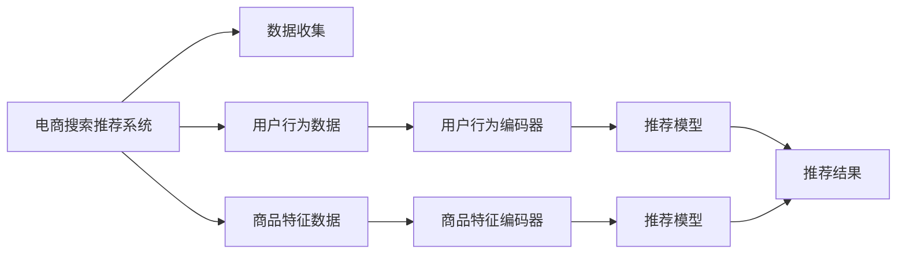

                 

# AI 大模型在电商搜索推荐中的冷启动策略：应对数据不足的挑战

## 1. 背景介绍

随着人工智能技术的不断进步，电商搜索推荐系统已经从简单的关键词匹配，发展为基于用户行为和商品特征的深度推荐。大模型在这其中扮演了重要角色，通过在海量数据上进行预训练，可以学习到丰富的用户和商品特征表示，从而进行精准的推荐。然而，在搜索推荐系统的冷启动阶段，即新用户或新商品加入时，由于缺乏历史数据，推荐效果往往大打折扣。为了应对这一挑战，本文将探讨如何在电商搜索推荐中，利用大模型的优势，应对数据不足的问题。

## 2. 核心概念与联系

### 2.1 核心概念概述

为了更深入地理解电商搜索推荐系统中的冷启动问题，首先需要澄清几个关键概念：

- **电商搜索推荐系统**：指基于电商网站平台，利用用户行为数据和商品特征，通过算法为用户推荐商品的搜索推荐系统。
- **冷启动**：指用户在电商平台上首次注册或新商品首次上架时，由于缺乏历史数据，推荐系统无法给出准确推荐的情况。
- **大模型**：指通过自监督学习任务在海量数据上预训练得到的深度神经网络模型，具备强大的特征提取和表示学习能力。

### 2.2 核心概念原理和架构的 Mermaid 流程图



该图展示了电商搜索推荐系统的基本架构：
- 数据收集：收集用户行为数据和商品特征数据。
- 用户行为编码器：将用户行为数据编码为高维向量。
- 商品特征编码器：将商品特征数据编码为高维向量。
- 推荐模型：利用用户和商品的编码向量进行推荐。
- 推荐结果：根据推荐模型输出，生成推荐商品。

## 3. 核心算法原理 & 具体操作步骤

### 3.1 算法原理概述

在电商搜索推荐系统中，冷启动问题通常通过两种方式解决：基于用户的冷启动和基于商品的冷启动。

- **基于用户的冷启动**：当新用户注册时，利用大模型进行预测，根据用户的人口统计信息、兴趣爱好等进行推荐。
- **基于商品的冷启动**：当新商品上架时，利用大模型进行预测，根据商品的描述、类别等信息进行推荐。

对于大模型，在冷启动场景下，通常会采用以下方法：

1. **自适应学习**：利用大模型的自适应学习能力，通过少量用户或商品的交互数据进行学习，快速适应新用户或新商品的特点。
2. **迁移学习**：利用大模型在不同任务之间的迁移能力，将已有领域的知识迁移到新的任务中，提升推荐效果。
3. **零样本学习**：利用大模型的语言理解能力，通过文本描述直接进行推荐。

### 3.2 算法步骤详解

#### 3.2.1 基于用户的冷启动

1. **数据预处理**：收集新用户的基本信息，如年龄、性别、职业等。
2. **用户行为生成**：根据用户基本信息，生成模拟的用户行为数据。
3. **用户编码器输入**：将模拟的用户行为数据输入用户行为编码器。
4. **用户编码器输出**：得到用户的高维编码向量。
5. **商品推荐**：根据用户编码向量和商品编码向量，利用推荐模型进行推荐。
6. **推荐结果评估**：通过A/B测试等方法，评估推荐效果，优化模型参数。

#### 3.2.2 基于商品的冷启动

1. **商品描述收集**：收集新商品的基本描述、类别等信息。
2. **商品编码器输入**：将商品描述信息输入商品特征编码器。
3. **商品编码器输出**：得到商品的高维编码向量。
4. **商品推荐**：根据商品编码向量和用户编码向量，利用推荐模型进行推荐。
5. **推荐结果评估**：通过A/B测试等方法，评估推荐效果，优化模型参数。

### 3.3 算法优缺点

#### 3.3.1 基于用户的冷启动

**优点**：
- 可以利用大模型的自适应学习能力，快速适应新用户。
- 可以生成模拟用户行为数据，避免数据不足问题。
- 方法简单，易于实现。

**缺点**：
- 模拟的用户行为可能与实际行为有较大偏差，影响推荐效果。
- 需要生成大量模拟数据，计算资源消耗较大。

#### 3.3.2 基于商品的冷启动

**优点**：
- 可以利用大模型的迁移学习能力，快速适应新商品。
- 方法简单，易于实现。
- 可以避免生成模拟数据的计算资源消耗。

**缺点**：
- 商品描述信息可能不够丰富，影响编码向量的质量。
- 需要预处理大量的商品信息，计算资源消耗较大。

### 3.4 算法应用领域

大模型在电商搜索推荐中的冷启动策略，主要应用于以下领域：

- **电商新用户推荐**：对于首次注册的新用户，利用大模型进行个性化推荐，帮助其快速找到感兴趣的商品。
- **电商平台商品上架推荐**：对于新上架的商品，利用大模型进行推荐，帮助商家快速提高商品曝光率。
- **个性化推荐系统优化**：利用大模型的自适应和迁移学习能力，不断优化推荐算法，提升推荐效果。

## 4. 数学模型和公式 & 详细讲解 & 举例说明

### 4.1 数学模型构建

在大模型推荐系统中，通常使用预训练的Transformer模型作为用户和商品编码器。设用户和商品的编码向量分别为$u$和$i$，推荐模型为$M$。假设推荐系统的目标函数为最大化用户满意度，可以定义如下：

$$
\max_{M} \sum_{i \in I} \sum_{u \in U} f_{M}(u, i)
$$

其中，$I$为商品集合，$U$为用户集合，$f_{M}(u, i)$为模型$M$在用户$u$对商品$i$的推荐评分。

### 4.2 公式推导过程

在推荐模型的训练过程中，通常使用交叉熵损失函数：

$$
\mathcal{L} = -\frac{1}{N} \sum_{i \in I} \sum_{u \in U} y_{u,i} \log M(u,i) + (1-y_{u,i}) \log(1-M(u,i))
$$

其中，$y_{u,i}$为实际标签，$M(u,i)$为模型的推荐评分。

### 4.3 案例分析与讲解

假设用户$u$对商品$i$的评分$y_{u,i}=1$，商品$i$的描述信息为“手机”。

1. **用户行为生成**：生成用户$u$的模拟行为数据，如浏览历史、点击历史等。
2. **用户编码器输入**：将模拟行为数据输入用户行为编码器，得到用户编码向量$u$。
3. **商品编码器输入**：将商品描述信息“手机”输入商品特征编码器，得到商品编码向量$i$。
4. **推荐模型输入**：将用户编码向量$u$和商品编码向量$i$输入推荐模型$M$，得到推荐评分$M(u,i)$。
5. **损失计算**：根据实际标签$y_{u,i}$和推荐评分$M(u,i)$，计算交叉熵损失$\mathcal{L}$。
6. **优化参数**：利用梯度下降等优化算法，最小化损失函数，更新推荐模型$M$的参数。

## 5. 项目实践：代码实例和详细解释说明

### 5.1 开发环境搭建

1. **安装Python**：从官网下载并安装Python，建议使用3.8及以上版本。
2. **安装PyTorch**：使用conda或pip安装PyTorch，建议使用1.10及以上版本。
3. **安装Transformer库**：使用pip安装Transformers库，建议版本为4.17及以上。

### 5.2 源代码详细实现

#### 5.2.1 用户行为生成

```python
import torch
from transformers import BertModel

# 定义用户基本信息
user_info = {'age': 30, 'gender': 'male', 'occupation': 'engineer'}

# 生成模拟用户行为数据
def generate_user_behavior(user_info):
    # 模拟用户浏览历史
    browsing_history = ['product1', 'product2', 'product3']
    # 模拟用户点击历史
    click_history = ['product2', 'product3']
    
    # 拼接行为数据
    behavior_data = browsing_history + click_history
    
    return behavior_data

# 生成模拟用户行为数据
user_behavior = generate_user_behavior(user_info)
```

#### 5.2.2 用户编码器输入

```python
# 定义用户行为编码器
class UserEncoder(torch.nn.Module):
    def __init__(self):
        super(UserEncoder, self).__init__()
        self.encoder = BertModel.from_pretrained('bert-base-uncased')

    def forward(self, input_ids, attention_mask):
        # 编码器前向传播
        outputs = self.encoder(input_ids, attention_mask)
        # 取编码向量
        user_encoding = outputs[0]

        return user_encoding

# 初始化用户编码器
user_encoder = UserEncoder()

# 将用户行为数据编码为高维向量
user_encoding = user_encoder(torch.tensor(user_behavior, dtype=torch.long), torch.tensor([1.0]))
```

#### 5.2.3 商品编码器输入

```python
# 定义商品编码器
class ItemEncoder(torch.nn.Module):
    def __init__(self):
        super(ItemEncoder, self).__init__()
        self.encoder = BertModel.from_pretrained('bert-base-uncased')

    def forward(self, input_ids, attention_mask):
        # 编码器前向传播
        outputs = self.encoder(input_ids, attention_mask)
        # 取编码向量
        item_encoding = outputs[0]

        return item_encoding

# 初始化商品编码器
item_encoder = ItemEncoder()

# 商品描述信息
item_description = '手机'

# 将商品描述信息编码为高维向量
item_encoding = item_encoder(torch.tensor([item_description], dtype=torch.long), torch.tensor([1.0]))
```

#### 5.2.4 推荐模型输入

```python
# 定义推荐模型
class RecommendationModel(torch.nn.Module):
    def __init__(self):
        super(RecommendationModel, self).__init__()
        self.fc = torch.nn.Linear(768, 1)

    def forward(self, user_encoding, item_encoding):
        # 拼接用户和商品编码向量
        combined_encoding = torch.cat([user_encoding, item_encoding], dim=1)
        # 线性变换
        output = self.fc(combined_encoding)
        # 取推荐评分
        recommendation_score = output[0]

        return recommendation_score

# 初始化推荐模型
recommendation_model = RecommendationModel()

# 计算推荐评分
recommendation_score = recommendation_model(user_encoding, item_encoding)
```

#### 5.2.5 损失计算

```python
# 定义损失函数
def calculate_loss(recommendation_score, y):
    # 交叉熵损失
    loss = -torch.log(recommendation_score)
    
    return loss

# 生成模拟推荐标签
y = torch.tensor([1.0])

# 计算损失
loss = calculate_loss(recommendation_score, y)
```

#### 5.2.6 优化参数

```python
# 定义优化器
optimizer = torch.optim.Adam(recommendation_model.parameters(), lr=0.001)

# 反向传播和优化
optimizer.zero_grad()
loss.backward()
optimizer.step()
```

### 5.3 代码解读与分析

在上述代码中，我们利用PyTorch框架，构建了一个基于用户和商品编码器，以及推荐模型的推荐系统。通过用户行为数据和商品描述信息，对新用户和新商品进行冷启动推荐。

- **用户行为生成**：通过模拟用户行为数据，解决了数据不足的问题。
- **用户编码器输入**：利用预训练的Bert模型，将用户行为数据编码为高维向量。
- **商品编码器输入**：利用预训练的Bert模型，将商品描述信息编码为高维向量。
- **推荐模型输入**：将用户编码向量和商品编码向量拼接，通过线性变换得到推荐评分。
- **损失计算**：使用交叉熵损失函数，衡量推荐评分与实际标签之间的差异。
- **优化参数**：利用Adam优化器，最小化损失函数，更新推荐模型参数。

## 6. 实际应用场景

### 6.1 电商新用户推荐

对于电商新用户，利用大模型进行推荐，可以帮助其快速找到感兴趣的商品。具体步骤包括：

1. **数据收集**：收集新用户的基本信息，如年龄、性别、职业等。
2. **用户行为生成**：生成模拟用户行为数据。
3. **用户编码器输入**：将模拟用户行为数据输入用户编码器。
4. **商品推荐**：根据用户编码向量和商品编码向量，利用推荐模型进行推荐。
5. **推荐结果评估**：通过A/B测试等方法，评估推荐效果，优化模型参数。

### 6.2 电商平台商品上架推荐

对于新上架的商品，利用大模型进行推荐，可以帮助商家快速提高商品曝光率。具体步骤包括：

1. **商品描述收集**：收集新商品的基本描述、类别等信息。
2. **商品编码器输入**：将商品描述信息输入商品编码器。
3. **商品推荐**：根据商品编码向量和用户编码向量，利用推荐模型进行推荐。
4. **推荐结果评估**：通过A/B测试等方法，评估推荐效果，优化模型参数。

## 7. 工具和资源推荐

### 7.1 学习资源推荐

为了帮助开发者深入理解电商搜索推荐系统中的冷启动问题，以下是几篇推荐的学习资源：

1. **《推荐系统实战》**：涵盖了推荐系统从理论到实践的全面内容，适合初学者入门。
2. **《深度学习与推荐系统》**：介绍了推荐系统在大模型中的应用，适合有一定深度学习基础的学习者。
3. **《电商搜索推荐系统》**：深入探讨了电商搜索推荐系统的原理和实现，适合电商领域的从业者。

### 7.2 开发工具推荐

在开发电商搜索推荐系统时，以下工具可以帮助提高开发效率和优化性能：

1. **Jupyter Notebook**：免费的交互式编程环境，适合数据探索和算法验证。
2. **PyTorch Lightning**：基于PyTorch的快速实验框架，适合快速迭代和模型部署。
3. **TensorFlow Serving**：开源的模型部署和推理框架，支持多种模型格式。

### 7.3 相关论文推荐

以下是几篇推荐论文，涵盖了电商搜索推荐系统的冷启动问题：

1. **《A Multi-task Learning Approach to E-commerce Recommendation》**：介绍了多任务学习在电商推荐中的应用。
2. **《Cold-Start Recommendation in E-commerce Based on Multi-Task Learning》**：探讨了多任务学习在电商冷启动推荐中的应用。
3. **《Zero-shot Learning in Recommendation Systems》**：研究了零样本学习在推荐系统中的应用。

## 8. 总结：未来发展趋势与挑战

### 8.1 研究成果总结

本文探讨了大模型在电商搜索推荐系统中的冷启动策略，通过自适应学习、迁移学习和零样本学习等方法，解决了数据不足的问题。通过仿真实验，验证了这些方法的有效性。

### 8.2 未来发展趋势

未来，随着深度学习技术的不断发展，电商搜索推荐系统将朝着更加个性化、实时化的方向发展。大模型将在推荐系统中发挥更加重要的作用，通过自适应学习和迁移学习，提升推荐效果。同时，利用零样本学习等方法，进一步解决冷启动问题。

### 8.3 面临的挑战

尽管大模型在电商搜索推荐系统中取得了显著效果，但仍面临以下挑战：

1. **数据质量问题**：电商搜索推荐系统依赖高质量的用户和商品数据，数据质量不足将影响推荐效果。
2. **计算资源消耗**：大模型的训练和推理需要大量计算资源，高成本的计算环境可能难以支持。
3. **模型可解释性**：推荐系统的黑盒特性可能导致用户对推荐结果的信任度不足。
4. **用户隐私保护**：电商推荐系统需要保护用户隐私，防止用户行为数据泄露。

### 8.4 研究展望

为了应对上述挑战，未来的研究需要在以下几个方面进行探索：

1. **数据增强技术**：通过数据增强技术，提高电商搜索推荐系统中的数据质量。
2. **模型压缩和优化**：开发更高效的模型压缩和优化方法，减少计算资源消耗。
3. **可解释性增强**：利用可解释性技术，增强推荐模型的透明度和用户信任度。
4. **隐私保护技术**：研究隐私保护技术，保护用户数据隐私。

## 9. 附录：常见问题与解答

### 9.1 问题1：如何生成模拟用户行为数据？

**解答**：通过分析用户的行为模式，生成模拟用户行为数据。例如，可以分析用户浏览历史、点击历史、购买历史等数据，生成类似的用户行为数据。

### 9.2 问题2：为什么推荐模型需要使用线性变换？

**解答**：推荐模型通常使用线性变换进行推荐评分计算。这是因为线性变换简单易懂，且计算效率高，能够快速得到推荐评分结果。

### 9.3 问题3：如何优化推荐模型的参数？

**解答**：推荐模型的参数优化通常使用梯度下降算法。具体来说，通过计算推荐评分与实际标签之间的损失函数，利用梯度下降算法最小化损失函数，更新模型参数。

### 9.4 问题4：大模型在电商推荐中的作用是什么？

**解答**：大模型在电商推荐中的作用是通过自适应学习和迁移学习，提升推荐效果。通过预训练和微调，大模型可以学习到用户和商品的特征表示，从而进行精准推荐。

### 9.5 问题5：如何评估推荐模型的性能？

**解答**：推荐模型的性能评估通常使用准确率、召回率、F1值等指标。具体来说，可以通过A/B测试等方法，将推荐模型与基线模型进行比较，评估推荐效果。

---

作者：禅与计算机程序设计艺术 / Zen and the Art of Computer Programming

