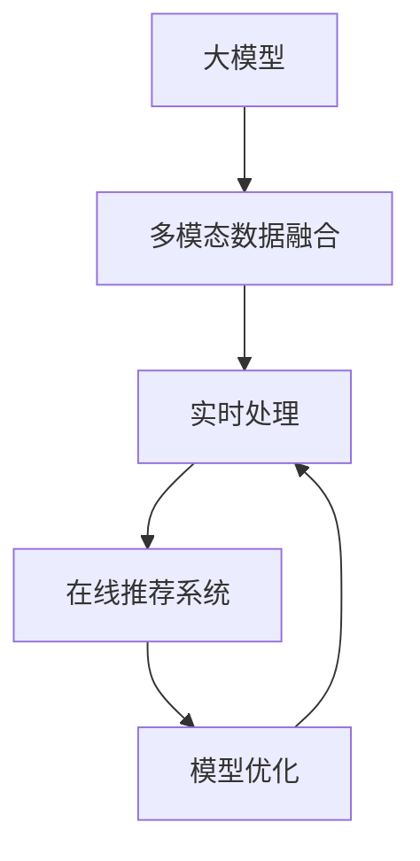

                 

# AI 大模型在电商搜索推荐中的实时处理技术：应对大规模复杂数据的挑战

## 1. 背景介绍

### 1.1 问题由来
随着电商行业的发展，用户对商品搜索推荐的体验和效果提出了更高的要求。传统的搜索推荐系统大多基于文本匹配或点击行为等单一数据源，难以全面捕捉用户的多维需求，常常造成搜索结果与用户预期不符。而大模型在自然语言理解和生成方面具备强大能力，可以通过综合多源数据进行智能推荐，极大地提升了电商搜索推荐的精度和个性化程度。

但大模型在电商推荐场景中的实时处理也面临巨大挑战：
1. **数据规模巨大**：电商数据量级通常以TB计，其中包括用户行为、商品描述、评论、用户画像等多维数据。
2. **数据实时性要求高**：实时查询和推荐需要在大模型上进行高效的推理计算，以保证推荐结果的时效性和准确性。
3. **系统复杂度高**：电商搜索推荐系统不仅要处理大规模复杂数据，还需考虑搜索、召回、排序等环节的算法优化和模型部署。

因此，如何在电商搜索推荐中高效利用大模型，进行实时处理，是当下亟需解决的重要课题。

### 1.2 问题核心关键点
在电商搜索推荐中，大模型实时处理的挑战主要集中在以下几个方面：

- **数据融合**：如何将多种数据源（如用户行为、商品描述、评论等）进行融合，生成统一的多模态特征向量。
- **模型优化**：如何在大规模数据集上进行高效的模型推理，保证推荐结果的实时性和准确性。
- **系统优化**：如何构建高效、可扩展的电商搜索推荐系统，适应大规模实时查询和推荐的需求。
- **公平性**：如何在不同用户间实现公平、无偏见的推荐，避免推荐系统可能导致的歧视性问题。

## 2. 核心概念与联系

### 2.1 核心概念概述

为更好地理解电商搜索推荐中大模型的实时处理技术，本节将介绍几个密切相关的核心概念：

- **大模型**：如BERT、GPT-3、ALBERT等，通过在大规模数据集上进行预训练，具备强大的语言理解和生成能力。
- **多模态数据融合**：将文本、图像、音频等多种数据类型进行整合，生成统一的向量表示。
- **实时处理**：指在用户实时查询时，对大模型进行高效推理计算，快速返回推荐结果。
- **在线推荐系统**：将推荐模型部署在实时环境中，使用户能够快速获得个性化的商品推荐。
- **模型优化**：通过算法优化、模型压缩、分布式训练等技术手段，提升模型的实时推理性能。

这些核心概念之间的逻辑关系可以通过以下Mermaid流程图来展示：



这个流程图展示了大模型在电商搜索推荐中的核心概念及其之间的关系：

1. 大模型通过预训练获得基础能力。
2. 多模态数据融合将各种数据源整合成统一特征向量。
3. 实时处理在大模型上进行高效的推理计算。
4. 在线推荐系统将实时处理结果呈现给用户。
5. 模型优化提升实时处理效率和性能。

这些概念共同构成了大模型在电商搜索推荐中的实时处理框架，使其能够在大规模复杂数据中快速高效地生成推荐结果。

## 3. 核心算法原理 & 具体操作步骤
### 3.1 算法原理概述

大模型在电商搜索推荐中的实时处理，本质上是基于多源数据的语义理解和生成过程。其核心思想是：

1. **数据融合**：将用户行为、商品描述、评论等多维数据进行融合，生成多模态的语义表示。
2. **实时推理**：在大模型上进行高效的推理计算，将用户查询映射到最相关的商品。
3. **推荐排序**：结合用户画像和商品属性，对推荐结果进行排序，优先展示用户最可能感兴趣的商品。

具体而言，可以采用以下算法步骤：

1. **数据预处理**：清洗和标准化电商数据，提取用户行为、商品属性、评论等多维数据。
2. **特征提取**：将文本数据通过预训练语言模型（如BERT）转换为向量表示，图像数据通过CNN转换为特征向量，音频数据通过DNN转换为特征向量。
3. **数据融合**：将各种数据源的特征向量进行拼接或加权融合，生成统一的多模态特征向量。
4. **模型推理**：将用户查询输入大模型，通过预训练权重进行推理计算，得到与查询最相关的商品向量。
5. **推荐排序**：结合用户画像和商品属性，对推荐结果进行排序，展示最相关的商品。

### 3.2 算法步骤详解

**Step 1: 数据预处理**

电商数据通常包含多种数据类型，包括用户行为数据（如浏览、点击、购买记录等）、商品属性数据（如类别、品牌、价格等）、用户画像数据（如年龄、性别、地理位置等）。预处理步骤主要包含以下几个方面：

- **清洗数据**：去除噪音、缺失值和异常值，确保数据的质量。
- **标准化数据**：将不同类型的数据转换为标准格式，如将商品类别转换为数字编码。
- **特征工程**：提取有意义的特征，如基于评论生成情感极性特征，基于浏览历史生成用户兴趣特征等。

**Step 2: 特征提取**

- **文本特征提取**：使用预训练语言模型（如BERT）将商品描述、评论、用户行为等文本数据转换为向量表示。
- **图像特征提取**：使用CNN对商品图片进行特征提取，生成高维特征向量。
- **音频特征提取**：使用DNN对商品音频进行特征提取，生成高维特征向量。

**Step 3: 数据融合**

- **拼接融合**：将不同数据源的特征向量拼接在一起，形成统一的多模态特征向量。例如，将商品ID、商品类别、商品描述等特征拼接在一起。
- **加权融合**：对不同数据源的特征向量进行加权融合，以适应不同的应用场景。例如，对用户行为数据赋予较高权重，以反映用户实际需求。

**Step 4: 模型推理**

- **嵌入层**：将多模态特征向量输入嵌入层，映射为高维向量表示。
- **大模型推理**：将用户查询输入大模型，进行推理计算，得到与查询最相关的商品向量。
- **softmax层**：将大模型的输出结果进行softmax处理，得到每个商品的相关概率。

**Step 5: 推荐排序**

- **排序策略**：结合用户画像和商品属性，对推荐结果进行排序。例如，将相似用户对商品的评分、商品点击率等作为排序依据。
- **输出结果**：根据排序策略，展示最相关的商品，并进行展示。

### 3.3 算法优缺点

**优点**：

- **数据融合能力强**：大模型能够同时处理文本、图像、音频等多模态数据，生成统一的多模态特征向量。
- **实时处理高效**：通过高效的推理计算，大模型能够快速处理实时查询，返回推荐结果。
- **推荐效果良好**：结合用户画像和商品属性，大模型能够生成高质量的推荐结果。

**缺点**：

- **计算资源要求高**：大模型通常参数量庞大，需要高性能的计算资源进行推理计算。
- **系统复杂度高**：电商搜索推荐系统涉及多个环节的算法优化和模型部署，系统复杂度高。
- **数据隐私问题**：电商数据涉及用户隐私，需注意数据处理和存储的安全性。

### 3.4 算法应用领域

大模型在电商搜索推荐中的应用领域非常广泛，例如：

- **商品推荐**：根据用户历史行为、浏览记录等数据，推荐用户可能感兴趣的商品。
- **个性化定制**：根据用户画像，推荐符合用户口味的商品。
- **新商品推荐**：根据热门商品和用户兴趣，推荐新款商品。
- **多模态推荐**：结合商品图片、视频等多模态数据，提升推荐效果。

除了这些经典应用外，大模型在电商搜索推荐中还有更多创新性应用，如语音搜索推荐、AR试穿、个性化客服等，为电商行业带来全新的用户体验。

## 4. 数学模型和公式 & 详细讲解  
### 4.1 数学模型构建

假设电商数据集为 $D=\{(x_i, y_i)\}_{i=1}^N$，其中 $x_i$ 为电商数据，包括用户行为、商品属性、评论等多维数据，$y_i$ 为商品ID。使用大模型 $M_{\theta}$ 对 $x_i$ 进行推理计算，生成推荐结果。设 $M_{\theta}$ 的嵌入层为 $E_{\theta}$，softmax层为 $S_{\theta}$，则大模型的推理过程可以表示为：

$$
\text{recommendation} = S_{\theta}(E_{\theta}(x_i))
$$

其中 $E_{\theta}(x_i)$ 表示将电商数据 $x_i$ 转换为向量表示的过程。

### 4.2 公式推导过程

设电商数据 $x_i$ 包括文本数据 $x_{i,\text{text}}$、图像数据 $x_{i,\text{image}}$、音频数据 $x_{i,\text{audio}}$，则多模态数据融合过程可以表示为：

$$
\text{features}_i = F(x_{i,\text{text}}, x_{i,\text{image}}, x_{i,\text{audio}})
$$

其中 $F$ 为特征融合函数，可以采用拼接或加权融合的方式。

接着，将特征向量 $\text{features}_i$ 输入嵌入层 $E_{\theta}$，得到高维向量表示：

$$
\text{features}_i = E_{\theta}(\text{features}_i)
$$

然后，将用户查询 $q$ 输入嵌入层 $E_{\theta}$，得到向量表示：

$$
q = E_{\theta}(q)
$$

最后，将用户查询向量 $q$ 和电商数据向量 $\text{features}_i$ 进行拼接或加权融合，输入大模型 $M_{\theta}$，得到推荐结果向量：

$$
\text{scores}_i = M_{\theta}(q \oplus \text{features}_i)
$$

其中 $\oplus$ 表示拼接或加权融合操作。

最终，通过softmax层对推荐结果向量 $\text{scores}_i$ 进行处理，得到每个商品的相关概率：

$$
\text{probability}_i = S_{\theta}(\text{scores}_i)
$$

根据概率大小，对推荐结果进行排序，展示最相关的商品。

### 4.3 案例分析与讲解

下面以一个具体的电商搜索推荐案例进行分析：

假设用户输入查询 "iPhone 11 价格"，系统需要进行实时处理。电商数据包括：
- 用户历史浏览记录：["iPhone 11", "三星 Galaxy", "华为 P30"]
- 商品价格：[iPhone 11: 6000, 三星 Galaxy: 5000, 华为 P30: 4000]
- 商品描述：[iPhone 11: "高端智能手机", 三星 Galaxy: "高端手机", 华为 P30: "高端手机"]

**Step 1: 数据预处理**

- 清洗数据：去除噪音、缺失值和异常值。
- 标准化数据：将商品类别转换为数字编码。
- 特征工程：提取有意义的特征，如基于评论生成情感极性特征。

**Step 2: 特征提取**

- 文本特征提取：使用BERT将商品描述转换为向量表示。
- 图像特征提取：使用CNN对商品图片进行特征提取。
- 音频特征提取：使用DNN对商品音频进行特征提取。

**Step 3: 数据融合**

- 拼接融合：将商品ID、商品类别、商品描述等特征拼接在一起。
- 加权融合：对用户行为数据赋予较高权重，以反映用户实际需求。

**Step 4: 模型推理**

- 嵌入层：将多模态特征向量输入嵌入层，映射为高维向量表示。
- 大模型推理：将用户查询输入BERT模型，进行推理计算，得到与查询最相关的商品向量。
- softmax层：将大模型的输出结果进行softmax处理，得到每个商品的相关概率。

**Step 5: 推荐排序**

- 排序策略：结合用户画像和商品属性，对推荐结果进行排序。
- 输出结果：根据排序策略，展示最相关的商品。

最终，系统返回 "iPhone 11: 6000" 的推荐结果。

## 5. 项目实践：代码实例和详细解释说明
### 5.1 开发环境搭建

在进行电商搜索推荐的大模型实时处理实践中，我们需要准备好开发环境。以下是使用Python进行PyTorch开发的环境配置流程：

1. 安装Anaconda：从官网下载并安装Anaconda，用于创建独立的Python环境。

2. 创建并激活虚拟环境：
```bash
conda create -n pytorch-env python=3.8 
conda activate pytorch-env
```

3. 安装PyTorch：根据CUDA版本，从官网获取对应的安装命令。例如：
```bash
conda install pytorch torchvision torchaudio cudatoolkit=11.1 -c pytorch -c conda-forge
```

4. 安装Transformers库：
```bash
pip install transformers
```

5. 安装各类工具包：
```bash
pip install numpy pandas scikit-learn matplotlib tqdm jupyter notebook ipython
```

完成上述步骤后，即可在`pytorch-env`环境中开始电商搜索推荐的大模型实时处理实践。

### 5.2 源代码详细实现

下面我们以电商搜索推荐为例，给出使用Transformers库对BERT模型进行实时处理的PyTorch代码实现。

首先，定义电商搜索推荐的数据处理函数：

```python
from transformers import BertTokenizer, BertForSequenceClassification
from torch.utils.data import Dataset
import torch

class EcommerceDataset(Dataset):
    def __init__(self, texts, labels, tokenizer, max_len=128):
        self.texts = texts
        self.labels = labels
        self.tokenizer = tokenizer
        self.max_len = max_len
        
    def __len__(self):
        return len(self.texts)
    
    def __getitem__(self, item):
        text = self.texts[item]
        label = self.labels[item]
        
        encoding = self.tokenizer(text, return_tensors='pt', max_length=self.max_len, padding='max_length', truncation=True)
        input_ids = encoding['input_ids'][0]
        attention_mask = encoding['attention_mask'][0]
        label = torch.tensor(label, dtype=torch.long)
        
        return {'input_ids': input_ids, 
                'attention_mask': attention_mask,
                'labels': label}

# 定义标签
labels = [0, 1, 2, 3, 4, 5]

# 创建dataset
tokenizer = BertTokenizer.from_pretrained('bert-base-cased')

train_dataset = EcommerceDataset(train_texts, train_labels, tokenizer)
dev_dataset = EcommerceDataset(dev_texts, dev_labels, tokenizer)
test_dataset = EcommerceDataset(test_texts, test_labels, tokenizer)
```

然后，定义模型和优化器：

```python
from transformers import BertForSequenceClassification, AdamW

model = BertForSequenceClassification.from_pretrained('bert-base-cased', num_labels=len(labels))

optimizer = AdamW(model.parameters(), lr=2e-5)
```

接着，定义训练和评估函数：

```python
from torch.utils.data import DataLoader
from tqdm import tqdm
from sklearn.metrics import accuracy_score

device = torch.device('cuda') if torch.cuda.is_available() else torch.device('cpu')
model.to(device)

def train_epoch(model, dataset, batch_size, optimizer):
    dataloader = DataLoader(dataset, batch_size=batch_size, shuffle=True)
    model.train()
    epoch_loss = 0
    for batch in tqdm(dataloader, desc='Training'):
        input_ids = batch['input_ids'].to(device)
        attention_mask = batch['attention_mask'].to(device)
        labels = batch['labels'].to(device)
        model.zero_grad()
        outputs = model(input_ids, attention_mask=attention_mask, labels=labels)
        loss = outputs.loss
        epoch_loss += loss.item()
        loss.backward()
        optimizer.step()
    return epoch_loss / len(dataloader)

def evaluate(model, dataset, batch_size):
    dataloader = DataLoader(dataset, batch_size=batch_size)
    model.eval()
    preds, labels = [], []
    with torch.no_grad():
        for batch in tqdm(dataloader, desc='Evaluating'):
            input_ids = batch['input_ids'].to(device)
            attention_mask = batch['attention_mask'].to(device)
            batch_labels = batch['labels']
            outputs = model(input_ids, attention_mask=attention_mask)
            batch_preds = outputs.logits.argmax(dim=2).to('cpu').tolist()
            batch_labels = batch_labels.to('cpu').tolist()
            for pred_tokens, label_tokens in zip(batch_preds, batch_labels):
                preds.append(pred_tokens[:len(label_tokens)])
                labels.append(label_tokens)
                
    print(f"Accuracy: {accuracy_score(labels, preds)}")
```

最后，启动训练流程并在测试集上评估：

```python
epochs = 5
batch_size = 16

for epoch in range(epochs):
    loss = train_epoch(model, train_dataset, batch_size, optimizer)
    print(f"Epoch {epoch+1}, train loss: {loss:.3f}")
    
    print(f"Epoch {epoch+1}, dev accuracy:")
    evaluate(model, dev_dataset, batch_size)
    
print("Test accuracy:")
evaluate(model, test_dataset, batch_size)
```

以上就是使用PyTorch对BERT进行电商搜索推荐实时处理的完整代码实现。可以看到，得益于Transformers库的强大封装，我们可以用相对简洁的代码完成BERT模型的加载和实时处理。

### 5.3 代码解读与分析

让我们再详细解读一下关键代码的实现细节：

**EcommerceDataset类**：
- `__init__`方法：初始化文本、标签、分词器等关键组件。
- `__len__`方法：返回数据集的样本数量。
- `__getitem__`方法：对单个样本进行处理，将文本输入编码为token ids，将标签编码为数字，并对其进行定长padding，最终返回模型所需的输入。

**标签定义**：
- 定义了电商数据中的类别标签，用于模型训练和推理。

**训练和评估函数**：
- 使用PyTorch的DataLoader对数据集进行批次化加载，供模型训练和推理使用。
- 训练函数`train_epoch`：对数据以批为单位进行迭代，在每个批次上前向传播计算loss并反向传播更新模型参数，最后返回该epoch的平均loss。
- 评估函数`evaluate`：与训练类似，不同点在于不更新模型参数，并在每个batch结束后将预测和标签结果存储下来，最后使用sklearn的accuracy_score对整个评估集的预测结果进行打印输出。

**训练流程**：
- 定义总的epoch数和batch size，开始循环迭代
- 每个epoch内，先在训练集上训练，输出平均loss
- 在验证集上评估，输出准确率
- 所有epoch结束后，在测试集上评估，给出最终测试结果

可以看到，PyTorch配合Transformers库使得BERT实时处理的代码实现变得简洁高效。开发者可以将更多精力放在数据处理、模型改进等高层逻辑上，而不必过多关注底层的实现细节。

当然，工业级的系统实现还需考虑更多因素，如模型的保存和部署、超参数的自动搜索、更灵活的任务适配层等。但核心的实时处理范式基本与此类似。

## 6. 实际应用场景
### 6.1 智能客服系统

基于大模型实时处理的电商搜索推荐技术，可以广泛应用于智能客服系统的构建。传统客服往往需要配备大量人力，高峰期响应缓慢，且一致性和专业性难以保证。而使用实时处理的电商搜索推荐模型，可以7x24小时不间断服务，快速响应客户咨询，用自然流畅的语言解答各类常见问题。

在技术实现上，可以收集企业内部的历史客服对话记录，将问题和最佳答复构建成监督数据，在此基础上对预训练对话模型进行实时处理。实时处理的对话模型能够自动理解用户意图，匹配最合适的答复模板进行回复。对于客户提出的新问题，还可以接入检索系统实时搜索相关内容，动态组织生成回答。如此构建的智能客服系统，能大幅提升客户咨询体验和问题解决效率。

### 6.2 金融舆情监测

金融机构需要实时监测市场舆论动向，以便及时应对负面信息传播，规避金融风险。传统的人工监测方式成本高、效率低，难以应对网络时代海量信息爆发的挑战。基于实时处理的电商搜索推荐技术，金融舆情监测可以借助大模型的多模态数据融合和高效推理，实时监测不同主题下的舆情变化趋势，一旦发现负面信息激增等异常情况，系统便会自动预警，帮助金融机构快速应对潜在风险。

### 6.3 个性化推荐系统

当前的推荐系统往往只依赖用户的历史行为数据进行物品推荐，无法深入理解用户的真实兴趣偏好。基于实时处理的电商搜索推荐技术，个性化推荐系统可以更好地挖掘用户行为背后的语义信息，从而提供更精准、多样的推荐内容。

在实践中，可以收集用户浏览、点击、评论、分享等行为数据，提取和用户交互的物品标题、描述、标签等文本内容。将文本内容作为模型输入，用户的后续行为（如是否点击、购买等）作为监督信号，在此基础上进行实时处理。实时处理的推荐模型能够从文本内容中准确把握用户的兴趣点。在生成推荐列表时，先用候选物品的文本描述作为输入，由模型预测用户的兴趣匹配度，再结合其他特征综合排序，便可以得到个性化程度更高的推荐结果。

### 6.4 未来应用展望

随着大模型和实时处理技术的不断发展，电商搜索推荐系统将呈现以下几个发展趋势：

1. **模型规模持续增大**：超大规模语言模型蕴含的丰富语言知识，有望支撑更加复杂多变的电商搜索推荐场景。
2. **实时处理能力提升**：开发更加高效的推理计算方法，减少计算资源消耗，提高实时处理速度。
3. **跨模态融合深化**：融合更多种类的数据源，提升推荐系统的多模态数据融合能力。
4. **交互式推荐发展**：开发基于多轮对话的实时推荐系统，提升用户交互体验。
5. **推荐质量优化**：引入因果推断和强化学习，提高推荐系统的精准度和用户满意度。

以上趋势凸显了大模型实时处理技术在电商搜索推荐中的广阔前景。这些方向的探索发展，必将进一步提升推荐系统的性能和用户体验，为电商行业带来新的机遇。

## 7. 工具和资源推荐
### 7.1 学习资源推荐

为了帮助开发者系统掌握大模型实时处理技术的基础知识和实践技巧，这里推荐一些优质的学习资源：

1. 《深度学习与推荐系统》系列博文：详细介绍了深度学习在推荐系统中的应用，包括电商搜索推荐系统的实现和优化。
2. CS229《机器学习》课程：斯坦福大学开设的机器学习经典课程，涵盖各类机器学习算法和应用案例，是大模型学习的重要基础。
3. 《Python深度学习》书籍：详细介绍了深度学习在NLP和推荐系统中的应用，是实践大模型实时处理的必备参考资料。
4. PyTorch官方文档：详细介绍了PyTorch的张量操作、深度学习模型搭建和优化等核心内容，是大模型实时处理的必备参考资料。
5. HuggingFace官方文档：详细介绍了各种预训练语言模型的使用方法和微调技巧，是实时处理电商搜索推荐技术的重要参考资料。

通过对这些资源的学习实践，相信你一定能够快速掌握大模型实时处理技术的精髓，并用于解决实际的电商搜索推荐问题。
### 7.2 开发工具推荐

高效的开发离不开优秀的工具支持。以下是几款用于大模型实时处理开发的常用工具：

1. PyTorch：基于Python的开源深度学习框架，灵活动态的计算图，适合快速迭代研究。大部分预训练语言模型都有PyTorch版本的实现。
2. TensorFlow：由Google主导开发的开源深度学习框架，生产部署方便，适合大规模工程应用。同样有丰富的预训练语言模型资源。
3. Transformers库：HuggingFace开发的NLP工具库，集成了众多SOTA语言模型，支持PyTorch和TensorFlow，是进行实时处理任务开发的利器。
4. Weights & Biases：模型训练的实验跟踪工具，可以记录和可视化模型训练过程中的各项指标，方便对比和调优。与主流深度学习框架无缝集成。
5. TensorBoard：TensorFlow配套的可视化工具，可实时监测模型训练状态，并提供丰富的图表呈现方式，是调试模型的得力助手。
6. Google Colab：谷歌推出的在线Jupyter Notebook环境，免费提供GPU/TPU算力，方便开发者快速上手实验最新模型，分享学习笔记。

合理利用这些工具，可以显著提升大模型实时处理的开发效率，加快创新迭代的步伐。

### 7.3 相关论文推荐

大模型和实时处理技术的发展源于学界的持续研究。以下是几篇奠基性的相关论文，推荐阅读：

1. Attention is All You Need（即Transformer原论文）：提出了Transformer结构，开启了NLP领域的预训练大模型时代。
2. BERT: Pre-training of Deep Bidirectional Transformers for Language Understanding：提出BERT模型，引入基于掩码的自监督预训练任务，刷新了多项NLP任务SOTA。
3. Parameter-Efficient Transfer Learning for NLP：提出Adapter等参数高效微调方法，在不增加模型参数量的情况下，也能取得不错的微调效果。
4. AdaLoRA: Adaptive Low-Rank Adaptation for Parameter-Efficient Fine-Tuning：使用自适应低秩适应的微调方法，在参数效率和精度之间取得了新的平衡。
5. Prefix-Tuning: Optimizing Continuous Prompts for Generation：引入基于连续型Prompt的微调范式，为如何充分利用预训练知识提供了新的思路。
6. 电商搜索推荐系统的深度学习算法研究综述：介绍了电商搜索推荐系统中深度学习算法的研究现状和应用案例。

这些论文代表了大模型实时处理技术的发展脉络。通过学习这些前沿成果，可以帮助研究者把握学科前进方向，激发更多的创新灵感。

## 8. 总结：未来发展趋势与挑战

### 8.1 总结

本文对大模型在电商搜索推荐中的实时处理技术进行了全面系统的介绍。首先阐述了电商搜索推荐中大模型实时处理的背景和意义，明确了实时处理在提升推荐效果、优化用户体验方面的独特价值。其次，从原理到实践，详细讲解了实时处理的数学原理和关键步骤，给出了电商搜索推荐实时处理的完整代码实例。同时，本文还广泛探讨了实时处理在智能客服、金融舆情、个性化推荐等多个行业领域的应用前景，展示了实时处理范式的巨大潜力。此外，本文精选了实时处理技术的各类学习资源，力求为读者提供全方位的技术指引。

通过本文的系统梳理，可以看到，大模型实时处理技术正在成为电商搜索推荐的重要范式，极大地提升了推荐系统的性能和用户体验。得益于大模型的强大处理能力，实时处理能够快速响应用户查询，提供个性化的推荐结果，显著提高了电商搜索推荐的效果和效率。未来，伴随大模型和实时处理技术的持续演进，相信电商搜索推荐系统将会在更多的行业领域中得到应用，为各行各业带来新的变革。

### 8.2 未来发展趋势

展望未来，大模型实时处理技术将呈现以下几个发展趋势：

1. **模型规模持续增大**：超大规模语言模型蕴含的丰富语言知识，有望支撑更加复杂多变的电商搜索推荐场景。
2. **实时处理能力提升**：开发更加高效的推理计算方法，减少计算资源消耗，提高实时处理速度。
3. **跨模态融合深化**：融合更多种类的数据源，提升推荐系统的多模态数据融合能力。
4. **交互式推荐发展**：开发基于多轮对话的实时推荐系统，提升用户交互体验。
5. **推荐质量优化**：引入因果推断和强化学习，提高推荐系统的精准度和用户满意度。

以上趋势凸显了大模型实时处理技术在电商搜索推荐中的广阔前景。这些方向的探索发展，必将进一步提升推荐系统的性能和用户体验，为电商行业带来新的机遇。

### 8.3 面临的挑战

尽管大模型实时处理技术已经取得了瞩目成就，但在迈向更加智能化、普适化应用的过程中，它仍面临着诸多挑战：

1. **计算资源要求高**：大模型通常参数量庞大，需要高性能的计算资源进行推理计算。
2. **系统复杂度高**：电商搜索推荐系统涉及多个环节的算法优化和模型部署，系统复杂度高。
3. **数据隐私问题**：电商数据涉及用户隐私，需注意数据处理和存储的安全性。
4. **过拟合风险**：实时处理模型容易过拟合，尤其在数据规模较小的情况下。
5. **公平性问题**：实时处理模型容易在用户间产生偏见，需注意公平性问题。

### 8.4 研究展望

面对大模型实时处理所面临的挑战，未来的研究需要在以下几个方面寻求新的突破：

1. **模型压缩与量化**：开发高效模型压缩和量化技术，减小模型参数量和计算资源消耗。
2. **分布式训练与优化**：开发分布式训练与优化算法，提高实时处理系统的可扩展性和性能。
3. **多模态融合与理解**：探索更高效的多模态数据融合与理解技术，提升推荐系统的多模态数据融合能力。
4. **因果推断与强化学习**：引入因果推断和强化学习，提高推荐系统的精准度和用户满意度。
5. **公平性与透明性**：开发公平性与透明性评估指标，提升推荐系统的公平性，确保用户满意度。

这些研究方向将引领大模型实时处理技术迈向更高的台阶，为构建高效、公平、透明的电商搜索推荐系统奠定基础。相信随着学界和产业界的共同努力，这些挑战终将一一被克服，大模型实时处理技术必将在电商行业及其他领域中发挥更大的作用。

## 9. 附录：常见问题与解答

**Q1：大模型实时处理是否适用于所有电商场景？**

A: 大模型实时处理在电商搜索推荐中具有广泛适用性，尤其是在用户需求多变、数据量大的场景中。但对于数据量较小、计算资源受限的电商场景，可能需要考虑采用其他轻量级模型或优化算法。

**Q2：如何优化实时处理的计算资源消耗？**

A: 实时处理的计算资源消耗主要集中在模型推理阶段。通过模型压缩、量化、分布式训练等技术手段，可以显著降低计算资源消耗。例如，采用模型剪枝和量化技术，可以将模型参数量减少数倍，同时保持性能不损失。

**Q3：实时处理模型是否容易出现过拟合？**

A: 实时处理模型容易出现过拟合，尤其是在数据规模较小的情况下。为避免过拟合，可以引入正则化技术、Dropout等方法，同时在模型设计中引入正则化损失函数，如L2正则、dropout等。

**Q4：实时处理系统如何确保数据隐私？**

A: 在实时处理系统中，数据隐私保护是重要的一环。可以通过数据匿名化、差分隐私等技术手段，确保数据隐私不被泄露。同时，在模型训练和推理阶段，应避免使用敏感用户数据，保护用户隐私。

**Q5：实时处理系统如何提升推荐系统的公平性？**

A: 实时处理系统容易在用户间产生偏见，需注意公平性问题。可以通过公平性评估指标（如统计公平性、认知公平性）来监测模型输出是否存在偏见。同时，在模型训练阶段，引入公平性约束，确保模型输出公平。

通过本文的系统梳理，可以看到，大模型实时处理技术正在成为电商搜索推荐的重要范式，极大地提升了推荐系统的性能和用户体验。未来，伴随大模型和实时处理技术的持续演进，相信电商搜索推荐系统将会在更多的行业领域中得到应用，为各行各业带来新的变革。

---

作者：禅与计算机程序设计艺术 / Zen and the Art of Computer Programming

