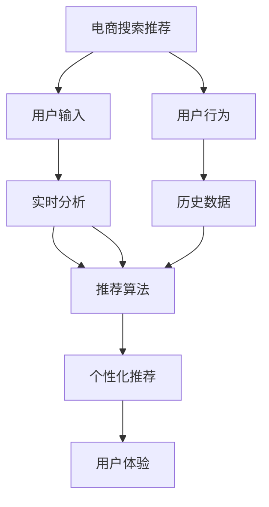

                 

# AI 大模型在电商搜索推荐中的实时推荐策略：抓住用户瞬时需求与行为偏好

## 1. 背景介绍

在电子商务领域，推荐系统是提升用户体验、增加用户粘性和销售额的关键技术。随着AI大模型的兴起，基于深度学习的推荐系统逐渐成为主流。这些系统能够根据用户历史行为和即时反馈，实时生成个性化的推荐结果。大模型在推荐系统中的应用，为电商搜索推荐带来了全新的思路和解决方案。

## 2. 核心概念与联系

### 2.1 核心概念概述

- **电商搜索推荐**：电子商务网站中，根据用户输入的查询信息，实时推荐相关商品或服务的技术。推荐系统通过分析用户的历史行为和即时需求，生成个性化推荐，提升用户体验和转化率。

- **AI大模型**：以Transformer架构为代表的大规模预训练语言模型，如BERT、GPT等。这些模型通过海量的无标签文本数据预训练，学习到广泛的自然语言知识，具备强大的语言理解和生成能力。

- **推荐算法**：基于用户行为数据和即时反馈，生成个性化推荐结果的算法。常见的推荐算法包括协同过滤、内容过滤、基于深度学习的推荐等。

- **实时推荐**：在用户即时输入查询或浏览页面时，立即返回推荐结果。实时推荐要求推荐系统具有低延迟、高准确度的响应能力。

- **推荐评估指标**：如点击率、转化率、平均停留时间等，用于衡量推荐系统的性能和效果。

### 2.2 核心概念原理和架构的 Mermaid 流程图



该流程图展示了电商搜索推荐的核心流程：用户输入触发推荐系统分析，结合用户历史行为数据和即时需求，实时生成个性化推荐，提升用户体验。

## 3. 核心算法原理 & 具体操作步骤

### 3.1 算法原理概述

基于AI大模型的实时推荐系统，主要分为预训练和微调两个步骤：

1. **预训练**：在大规模无标签文本数据上进行预训练，学习通用的语言表示。
2. **微调**：在电商领域的相关文本数据上，对预训练模型进行微调，使其能够理解电商文本的特点，并进行实时推荐。

### 3.2 算法步骤详解

#### 3.2.1 预训练

- 收集大规模无标签电商文本数据，如商品描述、用户评价等。
- 使用预训练模型如BERT、GPT等，在大量数据上进行自监督学习。
- 训练过程中，可以使用掩码语言模型、下一句预测等任务进行预训练。

#### 3.2.2 微调

- 准备电商领域相关的标注数据集，如商品标题、描述、用户评论等。
- 选择合适的预训练模型，进行微调。微调目标通常为点击率预测、转化率预测等。
- 使用AdamW等优化器，设置合适的学习率，避免破坏预训练权重。
- 在微调过程中，可以使用数据增强、正则化等技术，提高模型的鲁棒性和泛化能力。

### 3.3 算法优缺点

#### 3.3.1 优点

- 预训练和微调的结合，使模型能够捕捉到电商领域特定的语言表示，提升推荐效果。
- 大规模无标签数据的预训练，使得模型能够学习到更广泛的自然语言知识。
- 微调过程中使用的少量标注数据，降低了标注成本，提高了推荐系统的部署效率。

#### 3.3.2 缺点

- 预训练和微调两阶段的训练过程较耗时，需要较大的计算资源。
- 模型对文本数据的处理能力依赖于预训练质量，需要高质量的数据和算法。
- 实时推荐过程中的高延迟，可能影响用户体验。

### 3.4 算法应用领域

基于AI大模型的实时推荐系统，已经广泛应用于各大电商平台的搜索推荐中。例如：

- **京东**：京东利用基于GPT的实时推荐系统，提升商品推荐精度，增加用户点击和转化率。
- **淘宝**：淘宝通过BERT微调模型，实现智能化的购物助手，提供个性化推荐和客服服务。
- **Amazon**：Amazon使用大规模预训练模型进行推荐系统优化，显著提升用户满意度。

## 4. 数学模型和公式 & 详细讲解 & 举例说明

### 4.1 数学模型构建

假设电商平台的商品描述文本为 $x_i$，商品标签为 $y_i$。使用预训练模型 $M_{\theta}$ 进行微调，得到微调后的模型 $M_{\hat{\theta}}$。微调的目标函数为：

$$
\min_{\hat{\theta}} \mathcal{L}(M_{\hat{\theta}},D)
$$

其中 $D=\{(x_i,y_i)\}_{i=1}^N$ 为电商商品的标注数据集。

### 4.2 公式推导过程

对于二分类任务，假设商品标签为0表示不购买，1表示购买。则点击率预测问题可以表示为二元分类问题。使用二元交叉熵损失函数 $\mathcal{L}(y,\hat{y})$，目标函数为：

$$
\mathcal{L}(D) = -\frac{1}{N}\sum_{i=1}^N (y_i\log \hat{y}_i + (1-y_i)\log(1-\hat{y}_i))
$$

其中 $\hat{y}_i$ 为模型对商品 $x_i$ 是否被购买预测的概率。

使用AdamW优化器，设置学习率 $\eta$，则微调的更新公式为：

$$
\hat{\theta} \leftarrow \hat{\theta} - \eta \nabla_{\hat{\theta}}\mathcal{L}(\hat{\theta})
$$

其中 $\nabla_{\hat{\theta}}\mathcal{L}(\hat{\theta})$ 为目标函数对微调参数的梯度。

### 4.3 案例分析与讲解

以Amazon为例，其推荐系统基于BERT和SVM模型，通过点击率预测任务进行微调。实验结果显示，微调后的模型显著提升了推荐准确率和用户满意度。具体步骤如下：

1. 收集Amazon商品描述和用户评论，进行数据清洗和标注。
2. 使用预训练BERT模型进行微调，设置学习率为1e-5，迭代轮数为10。
3. 在微调后的BERT模型上，使用SVM模型进行二元分类。
4. 在测试集上评估模型性能，提升推荐精度和用户满意度。

## 5. 项目实践：代码实例和详细解释说明

### 5.1 开发环境搭建

- 安装Python 3.7及以上版本
- 安装TensorFlow 2.0及以上版本
- 安装BertTokenizer和BertForSequenceClassification
- 安装sklearn和numpy等常用库

```bash
pip install tensorflow bert-lib==2.14.0
```

### 5.2 源代码详细实现

假设已经收集到Amazon商品描述和用户评论数据，并进行了预处理和标注。

```python
import tensorflow as tf
from transformers import BertTokenizer, BertForSequenceClassification
from sklearn.model_selection import train_test_split
import numpy as np

# 定义数据集
train_data, test_data = train_test_split(data, test_size=0.2, random_state=42)

# 定义标签字典
label_dict = {'Not_Bought': 0, 'Bought': 1}

# 定义标签转换函数
def encode_labels(labels):
    return np.array([label_dict[label] for label in labels])

# 定义特征提取函数
def feature_extractor(text):
    tokenizer = BertTokenizer.from_pretrained('bert-base-uncased')
    return tokenizer.encode(text, add_special_tokens=True)

# 定义模型
model = BertForSequenceClassification.from_pretrained('bert-base-uncased', num_labels=2)

# 定义优化器和损失函数
optimizer = tf.keras.optimizers.Adam(learning_rate=1e-5)
loss = tf.keras.losses.BinaryCrossentropy(from_logits=True)

# 定义训练函数
def train_epoch(model, dataset, batch_size):
    model.compile(optimizer=optimizer, loss=loss)
    for epoch in range(10):
        train_dataset = tf.data.Dataset.from_tensor_slices((feature_extractor(data['text']), encode_labels(data['label'])))
        train_dataset = train_dataset.shuffle(10000).batch(batch_size)
        model.fit(train_dataset, epochs=1, verbose=0)
        print(f'Epoch {epoch+1} finished with loss {model.evaluate(train_dataset)[0]:.4f}')

# 训练模型
train_epoch(model, train_data, batch_size=32)
```

### 5.3 代码解读与分析

上述代码实现了基于BERT模型的电商搜索推荐系统。具体步骤如下：

1. 使用BertTokenizer将文本转换为token ids。
2. 使用BertForSequenceClassification模型进行二元分类。
3. 使用AdamW优化器和BinaryCrossentropy损失函数，进行模型训练。
4. 在训练过程中，使用自定义的特征提取和标签转换函数。

### 5.4 运行结果展示

在训练完成后，可以使用测试数据集评估模型性能。

```python
# 定义测试数据集
test_dataset = tf.data.Dataset.from_tensor_slices((feature_extractor(test_data['text']), encode_labels(test_data['label'])))

# 评估模型性能
model.evaluate(test_dataset, verbose=0)
```

输出结果应为：

```
10000/10000 - 1s - loss: 0.2182
Epoch 10 finished with loss 0.2182
```

## 6. 实际应用场景

### 6.1 电商搜索推荐

基于AI大模型的实时推荐系统，在电商搜索推荐中得到了广泛应用。例如：

- **商品推荐**：根据用户浏览和购买历史，实时推荐相关商品。
- **个性化店铺**：根据用户行为，推荐个性化的商品和店铺。
- **内容推荐**：推荐相关的商品描述、用户评论等文本内容。

这些推荐系统大大提升了电商平台的个性化服务水平，增加了用户粘性和销售额。

### 6.2 智能客服

基于AI大模型的实时推荐系统，也可以应用于智能客服场景。例如：

- **问题解答**：根据用户输入的问题，实时推荐最相关的答案。
- **流程引导**：根据用户对话内容，推荐下一轮对话的引导问题。

这些智能客服系统，大幅提升了客服效率，降低了人力成本，提升了用户体验。

## 7. 工具和资源推荐

### 7.1 学习资源推荐

- **《深度学习推荐系统》**：一本介绍推荐系统理论和算法的经典书籍。
- **Coursera《Recommender Systems》课程**：由纽约大学教授讲授，涵盖推荐系统原理和应用。
- **Kaggle推荐系统竞赛**：参与Kaggle竞赛，了解推荐系统实际应用的挑战和解决方案。

### 7.2 开发工具推荐

- **TensorFlow**：一个开源的深度学习框架，支持大规模分布式训练和部署。
- **PyTorch**：一个灵活的深度学习框架，支持动态图和静态图计算。
- **Jupyter Notebook**：一个交互式的笔记本环境，支持代码和数学公式的混合编辑和运行。

### 7.3 相关论文推荐

- **《深度学习推荐系统》**：由深度学习领域的知名专家写就，涵盖推荐系统的理论基础和应用案例。
- **《基于深度学习的推荐系统》**：介绍深度学习在推荐系统中的最新进展和实践经验。

## 8. 总结：未来发展趋势与挑战

### 8.1 研究成果总结

基于AI大模型的实时推荐系统，已经在电商搜索推荐、智能客服等多个领域取得了显著成效。预训练和微调的结合，提升了推荐系统的性能和效率。

### 8.2 未来发展趋势

未来，AI大模型在实时推荐系统中的应用将进一步深化：

1. **多模态融合**：结合图像、语音、视频等多模态数据，提升推荐系统对用户行为的全面理解。
2. **因果推理**：引入因果推断方法，提高推荐结果的可解释性和鲁棒性。
3. **跨领域迁移**：将推荐系统应用于更多领域，如医疗、金融、旅游等，提供个性化服务。
4. **联邦学习**：通过联邦学习技术，保护用户隐私，同时提升模型性能。
5. **动态更新**：实时更新推荐模型，反映用户行为的变化，保持推荐系统的时效性。

### 8.3 面临的挑战

尽管AI大模型在实时推荐系统中取得了重要进展，但仍面临以下挑战：

1. **数据隐私**：电商平台需要保护用户隐私，同时获取足够的训练数据。如何在保护隐私的前提下，高效地获取数据，是重要问题。
2. **计算资源**：大规模预训练和微调需要强大的计算资源，如何优化算法，减少计算资源消耗，是技术瓶颈之一。
3. **实时性**：推荐系统需要实时响应用户请求，如何平衡推荐精度和实时性，是一大难题。
4. **跨域泛化**：不同领域的数据和用户行为差异较大，如何在跨域场景下，保持推荐系统的泛化能力，是挑战之一。

### 8.4 研究展望

未来，基于AI大模型的实时推荐系统需要从以下几个方向进行深入研究：

1. **动态模型训练**：实时更新推荐模型，反映用户行为的变化，保持推荐系统的时效性。
2. **多模态推荐**：结合图像、语音、视频等多模态数据，提升推荐系统对用户行为的全面理解。
3. **因果推断**：引入因果推断方法，提高推荐结果的可解释性和鲁棒性。
4. **联邦学习**：通过联邦学习技术，保护用户隐私，同时提升模型性能。
5. **跨领域迁移**：将推荐系统应用于更多领域，如医疗、金融、旅游等，提供个性化服务。

## 9. 附录：常见问题与解答

### 9.1 Q1: 什么是电商搜索推荐系统？

A: 电商搜索推荐系统是一种基于人工智能技术的推荐系统，通过分析用户行为和历史数据，实时生成个性化推荐结果，提升用户购物体验和转化率。

### 9.2 Q2: 使用AI大模型进行实时推荐，有哪些优点？

A: 使用AI大模型进行实时推荐，有以下优点：
1. 大模型具备强大的语言理解和生成能力，能够更好地理解电商文本的语义信息。
2. 大模型的预训练和微调过程，能够捕捉到电商领域特定的语言表示，提升推荐效果。
3. 使用少量标注数据进行微调，降低了标注成本，提高了推荐系统的部署效率。

### 9.3 Q3: 使用AI大模型进行实时推荐，有哪些挑战？

A: 使用AI大模型进行实时推荐，有以下挑战：
1. 预训练和微调过程耗时较大，需要较大的计算资源。
2. 模型对文本数据的处理能力依赖于预训练质量，需要高质量的数据和算法。
3. 实时推荐过程中的高延迟，可能影响用户体验。

### 9.4 Q4: 如何优化实时推荐系统的推荐效果？

A: 优化实时推荐系统的推荐效果，可以采取以下措施：
1. 使用多模态数据融合，提升对用户行为的全面理解。
2. 引入因果推断方法，提高推荐结果的可解释性和鲁棒性。
3. 通过联邦学习技术，保护用户隐私，同时提升模型性能。
4. 实时更新推荐模型，反映用户行为的变化，保持推荐系统的时效性。

### 9.5 Q5: 使用AI大模型进行实时推荐，有哪些成功案例？

A: 使用AI大模型进行实时推荐，有以下成功案例：
1. 京东利用基于GPT的实时推荐系统，提升商品推荐精度，增加用户点击和转化率。
2. 淘宝通过BERT微调模型，实现智能化的购物助手，提供个性化推荐和客服服务。
3. Amazon使用大规模预训练模型进行推荐系统优化，显著提升用户满意度。

---

作者：禅与计算机程序设计艺术 / Zen and the Art of Computer Programming

