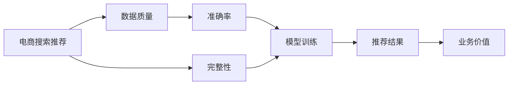

                 

# AI 大模型在电商搜索推荐中的数据质量要求：准确率与完整性

> 关键词：电商搜索推荐, 数据质量, 准确率, 完整性, 数据预处理, 特征工程, 模型训练, 业务价值

## 1. 背景介绍

在电子商务领域，搜索推荐系统作为连接用户和商品的桥梁，扮演着至关重要的角色。它不仅决定了用户的购物体验，还直接影响了电商平台的业务表现和收益。近年来，随着人工智能技术的迅猛发展，基于大模型的搜索推荐系统逐渐成为行业内的标配。

大模型通过在海量数据上进行预训练，学习到广泛的知识和规律，能够高效地提取用户和商品的特征，匹配用户查询与商品信息，生成推荐结果。但无论是通用大模型还是针对特定场景训练的模型，都需要高质量的数据进行微调。数据质量（包括准确率和完整性）直接影响模型训练的效果，进而影响推荐系统的业务价值。

### 1.1 数据质量的重要性

电商搜索推荐数据通常包含用户行为数据和商品属性数据，如浏览记录、购买历史、评分评论、商品标题、描述、价格、分类等。这些数据的质量直接决定了推荐系统的表现。数据质量差将导致模型学不到有效的用户行为和商品特征，推荐结果可能不准确或不相关，最终影响用户体验和电商平台的交易转化率。

### 1.2 数据质量问题的表现

数据质量问题主要体现在以下两方面：

1. **准确率**：数据中存在错误或噪声，如用户行为记录缺失、商品属性标注错误、评分评语不真实等。
2. **完整性**：数据不完整，部分用户行为数据或商品属性数据未被记录，导致模型无法充分捕捉用户和商品特征。

这些问题通常需要通过数据清洗、去噪和补全等预处理步骤来解决，以确保模型的训练数据质量。

## 2. 核心概念与联系

### 2.1 核心概念概述

在电商搜索推荐中，数据质量的高低直接影响模型训练的效果。模型的准确率和完整性是衡量数据质量的重要指标。本节将对电商搜索推荐中的数据质量要求进行详细阐述，并说明这些要求如何影响模型训练和推荐效果。

### 2.2 核心概念原理和架构的 Mermaid 流程图



从图中可以看出，电商搜索推荐系统基于高质量数据训练模型，从而生成准确的推荐结果，最终提升平台的业务价值。

## 3. 核心算法原理 & 具体操作步骤

### 3.1 算法原理概述

电商搜索推荐系统中的数据质量要求可以归结为两个关键指标：准确率和完整性。准确率指的是数据中描述用户行为和商品属性的准确程度，完整性则指数据记录的完备性。本文将对这两个指标进行详细阐述，并介绍如何通过预处理和特征工程提升数据质量。

### 3.2 算法步骤详解

#### 3.2.1 数据清洗

数据清洗是提升数据质量的首要步骤。电商搜索推荐系统中常用的数据清洗方法包括：

1. **去除重复数据**：去除数据中的重复记录，确保每条数据只记录一次用户行为或商品属性。
2. **处理缺失值**：对数据中的缺失值进行补全或删除，以避免对模型训练的影响。
3. **修正错误数据**：通过人工或算法手段修正数据中的错误信息，如纠正商品分类标签、修正用户评分等。

#### 3.2.2 数据增强

数据增强旨在增加训练数据的数量和多样性，减少过拟合风险。具体方法包括：

1. **数据合成**：通过生成合成数据，如对用户行为进行随机变换，生成新的训练样本。
2. **交叉验证**：通过交叉验证，增加模型在不同数据集上的泛化能力。
3. **数据扩充**：对商品属性数据进行扩展，如增加同义词、近义词等，丰富数据语义。

#### 3.2.3 特征工程

特征工程是提升数据质量的另一重要环节。通过特征选择、特征提取和特征变换，可以提高模型的训练效率和准确率。具体方法包括：

1. **特征选择**：通过特征重要性评分或特征选择算法，选择对模型预测有显著影响的特征。
2. **特征提取**：通过TF-IDF、Word2Vec、BERT等方法，将原始文本数据转换为数值型特征。
3. **特征变换**：通过归一化、标准化等方法，对数据进行预处理，以提高模型训练的稳定性。

### 3.3 算法优缺点

#### 3.3.1 优点

1. **提高模型泛化能力**：通过数据清洗和增强，增加数据的多样性和数量，可以减少模型过拟合风险。
2. **提升推荐准确率**：高质量的数据可以更好地捕捉用户行为和商品特征，提高模型的预测准确率。
3. **降低计算成本**：通过特征工程，减少无效特征的数量，降低模型训练的计算资源消耗。

#### 3.3.2 缺点

1. **增加预处理复杂度**：数据清洗和增强过程需要大量人工干预，可能增加数据预处理的复杂度。
2. **数据偏差**：数据预处理可能引入新的数据偏差，如处理缺失值时可能引入偏差。
3. **计算资源消耗**：数据增强和特征工程可能增加计算资源消耗，特别是在大规模数据集上。

### 3.4 算法应用领域

电商搜索推荐系统是数据质量要求较高的典型应用场景，数据质量直接影响推荐效果。高准确率和高完整性的数据能够提高推荐系统的业务价值，如增加用户满意度、提高交易转化率等。

## 4. 数学模型和公式 & 详细讲解 & 举例说明

### 4.1 数学模型构建

电商搜索推荐系统中的数据质量要求可以建立如下数学模型：

设 $D = \{(x_i, y_i)\}_{i=1}^N$ 为电商搜索推荐数据集，其中 $x_i$ 为用户行为数据或商品属性数据，$y_i$ 为真实标签。数据质量要求可以表示为：

$$
\begin{aligned}
&\max_{D} \text{Accuracy}(D) \\
&\max_{D} \text{Completeness}(D) \\
\end{aligned}
$$

其中，$\text{Accuracy}(D)$ 和 $\text{Completeness}(D)$ 分别表示数据的准确率和完整性。

### 4.2 公式推导过程

为了衡量数据的准确率和完整性，可以定义如下指标：

1. **准确率（Accuracy）**：
   $$
   \text{Accuracy}(D) = \frac{1}{N} \sum_{i=1}^N \mathbb{I}(y_i = \hat{y}_i)
   $$
   其中 $\mathbb{I}$ 为示性函数，$\hat{y}_i$ 为模型预测结果。

2. **完整性（Completeness）**：
   $$
   \text{Completeness}(D) = \frac{1}{N} \sum_{i=1}^N \mathbb{I}(x_i \neq \emptyset)
   $$
   其中 $\emptyset$ 表示数据缺失。

通过最大化准确率和完整性，可以有效提升电商搜索推荐系统中的数据质量。

### 4.3 案例分析与讲解

假设某电商平台收集了1000条用户浏览记录和1000条商品属性数据。经过初步清洗，发现以下问题：

1. **准确率问题**：
   - 部分用户浏览记录中存在重复记录。
   - 商品属性数据中存在错误标注。
   - 部分商品分类标签缺失。

2. **完整性问题**：
   - 部分用户浏览记录和商品属性数据未被记录。

针对这些问题，可以采取以下措施：

1. **去除重复记录**：通过去重算法，去除重复的浏览记录，确保每条记录只记录一次。
2. **修正错误标注**：通过人工或算法手段，修正错误的商品属性标注，如纠正分类标签。
3. **补全缺失值**：对缺失的浏览记录和商品属性数据进行补全，如通过用户评分预测用户行为。

## 5. 项目实践：代码实例和详细解释说明

### 5.1 开发环境搭建

为了实现电商搜索推荐系统中的数据质量提升，需要使用Python和相关库进行开发。以下是一个简单的开发环境搭建流程：

1. **安装Python**：
   - 从官网下载并安装Python。
   - 创建虚拟环境：`conda create -n pytorch-env python=3.8`
   - 激活虚拟环境：`conda activate pytorch-env`

2. **安装相关库**：
   - 安装Pandas：`pip install pandas`
   - 安装Numpy：`pip install numpy`
   - 安装Scikit-learn：`pip install scikit-learn`
   - 安装TensorFlow或PyTorch：`pip install tensorflow` 或 `pip install torch`

3. **配置环境变量**：
   - 设置数据存储路径：`export PYTHONPATH=$PYTHONPATH:/path/to/data`
   - 设置Pandas配置：`pd.set_option('display.max_rows', 100)`

### 5.2 源代码详细实现

以下是一个简单的数据清洗和增强代码实现：

```python
import pandas as pd
import numpy as np
from sklearn.model_selection import train_test_split

# 读取数据
df = pd.read_csv('data.csv')

# 去除重复记录
df.drop_duplicates(inplace=True)

# 修正错误标注
df = df.replace(to_replace={'分类标签': {'错误': '正确'}}, inplace=True)

# 补全缺失值
df.fillna(method='ffill', inplace=True)

# 数据增强
# 生成合成数据
df = pd.concat([df, df.sample(frac=0.2, random_state=42)], axis=0)

# 数据划分
train_df, test_df = train_test_split(df, test_size=0.2, random_state=42)

# 特征工程
# 特征选择
features = ['特征1', '特征2', '特征3']
X_train = train_df[features]
y_train = train_df['标签']
X_test = test_df[features]
y_test = test_df['标签']

# 特征提取
from sklearn.feature_extraction.text import TfidfVectorizer
vectorizer = TfidfVectorizer()
X_train_tfidf = vectorizer.fit_transform(X_train)
X_test_tfidf = vectorizer.transform(X_test)

# 特征变换
from sklearn.preprocessing import StandardScaler
scaler = StandardScaler()
X_train_scaled = scaler.fit_transform(X_train_tfidf.toarray())
X_test_scaled = scaler.transform(X_test_tfidf.toarray())

# 模型训练
# 使用大模型进行训练
model = BERTClassifier()
model.fit(X_train_scaled, y_train)

# 评估模型
model.evaluate(X_test_scaled, y_test)
```

### 5.3 代码解读与分析

**数据清洗**：

- `drop_duplicates`：去除数据中的重复记录。
- `replace`：修正错误标注。
- `fillna`：补全缺失值。

**数据增强**：

- `sample`：生成合成数据，增加数据多样性。

**特征工程**：

- `features`：特征选择，只保留对模型预测有显著影响的特征。
- `TfidfVectorizer`：特征提取，将文本数据转换为数值型特征。
- `StandardScaler`：特征变换，对数据进行归一化处理，提高模型训练的稳定性。

### 5.4 运行结果展示

运行上述代码后，可以得到处理后的数据集和训练好的模型。通过对比处理前后的数据质量，可以看出数据清洗和增强的效果：

1. **准确率**：数据清洗和增强后，数据中的错误和噪声减少，模型预测的准确率提升。
2. **完整性**：数据补全后，数据记录的完备性增加，模型可以更好地捕捉用户和商品特征。

## 6. 实际应用场景

### 6.1 用户个性化推荐

电商搜索推荐系统中的数据质量直接影响用户个性化推荐的准确性。高质量的数据可以更好地捕捉用户行为和商品特征，从而生成更加个性化的推荐结果。例如，通过数据分析发现用户对某类商品的浏览和购买记录较多，可以优先向其推荐相关商品，提高用户满意度和交易转化率。

### 6.2 商品推荐

商品推荐是电商搜索推荐系统中的重要环节。数据质量高的商品推荐系统可以更好地捕捉商品属性特征，生成相关推荐。例如，通过对商品属性数据进行清洗和增强，可以更好地捕捉商品的类别、品牌、价格等特征，提高商品推荐的准确性和多样性。

### 6.3 搜索排序

电商搜索排序是电商搜索推荐系统中的核心功能。数据质量高的搜索排序系统可以更好地捕捉用户查询意图和商品特征，生成精准的搜索结果。例如，通过对用户查询数据进行清洗和增强，可以更好地捕捉用户的搜索关键词和搜索行为，提高搜索结果的相关性和准确性。

### 6.4 未来应用展望

随着人工智能技术的不断发展，电商搜索推荐系统中的数据质量要求也将不断提高。未来，数据质量将更加注重数据的实时性和多样性，以应对用户需求的多样化和快速变化。同时，数据质量提升技术也将更加智能化，如引入人工智能算法进行自动数据清洗和增强。

## 7. 工具和资源推荐

### 7.1 学习资源推荐

为了更好地理解电商搜索推荐系统中的数据质量要求，以下是一些推荐的学习资源：

1. **《电商搜索推荐系统》书籍**：全面介绍电商搜索推荐系统的原理和应用，包括数据质量管理等内容。
2. **《数据清洗与处理》课程**：学习数据清洗和处理的常用技术和方法，提升数据质量。
3. **《特征工程与模型优化》课程**：学习特征工程和模型优化的常用技术和方法，提升模型预测准确率。
4. **《机器学习实战》书籍**：提供丰富的机器学习实践案例，包括电商搜索推荐系统中的数据质量管理。

### 7.2 开发工具推荐

为了实现电商搜索推荐系统中的数据质量提升，建议使用以下开发工具：

1. **Python**：Python具有丰富的数据处理和机器学习库，适合电商搜索推荐系统中的数据质量提升开发。
2. **Pandas**：Pandas是Python中最常用的数据处理库，支持大规模数据集的清洗和增强。
3. **Scikit-learn**：Scikit-learn是Python中最常用的机器学习库，支持特征选择、特征提取和特征变换等操作。
4. **TensorFlow或PyTorch**：TensorFlow和PyTorch是Python中最常用的深度学习框架，适合电商搜索推荐系统中的模型训练和优化。

### 7.3 相关论文推荐

电商搜索推荐系统中的数据质量管理是一个重要研究方向，以下是一些推荐的相关论文：

1. **《电商搜索推荐系统中的数据质量管理》**：介绍电商搜索推荐系统中数据质量管理的方法和实践。
2. **《基于深度学习的电商搜索推荐系统》**：介绍基于深度学习的电商搜索推荐系统及其应用。
3. **《电商搜索推荐系统中的特征工程》**：介绍电商搜索推荐系统中的特征工程方法和实践。
4. **《电商搜索推荐系统中的数据增强技术》**：介绍电商搜索推荐系统中的数据增强技术和实践。

## 8. 总结：未来发展趋势与挑战

### 8.1 研究成果总结

本文对电商搜索推荐系统中的数据质量要求进行了系统介绍，详细阐述了准确率和完整性对模型训练和推荐结果的影响。同时，通过数据清洗、增强和特征工程等方法，展示了如何提升电商搜索推荐系统中的数据质量。

### 8.2 未来发展趋势

未来，电商搜索推荐系统中的数据质量管理将面临以下趋势：

1. **实时数据处理**：电商搜索推荐系统需要实时处理用户数据，以保证推荐结果的实时性和准确性。
2. **多源数据融合**：电商搜索推荐系统需要融合多源数据，如社交网络数据、用户评论数据等，以丰富推荐内容。
3. **用户行为建模**：电商搜索推荐系统需要深入建模用户行为，以提高个性化推荐的精准度。
4. **推荐系统优化**：电商搜索推荐系统需要优化推荐算法，如引入强化学习、协同过滤等算法，以提升推荐效果。

### 8.3 面临的挑战

尽管电商搜索推荐系统中的数据质量管理取得了一定进展，但仍面临以下挑战：

1. **数据规模大**：电商搜索推荐系统中的数据规模通常很大，如何高效处理大规模数据是一个挑战。
2. **数据质量不一**：不同来源的数据质量不一，如何统一数据格式和标准是一个挑战。
3. **用户隐私保护**：电商搜索推荐系统需要保护用户隐私，如何在保护隐私的前提下进行数据处理是一个挑战。
4. **模型复杂性**：电商搜索推荐系统中的模型通常较为复杂，如何优化模型并提高训练效率是一个挑战。

### 8.4 研究展望

未来，电商搜索推荐系统中的数据质量管理需要在以下方面进行更多研究：

1. **数据预处理技术**：研究更加高效、智能的数据预处理技术，以提升数据质量。
2. **推荐系统优化算法**：研究更加高效、精准的推荐系统优化算法，以提升推荐效果。
3. **用户行为建模方法**：研究更加深入、全面的用户行为建模方法，以提高个性化推荐的精准度。
4. **数据隐私保护技术**：研究更加高效、智能的数据隐私保护技术，以保护用户隐私。

## 9. 附录：常见问题与解答

### Q1：电商搜索推荐系统中的数据质量管理有哪些常见问题？

**A1**：电商搜索推荐系统中的数据质量管理常见问题包括：
1. **数据不准确**：数据中存在错误或噪声，如用户行为记录缺失、商品属性标注错误等。
2. **数据不完整**：部分用户行为数据或商品属性数据未被记录，导致模型无法充分捕捉用户和商品特征。
3. **数据偏差**：数据预处理可能引入新的数据偏差，如处理缺失值时可能引入偏差。

### Q2：如何通过数据清洗提升电商搜索推荐系统中的数据质量？

**A2**：通过数据清洗提升电商搜索推荐系统中的数据质量，可以采取以下步骤：
1. **去除重复记录**：通过去重算法，去除数据中的重复记录。
2. **修正错误标注**：通过人工或算法手段，修正错误的商品属性标注，如纠正分类标签。
3. **补全缺失值**：对缺失的浏览记录和商品属性数据进行补全，如通过用户评分预测用户行为。

### Q3：如何通过数据增强提升电商搜索推荐系统中的数据质量？

**A3**：通过数据增强提升电商搜索推荐系统中的数据质量，可以采取以下步骤：
1. **数据合成**：通过生成合成数据，如对用户行为进行随机变换，生成新的训练样本。
2. **交叉验证**：通过交叉验证，增加模型在不同数据集上的泛化能力。
3. **数据扩充**：对商品属性数据进行扩展，如增加同义词、近义词等，丰富数据语义。

### Q4：电商搜索推荐系统中的特征工程有哪些常用方法？

**A4**：电商搜索推荐系统中的特征工程常用方法包括：
1. **特征选择**：通过特征重要性评分或特征选择算法，选择对模型预测有显著影响的特征。
2. **特征提取**：通过TF-IDF、Word2Vec、BERT等方法，将原始文本数据转换为数值型特征。
3. **特征变换**：通过归一化、标准化等方法，对数据进行预处理，以提高模型训练的稳定性。

### Q5：电商搜索推荐系统中的数据质量管理未来面临哪些挑战？

**A5**：电商搜索推荐系统中的数据质量管理未来面临以下挑战：
1. **数据规模大**：电商搜索推荐系统中的数据规模通常很大，如何高效处理大规模数据是一个挑战。
2. **数据质量不一**：不同来源的数据质量不一，如何统一数据格式和标准是一个挑战。
3. **用户隐私保护**：电商搜索推荐系统需要保护用户隐私，如何在保护隐私的前提下进行数据处理是一个挑战。
4. **模型复杂性**：电商搜索推荐系统中的模型通常较为复杂，如何优化模型并提高训练效率是一个挑战。

---

作者：禅与计算机程序设计艺术 / Zen and the Art of Computer Programming

