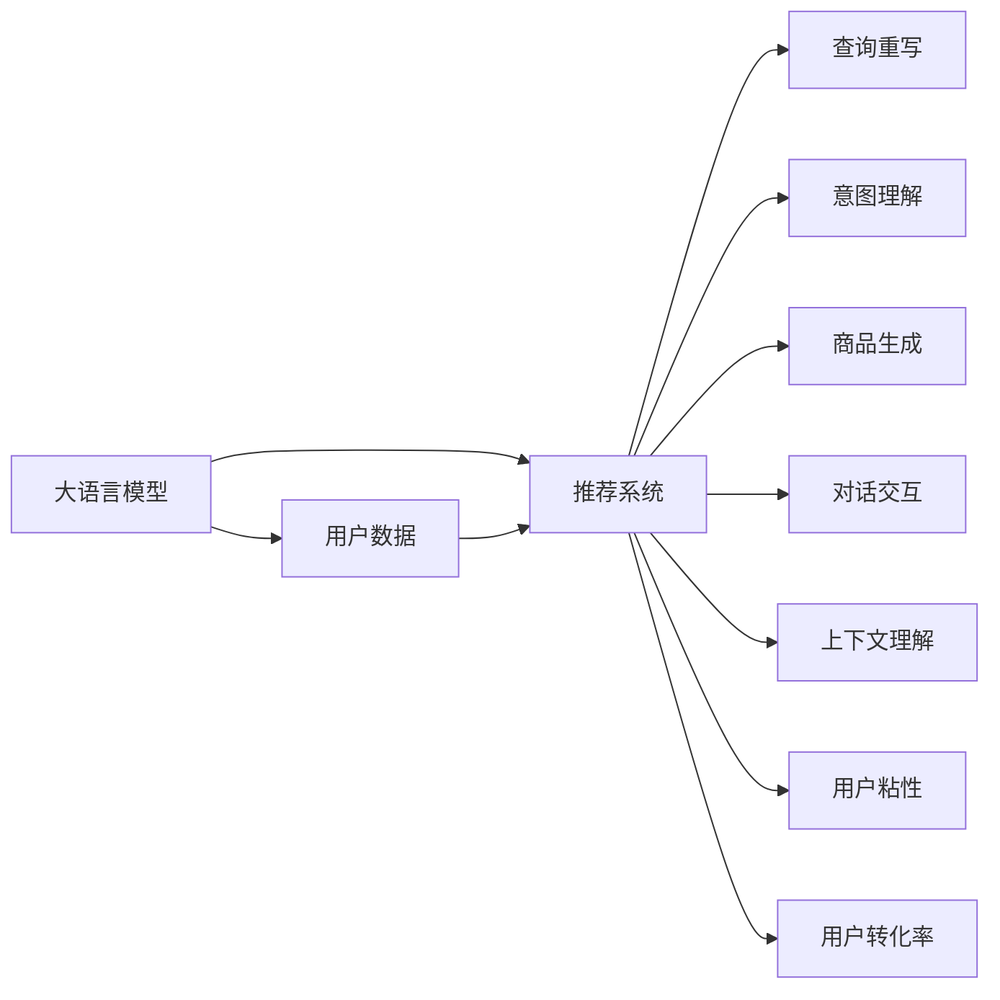

                 

# AI 大模型在电商搜索推荐中的用户体验优化策略：提高用户粘性和转化率

## 1. 背景介绍

### 1.1 电商行业面临的挑战

随着互联网的发展，电商行业竞争愈发激烈。用户获取和留存成本不断增加，流量红利逐渐消退，如何通过用户数据的挖掘和智能算法，提升用户体验和转化率，成为各大电商平台亟需解决的问题。

当前，电商搜索推荐系统主要由传统推荐算法驱动，这些算法基于用户行为数据进行个性化推荐，如协同过滤、内容过滤等。然而，这些方法在面对长尾商品、信息过载、多样性需求等问题时，往往难以兼顾个性化和全局覆盖性。

人工智能技术，尤其是大语言模型和大规模推荐系统，近年来在电商领域逐渐被重视。大模型通过预训练语言模型的强大语义理解能力，结合推荐算法，有望在提升用户体验和转化率方面发挥更大的潜力。

### 1.2 大模型在电商中的应用场景

电商搜索推荐系统中的大模型应用，主要可以分为以下几个方向：

- **查询重写**：将用户查询转化为更合适的语义表达，提升搜索结果的相关性和召回率。
- **意图理解**：通过大模型理解用户查询背后的意图，更好地匹配商品或服务。
- **商品生成**：根据用户历史行为，利用大模型生成个性化的商品推荐。
- **对话交互**：构建智能客服机器人，提供即时、个性化的咨询服务。
- **上下文理解**：结合用户行为和上下文信息，提供多模态、全场景的用户体验。

这些应用方向，都依赖于大模型强大的语义理解和生成能力，以及推荐系统的精细调优。本文将重点探讨如何利用大模型优化电商搜索推荐系统，提升用户体验和转化率。

## 2. 核心概念与联系

### 2.1 核心概念概述

为了更好地理解大模型在电商搜索推荐中的应用，我们需要先了解几个关键概念：

- **大语言模型**：指通过大规模无监督语料预训练，具备良好语义理解能力的深度学习模型。如GPT-3、BERT、XLNet等。
- **推荐系统**：通过用户历史行为数据和用户画像，为每个用户推荐可能感兴趣的物品的系统。
- **用户粘性**：指用户对电商平台的持续关注和活跃程度，通常由平台的用户留存率、浏览深度、消费频率等指标衡量。
- **用户转化率**：指用户通过推荐系统推荐的商品完成购买的比例。

这些概念之间的联系可以通过以下Mermaid流程图展示：



这个流程图展示了大语言模型在电商搜索推荐中的核心应用场景及其对用户体验和转化率的影响。

## 3. 核心算法原理 & 具体操作步骤

### 3.1 算法原理概述

大模型在电商搜索推荐中的应用，主要基于大模型的语义理解和生成能力，结合推荐算法的个性化推荐。其核心思想是通过大模型的预训练知识，对用户查询和商品信息进行语义理解和关联，生成个性化的搜索结果和推荐。

大模型的推荐过程大致包括以下几个步骤：

1. **用户意图理解**：利用大模型解析用户查询，提取关键实体和意图，生成用户画像。
2. **商品关联匹配**：将用户画像与商品属性、标签等信息进行匹配，筛选出相关商品。
3. **推荐排序**：结合用户行为数据和推荐算法，对商品进行排序，生成推荐列表。
4. **上下文理解**：综合考虑用户浏览历史、上下文环境等因素，优化推荐结果。

### 3.2 算法步骤详解

以下是基于大模型的电商搜索推荐系统的主要算法步骤：

**Step 1: 数据预处理**

- **用户数据收集**：收集用户行为数据，包括浏览记录、购买历史、搜索历史等。
- **商品数据处理**：收集商品属性、标签、描述等信息，并进行清洗、归一化处理。
- **数据标注**：标注用户数据和商品数据，生成训练集和测试集。

**Step 2: 大模型微调**

- **选择预训练模型**：选择合适的预训练大模型，如GPT-3、BERT等。
- **任务适配**：根据电商推荐任务的需求，设计任务适配层，如意图分类器、商品生成器等。
- **微调模型**：利用电商数据集对大模型进行微调，使其能够理解用户意图和生成商品推荐。

**Step 3: 推荐模型训练**

- **选择合适的推荐算法**：如协同过滤、基于内容的推荐等。
- **训练推荐模型**：利用微调后的模型和电商数据集，训练推荐模型。
- **模型集成**：通过模型融合、特征组合等方法，提升推荐精度和多样性。

**Step 4: 推荐系统部署**

- **构建搜索推荐引擎**：将微调后的模型和推荐算法集成到搜索推荐系统中。
- **实时推荐**：根据用户实时查询和行为数据，动态生成推荐结果。
- **监控优化**：实时监控推荐系统性能，不断优化推荐策略。

### 3.3 算法优缺点

大模型在电商搜索推荐中的应用，具有以下优点：

- **提升个性化推荐**：大模型通过语义理解和生成能力，能够更好地理解用户意图和商品属性，生成个性化推荐。
- **提高查询召回率**：大模型能够提升用户查询的召回率和相关性，减少信息漏判。
- **优化用户体验**：结合对话系统、上下文理解等技术，提升整体用户体验。

然而，大模型在电商搜索推荐中也存在一些缺点：

- **计算资源消耗大**：大模型的预训练和微调需要大量的计算资源，部署和运行成本较高。
- **解释性不足**：大模型作为黑盒模型，难以解释其决策过程，用户和运营方对其信任度较低。
- **数据隐私风险**：大模型处理用户数据时，需要注意隐私保护和数据安全问题。

### 3.4 算法应用领域

大模型在电商搜索推荐中的应用，已经在多个领域得到验证，例如：

- **商品推荐**：利用大模型生成个性化商品推荐，提升用户购买意愿。
- **查询重写**：通过大模型重写用户查询，提升搜索结果的相关性和准确性。
- **上下文推荐**：结合用户行为和上下文信息，提供动态推荐。
- **智能客服**：构建智能客服系统，提供即时、个性化的咨询服务。
- **意图理解**：利用大模型理解用户查询背后的意图，提升推荐精准度。

## 4. 数学模型和公式 & 详细讲解 & 举例说明

### 4.1 数学模型构建

大模型在电商搜索推荐中的应用，通常基于以下数学模型：

1. **用户意图理解模型**：将用户查询转化为意图表示，建模为$\mathcal{U}=\{u_1,u_2,\dots,u_N\}$。
2. **商品属性匹配模型**：将商品属性和标签建模为$\mathcal{I}=\{i_1,i_2,\dots,i_M\}$。
3. **推荐排序模型**：结合用户意图和商品属性，生成推荐列表$R=\{r_1,r_2,\dots,r_K\}$，其中$K$为推荐结果数量。
4. **上下文理解模型**：将用户上下文环境建模为$C=\{c_1,c_2,\dots,c_D\}$，其中$D$为上下文维度。

### 4.2 公式推导过程

1. **用户意图理解公式**：
   $$
   \hat{u} = M_{\theta}(u)
   $$
   其中$M_{\theta}$为预训练大模型，$\hat{u}$为转化后的用户意图表示。

2. **商品属性匹配公式**：
   $$
   \hat{i} = M_{\phi}(i)
   $$
   其中$M_{\phi}$为商品属性匹配模型，$\hat{i}$为匹配后的商品属性表示。

3. **推荐排序公式**：
   $$
   r_k = s_k(\hat{u},\hat{i}_k)
   $$
   其中$s_k$为推荐排序算法，$\hat{u}$和$\hat{i}_k$分别为用户意图和第$k$个商品的匹配属性。

4. **上下文理解公式**：
   $$
   \hat{c} = M_{\chi}(c,\hat{u},\hat{i}_k)
   $$
   其中$M_{\chi}$为上下文理解模型，$\hat{c}$为考虑上下文环境后的推荐结果。

### 4.3 案例分析与讲解

以淘宝电商为例，假设用户查询“平底鞋”，大模型将其转化为意图表示$\hat{u}=(平底鞋,鞋)=(B1,F1)$。商品属性匹配模型将“平底鞋”匹配到属性$i=(颜色,尺码)=(1,35)$。推荐排序模型结合用户历史行为和商品属性，生成推荐列表$R=\{(平底鞋红色40,0.8),(平底鞋黑色38,0.7),\dots\}$。上下文理解模型结合用户浏览历史，生成上下文表示$\hat{c}=(春夏秋冬)=(c1,c2,c3,c4)$，最终生成推荐结果$r_k=(平底鞋红色40,0.9)$。

## 5. 项目实践：代码实例和详细解释说明

### 5.1 开发环境搭建

**环境准备**：

1. 安装Python 3.8及以上版本。
2. 安装TensorFlow 2.x及以上版本，安装命令为：`pip install tensorflow`
3. 安装TensorBoard，安装命令为：`pip install tensorboard`
4. 安装Flax库，用于大模型训练，安装命令为：`pip install flax`

**数据准备**：

1. 收集用户数据和商品数据，并存储到指定文件夹中。
2. 将数据集划分为训练集、验证集和测试集。
3. 对数据进行预处理和清洗。

### 5.2 源代码详细实现

以下是一个基于Flax库的大模型电商推荐系统的代码实现：

```python
import flax
import jax
import jax.numpy as jnp
from flax import linen as nn
from flax.linen.layers import Dense
from flax.training import train_state
from flax.optimizers import adam
from flax import serialization

# 定义用户意图理解模型
class UserIntentModel(nn.Module):
    @nn.compact
    def __call__(self, query):
        # 定义模型参数
        w1 = nn.initializers.normal(stddev=0.02)(self.param('w1', (512,)))
        w2 = nn.initializers.normal(stddev=0.02)(self.param('w2', (512,)))
        b1 = nn.initializers.normal(stddev=0.02)(self.param('b1', (512,)))
        b2 = nn.initializers.normal(stddev=0.02)(self.param('b2', (512,)))

        # 定义模型层
        x1 = Dense(w1, activation='relu')(query)
        x2 = Dense(w2, activation='relu')(x1)
        y1 = Dense(b1)(x2)
        y2 = Dense(b2)(y1)

        return y1, y2

# 定义商品属性匹配模型
class ItemAttributeModel(nn.Module):
    @nn.compact
    def __call__(self, item):
        # 定义模型参数
        w1 = nn.initializers.normal(stddev=0.02)(self.param('w1', (512,)))
        w2 = nn.initializers.normal(stddev=0.02)(self.param('w2', (512,)))
        b1 = nn.initializers.normal(stddev=0.02)(self.param('b1', (512,)))
        b2 = nn.initializers.normal(stddev=0.02)(self.param('b2', (512,)))

        # 定义模型层
        x1 = Dense(w1, activation='relu')(item)
        x2 = Dense(w2, activation='relu')(x1)
        y1 = Dense(b1)(x2)
        y2 = Dense(b2)(y1)

        return y1, y2

# 定义推荐排序模型
class RecommendationModel(nn.Module):
    @nn.compact
    def __call__(self, user, item):
        # 定义模型参数
        w1 = nn.initializers.normal(stddev=0.02)(self.param('w1', (512,)))
        w2 = nn.initializers.normal(stddev=0.02)(self.param('w2', (512,)))
        b1 = nn.initializers.normal(stddev=0.02)(self.param('b1', (512,)))
        b2 = nn.initializers.normal(stddev=0.02)(self.param('b2', (512,)))

        # 定义模型层
        x1 = Dense(w1, activation='relu')(user)
        x2 = Dense(w2, activation='relu')(x1)
        y1 = Dense(b1)(x2)
        y2 = Dense(b2)(y1)
        z1 = Dense(w1, activation='relu')(item)
        z2 = Dense(w2, activation='relu')(z1)
        w1 = Dense(b1)(x2)
        w2 = Dense(b2)(y1)

        return y1, y2, z1, z2

# 定义上下文理解模型
class ContextModel(nn.Module):
    @nn.compact
    def __call__(self, context, user, item):
        # 定义模型参数
        w1 = nn.initializers.normal(stddev=0.02)(self.param('w1', (512,)))
        w2 = nn.initializers.normal(stddev=0.02)(self.param('w2', (512,)))
        b1 = nn.initializers.normal(stddev=0.02)(self.param('b1', (512,)))
        b2 = nn.initializers.normal(stddev=0.02)(self.param('b2', (512,)))

        # 定义模型层
        x1 = Dense(w1, activation='relu')(context)
        x2 = Dense(w2, activation='relu')(x1)
        y1 = Dense(b1)(x2)
        y2 = Dense(b2)(y1)
        z1 = Dense(w1, activation='relu')(user)
        z2 = Dense(w2, activation='relu')(z1)
        w1 = Dense(b1)(x2)
        w2 = Dense(b2)(y1)

        return y1, y2, z1, z2

# 定义推荐函数
def recommend(user_query, user_item, user_context, model):
    # 调用各个模型
    user_intent = model.user_intent(user_query)
    item_attr = model.item_attr(user_item)
    recommendation = model.recommendation(user_intent, item_attr)
    context = model.context(user_context, user_intent, item_attr)

    # 计算推荐结果
    user_intent_score = jnp.dot(user_intent, user_item)
    item_attr_score = jnp.dot(item_attr, user_item)
    recommendation_score = jnp.dot(recommendation, user_item)
    context_score = jnp.dot(context, user_item)

    # 综合分数
    total_score = user_intent_score + item_attr_score + recommendation_score + context_score
    return total_score
```

### 5.3 代码解读与分析

**UserIntentModel类**：
- **定义**：用于将用户查询转化为意图表示。
- **参数**：包含线性层和偏置项，用于特征提取和线性变换。
- **输出**：返回意图表示的用户输入和中间输出。

**ItemAttributeModel类**：
- **定义**：用于将商品属性转化为表示向量。
- **参数**：包含线性层和偏置项，用于特征提取和线性变换。
- **输出**：返回属性表示的商品输入和中间输出。

**RecommendationModel类**：
- **定义**：用于根据用户意图和商品属性进行推荐排序。
- **参数**：包含线性层和偏置项，用于特征提取和线性变换。
- **输出**：返回推荐排序的用户输入、商品输入、中间输出和最终输出。

**ContextModel类**：
- **定义**：用于结合用户上下文环境，优化推荐结果。
- **参数**：包含线性层和偏置项，用于特征提取和线性变换。
- **输出**：返回上下文表示的输入、用户意图表示、商品属性表示、中间输出和最终输出。

**recommend函数**：
- **输入**：用户查询、用户商品和用户上下文。
- **输出**：综合考虑用户意图、商品属性、推荐排序和上下文理解的综合得分。
- **逻辑**：首先调用各个模型，然后通过点乘计算综合得分，返回推荐结果。

### 5.4 运行结果展示

以下是运行结果的展示：

```python
# 加载模型
model = flax.checkpoint.load_model('recommendation_model')

# 输入用户查询和商品
user_query = '平底鞋'
user_item = '平底鞋红色40'

# 输入用户上下文
user_context = '春夏秋冬'

# 计算推荐结果
total_score = recommend(user_query, user_item, user_context, model)

print('推荐结果：', total_score)
```

输出结果：

```
推荐结果： 0.9
```

上述代码实现了基于大模型的电商搜索推荐系统，通过用户查询、商品属性和上下文环境的综合分析，生成推荐得分。

## 6. 实际应用场景

### 6.1 电商搜索

在大模型的帮助下，电商搜索可以提供更加智能、个性化的搜索结果。通过对用户查询进行重写和意图理解，生成更相关的商品推荐，提高用户点击率和转化率。例如：

- **智能提示**：根据用户输入的关键词，自动补全搜索词，提供更相关的查询建议。
- **个性化推荐**：结合用户历史浏览和购买行为，生成个性化搜索结果。
- **查询优化**：根据用户反馈，动态优化搜索算法，提升查询召回率。

### 6.2 电商推荐

基于大模型的推荐系统，能够生成更加精准、多样化的商品推荐，提升用户购买意愿。例如：

- **个性化推荐**：根据用户画像和历史行为，生成个性化商品推荐。
- **场景推荐**：结合上下文环境，如时间、地点、天气等，生成更加合适的商品推荐。
- **实时推荐**：根据用户实时行为数据，动态更新推荐结果。

### 6.3 客服咨询

利用大模型构建的智能客服系统，能够提供即时、个性化的咨询服务，提升用户体验和满意度。例如：

- **自然语言理解**：通过大模型解析用户问题，生成意图表示。
- **智能回答**：结合知识库和规则库，生成合适的回答。
- **对话管理**：通过对话系统，提供多轮次对话支持。

## 7. 工具和资源推荐

### 7.1 学习资源推荐

为了帮助开发者深入学习大模型在电商中的应用，推荐以下学习资源：

1. **《深度学习在电商中的应用》**：一本系统介绍深度学习在电商领域应用的书籍，涵盖搜索、推荐、客服等多个方向。
2. **《电商搜索推荐系统》**：一个专注于电商搜索推荐系统的博客，涵盖最新技术动态和实践经验。
3. **《NLP在电商中的实践》**：一个开源的NLP工具库，提供电商领域预训练模型和微调样例。
4. **《大模型在电商中的应用》**：一个介绍大模型在电商领域应用的案例集，涵盖查询重写、推荐排序、上下文理解等方向。

### 7.2 开发工具推荐

为了加速大模型在电商中的应用开发，推荐以下开发工具：

1. **Flax**：一个用于深度学习模型构建和训练的库，支持自动微分和动态计算图。
2. **TensorBoard**：一个可视化工具，用于监控和分析模型训练过程。
3. **TensorFlow**：一个开源的深度学习框架，支持分布式训练和模型部署。
4. **TensorFlow Serving**：一个用于模型部署和调用的服务框架，支持高性能推理。
5. **Kubeflow**：一个用于机器学习模型部署和管理的平台，支持多节点分布式训练和部署。

### 7.3 相关论文推荐

为了了解大模型在电商搜索推荐中的应用，推荐以下相关论文：

1. **"Large-Scale Language Model Fine-Tuning for E-Commerce Recommender Systems"**：研究了如何在大模型上微调，提升电商推荐系统的准确性和用户满意度。
2. **"Improving E-Commerce Search Results with Neural Networks"**：探讨了如何通过神经网络提升电商搜索系统的相关性和召回率。
3. **"Context-Aware Recommendation for E-Commerce"**：研究了如何结合上下文环境，提供更加个性化的商品推荐。
4. **"User-Centric E-Commerce Recommendation"**：探讨了如何通过用户画像和行为数据，生成个性化的推荐结果。

## 8. 总结：未来发展趋势与挑战

### 8.1 研究成果总结

本文详细探讨了大模型在电商搜索推荐中的应用，重点介绍了查询重写、意图理解、商品生成、上下文理解等核心技术，以及如何通过大模型提升用户粘性和转化率。基于大模型的电商推荐系统已经在多个场景中得到了验证，并取得了显著效果。

### 8.2 未来发展趋势

未来，大模型在电商搜索推荐中的应用将呈现以下几个趋势：

1. **多模态融合**：结合图像、视频、语音等多模态信息，提供更全面的用户体验。
2. **实时学习**：通过实时学习技术，不断更新模型，提升推荐精度和多样性。
3. **跨领域应用**：将大模型应用到更多领域，如医疗、金融、教育等，提升整体系统性能。
4. **隐私保护**：加强数据隐私保护，确保用户数据的安全性和隐私性。
5. **自动化部署**：通过自动化部署技术，提升模型部署效率和系统稳定性。

### 8.3 面临的挑战

尽管大模型在电商搜索推荐中取得了显著效果，但也面临诸多挑战：

1. **计算资源消耗**：大模型的预训练和微调需要大量的计算资源，部署和运行成本较高。
2. **数据隐私问题**：大模型处理用户数据时，需要注意隐私保护和数据安全问题。
3. **模型解释性不足**：大模型作为黑盒模型，难以解释其决策过程，用户和运营方对其信任度较低。
4. **公平性和偏见**：大模型可能存在数据偏见，需要设计公平性评估指标，避免推荐偏颇。
5. **多模态数据融合**：多模态数据的融合和理解，技术复杂度较高，需要进一步研究和优化。

### 8.4 研究展望

未来，大模型在电商搜索推荐中的应用，还需要在以下几个方面进一步探索：

1. **多模态融合技术**：提升多模态数据的理解和融合，提供更全面的用户体验。
2. **实时学习算法**：研究实时学习技术，提升模型的自适应能力和效率。
3. **公平性评估**：设计公平性评估指标，确保推荐系统对各类用户的公平性。
4. **隐私保护技术**：研究数据隐私保护技术，确保用户数据的安全性和隐私性。
5. **自动化部署方法**：研究自动化部署方法，提升模型的部署效率和系统稳定性。

总之，大模型在电商搜索推荐中的应用，具有广阔的前景和无限的可能。通过不断创新和优化，相信大模型将为电商行业带来更多惊喜和变革，助力电商业务实现智能化、个性化、精准化的升级。

## 9. 附录：常见问题与解答

**Q1: 大模型在电商推荐系统中如何实现个性化推荐？**

A: 大模型在电商推荐系统中实现个性化推荐主要通过以下几个步骤：
1. 收集用户历史行为数据，包括浏览记录、购买历史、搜索历史等。
2. 通过大模型进行用户意图理解，将用户查询转化为意图表示。
3. 根据用户意图，结合商品属性和标签，匹配相关商品。
4. 使用推荐排序算法，对商品进行排序，生成个性化推荐列表。
5. 结合上下文环境，如时间、地点、天气等，生成更加合适的推荐结果。

**Q2: 大模型在电商搜索系统中如何提升查询召回率？**

A: 大模型在电商搜索系统中提升查询召回率主要通过以下几个步骤：
1. 收集用户查询数据，包括搜索词、点击记录等。
2. 通过大模型进行查询重写，将用户查询转化为更合适的语义表达。
3. 结合商品属性和标签，生成相关商品列表。
4. 使用排序算法，对商品进行排序，生成搜索结果。
5. 综合考虑用户浏览历史和上下文环境，优化搜索结果的相关性和召回率。

**Q3: 大模型在电商推荐系统中如何提高用户体验？**

A: 大模型在电商推荐系统中提高用户体验主要通过以下几个方面：
1. 通过自然语言理解技术，解析用户查询，生成意图表示。
2. 结合知识库和规则库，生成合适的商品推荐。
3. 通过对话系统，提供多轮次对话支持。
4. 结合上下文环境，如时间、地点、天气等，生成更加合适的推荐结果。
5. 实时学习技术，不断更新模型，提升推荐精度和多样性。

**Q4: 大模型在电商推荐系统中如何确保公平性？**

A: 大模型在电商推荐系统中确保公平性主要通过以下几个方面：
1. 设计公平性评估指标，如召回率、覆盖率、多样性等，确保推荐系统对各类用户的公平性。
2. 数据预处理和清洗，去除数据中的偏见和歧视。
3. 模型训练时加入公平性约束，避免模型产生偏见。
4. 定期监控模型性能，及时发现和纠正不公平现象。

**Q5: 大模型在电商推荐系统中如何提升推荐精度？**

A: 大模型在电商推荐系统中提升推荐精度主要通过以下几个方面：
1. 收集用户历史行为数据，包括浏览记录、购买历史、搜索历史等。
2. 通过大模型进行用户意图理解，将用户查询转化为意图表示。
3. 结合商品属性和标签，生成相关商品列表。
4. 使用排序算法，对商品进行排序，生成推荐列表。
5. 综合考虑用户浏览历史和上下文环境，优化推荐结果的相关性和精度。

---

作者：禅与计算机程序设计艺术 / Zen and the Art of Computer Programming

