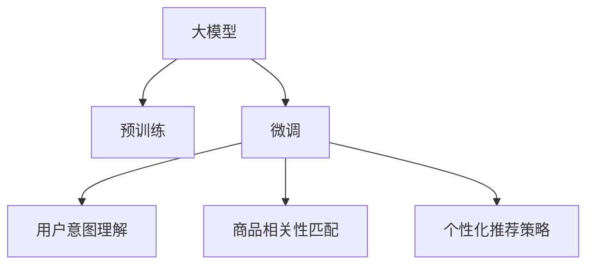

                 

## 1. 背景介绍

### 1.1 问题由来
随着电商平台的迅速发展，用户体验(UX)在平台运营中扮演着越来越重要的角色。而搜索推荐系统作为用户触达商品的重要入口，其质量直接影响着用户的购买决策和平台满意度。然而，当前搜索推荐系统往往过于依赖传统的协同过滤算法，无法充分挖掘用户的个性化需求，无法准确预测用户的购买意愿。

为了解决这一问题，AI大模型通过在大规模无标签数据上进行预训练，学习了丰富的语言知识和用户行为模式。基于这种强大表征能力，通过微调可以将大模型的能力聚焦到电商搜索推荐这一特定场景，从而提升推荐系统的用户体验。

### 1.2 问题核心关键点
本节将详细介绍大模型在电商搜索推荐中的应用策略，重点关注以用户需求为中心的三个核心方面：

- **用户意图理解**：通过大模型学习用户搜索和点击数据，理解用户的购买意图。
- **商品相关性匹配**：将用户的购买意图映射到商品属性和历史行为，提升推荐的相关性。
- **个性化推荐策略**：结合用户行为和商品属性，通过大模型生成个性化推荐结果。

### 1.3 问题研究意义
采用大模型微调技术，能够显著提升电商搜索推荐的个性化水平，提升用户体验和转化率。具体而言，大模型微调可以带来以下优势：

- **快速学习和适应**：大模型可以迅速从海量的历史数据中学习，捕捉用户的长期偏好，适应不同的用户需求。
- **鲁棒性和泛化能力**：大模型的鲁棒性更强，能够应对不同的数据分布和用户行为变化，提升推荐系统的稳定性和可靠性。
- **自然语言处理能力**：大模型能够更好地理解自然语言，处理用户输入和商品描述，生成更自然、更具吸引力的推荐结果。
- **可解释性和透明度**：大模型的输出可以通过提示学习等方法，实现少样本学习和零样本学习，增强推荐的可解释性，增加用户的信任和满意度。

本文将详细阐述大模型在电商搜索推荐中的应用，并结合最新的研究成果，提供有价值的实践经验和技术指导。

## 2. 核心概念与联系

### 2.1 核心概念概述

为更好地理解大模型在电商搜索推荐中的应用策略，本节将介绍几个密切相关的核心概念：

- **大模型(Large Model)**：指通过在大规模无标签数据上进行预训练，学习丰富的语言知识和用户行为模式的深度学习模型，如GPT、BERT等。
- **微调(Fine-Tuning)**：指在大模型的基础上，使用特定场景的标注数据进行有监督学习，优化模型在特定任务上的性能。
- **用户意图理解**：指通过大模型理解用户的搜索意图，准确预测用户的购买意愿。
- **商品相关性匹配**：指将用户的购买意图映射到商品属性和历史行为，提高推荐的准确性。
- **个性化推荐策略**：指结合用户行为和商品属性，通过大模型生成个性化推荐结果。

这些核心概念之间的逻辑关系可以通过以下Mermaid流程图来展示：



这个流程图展示了大模型在电商搜索推荐中的应用策略：

1. 大模型通过预训练获得基础能力。
2. 微调使大模型聚焦于电商搜索推荐场景，提升特定任务性能。
3. 用户意图理解将用户的搜索和点击数据转化为购买意愿，提高推荐的准确性。
4. 商品相关性匹配通过分析用户行为和商品属性，将意图映射到相关商品。
5. 个性化推荐策略生成具有针对性的个性化推荐结果。

这些概念共同构成了大模型在电商搜索推荐中的应用框架，使其能够更好地满足用户需求，提升推荐系统的用户体验。

## 3. 核心算法原理 & 具体操作步骤
### 3.1 算法原理概述

大模型在电商搜索推荐中的应用，本质上是利用大模型的表征能力和微调技术，针对用户需求进行深度学习优化。具体而言，通过以下三个步骤，将大模型应用于电商搜索推荐：

1. **用户意图理解**：使用大模型学习用户搜索和点击数据，理解用户的购买意图。
2. **商品相关性匹配**：将用户的购买意图映射到商品属性和历史行为，提升推荐的相关性。
3. **个性化推荐策略**：结合用户行为和商品属性，通过大模型生成个性化推荐结果。

### 3.2 算法步骤详解

#### 3.2.1 用户意图理解

用户意图理解的算法步骤如下：

1. **数据收集**：收集用户的搜索记录和点击行为数据，作为微调模型的输入。
2. **特征提取**：使用大模型提取用户搜索和点击数据的语义特征，得到用户意图的文本表示。
3. **意图分类**：使用分类器将用户的意图文本表示分类为具体的购买意愿，如购买商品、了解商品等。

#### 3.2.2 商品相关性匹配

商品相关性匹配的算法步骤如下：

1. **商品数据准备**：收集商品的详细属性信息，如品牌、型号、价格等。
2. **历史行为分析**：分析用户的历史购买记录和浏览行为，提取用户对不同商品的属性偏好。
3. **相关性计算**：使用大模型计算用户意图和商品属性之间的相关性得分，将用户意图映射到相关商品。

#### 3.2.3 个性化推荐策略

个性化推荐策略的算法步骤如下：

1. **用户行为分析**：收集用户的浏览历史、购买历史和搜索历史，提取用户的长期偏好。
2. **商品匹配策略**：根据用户行为和商品属性，通过大模型生成推荐结果。
3. **多策略融合**：综合不同推荐策略的结果，生成最终的个性化推荐列表。

### 3.3 算法优缺点

大模型在电商搜索推荐中的应用策略，具有以下优点：

1. **高效性**：大模型的预训练和微调过程，可以高效地从大规模数据中学习，捕捉用户的长期偏好和行为模式。
2. **准确性**：大模型的表征能力更强，能够更准确地理解用户的意图，匹配相关商品。
3. **可扩展性**：大模型的架构设计灵活，可以方便地集成到电商平台的推荐系统中，适应不同的业务需求。
4. **可解释性**：通过提示学习等技术，大模型能够提供推荐结果的解释，增强用户的信任感。

同时，该方法也存在一定的局限性：

1. **数据隐私问题**：收集和分析用户的搜索和点击数据，可能涉及用户的隐私问题，需要严格遵守数据保护法律法规。
2. **计算资源需求高**：大模型的训练和微调需要大量的计算资源，对硬件和网络条件要求较高。
3. **模型解释性不足**：大模型的黑盒特性，可能难以解释其内部工作机制，需要进一步研究模型可解释性。

尽管存在这些局限性，但就目前而言，大模型微调方法仍是在电商搜索推荐领域最为先进的技术之一。未来相关研究的重点在于如何进一步优化模型性能，降低计算资源需求，增强模型的可解释性，同时保障用户的隐私权益。

### 3.4 算法应用领域

大模型在电商搜索推荐中的应用，已经在各大电商平台上得到了广泛的应用，覆盖了多个业务场景，例如：

- **商品搜索推荐**：在用户输入搜索词时，结合用户的浏览记录，实时生成个性化的搜索结果。
- **个性化广告推荐**：根据用户的浏览和点击行为，向用户推荐相应的广告内容。
- **跨品类推荐**：分析用户在不同品类之间的关联性，跨品类推荐相关商品。
- **新品推荐**：通过分析用户的浏览和购买行为，推荐新品或限量商品。
- **动态促销推荐**：结合用户历史行为和实时数据，动态推荐促销活动和优惠券。

除了上述这些经典场景外，大模型微调技术还在广告投放、内容推荐、智能客服等多个领域得到应用，为电商平台的业务发展提供了新的动力。

## 4. 数学模型和公式 & 详细讲解 & 举例说明

### 4.1 数学模型构建

大模型在电商搜索推荐中的应用，可以通过以下几个数学模型来描述：

1. **用户意图表示模型**：
   $$
   u_i = \mathbf{U}^T\mathbf{x}_i
   $$
   其中，$\mathbf{U}$ 是用户意图表示矩阵，$\mathbf{x}_i$ 是用户第 $i$ 次搜索的特征向量。

2. **商品相关性评分模型**：
   $$
   s_{i,j} = \mathbf{V}^T\mathbf{W}(u_i, r_j)
   $$
   其中，$\mathbf{V}$ 是商品相关性评分矩阵，$\mathbf{W}$ 是相关性评分函数，$r_j$ 是商品 $j$ 的属性向量。

3. **个性化推荐评分模型**：
   $$
   p_{i,j} = \mathbf{W}(\mathbf{U}, \mathbf{V}, r_j)
   $$
   其中，$\mathbf{W}$ 是个性化推荐评分函数，结合用户意图表示和商品属性向量，生成推荐评分。

### 4.2 公式推导过程

#### 4.2.1 用户意图表示模型

用户意图表示模型通过大模型提取用户搜索和点击数据的语义特征，得到用户意图的文本表示。

假设用户第 $i$ 次搜索的特征向量为 $\mathbf{x}_i$，通过大模型提取得到用户意图表示 $\mathbf{u}_i$。具体推导过程如下：

1. **预训练**：使用大模型对大规模无标签数据进行预训练，得到预训练权重 $\mathbf{W}_{pre}$。
2. **微调**：在大模型预训练权重的基础上，使用标注数据进行微调，得到微调权重 $\mathbf{W}_{fin}$。
3. **特征提取**：使用微调权重 $\mathbf{W}_{fin}$ 提取用户搜索和点击数据的语义特征，得到用户意图表示 $\mathbf{u}_i$。

#### 4.2.2 商品相关性评分模型

商品相关性评分模型通过大模型计算用户意图和商品属性之间的相关性得分，将用户意图映射到相关商品。

假设商品 $j$ 的属性向量为 $\mathbf{r}_j$，通过大模型提取得到商品相关性评分 $\mathbf{s}_{i,j}$。具体推导过程如下：

1. **预训练**：使用大模型对大规模无标签数据进行预训练，得到预训练权重 $\mathbf{W}_{pre}$。
2. **微调**：在大模型预训练权重的基础上，使用标注数据进行微调，得到微调权重 $\mathbf{W}_{fin}$。
3. **特征提取**：使用微调权重 $\mathbf{W}_{fin}$ 提取用户意图表示 $\mathbf{u}_i$ 和商品属性向量 $\mathbf{r}_j$ 的语义特征，得到商品相关性评分 $\mathbf{s}_{i,j}$。

#### 4.2.3 个性化推荐评分模型

个性化推荐评分模型通过大模型结合用户行为和商品属性，生成推荐评分。

假设用户行为向量为 $\mathbf{b}_i$，商品属性向量为 $\mathbf{r}_j$，通过大模型生成个性化推荐评分 $p_{i,j}$。具体推导过程如下：

1. **预训练**：使用大模型对大规模无标签数据进行预训练，得到预训练权重 $\mathbf{W}_{pre}$。
2. **微调**：在大模型预训练权重的基础上，使用标注数据进行微调，得到微调权重 $\mathbf{W}_{fin}$。
3. **特征提取**：使用微调权重 $\mathbf{W}_{fin}$ 提取用户行为向量 $\mathbf{b}_i$ 和商品属性向量 $\mathbf{r}_j$ 的语义特征，得到个性化推荐评分 $p_{i,j}$。

### 4.3 案例分析与讲解

#### 案例1：商品搜索推荐

假设用户输入了“电脑”作为搜索词，电商平台使用大模型进行推荐。

1. **数据收集**：收集用户搜索记录“电脑”和点击行为数据，作为微调模型的输入。
2. **特征提取**：使用大模型提取用户搜索和点击数据的语义特征，得到用户意图表示 $\mathbf{u}_i$。
3. **意图分类**：使用分类器将用户意图表示 $\mathbf{u}_i$ 分类为“购买电脑”。
4. **商品相关性匹配**：使用大模型计算用户意图表示 $\mathbf{u}_i$ 和商品属性向量 $\mathbf{r}_j$ 之间的相关性得分，将用户意图映射到相关商品。
5. **个性化推荐策略**：结合用户行为和商品属性，通过大模型生成个性化推荐列表，推荐电脑相关的商品，如“联想笔记本电脑”、“戴尔笔记本电脑”等。

#### 案例2：个性化广告推荐

假设用户浏览了“手机”页面，电商平台使用大模型进行广告推荐。

1. **数据收集**：收集用户浏览记录“手机”和点击行为数据，作为微调模型的输入。
2. **特征提取**：使用大模型提取用户浏览和点击数据的语义特征，得到用户意图表示 $\mathbf{u}_i$。
3. **意图分类**：使用分类器将用户意图表示 $\mathbf{u}_i$ 分类为“了解手机”。
4. **商品相关性匹配**：使用大模型计算用户意图表示 $\mathbf{u}_i$ 和广告商品属性向量 $\mathbf{r}_j$ 之间的相关性得分，将用户意图映射到相关广告商品。
5. **个性化推荐策略**：结合用户行为和广告商品属性，通过大模型生成个性化广告推荐列表，推荐“小米手机”、“华为手机”等手机广告。

## 5. 项目实践：代码实例和详细解释说明
### 5.1 开发环境搭建

在进行大模型微调实践前，我们需要准备好开发环境。以下是使用Python进行PyTorch开发的环境配置流程：

1. 安装Anaconda：从官网下载并安装Anaconda，用于创建独立的Python环境。

2. 创建并激活虚拟环境：
```bash
conda create -n pytorch-env python=3.8 
conda activate pytorch-env
```

3. 安装PyTorch：根据CUDA版本，从官网获取对应的安装命令。例如：
```bash
conda install pytorch torchvision torchaudio cudatoolkit=11.1 -c pytorch -c conda-forge
```

4. 安装Transformers库：
```bash
pip install transformers
```

5. 安装各类工具包：
```bash
pip install numpy pandas scikit-learn matplotlib tqdm jupyter notebook ipython
```

完成上述步骤后，即可在`pytorch-env`环境中开始微调实践。

### 5.2 源代码详细实现

下面我们以商品搜索推荐任务为例，给出使用Transformers库对BERT模型进行微调的PyTorch代码实现。

首先，定义商品搜索推荐的数据处理函数：

```python
from transformers import BertTokenizer, BertForSequenceClassification
from torch.utils.data import Dataset, DataLoader
import torch

class ProductRecommendationDataset(Dataset):
    def __init__(self, texts, labels, tokenizer, max_len=128):
        self.texts = texts
        self.labels = labels
        self.tokenizer = tokenizer
        self.max_len = max_len
        
    def __len__(self):
        return len(self.texts)
    
    def __getitem__(self, item):
        text = self.texts[item]
        label = self.labels[item]
        
        encoding = self.tokenizer(text, return_tensors='pt', max_length=self.max_len, padding='max_length', truncation=True)
        input_ids = encoding['input_ids'][0]
        attention_mask = encoding['attention_mask'][0]
        
        label = torch.tensor(label, dtype=torch.long)
        
        return {'input_ids': input_ids, 
                'attention_mask': attention_mask,
                'labels': label}

# 标签与id的映射
label2id = {'购买': 1, '了解': 0}
id2label = {v: k for k, v in label2id.items()}

# 创建dataset
tokenizer = BertTokenizer.from_pretrained('bert-base-cased')

train_dataset = ProductRecommendationDataset(train_texts, train_labels, tokenizer)
dev_dataset = ProductRecommendationDataset(dev_texts, dev_labels, tokenizer)
test_dataset = ProductRecommendationDataset(test_texts, test_labels, tokenizer)
```

然后，定义模型和优化器：

```python
from transformers import AdamW

model = BertForSequenceClassification.from_pretrained('bert-base-cased', num_labels=len(label2id))

optimizer = AdamW(model.parameters(), lr=2e-5)
```

接着，定义训练和评估函数：

```python
from tqdm import tqdm

device = torch.device('cuda') if torch.cuda.is_available() else torch.device('cpu')
model.to(device)

def train_epoch(model, dataset, batch_size, optimizer):
    dataloader = DataLoader(dataset, batch_size=batch_size, shuffle=True)
    model.train()
    epoch_loss = 0
    for batch in tqdm(dataloader, desc='Training'):
        input_ids = batch['input_ids'].to(device)
        attention_mask = batch['attention_mask'].to(device)
        labels = batch['labels'].to(device)
        model.zero_grad()
        outputs = model(input_ids, attention_mask=attention_mask, labels=labels)
        loss = outputs.loss
        epoch_loss += loss.item()
        loss.backward()
        optimizer.step()
    return epoch_loss / len(dataloader)

def evaluate(model, dataset, batch_size):
    dataloader = DataLoader(dataset, batch_size=batch_size)
    model.eval()
    preds, labels = [], []
    with torch.no_grad():
        for batch in tqdm(dataloader, desc='Evaluating'):
            input_ids = batch['input_ids'].to(device)
            attention_mask = batch['attention_mask'].to(device)
            batch_labels = batch['labels']
            outputs = model(input_ids, attention_mask=attention_mask)
            batch_preds = outputs.logits.argmax(dim=2).to('cpu').tolist()
            batch_labels = batch_labels.to('cpu').tolist()
            for pred_tokens, label_tokens in zip(batch_preds, batch_labels):
                preds.append(pred_tokens)
                labels.append(label_tokens)
                
    print(classification_report(labels, preds))
```

最后，启动训练流程并在测试集上评估：

```python
epochs = 5
batch_size = 16

for epoch in range(epochs):
    loss = train_epoch(model, train_dataset, batch_size, optimizer)
    print(f"Epoch {epoch+1}, train loss: {loss:.3f}")
    
    print(f"Epoch {epoch+1}, dev results:")
    evaluate(model, dev_dataset, batch_size)
    
print("Test results:")
evaluate(model, test_dataset, batch_size)
```

以上就是使用PyTorch对BERT进行商品搜索推荐任务微调的完整代码实现。可以看到，得益于Transformers库的强大封装，我们可以用相对简洁的代码完成BERT模型的加载和微调。

### 5.3 代码解读与分析

让我们再详细解读一下关键代码的实现细节：

**ProductRecommendationDataset类**：
- `__init__`方法：初始化文本、标签、分词器等关键组件。
- `__len__`方法：返回数据集的样本数量。
- `__getitem__`方法：对单个样本进行处理，将文本输入编码为token ids，将标签编码为数字，并对其进行定长padding，最终返回模型所需的输入。

**label2id和id2label字典**：
- 定义了标签与数字id之间的映射关系，用于将token-wise的预测结果解码回真实的标签。

**训练和评估函数**：
- 使用PyTorch的DataLoader对数据集进行批次化加载，供模型训练和推理使用。
- 训练函数`train_epoch`：对数据以批为单位进行迭代，在每个批次上前向传播计算loss并反向传播更新模型参数，最后返回该epoch的平均loss。
- 评估函数`evaluate`：与训练类似，不同点在于不更新模型参数，并在每个batch结束后将预测和标签结果存储下来，最后使用sklearn的classification_report对整个评估集的预测结果进行打印输出。

**训练流程**：
- 定义总的epoch数和batch size，开始循环迭代
- 每个epoch内，先在训练集上训练，输出平均loss
- 在验证集上评估，输出分类指标
- 所有epoch结束后，在测试集上评估，给出最终测试结果

可以看到，PyTorch配合Transformers库使得BERT微调的代码实现变得简洁高效。开发者可以将更多精力放在数据处理、模型改进等高层逻辑上，而不必过多关注底层的实现细节。

当然，工业级的系统实现还需考虑更多因素，如模型的保存和部署、超参数的自动搜索、更灵活的任务适配层等。但核心的微调范式基本与此类似。

## 6. 实际应用场景
### 6.1 智能客服系统

基于大模型微调的对话技术，可以广泛应用于智能客服系统的构建。传统客服往往需要配备大量人力，高峰期响应缓慢，且一致性和专业性难以保证。而使用微调后的对话模型，可以7x24小时不间断服务，快速响应客户咨询，用自然流畅的语言解答各类常见问题。

在技术实现上，可以收集企业内部的历史客服对话记录，将问题和最佳答复构建成监督数据，在此基础上对预训练对话模型进行微调。微调后的对话模型能够自动理解用户意图，匹配最合适的答案模板进行回复。对于客户提出的新问题，还可以接入检索系统实时搜索相关内容，动态组织生成回答。如此构建的智能客服系统，能大幅提升客户咨询体验和问题解决效率。

### 6.2 金融舆情监测

金融机构需要实时监测市场舆论动向，以便及时应对负面信息传播，规避金融风险。传统的人工监测方式成本高、效率低，难以应对网络时代海量信息爆发的挑战。基于大语言模型微调的文本分类和情感分析技术，为金融舆情监测提供了新的解决方案。

具体而言，可以收集金融领域相关的新闻、报道、评论等文本数据，并对其进行主题标注和情感标注。在此基础上对预训练语言模型进行微调，使其能够自动判断文本属于何种主题，情感倾向是正面、中性还是负面。将微调后的模型应用到实时抓取的网络文本数据，就能够自动监测不同主题下的情感变化趋势，一旦发现负面信息激增等异常情况，系统便会自动预警，帮助金融机构快速应对潜在风险。

### 6.3 个性化推荐系统

当前的推荐系统往往只依赖用户的历史行为数据进行物品推荐，无法深入理解用户的真实兴趣偏好。基于大语言模型微调技术，个性化推荐系统可以更好地挖掘用户的个性化需求，提升推荐系统的用户体验和推荐效果。

在实践中，可以收集用户浏览、点击、评论、分享等行为数据，提取和用户交互的物品标题、描述、标签等文本内容。将文本内容作为模型输入，用户的后续行为（如是否点击、购买等）作为监督信号，在此基础上微调预训练语言模型。微调后的模型能够从文本内容中准确把握用户的兴趣点。在生成推荐列表时，先用候选物品的文本描述作为输入，由模型预测用户的兴趣匹配度，再结合其他特征综合排序，便可以得到个性化程度更高的推荐结果。

### 6.4 未来应用展望

随着大语言模型微调技术的发展，未来其在电商搜索推荐领域的应用前景更加广阔，具体包括：

1. **实时搜索推荐**：利用大模型对用户搜索词进行实时推荐，提升搜索体验。
2. **跨品类推荐**：结合用户在不同品类之间的关联性，进行跨品类推荐。
3. **动态促销推荐**：结合用户历史行为和实时数据，动态推荐促销活动和优惠券。
4. **多模态推荐**：结合用户浏览记录、点击行为和评论内容，进行多模态推荐。
5. **个性化广告推荐**：根据用户的搜索和点击数据，进行个性化广告推荐。
6. **智能客服**：利用微调后的对话模型，实现智能客服系统，提升客户服务质量。

这些应用场景将推动电商搜索推荐系统向更加智能化、个性化、实时化方向发展，为电商平台带来新的商业价值。

## 7. 工具和资源推荐
### 7.1 学习资源推荐

为了帮助开发者系统掌握大模型在电商搜索推荐中的应用策略，这里推荐一些优质的学习资源：

1. 《深度学习与自然语言处理》课程：由斯坦福大学开设的深度学习课程，涵盖了深度学习和大模型在NLP中的应用，是入门的经典教材。

2. 《NLP中的Transformer》系列博文：由大模型技术专家撰写，深入浅出地介绍了Transformer原理、BERT模型、微调技术等前沿话题。

3. 《Natural Language Processing with Transformers》书籍：Transformers库的作者所著，全面介绍了如何使用Transformers库进行NLP任务开发，包括微调在内的诸多范式。

4. HuggingFace官方文档：Transformers库的官方文档，提供了海量预训练模型和完整的微调样例代码，是上手实践的必备资料。

5. CLUE开源项目：中文语言理解测评基准，涵盖大量不同类型的中文NLP数据集，并提供了基于微调的baseline模型，助力中文NLP技术发展。

通过对这些资源的学习实践，相信你一定能够快速掌握大模型在电商搜索推荐中的应用策略，并用于解决实际的NLP问题。
###  7.2 开发工具推荐

高效的开发离不开优秀的工具支持。以下是几款用于大模型微调开发的常用工具：

1. PyTorch：基于Python的开源深度学习框架，灵活动态的计算图，适合快速迭代研究。大部分预训练语言模型都有PyTorch版本的实现。

2. TensorFlow：由Google主导开发的开源深度学习框架，生产部署方便，适合大规模工程应用。同样有丰富的预训练语言模型资源。

3. Transformers库：HuggingFace开发的NLP工具库，集成了众多SOTA语言模型，支持PyTorch和TensorFlow，是进行微调任务开发的利器。

4. Weights & Biases：模型训练的实验跟踪工具，可以记录和可视化模型训练过程中的各项指标，方便对比和调优。与主流深度学习框架无缝集成。

5. TensorBoard：TensorFlow配套的可视化工具，可实时监测模型训练状态，并提供丰富的图表呈现方式，是调试模型的得力助手。

6. Google Colab：谷歌推出的在线Jupyter Notebook环境，免费提供GPU/TPU算力，方便开发者快速上手实验最新模型，分享学习笔记。

合理利用这些工具，可以显著提升大模型微调任务的开发效率，加快创新迭代的步伐。

### 7.3 相关论文推荐

大语言模型和微调技术的发展源于学界的持续研究。以下是几篇奠基性的相关论文，推荐阅读：

1. Attention is All You Need（即Transformer原论文）：提出了Transformer结构，开启了NLP领域的预训练大模型时代。

2. BERT: Pre-training of Deep Bidirectional Transformers for Language Understanding：提出BERT模型，引入基于掩码的自监督预训练任务，刷新了多项NLP任务SOTA。

3. Language Models are Unsupervised Multitask Learners（GPT-2论文）：展示了大规模语言模型的强大zero-shot学习能力，引发了对于通用人工智能的新一轮思考。

4. Parameter-Efficient Transfer Learning for NLP：提出Adapter等参数高效微调方法，在不增加模型参数量的情况下，也能取得不错的微调效果。

5. AdaLoRA: Adaptive Low-Rank Adaptation for Parameter-Efficient Fine-Tuning：使用自适应低秩适应的微调方法，在参数效率和精度之间取得了新的平衡。

这些论文代表了大模型微调技术的发展脉络。通过学习这些前沿成果，可以帮助研究者把握学科前进方向，激发更多的创新灵感。

## 8. 总结：未来发展趋势与挑战

### 8.1 总结

本文对大模型在电商搜索推荐中的应用策略进行了全面系统的介绍。首先阐述了大模型和微调技术的研究背景和意义，明确了微调在提升推荐系统用户体验方面的独特价值。其次，从原理到实践，详细讲解了大模型微调的数学原理和关键步骤，给出了微调任务开发的完整代码实例。同时，本文还广泛探讨了大模型在智能客服、金融舆情、个性化推荐等多个行业领域的应用前景，展示了微调范式的巨大潜力。最后，本文精选了微调技术的各类学习资源，力求为读者提供全方位的技术指引。

通过本文的系统梳理，可以看到，大模型微调技术在电商搜索推荐领域具有广阔的应用前景，能够在提升用户体验和推荐效果方面带来显著提升。未来，伴随预训练语言模型和微调方法的持续演进，相信推荐系统将向更加智能化、个性化、实时化方向发展，为电商平台带来新的商业价值。

### 8.2 未来发展趋势

展望未来，大模型微调技术在电商搜索推荐领域将呈现以下几个发展趋势：

1. **实时性提升**：利用大模型对用户搜索词进行实时推荐，提升搜索体验。
2. **跨品类推荐**：结合用户在不同品类之间的关联性，进行跨品类推荐。
3. **动态促销推荐**：结合用户历史行为和实时数据，动态推荐促销活动和优惠券。
4. **多模态推荐**：结合用户浏览记录、点击行为和评论内容，进行多模态推荐。
5. **个性化广告推荐**：根据用户的搜索和点击数据，进行个性化广告推荐。
6. **智能客服**：利用微调后的对话模型，实现智能客服系统，提升客户服务质量。

这些趋势凸显了大模型微调技术在电商搜索推荐领域的广阔前景。这些方向的探索发展，必将进一步提升推荐系统的性能和用户体验，为电商平台带来新的商业价值。

### 8.3 面临的挑战

尽管大模型微调技术已经取得了瞩目成就，但在迈向更加智能化、普适化应用的过程中，它仍面临诸多挑战：

1. **数据隐私问题**：收集和分析用户的搜索和点击数据，可能涉及用户的隐私问题，需要严格遵守数据保护法律法规。
2. **计算资源需求高**：大模型的训练和微调需要大量的计算资源，对硬件和网络条件要求较高。
3. **模型解释性不足**：大模型的黑盒特性，可能难以解释其内部工作机制，需要进一步研究模型可解释性。
4. **系统复杂度**：将大模型集成到电商平台上，需要考虑模型的保存和部署、超参数的自动搜索、更灵活的任务适配层等。
5. **多模态融合**：结合用户浏览记录、点击行为和评论内容，进行多模态推荐，需要克服跨模态信息融合的难题。

尽管存在这些挑战，但就目前而言，大模型微调方法仍是在电商搜索推荐领域最为先进的技术之一。未来相关研究的重点在于如何进一步优化模型性能，降低计算资源需求，增强模型的可解释性，同时保障用户的隐私权益。

### 8.4 研究展望

面对大模型微调所面临的种种挑战，未来的研究需要在以下几个方面寻求新的突破：

1. **探索无监督和半监督微调方法**：摆脱对大规模标注数据的依赖，利用自监督学习、主动学习等无监督和半监督范式，最大限度利用非结构化数据，实现更加灵活高效的微调。
2. **研究参数高效和计算高效的微调范式**：开发更加参数高效的微调方法，在固定大部分预训练参数的同时，只更新极少量的任务相关参数。同时优化微调模型的计算图，减少前向传播和反向传播的资源消耗，实现更加轻量级、实时性的部署。
3. **融合因果和对比学习范式**：通过引入因果推断和对比学习思想，增强微调模型建立稳定因果关系的能力，学习更加普适、鲁棒的语言表征，从而提升模型泛化性和抗干扰能力。
4. **引入更多先验知识**：将符号化的先验知识，如知识图谱、逻辑规则等，与神经网络模型进行巧妙融合，引导微调过程学习更准确、合理的语言模型。同时加强不同模态数据的整合，实现视觉、语音等多模态信息与文本信息的协同建模。
5. **结合因果分析和博弈论工具**：将因果分析方法引入微调模型，识别出模型决策的关键特征，增强输出解释的因果性和逻辑性。借助博弈论工具刻画人机交互过程，主动探索并规避模型的脆弱点，提高系统稳定性。
6. **纳入伦理道德约束**：在模型训练目标中引入伦理导向的评估指标，过滤和惩罚有偏见、有害的输出倾向。同时加强人工干预和审核，建立模型行为的监管机制，确保输出符合人类价值观和伦理道德。

这些研究方向的探索，必将引领大语言模型微调技术迈向更高的台阶，为构建安全、可靠、可解释、可控的智能系统铺平道路。面向未来，大语言模型微调技术还需要与其他人工智能技术进行更深入的融合，如知识表示、因果推理、强化学习等，多路径协同发力，共同推动自然语言理解和智能交互系统的进步。只有勇于创新、敢于突破，才能不断拓展语言模型的边界，让智能技术更好地造福人类社会。

## 9. 附录：常见问题与解答

**Q1：大模型微调是否适用于所有NLP任务？**

A: 大模型微调在大多数NLP任务上都能取得不错的效果，特别是对于数据量较小的任务。但对于一些特定领域的任务，如医学、法律等，仅仅依靠通用语料预训练的模型可能难以很好地适应。此时需要在特定领域语料上进一步预训练，再进行微调，才能获得理想效果。此外，对于一些需要时效性、个性化很强的任务，如对话、推荐等，微调方法也需要针对性的改进优化。

**Q2：微调过程中如何选择合适的学习率？**

A: 微调的学习率一般要比预训练时小1-2个数量级，如果使用过大的学习率，容易破坏预训练权重，导致过拟合。一般建议从1e-5开始调参，逐步减小学习率，直至收敛。也可以使用warmup策略，在开始阶段使用较小的学习率，再逐渐过渡到预设值。需要注意的是，不同的优化器(如AdamW、Adafactor等)以及不同的学习率调度策略，可能需要设置不同的学习率阈值。

**Q3：采用大模型微调时会面临哪些资源瓶颈？**

A: 目前主流的预训练大模型动辄以亿计的参数规模，对算力、内存、存储都提出了很高的要求。GPU/TPU等高性能设备是必不可少的，但即便如此，超大批次的训练和推理也可能遇到显存不足的问题。因此需要采用一些资源优化技术，如梯度积累、混合精度训练、模型并行等，来突破硬件瓶颈。同时，模型的存储和读取也可能占用大量时间和空间，需要采用模型压缩、稀疏化存储等方法进行优化。

**Q4：如何缓解微调过程中的过拟合问题？**

A: 过拟合是微调面临的主要挑战，尤其是在标注数据不足的情况下。常见的缓解策略包括：
1. 数据增强：通过回译、近义替换等方式扩充训练集
2. 正则化：使用L2正则、Dropout、Early Stopping等避免过拟合
3. 对抗训练：引入对抗样本，提高模型鲁棒性
4. 参数高效微调：只调整少量参数(如Adapter、Prefix等)，减小过拟合风险
5. 多模型集成：训练多个微调模型，取平均输出，抑制过拟合

这些策略往往需要根据具体任务和数据特点进行灵活组合。只有在数据、模型、训练、推理等各环节进行全面优化，才能最大限度地发挥大模型微调的威力。

**Q5：微调模型在落地部署时需要注意哪些问题？**

A: 将微调模型转化为实际应用，还需要考虑以下因素：
1. 模型裁剪：去除不必要的层和参数，减小模型尺寸，加快推理速度
2. 量化加速：将浮点模型转为定点模型，压缩存储空间，提高计算效率
3. 服务化封装：将模型封装为标准化服务接口，便于集成调用
4. 弹性伸缩：根据请求流量动态调整资源配置，平衡服务质量和成本
5. 监控告警：实时采集系统指标，设置异常告警阈值，确保服务稳定性
6. 安全防护：采用访问鉴权、数据脱敏等措施，保障数据和模型安全

大模型微调为NLP应用开启了广阔的想象空间，但如何将强大的性能转化为稳定、高效、安全的业务价值，还需要工程实践的不断打磨。唯有从数据、算法、工程、业务等多个维度协同发力，才能真正实现人工智能技术在垂直行业的规模化落地。总之，微调需要开发者根据具体任务，不断迭代和优化模型、数据和算法，方能得到理想的效果。

---

作者：禅与计算机程序设计艺术 / Zen and the Art of Computer Programming

