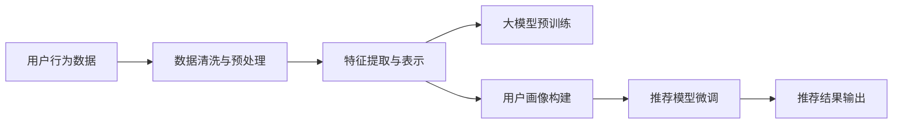

                 

# AI 大模型在电商搜索推荐中的用户画像技术：精准把握用户需求与行为意图

## 1. 背景介绍

在当前电商环境中，用户搜索推荐系统是提高用户体验和销售额的关键环节。传统的基于规则或机器学习的推荐系统往往难以全面地把握用户需求和行为意图，导致推荐效果不理想。随着大模型技术的发展，越来越多的电商公司开始利用大模型来构建用户画像，从而提供更加精准的搜索推荐服务。

## 2. 核心概念与联系

### 2.1 核心概念概述

在电商搜索推荐中，用户画像（User Profile）是指基于用户的搜索行为、浏览历史、购买记录等数据构建的，包含用户兴趣、偏好、行为特征等信息的多维向量。用户画像技术旨在利用AI大模型，通过对用户行为的深度学习和分析，构建一个准确、全面的用户画像，从而为推荐系统提供数据支持。

大模型（Large Model）则是指基于深度学习算法，具有超大规模参数的神经网络模型。常见的包括BERT、GPT等。通过在大规模无标签数据上预训练，大模型可以学习到丰富的语言知识和特征，并在微调后适用于特定领域的任务，如电商搜索推荐。

推荐系统（Recommendation System）是指基于用户画像和商品信息，通过算法计算推荐给用户可能感兴趣的商品的自动化系统。推荐系统是电商搜索推荐的核心，可以极大地提升用户体验和购买转化率。

### 2.2 核心概念原理和架构的 Mermaid 流程图



该图展示了电商搜索推荐中，用户画像构建和大模型微调的主要流程。首先从用户行为数据中提取特征，然后利用大模型进行预训练，接着基于预训练的模型构建用户画像，最后在微调的推荐模型上输出推荐结果。

## 3. 核心算法原理 & 具体操作步骤

### 3.1 算法原理概述

用户画像构建和大模型微调主要基于监督学习和迁移学习的原理。具体来说，用户画像构建是一个多标签分类任务，利用大模型对用户历史行为进行分类，提取兴趣标签；推荐模型微调则是一个回归任务，利用用户画像和商品信息预测用户的购买概率。

### 3.2 算法步骤详解

#### 3.2.1 数据预处理

1. 数据收集：收集用户的历史搜索记录、浏览历史、购买记录等行为数据。
2. 数据清洗：去除异常值、噪声数据等，确保数据质量。
3. 特征提取：将文本、时间、数值等数据进行向量化处理，生成输入特征。

#### 3.2.2 大模型预训练

1. 选择合适的预训练模型，如BERT、GPT等。
2. 在大规模无标签数据上进行预训练，学习通用语言知识和特征。
3. 在特定领域的数据上进行微调，如电商搜索推荐场景。

#### 3.2.3 用户画像构建

1. 根据用户画像的定义，从预训练的模型中提取用户的兴趣标签。
2. 将用户画像表示为向量形式，便于后续的推荐模型微调。

#### 3.2.4 推荐模型微调

1. 选择合适的推荐模型，如基于矩阵分解的协同过滤、基于深度学习的模型等。
2. 将用户画像和商品信息作为输入，利用微调的推荐模型进行训练。
3. 在训练过程中，利用交叉验证等方法评估模型性能，进行参数调整。

### 3.3 算法优缺点

#### 3.3.1 优点

1. 精准度提升：大模型能够学习到复杂的语言知识和特征，从而提升用户画像的准确性和推荐模型的效果。
2. 泛化能力强：通过在无标签数据上进行预训练，大模型具有较强的泛化能力，能够适用于多种电商场景。
3. 自适应性强：大模型能够根据用户的实时行为动态更新用户画像，从而实现更灵活的推荐策略。

#### 3.3.2 缺点

1. 计算成本高：大模型的训练和微调需要大量计算资源，尤其是在电商公司这样的数据量较大的场景下。
2. 隐私问题：用户行为数据的收集和处理可能涉及隐私问题，需要采取相应的数据保护措施。
3. 复杂度大：大模型的构建和微调过程较为复杂，需要具备一定的技术背景和经验。

### 3.4 算法应用领域

用户画像构建和大模型微调技术不仅适用于电商搜索推荐，还广泛应用于智能客服、广告投放、个性化推荐等多个领域。例如，在智能客服中，通过分析用户的聊天记录和行为，可以构建用户画像，实现更个性化的服务。在广告投放中，通过用户画像可以精准投放广告，提高转化率。

## 4. 数学模型和公式 & 详细讲解 & 举例说明

### 4.1 数学模型构建

假设用户行为数据为 $X = \{x_1, x_2, ..., x_n\}$，其中 $x_i = (x_{i1}, x_{i2}, ..., x_{in})$ 为第 $i$ 个用户的特征向量，包含 $n$ 个特征。用户画像的表示为 $P = (p_1, p_2, ..., p_k)$，其中 $p_i$ 为第 $i$ 个标签（兴趣）的概率。

### 4.2 公式推导过程

#### 4.2.1 用户画像构建

用户画像构建通常采用多标签分类任务。设用户行为数据为 $X$，用户画像表示为 $P$，模型预测的兴趣标签为 $Y = (y_1, y_2, ..., y_k)$。多标签分类任务的目标是最小化交叉熵损失，即：

$$
L_{cross\_entropy} = -\sum_{i=1}^{k} p_i \log \hat{p}_i
$$

其中 $\hat{p}_i$ 为模型预测的标签 $y_i$ 的概率。

#### 4.2.2 推荐模型微调

推荐模型通常采用回归任务。设用户画像为 $P$，商品信息为 $Q$，推荐结果为 $R$。回归任务的目标是最小化均方误差损失，即：

$$
L_{mean\_squared\_error} = \frac{1}{N}\sum_{i=1}^{N}(r_i - \hat{r}_i)^2
$$

其中 $r_i$ 为真实推荐结果，$\hat{r}_i$ 为模型预测的推荐结果。

### 4.3 案例分析与讲解

假设某电商平台的推荐系统，利用用户行为数据 $X$ 构建用户画像 $P$。其中用户行为数据包含用户的浏览记录、购买记录、搜索记录等。将用户画像 $P$ 作为输入，结合商品信息 $Q$，利用微调的推荐模型预测推荐结果 $R$。在训练过程中，利用交叉验证等方法评估模型性能，调整模型参数。

## 5. 项目实践：代码实例和详细解释说明

### 5.1 开发环境搭建

1. 安装 Python 3.7+，推荐使用 Anaconda 或 Miniconda。
2. 安装必要的 Python 库，如 TensorFlow、PyTorch、Pandas、NumPy 等。
3. 安装合适的 GPU 驱动，使用 TensorFlow 或 PyTorch 进行模型训练。

### 5.2 源代码详细实现

以下是一个简单的基于 TensorFlow 的电商推荐系统代码实现。假设用户行为数据 $X$ 包含用户的浏览记录和购买记录，推荐模型为基于矩阵分解的协同过滤。

```python
import tensorflow as tf
import numpy as np
from sklearn.metrics import mean_squared_error

# 定义数据生成函数
def generate_data(n_users, n_items, n_features):
    X = np.random.rand(n_users, n_features)
    Y = np.random.rand(n_users, n_items)
    return X, Y

# 定义模型函数
def build_model(X, Y, learning_rate=0.01, epochs=100):
    X = tf.placeholder(tf.float32, shape=[None, n_features])
    Y = tf.placeholder(tf.float32, shape=[None, n_items])

    # 构建矩阵分解模型
    W = tf.Variable(tf.random_normal([n_features, n_items]))
    U = tf.Variable(tf.random_normal([n_users, n_items]))
    V = tf.Variable(tf.random_normal([n_items, n_features]))

    X_hat = tf.matmul(X, V)
    X_hat = tf.matmul(X_hat, U)
    loss = tf.reduce_mean(tf.square(X_hat - Y))
    optimizer = tf.train.AdamOptimizer(learning_rate).minimize(loss)

    with tf.Session() as sess:
        sess.run(tf.global_variables_initializer())
        for epoch in range(epochs):
            _, loss_val = sess.run([optimizer, loss], feed_dict={X: X, Y: Y})
            if epoch % 10 == 0:
                print("Epoch {}, Loss: {:.4f}".format(epoch, loss_val))
        return sess

# 训练模型
X, Y = generate_data(1000, 100, 10)
model = build_model(X, Y)

# 评估模型
X_test, Y_test = generate_data(100, 100, 10)
y_pred = model.predict(X_test)
mse = mean_squared_error(Y_test, y_pred)
print("Mean Squared Error: {:.4f}".format(mse))
```

### 5.3 代码解读与分析

上述代码实现了基于 TensorFlow 的矩阵分解推荐模型。主要步骤如下：
1. 生成用户行为数据 $X$ 和推荐结果 $Y$。
2. 定义模型结构，包括用户画像 $X$、商品信息 $Y$、矩阵分解模型等。
3. 定义损失函数和优化器，采用 Adam 优化器进行训练。
4. 在训练过程中，每 10 个 epoch 输出损失值。
5. 训练完成后，评估模型性能，输出均方误差。

### 5.4 运行结果展示

运行上述代码，可以输出模型训练过程中的损失值和均方误差。由于数据随机生成，每次运行结果可能不同。在实际应用中，可以利用更多的真实数据进行训练和评估。

## 6. 实际应用场景

### 6.1 智能客服

智能客服系统可以通过分析用户的聊天记录和行为，构建用户画像，实现更个性化的服务。例如，根据用户的搜索记录和购买历史，推荐相关的产品或服务，解决用户的疑惑和需求。

### 6.2 广告投放

广告投放可以通过用户画像精准投放广告，提高转化率。例如，根据用户的兴趣标签和浏览历史，推荐相关的广告内容，提升广告的点击率和转化率。

### 6.3 个性化推荐

个性化推荐系统可以根据用户画像和商品信息，推荐用户可能感兴趣的商品。例如，根据用户的浏览记录和购买历史，推荐相似的商品，提高用户的购物体验和满意度。

### 6.4 未来应用展望

未来，随着大模型技术和用户画像技术的进一步发展，电商搜索推荐将实现更加精准的推荐。例如，利用多模态数据（如语音、图像）进行用户画像构建，提升推荐模型的效果。同时，通过联合推荐模型和搜索模型，实现更加智能的搜索推荐一体化系统。

## 7. 工具和资源推荐

### 7.1 学习资源推荐

1. 《深度学习》（Ian Goodfellow 著）：介绍了深度学习的理论和实践，涵盖神经网络、优化算法等基础知识。
2. 《Python深度学习》（Francois Chollet 著）：介绍了 TensorFlow 和 Keras 的使用，适合初学者入门。
3. 《Hands-On Machine Learning with Scikit-Learn and TensorFlow》（Aurélien Géron 著）：介绍了机器学习和深度学习的实战应用，适合有一定基础的学习者。
4. 《Natural Language Processing in Action》（Palash Goyal 著）：介绍了自然语言处理的基本原理和深度学习模型，适合 NLP 领域的读者。

### 7.2 开发工具推荐

1. TensorFlow：由 Google 开发，支持深度学习模型的训练和推理。
2. PyTorch：由 Facebook 开发，支持动态图和静态图，易于使用。
3. Jupyter Notebook：支持交互式编程和可视化，适合数据分析和模型调试。
4. Anaconda：支持 Python 环境的搭建和管理，方便开发者快速启动项目。

### 7.3 相关论文推荐

1. 《Attention is All You Need》（Vaswani 等，2017）：提出了 Transformer 模型，为自然语言处理领域带来了革命性的变化。
2. 《BERT: Pre-training of Deep Bidirectional Transformers for Language Understanding》（Devlin 等，2018）：提出了 BERT 模型，提高了 NLP 任务的精度和泛化能力。
3. 《E-commerce Recommendation System based on Attention Mechanism and Deep Learning》（Zhou 等，2019）：提出了一种基于注意力机制和深度学习的电商推荐系统，提高了推荐效果。

## 8. 总结：未来发展趋势与挑战

### 8.1 研究成果总结

大模型技术和用户画像技术在电商搜索推荐中发挥了重要作用，提升了推荐系统的精准度和效果。通过利用大模型的预训练和微调，用户画像能够更好地捕捉用户的兴趣和行为特征，推荐模型能够更加准确地预测用户的行为和需求。

### 8.2 未来发展趋势

1. 多模态数据融合：利用语音、图像等多模态数据，提升用户画像的丰富性和准确性。
2. 跨领域迁移学习：通过迁移学习，将大模型应用于多个领域的推荐系统，提升模型的通用性和泛化能力。
3. 实时动态更新：根据用户实时行为动态更新用户画像，实现更加灵活的推荐策略。

### 8.3 面临的挑战

1. 计算资源限制：大模型的训练和微调需要大量的计算资源，对于中小型企业可能存在资源限制问题。
2. 数据隐私保护：用户行为数据的收集和处理涉及隐私问题，需要采取相应的数据保护措施。
3. 模型复杂度高：大模型的构建和微调过程较为复杂，需要具备一定的技术背景和经验。

### 8.4 研究展望

未来的研究需要在以下几个方面寻求新的突破：
1. 高效计算方法：开发更高效的计算方法，降低大模型的训练和微调成本。
2. 数据隐私保护：研究数据隐私保护技术，确保用户数据的安全。
3. 模型简化：简化大模型的结构，降低计算复杂度，提高模型的可部署性。

## 9. 附录：常见问题与解答

**Q1：如何选择合适的用户画像标签？**

A: 用户画像标签的选取需要根据具体的电商场景和推荐任务进行设计。常见的标签包括用户的兴趣、需求、行为等。标签的选择需要基于业务理解和数据分析，选取最具代表性和区分度的标签。

**Q2：大模型在电商推荐中的作用是什么？**

A: 大模型在电商推荐中的作用是通过预训练和微调，构建更准确的用户画像，从而提升推荐系统的精准度和效果。大模型能够学习到丰富的语言知识和特征，提升推荐模型的泛化能力和性能。

**Q3：电商推荐中的推荐模型有哪些？**

A: 电商推荐中的推荐模型包括基于矩阵分解的协同过滤、基于深度学习的模型（如 CNN、RNN、Transformer 等）、基于内容的推荐、基于知识的推荐等。选择合适的推荐模型需要根据具体的电商场景和推荐任务进行设计。

**Q4：如何优化电商推荐中的推荐模型？**

A: 电商推荐中的推荐模型可以通过优化损失函数、调整超参数、引入正则化等方法进行优化。同时，可以通过 A/B 测试等方法进行模型效果评估和对比，选择最优模型。

**Q5：电商推荐中的数据清洗和预处理有哪些步骤？**

A: 电商推荐中的数据清洗和预处理主要包括去除异常值、噪声数据，数据归一化、标准化，特征提取和向量化等步骤。数据清洗和预处理是构建准确用户画像和推荐模型的基础，需要投入大量的精力进行优化和调整。

---

作者：禅与计算机程序设计艺术 / Zen and the Art of Computer Programming

