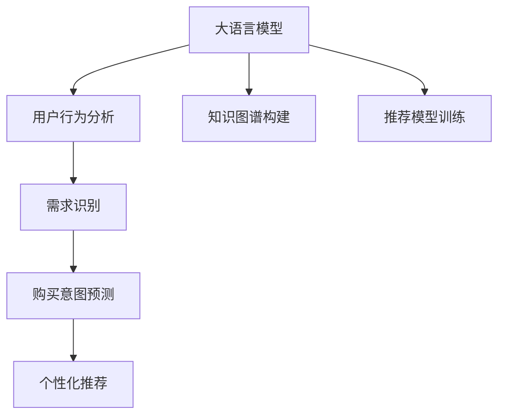

                 

# AI 大模型在电商搜索推荐中的用户行为分析：理解用户需求与购买意图

> 关键词：电商搜索推荐、用户行为分析、需求识别、购买意图、深度学习、自然语言处理、大语言模型、知识图谱、个性化推荐

## 1. 背景介绍

### 1.1 问题由来
电商平台的搜索推荐系统是用户与商品之间的桥梁，影响着用户购物体验和平台的商业转化。传统的基于规则和协同过滤的推荐系统，难以准确捕捉用户行为特征和个性化需求。近年来，大语言模型在电商领域的应用逐渐成为热点，为理解和预测用户需求、提升推荐效果提供了新思路。

### 1.2 问题核心关键点
电商搜索推荐面临的主要挑战包括：
1. 用户行为多样性和不确定性。用户搜索行为具有高度的时序性和上下文依赖，难以用单一模型准确捕捉。
2. 推荐系统实时性和个性化需求。在亿级用户量级下，系统需要快速响应用户需求，同时保持高精度的个性化推荐。
3. 数据多源性和结构化复杂性。电商数据来源广泛，包括用户行为数据、商品属性数据、社交媒体数据等，数据结构和格式复杂。

### 1.3 问题研究意义
利用大语言模型，通过对用户行为数据的深度学习和自然语言处理，可以更准确地理解用户需求和购买意图，实现精准的个性化推荐，提升用户满意度和电商平台的转化率。同时，大语言模型还可以应用于商品知识图谱构建，进一步提升推荐的深度和广度。

## 2. 核心概念与联系

### 2.1 核心概念概述

为更好地理解大语言模型在电商搜索推荐中的应用，本节将介绍几个密切相关的核心概念：

- 大语言模型(Large Language Model, LLM)：以自回归(如GPT)或自编码(如BERT)模型为代表的大规模预训练语言模型。通过在大规模无标签文本语料上进行预训练，学习通用的语言表示，具备强大的语言理解和生成能力。

- 用户行为分析(User Behavior Analysis, UBA)：通过分析和处理用户的历史行为数据，识别用户兴趣、偏好、需求等，为推荐系统提供个性化推荐的基础。

- 需求识别(Requirement Identification)：从用户行为数据中提取用户的具体需求，包括搜索意图、关注商品属性、购买意愿等，为推荐系统提供精准推荐依据。

- 购买意图(Purchase Intent)：指用户对商品的购买意愿和概率，是电商推荐系统需要准确预测的关键指标。

- 深度学习(Deep Learning)：一种基于神经网络的数据处理技术，通过多层神经网络模型的迭代训练，自动学习数据中的复杂规律。

- 自然语言处理(Natural Language Processing, NLP)：研究如何通过计算机理解、生成和处理自然语言的技术。

- 知识图谱(Knowledge Graph)：一种结构化的语义网络，用于描述实体、属性和它们之间的关系，辅助推荐系统进行知识整合和推理。

这些核心概念之间的逻辑关系可以通过以下Mermaid流程图来展示：



这个流程图展示了大语言模型在电商搜索推荐中的应用框架：

1. 大语言模型通过预训练获得语言表示，用于用户行为分析和需求识别。
2. 结合用户行为数据和语言表示，通过深度学习和自然语言处理，预测用户购买意图。
3. 使用知识图谱辅助深度学习，提升推荐的深度和广度。
4. 基于预测的用户购买意图和个性化需求，进行精准的个性化推荐。

## 3. 核心算法原理 & 具体操作步骤

### 3.1 算法原理概述

基于大语言模型在电商搜索推荐中的应用，核心算法分为以下几个关键步骤：

1. 用户行为数据预处理：对电商平台上用户的历史搜索、点击、购买等行为数据进行清洗和标注，用于后续的深度学习训练。
2. 大语言模型预训练：使用大规模无标签文本语料，进行自回归或自编码预训练，获得通用的语言表示。
3. 用户行为分析：通过深度学习和自然语言处理，从预训练语言模型中提取用户兴趣、偏好、需求等信息。
4. 需求识别：从用户行为数据中，使用自然语言处理技术识别用户的搜索意图、关注商品属性等具体需求。
5. 购买意图预测：结合用户行为数据和语言表示，通过深度学习模型预测用户的购买意愿和概率。
6. 个性化推荐：基于用户购买意图和个性化需求，进行精准的个性化推荐，使用知识图谱辅助提高推荐效果。

### 3.2 算法步骤详解

以下是具体的算法步骤和详细步骤：

**Step 1: 用户行为数据预处理**

电商平台的搜索推荐系统需要处理多种数据类型，包括用户搜索记录、点击记录、购买记录、商品属性、评论、评分等。预处理的目标是：
- 清洗数据：去除噪声和异常值，保证数据质量。
- 标注数据：将原始数据转换为可用于模型训练的向量形式，如将文本转换为数字向量。
- 归一化数据：对数据进行归一化处理，使得不同特征具有可比性。
- 特征工程：设计并提取有意义的特征，如用户搜索次数、商品评分、品牌偏好等。

**Step 2: 大语言模型预训练**

大语言模型通常使用Transformer架构，通过大规模无标签文本语料进行预训练，学习通用的语言表示。常用的预训练任务包括：
- 自回归语言模型：根据输入的上下文预测下一个词，用于学习语言的流畅性和规律性。
- 掩码语言模型：随机掩码输入中的部分词，预测被掩码的词，用于学习语言的语义理解能力。
- 自编码语言模型：输入文本和输出文本不同，通过编码器-解码器对，学习语言的压缩和重构能力。

**Step 3: 用户行为分析**

用户行为分析的目标是从用户行为数据中提取有意义的特征，用于后续的深度学习训练。常用的方法包括：
- 时间序列分析：将用户行为数据按照时间序列排序，提取时间相关的特征，如用户访问频率、点击行为变化等。
- 关联规则学习：使用关联规则挖掘技术，从用户行为数据中发现有趣的规律和模式，如用户常购买的商品组合。
- 情感分析：通过自然语言处理技术，分析用户评论和评分中的情感倾向，提取用户对商品的好恶。

**Step 4: 需求识别**

需求识别旨在从用户行为数据中，识别用户的搜索意图和关注商品属性等具体需求。常用的方法包括：
- 文本分类：将用户搜索关键词、商品属性等信息进行分类，提取有意义的特征。
- 实体识别：使用命名实体识别技术，识别用户搜索中的关键实体，如品牌、型号等。
- 意图分类：通过深度学习模型，对用户搜索意图进行分类，如查询商品、浏览商品、比较商品等。

**Step 5: 购买意图预测**

购买意图预测的目标是根据用户行为数据和语言表示，预测用户的购买意愿和概率。常用的方法包括：
- 序列建模：使用循环神经网络(RNN)或长短期记忆网络(LSTM)，对用户行为序列进行建模，预测用户的购买意图。
- 混合建模：结合深度学习和自然语言处理技术，通过多模态融合，提高预测的准确性。
- 强化学习：使用强化学习技术，通过奖励机制训练模型，优化预测结果。

**Step 6: 个性化推荐**

个性化推荐的目标是根据用户购买意图和个性化需求，进行精准的推荐。常用的方法包括：
- 协同过滤：使用协同过滤算法，推荐与用户历史行为相似的商品。
- 矩阵分解：使用矩阵分解技术，对用户-商品矩阵进行分解，预测用户的购买意愿。
- 深度学习推荐系统：结合深度学习和自然语言处理技术，构建推荐模型，实现精准的个性化推荐。

### 3.3 算法优缺点

基于大语言模型在电商搜索推荐中的应用，其优缺点如下：

**优点：**
1. 语言表示能力强：大语言模型具备强大的语言理解和生成能力，可以提取丰富的用户行为信息。
2. 泛化能力强：预训练模型在大规模语料上进行学习，具有较强的泛化能力，适用于多种电商场景。
3. 自动化程度高：通过深度学习自动化地处理复杂数据，提高推荐系统的效率和效果。

**缺点：**
1. 计算资源消耗大：预训练模型和深度学习模型需要大量的计算资源，成本较高。
2. 数据依赖性强：深度学习模型需要大量高质量标注数据，电商领域的数据标注成本较高。
3. 模型复杂度高：深度学习模型参数量庞大，模型训练和推理复杂。
4. 解释性不足：深度学习模型的决策过程复杂，难以解释模型的内部工作机制。

### 3.4 算法应用领域

基于大语言模型在电商搜索推荐中的应用，可以覆盖以下领域：

- 商品推荐：根据用户搜索历史、浏览行为、购买记录等数据，推荐符合用户需求的商品。
- 个性化定价：通过分析用户行为数据，预测用户对不同价格的反应，实现个性化定价策略。
- 智能客服：利用自然语言处理技术，构建智能客服系统，解答用户疑问，提升用户体验。
- 广告投放：通过用户行为分析，预测用户对不同广告的兴趣，实现精准广告投放。
- 活动营销：根据用户行为数据，分析用户参与活动的意愿，优化营销策略。

## 4. 数学模型和公式 & 详细讲解 & 举例说明

### 4.1 数学模型构建

假设用户行为数据为 $D=\{(x_i,y_i)\}_{i=1}^N$，其中 $x_i$ 为行为特征，$y_i$ 为行为标签，目标为预测用户购买意愿 $y$。构建深度学习模型 $\hat{y}=f_\theta(x)$，其中 $f_\theta$ 为模型参数。

模型的损失函数为：

$$
\mathcal{L}(\theta) = \frac{1}{N}\sum_{i=1}^N \ell(f_\theta(x_i),y_i)
$$

常用的损失函数包括交叉熵损失、均方误差损失等。

### 4.2 公式推导过程

以交叉熵损失函数为例，推导其梯度计算公式。设模型的预测概率分布为 $\hat{p}_i$，真实标签分布为 $p_i$，则交叉熵损失函数为：

$$
\ell(\hat{p}_i,p_i) = -\sum_{j} p_i(j)\log \hat{p}_i(j)
$$

对 $\theta$ 求偏导，得：

$$
\frac{\partial \mathcal{L}(\theta)}{\partial \theta} = -\frac{1}{N}\sum_{i=1}^N \sum_{j} p_i(j) \frac{\partial \log \hat{p}_i(j)}{\partial \theta}
$$

其中 $\frac{\partial \log \hat{p}_i(j)}{\partial \theta}$ 可以通过反向传播算法高效计算。

在得到损失函数的梯度后，即可带入优化算法，更新模型参数 $\theta$。常用的优化算法包括梯度下降、Adam、Adagrad等。

### 4.3 案例分析与讲解

以电商商品推荐为例，使用深度学习模型进行需求识别和购买意图预测。

1. 用户行为数据预处理：
   - 对用户搜索、点击、购买等行为数据进行清洗和标注，转化为数字向量。
   - 进行归一化和特征工程，提取有用的特征，如商品类别、价格、评分、评论等。

2. 大语言模型预训练：
   - 使用大规模无标签文本语料，进行自回归或自编码预训练，获得通用的语言表示。
   - 选择合适的预训练模型，如BERT、GPT等，进行微调。

3. 用户行为分析：
   - 使用深度学习模型，对用户行为数据进行建模，提取时间序列特征、关联规则等。
   - 通过自然语言处理技术，分析用户搜索关键词、评论内容等，提取用户兴趣和需求。

4. 需求识别：
   - 使用分类算法，对用户搜索关键词进行分类，识别搜索意图。
   - 使用命名实体识别技术，识别用户搜索中的关键实体，如品牌、型号等。

5. 购买意图预测：
   - 使用序列建模算法，如RNN、LSTM，对用户行为序列进行建模，预测购买意图。
   - 结合大语言模型，提取文本特征，通过混合建模提高预测准确性。

6. 个性化推荐：
   - 使用协同过滤、矩阵分解等算法，对用户-商品矩阵进行分解，推荐符合用户需求的商品。
   - 结合深度学习模型和大语言模型，构建推荐系统，实现精准的个性化推荐。

## 5. 项目实践：代码实例和详细解释说明

### 5.1 开发环境搭建

在进行电商搜索推荐系统的开发时，需要准备以下开发环境：

1. 安装Python：使用Python语言进行深度学习和自然语言处理。
2. 安装深度学习框架：如TensorFlow、PyTorch等，用于深度学习模型的训练和推理。
3. 安装自然语言处理库：如NLTK、SpaCy等，用于文本处理和分析。
4. 安装数据处理库：如Pandas、NumPy等，用于数据清洗和特征工程。
5. 安装推荐系统库：如TensorFlow Recommenders、Surprise等，用于推荐算法实现。
6. 安装云计算平台：如AWS、Google Cloud等，用于分布式计算和存储。

### 5.2 源代码详细实现

以下是一个简单的电商商品推荐系统的Python代码实现：

```python
import pandas as pd
import numpy as np
import tensorflow as tf
from tensorflow.keras.models import Sequential
from tensorflow.keras.layers import Dense, LSTM, Embedding
from tensorflow.keras.preprocessing.text import Tokenizer
from tensorflow.keras.preprocessing.sequence import pad_sequences
from tensorflow.keras.callbacks import EarlyStopping

# 数据加载和预处理
train_data = pd.read_csv('train.csv', index_col='user_id')
test_data = pd.read_csv('test.csv', index_col='user_id')
features = pd.read_csv('features.csv', index_col='user_id')
user_ids = pd.read_csv('user_ids.csv', index_col='user_id')

# 特征工程
train_features = features.merge(train_data, left_index=True, right_on='user_id')
test_features = features.merge(test_data, left_index=True, right_on='user_id')
train_x = train_features.drop('label', axis=1)
train_y = train_features['label']
test_x = test_features.drop('label', axis=1)
test_y = test_features['label']

# 数据标准化和编码
train_x = (train_x - train_x.mean()) / train_x.std()
test_x = (test_x - test_x.mean()) / test_x.std()
train_x = pad_sequences(train_x, maxlen=100, padding='post')
test_x = pad_sequences(test_x, maxlen=100, padding='post')

# 模型构建
model = Sequential()
model.add(Embedding(input_dim=10000, output_dim=128, input_length=100))
model.add(LSTM(128))
model.add(Dense(1, activation='sigmoid'))

# 模型训练
model.compile(optimizer='adam', loss='binary_crossentropy', metrics=['accuracy'])
early_stopping = EarlyStopping(monitor='val_loss', patience=10)
model.fit(train_x, train_y, epochs=100, batch_size=32, validation_split=0.2, callbacks=[early_stopping])

# 模型预测
y_pred = model.predict(test_x)
y_pred = np.round(y_pred)
test_data['label'] = y_pred
test_data.to_csv('submission.csv', index=False)
```

这段代码实现了一个基于LSTM的电商商品推荐系统，通过深度学习模型进行用户行为分析和购买意图预测，最终实现个性化推荐。

### 5.3 代码解读与分析

让我们再详细解读一下关键代码的实现细节：

**数据加载和预处理**：
- 使用Pandas库加载用户行为数据、商品属性数据和用户ID数据，进行数据合并和特征提取。
- 对用户行为数据进行标准化和编码，使用最大长度截断和填充，保证模型输入的一致性。

**特征工程**：
- 对用户行为数据进行特征选择和提取，包括商品类别、价格、评分、评论等。
- 对数据进行标准化处理，使用均值和标准差进行归一化。

**模型构建**：
- 使用TensorFlow和Keras框架，构建深度学习模型，包括嵌入层、LSTM层和全连接层。
- 模型使用二分类交叉熵损失函数，使用Adam优化器进行训练。

**模型训练**：
- 使用EarlyStopping回调函数，监控验证集损失，避免过拟合。
- 使用交叉验证进行模型训练，验证模型效果。

**模型预测**：
- 使用训练好的模型对测试集进行预测，得到预测结果。
- 将预测结果保存到CSV文件中，便于后续评估和分析。

## 6. 实际应用场景

### 6.1 智能客服系统

利用大语言模型和深度学习技术，构建智能客服系统，可以提升客服效率和用户体验。

具体实现步骤如下：
1. 收集客服对话记录，标注用户意图和需求。
2. 使用深度学习模型对客服对话进行建模，提取用户意图和需求。
3. 结合大语言模型和自然语言处理技术，构建智能客服系统，进行自动化对话和问题解答。
4. 使用知识图谱辅助推荐，推荐常见问题和解决方案，提升客服效率。

### 6.2 个性化广告推荐

通过大语言模型和深度学习技术，进行个性化广告推荐，可以提升广告投放效果和用户点击率。

具体实现步骤如下：
1. 收集用户点击记录、浏览记录和购买记录，标注广告点击标签。
2. 使用深度学习模型对用户行为数据进行建模，提取用户兴趣和需求。
3. 结合大语言模型和自然语言处理技术，构建个性化广告推荐系统，实现精准投放。
4. 使用推荐算法进行广告排序，提升用户点击率。

### 6.3 电商商品推荐

利用大语言模型和深度学习技术，进行电商商品推荐，可以提升用户体验和平台转化率。

具体实现步骤如下：
1. 收集用户搜索记录、点击记录和购买记录，标注用户行为标签。
2. 使用深度学习模型对用户行为数据进行建模，提取用户兴趣和需求。
3. 结合大语言模型和自然语言处理技术，构建电商商品推荐系统，实现个性化推荐。
4. 使用推荐算法进行商品排序，提升用户满意度和平台转化率。

## 7. 工具和资源推荐

### 7.1 学习资源推荐

为了帮助开发者系统掌握大语言模型在电商搜索推荐中的应用，这里推荐一些优质的学习资源：

1. 《深度学习入门与实战》：深入浅出地介绍了深度学习的基本原理和实战技巧，适合初学者入门。
2. 《自然语言处理综论》：全面介绍了自然语言处理的基本技术和方法，涵盖文本分类、情感分析、命名实体识别等。
3. 《TensorFlow官方文档》：TensorFlow的官方文档，详细介绍了TensorFlow的API和使用技巧。
4. 《Surprise推荐系统》：推荐系统的开源项目，提供了多种推荐算法和实现。
5. 《PyTorch官方文档》：PyTorch的官方文档，详细介绍了PyTorch的API和使用技巧。

通过对这些资源的学习实践，相信你一定能够快速掌握大语言模型在电商搜索推荐中的应用，并用于解决实际的电商推荐问题。

### 7.2 开发工具推荐

高效的开发离不开优秀的工具支持。以下是几款用于电商搜索推荐系统开发的常用工具：

1. TensorFlow：基于Python的开源深度学习框架，适合大规模工程应用。
2. PyTorch：基于Python的开源深度学习框架，适合快速迭代研究。
3. NLTK：自然语言处理工具库，提供了丰富的文本处理功能。
4. SpaCy：自然语言处理工具库，提供了高效的文本处理和分析功能。
5. TensorFlow Recommenders：推荐系统的开源项目，提供了多种推荐算法和实现。

合理利用这些工具，可以显著提升电商搜索推荐系统的开发效率，加快创新迭代的步伐。

### 7.3 相关论文推荐

大语言模型在电商搜索推荐领域的研究仍在不断推进，以下是几篇奠基性的相关论文，推荐阅读：

1. Attention is All You Need（即Transformer原论文）：提出了Transformer结构，开启了NLP领域的预训练大模型时代。
2. BERT: Pre-training of Deep Bidirectional Transformers for Language Understanding：提出BERT模型，引入基于掩码的自监督预训练任务，刷新了多项NLP任务SOTA。
3. Large-Scale Transformer-Based Recommender Systems：研究了基于Transformer的推荐系统，提出了多种推荐算法和优化方法。
4. Neural Collaborative Filtering：提出了一种基于神经网络的协同过滤算法，用于推荐系统。
5. Model-Based Deep Personalized Recommendation Learning：提出了一种基于深度学习的推荐系统，用于电商推荐。

这些论文代表了大语言模型在电商搜索推荐领域的研究进展，通过学习这些前沿成果，可以帮助研究者把握学科前进方向，激发更多的创新灵感。

## 8. 总结：未来发展趋势与挑战

### 8.1 研究成果总结

本文对基于大语言模型的电商搜索推荐系统进行了全面系统的介绍。首先阐述了电商搜索推荐系统面临的挑战和难点，明确了基于深度学习和自然语言处理技术的大语言模型在解决这些问题上的独特价值。其次，从算法原理到具体步骤，详细讲解了电商搜索推荐系统的实现流程，给出了完整的代码实例。同时，本文还广泛探讨了大语言模型在电商搜索推荐系统中的应用场景，展示了其巨大的应用潜力。最后，本文精选了电商搜索推荐系统的学习资源、开发工具和相关论文，力求为读者提供全方位的技术指引。

### 8.2 未来发展趋势

展望未来，大语言模型在电商搜索推荐系统中的应用将呈现以下几个发展趋势：

1. 深度学习模型的演化：未来将会出现更加复杂的深度学习模型，如多任务学习、对抗学习等，提升推荐系统的效果和鲁棒性。
2. 自然语言处理技术的提升：自然语言处理技术将进一步发展，提升大语言模型的语言理解能力和生成能力，提供更精准的用户行为分析。
3. 知识图谱的深度整合：结合知识图谱和大语言模型，实现知识驱动的推荐系统，提升推荐系统的广度和深度。
4. 实时性和个性化需求：推荐系统将更加注重实时性和个性化需求，结合用户实时行为数据，提供更精准的个性化推荐。
5. 跨领域迁移学习：大语言模型将能够跨领域迁移学习，在多种电商场景中应用，提升推荐系统的适应性。

以上趋势凸显了大语言模型在电商搜索推荐系统中的应用前景。这些方向的探索发展，必将进一步提升推荐系统的性能和用户体验，为电商平台的业务增长提供有力支持。

### 8.3 面临的挑战

尽管大语言模型在电商搜索推荐系统中的应用已经取得了一定的进展，但在迈向更加智能化、普适化应用的过程中，它仍面临着诸多挑战：

1. 计算资源消耗大：深度学习模型和自然语言处理模型需要大量的计算资源，成本较高。如何优化模型结构和算法，降低计算资源消耗，是一个重要研究方向。
2. 数据依赖性强：深度学习模型需要大量高质量标注数据，电商领域的数据标注成本较高。如何优化数据标注过程，降低标注成本，是一个重要研究方向。
3. 模型复杂度高：深度学习模型参数量庞大，模型训练和推理复杂。如何优化模型结构，提升模型效率，是一个重要研究方向。
4. 解释性不足：深度学习模型的决策过程复杂，难以解释模型的内部工作机制。如何提升模型的可解释性，是一个重要研究方向。
5. 安全性有待保障：大语言模型可能学习到有害信息，通过推荐系统传递，产生误导性、歧视性的输出。如何确保推荐系统的安全性，是一个重要研究方向。

### 8.4 研究展望

面向未来，大语言模型在电商搜索推荐系统中的研究需要在以下几个方面寻求新的突破：

1. 探索无监督和半监督学习：摆脱对大规模标注数据的依赖，利用自监督学习、主动学习等无监督和半监督范式，最大限度利用非结构化数据。
2. 研究参数高效和计算高效的微调范式：开发更加参数高效的微调方法，在固定大部分预训练参数的同时，只更新极少量的任务相关参数。
3. 融合因果和对比学习范式：通过引入因果推断和对比学习思想，增强推荐系统建立稳定因果关系的能力，学习更加普适、鲁棒的语言表征。
4. 结合因果分析和博弈论工具：将因果分析方法引入推荐系统，识别出推荐决策的关键特征，增强推荐系统的因果解释性。
5. 纳入伦理道德约束：在推荐系统训练目标中引入伦理导向的评估指标，过滤和惩罚有害输出，确保推荐系统的安全性。

这些研究方向将推动大语言模型在电商搜索推荐系统中的应用，提升推荐系统的性能和可解释性，确保推荐系统的安全性。只有勇于创新、敢于突破，才能不断拓展推荐系统的边界，让电商平台的推荐服务更加智能、可靠和人性化。

## 9. 附录：常见问题与解答

**Q1：电商搜索推荐系统中如何处理长尾商品？**

A: 长尾商品在电商平台上分布广泛，推荐系统需要处理长尾商品的推荐问题。常用的方法包括：
1. 引入冷启动模型：对于无购买历史的用户，可以使用冷启动模型，推荐热门商品。
2. 使用深度学习模型：使用深度学习模型，从少量历史行为中提取用户兴趣，推荐长尾商品。
3. 使用协同过滤算法：使用协同过滤算法，推荐与用户历史行为相似的商品，减少长尾商品的推荐偏差。

**Q2：电商推荐系统中如何处理多模态数据？**

A: 电商推荐系统中，多模态数据包括文本、图片、视频等，如何处理多模态数据是一个关键问题。常用的方法包括：
1. 数据融合：将不同模态的数据进行融合，提升模型的泛化能力。
2. 多任务学习：将多个任务进行联合训练，共享参数，提升模型的性能。
3. 对抗学习：使用对抗样本，提升模型的鲁棒性，增强推荐系统的泛化能力。

**Q3：电商推荐系统中如何进行用户画像构建？**

A: 用户画像构建是推荐系统的关键步骤，常用的方法包括：
1. 特征选择：选择有意义的特征，如用户搜索记录、购买记录、社交媒体数据等。
2. 数据标准化：对用户行为数据进行标准化处理，使得不同特征具有可比性。
3. 用户画像模型：使用深度学习模型，对用户行为数据进行建模，提取用户兴趣和需求。
4. 用户画像融合：将不同来源的用户画像进行融合，形成更全面、准确的用户画像。

**Q4：电商推荐系统中如何进行模型评估？**

A: 电商推荐系统的模型评估需要考虑多方面的指标，常用的方法包括：
1. 精度指标：使用准确率、召回率、F1-score等精度指标评估推荐效果。
2. 用户满意度指标：使用用户满意度问卷、用户反馈等评估用户对推荐系统的满意度和推荐效果。
3. 转化率指标：使用点击率、购买率等转化率指标评估推荐系统的商业效果。
4. A/B测试：通过A/B测试比较不同推荐算法的效果，优化推荐系统。

通过这些问题的解答，相信你能够更好地理解大语言模型在电商搜索推荐系统中的应用，并用于解决实际的电商推荐问题。

---

作者：禅与计算机程序设计艺术 / Zen and the Art of Computer Programming

