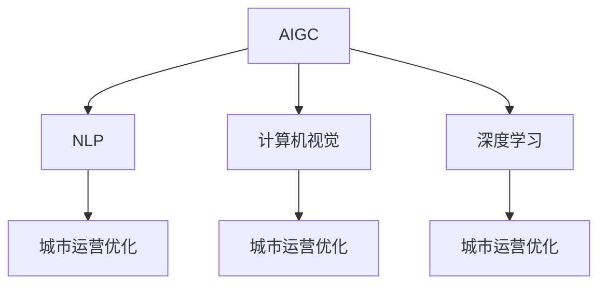

                 

# AIGC助力智能城市运营

> 关键词：人工智能生成内容(AIGC), 智能城市, 交通管理, 公共安全, 智慧能源, 城市运营优化

## 1. 背景介绍

随着城市化进程的不断加快，智慧城市的建设成为了各国政府和企业的共同目标。智慧城市，是指通过信息技术和互联网的深度融合，将城市基础设施、公共服务、环境资源等数据进行全面感知、传输、分析和利用，以提升城市管理效率、服务水平和居民生活质量。而人工智能生成内容(AIGC)技术作为新一代智能技术的代表，正在为智慧城市的建设提供强大的引擎。

### 1.1 问题由来

传统的城市运营管理主要依赖于人工监测和调度，效率低下，且存在一定的人为疏漏。随着数据的指数级增长和人工智能技术的不断进步，智慧城市建设需要更多智能化的解决方案。而AIGC技术通过自动生成文本、图像、视频等内容，极大提升了智慧城市中信息处理和传播的效率，实现了城市管理的智能化和精细化。

### 1.2 问题核心关键点

AIGC技术在智慧城市中的应用，主要体现在以下几个方面：

1. **城市运营管理**：通过自动生成各类运营报告、调度指令、服务指南等内容，优化城市管理流程，提升运营效率。
2. **公共安全**：生成交通监控视频、监控报告、安全预警等信息，提升公共安全水平，防范各类安全风险。
3. **交通管理**：实时生成交通状况报告、路线规划、出行建议等内容，改善交通拥堵状况，提升通行效率。
4. **智慧能源**：生成能源需求预测、智能调度方案、节能建议等内容，优化能源配置，降低能源消耗。
5. **环境监测**：生成环境监测报告、空气质量预警、污染源追踪等内容，提升环境治理水平，保障居民健康。

### 1.3 问题研究意义

AIGC技术在智慧城市中的应用，对于推动城市智能化、提升城市管理效率、优化公共服务、保障城市安全具有重要意义：

1. **提升城市管理效率**：通过自动生成各类报告和调度指令，减少人工处理时间，提升城市管理效率。
2. **优化公共服务**：实时生成服务指南、出行建议等内容，提升服务质量和居民体验。
3. **保障城市安全**：通过生成安全预警、监控报告等信息，及时发现和应对各类安全风险，保障城市安全。
4. **改善交通状况**：生成交通状况报告、路线规划等内容，优化交通流动，缓解交通拥堵。
5. **降低能源消耗**：生成能源需求预测、智能调度方案等内容，优化能源配置，降低能源消耗。
6. **提升环境治理水平**：生成环境监测报告、污染源追踪等内容，提升环境治理效果，保障居民健康。

## 2. 核心概念与联系

### 2.1 核心概念概述

为了更好地理解AIGC在智慧城市中的应用，本节将介绍几个密切相关的核心概念：

- **人工智能生成内容(AIGC)**：指利用人工智能技术自动生成文本、图像、视频等内容。AIGC涵盖了自然语言处理(NLP)、计算机视觉、语音识别等多个领域的深度学习技术。
- **自然语言处理(NLP)**：指通过计算机理解和处理自然语言，实现语言到文字的转换、文本分类、情感分析等功能。NLP技术是AIGC中应用最广泛的技术之一。
- **计算机视觉**：指通过计算机对图像、视频等视觉内容进行识别、分析和理解。计算机视觉技术在城市监控、交通管理等领域具有广泛应用。
- **深度学习**：指通过深度神经网络模型对数据进行复杂模式识别和学习。深度学习是AIGC技术实现的核心算法。
- **城市运营优化**：指通过优化城市资源配置、管理流程、服务质量等，提升城市管理效率和服务水平。

这些核心概念之间的逻辑关系可以通过以下Mermaid流程图来展示：



这个流程图展示了大语言模型与城市运营优化的关联：

1. **AIGC**：作为智慧城市中的智能化工具，AIGC可以生成各类运营报告、调度指令、服务指南等，优化城市管理流程。
2. **NLP**：NLP技术可以处理文本数据，生成自然语言的指令和建议，提升服务质量。
3. **计算机视觉**：图像处理技术可以实时监控城市交通、环境状况，生成可视化报告和预警信息。
4. **深度学习**：深度学习模型可以分析大量的城市运营数据，生成智能决策方案，优化资源配置。

## 3. 核心算法原理 & 具体操作步骤

### 3.1 算法原理概述

AIGC技术在智慧城市中的应用，本质上是基于深度学习模型的自动内容生成过程。其核心思想是：通过预训练的语言模型，将城市运营中的各类数据转化为语言表达，再通过生成的语言指令指导后续的智能操作。

形式化地，假设城市运营数据集为 $D=\{(x_i, y_i)\}_{i=1}^N$，其中 $x_i$ 为城市运营相关数据，如交通流量、能源消耗、环境指标等，$y_i$ 为对应的目标输出，如报告、指令、建议等。AIGC的目标是找到最优的语言生成模型 $M_{\theta}$，使得模型在生成 $y_i$ 时与 $x_i$ 尽可能匹配，即：

$$
\hat{y} = \mathop{\arg\min}_{\theta} \mathcal{L}(M_{\theta},x)
$$

其中 $\mathcal{L}$ 为损失函数，用于衡量模型生成的文本与实际文本之间的差异。

### 3.2 算法步骤详解

基于深度学习的AIGC算法步骤如下：

1. **数据准备**：收集城市运营数据，如交通流量、环境指标、能源消耗等，并标注生成目标文本。
2. **模型训练**：选择合适的深度学习模型（如GPT、Transformer等），在标注数据上训练语言生成模型。
3. **文本生成**：输入城市运营数据 $x$，模型输出生成目标文本 $y$。
4. **任务适配**：根据生成文本的任务类型，设计相应的任务适配层，如文本分类、命名实体识别等。
5. **评估优化**：对生成文本进行评估，根据评估结果调整模型参数，优化模型性能。

### 3.3 算法优缺点

AIGC技术在智慧城市中的应用，具有以下优点：

1. **高效智能化**：自动生成各类文本内容，减少人工处理时间，提升运营效率。
2. **适应性强**：可以根据不同任务需求，设计不同的任务适配层，灵活适应各种应用场景。
3. **准确性高**：深度学习模型具有强大的数据处理能力，生成文本准确性较高，符合实际需求。

同时，该技术也存在一定的局限性：

1. **依赖标注数据**：模型需要大量的标注数据进行训练，标注成本较高。
2. **泛化能力有限**：模型在特定的数据集上训练，对新数据的泛化能力有限。
3. **可解释性不足**：生成的文本内容黑箱操作，难以解释其生成逻辑。
4. **安全性问题**：生成的内容可能存在误导性、歧视性，对公共安全构成威胁。

### 3.4 算法应用领域

AIGC技术在智慧城市中的应用，已经覆盖了城市管理的多个领域，包括：

1. **交通管理**：自动生成交通状况报告、路线规划、出行建议等，优化交通流动，缓解交通拥堵。
2. **公共安全**：生成监控视频、安全预警、应急指令等信息，提升公共安全水平。
3. **智慧能源**：生成能源需求预测、智能调度方案、节能建议等内容，优化能源配置。
4. **环境监测**：生成环境监测报告、空气质量预警、污染源追踪等内容，提升环境治理效果。
5. **公共服务**：生成服务指南、投诉处理、智能问答等内容，提升服务质量和用户体验。
6. **应急管理**：生成应急预案、紧急通知、救援方案等内容，提升应急响应效率。

## 4. 数学模型和公式 & 详细讲解

### 4.1 数学模型构建

在智慧城市中，AIGC技术的应用通常基于自然语言处理(NLP)框架。假设城市运营数据集为 $D=\{(x_i, y_i)\}_{i=1}^N$，其中 $x_i$ 为城市运营相关数据，$y_i$ 为生成的目标文本。

定义语言生成模型 $M_{\theta}$，其中 $\theta$ 为模型参数。在生成文本 $y_i$ 时，模型的目标是最小化损失函数 $\mathcal{L}(M_{\theta},x_i)$，使得生成的文本尽可能接近实际文本。

常用的损失函数包括交叉熵损失、BLEU分数等。以交叉熵损失为例，其定义为：

$$
\mathcal{L}(M_{\theta},x_i) = -\frac{1}{N}\sum_{i=1}^N \sum_{j=1}^M y_{ij}\log M_{\theta}(x_i, j)
$$

其中 $y_{ij}$ 为实际文本 $y_i$ 的第 $j$ 个单词，$M_{\theta}(x_i, j)$ 为模型生成的文本 $y_i$ 的第 $j$ 个单词的概率。

### 4.2 公式推导过程

以下我们以生成交通状况报告为例，推导交叉熵损失函数的计算过程。

假设城市运营数据集 $D$ 包含交通流量数据 $(x_i, y_i)$，其中 $x_i$ 为第 $i$ 天的交通流量，$y_i$ 为生成的交通状况报告。模型 $M_{\theta}$ 在输入 $x_i$ 上的生成概率分布为 $p(y_i|x_i)=M_{\theta}(x_i)$。

交叉熵损失函数定义为：

$$
\mathcal{L}(M_{\theta},x_i) = -\frac{1}{N}\sum_{i=1}^N \sum_{j=1}^M y_{ij}\log M_{\theta}(x_i, j)
$$

其中 $y_{ij}$ 为实际文本 $y_i$ 的第 $j$ 个单词，$M_{\theta}(x_i, j)$ 为模型生成的文本 $y_i$ 的第 $j$ 个单词的概率。

根据链式法则，损失函数对参数 $\theta_k$ 的梯度为：

$$
\frac{\partial \mathcal{L}(M_{\theta},x_i)}{\partial \theta_k} = -\frac{1}{N}\sum_{i=1}^N \sum_{j=1}^M y_{ij}\frac{\partial M_{\theta}(x_i, j)}{\partial \theta_k}
$$

其中 $\frac{\partial M_{\theta}(x_i, j)}{\partial \theta_k}$ 为模型生成文本 $y_i$ 的第 $j$ 个单词的梯度，可通过反向传播算法计算。

在得到损失函数的梯度后，即可带入参数更新公式，完成模型的迭代优化。重复上述过程直至收敛，最终得到适应城市运营需求的生成模型 $M_{\hat{\theta}}$。

## 5. 项目实践：代码实例和详细解释说明

### 5.1 开发环境搭建

在进行AIGC实践前，我们需要准备好开发环境。以下是使用Python进行PyTorch开发的环境配置流程：

1. 安装Anaconda：从官网下载并安装Anaconda，用于创建独立的Python环境。

2. 创建并激活虚拟环境：
```bash
conda create -n pytorch-env python=3.8 
conda activate pytorch-env
```

3. 安装PyTorch：根据CUDA版本，从官网获取对应的安装命令。例如：
```bash
conda install pytorch torchvision torchaudio cudatoolkit=11.1 -c pytorch -c conda-forge
```

4. 安装Transformers库：
```bash
pip install transformers
```

5. 安装各类工具包：
```bash
pip install numpy pandas scikit-learn matplotlib tqdm jupyter notebook ipython
```

完成上述步骤后，即可在`pytorch-env`环境中开始AIGC实践。

### 5.2 源代码详细实现

下面我们以生成交通状况报告为例，给出使用Transformers库对BERT模型进行AIGC的PyTorch代码实现。

首先，定义交通状况报告的数据处理函数：

```python
from transformers import BertTokenizer
from torch.utils.data import Dataset
import torch

class TrafficReportDataset(Dataset):
    def __init__(self, data, tokenizer, max_len=128):
        self.data = data
        self.tokenizer = tokenizer
        self.max_len = max_len
        
    def __len__(self):
        return len(self.data)
    
    def __getitem__(self, item):
        text = self.data[item]
        encoding = self.tokenizer(text, return_tensors='pt', max_length=self.max_len, padding='max_length', truncation=True)
        input_ids = encoding['input_ids'][0]
        attention_mask = encoding['attention_mask'][0]
        return {'input_ids': input_ids, 
                'attention_mask': attention_mask,
                'target': text}
```

然后，定义模型和优化器：

```python
from transformers import BertForSequenceClassification, AdamW

model = BertForSequenceClassification.from_pretrained('bert-base-cased', num_labels=2)

optimizer = AdamW(model.parameters(), lr=2e-5)
```

接着，定义训练和评估函数：

```python
from torch.utils.data import DataLoader
from tqdm import tqdm
from sklearn.metrics import classification_report

device = torch.device('cuda') if torch.cuda.is_available() else torch.device('cpu')
model.to(device)

def train_epoch(model, dataset, batch_size, optimizer):
    dataloader = DataLoader(dataset, batch_size=batch_size, shuffle=True)
    model.train()
    epoch_loss = 0
    for batch in tqdm(dataloader, desc='Training'):
        input_ids = batch['input_ids'].to(device)
        attention_mask = batch['attention_mask'].to(device)
        targets = batch['target'].to(device)
        model.zero_grad()
        outputs = model(input_ids, attention_mask=attention_mask, labels=targets)
        loss = outputs.loss
        epoch_loss += loss.item()
        loss.backward()
        optimizer.step()
    return epoch_loss / len(dataloader)

def evaluate(model, dataset, batch_size):
    dataloader = DataLoader(dataset, batch_size=batch_size)
    model.eval()
    preds, labels = [], []
    with torch.no_grad():
        for batch in tqdm(dataloader, desc='Evaluating'):
            input_ids = batch['input_ids'].to(device)
            attention_mask = batch['attention_mask'].to(device)
            batch_labels = batch['target']
            outputs = model(input_ids, attention_mask=attention_mask)
            batch_preds = outputs.logits.argmax(dim=2).to('cpu').tolist()
            batch_labels = batch_labels.to('cpu').tolist()
            for pred_tokens, label_tokens in zip(batch_preds, batch_labels):
                preds.append(pred_tokens[:len(label_tokens)])
                labels.append(label_tokens)
                
    print(classification_report(labels, preds))
```

最后，启动训练流程并在测试集上评估：

```python
epochs = 5
batch_size = 16

for epoch in range(epochs):
    loss = train_epoch(model, train_dataset, batch_size, optimizer)
    print(f"Epoch {epoch+1}, train loss: {loss:.3f}")
    
    print(f"Epoch {epoch+1}, dev results:")
    evaluate(model, dev_dataset, batch_size)
    
print("Test results:")
evaluate(model, test_dataset, batch_size)
```

以上就是使用PyTorch对BERT进行交通状况报告生成的完整代码实现。可以看到，得益于Transformers库的强大封装，我们可以用相对简洁的代码完成BERT模型的加载和AIGC。

### 5.3 代码解读与分析

让我们再详细解读一下关键代码的实现细节：

**TrafficReportDataset类**：
- `__init__`方法：初始化交通状况报告数据、分词器等关键组件。
- `__len__`方法：返回数据集的样本数量。
- `__getitem__`方法：对单个样本进行处理，将文本输入编码为token ids，同时保存真实标签，供后续评估使用。

**训练和评估函数**：
- 使用PyTorch的DataLoader对数据集进行批次化加载，供模型训练和推理使用。
- 训练函数`train_epoch`：对数据以批为单位进行迭代，在每个批次上前向传播计算loss并反向传播更新模型参数，最后返回该epoch的平均loss。
- 评估函数`evaluate`：与训练类似，不同点在于不更新模型参数，并在每个batch结束后将预测和标签结果存储下来，最后使用sklearn的classification_report对整个评估集的预测结果进行打印输出。

**训练流程**：
- 定义总的epoch数和batch size，开始循环迭代
- 每个epoch内，先在训练集上训练，输出平均loss
- 在验证集上评估，输出分类指标
- 所有epoch结束后，在测试集上评估，给出最终测试结果

可以看到，PyTorch配合Transformers库使得BERT模型AIGC的代码实现变得简洁高效。开发者可以将更多精力放在数据处理、模型改进等高层逻辑上，而不必过多关注底层的实现细节。

当然，工业级的系统实现还需考虑更多因素，如模型的保存和部署、超参数的自动搜索、更灵活的任务适配层等。但核心的AIGC范式基本与此类似。

## 6. 实际应用场景

### 6.1 智能交通管理

智能交通管理是AIGC技术在智慧城市中的重要应用领域。通过自动生成交通状况报告、路线规划、出行建议等内容，可以显著提升城市交通的智能化水平，缓解交通拥堵，提高通行效率。

在技术实现上，可以收集城市的交通流量数据、路况信息、天气状况等，作为输入数据 $x_i$。然后使用训练好的AIGC模型，自动生成交通状况报告 $y_i$。生成的报告可以包含交通流量、道路拥堵情况、建议的通行路线等内容，供城市管理者参考。此外，模型还可以实时生成紧急情况下的应急指令，提高交通管理响应速度和效率。

### 6.2 智慧能源管理

智慧能源管理是智慧城市建设的重要组成部分。AIGC技术可以生成能源需求预测、智能调度方案、节能建议等内容，优化能源配置，降低能源消耗。

具体而言，可以收集城市的能源消耗数据、天气状况、用户用电习惯等，作为输入数据 $x_i$。然后使用训练好的AIGC模型，自动生成能源需求预测 $y_i$。生成的预测可以包含未来一段时间内的能源需求、高峰低谷时段、用户用电量等信息，供能源公司进行智能调度。此外，模型还可以生成节能建议，帮助用户降低能耗，减少碳排放。

### 6.3 环境监测预警

环境监测预警是AIGC技术在智慧城市中的又一重要应用领域。通过自动生成环境监测报告、空气质量预警、污染源追踪等内容，可以提升环境治理水平，保障居民健康。

具体而言，可以收集城市的环境监测数据、天气状况、污染物浓度等，作为输入数据 $x_i$。然后使用训练好的AIGC模型，自动生成环境监测报告 $y_i$。生成的报告可以包含环境指标、空气质量等级、污染物来源等信息，供环境监管部门参考。此外，模型还可以生成空气质量预警，提前告知居民采取防护措施，减少污染物的危害。

## 7. 工具和资源推荐

### 7.1 学习资源推荐

为了帮助开发者系统掌握AIGC在智慧城市中的应用，这里推荐一些优质的学习资源：

1. 《Transformer从原理到实践》系列博文：由大模型技术专家撰写，深入浅出地介绍了Transformer原理、AIGC模型、智慧城市应用等前沿话题。

2. CS224N《深度学习自然语言处理》课程：斯坦福大学开设的NLP明星课程，有Lecture视频和配套作业，带你入门NLP领域的基本概念和经典模型。

3. 《Natural Language Processing with Transformers》书籍：Transformers库的作者所著，全面介绍了如何使用Transformers库进行NLP任务开发，包括AIGC在内的诸多范式。

4. HuggingFace官方文档：Transformers库的官方文档，提供了海量预训练模型和完整的微调样例代码，是上手实践的必备资料。

5. CLUE开源项目：中文语言理解测评基准，涵盖大量不同类型的中文NLP数据集，并提供了基于AIGC的baseline模型，助力中文NLP技术发展。

通过对这些资源的学习实践，相信你一定能够快速掌握AIGC在智慧城市中的应用，并用于解决实际的NLP问题。

### 7.2 开发工具推荐

高效的开发离不开优秀的工具支持。以下是几款用于AIGC开发的常用工具：

1. PyTorch：基于Python的开源深度学习框架，灵活动态的计算图，适合快速迭代研究。大部分预训练语言模型都有PyTorch版本的实现。

2. TensorFlow：由Google主导开发的开源深度学习框架，生产部署方便，适合大规模工程应用。同样有丰富的预训练语言模型资源。

3. Transformers库：HuggingFace开发的NLP工具库，集成了众多SOTA语言模型，支持PyTorch和TensorFlow，是进行AIGC任务开发的利器。

4. Weights & Biases：模型训练的实验跟踪工具，可以记录和可视化模型训练过程中的各项指标，方便对比和调优。与主流深度学习框架无缝集成。

5. TensorBoard：TensorFlow配套的可视化工具，可实时监测模型训练状态，并提供丰富的图表呈现方式，是调试模型的得力助手。

6. Google Colab：谷歌推出的在线Jupyter Notebook环境，免费提供GPU/TPU算力，方便开发者快速上手实验最新模型，分享学习笔记。

合理利用这些工具，可以显著提升AIGC任务的开发效率，加快创新迭代的步伐。

### 7.3 相关论文推荐

AIGC技术在智慧城市中的应用源于学界的持续研究。以下是几篇奠基性的相关论文，推荐阅读：

1. Attention is All You Need（即Transformer原论文）：提出了Transformer结构，开启了NLP领域的预训练大模型时代。

2. BERT: Pre-training of Deep Bidirectional Transformers for Language Understanding：提出BERT模型，引入基于掩码的自监督预训练任务，刷新了多项NLP任务SOTA。

3. Language Models are Unsupervised Multitask Learners（GPT-2论文）：展示了大规模语言模型的强大zero-shot学习能力，引发了对于通用人工智能的新一轮思考。

4. Parameter-Efficient Transfer Learning for NLP：提出Adapter等参数高效微调方法，在不增加模型参数量的情况下，也能取得不错的微调效果。

5. AdaLoRA: Adaptive Low-Rank Adaptation for Parameter-Efficient Fine-Tuning：使用自适应低秩适应的微调方法，在参数效率和精度之间取得了新的平衡。

6. Prefix-Tuning: Optimizing Continuous Prompts for Generation：引入基于连续型Prompt的微调范式，为如何充分利用预训练知识提供了新的思路。

这些论文代表了大语言模型AIGC技术的发展脉络。通过学习这些前沿成果，可以帮助研究者把握学科前进方向，激发更多的创新灵感。

## 8. 总结：未来发展趋势与挑战

### 8.1 总结

本文对基于深度学习的大语言模型AIGC技术在智慧城市中的应用进行了全面系统的介绍。首先阐述了智慧城市建设对AIGC技术的需求，明确了AIGC在智慧城市中的应用价值。其次，从原理到实践，详细讲解了AIGC的数学模型和关键步骤，给出了AIGC任务开发的完整代码实例。同时，本文还广泛探讨了AIGC技术在智慧城市中的多种应用场景，展示了AIGC技术的广阔前景。最后，本文精选了AIGC技术的各类学习资源，力求为读者提供全方位的技术指引。

通过本文的系统梳理，可以看到，基于大语言模型的AIGC技术正在成为智慧城市建设的重要工具，极大提升了城市管理的智能化水平。未来，随着深度学习技术的不断演进和数据量的持续增加，AIGC技术将在智慧城市中发挥更加重要的作用，为城市运营带来革命性的改变。

### 8.2 未来发展趋势

展望未来，AIGC技术在智慧城市中的应用将呈现以下几个发展趋势：

1. **模型规模持续增大**：随着算力成本的下降和数据规模的扩张，预训练语言模型的参数量还将持续增长。超大模型蕴含的丰富语言知识，有望支撑更加复杂多变的AIGC任务。

2. **参数高效微调技术成熟**：开发更加参数高效的AIGC方法，如Prefix-Tuning、LoRA等，在固定大部分预训练参数的同时，只更新极少量的任务相关参数，进一步提高AIGC效率。

3. **持续学习成为常态**：随着数据分布的不断变化，AIGC模型需要持续学习新知识以保持性能。如何在不遗忘原有知识的同时，高效吸收新样本信息，将成为重要的研究课题。

4. **无监督和半监督学习推广**：摆脱对大规模标注数据的依赖，利用自监督学习、主动学习等无监督和半监督范式，最大限度利用非结构化数据，实现更加灵活高效的AIGC。

5. **多模态AIGC技术兴起**：融合视觉、语音等多模态数据，实现跨模态的智能内容生成，提升AIGC技术在智慧城市中的表现力和适应性。

6. **AIGC与专家知识结合**：将符号化的先验知识，如知识图谱、逻辑规则等，与神经网络模型进行巧妙融合，引导AIGC过程学习更准确、合理的语言模型。

以上趋势凸显了AIGC技术的广阔前景。这些方向的探索发展，必将进一步提升智慧城市的智能化水平，为城市运营带来更多创新和便捷。

### 8.3 面临的挑战

尽管AIGC技术在智慧城市中的应用已经取得了一定的进展，但在迈向更加智能化、普适化的过程中，仍面临诸多挑战：

1. **标注成本瓶颈**：AIGC模型需要大量的标注数据进行训练，标注成本较高。对于长尾应用场景，难以获得充足的高质量标注数据，成为制约AIGC性能的瓶颈。

2. **模型鲁棒性不足**：AIGC模型面对域外数据时，泛化性能往往大打折扣。对于测试样本的微小扰动，AIGC模型的输出也可能发生波动。

3. **推理效率有待提高**：尽管AIGC模型精度高，但在实际部署时往往面临推理速度慢、内存占用大等效率问题。如何提高推理速度，优化资源占用，将是重要的优化方向。

4. **可解释性不足**：AIGC模型通常为黑箱操作，难以解释其生成逻辑。对于医疗、金融等高风险应用，算法的可解释性和可审计性尤为重要。

5. **安全性问题**：AIGC模型生成的内容可能存在误导性、歧视性，对公共安全构成威胁。如何从数据和算法层面消除模型偏见，避免恶意用途，确保输出的安全性，也将是重要的研究课题。

6. **知识整合能力不足**：现有的AIGC模型往往局限于任务内数据，难以灵活吸收和运用更广泛的先验知识。如何让AIGC过程更好地与外部知识库、规则库等专家知识结合，形成更加全面、准确的信息整合能力，还有很大的想象空间。

正视AIGC面临的这些挑战，积极应对并寻求突破，将是大语言模型AIGC技术迈向成熟的必由之路。相信随着学界和产业界的共同努力，这些挑战终将一一被克服，AIGC技术必将在构建安全、可靠、可解释、可控的智能系统铺平道路。

### 8.4 研究展望

面对AIGC面临的诸多挑战，未来的研究需要在以下几个方面寻求新的突破：

1. **探索无监督和半监督AIGC方法**：摆脱对大规模标注数据的依赖，利用自监督学习、主动学习等无监督和半监督范式，最大限度利用非结构化数据，实现更加灵活高效的AIGC。

2. **研究参数高效AIGC范式**：开发更加参数高效的AIGC方法，如Prefix-Tuning、LoRA等，在固定大部分预训练参数的同时，只更新极少量的任务相关参数。

3. **引入因果推断和对比学习思想**：通过引入因果推断和对比学习思想，增强AIGC模型建立稳定因果关系的能力，学习更加普适、鲁棒的语言表征，从而提升AIGC泛化性和抗干扰能力。

4. **融合多模态数据**：融合视觉、语音等多模态数据，实现跨模态的智能内容生成，提升AIGC技术在智慧城市中的表现力和适应性。

5. **结合因果分析和博弈论工具**：将因果分析方法引入AIGC模型，识别出模型决策的关键特征，增强输出解释的因果性和逻辑性。借助博弈论工具刻画人机交互过程，主动探索并规避模型的脆弱点，提高系统稳定性。

6. **纳入伦理道德约束**：在AIGC模型训练目标中引入伦理导向的评估指标，过滤和惩罚有偏见、有害的输出倾向。同时加强人工干预和审核，建立模型行为的监管机制，确保输出符合人类价值观和伦理道德。

这些研究方向的探索，必将引领AIGC技术迈向更高的台阶，为智慧城市建设提供更加智能、普适、可靠的解决方案。

## 9. 附录：常见问题与解答

**Q1：AIGC技术在智慧城市中是否适用于所有应用场景？**

A: AIGC技术在智慧城市中的应用，虽然具有广泛性，但在某些特殊领域的应用仍需谨慎。例如，医疗领域涉及生命健康，数据隐私和安全问题尤为突出，需要更加严格的数据保护措施。此外，高风险行业（如金融、法律）对于AIGC模型的准确性和可解释性要求较高，需要进行深入研究和严格测试。

**Q2：如何选择适合的AIGC模型？**

A: 选择适合的AIGC模型需要考虑多个因素，如任务类型、数据量、计算资源等。一般来说，对于文本生成任务，可以选择基于Transformer结构的预训练语言模型，如BERT、GPT等。对于图像生成任务，可以选择基于GAN或变分自编码器等生成模型。此外，还可以根据任务需求，选择不同类型的模型结构和优化策略，以达到最佳效果。

**Q3：如何提升AIGC模型的泛化能力？**

A: 提升AIGC模型的泛化能力，可以从以下几个方面入手：
1. 数据增强：通过数据扩充、对抗样本生成等方式，增加训练数据的多样性。
2. 模型正则化：使用L2正则、Dropout等技术，避免过拟合。
3. 迁移学习：利用预训练模型，在小规模数据上微调，提升泛化能力。
4. 模型融合：将多个模型的输出进行融合，提升整体性能。
5. 对抗训练：引入对抗样本，提高模型的鲁棒性和泛化能力。

**Q4：如何评估AIGC模型的性能？**

A: 评估AIGC模型的性能，可以从以下几个方面入手：
1. 交叉验证：将数据集划分为训练集、验证集和测试集，通过交叉验证评估模型的泛化能力。
2. 指标评估：使用BLEU分数、ROUGE分数、CER（字符错误率）等指标，评估模型的生成质量和准确性。
3. 人工评估：通过人工对比生成内容和真实内容，评估模型的表现。
4. 应用效果：在实际应用中，通过用户体验、任务完成率等指标，评估模型的实用价值。

**Q5：如何在AIGC过程中保障数据安全？**

A: 在AIGC过程中，保障数据安全是至关重要的。可以从以下几个方面入手：
1. 数据加密：使用数据加密技术，保护数据在传输和存储过程中的安全性。
2. 数据匿名化：对敏感数据进行匿名化处理，保护用户隐私。
3. 访问控制：对数据访问进行严格控制，确保只有授权人员可以访问。
4. 安全审计：建立数据访问审计机制，记录和监控数据访问行为，防范数据泄露。

**Q6：如何在AIGC模型中引入伦理道德约束？**

A: 在AIGC模型中引入伦理道德约束，可以从以下几个方面入手：
1. 伦理导向评估指标：在模型训练目标中引入伦理导向的评估指标，过滤和惩罚有偏见、有害的输出倾向。
2. 模型解释性：通过可解释性方法，如SHAP值、LIME等，解释模型决策过程，确保模型行为符合人类价值观和伦理道德。
3. 人工干预：建立人工干预和审核机制，对模型输出进行审查和干预，确保输出符合伦理道德要求。

---

作者：禅与计算机程序设计艺术 / Zen and the Art of Computer Programming

