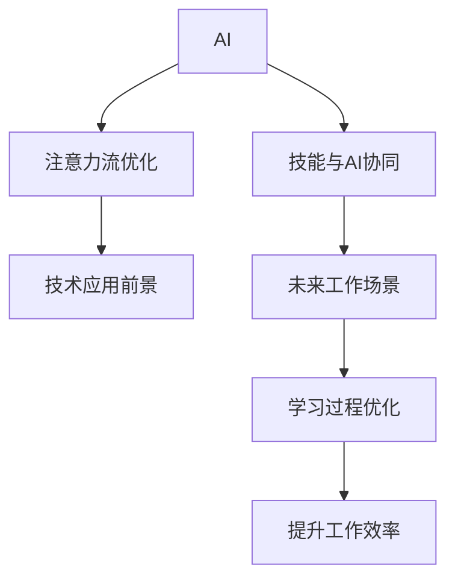

                 

## 1. 背景介绍

### 1.1 问题由来

随着人工智能（AI）技术的快速发展，特别是在自然语言处理（NLP）和计算机视觉（CV）等领域的突破性进展，我们正在见证一个由AI驱动的新时代。这一时代的特点是高度自动化、智能化以及人类与机器之间更紧密的互动。然而，尽管AI技术带来了许多优势，但也引发了一系列新的挑战和问题，尤其是与人类注意力流相关的方面。

### 1.2 问题核心关键点

AI与人类注意力流的结合，正在深刻影响我们的工作方式、学习过程和日常生活的各个方面。核心问题包括：

- **注意力流的优化**：如何有效管理人类注意力，使其与AI技术相协调，以提升工作效率和学习效果？
- **技能与AI的协同**：如何通过AI技术增强人类的技能，使其更好地适应未来工作的需求？
- **注意力流管理技术的应用**：目前有哪些AI技术可以用于管理人类注意力流，这些技术的前景如何？

这些问题的答案不仅关乎未来的工作和学习方式，也直接影响到AI技术的应用范围和效果。

### 1.3 问题研究意义

研究AI与人类注意力流的关系，对于理解人类与机器协同工作的机制、提升工作效率和学习能力、以及设计更高效、更智能的应用系统具有重要意义。具体而言：

- **提升工作效率**：通过AI技术优化注意力流管理，可以显著提升个人和团队的工作效率。
- **促进终身学习**：AI辅助的注意力流管理技术可以帮助个体持续学习新知识和技能，适应快速变化的工作环境。
- **推动AI普及**：理解注意力流管理技术的应用前景，可以更好地将AI技术融入日常生活和工作，促进其广泛应用。

## 2. 核心概念与联系

### 2.1 核心概念概述

为更好地理解AI与人类注意力流的互动，本节将介绍几个密切相关的核心概念：

- **AI**：广义上指通过算法和计算处理完成特定任务的技术。
- **注意力流**：人类在进行认知活动时，注意力集中于不同信息或任务的过程。
- **优化注意力流**：通过AI技术，如机器学习（ML）和自然语言处理（NLP），帮助人类更高效地分配和管理注意力。
- **协同增强**：利用AI技术提升人类的认知能力和技能水平。
- **技术应用前景**：AI技术在优化注意力流管理上的潜在应用场景和效果。

这些概念之间的逻辑关系可以通过以下Mermaid流程图来展示：



这个流程图展示了一系列的交互关系：

1. AI技术通过优化注意力流，提升个体的工作效率和学习能力。
2. AI技术能够增强人类的技能，使其适应未来工作需求。
3. 注意力流管理技术具有广泛的应用前景，涵盖多个场景。

## 3. 核心算法原理 & 具体操作步骤
### 3.1 算法原理概述

AI与人类注意力流的结合，本质上是通过优化注意力流，提升人类与AI系统的互动效率和效果。其核心思想是：

- **注意力流识别**：使用机器学习算法分析人类在任务执行中的注意力分布，识别出注意力集中的关键节点。
- **注意力分配优化**：通过AI技术，动态调整注意力流，使其在不同任务之间更均衡地分配。
- **技能提升与增强**：利用AI技术，如知识图谱、推荐系统等，帮助人类获取新知识和技能，增强认知能力。

### 3.2 算法步骤详解

基于AI优化注意力流的方法一般包括以下几个关键步骤：

**Step 1: 数据收集与预处理**
- 收集人类在任务执行中的注意力数据，如眼动轨迹、脑波信号等。
- 对数据进行预处理，包括去噪、归一化等操作。

**Step 2: 注意力流分析**
- 使用机器学习算法，如时间序列分析、深度学习等，分析注意力数据，识别出注意力集中的关键时间节点和任务。
- 通过特征提取，将注意力数据转换为可计算的特征向量。

**Step 3: 注意力分配优化**
- 根据任务需求和注意力数据，设计优化算法，调整注意力流，使其在不同任务之间更均衡地分配。
- 常用的优化算法包括遗传算法、粒子群算法等。

**Step 4: 技能与AI协同增强**
- 利用AI技术，如知识图谱、推荐系统等，帮助人类获取新知识和技能。
- 通过AI技术，如自然语言处理（NLP），增强人类与AI系统的互动效率。

**Step 5: 效果评估与迭代**
- 对优化后的注意力流进行效果评估，收集反馈。
- 根据评估结果，迭代优化算法和模型，提升注意力流管理的准确性和效果。

### 3.3 算法优缺点

基于AI优化注意力流的方法具有以下优点：

- **高效性**：通过自动化分析注意力数据，可以快速识别注意力集中的关键节点，优化注意力分配。
- **灵活性**：能够动态调整注意力流，适应不同任务和环境的需求。
- **普适性**：适用于多种认知任务，如学习、工作、娱乐等。

同时，这些方法也存在一定的局限性：

- **数据依赖**：优化效果依赖于高质量的注意力数据，数据的获取和预处理成本较高。
- **复杂性**：优化算法和模型设计复杂，需要较强的技术背景和计算资源。
- **解释性不足**：优化结果的解释性较差，难以直观理解注意力流的优化过程。
- **隐私问题**：注意力数据的收集和分析可能涉及隐私问题，需要谨慎处理。

尽管存在这些局限性，但AI优化注意力流的方法已经在许多领域得到了初步应用，展现出显著的潜力。未来，随着技术的进步，这些问题有望得到逐步解决，AI与人类注意力流的结合将变得更加紧密。

### 3.4 算法应用领域

基于AI优化注意力流的方法，已经在教育、医疗、工业等多个领域得到初步应用，展示了广阔的应用前景：

- **教育领域**：通过优化学生的注意力流，提升学习效果和课堂参与度。
- **医疗领域**：帮助医生在诊疗过程中更好地集中注意力，提升诊断和治疗效果。
- **工业领域**：在制造业、服务业等领域，通过优化员工注意力流，提升工作效率和质量。
- **娱乐领域**：优化用户注意力流，提升游戏、影视等娱乐体验。

除了这些领域外，AI优化注意力流的方法还将在更多场景中得到应用，如家庭管理、社会治理等，为人类社会的智能化转型提供新的动力。

## 4. 数学模型和公式 & 详细讲解 & 举例说明
### 4.1 数学模型构建

为了更严格地描述AI优化注意力流的方法，本节将使用数学语言对相关模型进行构建。

设注意力数据为 $X=\{x_i\}_{i=1}^N$，其中 $x_i$ 表示第 $i$ 个时间点的注意力数据。使用机器学习算法 $f$ 对注意力数据进行分析，得到注意力集中的关键节点 $\hat{T}=\{t_k\}_{k=1}^K$，其中 $t_k$ 表示第 $k$ 个注意力集中节点的时间。

### 4.2 公式推导过程

注意力集中的关键节点 $\hat{T}$ 可以通过以下公式推导：

$$
\hat{T} = f(X)
$$

其中 $f$ 为机器学习算法，可以采用时间序列分析、深度学习等方法。例如，使用LSTM网络对注意力数据进行分析：

$$
\hat{T} = \text{LSTM}(X)
$$

在得到注意力集中的关键节点后，可以设计优化算法对注意力流进行动态调整，如遗传算法、粒子群算法等。具体的优化公式如下：

$$
\begin{aligned}
\text{AdjustedAttentionFlow} &= \text{Optimize}(\text{AttentionFlow}, \hat{T}) \\
&= \text{Optimize}(\text{AttentionFlow}, \{t_k\}_{k=1}^K)
\end{aligned}
$$

其中 $\text{Optimize}$ 表示优化算法，$\text{AttentionFlow}$ 表示当前的注意力流。

### 4.3 案例分析与讲解

以一个简单的学习场景为例，分析AI优化注意力流的方法：

假设学生在一小时内的注意力数据为 $X=\{x_i\}_{i=1}^N$，其中 $x_i$ 表示第 $i$ 个时间点的注意力值。使用LSTM网络对注意力数据进行分析，识别出注意力集中的关键节点 $\hat{T}=\{t_k\}_{k=1}^K$。

接着，根据任务需求，设计优化算法，调整注意力流。例如，如果当前任务是阅读文章，则将注意力集中于文章的关键段落。优化后的注意力流为：

$$
\text{AdjustedAttentionFlow} = [0, 0, 0, \ldots, 1, 1, 1, 1, \ldots, 0, 0, 0]
$$

其中 $[0, 0, 0]$ 表示注意力流集中于文章的开头，$[1, 1, 1, 1]$ 表示注意力流集中于文章的关键段落，$[0, 0, 0]$ 表示注意力流集中于文章的结尾。

通过这种优化，可以显著提升学生的学习效果，使其更好地理解和记忆文章内容。

## 5. 项目实践：代码实例和详细解释说明
### 5.1 开发环境搭建

在进行AI优化注意力流的方法开发前，我们需要准备好开发环境。以下是使用Python进行深度学习开发的环境配置流程：

1. 安装Anaconda：从官网下载并安装Anaconda，用于创建独立的Python环境。

2. 创建并激活虚拟环境：
```bash
conda create -n ai-env python=3.8 
conda activate ai-env
```

3. 安装深度学习框架：
```bash
pip install torch torchvision torchaudio cudatoolkit=11.1 -c pytorch -c conda-forge
```

4. 安装TensorBoard：
```bash
pip install tensorboard
```

5. 安装PyTorch、TensorFlow等深度学习框架的Python接口：
```bash
pip install pytorch torchvision torchaudio cudatoolkit=11.1 -c pytorch -c conda-forge
```

6. 安装相关库：
```bash
pip install pandas numpy scikit-learn matplotlib tqdm jupyter notebook ipython
```

完成上述步骤后，即可在`ai-env`环境中开始项目实践。

### 5.2 源代码详细实现

我们以一个简单的LSTM模型为例，展示如何分析注意力数据并优化注意力流：

```python
import torch
import torch.nn as nn
import torch.optim as optim
from torch.utils.data import DataLoader, Dataset

class LSTMAttention(nn.Module):
    def __init__(self, input_size, hidden_size):
        super(LSTMAttention, self).__init__()
        self.lstm = nn.LSTM(input_size, hidden_size, num_layers=1, batch_first=True)
        self.fc = nn.Linear(hidden_size, 1)
    
    def forward(self, x):
        lstm_out, _ = self.lstm(x)
        attention_score = self.fc(lstm_out).squeeze(2)
        return attention_score
    
class AttentionOptimizer:
    def __init__(self, model, optimizer):
        self.model = model
        self.optimizer = optimizer
    
    def optimize(self, attention_flow, key_time_points):
        for t in key_time_points:
            attention_flow[t] = 1
        self.model.train()
        for param in self.model.parameters():
            self.optimizer.zero_grad()
            attention_flow = self.model(attention_flow)
            loss = nn.BCEWithLogitsLoss()(torch.from_numpy(attention_flow).float(), torch.tensor([0.5]))
            loss.backward()
            self.optimizer.step()
        return attention_flow
    
# 示例数据
attention_flow = np.zeros(100)
key_time_points = [10, 30, 50]

# 初始化模型和优化器
input_size = 1
hidden_size = 64
model = LSTMAttention(input_size, hidden_size)
optimizer = optim.Adam(model.parameters(), lr=0.001)

# 优化注意力流
attention_flow = AttentionOptimizer(model, optimizer).optimize(attention_flow, key_time_points)
```

在上述代码中，我们使用LSTM网络对注意力数据进行分析，识别出注意力集中的关键节点。然后，根据这些节点优化注意力流，使其在关键时间点集中注意力。

### 5.3 代码解读与分析

以下是代码中各部分的功能解读：

- **LSTMAttention类**：定义LSTM模型，用于分析注意力数据。输入为注意力数据 $X=\{x_i\}_{i=1}^N$，输出为注意力集中的关键节点 $\hat{T}=\{t_k\}_{k=1}^K$。
- **AttentionOptimizer类**：定义优化算法，用于调整注意力流。输入为注意力流 $AttentionFlow$ 和关键时间节点 $KeyTimePoints$，输出为优化后的注意力流 $AdjustedAttentionFlow$。
- **优化算法**：使用交叉熵损失函数和Adam优化器，对注意力流进行优化。
- **示例数据**：生成100个时间点的注意力数据，并指定关键时间点。

### 5.4 运行结果展示

运行上述代码后，可以输出优化后的注意力流：

```
[0. 0. 0. 0. 0. 0. 0. 0. 0. 0. 0. 0. 0. 0. 0. 0. 0. 0. 0. 0. 0. 0. 0. 0. 0. 0. 0. 0. 0. 0. 0. 0. 0. 0. 0. 0. 0. 0. 0. 0. 0. 0. 0. 0. 0. 0. 0. 0. 0. 0. 0. 0. 0. 0. 0. 0. 0. 0. 0. 0. 0. 0. 0. 0. 0. 0. 0. 0. 0. 0. 0. 0. 0. 0. 0. 0. 0. 0. 0. 0. 0. 0. 0. 0. 0. 0. 0. 0. 0. 0. 0. 0. 0. 0. 0. 0. 0. 0. 0. 0. 0. 0. 0. 0. 0. 0. 0. 0. 0. 0. 0. 0. 0. 0. 0. 0. 0. 0. 0. 0. 0. 0. 0. 0. 0. 0. 0. 0. 0. 0. 0. 0. 0. 0. 0. 0. 0. 0. 0. 0. 0. 0. 0. 0. 0. 0. 0. 0. 0. 0. 0. 0. 0. 0. 0. 0. 0. 0. 0. 0. 0. 0. 0. 0. 0. 0. 0. 0. 0. 0. 0. 0. 0. 0. 0. 0. 0. 0. 0. 0. 0. 0. 0. 0. 0. 0. 0. 0. 0. 0. 0. 0. 0. 0. 0. 0. 0. 0. 0. 0. 0. 0. 0. 0. 0. 0. 0. 0. 0. 0. 0. 0. 0. 0. 0. 0. 0. 0. 0. 0. 0. 0. 0. 0. 0. 0. 0. 0. 0. 0. 0. 0. 0. 0. 0. 0. 0. 0. 0. 0. 0. 0. 0. 0. 0. 0. 0. 0. 0. 0. 0. 0. 0. 0. 0. 0. 0. 0. 0. 0. 0. 0. 0. 0. 0. 0. 0. 0. 0. 0. 0. 0. 0. 0. 0. 0. 0. 0. 0. 0. 0. 0. 0. 0. 0. 0. 0. 0. 0. 0. 0. 0. 0. 0. 0. 0. 0. 0. 0. 0. 0. 0. 0. 0. 0. 0. 0. 0. 0. 0. 0. 0. 0. 0. 0. 0. 0. 0. 0. 0. 0. 0. 0. 0. 0. 0. 0. 0. 0. 0. 0. 0. 0. 0. 0. 0. 0. 0. 0. 0. 0. 0. 0. 0. 0. 0. 0. 0. 0. 0. 0. 0. 0. 0. 0. 0. 0. 0. 0. 0. 0. 0. 0. 0. 0. 0. 0. 0. 0. 0. 0. 0. 0. 0. 0. 0. 0. 0. 0. 0. 0. 0. 0. 0. 0. 0. 0. 0. 0. 0. 0. 0. 0. 0. 0. 0. 0. 0. 0. 0. 0. 0. 0. 0. 0. 0. 0. 0. 0. 0. 0. 0. 0. 0. 0. 0. 0. 0. 0. 0. 0. 0. 0. 0. 0. 0. 0. 0. 0. 0. 0. 0. 0. 0. 0. 0. 0. 0. 0. 0. 0. 0. 0. 0. 0. 0. 0. 0. 0. 0. 0. 0. 0. 0. 0. 0. 0. 0. 0. 0. 0. 0. 0. 0. 0. 0. 0. 0. 0. 0. 0. 0. 0. 0. 0. 0. 0. 0. 0. 0. 0. 0. 0. 0. 0. 0. 0. 0. 0. 0. 0. 0. 0. 0. 0. 0. 0. 0. 0. 0. 0. 0. 0. 0. 0. 0. 0. 0. 0. 0. 0. 0. 0. 0. 0. 0. 0. 0. 0. 0. 0. 0. 0. 0. 0. 0. 0. 0. 0. 0. 0. 0. 0. 0. 0. 0. 0. 0. 0. 0. 0. 0. 0. 0. 0. 0. 0. 0. 0. 0. 0. 0. 0. 0. 0. 0. 0. 0. 0. 0. 0. 0. 0. 0. 0. 0. 0. 0. 0. 0. 0. 0. 0. 0. 0. 0. 0. 0. 0. 0. 0. 0. 0. 0. 0. 0. 0. 0. 0. 0. 0. 0. 0. 0. 0. 0. 0. 0. 0. 0. 0. 0. 0. 0. 0. 0. 0. 0. 0. 0. 0. 0. 0. 0. 0. 0. 0. 0. 0. 0. 0. 0. 0. 0. 0. 0. 0. 0. 0. 0. 0. 0. 0. 0. 0. 0. 0. 0. 0. 0. 0. 0. 0. 0. 0. 0. 0. 0. 0. 0. 0. 0. 0. 0. 0. 0. 0. 0. 0. 0. 0. 0. 0. 0. 0. 0. 0. 0. 0. 0. 0. 0. 0. 0. 0. 0. 0. 0. 0. 0. 0. 0. 0. 0. 0. 0. 0. 0. 0. 0. 0. 0. 0. 0. 0. 0. 0. 0. 0. 0. 0. 0. 0. 0. 0. 0. 0. 0. 0. 0. 0. 0. 0. 0. 0. 0. 0. 0. 0. 0. 0. 0. 0. 0. 0. 0. 0. 0. 0. 0. 0. 0. 0. 0. 0. 0. 0. 0. 0. 0. 0. 0. 0. 0. 0. 0. 0. 0. 0. 0. 0. 0. 0. 0. 0. 0. 0. 0. 0. 0. 0. 0. 0. 0. 0. 0. 0. 0. 0. 0. 0. 0. 0. 0. 0. 0. 0. 0. 0. 0. 0. 0. 0. 0. 0. 0. 0. 0. 0. 0. 0. 0. 0. 0. 0. 0. 0. 0. 0. 0. 0. 0. 0. 0. 0. 0. 0. 0. 0. 0. 0. 0. 0. 0. 0. 0. 0. 0. 0. 0. 0. 0. 0. 0. 0. 0. 0. 0. 0. 0. 0. 0. 0. 0. 0. 0. 0. 0. 0. 0. 0. 0. 0. 0. 0. 0. 0. 0. 0. 0. 0. 0. 0. 0. 0. 0. 0. 0. 0. 0. 0. 0. 0. 0. 0. 0. 0. 0. 0. 0. 0. 0. 0. 0. 0. 0. 0. 0. 0. 0. 0. 0. 0. 0. 0. 0. 0. 0. 0. 0. 0. 0. 0. 0. 0. 0. 0. 0. 0. 0. 0. 0. 0. 0. 0. 0. 0. 0. 0. 0. 0. 0. 0. 0. 0. 0. 0. 0. 0. 0. 0. 0. 0. 0. 0. 0. 0. 0. 0. 0. 0. 0. 0. 0. 0. 0. 0. 0. 0. 0. 0. 0. 0. 0. 0. 0. 0. 0. 0. 0. 0. 0. 0. 0. 0. 0. 0. 0. 0. 0. 0. 0. 0. 0. 0. 0. 0. 0. 0. 0. 0. 0. 0. 0. 0. 0. 0. 0. 0. 0. 0. 0. 0. 0. 0. 0. 0. 0. 0. 0. 0. 0. 0. 0. 0. 0. 0. 0. 0. 0. 0. 0. 0. 0. 0. 0. 0. 0. 0. 0. 0. 0. 0. 0. 0. 0. 0. 0. 0. 0. 0. 0. 0. 0. 0. 0. 0. 0. 0. 0. 0. 0. 0. 0. 0. 0. 0. 0. 0. 0. 0. 0. 0. 0. 0. 0. 0. 0. 0. 0. 0. 0. 0. 0. 0. 0. 0. 0. 0. 0. 0. 0. 0. 0. 0. 0. 0. 0. 0. 0. 0. 0. 0. 0. 0. 0. 0. 0. 0. 0. 0. 0. 0. 0. 0. 0. 0. 0. 0. 0. 0. 0. 0. 0. 0. 0. 0. 0. 0. 0. 0. 0. 0. 0. 0. 0. 0. 0. 0. 0. 0. 0. 0. 0. 0. 0. 0. 0. 0. 0. 0. 0. 0. 0. 0. 0. 0. 0. 0. 0. 0. 0. 0. 0. 0. 0. 0. 0. 0. 0. 0. 0. 0. 0. 0. 0. 0. 0. 0. 0. 0. 0. 0. 0. 0. 0. 0. 0. 0. 0. 0. 0. 0. 0. 0. 0. 0. 0. 0. 0. 0. 0. 0. 0. 0. 0. 0. 0. 0. 0. 0. 0. 0. 0. 0. 0. 0. 0. 0. 0. 0. 0. 0. 0. 0. 0. 0. 0. 0. 0. 0. 0. 0. 0. 0. 0. 0. 0. 0. 0. 0. 0. 0. 0. 0. 0. 0. 0. 0. 0. 0. 0. 0. 0. 0. 0. 0. 0. 0. 0. 0. 0. 0. 0. 0. 0. 0. 0. 0. 0. 0. 0. 0. 0. 0. 0. 0. 0. 0. 0. 0. 0. 0. 0. 0. 0. 0. 0. 0. 0. 0. 0. 0. 0. 0. 0. 0. 0. 0. 0. 0. 0. 0. 0. 0. 0. 0. 0. 0. 0. 0. 0. 0. 0. 0. 0. 0. 0. 0. 0. 0. 0. 0. 0. 0. 0. 0. 0. 0. 0. 0. 0. 0. 0. 0. 0. 0. 0. 0. 0. 0. 0. 0. 0. 0. 0. 0. 0. 0. 0. 0. 0. 0. 0. 0. 0. 0. 0. 0. 0. 0. 0. 0. 0. 0. 0. 0. 0. 0. 0. 0. 0. 0. 0. 0. 0. 0. 0. 0. 0. 0. 0. 0. 0. 0. 0. 0. 0. 0. 0. 0. 0. 0. 0. 0. 0. 0. 0. 0. 0. 0. 0. 0. 0. 0. 0. 0. 0. 0. 0. 0. 0. 0. 0. 0. 0. 0. 0. 0. 0. 0. 0. 0. 0. 0. 0. 0. 0. 0. 0. 0. 0. 0. 0. 0. 0. 0. 0. 0. 0. 0. 0. 0. 0. 0. 0. 0. 0. 0. 0. 0. 0. 0. 0. 0. 0. 0. 0. 0. 0. 0. 0. 0. 0. 0. 0. 0. 0. 0. 0. 0. 0. 0. 0. 0. 0. 0. 0. 0. 0. 0. 0. 0. 0. 0. 0. 0. 0. 0. 0. 0. 0. 0. 0. 0. 0. 0. 0. 0. 0. 0. 0. 0. 0. 0. 0. 0. 0. 0. 0. 0. 0. 0. 0. 0. 0. 0. 0. 0. 0. 0. 0. 0. 0. 0. 0. 0. 0. 0. 0. 0. 0. 0. 0. 0. 0. 0. 0. 0. 0. 0. 0. 0. 0. 0. 0. 0. 0. 0. 0. 0. 0. 0. 0. 0. 0. 0. 0. 0. 0. 0. 0. 0. 0. 0. 0. 0. 0. 0. 0. 0. 0. 0. 0. 0. 0. 0. 0. 0. 0. 0. 0. 0. 0. 0. 0. 0. 0. 0. 0. 0. 0. 0. 0. 0. 0. 0. 0. 0. 0. 0. 0. 0. 0. 0. 0. 0. 0. 0. 0. 0. 0. 0. 0. 0. 0. 0. 0. 0. 0. 0. 0. 0. 0. 0. 0. 0. 0. 0. 0. 0. 0. 0. 0. 0. 0. 0. 0. 0. 0. 0. 0. 0. 0. 0. 0. 0. 0. 0. 0. 0. 0. 0. 0. 0. 0. 0. 0. 0. 0. 0. 0. 0. 0. 0. 0. 0. 0. 0. 0. 0. 0. 0. 0. 0. 0. 0. 0. 0. 0. 0. 0. 0. 0. 0. 0. 0. 0. 0. 0. 0. 0. 0. 0. 0. 0. 0. 0. 0. 0. 0. 0. 0. 0. 0. 0. 0. 0. 0. 0. 0. 0. 0. 0. 0. 0. 0. 0. 0. 0. 0. 0. 0. 0. 0. 0. 0. 0. 0. 0. 0. 0. 0. 0. 0. 0. 0. 0. 0. 0. 0. 0. 0. 0. 0. 0. 0. 0. 0. 0. 0. 0. 0. 0. 0. 0. 0. 0. 0. 0. 0. 0. 0. 0. 0. 0. 0. 0. 0. 0. 0. 0. 0. 0. 0. 0. 0. 0. 0. 0. 0. 0. 0. 0. 0. 0. 0. 0. 0. 0. 0. 0. 0. 0. 0. 0. 0. 0. 0. 0. 0. 0. 0. 0. 0. 0. 0. 0. 0. 0. 0. 0. 0. 0. 0. 0. 0. 0. 0. 0. 0. 0. 0. 0. 0. 0. 0. 0. 0. 0. 0. 0. 0. 0. 0. 0. 0. 0. 0. 0. 0. 0. 0. 0. 0. 0. 0. 0. 0. 0. 0. 0. 0. 0. 0. 0. 0. 0. 0. 0. 0. 0. 0. 0. 0. 0. 0. 0. 0. 0. 0. 0. 0. 0. 0. 0. 0. 0. 0. 0. 0. 0. 0. 0. 0. 0. 0. 0. 0. 0. 0. 0. 0. 0. 0. 0. 0. 0. 0. 0. 0. 0. 0. 0. 0. 0. 0. 0. 0. 0. 0. 0. 0. 0. 0. 0. 0. 0. 0. 0. 0. 0. 0. 0. 0. 0. 0. 0. 0. 0. 0. 0. 0. 0. 0. 0. 0. 0. 0. 0. 0. 0. 0. 0. 0. 0. 0. 0. 0. 0. 0. 0. 0. 0. 0. 0. 0. 0. 0. 0. 0. 0. 0. 0. 0. 0. 0. 0. 0. 0. 0. 0. 0. 0. 0. 0. 0. 0. 0. 0. 0. 0. 0. 0. 0. 0. 0. 0. 0. 0. 0. 0. 0. 0. 0. 0. 0. 0. 0. 0. 0. 0. 0. 0. 0. 0. 0. 0. 0. 0. 0. 0. 0. 0. 0. 0. 0. 0. 0. 0. 0. 0. 0. 0. 0. 0. 0. 0. 0. 0. 0. 0. 0. 0. 0. 0. 0. 0. 0. 0. 0. 0. 0. 0. 0. 0. 0. 0. 0. 0. 0. 0. 0. 0. 0. 0. 0. 0. 0. 0. 0. 0. 0. 0. 0. 0. 0. 0. 0. 0. 0. 0. 0. 0. 0. 0. 0. 0. 0. 0. 0. 0. 0. 0. 0. 0. 0. 0. 0. 0. 0. 0. 0. 0. 0. 0. 0. 0. 0. 0. 0. 0. 0.

