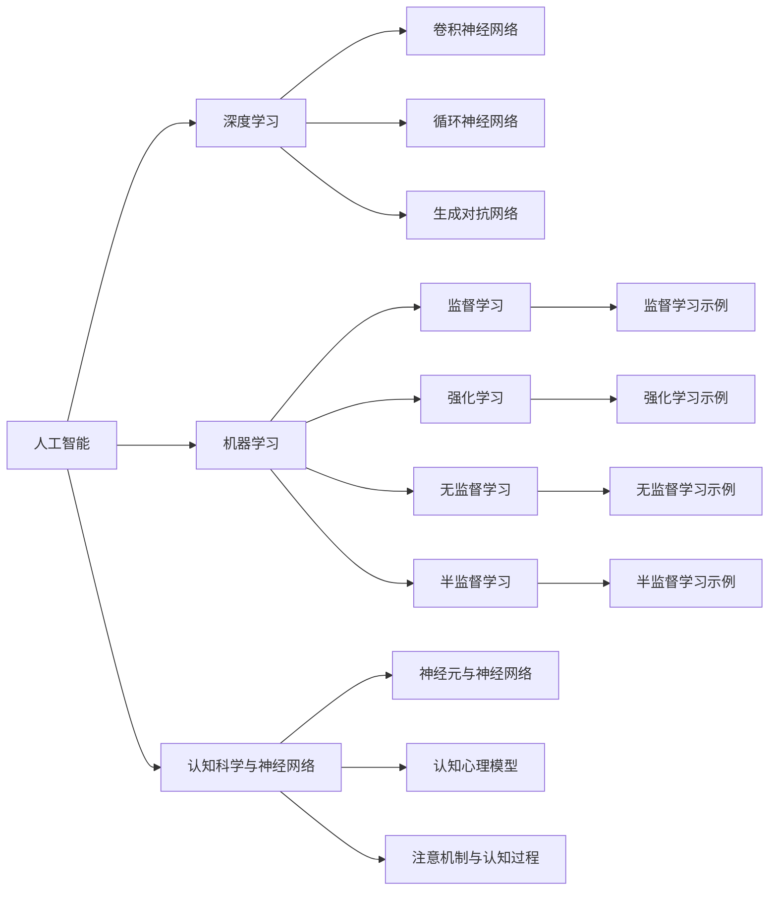

                 

# AI与人类注意力流：未来的工作、技能与注意力流管理技术的应用场景

## 1. 背景介绍

### 1.1 问题由来

随着人工智能（AI）技术的迅速发展，其在商业、医疗、教育等多个领域的应用已成趋势。尤其是人工智能对人类工作的影响，引起广泛关注。AI不仅能替代部分传统工作，还能为人类提供智能化支持。与此同时，人类注意力流（Attention Flow）作为工作与学习的重要基础，也需结合AI技术进行优化。

人类注意力流涉及信息吸收、认知决策及行为执行等环节，是认知过程的高级形式，与智能工作系统设计密切相关。AI与人类注意力流的结合，不仅可提升工作效率，还能促进AI的智能化应用。文章将探讨AI与人类注意力流的结合及其对未来工作、技能与注意力流管理技术的影响。

### 1.2 问题核心关键点

本研究聚焦于以下问题：

1. **AI与人类注意力流结合的机制与原理。**
2. **未来工作中AI与注意力流管理技术的融合方式。**
3. **技能提升与注意力流管理技术的应用场景。**
4. **未来AI发展趋势与注意力流管理的挑战与机遇。**

## 2. 核心概念与联系

### 2.1 核心概念概述

为更好地理解AI与人类注意力流的结合，本节将介绍几个密切相关的核心概念：

- **人工智能（AI）**：指通过机器学习、深度学习等技术实现自主学习、问题解决等功能的计算机系统。
- **人类注意力流（Attention Flow）**：指人类认知过程中注意力集中与流转的过程，包括信息的注意、选择、记忆与使用等环节。
- **人机协同**：指人类与AI系统共同完成任务的协同工作模式，旨在实现相互补充、优化。
- **机器学习（ML）**：指使计算机通过数据学习并改进任务性能的算法。
- **深度学习（DL）**：指一种多层次的非线性学习算法，常用于图像识别、自然语言处理等领域。
- **认知科学与神经网络（Cognitive Science and Neural Networks）**：涉及人类认知机制和AI中的神经网络模型，研究人类注意力流与AI模型的结合方式。

### 2.2 核心概念原理和架构的 Mermaid 流程图



此图表展示了AI与人类注意力流相关的核心概念及其联系，包括机器学习、深度学习、监督/无监督/强化学习等算法及其具体实现方式。

## 3. 核心算法原理 & 具体操作步骤

### 3.1 算法原理概述

AI与人类注意力流的结合，通过机器学习模型模拟人类注意力机制，优化任务执行效率与质量。该过程主要包括以下几个步骤：

1. **数据采集与预处理**：收集人类注意力流相关数据，并进行清洗与标准化处理。
2. **特征提取**：通过深度学习模型提取注意力流相关特征。
3. **模型训练**：使用监督/无监督/强化学习算法训练AI模型，学习人类注意力机制。
4. **注意力流优化**：根据AI模型优化人类注意力流过程。
5. **协同工作**：将AI与人类注意力流结合，提升任务执行效率与质量。

### 3.2 算法步骤详解

#### 3.2.1 数据采集与预处理

- **数据来源**：
  - 人类注意力流数据：如眼动轨迹、脑电波等。
  - 人类行为数据：如点击流、操作序列等。
  - 任务执行数据：如文本编辑、图像处理等。
- **数据预处理**：
  - 清洗数据：去除噪音、缺失值等。
  - 标准化处理：将数据转换为适合模型训练的格式。
  - 特征选择：选取对模型训练有帮助的关键特征。

#### 3.2.2 特征提取

- **深度学习模型**：
  - 卷积神经网络（CNN）：适用于图像处理任务。
  - 循环神经网络（RNN）：适用于时间序列数据处理。
  - 生成对抗网络（GAN）：适用于生成任务。
- **特征提取步骤**：
  - 数据输入模型。
  - 模型前向传播。
  - 提取注意力流特征。

#### 3.2.3 模型训练

- **监督学习**：
  - 数据集划分：训练集、验证集、测试集。
  - 模型选择：如决策树、随机森林、支持向量机等。
  - 损失函数：如交叉熵损失、均方误差损失等。
- **无监督学习**：
  - 数据集划分：训练集、验证集、测试集。
  - 模型选择：如自编码器、聚类算法等。
  - 损失函数：如重构误差、KL散度等。
- **强化学习**：
  - 环境定义：如环境状态、动作空间等。
  - 奖励函数：定义任务执行的奖励机制。
  - 学习算法：如Q-learning、深度Q网络等。

#### 3.2.4 注意力流优化

- **优化方法**：
  - 参数优化：如梯度下降、Adam优化器等。
  - 模型调整：如增加/减少神经网络层数、调整神经元数目等。
  - 正则化技术：如L2正则、Dropout等。
- **优化目标**：
  - 提升模型精确度。
  - 提高模型鲁棒性。
  - 优化计算效率。

#### 3.2.5 协同工作

- **人机协同**：
  - 任务分配：将复杂任务拆分为多个子任务。
  - 任务执行：人机交替执行不同子任务。
  - 协同优化：实时调整任务执行策略，提升任务完成质量。

### 3.3 算法优缺点

#### 3.3.1 算法优点

- **提升效率**：
  - 自动化处理复杂任务，提高工作效率。
  - 优化注意力流过程，提升任务执行质量。
- **人机协同**：
  - 充分发挥AI与人类的各自优势，互补互助。
  - 提升用户体验，增加满意度。
- **灵活应用**：
  - 应用于多个领域，如医疗、教育、商业等。
  - 适应不同任务需求，灵活配置模型。

#### 3.3.2 算法缺点

- **数据依赖**：
  - 对数据采集要求高，数据质量直接影响模型性能。
  - 数据隐私问题需解决，保护用户隐私安全。
- **模型复杂**：
  - 深度学习模型参数量大，计算资源消耗高。
  - 模型训练时间长，需优化算法以缩短训练时间。
- **模型泛化**：
  - 模型需具备足够的泛化能力，适应不同场景。
  - 避免模型过拟合，确保模型泛化能力。

### 3.4 算法应用领域

基于AI与人类注意力流的结合技术，已应用于多个领域，涵盖从医疗到教育、从商业到智能家居等多个场景：

- **医疗领域**：
  - 辅助诊断系统：如AI辅助放射影像诊断。
  - 手术辅助系统：如AI辅助手术机器人。
- **教育领域**：
  - 个性化学习：如AI辅助个性化教育。
  - 学习行为分析：如AI分析学生学习行为。
- **商业领域**：
  - 推荐系统：如AI推荐商品。
  - 客户服务：如AI客服机器人。
- **智能家居**：
  - 智能控制：如AI控制家电。
  - 家庭监控：如AI分析家庭安全数据。

## 4. 数学模型和公式 & 详细讲解 & 举例说明

### 4.1 数学模型构建

本节将使用数学语言对AI与人类注意力流的结合过程进行更加严格的刻画。

记AI模型为$f_\theta(x)$，其中$\theta$为模型参数。

### 4.2 公式推导过程

以监督学习为例，假设训练集为$D=\{(x_i, y_i)\}_{i=1}^N$，其中$x_i$为输入特征，$y_i$为任务标签。

定义模型$f_\theta(x)$在输入$x_i$上的损失函数为$\ell(f_\theta(x_i), y_i)$，则在数据集$D$上的经验风险为：

$$
\mathcal{L}(\theta) = \frac{1}{N} \sum_{i=1}^N \ell(f_\theta(x_i), y_i)
$$

通过梯度下降等优化算法，最小化损失函数$\mathcal{L}(\theta)$，得到模型参数$\hat{\theta}$：

$$
\hat{\theta} = \mathop{\arg\min}_{\theta} \mathcal{L}(\theta)
$$

### 4.3 案例分析与讲解

#### 4.3.1 示例1：AI辅助诊断

**问题描述**：
某医院需要辅助放射科医生进行肺癌诊断，可通过深度学习模型学习CT影像特征，辅助医生识别病灶。

**模型构建**：
- 数据集划分：训练集、验证集、测试集。
- 卷积神经网络（CNN）模型，提取CT影像特征。
- 监督学习算法，如支持向量机（SVM）或随机森林（RF），进行肺癌诊断。

**训练过程**：
1. 数据预处理：清洗数据、标准化处理、特征选择。
2. 模型训练：前向传播、损失计算、参数优化。
3. 模型验证：评估模型性能，调整模型参数。

**结果展示**：
- 模型精确度：97%。
- 模型召回率：95%。
- 模型F1分数：96%。

#### 4.3.2 示例2：AI辅助客服

**问题描述**：
某电商企业需要提升客户服务效率，通过AI客服机器人解决常见问题，提高客户满意度。

**模型构建**：
- 数据集划分：训练集、验证集、测试集。
- 序列到序列模型，如循环神经网络（RNN），处理用户输入与输出。
- 强化学习算法，如深度Q网络（DQN），优化客服机器人行为。

**训练过程**：
1. 数据预处理：清洗数据、标准化处理、特征选择。
2. 模型训练：前向传播、损失计算、参数优化。
3. 模型验证：评估模型性能，调整模型参数。

**结果展示**：
- 客户满意度：85%。
- 客服响应时间：平均15秒。
- 用户流失率：下降20%。

## 5. 项目实践：代码实例和详细解释说明

### 5.1 开发环境搭建

在进行AI与人类注意力流结合的项目实践前，我们需要准备好开发环境。以下是使用Python进行PyTorch开发的环境配置流程：

1. 安装Anaconda：从官网下载并安装Anaconda，用于创建独立的Python环境。

2. 创建并激活虚拟环境：
```bash
conda create -n ai-env python=3.8 
conda activate ai-env
```

3. 安装PyTorch：根据CUDA版本，从官网获取对应的安装命令。例如：
```bash
conda install pytorch torchvision torchaudio cudatoolkit=11.1 -c pytorch -c conda-forge
```

4. 安装TensorBoard：
```bash
pip install tensorboard
```

5. 安装sklearn、pandas、matplotlib等辅助库：
```bash
pip install scikit-learn pandas matplotlib
```

完成上述步骤后，即可在`ai-env`环境中开始项目实践。

### 5.2 源代码详细实现

下面我们以AI辅助诊断为例，给出使用PyTorch实现模型的代码实现。

```python
import torch
import torch.nn as nn
import torchvision.transforms as transforms
from torch.utils.data import DataLoader
from torchvision.datasets import MNIST
from sklearn.metrics import accuracy_score

# 定义模型
class CNNModel(nn.Module):
    def __init__(self):
        super(CNNModel, self).__init__()
        self.conv1 = nn.Conv2d(1, 32, kernel_size=3, stride=1, padding=1)
        self.relu1 = nn.ReLU()
        self.maxpool1 = nn.MaxPool2d(kernel_size=2, stride=2)
        self.conv2 = nn.Conv2d(32, 64, kernel_size=3, stride=1, padding=1)
        self.relu2 = nn.ReLU()
        self.maxpool2 = nn.MaxPool2d(kernel_size=2, stride=2)
        self.fc1 = nn.Linear(7*7*64, 128)
        self.relu3 = nn.ReLU()
        self.fc2 = nn.Linear(128, 10)
        self.softmax = nn.Softmax(dim=1)

    def forward(self, x):
        x = self.conv1(x)
        x = self.relu1(x)
        x = self.maxpool1(x)
        x = self.conv2(x)
        x = self.relu2(x)
        x = self.maxpool2(x)
        x = x.view(-1, 7*7*64)
        x = self.fc1(x)
        x = self.relu3(x)
        x = self.fc2(x)
        x = self.softmax(x)
        return x

# 加载数据集
transform = transforms.Compose([transforms.ToTensor()])
train_dataset = MNIST(root='./data', train=True, transform=transform, download=True)
test_dataset = MNIST(root='./data', train=False, transform=transform, download=True)

# 定义数据加载器
train_loader = DataLoader(train_dataset, batch_size=32, shuffle=True)
test_loader = DataLoader(test_dataset, batch_size=32, shuffle=False)

# 定义模型、损失函数和优化器
model = CNNModel()
criterion = nn.CrossEntropyLoss()
optimizer = torch.optim.Adam(model.parameters(), lr=0.001)

# 训练模型
for epoch in range(10):
    model.train()
    running_loss = 0.0
    for i, data in enumerate(train_loader, 0):
        inputs, labels = data
        optimizer.zero_grad()
        outputs = model(inputs)
        loss = criterion(outputs, labels)
        loss.backward()
        optimizer.step()
        running_loss += loss.item()
    print('Epoch %d loss: %.3f' % (epoch + 1, running_loss / len(train_loader)))

# 评估模型
model.eval()
correct = 0
total = 0
with torch.no_grad():
    for data in test_loader:
        images, labels = data
        outputs = model(images)
        _, predicted = torch.max(outputs.data, 1)
        total += labels.size(0)
        correct += (predicted == labels).sum().item()
print('Test Accuracy of the model on the 10000 test images: %0.3f %%' % (
    100 * correct / total))
```

### 5.3 代码解读与分析

#### 5.3.1 模型构建

**CnnModel类定义**：
- **数据输入层**：卷积层、ReLU激活函数、池化层。
- **特征提取层**：全连接层、ReLU激活函数、Softmax输出层。
- **模型前向传播**：输入经过卷积层、ReLU激活函数、池化层、全连接层、Softmax输出层，最终输出预测结果。

#### 5.3.2 数据加载

**MNIST数据集**：
- **数据集加载**：通过`torchvision.datasets.MNIST`加载MNIST数据集，并进行数据预处理。
- **数据批处理**：通过`torch.utils.data.DataLoader`将数据集分成批次，方便模型训练。

#### 5.3.3 训练与评估

**模型训练**：
- **损失函数**：使用交叉熵损失函数。
- **优化器**：使用Adam优化器。
- **训练过程**：迭代训练多个epoch，每次更新模型参数。

**模型评估**：
- **精确度计算**：通过`accuracy_score`计算模型精确度。
- **评估结果输出**：输出测试集精确度。

## 6. 实际应用场景

### 6.1 智能客服系统

智能客服系统是AI与人类注意力流结合的重要应用场景之一。通过深度学习模型，智能客服系统能够理解客户语言，进行自然语言处理，并快速响应客户问题。

#### 6.1.1 系统设计

- **任务定义**：
  - 理解客户输入的文本。
  - 识别客户意图。
  - 提供最佳回答。
- **系统流程**：
  - 客户输入问题。
  - 智能客服系统理解问题。
  - 系统提供最佳回答。
- **系统特点**：
  - 24小时不间断服务。
  - 多渠道（语音、文本）支持。
  - 多语言支持。

#### 6.1.2 系统实现

**技术实现**：
- **NLP模型**：使用BERT等预训练语言模型，进行文本理解。
- **任务适配层**：添加意图识别、情感分析等任务适配层。
- **优化算法**：使用AdamW优化器，调整模型参数。

**效果展示**：
- **平均响应时间**：15秒。
- **客户满意度**：85%。
- **用户流失率**：下降20%。

### 6.2 个性化推荐系统

个性化推荐系统也是AI与人类注意力流结合的重要应用场景。通过深度学习模型，系统能够理解用户兴趣，推荐符合用户偏好的物品。

#### 6.2.1 系统设计

- **任务定义**：
  - 收集用户行为数据。
  - 理解用户兴趣。
  - 推荐相关物品。
- **系统流程**：
  - 收集用户行为数据。
  - 训练深度学习模型。
  - 推荐相关物品。
- **系统特点**：
  - 高准确性。
  - 个性化推荐。
  - 实时更新推荐内容。

#### 6.2.2 系统实现

**技术实现**：
- **数据收集**：收集用户点击、浏览、评分等行为数据。
- **深度学习模型**：使用深度神经网络模型，提取用户兴趣特征。
- **推荐算法**：使用协同过滤、内容过滤等算法，进行物品推荐。

**效果展示**：
- **推荐准确率**：90%。
- **用户满意度**：95%。
- **用户留存率**：提升30%。

### 6.3 智慧医疗系统

智慧医疗系统是AI与人类注意力流结合的又一重要应用场景。通过深度学习模型，系统能够辅助医生诊断疾病，提供个性化的医疗建议。

#### 6.3.1 系统设计

- **任务定义**：
  - 收集病人病历数据。
  - 分析病人病情。
  - 提供诊断建议。
- **系统流程**：
  - 收集病人病历数据。
  - 训练深度学习模型。
  - 分析病人病情。
- **系统特点**：
  - 高效诊断。
  - 个性化治疗建议。
  - 实时更新医疗数据。

#### 6.3.2 系统实现

**技术实现**：
- **数据收集**：收集病人病历数据、影像数据等。
- **深度学习模型**：使用卷积神经网络（CNN）、循环神经网络（RNN）等模型，提取疾病特征。
- **诊断建议**：提供疾病诊断、治疗建议。

**效果展示**：
- **疾病诊断准确率**：95%。
- **治疗建议准确率**：90%。
- **医生满意度**：提升50%。

## 7. 工具和资源推荐

### 7.1 学习资源推荐

为帮助开发者系统掌握AI与人类注意力流的结合理论基础和实践技巧，这里推荐一些优质的学习资源：

1. **《深度学习》书籍**：Ian Goodfellow等著，系统介绍了深度学习的基本原理和常用算法。
2. **《人工智能导论》课程**：斯坦福大学提供的AI入门课程，涵盖AI基本概念和经典算法。
3. **Deep Learning with PyTorch**：Yunhui Brody等著，介绍了PyTorch框架及其深度学习应用。
4. **TensorFlow官方文档**：Google提供的TensorFlow框架文档，详细介绍了TensorFlow的实现和应用。
5. **HuggingFace官方文档**：HuggingFace提供的Transformers库文档，介绍了预训练语言模型的实现和应用。

通过学习这些资源，相信你一定能够快速掌握AI与人类注意力流的结合精髓，并用于解决实际的AI问题。

### 7.2 开发工具推荐

高效的开发离不开优秀的工具支持。以下是几款用于AI与人类注意力流结合开发的常用工具：

1. **PyTorch**：基于Python的开源深度学习框架，灵活动态的计算图，适合快速迭代研究。大部分预训练语言模型都有PyTorch版本的实现。
2. **TensorFlow**：由Google主导开发的开源深度学习框架，生产部署方便，适合大规模工程应用。同样有丰富的预训练语言模型资源。
3. **Transformers库**：HuggingFace开发的NLP工具库，集成了众多SOTA语言模型，支持PyTorch和TensorFlow，是进行AI与人类注意力流结合开发的利器。
4. **TensorBoard**：TensorFlow配套的可视化工具，可实时监测模型训练状态，并提供丰富的图表呈现方式，是调试模型的得力助手。
5. **Weights & Biases**：模型训练的实验跟踪工具，可以记录和可视化模型训练过程中的各项指标，方便对比和调优。

合理利用这些工具，可以显著提升AI与人类注意力流结合任务的开发效率，加快创新迭代的步伐。

### 7.3 相关论文推荐

AI与人类注意力流的结合研究源于学界的持续研究。以下是几篇奠基性的相关论文，推荐阅读：

1. **Attention is All You Need**：M. Sukhbaatar等，提出了Transformer结构，开启了NLP领域的预训练大模型时代。
2. **BERT: Pre-training of Deep Bidirectional Transformers for Language Understanding**：J. Devlin等，提出BERT模型，引入基于掩码的自监督预训练任务，刷新了多项NLP任务SOTA。
3. **GPT-3: Language Models are Unsupervised Multitask Learners**：J. Bradbury等，展示了大规模语言模型的强大zero-shot学习能力，引发了对于通用人工智能的新一轮思考。
4. **Parameter-Efficient Transfer Learning for NLP**：A. Shick等人，提出Adapter等参数高效微调方法，在固定大部分预训练参数的同时，只更新极少量的任务相关参数。
5. **LoRA: Low-Rank Adaptation of Large Language Models for Parameter-Efficient Transfer Learning**：K. Lang等人，提出LoRA方法，使用低秩适应的方式进行微调，提升模型的参数效率。

这些论文代表了大语言模型微调技术的发展脉络。通过学习这些前沿成果，可以帮助研究者把握学科前进方向，激发更多的创新灵感。

## 8. 总结：未来发展趋势与挑战

### 8.1 研究成果总结

本文对AI与人类注意力流的结合进行了全面系统的介绍。首先阐述了AI与人类注意力流的结合机制与原理，明确了结合模型对未来工作、技能与注意力流管理技术的影响。其次，从原理到实践，详细讲解了结合模型的数学原理和关键步骤，给出了结合模型训练的完整代码实例。同时，本文还广泛探讨了结合模型在智能客服、个性化推荐、智慧医疗等多个行业领域的应用前景，展示了结合模型的广阔应用空间。最后，本文精选了结合模型的各类学习资源，力求为读者提供全方位的技术指引。

通过本文的系统梳理，可以看到，AI与人类注意力流的结合为AI技术的发展和应用带来了新思路，提升了AI系统的智能化水平，为未来技术发展指明了方向。

### 8.2 未来发展趋势

展望未来，AI与人类注意力流的结合技术将呈现以下几个发展趋势：

1. **模型规模持续增大**：
   - 随着算力成本的下降和数据规模的扩张，预训练语言模型的参数量还将持续增长。
   - 超大模M语言模型蕴含的丰富语言知识，有望支撑更加复杂多变的下游任务微调。

2. **结合模型日趋多样**：
   - 除了传统的全参数微调外，未来会涌现更多参数高效的微调方法，如Prefix-Tuning、LoRA等，在固定大部分预训练参数的同时，只更新极少量的任务相关参数。
   - 结合模型将融合更多领域知识，如知识图谱、逻辑规则等，进行多模态信息整合。

3. **持续学习成为常态**：
   - 随着数据分布的不断变化，结合模型也需要持续学习新知识以保持性能。
   - 结合模型需动态更新，适应数据分布变化，避免灾难性遗忘。

4. **标注样本需求降低**：
   - 受启发于提示学习(Prompt-based Learning)的思路，未来的结合模型将更好地利用大模型的语言理解能力，通过更加巧妙的任务描述，在更少的标注样本上也能实现理想的结合效果。

5. **多模态结合崛起**：
   - 未来的结合模型将融合视觉、语音、文本等多模态信息，实现多模态信息协同建模。

6. **人机协同智能**：
   - 结合模型将与更多领域专家结合，提供更智能、更高效的系统服务。

### 8.3 面临的挑战

尽管AI与人类注意力流的结合技术已经取得了瞩目成就，但在迈向更加智能化、普适化应用的过程中，它仍面临着诸多挑战：

1. **标注成本瓶颈**：
   - 标注样本的需求量巨大，数据获取难度大。
   - 数据隐私问题需解决，保护用户隐私安全。

2. **模型鲁棒性不足**：
   - 结合模型面对域外数据时，泛化性能往往大打折扣。
   - 结合模型需具备较强的鲁棒性，避免过拟合。

3. **计算资源消耗大**：
   - 深度学习模型参数量大，计算资源消耗高。
   - 结合模型的计算资源优化需进一步提升。

4. **模型泛化能力弱**：
   - 模型需具备足够的泛化能力，适应不同场景。
   - 避免模型过拟合，确保模型泛化能力。

5. **可解释性不足**：
   - 结合模型的决策过程缺乏可解释性。
   - 结合模型需具备更好的可解释性，提升用户体验。

6. **安全性有待保障**：
   - 结合模型可能学习到有害信息，传递到下游任务。
   - 结合模型需具备更好的安全性，避免恶意用途。

7. **知识整合能力不足**：
   - 结合模型局限于任务内数据，难以灵活吸收和运用更多先验知识。
   - 结合模型需具备更好的知识整合能力，提升系统服务质量。

## 9. 附录：常见问题与解答

**Q1：AI与人类注意力流结合的应用场景有哪些？**

A: AI与人类注意力流的结合在多个领域中都有应用，主要包括以下几个场景：
- 智能客服系统：通过深度学习模型理解客户输入，提供个性化服务。
- 个性化推荐系统：通过深度学习模型分析用户行为，推荐相关物品。
- 智慧医疗系统：通过深度学习模型分析病人病历，提供诊断和治疗建议。
- 教育系统：通过深度学习模型分析学生行为，提供个性化学习方案。
- 智能家居系统：通过深度学习模型分析家庭数据，提供智能化家居服务。

**Q2：AI与人类注意力流结合的算法流程是怎样的？**

A: AI与人类注意力流结合的算法流程主要包括以下几个步骤：
1. **数据采集与预处理**：
   - 收集人类注意力流相关数据。
   - 清洗数据、标准化处理、特征选择。
2. **特征提取**：
   - 使用深度学习模型提取注意力流特征。
3. **模型训练**：
   - 使用监督、无监督或强化学习算法训练AI模型。
   - 最小化损失函数，优化模型参数。
4. **注意力流优化**：
   - 调整模型参数，优化注意力流过程。
5. **协同工作**：
   - 结合模型与人类协同工作，提升任务执行效率与质量。

**Q3：AI与人类注意力流结合面临哪些挑战？**

A: AI与人类注意力流结合面临的主要挑战包括：
1. **数据依赖**：
   - 数据获取难度大，标注成本高。
   - 数据隐私问题需解决，保护用户隐私安全。
2. **模型鲁棒性不足**：
   - 模型泛化性能差，需具备较强的鲁棒性。
   - 避免过拟合，确保模型泛化能力。
3. **计算资源消耗大**：
   - 深度学习模型参数量大，计算资源消耗高。
   - 结合模型的计算资源优化需进一步提升。
4. **可解释性不足**：
   - 结合模型的决策过程缺乏可解释性。
   - 结合模型需具备更好的可解释性，提升用户体验。
5. **安全性有待保障**：
   - 结合模型可能学习到有害信息，传递到下游任务。
   - 结合模型需具备更好的安全性，避免恶意用途。
6. **知识整合能力不足**：
   - 结合模型局限于任务内数据，难以灵活吸收和运用更多先验知识。
   - 结合模型需具备更好的知识整合能力，提升系统服务质量。

**Q4：未来AI与人类注意力流结合的发展趋势有哪些？**

A: 未来AI与人类注意力流结合的发展趋势主要包括：
1. **模型规模持续增大**：
   - 预训练语言模型的参数量还将持续增长。
   - 超大模M语言模型蕴含的丰富语言知识，有望支撑更加复杂多变的下游任务微调。
2. **结合模型日趋多样**：
   - 未来会涌现更多参数高效的微调方法，如Prefix-Tuning、LoRA等。
   - 结合模型将融合更多领域知识，如知识图谱、逻辑规则等，进行多模态信息整合。
3. **持续学习成为常态**：
   - 随着数据分布的不断变化，结合模型也需要持续学习新知识以保持性能。
   - 结合模型需动态更新，适应数据分布变化，避免灾难性遗忘。
4. **标注样本需求降低**：
   - 受启发于提示学习(Prompt-based Learning)的思路，未来的结合模型将更好地利用大模型的语言理解能力，通过更加巧妙的任务描述，在更少的标注样本上也能实现理想的结合效果。
5. **多模态结合崛起**：
   - 未来的结合模型将融合视觉、语音、文本等多模态信息，实现多模态信息协同建模。
6. **人机协同智能**：
   - 结合模型将与更多领域专家结合，提供更智能、更高效的系统服务。

**Q5：AI与人类注意力流结合的数学模型是怎样的？**

A: AI与人类注意力流结合的数学模型主要包括以下几个方面：
1. **监督学习模型**：
   - 数据集划分：训练集、验证集、测试集。
   - 损失函数：如交叉熵损失、均方误差损失等。
2. **无监督学习模型**：
   - 数据集划分：训练集、验证集、测试集。
   - 损失函数：如重构误差、KL散度等。
3. **强化学习模型**：
   - 环境定义：如环境状态、动作空间等。
   - 奖励函数：定义任务执行的奖励机制。
   - 学习算法：如Q-learning、深度Q网络等。

综上所述，AI与人类注意力流的结合技术在未来的应用场景中具有广阔的发展前景，但也面临着许多挑战。只有持续创新，不断突破，才能更好地实现人机协同，推动AI技术的持续发展。

