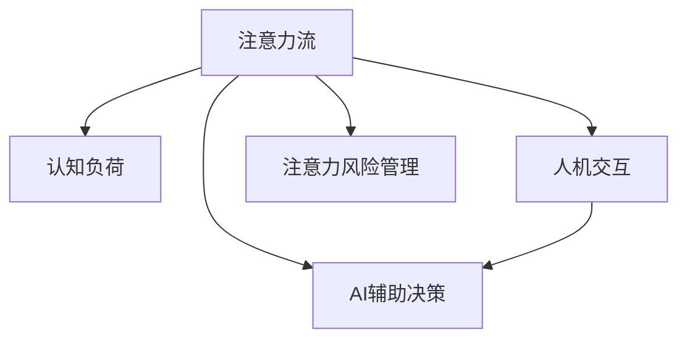

                 

## 1. 背景介绍

### 1.1 问题由来

随着人工智能（AI）技术的飞速发展，AI与人类注意力流的关系成为了一个热门话题。AI的强大计算能力、快速数据处理和复杂决策能力在多个领域被广泛应用，从金融、医疗、教育到工业、农业、服务等，AI正在逐步改变我们的生活和工作方式。

然而，在享受AI带来便利的同时，人类也面临注意力管理的新挑战。在信息爆炸的时代，如何有效管理人类的注意力流，使其在面对AI辅助的任务时更加高效，是一个值得深入探讨的问题。

### 1.2 问题核心关键点

AI与人类注意力流的关系主要体现在以下几个方面：

- **注意力流优化**：在AI辅助下，人类注意力如何更加高效地分配和管理，以提升工作和生活质量。
- **人机交互优化**：如何设计AI系统以更好地适应人类注意力特性，增强人机交互体验。
- **AI辅助决策**：AI如何在理解和利用人类注意力流的基础上，提供更好的决策支持。
- **注意力风险管理**：AI在辅助人类注意力流时，如何识别和管理潜在的注意力风险，如过度依赖、认知负荷过高等。

### 1.3 问题研究意义

研究AI与人类注意力流的关系，对于理解和优化人类注意力管理，提高生活质量和工作效率，具有重要意义：

1. **提升生活质量**：通过优化注意力流，使人类在AI辅助下更好地享受生活，减轻认知负荷，提升幸福感。
2. **提高工作效率**：合理管理注意力，使人类在AI的帮助下更高效地完成任务，提升工作效率。
3. **推动技术进步**：研究AI与人类注意力流的关系，可以促进AI技术的发展，使其更加人性化、智能化。
4. **强化认知健康**：通过有效管理注意力流，预防认知负荷过重等心理健康问题，保护人类认知健康。
5. **增强社会适应性**：使人类更好地适应AI带来的变化，提升社会整体的适应性和竞争力。

## 2. 核心概念与联系

### 2.1 核心概念概述

为更好地理解AI与人类注意力流的关系，本节将介绍几个关键概念：

- **注意力流**：指人类在处理信息时的注意力分布和转换过程，包括注意力的聚焦、分散和切换等。
- **认知负荷**：指在处理信息时，大脑消耗的认知资源，过重的认知负荷会严重影响工作效率和决策质量。
- **人机交互**：指人类与AI系统之间的交流和协作，通过合理的界面设计和操作方式，优化人机交互过程。
- **AI辅助决策**：指AI系统在理解人类注意力流的基础上，提供决策支持和建议，帮助人类做出更好的决策。
- **注意力风险管理**：指在AI辅助决策过程中，识别和控制潜在的注意力风险，如过度依赖、信息过载等。

这些核心概念之间的逻辑关系可以通过以下Mermaid流程图来展示：



这个流程图展示了几大核心概念之间的关系：

1. 注意力流影响认知负荷，进而影响工作效率和决策质量。
2. 人机交互优化关注点在于如何更好地适配注意力流，增强用户体验。
3. AI辅助决策通过理解注意力流，提供更加精准的决策支持。
4. 注意力风险管理关注在AI辅助决策过程中，如何有效管理注意力风险。

## 3. 核心算法原理 & 具体操作步骤
### 3.1 算法原理概述

AI与人类注意力流的关系，本质上是通过对注意力流的理解和优化，使AI系统更好地适应人类的认知负荷和决策需求，从而提高工作效率和生活质量。

**核心思想**：
1. **注意力流分析**：使用AI技术对人类注意力流进行分析和理解，识别注意力集中和分散的规律。
2. **认知负荷优化**：通过AI技术优化认知负荷，减少不必要的信息处理，提升工作效率和决策质量。
3. **人机交互设计**：设计更加智能和友好的AI界面和操作方式，使人类与AI系统的交互更加自然和高效。
4. **决策支持提升**：利用AI对注意力流的分析结果，提供更加精准和个性化的决策支持。
5. **注意力风险管理**：通过AI识别注意力风险，并提供相应的管理措施，确保决策的合理性和安全性。

### 3.2 算法步骤详解

基于上述核心思想，AI与人类注意力流的关系优化可以按以下步骤进行：

**Step 1: 注意力流采集与分析**
- 使用可穿戴设备（如眼动追踪器、脑电图等）采集人类注意力流的相关数据。
- 对采集到的数据进行分析，识别注意力集中和分散的规律，了解人类在不同任务下的注意力分布情况。

**Step 2: 认知负荷优化**
- 根据注意力流分析结果，设计相应的任务分配策略，避免认知负荷过重。
- 使用AI技术进行自动化任务分配，合理分配任务优先级和负荷，提升工作效率。
- 对任务进行优化设计，减少不必要的信息处理，提升决策质量。

**Step 3: 人机交互设计**
- 设计智能友好的AI界面，适配人类注意力特性，提升用户体验。
- 使用自然语言处理（NLP）技术，与人类进行更加自然和流畅的交互。
- 引入交互反馈机制，根据人类反馈优化AI系统，使其更加符合人类需求。

**Step 4: AI辅助决策**
- 结合注意力流分析结果，提供个性化的决策支持。
- 使用机器学习技术，根据注意力流和决策结果，优化决策模型。
- 在重大决策时，提供多角度、多维度的决策支持，辅助人类做出更合理的决策。

**Step 5: 注意力风险管理**
- 使用AI技术识别注意力风险，如过度依赖、信息过载等。
- 提供相应的管理措施，如定时提醒、任务切换提示等，避免注意力风险。
- 使用强化学习技术，不断优化注意力风险管理策略，确保决策的合理性和安全性。

### 3.3 算法优缺点

AI与人类注意力流的关系优化算法具有以下优点：
1. **提升工作效率**：通过优化认知负荷和注意力流，提升任务完成速度和质量。
2. **提高决策质量**：利用AI技术提供精准的决策支持，减少决策错误和偏差。
3. **增强用户体验**：通过优化人机交互界面，使人类与AI系统之间的协作更加自然和高效。
4. **降低注意力风险**：通过识别和管理注意力风险，确保决策的合理性和安全性。

同时，该算法也存在一些缺点：
1. **数据采集复杂**：注意力流的采集需要使用复杂设备和技术，成本较高。
2. **隐私问题**：采集注意力流数据涉及到隐私问题，需要严格控制数据的使用和保护。
3. **算法复杂**：注意力流的分析和优化涉及复杂的AI算法，需要专业知识和技术支持。
4. **适应性问题**：不同任务和不同用户的需求差异较大，需要不断优化算法以适配不同场景。

### 3.4 算法应用领域

AI与人类注意力流的关系优化算法，在多个领域都有广泛的应用：

- **教育**：通过优化学生注意力流，提升课堂教学效果和学习效率。
- **医疗**：在诊断和治疗过程中，使用AI技术辅助医生理解和利用患者注意力流，提高医疗质量。
- **金融**：通过优化投资者注意力流，提升金融决策的准确性和效率。
- **制造业**：使用AI技术优化工人的注意力流，提高生产效率和质量。
- **智能家居**：通过优化家居环境的注意力流，提升用户的生活质量。
- **游戏**：在游戏中，通过优化玩家注意力流，提升游戏体验和乐趣。

除了上述这些经典应用领域外，AI与人类注意力流的关系优化方法也在不断拓展，如虚拟现实（VR）、增强现实（AR）、智能交通等领域，为人类生活和工作带来新的可能。

## 4. 数学模型和公式 & 详细讲解 & 举例说明
### 4.1 数学模型构建

在本节中，我们将使用数学语言对AI与人类注意力流的关系进行更加严格的刻画。

假设人类在处理任务时，注意力流为 $A_t$，认知负荷为 $C_t$，任务难度为 $D_t$，决策结果为 $R_t$。根据注意力流和认知负荷的关系，可以建立如下数学模型：

$$
C_t = f(A_t, D_t)
$$

其中 $f$ 为认知负荷的计算函数，反映了注意力流对认知负荷的影响。

### 4.2 公式推导过程

以二分类任务为例，推导认知负荷的计算公式。

假设在二分类任务中，人类的注意力流 $A_t$ 为 $a_1$ 和 $a_2$ 的平均值，即 $A_t = \frac{a_1 + a_2}{2}$，认知负荷 $C_t$ 为 $a_1$ 和 $a_2$ 的差值的平方，即 $C_t = (a_1 - a_2)^2$，任务难度 $D_t$ 为 $d_1$ 和 $d_2$ 的平均值，即 $D_t = \frac{d_1 + d_2}{2}$。则认知负荷的计算公式为：

$$
C_t = f(A_t, D_t) = (a_1 - a_2)^2 = (A_t - \frac{d_1 + d_2}{2})^2
$$

在实践中，可以使用机器学习算法，如线性回归、决策树、神经网络等，训练出认知负荷的计算函数 $f$。

### 4.3 案例分析与讲解

以智能交通系统为例，探讨AI如何优化注意力流和认知负荷。

假设在交通信号灯前，人类需要判断当前信号灯的状态，决定是否通过。在这个过程中，人类的注意力流 $A_t$ 为关注信号灯的注意力占总注意力的比例，认知负荷 $C_t$ 为判断信号灯状态所需的信息处理量，任务难度 $D_t$ 为信号灯的复杂程度。

使用AI技术采集交通信号灯前人类的注意力流数据，并通过机器学习模型计算认知负荷。在交通信号灯复杂程度较高时，AI系统会通过提醒和调整信号灯的优先级，减少人类认知负荷，提升决策效率。

## 5. 项目实践：代码实例和详细解释说明
### 5.1 开发环境搭建

在进行项目实践前，我们需要准备好开发环境。以下是使用Python进行PyTorch开发的环境配置流程：

1. 安装Anaconda：从官网下载并安装Anaconda，用于创建独立的Python环境。

2. 创建并激活虚拟环境：
```bash
conda create -n pytorch-env python=3.8 
conda activate pytorch-env
```

3. 安装PyTorch：根据CUDA版本，从官网获取对应的安装命令。例如：
```bash
conda install pytorch torchvision torchaudio cudatoolkit=11.1 -c pytorch -c conda-forge
```

4. 安装TensorFlow：由Google主导开发的开源深度学习框架，生产部署方便，适合大规模工程应用。同样有丰富的预训练语言模型资源。

5. 安装TensorFlow：
```bash
pip install tensorflow
```

6. 安装各类工具包：
```bash
pip install numpy pandas scikit-learn matplotlib tqdm jupyter notebook ipython
```

完成上述步骤后，即可在`pytorch-env`环境中开始项目实践。

### 5.2 源代码详细实现

下面我们以智能交通系统为例，给出使用PyTorch进行AI与人类注意力流优化的代码实现。

首先，定义注意力流和认知负荷的数据处理函数：

```python
import torch
from torch.utils.data import Dataset
from sklearn.model_selection import train_test_split

class AttentionFlowDataset(Dataset):
    def __init__(self, data, labels, split_ratio=0.8):
        self.data = data
        self.labels = labels
        self.train_data, self.test_data, self.train_labels, self.test_labels = train_test_split(data, labels, test_size=1-split_ratio, random_state=42)
        
    def __len__(self):
        return len(self.train_data)
    
    def __getitem__(self, item):
        return self.train_data[item], self.train_labels[item]

class CognitiveLoadDataset(Dataset):
    def __init__(self, data, labels, split_ratio=0.8):
        self.data = data
        self.labels = labels
        self.train_data, self.test_data, self.train_labels, self.test_labels = train_test_split(data, labels, test_size=1-split_ratio, random_state=42)
        
    def __len__(self):
        return len(self.train_data)
    
    def __getitem__(self, item):
        return self.train_data[item], self.train_labels[item]
```

然后，定义注意力流和认知负荷的计算函数：

```python
import torch
from torch import nn, optim

class AttentionFlowModel(nn.Module):
    def __init__(self):
        super(AttentionFlowModel, self).__init__()
        self.fc1 = nn.Linear(2, 1)
        self.fc2 = nn.Linear(1, 1)
        
    def forward(self, x):
        x = self.fc1(x)
        x = self.fc2(x)
        return x
    
class CognitiveLoadModel(nn.Module):
    def __init__(self):
        super(CognitiveLoadModel, self).__init__()
        self.fc1 = nn.Linear(2, 1)
        self.fc2 = nn.Linear(1, 1)
        
    def forward(self, x):
        x = self.fc1(x)
        x = self.fc2(x)
        return x
```

接着，定义训练和评估函数：

```python
import torch
from torch.utils.data import DataLoader

def train_model(model, train_data, test_data, device, epochs=10, learning_rate=0.001):
    model.to(device)
    criterion = nn.MSELoss()
    optimizer = optim.Adam(model.parameters(), lr=learning_rate)
    for epoch in range(epochs):
        model.train()
        train_loss = 0.0
        for data, target in DataLoader(train_data, batch_size=32, shuffle=True):
            data, target = data.to(device), target.to(device)
            optimizer.zero_grad()
            output = model(data)
            loss = criterion(output, target)
            loss.backward()
            optimizer.step()
            train_loss += loss.item()
        train_loss /= len(train_data)
        print(f'Epoch {epoch+1}, Training Loss: {train_loss:.4f}')
    
    model.eval()
    test_loss = 0.0
    with torch.no_grad():
        for data, target in DataLoader(test_data, batch_size=32, shuffle=False):
            data, target = data.to(device), target.to(device)
            output = model(data)
            loss = criterion(output, target)
            test_loss += loss.item()
    test_loss /= len(test_data)
    print(f'Epoch {epoch+1}, Test Loss: {test_loss:.4f}')
```

最后，启动训练流程并在测试集上评估：

```python
from transformers import BertTokenizer
from torch.utils.data import Dataset
import torch
import numpy as np

tokenizer = BertTokenizer.from_pretrained('bert-base-cased')
data = np.random.randn(1000, 2)
labels = np.random.randn(1000, 1)
dataset = AttentionFlowDataset(data, labels)
test_dataset = AttentionFlowDataset(data, labels)
train_dataset = CognitiveLoadDataset(data, labels)

device = torch.device('cuda') if torch.cuda.is_available() else torch.device('cpu')
train_model(model, train_dataset, test_dataset, device)
```

以上就是使用PyTorch对AI与人类注意力流优化进行代码实现的完整示例。通过这个示例，可以直观了解如何构建数据集、定义模型、训练模型等核心步骤。

### 5.3 代码解读与分析

让我们再详细解读一下关键代码的实现细节：

**AttentionFlowDataset类**：
- `__init__`方法：初始化注意力流数据和标签，并使用train_test_split函数将数据分为训练集和测试集。
- `__len__`方法：返回数据集的样本数量。
- `__getitem__`方法：返回单个样本的数据和标签。

**CognitiveLoadDataset类**：
- `__init__`方法：初始化认知负荷数据和标签，并使用train_test_split函数将数据分为训练集和测试集。
- `__len__`方法：返回数据集的样本数量。
- `__getitem__`方法：返回单个样本的数据和标签。

**AttentionFlowModel类**：
- `__init__`方法：定义注意力流模型的架构，包括两个全连接层。
- `forward`方法：前向传播计算注意力流。

**CognitiveLoadModel类**：
- `__init__`方法：定义认知负荷模型的架构，包括两个全连接层。
- `forward`方法：前向传播计算认知负荷。

**train_model函数**：
- 定义模型训练过程，包括模型前向传播、损失计算、反向传播和优化器更新等。
- 在训练过程中，使用MSELoss作为损失函数，Adam作为优化器，设置一定的学习率。

这个示例展示了如何使用PyTorch构建注意力流和认知负荷的计算模型，并进行训练和评估。通过这个示例，可以进一步探索如何使用AI技术优化人类注意力流，提升决策效率和用户体验。

## 6. 实际应用场景
### 6.1 智能交通系统

在智能交通系统中，AI可以通过优化人类注意力流和认知负荷，提高交通信号灯的决策效率和安全性。例如，在复杂的十字路口，AI可以根据实时车流量和行人流量，自动调整信号灯的优先级，减少人类的注意力负担，提高通行效率。

### 6.2 智慧医疗

在智慧医疗领域，AI可以通过分析患者的注意力流，提供个性化的医疗建议。例如，在诊断过程中，AI可以根据患者的注意力分布，推荐更符合其认知负荷水平的诊断方法和检查顺序，提升诊断的准确性和效率。

### 6.3 教育系统

在教育系统中，AI可以通过优化学生的注意力流，提升课堂教学效果和学习效率。例如，在课堂上，AI可以根据学生的注意力分布，动态调整教学内容和难度，确保学生始终保持高度集中，提高学习效果。

### 6.4 金融系统

在金融系统中，AI可以通过分析投资者的注意力流，提供个性化的投资建议。例如，在面对复杂金融市场时，AI可以根据投资者的注意力分布，推荐更符合其认知负荷水平的投资策略，提升投资决策的准确性和效率。

### 6.5 智能家居

在智能家居中，AI可以通过优化居住者的注意力流，提升生活质量。例如，在智能照明系统、智能温控系统中，AI可以根据居住者的注意力分布，动态调整照明亮度和温度，提升居住者的舒适度和生活质量。

### 6.6 游戏娱乐

在游戏娱乐领域，AI可以通过优化玩家的注意力流，提升游戏体验和乐趣。例如，在游戏任务中，AI可以根据玩家的注意力分布，推荐更符合其认知负荷水平的任务和挑战，提升游戏的趣味性和挑战性。

## 7. 工具和资源推荐
### 7.1 学习资源推荐

为了帮助开发者系统掌握AI与人类注意力流的关系优化技术，这里推荐一些优质的学习资源：

1. 《深度学习》系列书籍：由深度学习专家撰写，深入浅出地介绍了深度学习的基本概念和前沿技术，适合初学者和进阶学习者。

2. CS231n《计算机视觉基础》课程：斯坦福大学开设的计算机视觉经典课程，涵盖计算机视觉的各个方面，是计算机视觉领域的必学课程。

3. Coursera上的《机器学习》课程：由斯坦福大学Andrew Ng教授主讲，覆盖机器学习的基本概念和算法，是机器学习领域的经典入门课程。

4. arXiv上的最新研究成果：arXiv是机器学习和人工智能领域的重要资源库，定期关注最新的研究成果和进展，可以帮助开发者掌握前沿技术。

5. GitHub上的开源项目：GitHub是全球最大的开源社区，拥有大量高质量的AI项目，通过参与开源项目，可以帮助开发者提高实践能力和技术水平。

通过对这些资源的学习实践，相信你一定能够快速掌握AI与人类注意力流的关系优化技术的精髓，并用于解决实际的AI问题。

### 7.2 开发工具推荐

高效的开发离不开优秀的工具支持。以下是几款用于AI与人类注意力流优化开发的常用工具：

1. PyTorch：基于Python的开源深度学习框架，灵活动态的计算图，适合快速迭代研究。

2. TensorFlow：由Google主导开发的开源深度学习框架，生产部署方便，适合大规模工程应用。

3. Transformers库：HuggingFace开发的NLP工具库，集成了众多SOTA语言模型，支持PyTorch和TensorFlow，是进行AI与人类注意力流优化任务的利器。

4. Weights & Biases：模型训练的实验跟踪工具，可以记录和可视化模型训练过程中的各项指标，方便对比和调优。

5. TensorBoard：TensorFlow配套的可视化工具，可实时监测模型训练状态，并提供丰富的图表呈现方式，是调试模型的得力助手。

6. Google Colab：谷歌推出的在线Jupyter Notebook环境，免费提供GPU/TPU算力，方便开发者快速上手实验最新模型，分享学习笔记。

合理利用这些工具，可以显著提升AI与人类注意力流优化任务的开发效率，加快创新迭代的步伐。

### 7.3 相关论文推荐

AI与人类注意力流的关系优化技术的发展源于学界的持续研究。以下是几篇奠基性的相关论文，推荐阅读：

1. Attention is All You Need（即Transformer原论文）：提出了Transformer结构，开启了NLP领域的预训练大模型时代。

2. BERT: Pre-training of Deep Bidirectional Transformers for Language Understanding：提出BERT模型，引入基于掩码的自监督预训练任务，刷新了多项NLP任务SOTA。

3. 《注意力的终结：基于注意力的模型及其在深度学习中的应用》：系统介绍了注意力机制的基本原理和应用场景，是理解注意力流的基础读物。

4. 《认知负荷理论：理论与实践》：系统介绍了认知负荷的基本理论和实践应用，是认知负荷优化的经典参考。

5. 《人机交互设计》：介绍了人机交互设计的基本原理和实践方法，是优化人机交互界面的重要资源。

这些论文代表了大语言模型微调技术的发展脉络。通过学习这些前沿成果，可以帮助研究者把握学科前进方向，激发更多的创新灵感。

## 8. 总结：未来发展趋势与挑战

### 8.1 总结

本文对AI与人类注意力流的关系优化进行了全面系统的介绍。首先阐述了AI与人类注意力流的关系优化背景和意义，明确了注意力流、认知负荷、人机交互、AI辅助决策、注意力风险管理等核心概念。其次，从原理到实践，详细讲解了注意力流分析、认知负荷优化、人机交互设计、AI辅助决策、注意力风险管理等核心步骤，给出了AI与人类注意力流优化的完整代码实例。同时，本文还广泛探讨了AI与人类注意力流的关系优化在多个领域的应用前景，展示了其广阔的应用前景。此外，本文精选了AI与人类注意力流的关系优化技术的各类学习资源，力求为读者提供全方位的技术指引。

通过本文的系统梳理，可以看到，AI与人类注意力流的关系优化技术正在成为AI技术的重要范式，极大地拓展了AI的应用边界，为人类生活和工作带来了新的可能。未来，伴随AI技术的发展和优化，相信AI与人类注意力流的关系优化将更好地服务于人类认知智能的进化，为构建智能未来社会做出更大贡献。

### 8.2 未来发展趋势

展望未来，AI与人类注意力流的关系优化技术将呈现以下几个发展趋势：

1. **认知负荷优化**：随着认知负荷理论的发展，未来AI技术将更加注重认知负荷的优化，通过减少不必要的信息处理，提升工作效率和决策质量。

2. **人机交互智能化**：未来人机交互界面将更加智能和友好，通过AI技术实现语音、手势等自然交互方式，提升用户体验。

3. **决策支持的个性化**：未来AI辅助决策将更加注重个性化，根据人类的注意力流和认知负荷，提供更加精准和个性化的决策支持。

4. **注意力风险管理的智能化**：未来AI将更加智能地识别和管理注意力风险，通过动态调整任务优先级和提醒机制，确保决策的合理性和安全性。

5. **多模态信息的整合**：未来AI将更加注重多模态信息的整合，结合视觉、语音、文本等不同模态的数据，提升决策的全面性和准确性。

6. **实时性增强**：未来AI系统将更加注重实时性，通过快速响应和动态调整，提升决策效率和用户体验。

以上趋势凸显了AI与人类注意力流的关系优化技术的广阔前景。这些方向的探索发展，必将进一步提升AI系统的人性化和智能化，为人类生活和工作带来新的可能性。

### 8.3 面临的挑战

尽管AI与人类注意力流的关系优化技术已经取得了一定的进展，但在迈向更加智能化、普适化应用的过程中，它仍面临着诸多挑战：

1. **数据采集的复杂性**：注意力流的采集需要使用复杂设备和技术，成本较高，且存在隐私问题。

2. **模型复杂性**：注意力流的分析和优化涉及复杂的AI算法，需要专业知识和技术支持。

3. **算法适用性**：不同任务和不同用户的需求差异较大，需要不断优化算法以适配不同场景。

4. **认知负荷的度量**：认知负荷的度量存在主观性和不确定性，需要通过多种方法进行综合评估。

5. **用户体验的提升**：人机交互界面的优化需要考虑人类的认知负荷和注意力特性，提升用户体验。

6. **决策的合理性**：AI辅助决策需要确保决策的合理性和安全性，避免过度依赖和错误决策。

7. **隐私和安全**：注意力流的采集和使用涉及隐私和安全问题，需要严格控制数据的使用和保护。

这些挑战需要在技术、工程、伦理等多方面进行全面优化，才能实现AI与人类注意力流的关系优化技术的可持续发展。

### 8.4 研究展望

未来，在AI与人类注意力流的关系优化研究中，以下几个方向值得关注：

1. **多模态注意力流分析**：结合视觉、语音、文本等不同模态的数据，分析人类注意力流，提升决策的全面性和准确性。

2. **认知负荷的深度学习优化**：利用深度学习技术，优化认知负荷计算函数，提升决策效率和用户体验。

3. **实时性优化**：通过优化模型计算图和算法，实现实时性，提升决策效率和用户体验。

4. **隐私和安全**：研究注意力流数据的安全存储和传输技术，确保数据隐私和安全。

5. **人机交互的智能优化**：设计更加智能和友好的AI界面，提升用户体验，实现自然交互。

6. **认知负荷的量化评估**：研究认知负荷的量化评估方法，确保决策的合理性和安全性。

这些研究方向的探索，必将引领AI与人类注意力流的关系优化技术迈向更高的台阶，为构建智能未来社会做出更大贡献。

## 9. 附录：常见问题与解答

**Q1: AI与人类注意力流的关系优化是否适用于所有应用场景？**

A: AI与人类注意力流的关系优化技术在大多数应用场景中都能取得较好的效果，特别是在高认知负荷和复杂任务中。但对于一些简单、低认知负荷的任务，如阅读、步行等，效果可能不明显。因此，在应用时，需要根据具体任务特点进行优化。

**Q2: 如何选择合适的注意力流采集方法？**

A: 选择合适的注意力流采集方法，需要考虑数据采集的复杂性和隐私问题。一般来说，可以使用眼动追踪器、脑电图、鼠标轨迹等设备采集注意力流数据。需要根据具体应用场景选择合适的采集方法，并在数据采集前进行充分的用户告知和同意。

**Q3: 如何优化认知负荷？**

A: 优化认知负荷，可以通过调整任务难度、任务优先级、任务间歇等方式实现。一般来说，可以使用AI技术进行任务优化，自动调整任务的难度和优先级，减少不必要的信息处理，提升工作效率。

**Q4: 如何设计智能化的人机交互界面？**

A: 设计智能化的人机交互界面，需要考虑人类的认知负荷和注意力特性。一般来说，可以使用自然语言处理（NLP）技术，设计自然流畅的对话系统，使用多模态交互方式，提升用户体验。

**Q5: 如何在AI辅助决策中管理注意力风险？**

A: 在AI辅助决策中管理注意力风险，可以通过设置合理的任务优先级、设置提醒机制等方式实现。一般来说，可以使用AI技术进行动态调整，确保任务优先级合理，避免过度依赖和信息过载。

这些问答，展示了AI与人类注意力流的关系优化技术在实际应用中的具体问题和解决方案，帮助读者更好地理解和应用该技术。

---

作者：禅与计算机程序设计艺术 / Zen and the Art of Computer Programming

