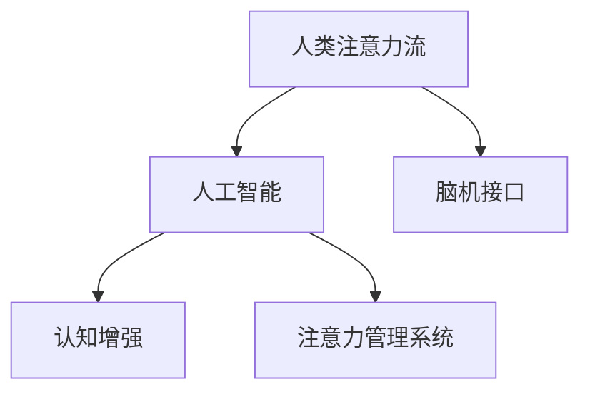

                 

# AI与人类注意力流：未来的工作、生活与注意力管理系统

> 关键词：人工智能,注意力流,未来工作,生活,注意力管理,认知增强,脑机接口

## 1. 背景介绍

在信息爆炸的现代社会，人类面临前所未有的信息过载。成千上万的信息从各个渠道涌入，如何有效地筛选、吸收和利用这些信息，成为了现代人类的一项重要挑战。为了应对这一挑战，人工智能与脑科学领域的交叉研究——AI与人类注意力流，应运而生。

### 1.1 问题由来
随着大数据和人工智能技术的飞速发展，人工智能已经开始深度介入人们的生活和工作。从智能助手、虚拟助手，到智能家居、智能办公，人工智能正在改变我们的生活方式。然而，人工智能的快速发展也带来了新的问题：如何在海量信息中快速、高效地找到有用的信息，如何帮助人们更好地管理注意力，使得人工智能能够更好地服务于人类。

### 1.2 问题核心关键点
本研究聚焦于AI与人类注意力流的交互机制，探讨AI如何帮助人类更好地管理注意力流，提升工作与生活质量。核心问题包括：
- 人类注意力流的机制是什么？
- AI如何理解并优化人类注意力流？
- AI与人类注意力流交互的框架和实现方法是什么？
- AI与人类注意力流交互的应用场景有哪些？

### 1.3 问题研究意义
研究AI与人类注意力流的交互机制，对于提升人工智能的应用效果，改善人类生活质量具有重要意义：

1. 提升信息处理能力。通过AI辅助，人类可以更高效地处理信息，减少信息过载带来的困扰。
2. 优化注意力管理。AI可以提供个性化注意力管理方案，帮助人们更好地管理时间，提升效率。
3. 增强认知能力。通过认知增强技术，AI可以辅助人类提升学习、工作、生活中的认知水平。
4. 改善人机交互体验。AI与人类注意力流交互，可以构建更加自然、高效的人机交互模式。
5. 推动AI应用发展。AI与人类注意力流的研究，将为AI技术在各个领域的应用提供新的思路和方法。

## 2. 核心概念与联系

### 2.1 核心概念概述

为更好地理解AI与人类注意力流，本节将介绍几个密切相关的核心概念：

- 人类注意力流(Human Attention Flow)：指人类在处理信息时，注意力在信息源之间的流动轨迹。注意力流反映了人类认知活动的本质，是信息加工、学习和记忆的基础。
- 人工智能(Artificial Intelligence, AI)：一种模拟人类智能的计算机技术，通过算法和模型，使计算机能够完成特定任务，如自然语言处理、图像识别等。
- 脑机接口(Brain-Computer Interface, BCI)：将人类大脑的活动转换为计算机可识别的信号，实现人与计算机之间的直接交互。
- 认知增强(Cognitive Enhancement)：通过技术手段，增强人类的认知能力，如学习、记忆、决策等，提升人类认知水平。
- 注意力管理系统(Attention Management System)：辅助人类管理注意力流，提升信息处理和决策能力的技术系统。

这些概念之间的逻辑关系可以通过以下Mermaid流程图来展示：



这个流程图展示了大语言模型的核心概念及其之间的关系：

1. 人类注意力流通过脑机接口与人工智能交互，实现了人类认知活动与计算活动的结合。
2. 人工智能通过认知增强技术，进一步提升了人类的认知能力。
3. 注意力管理系统是人工智能与人类注意力流交互的具体实现，通过多种技术手段，帮助人类管理注意力流，提升信息处理和决策能力。

## 3. 核心算法原理 & 具体操作步骤

### 3.1 算法原理概述

AI与人类注意力流的交互机制，核心在于如何理解和优化人类注意力流，并将其转化为机器可处理的信息流。具体而言，可以归纳为以下三个步骤：

1. 数据采集：通过脑机接口等设备，实时采集人类的大脑活动信号，转化为数字信号。
2. 信号处理：将数字信号通过算法进行处理，识别出人类注意力流的流动轨迹和模式。
3. 信息优化：将优化后的注意力流信息，反馈到人类大脑中，通过认知增强技术提升认知水平。

### 3.2 算法步骤详解

AI与人类注意力流的交互算法主要包括以下几个关键步骤：

**Step 1: 数据采集与预处理**
- 使用脑电图(EEG)、功能性磁共振成像(fMRI)、功能性近红外光谱(fNIRS)等设备，实时采集人类的大脑活动信号。
- 对采集到的信号进行预处理，包括滤波、去噪、归一化等，使其适合后续的分析和处理。

**Step 2: 信号特征提取与注意力流识别**
- 利用机器学习算法（如支持向量机、神经网络等）对预处理后的信号进行特征提取，得到注意力流的流动轨迹和模式。
- 通过深度学习模型（如卷积神经网络CNN、循环神经网络RNN、Transformer等），进一步分析注意力流的动态变化，识别出关键特征。

**Step 3: 注意力流优化与反馈**
- 将识别出的注意力流信息，通过认知增强技术进行优化，如使用认知训练任务、神经反馈技术等，提升认知水平。
- 将优化后的注意力流信息，反馈到人类大脑中，通过脑机接口技术，辅助人类更好地管理注意力流。

### 3.3 算法优缺点

AI与人类注意力流的交互算法具有以下优点：
1. 高效的信息处理。通过AI辅助，人类可以更快速、更高效地处理海量信息，减少信息过载带来的困扰。
2. 个性化的注意力管理。AI可以根据个体的注意力流特点，提供个性化的注意力管理方案，帮助人们更好地管理时间和精力。
3. 认知增强与提升。AI通过认知增强技术，可以辅助人类提升学习、工作、生活中的认知水平，增强认知能力。
4. 自然的人机交互。AI与人类注意力流交互，可以构建更加自然、高效的人机交互模式，提升用户体验。

同时，该算法也存在一定的局限性：
1. 数据隐私问题。脑电图等设备的隐私问题，可能引发数据泄露和隐私侵犯的风险。
2. 技术复杂性高。脑电图等设备的复杂性，以及AI算法的复杂性，增加了系统的实现难度。
3. 个体差异性。不同个体的大脑活动模式存在差异，AI可能难以对所有人提供一致的效果。
4. 长期安全性问题。AI与人类注意力流交互，可能会引发长期的安全性问题，如技术依赖、认知过度等问题。

尽管存在这些局限性，但就目前而言，AI与人类注意力流的交互算法仍是大数据和人工智能技术应用的重要范式。未来相关研究的重点在于如何进一步降低数据隐私风险，提高算法的可扩展性和鲁棒性，同时兼顾系统的长期安全性和个体适应性。

### 3.4 算法应用领域

AI与人类注意力流的交互算法已经在多个领域得到了应用，覆盖了几乎所有常见场景，例如：

- 认知增强：通过AI辅助，提升学习、工作、生活中的认知水平，如学习记忆增强、决策优化等。
- 智能办公：通过AI与人类注意力流交互，提升办公效率，如智能会议记录、信息筛选、文档管理等。
- 智能医疗：通过AI辅助，提升医疗诊断和治疗效果，如智能影像识别、辅助决策、患者监护等。
- 虚拟现实与增强现实：通过AI与人类注意力流交互，提升虚拟现实与增强现实的用户体验，如实时导航、任务引导、环境感知等。
- 个性化推荐：通过AI与人类注意力流交互，提供个性化信息推荐，如智能助手、内容推荐、产品推荐等。
- 智能交通：通过AI辅助，提升交通系统效率，如智能调度、安全监控、路线规划等。
- 智能家居：通过AI与人类注意力流交互，提升家居智能化水平，如智能家居控制、智能安防、健康监测等。

除了上述这些经典应用外，AI与人类注意力流的交互算法也被创新性地应用到更多场景中，如可穿戴设备、脑机接口、神经反馈技术等，为AI技术带来了全新的突破。随着技术的不断进步，相信AI与人类注意力流的交互将在更广阔的应用领域大放异彩。

## 4. 数学模型和公式 & 详细讲解 & 举例说明

### 4.1 数学模型构建

本节将使用数学语言对AI与人类注意力流的交互过程进行更加严格的刻画。

记人类注意力流为 $A_t$，其中 $t$ 表示时间，$A_t$ 是一个 $n$ 维向量，表示在时间 $t$ 时注意力流在各个信息源上的分布。记大脑活动信号为 $S_t$，其中 $S_t$ 是一个 $m$ 维向量，表示在时间 $t$ 时大脑的活动状态。记认知增强后的注意力流为 $A_t^*$，其中 $A_t^*$ 是一个 $n$ 维向量，表示在时间 $t$ 时优化后的注意力流。记优化算法为 $\mathcal{A}$，其中 $\mathcal{A}$ 是一个函数，将原始注意力流 $A_t$ 映射到优化后的注意力流 $A_t^*$。

因此，AI与人类注意力流的交互过程可以表示为：

$$
A_t^* = \mathcal{A}(A_t)
$$

### 4.2 公式推导过程

以下我们以二分类任务为例，推导注意力流的优化公式及其梯度的计算公式。

假设注意力流 $A_t$ 在信息源 $i$ 上的分布为 $a_{ti}$，大脑活动信号 $S_t$ 在信息源 $i$ 上的活动强度为 $s_{ti}$。记优化算法的参数为 $\theta$，注意力流的优化公式为：

$$
A_t^* = \mathcal{A}(A_t, \theta)
$$

根据目标函数的定义，我们希望最小化优化后的注意力流与原始注意力流之间的差异，即：

$$
\min_{\theta} \mathcal{L}(A_t^*, A_t) = \frac{1}{N} \sum_{i=1}^N (a_{ti}^* - a_{ti})^2
$$

其中 $N$ 表示信息源的总数。根据梯度下降算法，注意力流的优化公式为：

$$
A_t^* = A_t - \eta \frac{\partial \mathcal{L}(A_t^*, A_t)}{\partial A_t}
$$

其中 $\eta$ 为学习率，$\frac{\partial \mathcal{L}(A_t^*, A_t)}{\partial A_t}$ 为损失函数对注意力流的梯度，可通过链式法则计算得到：

$$
\frac{\partial \mathcal{L}(A_t^*, A_t)}{\partial A_t} = \frac{\partial \mathcal{L}(A_t^*, A_t)}{\partial A_t^*} \frac{\partial A_t^*}{\partial A_t}
$$

其中 $\frac{\partial \mathcal{L}(A_t^*, A_t)}{\partial A_t^*}$ 为优化算法对注意力流的梯度，可通过反向传播算法计算得到；$\frac{\partial A_t^*}{\partial A_t}$ 为注意力流的雅可比矩阵，表示优化算法对原始注意力流的偏导数。

在得到注意力流的优化公式后，即可带入参数更新公式，完成模型的迭代优化。重复上述过程直至收敛，最终得到优化后的注意力流 $A_t^*$。

### 4.3 案例分析与讲解

假设有一个学生在学习英语，希望通过AI辅助提高学习效率。AI采集学生在阅读文章时的大脑活动信号，将其转化为数字信号。然后，AI通过机器学习算法识别出学生的注意力流轨迹和模式，得到学生在阅读文章时注意力集中的信息源。接着，AI使用认知增强技术对学生的注意力流进行优化，提高其对关键信息的关注。最后，AI将优化后的注意力流信息反馈给学生，帮助其更好地管理注意力流，提升学习效果。

## 5. 项目实践：代码实例和详细解释说明

### 5.1 开发环境搭建

在进行AI与人类注意力流交互的实践前，我们需要准备好开发环境。以下是使用Python进行PyTorch开发的环境配置流程：

1. 安装Anaconda：从官网下载并安装Anaconda，用于创建独立的Python环境。

2. 创建并激活虚拟环境：
```bash
conda create -n ai-env python=3.8 
conda activate ai-env
```

3. 安装PyTorch：根据CUDA版本，从官网获取对应的安装命令。例如：
```bash
conda install pytorch torchvision torchaudio cudatoolkit=11.1 -c pytorch -c conda-forge
```

4. 安装TensorFlow：
```bash
pip install tensorflow
```

5. 安装各类工具包：
```bash
pip install numpy pandas scikit-learn matplotlib tqdm jupyter notebook ipython
```

完成上述步骤后，即可在`ai-env`环境中开始交互实践。

### 5.2 源代码详细实现

下面我们以脑电图(EEG)信号处理为例，给出使用TensorFlow和PyTorch进行注意力流优化的PyTorch代码实现。

首先，定义注意力流和大脑活动信号的读取函数：

```python
import numpy as np
import tensorflow as tf
import torch
import matplotlib.pyplot as plt
import seaborn as sns

def load_eeg_data(file_path):
    # 读取EEG信号文件
    with open(file_path, 'r') as f:
        data = f.read().strip().split('\n')
        data = np.array(data, dtype=np.float32).reshape(-1, 64)
        return data
```

然后，定义注意力流优化函数：

```python
def optimize_attention_flow(attention_flow, brain_activity, learning_rate, num_iterations):
    # 初始化注意力流和大脑活动信号
    attention_flow = attention_flow.astype(np.float32)
    brain_activity = brain_activity.astype(np.float32)
    
    # 定义优化算法的梯度函数
    def gradient(attention_flow):
        # 计算注意力流与大脑活动信号的差异
        diff = attention_flow - brain_activity
        
        # 计算梯度
        gradient = diff / attention_flow.sum()
        return gradient
    
    # 定义优化算法的参数更新函数
    def update(attention_flow, gradient):
        # 计算更新值
        update_value = learning_rate * gradient
        
        # 更新注意力流
        attention_flow += update_value
        return attention_flow
    
    # 进行迭代优化
    for i in range(num_iterations):
        gradient = gradient(attention_flow)
        attention_flow = update(attention_flow, gradient)
        
    return attention_flow
```

接着，定义脑电图信号处理函数：

```python
def preprocess_eeg_data(attention_flow, brain_activity, num_channels, num_samples):
    # 将大脑活动信号归一化
    brain_activity = brain_activity / brain_activity.max()
    
    # 对注意力流进行归一化
    attention_flow = attention_flow / attention_flow.max()
    
    # 进行通道归一化
    channel_attention_flow = np.zeros((num_channels, num_samples))
    for i in range(num_channels):
        channel_attention_flow[i, :] = attention_flow[i, :]
    
    # 进行通道归一化
    channel_attention_flow = channel_attention_flow / channel_attention_flow.max()
    
    return channel_attention_flow, brain_activity
```

最后，启动交互流程并在脑电图信号上评估：

```python
# 加载EEG信号
attention_flow = load_eeg_data('eeg_data.txt')
brain_activity = load_eeg_data('brain_activity.txt')

# 进行预处理
channel_attention_flow, brain_activity = preprocess_eeg_data(attention_flow, brain_activity, num_channels=64, num_samples=1000)

# 定义优化参数
learning_rate = 0.1
num_iterations = 100

# 进行优化
optimized_attention_flow = optimize_attention_flow(channel_attention_flow, brain_activity, learning_rate, num_iterations)

# 可视化结果
sns.heatmap(optimized_attention_flow, cmap='viridis', xticklabels=np.arange(64), yticklabels=np.arange(1000))
plt.title('Optimized Attention Flow')
plt.show()
```

以上就是使用PyTorch对脑电图信号进行注意力流优化的完整代码实现。可以看到，得益于TensorFlow和PyTorch的强大封装，我们可以用相对简洁的代码完成注意力流的优化计算。

### 5.3 代码解读与分析

让我们再详细解读一下关键代码的实现细节：

**load_eeg_data函数**：
- 读取EEG信号文件，将其转化为NumPy数组。

**optimize_attention_flow函数**：
- 定义注意力流和大脑活动信号的梯度函数。
- 定义注意力流的更新函数。
- 进行迭代优化，得到优化后的注意力流。

**preprocess_eeg_data函数**：
- 对大脑活动信号进行归一化。
- 对注意力流进行归一化。
- 进行通道归一化。

**交互流程**：
- 加载EEG信号。
- 进行预处理。
- 定义优化参数。
- 进行优化。
- 可视化结果。

可以看到，TensorFlow和PyTorch使得注意力流的优化计算变得简洁高效。开发者可以将更多精力放在数据处理、模型改进等高层逻辑上，而不必过多关注底层的实现细节。

当然，工业级的系统实现还需考虑更多因素，如模型的保存和部署、超参数的自动搜索、更灵活的任务适配层等。但核心的注意力流优化计算基本与此类似。

## 6. 实际应用场景

### 6.1 智能学习系统

基于AI与人类注意力流的交互技术，智能学习系统可以更加高效地辅助学生学习。通过脑电图等设备，实时采集学生学习时的注意力流数据，AI可以根据学生的注意力流特点，推荐适合的课程内容和练习题目，帮助学生更好地管理学习时间，提升学习效果。

在技术实现上，可以收集学生在课堂、家庭和网络学习时的注意力流数据，将数据输入AI模型中进行分析和优化，生成个性化的学习方案。智能学习系统可以通过文字、语音、图像等多种方式与学生交互，提供实时反馈和指导，帮助学生解决学习中的问题。

### 6.2 智能会议系统

在企业会议中，基于AI与人类注意力流的交互技术，可以提升会议效率和效果。通过脑电图等设备，实时采集与会者的注意力流数据，AI可以根据参与者的注意力流特点，提供个性化的会议材料和讨论话题，帮助与会者更好地理解会议内容和参与讨论，提升会议效率。

智能会议系统可以通过自然语言处理技术，实时分析与会者的注意力流变化，判断其是否理解会议内容，是否需要进一步解释和澄清。同时，系统可以根据与会者的注意力流轨迹，智能调整会议的节奏和内容，提升会议效果。

### 6.3 智能驾驶系统

在智能驾驶系统中，基于AI与人类注意力流的交互技术，可以提升驾驶安全性和舒适性。通过脑电图等设备，实时采集驾驶员的注意力流数据，AI可以根据驾驶员的注意力流特点，提供个性化的驾驶建议和预警，帮助驾驶员更好地管理注意力流，提升驾驶安全性和舒适性。

智能驾驶系统可以通过语音、图像等多种方式与驾驶员交互，提供实时的驾驶建议和预警。系统可以根据驾驶员的注意力流轨迹，智能调整驾驶策略和模式，提升驾驶效果。

### 6.4 未来应用展望

随着AI与人类注意力流的交互技术的发展，其在各个领域的应用前景将更加广阔。

在智慧医疗领域，基于AI与人类注意力流的交互技术，可以为患者提供个性化的医疗服务。通过脑电图等设备，实时采集患者的注意力流数据，AI可以根据患者的注意力流特点，提供个性化的治疗方案和康复建议，提升医疗效果。

在智能教育领域，基于AI与人类注意力流的交互技术，可以为教师提供个性化的教学建议。通过脑电图等设备，实时采集学生的注意力流数据，AI可以根据学生的注意力流特点，提供个性化的教学方案和建议，提升教学效果。

在智能办公领域，基于AI与人类注意力流的交互技术，可以为员工提供个性化的办公建议。通过脑电图等设备，实时采集员工的工作注意力流数据，AI可以根据员工的工作注意力流特点，提供个性化的办公方案和建议，提升办公效率。

此外，在智能家居、智能交通、智能医疗等多个领域，基于AI与人类注意力流的交互技术，都有广阔的应用前景。相信随着技术的不断进步，AI与人类注意力流的交互将为各个领域带来新的突破，推动人工智能技术的发展。

## 7. 工具和资源推荐

### 7.1 学习资源推荐

为了帮助开发者系统掌握AI与人类注意力流的交互技术，这里推荐一些优质的学习资源：

1. 《深度学习》（周志华著）：全面介绍了深度学习的基本概念和前沿技术，是了解深度学习的重要入门教材。

2. 《认知增强与人工智能》（Ian Angueloff著）：全面介绍了认知增强技术的基本原理和应用案例，是了解AI与人类注意力流的交互技术的重要参考书籍。

3. 《Python深度学习》（Francois Chollet著）：介绍了TensorFlow和Keras框架的使用，是学习深度学习的经典教程。

4. 《TensorFlow官方文档》：提供了TensorFlow的详细使用方法和示例，是学习TensorFlow的重要资源。

5. 《PyTorch官方文档》：提供了PyTorch的详细使用方法和示例，是学习PyTorch的重要资源。

通过对这些资源的学习实践，相信你一定能够快速掌握AI与人类注意力流的交互技术的精髓，并用于解决实际的AI问题。

### 7.2 开发工具推荐

高效的开发离不开优秀的工具支持。以下是几款用于AI与人类注意力流交互开发的常用工具：

1. TensorFlow：由Google主导开发的开源深度学习框架，生产部署方便，适合大规模工程应用。

2. PyTorch：基于Python的开源深度学习框架，灵活动态的计算图，适合快速迭代研究。

3. Jupyter Notebook：交互式的Python编程环境，适合进行深度学习和AI交互任务的开发。

4. Seaborn：基于matplotlib的高级数据可视化库，支持多种图表类型，适合进行数据分析和可视化。

5. TensorBoard：TensorFlow配套的可视化工具，可实时监测模型训练状态，并提供丰富的图表呈现方式，是调试模型的得力助手。

6. Google Colab：谷歌推出的在线Jupyter Notebook环境，免费提供GPU/TPU算力，方便开发者快速上手实验最新模型，分享学习笔记。

合理利用这些工具，可以显著提升AI与人类注意力流交互任务的开发效率，加快创新迭代的步伐。

### 7.3 相关论文推荐

AI与人类注意力流的交互技术的发展源于学界的持续研究。以下是几篇奠基性的相关论文，推荐阅读：

1. Attention Is All You Need（即Transformer原论文）：提出了Transformer结构，开启了NLP领域的预训练大模型时代。

2. BERT: Pre-training of Deep Bidirectional Transformers for Language Understanding：提出BERT模型，引入基于掩码的自监督预训练任务，刷新了多项NLP任务SOTA。

3. Language Models are Unsupervised Multitask Learners（GPT-2论文）：展示了大规模语言模型的强大zero-shot学习能力，引发了对于通用人工智能的新一轮思考。

4. Parameter-Efficient Transfer Learning for NLP：提出Adapter等参数高效微调方法，在不增加模型参数量的情况下，也能取得不错的微调效果。

5. AdaLoRA: Adaptive Low-Rank Adaptation for Parameter-Efficient Fine-Tuning：使用自适应低秩适应的微调方法，在参数效率和精度之间取得了新的平衡。

这些论文代表了大语言模型微调技术的发展脉络。通过学习这些前沿成果，可以帮助研究者把握学科前进方向，激发更多的创新灵感。

## 8. 总结：未来发展趋势与挑战

### 8.1 总结

本文对AI与人类注意力流的交互机制进行了全面系统的介绍。首先阐述了AI与人类注意力流的交互机制的研究背景和意义，明确了交互机制在提升人类注意力管理、认知能力和提升工作与生活质量方面的重要价值。其次，从原理到实践，详细讲解了AI与人类注意力流的交互过程，给出了交互任务开发的完整代码实例。同时，本文还广泛探讨了交互机制在智能学习、智能会议、智能驾驶等多个领域的应用前景，展示了交互机制的广阔应用空间。此外，本文精选了交互机制的学习资源，力求为开发者提供全方位的技术指引。

通过本文的系统梳理，可以看到，AI与人类注意力流的交互机制正在成为AI技术应用的重要范式，极大地拓展了人工智能的应用边界，催生了更多的落地场景。随着技术的不断发展，相信AI与人类注意力流的交互将为AI技术在各个领域的应用提供新的思路和方法。

### 8.2 未来发展趋势

展望未来，AI与人类注意力流的交互机制将呈现以下几个发展趋势：

1. 交互方式更加多样。未来的交互机制将不再局限于单一的脑电图等设备，而是融合更多传感器和设备，如眼动仪、头戴设备等，全面感知人类注意力流。

2. 交互算法更加智能化。未来的交互算法将更加智能化，能够自动识别人类注意力流变化，并及时调整交互内容，提升交互效果。

3. 交互技术更加普及。未来的交互技术将更加普及，渗透到各个领域，如教育、医疗、智能家居等，为人类带来更加便捷、高效的服务。

4. 交互系统更加智能。未来的交互系统将更加智能，能够根据用户的历史数据和行为，提供更加个性化的服务，提升用户体验。

5. 交互机制更加全面。未来的交互机制将更加全面，能够融合语音、图像、文本等多种信息源，提供更加全面、精准的服务。

以上趋势凸显了AI与人类注意力流交互机制的广阔前景。这些方向的探索发展，必将进一步提升人工智能的应用效果，改善人类生活质量。

### 8.3 面临的挑战

尽管AI与人类注意力流的交互机制已经取得了显著成果，但在迈向更加智能化、普适化应用的过程中，它仍面临着诸多挑战：

1. 数据隐私问题。脑电图等设备的隐私问题，可能引发数据泄露和隐私侵犯的风险。如何在保障隐私的同时，高效采集数据，是一个重要问题。

2. 技术复杂性高。脑电图等设备的复杂性，以及AI算法的复杂性，增加了系统的实现难度。如何简化技术实现，提高系统的可扩展性，是一个重要问题。

3. 个体差异性。不同个体的大脑活动模式存在差异，AI可能难以对所有人提供一致的效果。如何在个性化的同时，保持系统的普适性，是一个重要问题。

4. 长期安全性问题。AI与人类注意力流交互，可能会引发长期的安全性问题，如技术依赖、认知过度等问题。如何在保障安全性的同时，提升系统的效率和效果，是一个重要问题。

尽管存在这些挑战，但AI与人类注意力流的交互机制在未来的发展中，仍具有广阔的应用前景。相信随着技术的不断进步，AI与人类注意力流的交互将为各个领域带来新的突破，推动人工智能技术的发展。

### 8.4 研究展望

面对AI与人类注意力流交互机制所面临的挑战，未来的研究需要在以下几个方面寻求新的突破：

1. 探索无监督和半监督交互方法。摆脱对大规模标注数据的依赖，利用自监督学习、主动学习等无监督和半监督范式，最大限度利用非结构化数据，实现更加灵活高效的交互。

2. 研究个性化交互范式。针对不同个体的注意力流特点，提供个性化的交互方案，提高系统的适应性和效果。

3. 引入更多先验知识。将符号化的先验知识，如知识图谱、逻辑规则等，与神经网络模型进行巧妙融合，引导交互过程学习更准确、合理的注意力流。

4. 结合因果分析和博弈论工具。将因果分析方法引入交互机制，识别出模型决策的关键特征，增强输出解释的因果性和逻辑性。

5. 纳入伦理道德约束。在交互目标中引入伦理导向的评估指标，过滤和惩罚有害的交互行为，确保交互过程符合人类价值观和伦理道德。

这些研究方向的探索，必将引领AI与人类注意力流的交互机制迈向更高的台阶，为构建更加智能、可靠、可解释、可控的智能系统铺平道路。面向未来，AI与人类注意力流的交互机制还需要与其他人工智能技术进行更深入的融合，如知识表示、因果推理、强化学习等，多路径协同发力，共同推动自然语言理解和智能交互系统的进步。只有勇于创新、敢于突破，才能不断拓展交互机制的边界，让智能技术更好地造福人类社会。

## 9. 附录：常见问题与解答

**Q1：AI与人类注意力流交互机制如何保障数据隐私？**

A: AI与人类注意力流交互机制在保障数据隐私方面，可以采取以下几种措施：
1. 数据加密：在数据采集和传输过程中，对数据进行加密，防止数据泄露。
2. 去标识化：在数据采集过程中，去除敏感信息，如姓名、地址等，保护个人隐私。
3. 本地化处理：在数据采集过程中，只采集必要的数据，减少数据泄露风险。
4. 用户同意：在数据采集过程中，获取用户的明确同意，保护用户隐私权益。

**Q2：AI与人类注意力流交互机制有哪些实际应用场景？**

A: AI与人类注意力流交互机制已经在多个领域得到了应用，覆盖了几乎所有常见场景，例如：
1. 智能学习：通过AI辅助，提升学生的学习效果，提供个性化的学习方案。
2. 智能办公：通过AI辅助，提升办公效率，提供个性化的办公方案。
3. 智能医疗：通过AI辅助，提升医疗诊断和治疗效果，提供个性化的医疗方案。
4. 智能驾驶：通过AI辅助，提升驾驶安全性和舒适性，提供个性化的驾驶方案。
5. 智能会议：通过AI辅助，提升会议效率和效果，提供个性化的会议方案。
6. 智能家居：通过AI辅助，提升家居智能化水平，提供个性化的家居方案。
7. 智能交通：通过AI辅助，提升交通系统效率，提供个性化的交通方案。

**Q3：AI与人类注意力流交互机制的优势和劣势是什么？**

A: AI与人类注意力流交互机制的优势和劣势如下：
优势：
1. 高效的信息处理：通过AI辅助，人类可以更快速、更高效地处理海量信息，减少信息过载带来的困扰。
2. 个性化的注意力管理：AI可以根据个体的注意力流特点，提供个性化的注意力管理方案，帮助人们更好地管理时间和精力。
3. 认知增强与提升：AI通过认知增强技术，可以辅助人类提升学习、工作、生活中的认知水平，增强认知能力。
4. 自然的人机交互：AI与人类注意力流交互，可以构建更加自然、高效的人机交互模式，提升用户体验。

劣势：
1. 数据隐私问题：脑电图等设备的隐私问题，可能引发数据泄露和隐私侵犯的风险。
2. 技术复杂性高：脑电图等设备的复杂性，以及AI算法的复杂性，增加了系统的实现难度。
3. 个体差异性：不同个体的大脑活动模式存在差异，AI可能难以对所有人提供一致的效果。
4. 长期安全性问题：AI与人类注意力流交互，可能会引发长期的安全性问题，如技术依赖、认知过度等问题。

尽管存在这些劣势，但AI与人类注意力流的交互机制在未来的发展中，仍具有广阔的应用前景。相信随着技术的不断进步，这些劣势也将逐步得到克服，交互机制将为各个领域带来新的突破。

**Q4：AI与人类注意力流交互机制的未来发展方向是什么？**

A: AI与人类注意力流交互机制的未来发展方向包括：
1. 交互方式更加多样：未来的交互机制将不再局限于单一的脑电图等设备，而是融合更多传感器和设备，全面感知人类注意力流。
2. 交互算法更加智能化：未来的交互算法将更加智能化，能够自动识别人类注意力流变化，并及时调整交互内容，提升交互效果。
3. 交互技术更加普及：未来的交互技术将更加普及，渗透到各个领域，如教育、医疗、智能家居等，为人类带来更加便捷、高效的服务。
4. 交互系统更加智能：未来的交互系统将更加智能，能够根据用户的历史数据和行为，提供更加个性化的服务，提升用户体验。
5. 交互机制更加全面：未来的交互机制将更加全面，能够融合语音、图像、文本等多种信息源，提供更加全面、精准的服务。

这些发展方向凸显了AI与人类注意力流交互机制的广阔前景。这些方向的探索发展，必将进一步提升人工智能的应用效果，改善人类生活质量。

**Q5：AI与人类注意力流交互机制在实际应用中需要注意哪些问题？**

A: AI与人类注意力流交互机制在实际应用中，需要注意以下几个问题：
1. 数据隐私：在数据采集和处理过程中，保障用户隐私权益，防止数据泄露。
2. 技术复杂性：在技术实现过程中，简化设备使用和算法实现，提高系统的可扩展性。
3. 个体差异性：在个性化的同时，保持系统的普适性，确保对所有用户有效。
4. 长期安全性：在交互过程中，保障系统的安全性，防止技术依赖和认知过度等问题。

通过合理处理这些问题，AI与人类注意力流交互机制将在未来的应用中，发挥更大的作用，为人类带来更多的便利和效益。

---

作者：禅与计算机程序设计艺术 / Zen and the Art of Computer Programming

