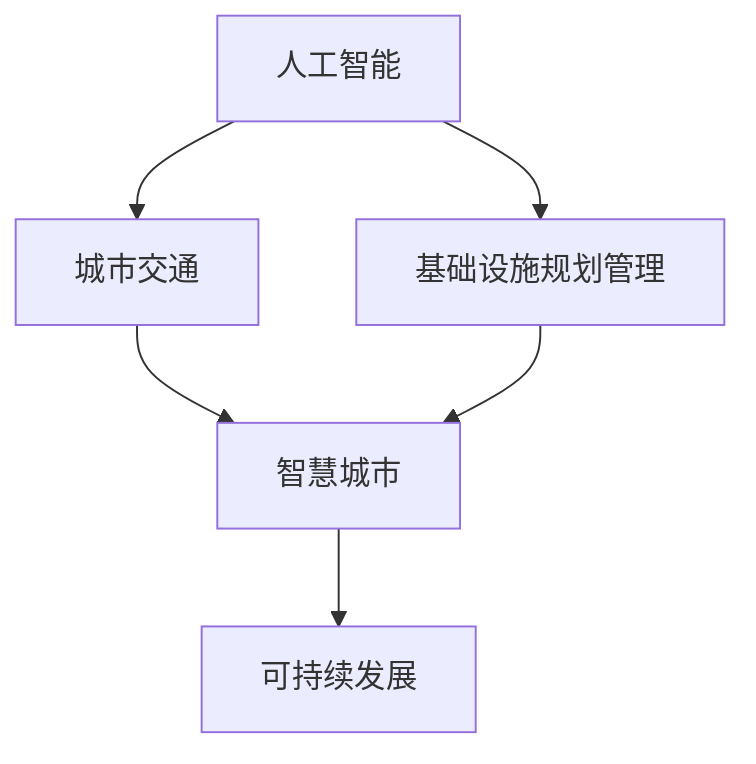

                 

# AI与人类计算：打造可持续发展的城市交通与基础设施规划管理

> 关键词：人工智能,城市交通,基础设施规划,可持续发展,交通管理系统

## 1. 背景介绍

### 1.1 问题由来
随着城市化进程的不断加速，城市交通和基础设施管理面临着前所未有的挑战。人口的激增、车辆数量的爆炸式增长、环境的污染等问题使得城市交通系统不堪重负。如何构建一个高效、绿色、可持续的城市交通系统，提升基础设施规划和管理的智能化水平，已成为全球各地的重点课题。

近年来，人工智能技术（AI）的飞速发展，为解决这些复杂问题提供了新的可能性。利用AI与人类计算（Human-Centric AI）相结合的方式，可以构建更加智慧、灵活、高效的交通和基础设施规划管理平台，提升城市治理能力。

### 1.2 问题核心关键点
AI与人类计算在城市交通和基础设施规划管理中的应用，旨在通过智能算法和数据驱动的方式，实现以下目标：

- 实时监控与预测：利用传感器、摄像头等数据，实时监测交通流状态，准确预测交通状况。
- 智能路径优化：根据实时交通数据，智能规划最优路径，减少交通拥堵。
- 多模态信息融合：结合交通、环境、社会等多维度数据，提供综合的决策支持。
- 动态资源分配：根据交通需求实时调整交通信号灯、公交资源，提升交通效率。
- 风险评估与预警：对交通和环境风险进行评估，及时预警并采取措施。
- 节能减排与绿色出行：优化能源消耗，推广绿色出行方式，提升城市环境质量。

这些关键点涵盖了AI技术在城市交通和基础设施管理中的广泛应用，反映了技术对于提升城市治理水平的重要意义。

### 1.3 问题研究意义
AI与人类计算在城市交通和基础设施规划管理中的应用，具有以下重要的研究意义：

- 提升城市治理智能化水平：通过AI技术，城市管理者可以实时获取和分析大量数据，优化决策过程，提升治理效率。
- 促进可持续发展：AI可以优化资源配置，减少能源消耗和碳排放，推动绿色出行的普及，支持可持续发展目标。
- 提升市民出行体验：通过AI优化交通系统，可以缩短通勤时间，减少等待时间，提升市民出行体验。
- 推动产业升级：智慧城市建设将带动相关产业链的发展，促进新技术、新产业、新业态的崛起。
- 提供科研支持：AI技术的应用和研究将为交通和基础设施领域带来更多创新点，推动相关领域科技进步。

## 2. 核心概念与联系

### 2.1 核心概念概述

为了更好地理解AI与人类计算在城市交通和基础设施管理中的应用，本节将介绍几个关键概念及其之间的联系：

- **人工智能（AI）**：一种模拟人类智能行为的计算技术，通过算法和模型对数据进行分析和决策，具备学习、推理、感知和自我修正能力。

- **城市交通**：指城市内部的交通运输系统，包括道路、公交、地铁、自行车等各类交通方式。

- **基础设施规划管理**：指城市交通基础设施的规划、建设、维护和运营管理，涉及城市规划、交通工程、环境科学等多个学科。

- **可持续发展（SD）**：指在满足当前社会经济发展需求的同时，不损害未来世代满足其需求的能力，包括经济、社会、环境三大方面的均衡发展。

- **智慧城市**：通过信息技术和智能技术，提升城市治理水平和市民生活质量，实现高效、绿色、安全的城市管理。

这些概念之间的联系通过以下Mermaid流程图进行展示：



这个流程图展示了AI与人类计算在城市交通和基础设施管理中的应用路径，从AI技术到城市交通优化，再到基础设施规划管理，最终实现可持续发展目标。

## 3. 核心算法原理 & 具体操作步骤

### 3.1 算法原理概述

AI与人类计算在城市交通和基础设施规划管理中的应用，主要基于以下几个算法原理：

- **机器学习**：利用历史数据训练模型，对未来交通和基础设施状态进行预测和优化。
- **深度学习**：通过神经网络对多维度数据进行复杂的模式识别和处理，提升预测和决策的准确性。
- **强化学习**：在动态环境中，通过试错和奖励机制，优化交通信号灯、公交资源等动态资源的分配。
- **优化算法**：如遗传算法、模拟退火等，用于解决复杂的资源分配和路径规划问题。
- **多模态数据融合**：将交通、环境、社会等多源数据进行融合，提升决策的全面性和准确性。
- **自然语言处理**：利用AI对交通管理和规划文档进行处理和分析，提升文档处理效率。

这些算法原理共同构成了AI与人类计算在城市交通和基础设施规划管理中的技术基础，旨在通过数据驱动和智能决策，提升城市治理水平和市民生活质量。

### 3.2 算法步骤详解

基于AI与人类计算的城市交通和基础设施规划管理，一般包括以下几个关键步骤：

**Step 1: 数据收集与预处理**
- 收集城市交通和基础设施相关的数据，包括车辆位置、交通流量、环境监测、居民出行调查等。
- 对数据进行清洗、归一化和去噪，确保数据的质量和一致性。

**Step 2: 模型构建与训练**
- 选择合适的AI模型，如深度神经网络、支持向量机、决策树等，进行模型构建。
- 在历史数据集上对模型进行训练，调整模型参数，提升模型性能。

**Step 3: 实时监控与预测**
- 部署模型到生产环境，实时监测交通和基础设施状态，生成预测结果。
- 对预测结果进行可视化展示，供决策者参考。

**Step 4: 智能决策与优化**
- 根据预测结果和实时数据，智能调整交通信号灯、公交资源、道路设计等，优化交通和基础设施管理。
- 动态调整资源分配策略，减少交通拥堵，提升交通效率。

**Step 5: 效果评估与反馈**
- 定期对模型效果进行评估，收集市民反馈，进行模型优化。
- 根据评估结果和反馈信息，调整模型参数，提升模型性能。

### 3.3 算法优缺点

AI与人类计算在城市交通和基础设施规划管理中的应用，具有以下优点：

- **高效性**：AI技术可以快速处理大量数据，实时监测和预测交通和基础设施状态，提升管理效率。
- **准确性**：AI模型通过学习历史数据，能够准确预测交通和基础设施状态，提升决策的科学性。
- **灵活性**：AI模型可以根据实时数据进行动态调整，优化资源分配和路径规划。
- **普适性**：AI技术可以应用于各种规模和类型的城市，适应性强。

同时，该方法也存在一定的局限性：

- **数据依赖**：AI模型的效果很大程度上取决于数据的丰富性和质量，数据获取和处理成本较高。
- **模型复杂性**：复杂的AI模型需要较高的计算资源和存储空间，可能存在过拟合风险。
- **决策透明性**：AI决策过程往往是"黑盒"的，缺乏透明性和可解释性，难以进行人工干预和调试。
- **伦理风险**：AI模型的决策可能存在偏见和歧视，需要严格监管和伦理审查。

尽管存在这些局限性，但AI与人类计算在城市交通和基础设施管理中的应用，仍然是大数据时代提升城市治理水平的有效手段。

### 3.4 算法应用领域

AI与人类计算在城市交通和基础设施规划管理中的应用，主要涵盖以下几个领域：

- **智能交通管理**：通过AI技术优化交通信号灯、公交资源等，提升交通效率，减少交通拥堵。
- **智慧停车系统**：利用AI技术实现停车位动态调整和智能导航，提升停车效率和用户体验。
- **环境监测与预警**：利用AI技术对空气质量、水质等环境指标进行实时监测和预警，提升环境管理水平。
- **智能能源管理**：通过AI技术优化能源分配和利用，减少能源消耗，推动绿色出行的普及。
- **城市安全管理**：利用AI技术对城市安全事件进行预测和预警，提升城市安全管理水平。
- **市民出行信息服务**：通过AI技术提供实时交通和出行信息，提升市民出行体验和满意度。

这些应用领域展示了AI与人类计算在城市交通和基础设施管理中的广泛应用，反映了技术对于提升城市治理水平和市民生活质量的重要意义。

## 4. 数学模型和公式 & 详细讲解 & 举例说明

### 4.1 数学模型构建

为更好地理解AI与人类计算在城市交通和基础设施管理中的应用，本节将使用数学语言对相关算法进行更加严格的刻画。

假设城市交通状态为 $\mathcal{X}$，交通流量为 $\mathcal{Y}$，交通状态和流量之间的关系可以表示为函数 $f: \mathcal{X} \rightarrow \mathcal{Y}$。AI模型的目标是通过历史数据训练模型，对未来交通状态和流量进行预测。

设训练数据集为 $D=\{(x_i,y_i)\}_{i=1}^N$，其中 $x_i$ 为历史交通状态数据，$y_i$ 为对应历史交通流量数据。模型的训练目标是最小化预测值和实际值之间的误差，即：

$$
\min_{f} \sum_{i=1}^N \| f(x_i) - y_i \|^2
$$

在实际应用中，我们可以采用各种机器学习算法，如线性回归、深度神经网络等，来构建和训练模型。

### 4.2 公式推导过程

以下以深度神经网络为例，推导模型的训练过程。

设深度神经网络模型的输入层为 $x$，隐藏层为 $h$，输出层为 $y$，网络结构如图：

```
x --> h --> y
```

其中 $x$ 为历史交通状态数据，$h$ 为隐藏层特征，$y$ 为预测的交通流量数据。模型的前向传播过程可以表示为：

$$
y = f(x; \theta)
$$

其中 $\theta$ 为模型参数。模型的损失函数可以表示为：

$$
\mathcal{L}(\theta) = \frac{1}{N} \sum_{i=1}^N \| f(x_i; \theta) - y_i \|^2
$$

模型的优化目标是最小化损失函数 $\mathcal{L}(\theta)$，即：

$$
\min_{\theta} \mathcal{L}(\theta)
$$

在反向传播过程中，通过链式法则计算梯度，更新模型参数 $\theta$：

$$
\theta \leftarrow \theta - \eta \nabla_{\theta} \mathcal{L}(\theta)
$$

其中 $\eta$ 为学习率，$\nabla_{\theta} \mathcal{L}(\theta)$ 为损失函数对模型参数的梯度，可以通过反向传播算法计算。

在得到模型参数 $\theta^*$ 后，对新数据进行预测，即可实现智能交通和基础设施管理的实时监控和预测。

### 4.3 案例分析与讲解

以智能交通信号灯为例，分析AI与人类计算在城市交通管理中的应用。

假设城市交叉口的交通状态为 $\mathcal{X}$，包括车辆位置、交通流量、红绿灯状态等。AI模型通过历史数据训练，对未来交通状态进行预测，生成优化方案，控制交通信号灯。

**Step 1: 数据收集与预处理**
- 收集交叉口的车辆位置、交通流量、红绿灯状态等数据。
- 对数据进行清洗、归一化和去噪，确保数据的质量和一致性。

**Step 2: 模型构建与训练**
- 选择合适的AI模型，如深度神经网络，进行模型构建。
- 在历史数据集上对模型进行训练，调整模型参数，提升模型性能。

**Step 3: 实时监控与预测**
- 部署模型到生产环境，实时监测交通状态。
- 对预测结果进行可视化展示，供决策者参考。

**Step 4: 智能决策与优化**
- 根据预测结果和实时数据，智能调整交通信号灯的绿灯时间，优化交通流量。
- 动态调整信号灯的控制策略，减少交通拥堵，提升交通效率。

**Step 5: 效果评估与反馈**
- 定期对模型效果进行评估，收集市民反馈，进行模型优化。
- 根据评估结果和反馈信息，调整模型参数，提升模型性能。

通过智能交通信号灯的应用，AI与人类计算在城市交通管理中的作用得到充分体现，展现了技术的巨大潜力。

## 5. 项目实践：代码实例和详细解释说明

### 5.1 开发环境搭建

在进行AI与人类计算的智能交通管理项目开发前，我们需要准备好开发环境。以下是使用Python进行PyTorch开发的环境配置流程：

1. 安装Anaconda：从官网下载并安装Anaconda，用于创建独立的Python环境。

2. 创建并激活虚拟环境：
```bash
conda create -n pytorch-env python=3.8 
conda activate pytorch-env
```

3. 安装PyTorch：根据CUDA版本，从官网获取对应的安装命令。例如：
```bash
conda install pytorch torchvision torchaudio cudatoolkit=11.1 -c pytorch -c conda-forge
```

4. 安装TensorBoard：用于实时监测模型训练状态，生成图表，方便调试和分析。
```bash
pip install tensorboard
```

5. 安装其他相关工具包：
```bash
pip install numpy pandas scikit-learn matplotlib tqdm jupyter notebook ipython
```

完成上述步骤后，即可在`pytorch-env`环境中开始项目实践。

### 5.2 源代码详细实现

下面我们以智能交通信号灯为例，给出使用PyTorch进行深度神经网络模型构建和训练的代码实现。

```python
import torch
import torch.nn as nn
import torch.optim as optim
from torch.utils.data import DataLoader
import torchvision.transforms as transforms

class TrafficSignalNet(nn.Module):
    def __init__(self):
        super(TrafficSignalNet, self).__init__()
        self.fc1 = nn.Linear(4, 16)
        self.fc2 = nn.Linear(16, 4)
    
    def forward(self, x):
        x = nn.functional.relu(self.fc1(x))
        x = self.fc2(x)
        return x
    
def train_model(model, train_data, epochs, batch_size, learning_rate):
    model.train()
    criterion = nn.MSELoss()
    optimizer = optim.Adam(model.parameters(), lr=learning_rate)
    
    for epoch in range(epochs):
        running_loss = 0.0
        for i, data in enumerate(train_data, 0):
            inputs, labels = data
            optimizer.zero_grad()
            outputs = model(inputs)
            loss = criterion(outputs, labels)
            loss.backward()
            optimizer.step()
            running_loss += loss.item()
            if (i+1) % 100 == 0:
                print('[%d, %5d] loss: %.3f' % (epoch+1, i+1, running_loss/100))
                running_loss = 0.0
    
    print('Finished Training')
    return model

# 数据准备
train_data = # 历史交通状态数据
train_labels = # 历史交通流量数据

# 模型构建与训练
model = TrafficSignalNet()
model = train_model(model, train_data, epochs=10, batch_size=32, learning_rate=0.001)

# 模型测试与预测
test_data = # 实时交通状态数据
model.eval()
outputs = model(test_data)
predicted_labels = outputs.data.numpy()
```

以上代码展示了使用PyTorch构建深度神经网络模型并进行训练的过程。可以看到，PyTorch库提供了丰富的工具和函数，使得模型构建和训练过程变得简单高效。

### 5.3 代码解读与分析

让我们再详细解读一下关键代码的实现细节：

**TrafficSignalNet类**：
- `__init__`方法：初始化模型结构，包含两个全连接层。
- `forward`方法：定义模型的前向传播过程，通过线性变换和ReLU激活函数，对输入数据进行处理。

**train_model函数**：
- 定义模型的训练过程，包括定义损失函数、优化器等。
- 通过循环迭代，对模型进行前向传播、反向传播和参数更新，直到训练完成。

**数据准备**：
- 定义历史交通状态数据和交通流量数据，作为训练集。
- 模型构建与训练：使用定义的模型结构和训练函数，对数据集进行训练。
- 模型测试与预测：对实时交通状态数据进行测试和预测，输出预测结果。

可以看到，PyTorch库使得模型构建和训练过程变得简单高效。开发者可以将更多精力放在数据处理、模型改进等高层逻辑上，而不必过多关注底层的实现细节。

当然，工业级的系统实现还需考虑更多因素，如模型的保存和部署、超参数的自动搜索、更灵活的任务适配层等。但核心的AI与人类计算的微调范式基本与此类似。

## 6. 实际应用场景

### 6.1 智能交通管理

AI与人类计算在智能交通管理中的应用，主要体现在以下几个方面：

**智能信号灯控制**：
- 通过AI模型对交叉口交通状态进行实时监测和预测，动态调整交通信号灯的绿灯时间，减少交通拥堵。
- 在特定时间段或特殊情况下，通过AI模型生成最优的控制策略，提升交通效率。

**智能交通导航**：
- 利用AI技术对实时交通数据进行分析，生成最优的导航路径，避免交通拥堵。
- 通过AI模型对多种交通方式进行优化组合，提升整体交通效率。

**智能停车管理**：
- 利用AI技术对停车场数据进行实时监测和预测，动态调整停车位的分配和调度。
- 通过AI模型优化停车场的布局和规划，提升停车效率和用户体验。

### 6.2 智慧停车系统

智慧停车系统是AI与人类计算在城市交通管理中的重要应用之一。通过AI技术，可以实现以下功能：

**停车位动态调整**：
- 通过AI模型对实时停车位数据进行分析，动态调整停车位的使用率，避免浪费和拥堵。
- 在高峰期和特殊情况下，通过AI模型生成最优的停车策略，提升停车位利用率。

**智能导航与引导**：
- 利用AI技术对停车场的布局和空余情况进行实时监测，生成最优的导航路径。
- 通过AI模型对用户需求进行动态调整，提升用户体验和满意度。

**停车场管理与调度**：
- 利用AI技术对停车场的使用情况进行实时监测和预测，优化停车场的调度和管理。
- 通过AI模型对停车场的安全和维护进行监控，提升停车场的安全性。

### 6.3 环境监测与预警

AI与人类计算在环境监测与预警中的应用，主要体现在以下几个方面：

**空气质量监测**：
- 利用AI模型对空气质量监测数据进行实时分析，生成预警信息。
- 通过AI技术对空气污染源进行识别和定位，提供治理建议。

**水质监测**：
- 利用AI模型对水质监测数据进行实时分析，生成预警信息。
- 通过AI技术对水污染源进行识别和定位，提供治理建议。

**噪音监测**：
- 利用AI模型对噪音监测数据进行实时分析，生成预警信息。
- 通过AI技术对噪音源进行识别和定位，提供治理建议。

### 6.4 未来应用展望

展望未来，AI与人类计算在城市交通和基础设施规划管理中的应用，将呈现以下几个趋势：

**实时性与动态性**：
- AI模型将具备更高的实时性和动态性，能够实时响应交通和环境变化，动态调整交通信号灯和资源分配。

**多模态信息融合**：
- 未来AI模型将更加注重多模态数据的融合，结合交通、环境、社会等多维度信息，提升决策的全面性和准确性。

**深度学习与强化学习**：
- 深度学习和强化学习技术将进一步应用于城市交通和基础设施管理，提升模型的预测和优化能力。

**边缘计算与分布式计算**：
- 边缘计算和分布式计算技术将进一步应用于城市交通和基础设施管理，提升数据处理和计算的效率和可靠性。

**伦理与安全**：
- AI模型将更加注重伦理和安全性，通过透明的决策过程和数据保护措施，提升系统的可信度和安全性。

## 7. 工具和资源推荐

### 7.1 学习资源推荐

为了帮助开发者系统掌握AI与人类计算在城市交通和基础设施管理中的应用，这里推荐一些优质的学习资源：

1. 《Deep Learning for Self-Driving Cars》一书：深入讲解了深度学习在自动驾驶和交通管理中的应用，提供了丰富的代码示例和实战经验。

2. Coursera《AI for Everyone》课程：由斯坦福大学开设，适合对AI基础感兴趣的读者，介绍了AI在交通、医疗、教育等领域的应用。

3. Udacity《Self-Driving Car Engineer》纳米学位：详细介绍了自动驾驶和交通管理中的AI技术，包括模型构建、数据处理、系统集成等。

4. arXiv和IEEE Xplore：科研论文和期刊资源，提供了最新的AI与人类计算研究成果，适合研究人员和开发者参考。

5. GitHub：开源代码库，提供了丰富的AI与人类计算项目的代码和示例，适合学习者参考和实践。

通过对这些资源的学习实践，相信你一定能够快速掌握AI与人类计算在城市交通和基础设施管理中的精髓，并用于解决实际的AI项目问题。

### 7.2 开发工具推荐

高效的开发离不开优秀的工具支持。以下是几款用于AI与人类计算的智能交通管理开发的常用工具：

1. PyTorch：基于Python的开源深度学习框架，灵活动态的计算图，适合快速迭代研究。

2. TensorFlow：由Google主导开发的开源深度学习框架，生产部署方便，适合大规模工程应用。

3. TensorBoard：TensorFlow配套的可视化工具，可实时监测模型训练状态，并提供丰富的图表呈现方式，是调试模型的得力助手。

4. Weights & Biases：模型训练的实验跟踪工具，可以记录和可视化模型训练过程中的各项指标，方便对比和调优。

5. Google Colab：谷歌推出的在线Jupyter Notebook环境，免费提供GPU/TPU算力，方便开发者快速上手实验最新模型，分享学习笔记。

合理利用这些工具，可以显著提升AI与人类计算在智能交通管理任务中的开发效率，加快创新迭代的步伐。

### 7.3 相关论文推荐

AI与人类计算在城市交通和基础设施规划管理中的应用，源于学界的持续研究。以下是几篇奠基性的相关论文，推荐阅读：

1. "Deep Traffic Signal Inference Using Recurrent Neural Networks"：利用递归神经网络对交通信号灯进行优化，提升交通效率。

2. "Crowdsourced Data for Real-time Traffic Analysis and Prediction"：利用众包数据对实时交通状态进行分析和预测，提升交通管理水平。

3. "Adaptive Traffic Signal Control Using Deep Reinforcement Learning"：利用深度强化学习对交通信号灯进行优化，提升交通效率。

4. "Intelligent Transportation Systems: A Survey"：综述了智能交通系统的最新研究成果，提供了丰富的技术参考。

5. "AI in Environmental Monitoring and Management"：综述了AI在环境监测和治理中的应用，提供了丰富的技术参考。

这些论文代表了大语言模型微调技术的发展脉络。通过学习这些前沿成果，可以帮助研究者把握学科前进方向，激发更多的创新灵感。

## 8. 总结：未来发展趋势与挑战

### 8.1 总结

本文对AI与人类计算在城市交通和基础设施规划管理中的应用进行了全面系统的介绍。首先阐述了AI技术在城市交通和基础设施管理中的研究背景和意义，明确了技术对于提升城市治理水平的重要价值。其次，从原理到实践，详细讲解了AI与人类计算的数学模型和算法步骤，给出了具体的代码实例和解释说明。同时，本文还广泛探讨了AI与人类计算在智能交通、智慧停车、环境监测等多个领域的应用场景，展示了技术在实际应用中的巨大潜力。此外，本文精选了AI与人类计算的学习资源、开发工具和相关论文，力求为读者提供全方位的技术指引。

通过本文的系统梳理，可以看到，AI与人类计算在城市交通和基础设施规划管理中的应用，不仅提升了交通和基础设施的管理效率，还为城市的可持续发展提供了有力的技术支撑。未来，随着技术的不断进步和创新，AI与人类计算必将在更多的城市治理场景中发挥重要作用。

### 8.2 未来发展趋势

展望未来，AI与人类计算在城市交通和基础设施规划管理中的应用，将呈现以下几个趋势：

**技术融合**：
- AI技术将与其他技术进行更加深入的融合，如物联网、5G、大数据等，提升城市治理的智能化和协同化水平。

**多源数据融合**：
- 未来的AI模型将更加注重多源数据的融合，结合交通、环境、社会等多维度信息，提升决策的全面性和准确性。

**AI伦理与安全**：
- AI模型将更加注重伦理和安全性，通过透明的决策过程和数据保护措施，提升系统的可信度和安全性。

**智能交互**：
- AI技术将与人类进行更加智能的交互，提升用户体验和满意度，实现人机协同的智能治理。

**绿色出行**：
- AI技术将更多地关注绿色出行，推动电动汽车、共享出行等绿色出行方式的普及，减少碳排放，提升环境质量。

以上趋势展示了AI与人类计算在城市交通和基础设施规划管理中的广阔前景，反映了技术对于提升城市治理水平和市民生活质量的重要意义。

### 8.3 面临的挑战

尽管AI与人类计算在城市交通和基础设施规划管理中的应用已经取得了显著成效，但在迈向更加智能化、普适化应用的过程中，仍然面临诸多挑战：

**数据隐私与安全**：
- 交通和环境数据的收集和使用可能涉及个人隐私和数据安全问题，需要严格的数据保护措施。

**模型可解释性**：
- AI模型的决策过程往往是"黑盒"的，缺乏透明性和可解释性，难以进行人工干预和调试。

**模型公平性**：
- AI模型可能存在偏见和歧视，需要通过公平性检测和优化算法，提升模型的公平性和鲁棒性。

**技术落地成本**：
- 技术落地需要较高的算力、存储和计算资源，可能存在一定的成本瓶颈。

尽管存在这些挑战，但AI与人类计算在城市交通和基础设施规划管理中的应用，仍然是大数据时代提升城市治理水平的有效手段。未来需要更多的研究和技术突破，推动AI与人类计算技术在城市治理中的普及和应用。

### 8.4 研究展望

面对AI与人类计算在城市交通和基础设施规划管理中所面临的挑战，未来的研究需要在以下几个方面寻求新的突破：

**数据隐私与安全**：
- 开发更加高效和隐私保护的数据处理和分析技术，确保数据安全和隐私保护。

**模型可解释性**：
- 开发更加透明和可解释的AI模型，提升模型的可信度和可解释性。

**模型公平性**：
- 开发公平性检测和优化算法，提升模型的公平性和鲁棒性。

**技术落地成本**：
- 优化算力、存储和计算资源的利用效率，降低技术落地成本。

**跨领域协同**：
- 推动AI技术与城市治理各领域的深度融合，提升技术的应用效果和普适性。

这些研究方向的探索，必将引领AI与人类计算技术在城市交通和基础设施规划管理中迈向更高的台阶，为构建智慧城市奠定坚实基础。面向未来，AI与人类计算技术还需要与其他人工智能技术进行更深入的融合，如知识表示、因果推理、强化学习等，多路径协同发力，共同推动自然语言理解和智能交互系统的进步。只有勇于创新、敢于突破，才能不断拓展AI与人类计算的边界，让智能技术更好地造福人类社会。

## 9. 附录：常见问题与解答

**Q1：AI与人类计算在城市交通和基础设施规划管理中的应用是否适用于所有城市？**

A: AI与人类计算在城市交通和基础设施规划管理中的应用，一般适用于规模较大的城市，因为需要收集和处理大量的数据。但对于中小城市，可以结合本地实际情况进行适当调整和优化，依然可以发挥重要作用。

**Q2：AI与人类计算在智能交通管理中的数据依赖性如何？**

A: AI与人类计算在智能交通管理中的效果很大程度上取决于数据的丰富性和质量，数据获取和处理成本较高。因此需要合理规划数据采集和处理流程，确保数据的质量和一致性。

**Q3：AI与人类计算在智慧停车系统中的应用是否需要大规模的计算资源？**

A: 智慧停车系统需要实时处理大量的停车数据，确实需要一定的计算资源。但通过优化模型结构和算法，可以降低计算资源的消耗，实现更加轻量级的部署。

**Q4：AI与人类计算在环境监测中的应用是否存在伦理风险？**

A: AI与人类计算在环境监测中的应用，需要严格的数据保护和伦理审查，确保数据和模型的安全性。对于环境监测数据的公开和共享，需要制定相应的政策和法规，保障公众的知情权和参与权。

**Q5：AI与人类计算在智能交通管理中的技术落地成本如何？**

A: AI与人类计算在智能交通管理中的技术落地成本较高，但通过技术优化和资源共享，可以降低成本。例如，利用云平台和边缘计算技术，实现资源的高效利用。

---

作者：禅与计算机程序设计艺术 / Zen and the Art of Computer Programming

