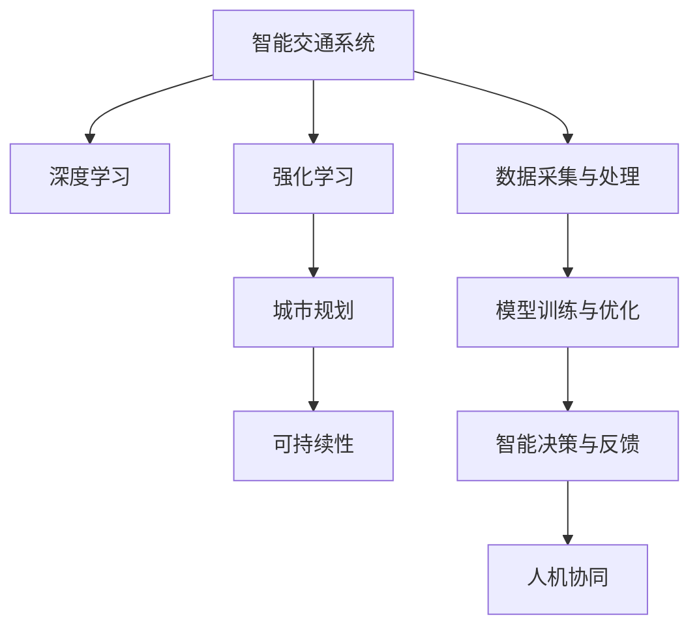

                 

# AI与人类计算：打造可持续发展的城市交通与规划

> 关键词：人工智能(AI)、城市规划、交通管理、可持续性、智能交通系统(ITS)

## 1. 背景介绍

随着城市化的加速和交通需求的增长，如何构建一个高效、便捷、可持续的城市交通体系，成为了全球城市管理者面临的重大挑战。传统城市交通规划依赖于经验丰富的专家进行模拟和预测，但在复杂的交通动态下，精确度和实时性往往不足。因此，结合人工智能技术，利用AI的力量，对交通数据进行高效分析，优化城市规划和交通管理，成为了解决城市交通问题的关键。

### 1.1 问题由来

城市交通问题主要体现在交通拥堵、空气污染、资源浪费等方面。这些问题不仅影响到城市居民的生活质量，还对城市经济、环境和社会可持续发展带来巨大挑战。传统交通规划主要依赖于经验模型，在动态性、精确性和实时性上存在较大不足。而人工智能技术，尤其是AI在数据分析、预测、优化方面的优势，为其提供了一个极佳的应用场景。

### 1.2 问题核心关键点

现代城市交通问题的解决需要综合运用AI技术和人类经验。核心在于以下几个关键点：
1. **数据采集与处理**：通过物联网、传感器等技术，实时采集交通数据，包括车流量、交通速度、空气质量等。
2. **模型训练与优化**：使用AI算法，如深度学习、强化学习等，训练交通模型，优化交通策略。
3. **智能决策与反馈**：基于实时数据，智能决策交通信号控制、路网调整等，并实时反馈优化效果。
4. **人机协同**：将AI技术与人类专业知识和经验相结合，形成人机协同的智能交通体系。

## 2. 核心概念与联系

### 2.1 核心概念概述

为更好地理解AI在城市交通与规划中的应用，本节将介绍几个密切相关的核心概念：

- **智能交通系统(ITS)**：通过集成先进的AI技术，包括传感器、通信、计算等，实现交通信号控制、路网管理、公交调度等功能的智能交通系统。
- **深度学习(DL)**：一类基于多层神经网络的机器学习方法，通过训练海量数据，提取特征，实现高效的数据分析和预测。
- **强化学习(RL)**：通过试错过程，不断优化模型决策策略的学习方法，适用于交通信号控制、路线优化等问题。
- **城市规划**：包括城市布局、土地利用、交通网络规划等，旨在提升城市的可持续性和居民生活质量。
- **可持续性(Sustainability)**：强调环境保护、资源利用、社会公平等，是城市规划和交通管理的核心目标。

这些核心概念之间的逻辑关系可以通过以下Mermaid流程图来展示：



这个流程图展示了智能交通系统如何通过AI技术实现可持续城市规划和管理的全过程。

## 3. 核心算法原理 & 具体操作步骤
### 3.1 算法原理概述

AI在城市交通与规划中的应用，主要通过数据驱动的模型训练与优化实现。其核心思想是：

1. **数据采集与处理**：通过物联网、传感器等技术，实时采集交通数据。
2. **模型训练与优化**：使用AI算法，如深度学习、强化学习等，训练交通模型，优化交通策略。
3. **智能决策与反馈**：基于实时数据，智能决策交通信号控制、路网调整等，并实时反馈优化效果。
4. **人机协同**：将AI技术与人类专业知识和经验相结合，形成人机协同的智能交通体系。

形式化地，假设智能交通系统中的交通状态为 $X$，交通模型为 $f$，交通控制策略为 $p$，环境状态为 $E$，可持续性目标为 $T$。则智能交通系统的目标可以表述为：

$$
\min_{p} \mathcal{L}(f(X,p),T) = \min_{p} \sum_{i=1}^N (T_i - f_i(X_i,p))^2
$$

其中 $\mathcal{L}$ 为损失函数，$T_i$ 为可持续性目标的期望值，$f_i$ 为交通模型的输出。优化目标是寻找最优的交通控制策略 $p$，使得交通系统的可持续性目标 $T$ 与实际情况尽可能接近。

### 3.2 算法步骤详解

基于AI的城市交通与规划通常包括以下几个关键步骤：

**Step 1: 数据采集与处理**

1. **数据来源**：收集城市交通数据，包括车流量、交通速度、空气质量、天气条件等。
2. **数据清洗**：去除异常值、缺失值，确保数据质量。
3. **数据存储与预处理**：建立数据存储系统，将数据划分为训练集、验证集和测试集，进行归一化、标准化等预处理。

**Step 2: 模型训练与优化**

1. **模型选择**：根据具体问题选择合适的AI算法，如深度学习模型、强化学习模型等。
2. **模型训练**：使用训练集数据，通过反向传播算法、强化学习等优化模型参数，最小化损失函数。
3. **模型验证**：在验证集上评估模型性能，调整模型参数，防止过拟合。
4. **模型测试**：在测试集上评估模型效果，确保模型泛化性能。

**Step 3: 智能决策与反馈**

1. **实时数据采集**：通过传感器、摄像头等实时采集交通数据。
2. **智能决策**：根据实时数据，智能决策交通信号控制、路网调整等。
3. **效果评估与反馈**：根据模型预测与实际效果对比，实时反馈优化策略，迭代优化模型。

**Step 4: 人机协同**

1. **专家知识整合**：将人类专家知识和经验整合到AI模型中，提升模型决策的准确性和合理性。
2. **人机交互界面**：设计人机交互界面，使专家能够实时监控模型输出，进行人工干预。
3. **反馈优化**：根据专家反馈，优化模型参数，提升模型性能。

以上是基于AI的城市交通与规划的一般流程。在实际应用中，还需要针对具体问题进行优化设计，如改进数据采集方法，选择更合适的算法，设计更智能的决策机制等。

### 3.3 算法优缺点

基于AI的城市交通与规划方法具有以下优点：

1. **高效性**：通过数据驱动的模型训练，能够高效处理和分析海量交通数据。
2. **实时性**：基于实时数据进行智能决策，能够快速响应交通动态变化。
3. **可扩展性**：AI模型可以扩展到不同规模和复杂度的交通系统，适应各种场景需求。
4. **灵活性**：通过调整模型参数和算法，适应不同的城市交通问题和规划目标。

同时，该方法也存在一定的局限性：

1. **数据质量依赖**：模型性能高度依赖于数据采集的质量和全面性。
2. **算法复杂度**：深度学习、强化学习等复杂算法需要大量计算资源。
3. **解释性不足**：AI模型的决策过程缺乏可解释性，难以理解和调试。
4. **伦理和安全问题**：AI模型可能存在偏见和有害信息，需加强监管和伦理审查。

尽管存在这些局限性，但就目前而言，基于AI的城市交通与规划方法仍是最主流范式。未来相关研究的重点在于如何进一步降低数据采集和处理的成本，提高模型可解释性和鲁棒性，同时兼顾伦理和安全性等因素。

### 3.4 算法应用领域

基于AI的城市交通与规划技术，已经在智能交通管理、智慧城市建设、绿色出行等方面得到了广泛应用，具体包括：

- **智能交通信号控制**：基于深度学习和强化学习，实时调整信号灯，优化交通流量，缓解拥堵。
- **智慧城市建设**：结合城市信息模型(CIM)，实现交通、水务、能源等领域的智能管理。
- **绿色出行**：通过数据分析，推荐低碳出行方式，促进城市可持续发展。
- **交通需求预测**：预测交通流量、出行方式等，优化交通规划。
- **公交智能调度**：利用AI技术，优化公交线路、发车时间等，提高公交效率。

除了上述这些经典应用外，AI技术还逐步拓展到更多领域，如智能停车管理、交通违规检测、智能驾驶等，为城市交通和规划带来新的突破。

## 4. 数学模型和公式 & 详细讲解 & 举例说明

### 4.1 数学模型构建

本节将使用数学语言对基于AI的城市交通与规划过程进行更加严格的刻画。

假设城市交通系统由 $n$ 个路段组成，交通状态 $X$ 表示为路段车流量 $f_1, f_2, ..., f_n$，环境状态 $E$ 表示为气象条件、道路施工等。交通模型 $f$ 为线性回归模型：

$$
f_i = \beta_0 + \sum_{j=1}^k \beta_j x_{ij} + \epsilon_i
$$

其中 $\beta_0, \beta_j$ 为模型参数，$x_{ij}$ 为影响因素，$\epsilon_i$ 为噪声。可持续性目标 $T$ 为最小化碳排放和出行时间，表示为：

$$
T = \sum_{i=1}^n w_{i1} C_i + w_{i2} T_i
$$

其中 $C_i$ 为路段碳排放，$T_i$ 为出行时间，$w_{i1}, w_{i2}$ 为权重。

优化目标为最小化 $T$ 与模型预测 $f$ 的差距：

$$
\min_{\beta} \mathcal{L}(T, f) = \min_{\beta} \sum_{i=1}^n (T_i - f_i)^2
$$

### 4.2 公式推导过程

以下我们以智能交通信号控制为例，推导基于深度学习的优化模型。

假设交通信号灯的信号周期为 $T$，每个信号灯有 $N$ 种状态，分别对应不同交通信号。目标是最小化每个信号灯的平均延迟时间：

$$
\min_{\theta} \sum_{i=1}^N \frac{1}{T} \sum_{t=1}^{T} \min_{j} \sum_{k=1}^n d_{ikj}(t)
$$

其中 $\theta$ 为模型参数，$d_{ikj}(t)$ 为在第 $t$ 个周期内，车辆在第 $i$ 个信号灯处的延迟时间，$k$ 为信号灯编号，$j$ 为信号灯状态编号。

将问题转化为多目标优化问题，构建损失函数：

$$
\mathcal{L}(\theta) = \sum_{i=1}^N \sum_{t=1}^T \frac{1}{n} \sum_{k=1}^n d_{ikj}(t)
$$

使用梯度下降算法，更新模型参数 $\theta$：

$$
\theta \leftarrow \theta - \eta \nabla_{\theta}\mathcal{L}(\theta)
$$

其中 $\eta$ 为学习率。

### 4.3 案例分析与讲解

以某城市中心区域的交通信号控制为例，使用深度学习模型训练最优信号控制策略。模型采用LSTM网络，输入为前10个周期的交通数据，输出为每个周期内各信号灯的开关状态。

首先，收集历史交通数据，包括车流量、交通速度、车辆类型等，进行数据清洗和预处理。然后，构建LSTM网络，使用交叉熵损失函数训练模型，最小化预测状态与实际状态的差距。

在训练过程中，通过提前结束训练和正则化技术，避免过拟合。训练完成后，将模型应用于实时交通数据，进行智能信号控制。通过对比模型预测与实际交通状态，评估模型效果，不断迭代优化模型参数。

最终，模型能够在高峰时段有效缓解交通拥堵，降低平均延迟时间，实现智能交通信号控制。

## 5. 项目实践：代码实例和详细解释说明
### 5.1 开发环境搭建

在进行AI在城市交通与规划的应用实践前，我们需要准备好开发环境。以下是使用Python进行TensorFlow开发的环境配置流程：

1. 安装Anaconda：从官网下载并安装Anaconda，用于创建独立的Python环境。

2. 创建并激活虚拟环境：
```bash
conda create -n ai-env python=3.8 
conda activate ai-env
```

3. 安装TensorFlow：根据CUDA版本，从官网获取对应的安装命令。例如：
```bash
conda install tensorflow tensorflow-gpu=2.7.0 -c tf
```

4. 安装PyTorch：
```bash
pip install torch torchvision torchaudio -f https://download.pytorch.org/whl/cu101/torch_stable.html
```

5. 安装各类工具包：
```bash
pip install numpy pandas scikit-learn matplotlib tqdm jupyter notebook ipython
```

完成上述步骤后，即可在`ai-env`环境中开始AI在城市交通与规划的实践。

### 5.2 源代码详细实现

这里我们以智能交通信号控制为例，给出使用TensorFlow实现深度学习模型的代码实现。

首先，定义信号灯状态和模型参数：

```python
import tensorflow as tf

# 信号灯状态
states = ['Green', 'Yellow', 'Red']

# 模型参数
theta = tf.Variable(tf.zeros([len(states), n_signals]), name='weights')
bias = tf.Variable(tf.zeros([len(states)]), name='bias')

# 信号灯状态字典
state_dict = {state: i for i, state in enumerate(states)}
```

然后，定义模型预测函数：

```python
def predict(signal_ids, traffic_data):
    # 信号灯状态编码
    signal_state = [state_dict[s] for s in signal_ids]

    # 交通数据处理
    data = tf.convert_to_tensor(traffic_data, dtype=tf.float32)
    data = tf.reshape(data, [-1, n_features])

    # 模型预测
    output = tf.matmul(data, theta) + bias
    predicted = tf.argmax(output, axis=1)

    return predicted, output
```

接着，定义训练和评估函数：

```python
def train(model, train_data, valid_data, test_data, batch_size=32, epochs=100, learning_rate=0.01):
    # 定义优化器
    optimizer = tf.keras.optimizers.Adam(learning_rate)

    # 训练过程
    for epoch in range(epochs):
        train_loss = 0
        for batch in train_data:
            signal_ids, traffic_data = batch
            with tf.GradientTape() as tape:
                predicted, output = predict(signal_ids, traffic_data)
                loss = tf.reduce_mean(tf.losses.sparse_categorical_crossentropy(tf.cast(target, tf.int32), output))

            gradients = tape.gradient(loss, [theta, bias])
            optimizer.apply_gradients(zip(gradients, [theta, bias]))
            train_loss += loss

        valid_loss = 0
        for batch in valid_data:
            signal_ids, traffic_data = batch
            with tf.GradientTape() as tape:
                predicted, output = predict(signal_ids, traffic_data)
                loss = tf.reduce_mean(tf.losses.sparse_categorical_crossentropy(tf.cast(target, tf.int32), output))

            gradients = tape.gradient(loss, [theta, bias])
            optimizer.apply_gradients(zip(gradients, [theta, bias]))
            valid_loss += loss

    # 测试过程
    test_loss = 0
    for batch in test_data:
        signal_ids, traffic_data = batch
        with tf.GradientTape() as tape:
            predicted, output = predict(signal_ids, traffic_data)
            loss = tf.reduce_mean(tf.losses.sparse_categorical_crossentropy(tf.cast(target, tf.int32), output))

        gradients = tape.gradient(loss, [theta, bias])
        optimizer.apply_gradients(zip(gradients, [theta, bias]))
        test_loss += loss

    print(f"Epoch {epoch+1}, train loss: {train_loss:.4f}, valid loss: {valid_loss:.4f}, test loss: {test_loss:.4f}")
```

最后，启动训练流程并在测试集上评估：

```python
train_data = ...
valid_data = ...
test_data = ...

train(model, train_data, valid_data, test_data)
```

以上就是使用TensorFlow对智能交通信号控制进行深度学习模型训练的完整代码实现。可以看到，借助TensorFlow的强大封装，我们可以用相对简洁的代码完成模型的定义、训练和评估。

### 5.3 代码解读与分析

让我们再详细解读一下关键代码的实现细节：

**predict函数**：
- 定义信号灯状态和模型参数。
- 定义信号灯状态字典，将信号灯状态编码为整数。
- 将交通数据转换为TensorFlow张量，进行归一化处理。
- 定义模型预测函数，将交通数据输入模型，输出预测状态。

**train函数**：
- 定义优化器，使用Adam算法。
- 训练过程中，在每个epoch迭代所有批次的训练数据，计算梯度并更新模型参数。
- 验证过程中，在验证集上评估模型性能，防止过拟合。
- 测试过程中，在测试集上评估模型效果。

**训练流程**：
- 定义总的epoch数和批大小，开始循环迭代。
- 在每个epoch内，训练模型并记录训练损失和验证损失。
- 在训练完成后，测试模型并记录测试损失。
- 打印输出训练、验证和测试损失。

可以看到，TensorFlow使得深度学习模型的训练和评估变得简洁高效。开发者可以将更多精力放在数据处理、模型改进等高层逻辑上，而不必过多关注底层的实现细节。

当然，工业级的系统实现还需考虑更多因素，如模型的保存和部署、超参数的自动搜索、更灵活的任务适配层等。但核心的AI在交通与规划的微调范式基本与此类似。

## 6. 实际应用场景
### 6.1 智能交通信号控制

智能交通信号控制是AI在城市交通与规划中最为典型的应用。通过深度学习模型，实时分析交通数据，预测交通流量，智能调整信号灯控制策略，能够显著缓解交通拥堵，提高道路通行效率。

在实际应用中，智能信号控制系统通常部署在城市主要交叉口，通过摄像头、传感器等采集实时交通数据，输入到深度学习模型中进行预测。模型输出信号灯控制状态，驱动信号灯控制器执行。同时，系统会根据实时反馈不断调整模型参数，优化信号控制策略。

### 6.2 交通需求预测

交通需求预测是城市交通规划的重要环节，通过预测未来一段时间内交通需求，为城市布局、资源分配等提供决策依据。AI技术，特别是深度学习模型，能够高效处理海量交通数据，挖掘数据背后的规律和趋势。

以某城市的交通需求预测为例，收集历史交通数据，包括车流量、出行时间、天气条件等，训练深度学习模型进行需求预测。模型可以输出不同时间段的交通需求量，辅助城市规划师进行交通资源分配和调度。

### 6.3 智慧城市建设

智慧城市建设是AI在城市交通与规划中的重要应用领域，通过集成各类AI技术，实现城市信息模型(CIM)的智能化。CIM将城市中的交通、水务、能源等各类信息统一建模，提供实时动态的城市数据支持。

在智慧城市建设中，AI技术广泛应用于交通管理、环境监测、公共服务等领域。例如，通过AI技术，实时监测城市道路状况，预测交通拥堵，优化路线规划，提升城市运行效率。同时，AI技术还可用于智慧安防、智慧医疗、智慧教育等，为城市居民提供更加便捷和高效的服务。

### 6.4 未来应用展望

随着AI技术的不断演进，基于AI的城市交通与规划技术将迎来更多创新和突破，具体包括：

1. **多模态交通数据融合**：结合GPS、摄像头、雷达等多模态数据，提升交通分析的准确性和全面性。
2. **实时交通动态模拟**：通过动态仿真，实时模拟交通流，优化交通信号控制和路线规划。
3. **AI辅助城市规划**：利用AI技术，优化城市布局、土地利用、基础设施建设等，实现可持续城市规划。
4. **智能驾驶与自动驾驶**：结合AI技术和自动驾驶技术，实现智能驾驶、自动驾驶，提升交通安全和效率。
5. **车联网与智能交通管理**：通过车联网技术，实现车辆间通信、智能停车管理，提升交通管理水平。

未来，AI技术将在城市交通与规划中发挥更加重要的作用，助力城市向智能化、绿色化方向发展，提升城市居民的生活质量。

## 7. 工具和资源推荐
### 7.1 学习资源推荐

为了帮助开发者系统掌握AI在城市交通与规划中的应用，这里推荐一些优质的学习资源：

1. **《深度学习入门》**：李沐等著，全面介绍深度学习原理和应用，适合初学者入门。
2. **CS231n《计算机视觉：从卷积神经网络到端到端学习》**：斯坦福大学开设的计算机视觉课程，涵盖深度学习、图像处理等内容。
3. **《Python深度学习》**：Francois Chollet著，详细介绍TensorFlow、Keras等深度学习框架的使用。
4. **《城市交通规划》**：王崇辉等著，介绍城市交通规划的理论和实践，结合AI技术进行应用。
5. **智慧城市创新竞赛**：各大城市举办的城市管理智能化竞赛，提供大量实践机会和案例学习。

通过对这些资源的学习实践，相信你一定能够快速掌握AI在城市交通与规划中的应用技巧，并用于解决实际的交通问题。

### 7.2 开发工具推荐

高效的开发离不开优秀的工具支持。以下是几款用于AI在城市交通与规划开发的常用工具：

1. **TensorFlow**：由Google主导开发的深度学习框架，支持分布式计算，适合大规模工程应用。
2. **PyTorch**：由Facebook主导开发的深度学习框架，灵活高效，适合快速迭代研究。
3. **CIMSIM**：城市信息模型模拟软件，支持多模态数据集成，提供智能交通分析功能。
4. **MATLAB**：Simulink、Optimization Toolbox等工具，支持动态仿真和优化分析。
5. **Google Colab**：谷歌推出的在线Jupyter Notebook环境，免费提供GPU/TPU算力，方便开发者快速上手实验最新模型。

合理利用这些工具，可以显著提升AI在城市交通与规划开发的效率，加快创新迭代的步伐。

### 7.3 相关论文推荐

AI在城市交通与规划技术的发展源于学界的持续研究。以下是几篇奠基性的相关论文，推荐阅读：

1. **Traffic Flow Estimation and Prediction with Deep Learning**：使用深度学习模型预测交通流量，提高交通分析的精度和效率。
2. **Intelligent Traffic Light Control with Deep Reinforcement Learning**：通过强化学习优化信号灯控制策略，缓解交通拥堵，提升通行效率。
3. **AI for Smart City Planning**：探讨AI技术在城市规划中的应用，包括交通管理、环境监测、公共服务等。
4. **CityQMC: A Citywide Multimodal Dataset for Smart City AI**：构建多模态智能城市数据集，支持各类AI技术的研究和应用。
5. **Learning to Manage Urban Traffic**：基于深度学习的城市交通管理优化方法，实现智能信号控制和路线规划。

这些论文代表了大规模AI在城市交通与规划技术的发展脉络。通过学习这些前沿成果，可以帮助研究者把握学科前进方向，激发更多的创新灵感。

## 8. 总结：未来发展趋势与挑战

### 8.1 总结

本文对基于AI的城市交通与规划方法进行了全面系统的介绍。首先阐述了AI技术在城市交通与规划中的研究背景和应用意义，明确了AI技术在提升交通管理效率、优化城市规划等方面的独特价值。其次，从原理到实践，详细讲解了AI在交通信号控制、需求预测、智慧城市建设等具体场景中的应用，给出了完整的代码实例。同时，本文还探讨了AI在城市交通与规划中的未来发展趋势和面临的挑战。

通过本文的系统梳理，可以看到，AI技术在城市交通与规划中的应用正处于蓬勃发展阶段，通过数据驱动的模型训练与优化，能够高效处理和分析海量交通数据，优化城市交通和规划决策，提升城市运行效率和可持续性。未来，随着AI技术的不断演进，基于AI的城市交通与规划技术将持续创新突破，为构建安全、高效、绿色的智能交通体系提供强有力的技术支撑。

### 8.2 未来发展趋势

展望未来，AI在城市交通与规划技术将呈现以下几个发展趋势：

1. **多模态数据融合**：结合GPS、摄像头、雷达等多模态数据，提升交通分析的全面性和准确性。
2. **实时动态仿真**：通过动态仿真，实时模拟交通流，优化交通信号控制和路线规划。
3. **AI辅助城市规划**：利用AI技术，优化城市布局、土地利用、基础设施建设等，实现可持续城市规划。
4. **智能驾驶与自动驾驶**：结合AI技术和自动驾驶技术，实现智能驾驶、自动驾驶，提升交通安全和效率。
5. **车联网与智能交通管理**：通过车联网技术，实现车辆间通信、智能停车管理，提升交通管理水平。
6. **智慧城市建设**：通过AI技术，实现城市信息模型(CIM)的智能化，提供实时动态的城市数据支持。

这些趋势凸显了AI技术在城市交通与规划中的广阔前景。未来，AI技术将与更多学科交叉融合，形成更加全面、高效的城市交通与规划解决方案。

### 8.3 面临的挑战

尽管AI在城市交通与规划技术已经取得了显著成果，但在迈向更加智能化、普适化应用的过程中，仍然面临诸多挑战：

1. **数据质量依赖**：模型性能高度依赖于数据采集的质量和全面性，数据缺失或噪声将影响模型效果。
2. **算法复杂度**：深度学习、强化学习等复杂算法需要大量计算资源，大规模部署可能面临硬件瓶颈。
3. **解释性不足**：AI模型的决策过程缺乏可解释性，难以理解和调试，可能影响决策信任度。
4. **伦理和安全问题**：AI模型可能存在偏见和有害信息，需加强监管和伦理审查，确保输出安全。
5. **动态变化应对**：交通系统动态性强，AI模型需要具备较高的实时性和自适应性，以应对不断变化的交通需求。

尽管存在这些挑战，但通过持续的算法优化、模型改进和制度完善，相信这些难题终将逐步得到解决。AI技术在城市交通与规划中的应用前景广阔，未来将持续推动城市向智能化、绿色化方向发展。

### 8.4 研究展望

未来，AI在城市交通与规划领域的研究重点应聚焦以下几个方面：

1. **参数高效与计算高效**：开发更加参数高效和计算高效的模型，提高资源利用效率，降低计算成本。
2. **多领域知识融合**：结合符号化的先验知识，如知识图谱、逻辑规则等，增强模型决策的合理性和解释性。
3. **人机协同与智能驾驶**：探索人机协同的智能交通体系，研究智能驾驶与自动驾驶技术，提升交通安全和效率。
4. **动态优化与自适应**：开发具备自适应能力的模型，能够实时动态优化交通管理策略，提升应对能力。
5. **绿色交通与可持续发展**：结合绿色交通理念，研究低碳出行、节能减排等技术，推动城市向可持续方向发展。
6. **伦理审查与规范制度**：建立AI技术的伦理审查机制，制定相关规范制度，确保技术应用符合伦理和社会价值观。

通过这些研究方向的研究突破，相信AI在城市交通与规划技术将迎来新的突破，为构建安全、高效、绿色的智能交通体系提供更加坚实的技术保障。

## 9. 附录：常见问题与解答

**Q1: AI在城市交通与规划中的主要优势是什么？**

A: AI在城市交通与规划中的主要优势包括：
1. **数据驱动**：通过分析海量交通数据，挖掘数据背后的规律和趋势，提升决策的准确性。
2. **实时响应**：通过实时数据采集和处理，快速响应交通动态变化，提高交通管理效率。
3. **自动化优化**：利用AI技术，自动优化交通信号控制、路线规划等，提升系统性能。
4. **多领域融合**：结合多模态数据，提升交通分析的全面性和准确性。
5. **人机协同**：结合人类专业知识和经验，形成人机协同的智能交通体系，提升决策合理性。

**Q2: AI在城市交通与规划中面临的主要挑战是什么？**

A: AI在城市交通与规划中面临的主要挑战包括：
1. **数据质量依赖**：模型性能高度依赖于数据采集的质量和全面性，数据缺失或噪声将影响模型效果。
2. **算法复杂度**：深度学习、强化学习等复杂算法需要大量计算资源，大规模部署可能面临硬件瓶颈。
3. **解释性不足**：AI模型的决策过程缺乏可解释性，难以理解和调试，可能影响决策信任度。
4. **伦理和安全问题**：AI模型可能存在偏见和有害信息，需加强监管和伦理审查，确保输出安全。
5. **动态变化应对**：交通系统动态性强，AI模型需要具备较高的实时性和自适应性，以应对不断变化的交通需求。

**Q3: AI在城市交通与规划中如何进行数据预处理？**

A: AI在城市交通与规划中进行数据预处理，通常包括：
1. **数据清洗**：去除异常值、缺失值，确保数据质量。
2. **数据归一化**：将不同来源的数据归一化到相同的量纲，便于模型训练。
3. **特征工程**：提取、选择和构建特征，提升模型效果。
4. **数据增强**：通过数据增强技术，扩充训练集，提高模型泛化性能。
5. **多模态融合**：结合GPS、摄像头、雷达等多模态数据，提升交通分析的全面性和准确性。

**Q4: AI在城市交通与规划中的应用场景有哪些？**

A: AI在城市交通与规划中的应用场景包括：
1. **智能交通信号控制**：通过深度学习模型，实时调整信号灯控制策略，缓解交通拥堵。
2. **交通需求预测**：使用AI模型，预测未来一段时间内交通需求，为城市布局、资源分配等提供决策依据。
3. **智慧城市建设**：通过集成各类AI技术，实现城市信息模型(CIM)的智能化，提升城市运行效率。
4. **智能驾驶与自动驾驶**：结合AI技术和自动驾驶技术，实现智能驾驶、自动驾驶，提升交通安全和效率。
5. **车联网与智能交通管理**：通过车联网技术，实现车辆间通信、智能停车管理，提升交通管理水平。

**Q5: AI在城市交通与规划中的未来展望是什么？**

A: AI在城市交通与规划中的未来展望包括：
1. **多模态数据融合**：结合GPS、摄像头、雷达等多模态数据，提升交通分析的全面性和准确性。
2. **实时动态仿真**：通过动态仿真，实时模拟交通流，优化交通信号控制和路线规划。
3. **AI辅助城市规划**：利用AI技术，优化城市布局、土地利用、基础设施建设等，实现可持续城市规划。
4. **智能驾驶与自动驾驶**：结合AI技术和自动驾驶技术，实现智能驾驶、自动驾驶，提升交通安全和效率。
5. **车联网与智能交通管理**：通过车联网技术，实现车辆间通信、智能停车管理，提升交通管理水平。

通过这些研究方向的研究突破，相信AI在城市交通与规划技术将迎来新的突破，为构建安全、高效、绿色的智能交通体系提供更加坚实的技术保障。

---

作者：禅与计算机程序设计艺术 / Zen and the Art of Computer Programming

